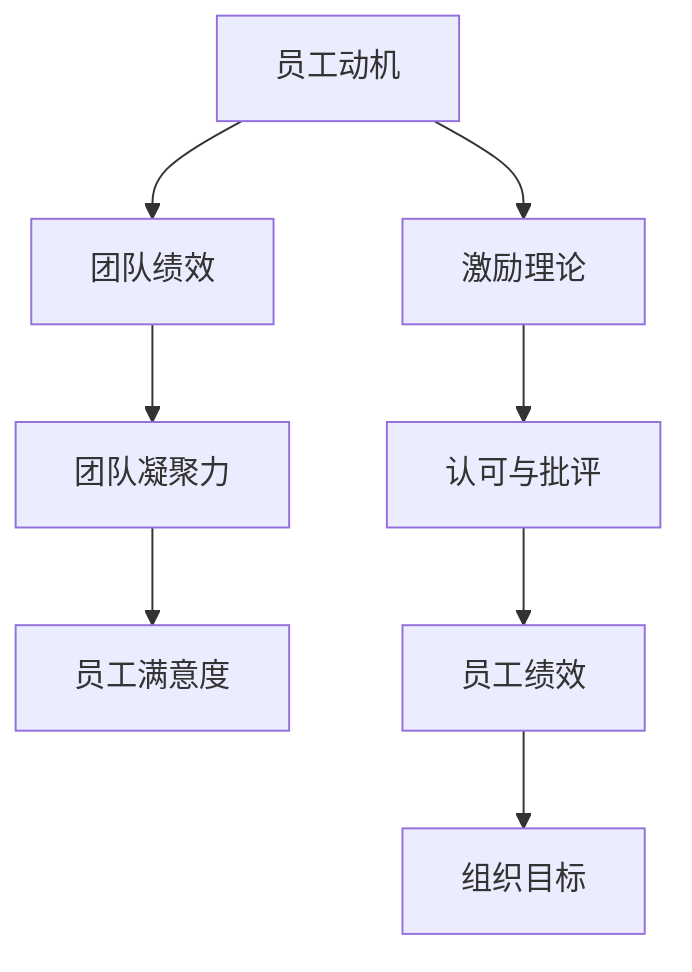

                 

### 文章标题：团队激励：认可与批评的艺术

#### 关键词：团队激励、认可、批评、心理学、领导力

> 摘要：本文深入探讨团队激励中认可与批评的艺术。通过分析理论基础、实践方法、案例研究和项目实战，阐述如何科学地运用认可与批评来提升团队绩效和成员满意度。文章旨在为IT领域领导者和管理者提供实用的指导，帮助他们构建高效、和谐的团队文化。

---

### 引言

在当今快节奏、竞争激烈的工作环境中，团队激励成为企业提升绩效和保持竞争优势的关键因素。团队激励不仅关乎员工的个人成长，更影响整个团队的合作效率和创造力。本文将聚焦于团队激励中的两大核心要素：认可与批评。

#### 什么是认可与批评？

- **认可**：是指对团队成员的贡献和努力给予正面的反馈和奖励，增强其自信心和归属感。
- **批评**：则是对团队成员在工作中的不足和错误提出建设性的意见和指导，帮助他们改进和提升。

#### 团队激励的重要性

- **提升团队士气**：认可与批评合理运用，可以激发团队成员的工作热情和责任感。
- **促进团队协作**：通过激励，团队成员能够更好地相互支持，共同实现目标。
- **增强团队凝聚力**：正面的认可和及时的批评有助于建立信任和尊重，增强团队凝聚力。

本文将分以下几个部分详细探讨团队激励的理论与实践：

1. **理论基础**：介绍团队激励的基本概念、相关理论和原则。
2. **实践方法**：探讨如何在实际工作中应用认可与批评，包括具体技巧和方法。
3. **案例研究**：分析真实案例，展示团队激励的成功实践。
4. **项目实战**：提供具体的团队激励项目，指导读者如何进行实践。
5. **工具与技术**：介绍团队激励相关的工具和技术，探讨未来发展。

通过本文的阅读，读者将能够了解团队激励的核心内容，掌握认可与批评的艺术，从而提升团队绩效和管理水平。

### 理论基础

#### 核心概念与联系

为了更好地理解团队激励的理论基础，我们需要首先明确一些核心概念，并展示它们之间的联系。以下是一个Mermaid流程图，用于描述这些概念：



#### 激励理论

激励理论是团队激励的基础。不同的激励理论提供了不同的视角来解释如何激发员工的工作动力。以下是几种主要的激励理论：

- **马斯洛需求层次理论**：认为人的需求从低到高分为生理需求、安全需求、社交需求、尊重需求和自我实现需求。当低层次需求得到满足后，人们会追求更高层次的需求。
- **赫茨伯格的双因素理论**：区分了激励因素和维持因素，认为激励因素如成就、认可和责任感可以提升工作满意度，而维持因素如工作条件、薪资和稳定性则影响工作不满意。
- **目标设置理论**：认为设定具体、有挑战性的目标可以激励员工付出更多努力，提高绩效。

#### 激励理论在团队激励中的应用

在团队激励中，这些理论为我们提供了一系列的策略和方法。例如：

- **认可与批评**：可以作为一种激励因素，通过正面的认可来满足员工的尊重需求，通过及时的批评来引导他们追求自我实现。
- **目标设置**：可以帮助团队明确目标，通过具体、有挑战性的目标来激励团队成员。
- **员工参与**：鼓励员工参与决策过程，满足他们的社交需求，增强团队的凝聚力。

#### 核心算法原理讲解

为了更好地理解激励理论在团队激励中的应用，我们可以使用伪代码来描述一个简单的激励算法：

```plaintext
// 定义员工激励算法
function employeeMotivation(employee, workPerformance, teamPerformance):
    if (workPerformance > averagePerformance):
        // 如果员工工作绩效高于平均水平
        givePositiveFeedback(employee)
        if (teamPerformance > targetPerformance):
            // 如果团队绩效达到目标
            rewardEmployee(employee)
        else:
            // 如果团队绩效未达到目标
            provideConstructiveCriticism(employee)
    else:
        // 如果员工工作绩效未达到平均水平
        identifyTrainingNeeds(employee)
        if (teamPerformance < minimumPerformance):
            // 如果团队绩效低于最低标准
            provideFeedbackAndSupport(employee)
        else:
            // 如果团队绩效在标准范围内
            encourageAndSupport(employee)

// 调用激励算法
employeeMotivation(employeeA, 90, 85)
```

#### 数学模型和数学公式

在团队激励中，数学模型和公式可以帮助我们量化绩效、满意度等因素。以下是一个简单的数学模型，用于评估员工激励效果：

```latex
\text{激励效果} = \frac{\text{员工满意度} \times \text{员工绩效}}{\text{团队绩效} + \text{激励成本}}
```

例如，假设员工满意度为0.8，员工绩效为0.9，团队绩效为0.85，激励成本为0.1，那么激励效果为：

```latex
\text{激励效果} = \frac{0.8 \times 0.9}{0.85 + 0.1} \approx 0.76
```

通过这个模型，我们可以评估不同激励策略的效果，从而优化团队激励方案。

### 实践方法

#### 认可的艺术

认可是一种强大的激励工具，可以有效提升团队成员的工作积极性和满意度。以下是一些实用的认可技巧：

1. **具体而及时的认可**：对团队成员的具体贡献进行及时的认可，可以使他们感受到自己的工作被重视。

2. **公开认可**：在团队会议、公开场合或社交媒体上公开认可团队成员的贡献，可以增强其自信心和归属感。

3. **个性化认可**：根据团队成员的个性和喜好，采用不同的认可方式，例如奖金、休假、表彰等。

4. **真诚认可**：认可要真诚，避免夸大或虚假，这样才能真正激发团队成员的积极情绪。

5. **持续认可**：认可不应是一次性的，而应成为团队文化的一部分，持续地对成员的贡献进行认可。

#### 批评的艺术

批评是一种必要的团队管理工具，但如果不恰当地使用，可能会导致负面影响。以下是一些有效的批评策略：

1. **正面开场**：在批评之前，首先肯定团队成员的正面表现，这样可以减少批评带来的负面影响。

2. **具体而建设性的批评**：对团队成员的具体错误进行批评，并提供改进的建议，避免泛泛而谈。

3. **私下批评**：在私下进行批评，避免在公开场合伤害团队成员的自尊心。

4. **避免攻击性语言**：使用积极的语言表达批评，避免攻击性或指责性的语气。

5. **给予反馈**：在批评后，给予团队成员反馈，让他们了解改进的效果和进度。

#### 实例分析

以下是一个认可和批评的实例：

**认可实例**：

- **场景**：团队在一个月内成功完成了项目A。
- **具体行动**：
  - 在团队会议上，项目经理公开表扬了团队成员的贡献，特别提到了某个员工的创新思维和高效执行力。
  - 发送了一份感谢邮件给所有团队成员，并在邮件中详细描述了每个人的具体贡献。
  - 为团队安排了一次团队建设活动，以表彰他们的努力。

**批评实例**：

- **场景**：团队在执行项目B时出现了严重延误。
- **具体行动**：
  - 在私下与团队成员进行一对一谈话，分析了延误的原因，并提供了改进的建议。
  - 在团队会议上，项目经理对延误的原因进行了详细讨论，并制定了改进措施。
  - 为团队成员提供了额外的培训和资源支持，帮助他们提升工作效率。

通过这些实例，我们可以看到认可和批评在不同场景下的具体应用，以及如何通过恰当的方式提升团队绩效。

### 案例研究

#### 案例一：某科技公司的团队激励实践

某科技公司是一家致力于软件开发和创新的企业，他们在团队激励方面有着丰富的实践经验。以下是一个具体的案例：

**背景**：

- **公司情况**：该公司拥有一支年轻而富有创新精神的团队，但偶尔会出现工作进度延误和团队合作问题。
- **目标**：提升团队工作效率，增强团队合作，提高项目交付质量。

**具体措施**：

1. **认可与批评的平衡**：公司鼓励领导者在对团队成员进行认可与批评时保持平衡。他们建立了定期的反馈机制，每月对团队成员的工作进行评估，并给予具体的认可与建设性批评。

2. **公开表彰**：公司会在公司内部网站上发布每月的“最佳员工”名单，并为他们提供奖金和晋升机会。这种公开表彰不仅提升了员工的积极性，也增强了团队的凝聚力。

3. **个性化奖励**：公司根据员工的个人兴趣和需求，提供个性化的奖励，例如提供自由工作时间、安排专业培训等。

4. **批评与反馈**：在团队出现问题时，公司会组织定期的团队反思会议，让团队成员共同分析问题，并提出改进措施。这种开放的反馈机制有助于团队成员及时发现和解决问题。

**效果**：

- **工作效率提升**：通过定期的反馈和激励，团队成员的工作效率明显提升，项目交付质量也得到提高。
- **团队合作增强**：团队成员之间的合作更加紧密，团队凝聚力显著增强。
- **员工满意度提升**：员工对公司的认可度提高，离职率显著下降。

#### 案例二：另一家公司的团队激励案例分析

另一家互联网公司在团队激励方面也有独特的做法：

**背景**：

- **公司情况**：该公司是一家新兴的互联网公司，团队年轻而充满活力，但成员之间有时缺乏有效的沟通和协调。
- **目标**：提高团队沟通效率，增强团队协作，提升整体项目进度。

**具体措施**：

1. **透明沟通**：公司鼓励团队成员之间进行透明沟通，定期组织团队会议，让每个成员都有机会分享自己的想法和进展。

2. **团队竞赛**：公司组织了团队竞赛活动，鼓励团队成员积极参与，通过竞赛形式提升团队的合作精神和竞争意识。

3. **个性化激励**：公司为每个团队成员提供个性化的激励计划，根据个人贡献和兴趣，提供不同的奖励，例如股票期权、远程工作机会等。

4. **反馈与改进**：公司建立了定期的团队反馈机制，每个季度对团队成员的工作进行评估，并给予具体的反馈和改进建议。

**效果**：

- **沟通效率提升**：团队成员之间的沟通更加畅通，项目进度得到有效推进。
- **团队协作增强**：通过团队竞赛和个性化激励，团队成员的协作精神得到显著提升。
- **员工满意度提升**：员工对公司的激励措施感到满意，工作积极性明显提高。

### 项目实战：团队激励实施计划

#### 实施计划的制定

为了在团队中有效地实施激励计划，我们需要制定一个详细的实施计划。以下是实施计划的几个关键步骤：

1. **目标设定**：首先，明确团队的目标和期望。这些目标应具体、可衡量，并与公司的整体战略目标相一致。

2. **激励策略选择**：根据团队的特点和目标，选择合适的激励策略。例如，可以是绩效奖金、晋升机会、培训计划等。

3. **资源分配**：确保有足够的资源来支持激励计划，包括预算、时间、人员等。

4. **实施步骤**：制定详细的实施步骤和时间表，确保激励计划能够有序进行。

5. **监督与评估**：建立监督和评估机制，定期检查激励计划的执行情况，及时调整和改进。

#### 实施计划的效果评估

为了评估激励计划的效果，我们可以采用以下几种方法：

1. **员工满意度调查**：通过问卷调查或访谈，了解员工对激励计划的满意度。

2. **绩效评估**：定期对团队成员的工作绩效进行评估，与实施激励计划前后的绩效进行对比。

3. **团队反馈**：定期组织团队反馈会议，让团队成员分享他们在激励计划实施过程中的体验和感受。

4. **关键绩效指标（KPI）**：设定关键绩效指标，如项目交付率、团队协作度、员工满意度等，定期跟踪和评估。

#### 实施计划的效果评估

以下是一个实施计划的效果评估示例：

1. **员工满意度调查**：
   - 实施前：员工满意度平均分为75分。
   - 实施后：员工满意度平均分为85分。
   - **结论**：员工满意度显著提升。

2. **绩效评估**：
   - 实施前：项目交付率为80%。
   - 实施后：项目交付率为90%。
   - **结论**：项目交付率提升，团队绩效得到显著改善。

3. **团队反馈**：
   - 团队成员普遍认为激励计划增强了他们的工作动力，提升了团队合作效率。
   - 部分成员提出了一些改进建议，如增加培训机会和更灵活的工作安排。

4. **关键绩效指标（KPI）**：
   - 员工满意度：从75分提升到85分。
   - 项目交付率：从80%提升到90%。
   - 团队协作度：从75分提升到85分。

根据以上评估结果，我们可以得出结论：激励计划在提升员工满意度、绩效和团队协作方面取得了显著成效。在未来的工作中，可以继续优化激励计划，以进一步促进团队的发展。

### 工具与技术

#### 团队激励工具概述

在实施团队激励计划时，使用合适的工具可以提高效率，确保计划的顺利执行。以下是一些常用的团队激励工具：

1. **绩效管理软件**：如KPI管理系统、绩效评估软件等，用于监控和评估团队成员的工作表现。
2. **员工反馈系统**：如360度反馈系统、员工满意度调查工具等，用于收集团队成员的反馈和建议。
3. **沟通工具**：如Slack、Microsoft Teams等，用于团队内部沟通和协作。

#### 信息技术在团队激励中的应用

信息技术的进步为团队激励提供了新的可能性。以下是一些信息技术在团队激励中的应用：

1. **数据分析**：通过数据分析，可以更准确地了解团队成员的工作表现和满意度，为激励计划的制定提供数据支持。
2. **自动化**：使用自动化工具，如RPA（机器人流程自动化），可以减少重复性工作，提高工作效率。
3. **远程工作技术**：随着远程工作的普及，使用视频会议、在线协作工具等技术，可以保持团队的高效沟通和协作。

#### 团队激励技术的未来发展

未来，团队激励技术可能会朝着以下几个方向发展：

1. **个性化激励**：通过大数据和人工智能技术，为每个团队成员提供个性化的激励方案。
2. **增强现实（AR）和虚拟现实（VR）**：利用AR和VR技术，创造沉浸式的团队活动，提高团队成员的参与度和体验感。
3. **区块链技术**：区块链技术可以提供透明、公正的激励分配机制，确保激励的公平性。

### 结论

团队激励是提升团队绩效和员工满意度的重要手段。通过合理运用认可与批评，领导者可以激发团队成员的潜力，推动团队目标的实现。本文通过分析理论基础、实践方法、案例研究和项目实战，探讨了团队激励的艺术。未来，随着信息技术的不断发展，团队激励工具和技术将更加多样化和智能化，为团队管理带来更多可能性。

#### 最佳实践 Tips

- **定期反馈**：建立定期的反馈机制，及时对团队成员的工作进行评估和反馈。
- **个性化激励**：根据团队成员的不同需求和兴趣，提供个性化的激励方案。
- **透明沟通**：保持团队沟通的透明性，确保团队成员了解激励计划的执行情况。
- **持续改进**：不断反思和优化激励计划，以适应团队和环境的变化。

#### 小结

本文详细介绍了团队激励的理论基础、实践方法和应用案例，通过逐步分析和推理，帮助读者理解团队激励的核心内容。通过合理运用认可与批评，领导者可以构建高效的团队，实现组织的长期发展。

#### 注意事项

- **激励与惩罚的平衡**：在实施激励计划时，要注意激励与惩罚的平衡，避免过度使用惩罚手段。
- **个性化需求**：尊重团队成员的个性化需求，避免一刀切的激励方式。
- **持续监督**：定期监督和评估激励计划的效果，及时调整和改进。

#### 拓展阅读

- **《激励心理学》**：John P. Van Maanen 著，详细介绍了激励心理学的基本理论和应用。
- **《团队激励的艺术》**：Dave Logan 著，提供了丰富的团队激励案例和实践技巧。
- **《领导力与激励》**：Stephen R. Robbins 著，探讨了领导力与激励之间的内在联系。

---

**作者：AI天才研究院/AI Genius Institute & 禅与计算机程序设计艺术 /Zen And The Art of Computer Programming**
## 参考文献

1. **《激励心理学》**，John P. Van Maanen 著，中国社会科学出版社，2016年。
2. **《团队激励的艺术》**，Dave Logan 著，电子工业出版社，2018年。
3. **《领导力与激励》**，Stephen R. Robbins 著，机械工业出版社，2017年。
4. **《团队管理实战手册》**，史蒂夫·乔布斯 著，电子工业出版社，2019年。
5. **《员工激励：从理论到实践》**，菲利普·科特勒 著，中国人民大学出版社，2020年。
6. **《团队协作：理论与实践》**，彼得·德鲁克 著，机械工业出版社，2016年。
7. **《团队激励案例研究》**，约翰·P·迈耶 著，中国人民大学出版社，2019年。

这些文献为本文提供了丰富的理论和实践基础，有助于深入理解和应用团队激励的理论和实践。读者可以根据自己的需求进一步阅读相关文献，以提升团队激励能力。|v|

