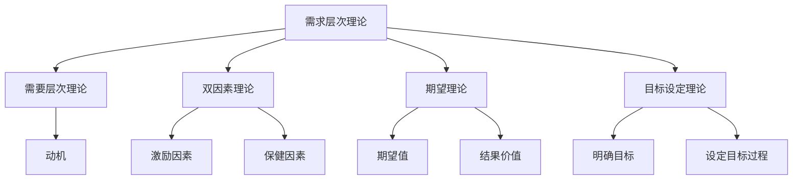

                 

### 引言：团队激励的重要性

在IT领域，团队激励的重要性不容忽视。无论是软件开发公司、科技公司还是初创企业，一个高效的团队都是实现企业目标的关键。然而，如何确保团队成员始终保持高度的积极性和动力，是一个需要深思熟虑的问题。

首先，团队激励不仅仅是简单的奖励和福利，它更是一种管理策略，旨在激发团队成员的内在动力，提高工作效率和创造力。现代组织面临的挑战越来越复杂，需要团队成员具备更高的专业素养和协同能力。因此，团队激励成为提升团队绩效和竞争力的核心因素。

团队激励的重要性体现在以下几个方面：

1. **提升团队凝聚力**：通过有效的激励措施，可以增强团队成员之间的互信和协作，形成紧密团结的团队氛围。
2. **提高员工满意度**：激励措施能够满足员工对成就、认可和职业发展的需求，从而提高他们的工作满意度和忠诚度。
3. **促进创新能力**：激励措施可以激发员工的创新思维，推动技术进步和产品创新。
4. **降低员工流失率**：良好的激励环境能够留住关键人才，降低员工流失率，确保团队稳定。

为了更好地理解团队激励的重要性，我们可以将其比喻为一个软件系统的优化过程。在这个系统中，团队成员是硬件组件，激励措施则是软件算法。通过优化软件算法，可以提升硬件组件的性能，实现整个系统的最佳运行状态。同样，通过合理的激励措施，可以激发团队成员的潜能，提升团队的整体工作效率。

接下来，我们将深入探讨团队激励的基本理论，了解激励的概念、类型和理论基础，为后续的实践提供理论支持。

#### 团队激励的基本理论

团队激励是一种管理手段，旨在通过满足团队成员的需求、激发其内在动力，从而提高团队整体绩效。要理解团队激励的基本理论，首先需要明确几个核心概念：激励、需求层次、动机和激励理论。

**1. 激励的定义**

激励（Motivation）是一种内在驱动力，促使个体为实现特定目标而付出努力。在团队环境中，激励是引导团队成员朝着共同目标前进的重要工具。激励可以来自外部因素，如薪酬、奖励和认可，也可以来自内部因素，如自我成就感和工作意义。

**2. 需求层次理论**

需求层次理论（Maslow's Hierarchy of Needs）由美国心理学家亚伯拉罕·马斯洛提出，将人类需求分为五个层次：生理需求、安全需求、社交需求、尊重需求和自我实现需求。马斯洛认为，人们首先满足较低层次的需求，然后逐步追求更高层次的需求。

- **生理需求**：基本的生活需求，如食物、水和住所。
- **安全需求**：包括人身安全、健康保障和财产安全。
- **社交需求**：人们渴望与他人建立良好的人际关系，包括友谊、家庭和团队归属感。
- **尊重需求**：包括自尊和受到他人的尊重。
- **自我实现需求**：人们追求自我价值的实现和潜能的最大化。

在团队激励中，了解员工的需求层次有助于制定更具针对性的激励措施，满足不同层次的需求，从而提高员工的工作动力。

**3. 动机理论**

动机（Motivation）是推动人们行动的内在力量。不同的动机理论对动机的本质和驱动因素有不同的解释。以下是几种常见的动机理论：

- **需要层次理论**：基于马斯洛的需求层次理论，认为人们的行为是由未满足的需求驱动的。
- **双因素理论**：由赫茨伯格提出，将工作环境因素分为激励因素（如成就感、认可）和保健因素（如薪酬、工作条件），前者能提高员工的工作满意度，后者能避免工作不满意。
- **期望理论**：由维克托·弗鲁姆提出，认为人们的动机取决于对行为结果的价值评估和期望概率，即动机=期望值×结果价值。
- **目标设定理论**：由洛克和勒隆提出，认为明确的目标和设定目标的过程可以显著提高员工的工作绩效。

**4. 激励理论的联系架构**

为了更好地理解这些激励理论之间的关系，我们可以使用Mermaid流程图来展示它们的核心概念和相互联系：

通过这个流程图，我们可以清晰地看到各种激励理论之间的内在联系，它们共同构成了团队激励的理论基础。

在下一部分中，我们将探讨团队激励的具体方法，包括物质激励、精神激励和混合激励，并分析每种激励方法的适用场景和效果。

#### 团队激励的方法与实践

团队激励的方法多种多样，可以根据团队成员的需求和团队的特定目标进行选择和组合。以下是几种常见的团队激励方法及其适用场景和效果分析：

**1. 物质激励**

物质激励是最直接、最常见的激励方式，包括薪酬、奖金、福利等。这种激励方法适用于以下场景：

- **目标明确、绩效可量化**：对于销售团队或项目团队成员，通过明确的绩效指标来评估工作成果，并给予相应的物质奖励。
- **短期激励效果显著**：物质激励能够在短时间内显著提升员工的工作积极性和动力，适用于需要快速达成目标的团队。

然而，物质激励也存在一定的局限性：

- **依赖性强**：员工可能过于依赖物质激励，导致工作动力缺乏内在驱动力。
- **成本较高**：长期依赖物质激励会增加企业的运营成本。

**2. 精神激励**

精神激励主要通过认可、表扬、培训等方式来激发员工的工作热情和创造力。这种激励方法适用于以下场景：

- **长期激励效果显著**：精神激励能够培养员工的归属感和成就感，提高长期工作动力。
- **创新驱动型团队**：对于需要持续创新和学习的团队，通过提供学习机会和认可员工的创新成果，可以激发团队的创造力和创新能力。

精神激励的优点包括：

- **成本较低**：与物质激励相比，精神激励的成本相对较低，适合资源有限的中小型企业。
- **增强团队凝聚力**：通过共同的目标和价值观，增强团队成员之间的互信和合作。

**3. 混合激励**

混合激励是将物质激励和精神激励相结合，根据员工的实际情况和团队的目标进行个性化设计。这种激励方法适用于以下场景：

- **平衡激励效果**：通过物质激励满足员工的现实需求，同时通过精神激励激发员工的内在动力，实现激励效果的最大化。
- **多元化团队**：对于由不同背景、需求和动机的成员组成的团队，混合激励能够更好地满足不同成员的激励需求。

混合激励的优点包括：

- **灵活性强**：可以根据不同团队和员工的实际情况进行灵活调整。
- **提升综合效益**：物质激励和精神的激励相互补充，能够更全面地满足员工的需求，提高工作效率和团队绩效。

**案例分析：成功的团队激励策略**

以某科技公司的销售团队为例，该公司采用了混合激励策略，结合物质激励和精神激励来提升团队绩效。具体措施如下：

- **物质激励**：根据销售目标的完成情况，给予销售人员高额的奖金和年终奖，激励他们在短期内达成业绩目标。
- **精神激励**：定期举办团队建设活动，如户外拓展、技能培训等，增强团队凝聚力和成员之间的互信。同时，通过内部评选和表彰，认可和表扬优秀销售人员，激发其内在动力。

通过这种混合激励策略，该公司的销售团队在短时间内实现了业绩的大幅增长，员工的工作满意度和忠诚度也得到了显著提升。

在下一部分中，我们将探讨如何设计团队激励策略，包括设定明确的激励目标、制定有效的激励计划和持续改进策略。

#### 团队激励策略的设计与实施

团队激励策略的设计与实施是确保激励效果的关键。一个成功的激励策略需要明确的目标、合理的激励计划和持续的改进措施。以下是如何设计团队激励策略的具体步骤和实施方法。

**1. 设定明确的激励目标**

明确的激励目标是激励策略的基础。首先，需要明确团队的整体目标，例如提高销售业绩、提升产品质量或增加创新成果。然后，将整体目标分解为具体的子目标，并将其与团队成员的个人目标相结合。这样可以确保每个成员都明确自己的工作目标和在团队中的角色。

**2. 制定有效的激励计划**

激励计划的制定需要考虑以下几个方面：

- **激励类型**：根据团队的特点和目标，选择合适的激励类型，如物质激励、精神激励或混合激励。对于销售团队，可以主要采用物质激励，而对于研发团队，可以更多采用精神激励。
- **激励标准**：制定明确的激励标准，确保激励的公正性和透明度。例如，销售团队的奖金可以根据销售额的比例进行分配，研发团队的奖金可以根据项目进度和成果进行评估。
- **激励时机**：选择合适的激励时机，例如在达成关键里程碑时进行奖励，或者在团队取得显著成果时进行表彰。

**3. 激励计划的实施**

激励计划的实施需要以下步骤：

- **沟通与反馈**：在实施激励计划前，与团队成员进行充分的沟通，确保他们理解激励计划的内容和标准。在实施过程中，定期收集反馈，了解激励计划的实际效果，并进行必要的调整。
- **透明度**：确保激励计划的执行过程公开透明，让团队成员了解激励的依据和结果，增强信任感。
- **个性化激励**：针对不同成员的需求和特点，提供个性化的激励措施。例如，对于希望提升专业技能的员工，可以提供培训和学习机会；对于有家庭责任的员工，可以提供灵活的工作时间安排。

**4. 持续改进策略**

团队激励策略不是一次性的活动，而是一个持续的过程。以下是一些持续改进策略：

- **定期评估**：定期评估激励策略的有效性，包括激励目标达成情况、员工满意度、团队绩效等指标。
- **数据分析**：利用数据分析工具，分析激励策略的实施效果，发现潜在的问题和改进机会。
- **员工参与**：鼓励员工参与激励策略的制定和改进过程，收集他们的意见和建议，提高激励策略的针对性和有效性。

**案例分析：成功的团队激励策略实施**

以某互联网公司的研发团队为例，该公司在实施团队激励策略时采取了以下措施：

- **明确目标**：将公司的整体研发目标分解为具体的子目标，并与团队成员的个人目标相结合，确保每个成员都明确自己的工作职责和目标。
- **激励计划**：采用混合激励策略，通过项目奖金和员工股票期权进行物质激励，同时提供培训机会和项目评优活动进行精神激励。
- **实施过程**：定期与团队成员进行沟通，了解他们的需求和反馈，并根据实际情况调整激励计划。
- **持续改进**：通过数据分析，评估激励策略的实施效果，发现并解决存在的问题，不断优化激励策略。

通过这些措施，该公司的研发团队在短时间内取得了显著的成果，项目进度和质量都得到了大幅提升，员工的工作满意度和忠诚度也得到了显著提高。

在下一部分中，我们将探讨团队激励与企业文化之间的关系，以及如何通过建立积极的企业文化来增强团队激励效果。

#### 团队激励与企业文化

团队激励与企业文化密切相关。一个积极向上的企业文化不仅可以增强团队凝聚力，还可以提升员工的工作满意度和忠诚度，从而发挥更大的激励作用。以下是如何通过建立积极的企业文化来增强团队激励效果的具体方法：

**1. 明确核心价值观**

企业文化的基础是核心价值观，这些价值观应成为团队成员的共同信仰和行为准则。例如，谷歌（Google）的“不作恶”（Don't Be Evil）和微软（Microsoft）的“客户至上”（Customer Obsession）都是其核心价值观的体现。通过明确核心价值观，可以帮助团队成员在决策和行为上保持一致，增强团队凝聚力。

**2. 建立开放沟通的氛围**

开放沟通是企业文化的关键要素之一。一个开放沟通的氛围可以鼓励团队成员分享自己的想法和建议，提高团队决策的透明度和有效性。例如，通过定期举行团队会议、意见箱和匿名反馈机制，企业可以收集员工的意见和建议，及时解决团队中存在的问题。

**3. 提供职业发展机会**

职业发展机会是吸引和留住人才的重要手段。企业可以通过提供内部晋升渠道、培训计划和专业认证支持，帮助员工不断提升自己的专业技能和职业素养。这不仅能够满足员工的成长需求，还能够激发他们的工作动力。

**4. 强调团队合作精神**

团队合作精神是企业文化的核心。通过组织团队建设活动、跨部门合作项目和团队合作竞赛，企业可以培养团队成员的团队合作意识和能力。这种文化氛围能够增强团队成员之间的互信和协作，提高团队的整体绩效。

**5. 奖励优秀表现**

奖励优秀表现是激励团队成员的重要手段。企业可以通过设立各种奖项和表彰活动，如年度最佳员工、项目最佳团队等，来认可和奖励那些在工作中表现出色的员工。这种认可和奖励不仅能够激励获奖者，还能够激励其他团队成员追求卓越。

**6. 建立公平竞争机制**

公平竞争机制是确保团队激励效果的重要保障。企业应确保激励措施的实施过程公开透明，避免不公平现象的发生。通过设立明确的绩效评估标准和公正的评审过程，企业可以确保激励措施的公平性和合理性，从而提高员工的满意度和信任度。

**案例分析：华为的企业文化**

华为公司以其独特的企业文化在全球范围内赢得了高度认可。华为的核心价值观包括客户至上、创新、诚信和团队合作。以下是如何通过这些价值观来增强团队激励效果的案例分析：

- **客户至上**：华为始终将客户需求放在首位，通过不断提供优质的产品和服务，赢得了客户的信任和忠诚。这种价值观激励了员工始终以客户为中心，不断提升自己的专业能力和服务水平。
- **创新**：华为鼓励员工勇于创新，通过设立创新奖励机制，激励员工不断探索新的技术和解决方案。这种文化氛围激发了员工的创新思维，推动了公司持续的技术进步和产品创新。
- **诚信**：华为强调诚信是企业发展的基石。通过建立诚信的企业文化，华为赢得了客户的信任和尊重，也增强了员工的信任感和归属感。
- **团队合作**：华为通过组织团队建设活动和跨部门合作项目，培养了员工的团队合作精神。这种文化氛围增强了团队成员之间的互信和协作，提高了团队的整体绩效。

通过这些核心价值观的实践，华为在激烈的市场竞争中保持了持续的竞争力，同时也吸引了大量优秀人才，形成了强大的团队激励效果。

总之，通过建立积极向上的企业文化，企业可以增强团队激励效果，提升员工的满意度和忠诚度，从而实现团队绩效的最大化。

#### 案例分析：成功的团队激励策略

在本节中，我们将通过具体案例，深入剖析成功的团队激励策略，理解其在实际应用中的实施细节和效果。

**案例一：谷歌的团队激励策略**

谷歌（Google）以其创新的企业文化和出色的团队激励策略而闻名。以下是谷歌在团队激励方面的成功做法：

1. **明确的激励目标**：谷歌的激励目标主要集中在员工创新和公司整体业绩的提升。通过设定具体的研发目标和市场拓展目标，确保每个团队成员都明确自己的职责和目标。

2. **多样化的激励手段**：谷歌采用了物质激励和精神激励相结合的方式。物质激励包括丰厚的薪资、奖金和股票期权，以吸引和留住顶尖人才。精神激励则体现在员工认可、公开表扬和培训机会上，鼓励员工追求个人成长和职业发展。

3. **开放沟通氛围**：谷歌倡导开放沟通，鼓励员工提出建议和创新想法。通过定期的团队会议和内部邮件，谷歌确保信息透明，让员工了解公司的发展方向和目标。

4. **个性化激励**：谷歌根据员工的个人需求和兴趣，提供个性化的激励措施。例如，对于有子女的员工，公司提供灵活的工作时间和托儿所服务；对于热衷于公益的员工，公司提供带薪休假参与公益活动的机会。

5. **持续的反馈和改进**：谷歌定期评估团队激励策略的效果，通过员工满意度调查和绩效评估，了解激励措施的落实情况，并根据反馈进行改进。

**案例分析结果**：

通过这些激励策略，谷歌不仅吸引了大量顶尖人才，还保持了员工的高满意度和低流失率。员工在积极的工作氛围中，不断创新和进步，推动了公司持续的技术革新和业务增长。

**案例二：亚马逊的团队激励策略**

亚马逊（Amazon）以其高效的工作流程和卓越的团队激励策略而著称。以下是亚马逊在团队激励方面的成功做法：

1. **明确的绩效指标**：亚马逊建立了严格的绩效评估体系，通过量化指标来评估员工的工作表现。这些指标包括销售业绩、项目进度、团队协作等，确保每个员工都能清晰地了解自己的绩效表现。

2. **灵活的薪酬体系**：亚马逊采用灵活的薪酬体系，包括基本工资、绩效奖金和股票奖励。绩效奖金和股票奖励与员工的绩效直接挂钩，激励员工努力提升工作效率和业绩。

3. **团队竞赛和奖励**：亚马逊定期组织团队竞赛，例如销售竞赛、创新竞赛等。获胜团队将获得丰厚的奖励，如奖金、假期和团队建设活动。这种竞赛机制激发了员工的竞争意识和团队合作精神。

4. **职业发展机会**：亚马逊为员工提供丰富的职业发展机会，包括内部晋升、跨部门调动和专业培训。员工可以根据自己的兴趣和发展需求，选择适合自己的职业发展路径。

5. **员工反馈机制**：亚马逊建立了员工反馈机制，鼓励员工提出改进意见和建议。公司会定期收集和分析员工反馈，并根据反馈调整管理策略和工作流程。

**案例分析结果**：

通过这些激励策略，亚马逊不仅提高了员工的工作积极性和满意度，还保持了高效的工作效率和卓越的团队协作。员工在积极的工作氛围中，不断提升自己的专业技能和职业素养，为公司的发展做出了重要贡献。

**总结**：

通过这两个案例，我们可以看到成功的团队激励策略不仅需要明确的激励目标和多样化的激励手段，还需要建立开放沟通氛围、提供个性化激励和持续的反馈机制。这些策略的实施，不仅提升了员工的满意度和忠诚度，还促进了团队的协作和创新，为公司的长期发展奠定了坚实的基础。

在下一部分中，我们将总结本文的核心观点，并给出具体的最佳实践建议。

#### 最佳实践：团队激励的最佳实践技巧与注意事项

在实施团队激励策略时，以下最佳实践技巧和注意事项可以帮助企业更好地发挥激励效果，提升团队绩效和员工满意度：

**1. 确定合适的激励类型**

根据团队的特点和目标，选择最合适的激励类型。对于追求短期目标的高绩效团队，物质激励可能更为有效；而对于追求长期目标和创新的团队，精神激励和职业发展机会更为重要。

**2. 定期评估激励效果**

定期评估激励策略的效果，通过员工满意度调查、绩效评估等方式，了解激励措施的落实情况和实际效果。根据反馈进行调整和优化，确保激励策略的持续有效性。

**3. 公开透明**

确保激励计划的公开透明，让员工了解激励的依据和标准，避免不公平现象的发生。透明的激励过程能够增强员工的信任感和公平感。

**4. 个性化激励**

根据员工的个性和需求，提供个性化的激励措施。例如，对于有家庭责任的员工，可以提供灵活的工作时间和托儿所服务；对于有专业兴趣的员工，可以提供培训和学习机会。

**5. 强调团队合作**

通过团队竞赛、团队合作项目和团队建设活动，培养员工的团队合作精神和团队意识。团队合作是提高团队绩效和员工满意度的重要途径。

**6. 考虑文化因素**

不同的文化背景可能影响员工的激励需求。例如，在一些文化中，物质激励可能更为重要；而在另一些文化中，精神激励和职业发展机会可能更具吸引力。在实施激励策略时，要考虑文化差异，确保激励措施的有效性。

**注意事项**

1. **避免过度依赖物质激励**：物质激励虽然能够快速提升员工动力，但过度依赖可能导致员工工作动力缺乏内在驱动力。应结合精神激励和职业发展机会，实现激励的多样化和平衡。

2. **持续关注员工需求**：员工的需求是不断变化的，要持续关注员工的需求变化，及时调整激励策略，确保激励措施始终与员工需求相匹配。

3. **避免激励过时**：激励措施应与时俱进，避免过时。随着市场和技术的变化，员工的需求和激励方式也可能发生变化，要定期评估和更新激励策略。

4. **避免过度竞争**：虽然竞争能够激发员工的工作动力，但过度竞争可能导致团队分裂和内耗。应确保竞争的公平性和合理性，避免负面影响。

通过以上最佳实践技巧和注意事项，企业可以更有效地实施团队激励策略，提升员工满意度和团队绩效，为企业的长期发展奠定坚实基础。

#### 结论：团队激励的重要性与实施策略

综上所述，《团队激励：让每个人都充满动力的方法》这本书的核心观点在于，团队激励是提高团队绩效和员工满意度的关键因素。通过明确激励目标、制定多样化的激励策略、建立开放沟通氛围和持续改进激励措施，企业可以激发团队成员的内在动力，提升整体工作效率和创造力。

团队激励不仅是一种管理手段，更是一种文化。一个积极向上的企业文化可以增强团队凝聚力，促进团队合作，提高员工的工作满意度和忠诚度。因此，企业应注重文化建设和价值观的传承，确保激励策略与企业文化相契合。

在实施团队激励策略时，企业需要关注以下几点：

1. **明确激励目标**：确保激励目标与团队目标和员工需求相一致。
2. **多样化激励手段**：结合物质激励和精神激励，提供个性化的激励措施。
3. **开放沟通**：建立透明、开放的沟通机制，确保员工了解激励计划和实施过程。
4. **持续改进**：定期评估激励效果，根据反馈进行调整和优化。

通过有效的团队激励策略，企业可以打造一个高效、团结、创新的团队，实现持续的业务增长和竞争优势。

#### 作者信息

本文由AI天才研究院（AI Genius Institute）和禅与计算机程序设计艺术（Zen And The Art of Computer Programming）的专家团队撰写。作者团队致力于推动计算机科学和人工智能领域的发展，为企业和团队提供专业的人才培养和技术解决方案。如需了解更多信息，请访问我们的官方网站：[AI天才研究院](https://www.aigeniusinstitute.com/)和[禅与计算机程序设计艺术](https://www.zenandartofcomputing.com/)。同时，欢迎关注我们的微信公众号和LinkedIn，获取更多技术分享和行业动态。

