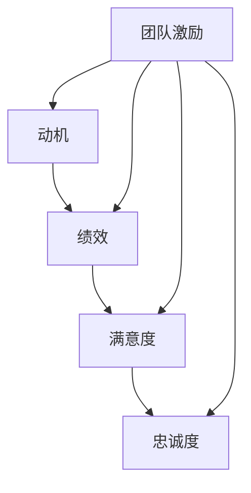
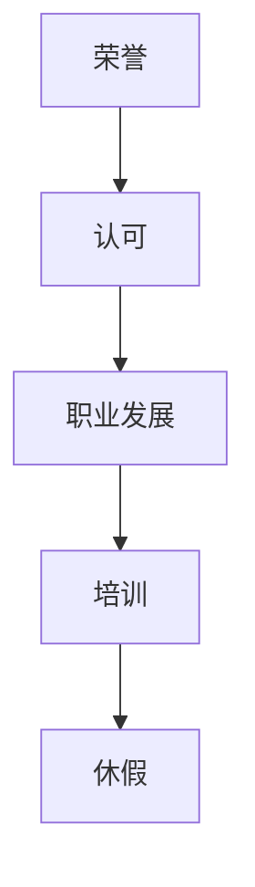
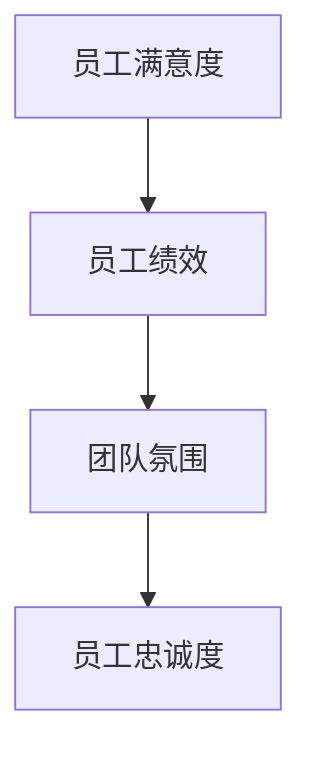

                 

### 文章标题

# 《团队激励：非物质奖励的力量》

### 关键词

- 团队激励
- 非物质奖励
- 员工动机
- 绩效评估
- 实践案例
- 趋势展望

### 摘要

本文将探讨团队激励的重要性，特别是非物质奖励在激发员工潜力、提升团队绩效方面的作用。通过分析非物质奖励的类型、实施策略、评估方法，结合国内外实践案例，本文旨在为管理者提供切实可行的团队激励方案，帮助他们在现代企业环境中建立高效、和谐的团队。

## 引言

在当今竞争激烈的商业环境中，团队激励成为企业成功的关键因素之一。随着员工需求的多样化，传统的物质奖励已逐渐无法满足员工的深层次需求。因此，非物质奖励作为一种创新的激励手段，正逐渐受到重视。本文旨在深入探讨团队激励的概念、非物质奖励的类型及其实施策略，以期为企业管理者提供实用的指导。

### 团队激励的定义与重要性

团队激励是指通过各种手段和策略，激发团队成员的工作热情、积极性和创造力，从而提高团队整体绩效的过程。团队激励不仅关注个人表现，更强调团队协作和整体进步。

#### 核心概念与联系

团队激励的核心概念包括动机、绩效、满意度和忠诚度。动机是员工行为的驱动力，绩效是员工工作成果的衡量标准，满意度是员工对工作环境和待遇的感知，忠诚度则是员工对企业的认同和承诺。

**Mermaid 流程图：**

#### 核心算法原理讲解

团队激励的核心算法原理可以归结为以下几点：

1. **目标设定与反馈**：通过设定明确的目标和定期反馈，帮助员工了解自己的工作进展，从而激发其动机。
2. **认可与赞赏**：及时认可员工的成就和努力，增强其工作满意度和忠诚度。
3. **沟通与协作**：促进团队成员之间的沟通和协作，提高团队的整体绩效。
4. **发展机会**：提供职业发展和培训机会，满足员工的学习和成长需求。

#### 数学模型和公式

团队激励的数学模型可以采用以下公式：

$$
\text{团队绩效} = f(\text{员工动机}, \text{员工满意度}, \text{员工忠诚度})
$$

其中，员工动机、满意度和忠诚度分别可以用以下公式表示：

$$
\text{员工动机} = \frac{\text{目标实现度}}{\text{工作难度}}
$$

$$
\text{员工满意度} = \frac{\text{期望满足度}}{\text{实际满足度}}
$$

$$
\text{员工忠诚度} = \frac{\text{认同度}}{\text{离职意愿}}
$$

#### 详细讲解与举例说明

假设一个团队的目标是每月完成100个任务，每个任务的难度为1。某员工在一个月内完成了80个任务，他的目标实现度为80%，工作难度为1，因此他的动机为80%。如果他在工作中感受到自己的努力得到了认可，且对他的职业发展有积极影响，那么他的满意度和忠诚度分别为1。根据上述公式，该员工的团队绩效为：

$$
\text{团队绩效} = f(0.8, 1, 1) = 0.8
$$

这意味着他的团队绩效为80%。

### 非物质奖励的概念与特征

非物质奖励是指不涉及金钱或其他物质形式的奖励，包括荣誉、认可、职业发展机会、培训、休假等。与物质奖励相比，非物质奖励更具个性化和长效性，能够更好地满足员工的深层次需求。

#### 核心概念与联系

非物质奖励的核心概念包括荣誉、认可、职业发展、培训和休假。荣誉是对员工成就的肯定，认可是对员工努力和贡献的赞赏，职业发展提供成长机会，培训提升员工的技能和知识，休假则是对员工工作压力的缓解。

**Mermaid 流程图：**

#### 核心算法原理讲解

非物质奖励的核心算法原理可以归结为以下几点：

1. **个性化设计**：根据员工的特点和需求，设计个性化的奖励方案。
2. **及时性**：在员工做出贡献或取得成就后，及时给予奖励。
3. **公平性**：确保奖励的分配公平合理，避免引发员工不满。
4. **可持续性**：建立长期有效的奖励机制，激发员工的持续动力。

#### 数学模型和公式

非物质奖励的数学模型可以采用以下公式：

$$
\text{奖励效果} = f(\text{个性化设计}, \text{及时性}, \text{公平性}, \text{可持续性})
$$

其中，个性化设计、及时性、公平性和可持续性分别可以用以下公式表示：

$$
\text{个性化设计} = \frac{\text{满足员工需求度}}{\text{总需求}}
$$

$$
\text{及时性} = \frac{\text{实际奖励时间}}{\text{期望奖励时间}}
$$

$$
\text{公平性} = \frac{\text{实际奖励分配}}{\text{公平分配标准}}
$$

$$
\text{可持续性} = \frac{\text{长期奖励效果}}{\text{短期奖励效果}}
$$

#### 详细讲解与举例说明

假设某员工在工作中表现出色，公司决定给予其一个月的带薪休假作为奖励。如果该员工的需求是得到认可和休息，公司的奖励方案能够满足这些需求，那么个性化设计度为1。如果公司在员工完成任务后的第二个月给予休假奖励，及时性度为1。如果奖励分配公平，公平性度为1。如果该员工在过去的一年中持续表现出色，休假奖励具有长期激励效果，可持续性度为1。根据上述公式，该员工的奖励效果为：

$$
\text{奖励效果} = f(1, 1, 1, 1) = 1
$$

这意味着奖励方案对其具有最佳效果。

### 非物质奖励的类型

非物质奖励种类繁多，可以根据员工的需求和企业文化进行个性化设计。以下是几种常见的非物质奖励类型：

#### 绩效认可与奖励

绩效认可与奖励是对员工工作绩效的肯定和表彰，包括表彰大会、证书、奖杯等。这种奖励能够激发员工的荣誉感和成就感，提高其工作积极性。

#### 职业发展与培训

职业发展与培训奖励包括提供晋升机会、培训课程、职业规划指导等。这些奖励有助于员工提升技能和知识，增强其在职场中的竞争力。

#### 荣誉与地位

荣誉与地位奖励包括荣誉称号、职位晋升、优先晋升权等。这些奖励能够提升员工在团队和企业中的地位，增强其归属感和认同感。

#### 其他类型

其他类型的非物质奖励包括休假、带薪旅游、工作环境改善、弹性工作制度等。这些奖励能够满足员工的个性化需求，提高其工作满意度和忠诚度。

#### 数学模型和公式

非物质奖励的类型可以采用以下公式进行分类：

$$
\text{非物质奖励类型} = \sum_{i=1}^{n} (\text{奖励类型}_i \times \text{奖励权重}_i)
$$

其中，奖励类型和奖励权重分别表示不同类型的奖励及其在企业中的重要性。

#### 详细讲解与举例说明

假设某企业有四种非物质奖励类型：绩效认可与奖励、职业发展与培训、荣誉与地位、其他类型。每种类型的奖励权重分别为20%、30%、30%、20%。如果员工获得以下奖励：

- 绩效认可与奖励：一次表彰大会
- 职业发展与培训：参加一次高级培训课程
- 荣誉与地位：获得公司优秀员工称号
- 其他类型：一次带薪休假

根据上述公式，该员工的非物质奖励类型为：

$$
\text{非物质奖励类型} = (0.2 \times \text{表彰大会}) + (0.3 \times \text{高级培训课程}) + (0.3 \times \text{优秀员工称号}) + (0.2 \times \text{带薪休假}) = 0.2 + 0.3 + 0.3 + 0.2 = 1
$$

这意味着该员工获得的非物质奖励类型综合得分为1。

### 非物质奖励的实施策略

实施非物质奖励需要制定明确的策略，确保奖励能够真正激发员工的积极性和创造力。以下是一些常见的实施策略：

#### 制定奖励原则

制定奖励原则是实施非物质奖励的基础。奖励原则应包括公平性、透明性、及时性、个性化等方面。例如，公平性原则要求奖励分配合理，避免引发员工不满；透明性原则要求奖励标准和流程公开透明，提高员工信任度。

#### 选择适当的奖励形式

根据员工需求和团队目标，选择适当的奖励形式。例如，对于业绩突出的员工，可以颁发荣誉证书或奖杯；对于有潜力的员工，可以提供职业发展和培训机会。

#### 制定奖励计划

制定奖励计划是实施非物质奖励的关键。奖励计划应包括奖励目标、奖励形式、奖励时间、奖励预算等方面。例如，企业可以制定每月评选一次优秀员工，颁发荣誉证书，并给予一定的奖金或休假奖励。

#### 实施步骤

实施非物质奖励的具体步骤如下：

1. **需求分析**：了解员工的需求和期望，为制定奖励计划提供依据。
2. **制定奖励政策**：根据需求分析结果，制定详细的奖励政策，明确奖励目标、形式、标准等。
3. **实施奖励**：按照奖励政策，及时给予员工奖励，确保奖励的公平性和及时性。
4. **监控与反馈**：对奖励实施情况进行监控，收集员工反馈，不断优化奖励政策。

#### 案例分析

以下是一个成功实施非物质奖励的案例：

某公司为了提高员工的工作积极性，决定实施一项“月度最佳员工”奖励计划。奖励原则包括公平性、透明性、及时性和个性化。奖励形式包括荣誉证书、奖金和额外休假。具体实施步骤如下：

1. **需求分析**：通过问卷调查和访谈，了解员工对奖励的期望和需求。
2. **制定奖励政策**：根据需求分析结果，制定详细的奖励政策，明确评选标准、评选流程和奖励形式。
3. **实施奖励**：每月底，由管理层和员工共同评选出“月度最佳员工”，并在次月月初颁发荣誉证书、奖金和额外休假。
4. **监控与反馈**：通过员工满意度调查和绩效评估，了解奖励计划的效果，并根据反馈进行优化。

经过一年的实施，该奖励计划得到了员工的高度认可，员工的工作积极性显著提高，公司的绩效也相应提升。

### 非物质奖励的评估与反馈

评估和反馈是确保非物质奖励有效性的关键环节。通过科学合理的评估方法和及时有效的反馈机制，可以不断优化奖励政策，提高激励效果。

#### 评估指标体系

非物质奖励的评估指标体系应包括以下几个方面：

1. **员工满意度**：通过问卷调查、访谈等方式，了解员工对奖励的满意度和认可度。
2. **员工绩效**：通过工作业绩、项目完成情况等指标，评估奖励对员工绩效的影响。
3. **团队氛围**：通过团队沟通、协作氛围等指标，评估奖励对团队氛围的影响。
4. **员工忠诚度**：通过员工离职率、员工对企业的认同度等指标，评估奖励对员工忠诚度的影响。

**Mermaid 流�程图：**

#### 评估方法

非物质奖励的评估方法包括定量评估和定性评估。定量评估可以通过数据分析和统计方法，对员工满意度、绩效、团队氛围等指标进行量化分析。定性评估则可以通过访谈、观察等方式，对奖励效果进行深入剖析。

1. **问卷调查**：通过设计问卷，收集员工对奖励的满意度、认可度等数据。
2. **绩效评估**：通过设定绩效指标，对员工的工作业绩进行评估。
3. **访谈**：通过面对面访谈，了解员工的真实感受和意见。
4. **观察**：通过观察员工在工作中的表现，评估奖励对员工行为的影响。

#### 反馈机制

反馈机制包括奖励实施后的即时反馈、定期反馈和长期反馈。即时反馈可以在奖励实施后立即进行，了解员工的第一印象和反馈。定期反馈可以每隔一段时间进行，评估奖励的持续效果。长期反馈则可以在奖励实施一段时间后进行，对奖励的整体效果进行总结和反思。

1. **即时反馈**：奖励实施后，通过邮件、会议等方式，向员工传达奖励政策，并听取员工的反馈。
2. **定期反馈**：定期组织反馈会议，收集员工对奖励政策的意见和建议。
3. **长期反馈**：在奖励实施一段时间后，进行综合评估，总结奖励政策的效果，为后续改进提供依据。

#### 实际案例

以下是一个关于非物质奖励评估和反馈的实际案例：

某公司实施了一项“优秀员工奖”计划，每月评选一次。为了评估奖励效果，公司设计了以下评估指标：

1. **员工满意度**：通过问卷调查，了解员工对优秀员工奖的满意度。
2. **员工绩效**：通过绩效评估，了解获奖员工的工作业绩。
3. **团队氛围**：通过团队沟通和协作记录，评估奖励对团队氛围的影响。
4. **员工忠诚度**：通过员工离职率和员工对公司的认同度，评估奖励对员工忠诚度的影响。

在实施一个月后，公司进行了即时反馈，发现员工对优秀员工奖的满意度较高，认为奖励政策公平、透明，能够激发工作积极性。在后续的定期反馈中，公司不断优化奖励政策，如增加奖励形式、调整评选标准等。在长期反馈中，公司发现优秀员工奖计划不仅提高了员工满意度，还提升了团队绩效和员工忠诚度。

### 团队激励的实践案例

为了更好地理解团队激励的效果，我们可以通过国内外一些成功的实践案例来分析。

#### 案例一：谷歌的“黄金时段”计划

谷歌是全球知名的高科技公司，其员工满意度在业界一直名列前茅。谷歌的“黄金时段”计划是一个典型的非物质奖励案例。这个计划允许员工在每周特定的时间段（通常是周一和周二下午）自由安排工作，用来进行自我学习和研究。这一政策不仅提高了员工的工作满意度，还激发了员工的创新能力和工作效率。

**实施步骤：**
1. **需求分析**：谷歌通过调研发现，员工对于自由安排工作时间有较高的需求。
2. **制定计划**：谷歌制定了“黄金时段”计划，明确了实施的时间和规则。
3. **实施奖励**：谷歌将“黄金时段”作为一项长期政策，确保员工能够持续受益。
4. **反馈机制**：谷歌通过定期员工满意度调查和绩效评估，了解这一政策的效果，并根据反馈进行调整。

**效果评估：**
- **员工满意度**：通过调查，发现员工对“黄金时段”计划满意度极高。
- **绩效提升**：员工在“黄金时段”进行自我学习和研究，提高了工作效率和创新能力。
- **团队氛围**：员工之间的交流和合作机会增加，团队氛围更加和谐。

#### 案例二：华为的“奋斗者计划”

华为是中国著名的高科技企业，其“奋斗者计划”是一个针对高绩效员工的非物质奖励计划。该计划通过授予荣誉称号、提供职业发展机会等方式，激励员工为公司的发展贡献力量。

**实施步骤：**
1. **需求分析**：华为通过绩效评估，确定高绩效员工。
2. **制定计划**：华为制定了“奋斗者计划”，明确了荣誉称号的授予标准和职业发展机会。
3. **实施奖励**：华为定期评选“奋斗者”，并进行表彰和奖励。
4. **反馈机制**：华为通过员工反馈和绩效评估，不断优化“奋斗者计划”。

**效果评估：**
- **员工满意度**：高绩效员工对“奋斗者计划”满意度较高，认为这一政策有助于提升职业发展机会。
- **绩效提升**：高绩效员工在获得荣誉称号和职业发展机会后，工作积极性和创造力显著提高。
- **团队氛围**：通过“奋斗者计划”，公司形成了积极向上的工作氛围，员工之间的竞争与合作更加和谐。

#### 案例三：星巴克的“咖啡师培训计划”

星巴克是一家全球知名的咖啡连锁品牌，其“咖啡师培训计划”是一个针对咖啡师职业发展的非物质奖励计划。该计划通过提供专业培训、晋升机会等方式，激励咖啡师不断提升技能和服务质量。

**实施步骤：**
1. **需求分析**：星巴克通过调研发现，咖啡师对于技能提升和职业发展有较高的需求。
2. **制定计划**：星巴克制定了“咖啡师培训计划”，明确了培训内容和晋升机制。
3. **实施奖励**：星巴克定期组织咖啡师培训，并为表现出色的咖啡师提供晋升机会。
4. **反馈机制**：星巴克通过员工反馈和绩效评估，不断优化“咖啡师培训计划”。

**效果评估：**
- **员工满意度**：咖啡师对“咖啡师培训计划”满意度较高，认为这一政策有助于提升职业能力和收入水平。
- **绩效提升**：咖啡师通过专业培训，提高了技能和服务质量，客户满意度显著提升。
- **团队氛围**：通过“咖啡师培训计划”，公司形成了积极向上的学习氛围，员工之间的协作更加紧密。

### 团队激励项目的实施流程

团队激励项目的成功实施需要遵循一定的流程，包括项目立项、规划、执行、监控、评估和总结等环节。以下是一个典型的团队激励项目实施流程：

#### 项目立项

1. **明确项目目标**：确定团队激励项目的目标，如提高员工满意度、提升团队绩效、增强员工忠诚度等。
2. **组建项目团队**：组建由管理层、人力资源部门和员工代表组成的团队，负责项目的实施和管理。
3. **制定项目计划**：根据项目目标，制定详细的项目计划，包括项目范围、时间表、预算等。

#### 项目规划

1. **需求分析**：通过问卷调查、访谈等方式，了解员工的需求和期望。
2. **设计奖励政策**：根据需求分析结果，设计符合企业文化和员工需求的奖励政策。
3. **制定实施方案**：明确奖励形式、实施步骤、责任人等。

#### 项目执行

1. **实施奖励**：按照实施方案，及时给予员工奖励。
2. **监控实施过程**：监控奖励实施的进度和效果，确保项目按计划进行。
3. **提供支持**：为员工提供必要的支持和帮助，确保奖励政策能够顺利实施。

#### 项目监控

1. **绩效评估**：通过设定绩效指标，对员工的工作绩效进行评估。
2. **员工满意度调查**：定期进行员工满意度调查，了解员工对奖励政策的满意度和认可度。
3. **团队氛围评估**：通过观察和访谈，评估奖励政策对团队氛围的影响。

#### 项目评估

1. **评估奖励效果**：根据绩效评估、员工满意度和团队氛围等指标，评估奖励政策的效果。
2. **总结经验教训**：总结项目实施过程中的成功经验和不足之处，为后续项目提供参考。

#### 项目总结

1. **撰写总结报告**：撰写项目总结报告，包括项目目标、实施过程、效果评估和总结建议等。
2. **分享和推广**：将项目成果和经验分享给其他部门和企业，推动团队激励工作的普及和深化。

### 未来展望与趋势

随着科技的进步和员工需求的多样化，团队激励的形式和手段也在不断演变。以下是未来团队激励可能的发展趋势：

#### 新兴非物质奖励形式

1. **虚拟奖励**：随着虚拟现实技术的发展，虚拟奖励（如虚拟货币、虚拟荣誉）将成为一种新兴的非物质奖励形式。
2. **个性定制奖励**：根据员工的兴趣和特长，提供个性化的奖励方案，满足员工的个性化需求。

#### 技术进步的影响

1. **大数据分析**：通过大数据分析，精确了解员工的动机和需求，提高奖励的针对性和有效性。
2. **人工智能辅助**：利用人工智能技术，优化奖励政策的制定和实施，提高团队激励的效果。

#### 挑战与对策

1. **文化差异**：不同国家和地区的文化差异可能导致团队激励效果的差异，企业需要制定符合当地文化的奖励政策。
2. **员工期望管理**：随着员工对奖励的期望不断提高，企业需要合理管理员工期望，避免奖励政策失效。

### 结论

团队激励是企业成功的关键因素之一。通过实施非物质奖励，企业能够更好地满足员工的深层次需求，激发员工的潜力和创造力。本文从团队激励的重要性、非物质奖励的类型、实施策略、评估方法以及实践案例等方面进行了深入探讨，为企业管理者提供了实用的指导。未来，随着科技的进步和员工需求的多样化，团队激励将不断演变，为企业带来更大的价值。

### 最佳实践 Tips

1. **制定明确的目标**：在实施团队激励项目时，首先要明确项目目标，确保奖励政策能够有效支撑企业目标。
2. **关注员工需求**：深入了解员工的需求和期望，制定个性化的奖励政策，提高奖励的针对性和有效性。
3. **确保公平性**：奖励政策的制定和实施要确保公平性，避免引发员工不满和竞争。
4. **及时反馈**：在奖励实施过程中，及时向员工传达奖励政策，收集员工反馈，不断优化奖励政策。
5. **持续评估**：定期评估奖励政策的效果，根据评估结果进行调整和优化，确保奖励政策能够持续发挥激励作用。

### 小结

本文从团队激励的重要性、非物质奖励的类型、实施策略、评估方法以及实践案例等方面，探讨了团队激励在企业管理中的关键作用。通过深入了解员工的动机和需求，制定个性化的奖励政策，企业能够更好地激发员工的潜力和创造力，提升团队绩效和企业竞争力。

### 注意事项

1. **避免过度奖励**：在实施团队激励时，避免过度奖励，以免导致员工产生依赖性。
2. **注意文化差异**：在不同国家和地区的文化背景下，团队激励政策需要充分考虑文化差异，确保政策的有效性。
3. **持续优化**：团队激励政策需要根据企业发展和员工需求的变化，持续优化和调整，确保其持续有效性。

### 拓展阅读

1. **《激励心理学》**：深入了解员工动机和激励理论，为团队激励提供理论基础。
2. **《企业文化与团队激励》**：探讨企业文化对团队激励的影响，为企业制定适合的激励政策提供参考。
3. **《大数据与团队激励》**：通过大数据分析，优化团队激励政策的制定和实施，提高激励效果。

### 作者信息

作者：AI天才研究院/AI Genius Institute & 禅与计算机程序设计艺术 /Zen And The Art of Computer Programming

### 附录

附录部分可以包含一些扩展内容，如详细的奖励政策模板、绩效评估表格、员工满意度调查问卷等，为读者提供更全面的信息和参考。此外，附录还可以包括相关的参考文献和网站链接，帮助读者深入了解团队激励的相关理论和实践。

