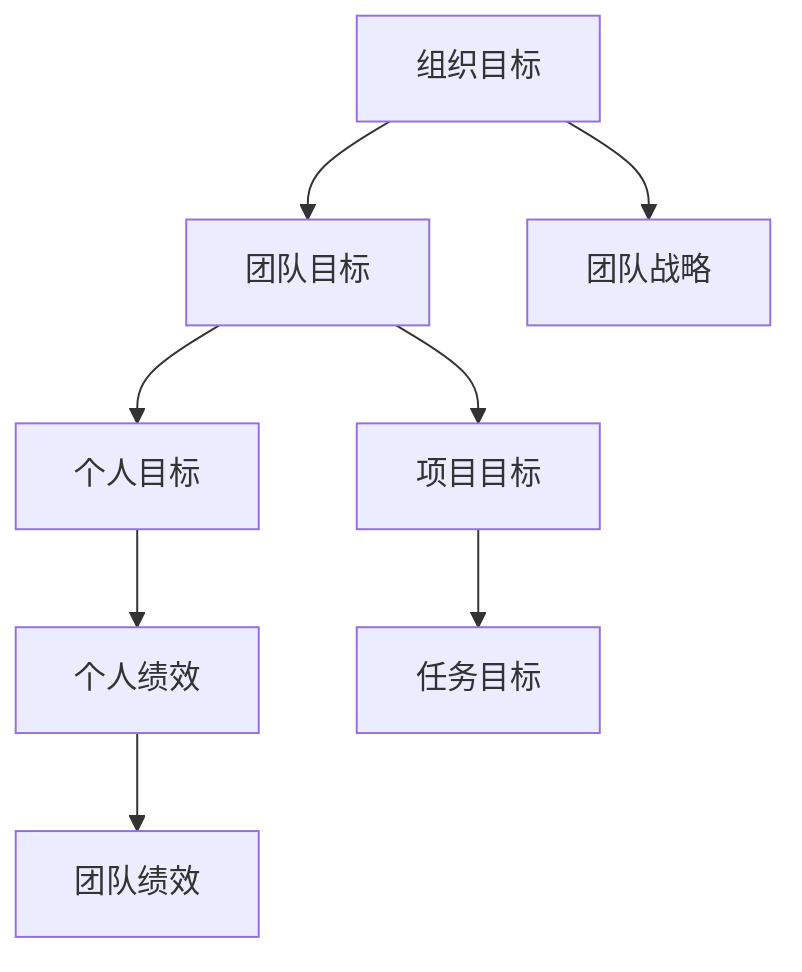
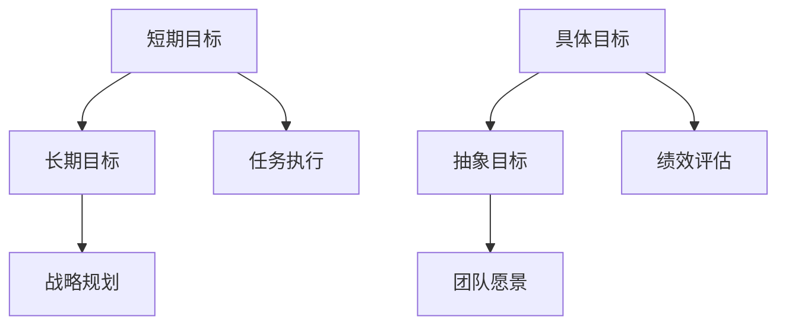
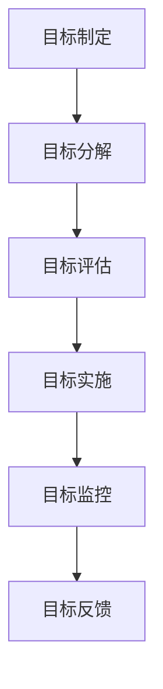

                 

## 引言

在快速变化和竞争激烈的技术行业中，团队目标设定成为确保组织成功的关键因素。有效的目标设定不仅能够指导团队的工作方向，还能激发团队成员的积极性，提升团队的整体绩效。然而，很多团队在面对目标设定时，往往感到困惑和迷茫，难以将模糊的想法转化为明确的目标。

本文旨在探讨团队目标设定的过程，从模糊到明确，逐步引导读者理解目标设定的核心概念、类型、原则和流程，并通过实际案例和工具方法，提供实用的策略和技巧。通过本文的阅读，读者将能够：

1. **理解团队目标设定的核心概念和重要性**：明确团队目标的意义及其对团队协作和绩效的影响。
2. **掌握团队目标的类型和SMART原则**：学会如何使用SMART原则来设定具体、可衡量、可实现、相关且有时限的目标。
3. **熟悉目标设定的流程和方法**：了解从目标制定到实现的全过程，包括团队协作和常见问题的应对策略。
4. **应用实际案例和工具**：通过案例分析和工具介绍，提升目标设定的实践能力和效率。

本文将分三个主要部分进行阐述：

- **第一部分：目标设定的基础理论**：介绍团队目标的概念、类型、SMART原则和设定流程。
- **第二部分：目标设定的实践应用**：分析目标设定中的常见问题，提供案例研究和进阶策略。
- **第三部分：目标设定的工具与方法**：介绍目标设定的实用工具和方法。

通过这些内容，读者将能够系统地掌握团队目标设定的方法和技巧，从而在团队管理和技术项目中取得更好的成果。

## 第一部分：目标设定的基础理论

### 1.1 什么是团队目标

团队目标是指团队为了实现特定任务或长期战略而设定的期望成果和方向。团队目标不仅为团队成员提供了共同的方向感，也为团队协作提供了明确的指引。理解团队目标的定义和重要性，是进行有效目标设定的第一步。

**核心概念与联系：**

团队目标与个人目标、组织目标之间存在紧密的联系。个人目标是团队成员个人发展的基础，而团队目标是基于个人目标，通过团队协作共同实现的结果。组织目标则是团队目标的更高层次，反映了组织的整体战略和愿景。

以下是一个简单的Mermaid流程图，展示了团队目标与其他目标之间的关系：



**团队目标设定的重要性：**

1. **提供方向指引**：团队目标明确了团队的工作方向和目标，使团队成员在行动时有一个清晰的目标指引。
2. **增强团队协作**：共同的目标能够促进团队成员之间的协作和沟通，提高团队的整体执行力。
3. **激励团队成员**：明确的目标可以激发团队成员的积极性和动力，提高工作满意度和成就感。
4. **评估和调整**：通过目标设定和实现，可以及时评估团队的工作绩效，并根据反馈进行调整，确保团队持续进步。

### 1.2 团队目标的类型

团队目标的类型可以分为短期目标和长期目标，以及具体目标和抽象目标。

**短期目标**：通常是指在一个季度、半年或一年内需要实现的目标。短期目标具有较强的可操作性和明确性，通常用于快速响应市场变化和解决当前问题。

**长期目标**：是指需要在较长一段时间内实现的目标，通常是与组织战略和愿景相一致的长期规划。长期目标需要更详细的规划和资源调配，但能确保团队在持续发展的道路上稳步前行。

**具体目标**：是指具有明确衡量标准和具体实施路径的目标。具体目标通常易于监控和评估，能够帮助团队快速发现问题并进行调整。

**抽象目标**：是指较为抽象、难以直接衡量和实现的目标。这类目标通常用于描述团队的愿景和使命，为团队提供精神支持和方向指引。

**核心概念与联系：**

短期目标、长期目标、具体目标和抽象目标之间并不是孤立的，而是相互关联和影响的。具体目标和短期目标是实现长期目标和抽象目标的手段，而长期目标和抽象目标为短期目标和具体目标提供了方向和框架。

以下是一个Mermaid流程图，展示了四种类型的目标之间的关系：



### 1.3 团队目标的SMART原则

SMART原则是设定有效团队目标的重要指南，它包括以下五个关键要素：

- **Specific（具体）**：目标要明确具体，避免模糊和宽泛。
- **Measurable（可衡量）**：目标要有明确的衡量标准，以便于评估进展和成效。
- **Achievable（可实现）**：目标要在团队成员的能力和资源范围内，避免设定不切实际的目标。
- **Relevant（相关）**：目标要与团队的长期战略和愿景相一致，确保方向正确。
- **Time-bound（有时限）**：目标要有明确的时间限制，确保目标的实现有明确的时间节点。

**核心算法原理讲解：**

为了更好地理解SMART原则，我们可以将其转换为一种伪代码形式：

```python
def set_smart_target(target):
    if not isinstance(target, str):
        raise ValueError("目标必须为字符串类型")
    if "Specific" not in target:
        target += " Specific"
    if "Measurable" not in target:
        target += " Measurable"
    if "Achievable" not in target:
        target += " Achievable"
    if "Relevant" not in target:
        target += " Relevant"
    if "Time-bound" not in target:
        target += " Time-bound"
    return target
```

通过这个伪代码，我们可以看到SMART原则的五个要素被逐一加入到目标字符串中，从而确保目标的设定符合SMART原则。

**举例说明：**

假设一个软件开发团队需要设定一个目标，我们可以使用SMART原则来设定：

- **原始目标**：提高软件质量。
- **具体化**：将“提高软件质量”具体化为“降低软件缺陷率”。
- **可衡量**：设定具体的衡量标准，例如“将缺陷率降低到0.1%以下”。
- **可实现**：考虑团队的技术能力和资源，确保目标在当前条件下可以实现。
- **相关**：确保目标与团队的长期战略和愿景相一致，例如“提高客户满意度”。
- **有时限**：设定明确的时间限制，例如“在接下来的三个月内实现”。

最终设定的目标为：“在接下来的三个月内，将软件缺陷率降低到0.1%以下，以提高客户满意度。”

通过SMART原则，我们可以将原始的模糊目标转化为具体、可衡量、可实现、相关且有时限的明确目标，从而提高目标设定的有效性和可实现性。

### 1.4 目标设定的流程

有效的目标设定不仅需要遵循SMART原则，还需要经历一个系统化的流程，从目标制定到目标实现，确保目标能够顺利落地并取得预期效果。

**核心概念与联系：**

目标设定的流程可以分为以下五个主要阶段：

1. **目标制定**：确定目标的方向和具体内容。
2. **目标分解**：将总目标分解为可操作的子目标。
3. **目标评估**：评估目标的可实现性和优先级。
4. **目标实施**：制定具体的行动计划并执行。
5. **目标监控**：监控目标实现的进展并及时调整。

以下是一个Mermaid流程图，展示了目标设定的五个阶段：



**目标制定：** 

目标制定是目标设定的第一步，也是最重要的一步。在这一阶段，团队需要明确目标的方向和具体内容。制定目标时，应遵循SMART原则，确保目标具体、可衡量、可实现、相关且有时限。

**目标分解：**

目标分解是将总目标分解为一系列具体的子目标，以便于团队更清晰地了解每个阶段的工作内容和目标。在分解目标时，应确保每个子目标都是可操作的，且相互之间具有关联性。

**目标评估：**

目标评估是对目标的可实现性和优先级进行评估。在这一阶段，团队需要评估每个目标的难度、所需资源和时间，并确定哪些目标是当前最需要优先完成的。通过评估，可以确保目标设定合理且具有可操作性。

**目标实施：**

目标实施是目标设定的核心阶段，即根据制定的目标和分解的子目标，制定具体的行动计划并执行。在这一阶段，团队需要确保每个成员都明确自己的任务和职责，并按照计划进行工作。

**目标监控：**

目标监控是确保目标按计划实施的重要手段。在这一阶段，团队需要监控每个子目标的进展情况，及时发现和解决问题。通过监控，可以确保目标能够按时完成，并确保团队的整体进度符合预期。

### 1.5 团队协作与目标实现

团队协作是实现目标的关键。一个高效的团队需要通过有效的协作，将各自的任务整合起来，确保目标能够顺利实现。

**核心算法原理讲解：**

为了实现团队协作，我们可以使用以下伪代码：

```python
def team_collaboration(targets, team_members):
    collaboration_plan = {}
    for target in targets:
        collaboration_plan[target] = [member for member in team_members if member.has_skill(target['required_skill'])]
    return collaboration_plan
```

在这个伪代码中，`team_collaboration` 函数接受目标列表`targets`和团队成员列表`team_members`，通过判断每个成员是否具备实现目标所需的技能，将目标与相应的团队成员匹配，形成一个协作计划。

**举例说明：**

假设我们有一个目标列表`targets`，其中包括多个子目标，每个子目标都要求特定的技能。同时，我们有一个团队成员列表`team_members`，每个成员都有不同的技能。通过调用`team_collaboration`函数，我们可以得到一个协作计划，将每个子目标与相应的团队成员匹配。

```python
targets = [
    {'name': '编写代码', 'required_skill': '编程'},
    {'name': '设计界面', 'required_skill': 'UI设计'},
    {'name': '测试软件', 'required_skill': '测试'}
]

team_members = [
    {'name': 'Alice', 'skills': ['编程', '测试']},
    {'name': 'Bob', 'skills': ['UI设计', '测试']},
    {'name': 'Charlie', 'skills': ['编程', 'UI设计']}
]

collaboration_plan = team_collaboration(targets, team_members)
print(collaboration_plan)
```

执行上述代码后，我们将得到一个协作计划，每个子目标都与相应的团队成员匹配：

```python
{
    '编写代码': ['Charlie'],
    '设计界面': ['Bob'],
    '测试软件': ['Alice', 'Bob']
}
```

通过这种协作计划，团队可以确保每个成员都能在自己的专业领域内发挥作用，从而提高整体协作效率，确保目标能够顺利实现。

### 总结

第一部分主要介绍了团队目标设定的基础理论，包括团队目标的定义和重要性、团队目标的类型、SMART原则和目标设定的流程。通过这些理论，读者可以理解团队目标设定的核心概念，掌握有效目标设定的方法和技巧。

在接下来的第二部分，我们将深入探讨团队目标设定的实践应用，分析常见问题，介绍实际案例和研究，并提供一些进阶策略。希望读者能够通过本文的阅读，系统地掌握团队目标设定的方法和技巧，为团队的工作和项目成功打下坚实的基础。

## 第二部分：目标设定的实践应用

在了解了团队目标设定的理论基础后，我们接下来将探讨团队目标设定的实际应用。这一部分将分析目标设定过程中常见的问题，通过实际案例研究，提供实用的策略和技巧，帮助读者在实际工作中更有效地进行目标设定。

### 2.1 目标设定中的常见问题

在目标设定过程中，团队常常会遇到以下问题：

1. **目标过于模糊**：目标设定过于模糊，缺乏具体的衡量标准和实施路径，导致团队成员无法准确理解任务和要求。
2. **目标设定不合理**：目标过于简单或过于复杂，超出了团队成员的能力范围或所需资源，导致目标难以实现。
3. **缺乏时间限制**：目标没有设定明确的时间节点，导致团队成员缺乏紧迫感和时间规划，影响目标的及时完成。

**数学模型和数学公式：**

为了量化目标设定的合理性，我们可以使用以下数学模型：

$$\text{Error} = \text{实际值} - \text{目标值}$$

通过计算实际值与目标值之间的误差，可以评估目标设定的合理性。如果误差较大，说明目标设定不合理，需要调整。

**举例说明：**

1. **问题1：目标过于模糊**：

   - **案例**：团队设定目标为“提升产品用户体验”。
   - **分析**：这个目标过于模糊，没有具体的衡量标准和实施路径，团队成员不清楚如何具体提升用户体验。
   - **解决方案**：将目标具体化为“通过A/B测试，将用户满意度评分从3.5提升到4.0”。

2. **问题2：目标设定不合理**：

   - **案例**：团队设定目标为“在一个月内完成一个全新的软件项目”。
   - **分析**：这个目标过于激进，可能超出了团队成员的能力范围和时间资源。
   - **解决方案**：将目标调整为“在两个月内完成一个基本的软件项目，并在后续迭代中持续优化”。

3. **问题3：缺乏时间限制**：

   - **案例**：团队设定目标为“提升团队技术水平”。
   - **分析**：这个目标没有设定具体的时间限制，导致团队成员缺乏紧迫感和时间规划。
   - **解决方案**：将目标调整为“在六个月内完成一系列技术培训课程，并至少完成一个技术项目实践”。

通过这些例子，我们可以看到，合理的目标设定需要具体、可衡量、可实现、相关且有时限。只有通过明确的目标设定，团队才能更好地理解任务和要求，确保目标的实现。

### 2.2 目标设定的案例研究

为了更好地理解团队目标设定的实践应用，我们通过两个实际案例来探讨目标设定的方法和效果。

#### 案例一：产品开发团队的短期目标设定

在一个产品开发团队中，目标设定对于项目的成功至关重要。以下是一个产品开发团队的短期目标设定过程：

**目标制定：**

- **产品功能完善**：确保所有核心功能达到可用状态。
- **用户界面优化**：通过用户反馈进行界面调整，提高用户满意度。
- **性能提升**：优化系统性能，减少响应时间。

**目标分解：**

- **产品功能完善**：划分为子任务，包括前端开发、后端开发和功能测试。
- **用户界面优化**：收集用户反馈，制定具体的优化方案，并进行迭代测试。
- **性能提升**：针对系统性能瓶颈进行优化，如数据库查询优化、缓存策略调整等。

**目标评估：**

- **产品功能完善**：评估每个功能的完成情况和用户反馈，确保达到预期效果。
- **用户界面优化**：评估用户满意度评分，确保优化方案有效。
- **性能提升**：通过性能测试工具，评估系统性能的提升情况。

**目标实施：**

- **产品功能完善**：按照分解的任务进行开发和测试，确保按时交付。
- **用户界面优化**：定期收集用户反馈，快速调整界面设计。
- **性能提升**：持续进行系统优化，确保性能稳定提升。

**目标监控：**

- **产品功能完善**：每周进行一次功能评估，确保进度符合预期。
- **用户界面优化**：每周收集用户反馈，评估优化效果。
- **性能提升**：每月进行一次性能测试，确保系统性能持续提升。

通过上述目标设定和实施过程，产品开发团队能够清晰地了解每个阶段的工作内容和目标，确保项目按计划进行。

#### 案例二：销售团队的年度目标设定

在销售团队中，年度目标设定对于团队的整体业绩至关重要。以下是一个销售团队的年度目标设定过程：

**目标制定：**

- **销售额提升**：设定年度销售额目标，确保团队整体业绩增长。
- **市场份额提升**：增加公司在行业内的市场份额，提升品牌知名度。
- **客户满意度提升**：通过优质服务和产品，提高客户满意度。

**目标分解：**

- **销售额提升**：将年度销售额目标分解为季度目标，确保每个季度都有明确的销售任务。
- **市场份额提升**：通过市场调研和策略调整，提高市场占有率。
- **客户满意度提升**：定期收集客户反馈，优化服务流程和产品特性。

**目标评估：**

- **销售额提升**：评估每个季度的销售业绩，确保达到年度目标。
- **市场份额提升**：通过市场调研数据，评估市场份额的变化情况。
- **客户满意度提升**：通过客户满意度调查，评估服务质量的改进效果。

**目标实施：**

- **销售额提升**：制定具体的销售策略和行动计划，确保每个销售人员的任务明确。
- **市场份额提升**：开展市场推广活动，增加品牌曝光率。
- **客户满意度提升**：提供个性化服务，解决客户问题，提高客户满意度。

**目标监控：**

- **销售额提升**：每月进行一次销售业绩分析，确保进度符合预期。
- **市场份额提升**：每季度进行一次市场调研，评估市场占有率。
- **客户满意度提升**：每季度进行一次客户满意度调查，评估服务质量。

通过上述目标设定和实施过程，销售团队能够清晰地了解每个阶段的工作内容和目标，确保年度目标的实现。

### 2.3 目标设定的进阶策略

在团队目标设定过程中，为了提高目标的实现效率和效果，可以采用以下进阶策略：

#### 策略一：使用目标倒推法

目标倒推法是一种从目标实现结果出发，反向推算出实现目标所需的关键步骤和资源的方法。通过这种方法，可以确保目标的实现具有明确的路径和资源保障。

**数学模型和数学公式：**

假设目标实现的结果为R，实现目标所需的关键步骤为S，资源为R。可以使用以下公式：

$$R = \sum_{i=1}^{n} S_i \times R_i$$

其中，$S_i$为第i个关键步骤，$R_i$为第i个步骤所需的资源。

**举例说明：**

假设一个团队的目标是在六个月内开发并发布一款新产品。为了实现这个目标，可以采用目标倒推法：

1. **关键步骤**：
   - 第一步：完成需求分析和设计；
   - 第二步：进行软件开发和测试；
   - 第三步：产品发布和推广。

2. **资源需求**：
   - 第一步：需求分析人员1名，设计师1名；
   - 第二步：开发人员3名，测试人员1名；
   - 第三步：推广人员1名。

通过目标倒推法，可以确保每个关键步骤都有明确的资源和人员保障，从而提高目标实现的可能性。

#### 策略二：利用关键路径法

关键路径法是一种用于项目管理的算法，用于确定项目完成时间的关键路径和任务优先级。通过这种方法，可以确保项目按时完成，并优化资源分配。

**数学模型和数学公式：**

关键路径法使用网络图来表示项目任务和依赖关系。关键路径是指完成项目所需时间最长的路径，该路径上的任务被称为关键任务。可以使用以下公式：

$$\text{关键路径时间} = \sum_{i=1}^{n} T_i$$

其中，$T_i$为第i个关键任务的时间。

**举例说明：**

假设一个项目包括以下任务和依赖关系：

1. 任务A：3天；
2. 任务B：2天，依赖任务A；
3. 任务C：4天，依赖任务B；
4. 任务D：5天，依赖任务C。

可以使用关键路径法确定项目的关键路径和时间：

1. 关键路径：A → B → C → D；
2. 关键路径时间：3 + 2 + 4 + 5 = 14天。

通过关键路径法，可以确定项目的关键任务和关键路径，从而确保项目按时完成。

通过以上策略，团队可以更加科学和有效地进行目标设定，提高目标实现的成功率。

### 总结

第二部分通过分析目标设定中的常见问题、介绍实际案例和研究，以及提供进阶策略，帮助读者更好地理解团队目标设定的实践应用。通过具体案例的剖析和策略的介绍，读者可以学习到如何在实际工作中更有效地进行目标设定，从而提高团队的协作效率和项目成功率。

在接下来的第三部分，我们将探讨团队目标设定的工具与方法，介绍一些实用的工具和方法，帮助读者更好地进行目标设定和管理。希望读者能够通过本文的阅读，系统地掌握团队目标设定的方法和技巧，为团队的工作和项目成功打下坚实的基础。

## 第三部分：目标设定的工具与方法

在了解了团队目标设定的理论基础和实际应用后，本部分将介绍一些实用的工具和方法，帮助读者更高效地进行目标设定和管理。这些工具和方法涵盖了从软件工具到物理工具，从技术方法到管理技巧，旨在为团队提供全方位的支持。

### 3.1 目标设定工具介绍

在目标设定过程中，以下几种工具可以大大提高效率和效果：

1. **SMART目标管理工具**

   SMART目标管理工具是基于SMART原则（具体、可衡量、可实现、相关、有时限）设计的，帮助团队制定和跟踪目标。这类工具通常提供模板和流程指导，确保目标设定符合SMART原则。例如，Google Sheets、Trello、Asana等都可以作为SMART目标管理工具。

2. **平衡计分卡**

   平衡计分卡（Balanced Scorecard）是一种战略管理工具，用于帮助组织从财务、客户、内部流程和学习与成长四个维度设定和跟踪目标。通过平衡计分卡，团队可以确保目标设定与组织的整体战略保持一致。平衡计分卡的模板和计算方法在许多管理书籍和在线资源中都有详细说明。

3. **鱼骨图**

   鱼骨图（Ishikawa Diagram）也称为因果图，是一种用于分析问题原因和解决方案的工具。通过绘制鱼骨图，团队可以识别导致目标未能实现的关键因素，并制定相应的改进措施。鱼骨图在质量管理中广泛应用，帮助团队找到问题的根本原因。

### 3.2 目标设定的方法

除了工具，以下几种方法也可以帮助团队更有效地进行目标设定：

1. **头脑风暴法**

   头脑风暴法（Brainstorming）是一种集体创意思维方法，用于生成和收集大量想法和解决方案。在目标设定过程中，团队可以通过头脑风暴法，快速列出可能的团队目标和实现路径，从而激发创意和灵感。这种方法适合在团队初期阶段使用，以便快速确定目标和方向。

2. **目标倒推法**

   目标倒推法（Reverse Engineering）是一种从最终目标出发，反向推算实现目标所需步骤和资源的方法。通过这种方法，团队可以确保目标的实现具有明确的路径和资源保障。目标倒推法特别适用于复杂项目的目标设定，帮助团队确保每个阶段都有明确的目标和任务。

3. **关键路径法**

   关键路径法（Critical Path Method，CPM）是一种项目管理方法，用于确定项目完成时间的关键路径和任务优先级。通过关键路径法，团队可以确保项目按时完成，并优化资源分配。关键路径法适用于需要严格时间管理的大型项目，帮助团队识别和优先处理关键任务。

### 3.3 实践案例

为了更好地理解这些工具和方法的应用，我们通过一个实际案例来具体说明。

#### 案例背景

一个软件开发团队计划开发一款新应用程序，他们需要在两个月内完成从需求分析到发布的全过程。团队需要确保项目按时完成，并且质量符合预期。

#### 案例步骤

1. **目标设定**

   - **SMART目标**：在两个月内，完成需求分析、设计、开发和测试，并发布应用程序。
   - **平衡计分卡**：从财务、客户、内部流程和学习与成长四个维度设定目标，确保目标与团队整体战略一致。

2. **工具使用**

   - **SMART目标管理工具**：使用Trello创建目标卡片，并将任务分解为具体可操作的任务。
   - **鱼骨图**：通过鱼骨图分析项目可能面临的风险和挑战，并制定应对措施。

3. **方法应用**

   - **头脑风暴法**：团队进行头脑风暴，列出所有可能的需求和功能，确保需求全面。
   - **目标倒推法**：从发布日期开始，反向推算每个阶段的时间节点和任务，确保每个阶段都有明确的目标和时间限制。
   - **关键路径法**：确定关键路径，确保关键任务优先完成，并监控项目进度。

#### 案例效果

通过上述步骤，团队成功在两个月内完成了应用程序的开发和发布。项目按时完成，并且客户反馈良好。具体效果如下：

- **需求全面**：通过头脑风暴法，团队收集了全面的需求，确保应用程序功能齐全。
- **风险可控**：通过鱼骨图，团队识别并应对了项目中的潜在风险。
- **资源优化**：通过目标倒推法和关键路径法，团队合理分配资源，确保关键任务优先完成。

### 3.4 最佳实践与注意事项

在目标设定过程中，以下最佳实践和注意事项可以帮助团队更有效地实现目标：

1. **定期回顾与调整**：定期回顾目标进展，根据实际情况进行调整。如果发现目标设定不合理或无法实现，应及时调整目标。

2. **明确责任与权限**：确保每个团队成员都明确自己的责任和权限，避免任务分配不清和责任模糊。

3. **鼓励反馈与沟通**：鼓励团队成员提出意见和建议，及时沟通进展和问题，确保团队协作顺畅。

4. **注重团队氛围**：创造积极、开放的团队氛围，激发团队成员的创造力和积极性，提高目标实现的动力。

5. **持续学习和改进**：通过培训和学习，提升团队成员的能力和技能，持续改进目标设定和实现的方法。

通过以上工具和方法，团队可以更科学、系统地设定和实现目标，提高工作效率和项目成功率。

### 总结

第三部分介绍了团队目标设定的实用工具和方法，包括SMART目标管理工具、平衡计分卡、鱼骨图等工具，以及头脑风暴法、目标倒推法和关键路径法等具体方法。通过实际案例的剖析，读者可以更好地理解这些工具和方法的应用，从而在实际工作中更高效地进行目标设定和管理。

在文章的最后一部分，我们将对全文进行总结，并强调团队目标设定的重要性，为读者提供进一步学习的方向和资源。

## 总结

通过对团队目标设定的深入探讨，本文系统性地介绍了目标设定的核心概念、理论基础、实践应用以及工具与方法。以下是本文的主要观点和结论：

### 主要观点

1. **团队目标的重要性**：有效的团队目标为团队提供了清晰的方向和指引，促进了团队成员之间的协作和沟通，提高了团队的绩效和成就感。

2. **SMART原则**：SMART原则（具体、可衡量、可实现、相关、有时限）是设定有效团队目标的关键指南，确保目标具体、可操作、可实现、相关且有时间限制。

3. **目标设定的流程**：目标设定应经历制定、分解、评估、实施和监控五个阶段，通过系统化的流程，确保目标能够顺利落地并取得预期效果。

4. **目标设定的工具与方法**：SMART目标管理工具、平衡计分卡、鱼骨图等工具和方法，为团队提供了全面的支撑，提高了目标设定的效率和效果。

### 结论

团队目标设定是团队管理中的核心环节，对于团队的成功和组织的战略实现至关重要。通过本文的阅读，读者应能够：

1. **理解团队目标设定的核心概念和重要性**，明确团队目标对团队协作和绩效的促进作用。

2. **掌握SMART原则和目标设定的流程**，学会如何制定具体、可衡量、可实现、相关且有时限的目标。

3. **运用目标设定的工具与方法**，提高目标设定的实践能力和效率，确保目标能够顺利实现。

4. **通过实际案例和进阶策略**，掌握如何在实际工作中进行有效的目标设定和管理，提高团队的整体绩效。

### 进一步学习的方向和资源

为了进一步提升团队目标设定的能力，读者可以：

1. **阅读相关书籍**：《目标管理：从理论到实践》、《高效能人士的七个习惯》等。

2. **参与培训课程**：参加目标管理、项目管理等相关的在线课程和研讨会。

3. **实践与反思**：在实际工作中应用本文介绍的理论和方法，通过实践和反思不断优化目标设定的过程。

4. **学习优秀团队的案例**：研究成功企业的目标设定和管理经验，借鉴其最佳实践。

团队目标设定不仅是一项技术性任务，更是一种管理艺术。通过持续的学习和实践，相信每位读者都能够成为一名卓越的团队管理者，带领团队实现更高的目标。

### 作者信息

作者：AI天才研究院/AI Genius Institute & 禅与计算机程序设计艺术 /Zen And The Art of Computer Programming

在此，感谢读者对本文的阅读，希望本文能对您在团队目标设定和管理方面有所启发和帮助。如果您有任何疑问或建议，欢迎随时联系作者，共同探讨团队目标设定的最佳实践。祝您工作顺利，团队绩效不断提升！

