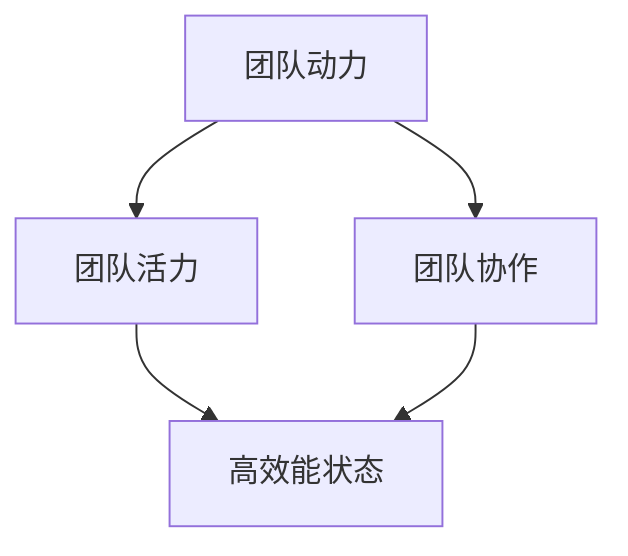

                 

### 文章标题

# 团队能量管理：维持高效能状态的方法

### 关键词

- 团队能量管理
- 高效能状态
- 团队动力
- 团队活力
- 团队协作
- 激励机制

### 摘要

本文将深入探讨团队能量管理的核心概念和实践方法，以帮助团队维持高效能状态。我们将从背景介绍、核心概念联系、实践方法、案例分析、挑战与对策以及未来发展等多个角度，系统地阐述团队能量管理的重要性和实施策略。通过本文的阅读，读者将能够全面了解团队能量管理的内涵，掌握维持团队高效能状态的实用方法，为团队管理提供有力支持。

## 引言

在现代社会，团队已经成为企业运作的核心。一个高效能的团队不仅能够提高工作效率，还能推动企业创新和发展。然而，维持团队的高效能状态并非易事。团队成员的积极性、协作和团队动力等因素都会影响团队的整体表现。因此，团队能量管理应运而生，成为团队管理中不可或缺的一环。

### 团队能量管理的背景

随着经济全球化和信息技术的发展，企业面临的市场竞争日益激烈。为了在这种竞争环境中脱颖而出，企业需要依靠团队的力量来快速响应市场变化，实现创新和持续发展。然而，传统的团队管理模式往往注重任务完成和绩效考核，而忽视了团队成员的心理需求和个人成长。这导致团队成员在高压环境下容易出现疲劳、失去动力，进而影响团队的整体表现。

### 团队能量管理的重要性

团队能量管理是一种全新的团队管理模式，它强调激发团队成员的积极性、提高团队协作效率和增强团队活力。通过有效的团队能量管理，企业可以营造一个积极向上的团队氛围，提高团队成员的满意度和忠诚度，从而维持团队的高效能状态。

### 本书的内容结构和目标

本书将围绕团队能量管理的核心概念和实践方法展开讨论。具体包括以下几个方面：

1. **核心概念**：介绍团队动力、团队活力和团队协作等核心概念，并阐述它们之间的联系。
2. **实践方法**：探讨如何通过提升团队成员积极性、协调团队成员关系和优化团队工作流程来维持团队高效能状态。
3. **案例分析**：通过实际案例展示团队能量管理的应用效果。
4. **挑战与对策**：分析团队能量管理中可能遇到的问题和挑战，并提出相应的对策。
5. **未来发展**：探讨团队能量管理的未来发展趋势和方向。

通过本书的学习，读者将能够：

- 全面了解团队能量管理的概念和原理。
- 掌握维持团队高效能状态的方法和技巧。
- 提高团队管理的实践能力，为企业的发展提供有力支持。

## 第1章 团队能量管理的核心概念

团队能量管理涉及多个核心概念，包括团队动力、团队活力和团队协作。这些概念相互关联，共同影响着团队的高效能状态。

### 1.1 团队动力

团队动力是指团队成员在团队活动中所表现出的积极性和主动性。它源于团队成员的内在动机，如自我实现、成就感和归属感。团队动力的来源主要包括以下几个方面：

1. **自我实现需求**：团队成员希望通过在团队中的表现来证明自己的价值和能力。
2. **成就感**：团队成员希望在团队中获得认可和荣誉，从而获得满足感。
3. **归属感**：团队成员希望与团队建立紧密的联系，感受到团队的支持和关爱。

### 1.2 团队活力

团队活力是指团队在运行过程中所表现出的生机和活力。它反映了团队成员的积极性和创新能力。团队活力的表现主要包括以下几个方面：

1. **高效率**：团队成员在团队活动中能够高效地完成任务，达成目标。
2. **创新能力**：团队成员能够提出新的想法和解决方案，推动团队创新。
3. **协作精神**：团队成员在团队活动中能够相互支持，共同解决问题。

### 1.3 团队协作

团队协作是指团队成员在团队活动中相互配合，共同完成任务的过程。团队协作的重要性体现在以下几个方面：

1. **提高工作效率**：通过团队协作，可以充分利用团队成员的技能和经验，提高整体工作效率。
2. **增强团队凝聚力**：团队协作有助于增强团队成员之间的信任和默契，提高团队凝聚力。
3. **降低沟通成本**：团队协作可以减少不必要的沟通和协调，降低沟通成本。

### 1.4 核心概念之间的关系架构

团队动力、团队活力和团队协作这三个核心概念之间存在着密切的联系。团队动力是团队活力和团队协作的基础，没有足够的团队动力，团队活力和团队协作将难以维持。而团队活力和团队协作又是维持团队动力的关键，只有当团队成员在团队中感受到活力和协作精神时，他们的团队动力才能得到持续激发。因此，团队能量管理需要从这三个核心概念出发，综合考虑，才能实现团队的高效能状态。

### Mermaid 流程图

下面是团队动力、团队活力和团队协作之间的关系架构的 Mermaid 流程图：



## 第2章 团队能量管理的实践方法

在了解了团队能量管理的核心概念后，接下来我们将探讨如何通过实践方法来维持团队的高效能状态。实践方法主要包括提升团队成员积极性、协调团队成员关系和优化团队工作流程。

### 2.1 提升团队成员积极性

提升团队成员积极性是团队能量管理的重要一环。以下是一些具体的方法：

1. **激励机制的建立**：通过设立合理的激励机制，如奖金、晋升机会等，激发团队成员的积极性。
    ```python
    # 伪代码：设定奖金激励机制
    def incentive_system(employee, performance):
        if performance > threshold:
            employee.bonus += base_bonus
            if employee.performance >= top_performance:
                employee.promotion()
    ```

2. **目标设定的明确性**：为团队成员设定明确的目标，使他们知道自己的努力方向和目标。
    ```python
    # 伪代码：设定明确的目标
    def set_goals(employee, goals):
        employee.current_goals = goals
        employee.performance = evaluate_performance(employee.current_goals)
    ```

3. **反馈机制的建立**：及时给予团队成员反馈，帮助他们了解自己的工作表现和改进方向。
    ```python
    # 伪代码：提供反馈
    def provide_feedback(employee):
        employee.performance_report = generate_report(employee)
        if employee.performance_report['suggestions']:
            employee.apply_suggestions(employee.performance_report['suggestions'])
    ```

### 2.2 协调团队成员关系

协调团队成员关系是维持团队活力和协作精神的关键。以下是一些具体的方法：

1. **沟通机制的建立**：建立有效的沟通机制，如定期会议、团队建设活动等，促进团队成员之间的交流和合作。
    ```mermaid
    graph TD
        A[定期会议] --> B[团队建设活动]
        A --> C[沟通渠道]
        B --> C
    ```

2. **冲突解决的策略**：团队成员之间的冲突是不可避免的，但可以通过以下策略来解决：
    ```python
    # 伪代码：解决冲突
    def resolve_conflict(participant1, participant2, issue):
        while not is_satisfied(participant1, participant2):
            participant1.propose_solution()
            participant2.evaluate_solution()
    ```

3. **信任机制的建立**：通过建立信任机制，如开放透明的沟通、共同承担责任等，增强团队成员之间的信任。
    ```python
    # 伪代码：建立信任机制
    def build_trust(team_members):
        for member in team_members:
            member.share_informations()
            member.take_responsibility()
    ```

### 2.3 优化团队工作流程

优化团队工作流程是提升团队效能的关键。以下是一些具体的方法：

1. **流程优化的方法**：通过分析现有流程，找出瓶颈和改进点，进行优化。
    ```mermaid
    graph TD
        A[流程分析] --> B[瓶颈识别]
        B --> C[改进方案]
        C --> D[流程优化]
    ```

2. **工具的运用**：运用先进的工具和软件，如项目管理软件、协作平台等，提高团队工作效率。
    ```python
    # 伪代码：使用项目管理软件
    def use_project_management_tool(projects):
        for project in projects:
            project.plan_tasks()
            project.track_progress()
    ```

3. **培训与学习的支持**：为团队成员提供培训和学习机会，提高他们的技能和知识水平。
    ```python
    # 伪代码：提供培训和学习机会
    def provide_training(employees):
        for employee in employees:
            employee.register_for_course()
            employeeattend_training_session()
    ```

### 2.4 综合应用

通过以上方法的综合应用，可以有效提升团队成员的积极性、协调团队成员关系和优化团队工作流程，从而维持团队的高效能状态。以下是一个综合应用的示例：

```python
# 伪代码：综合应用提升团队能量
def manage_energy(team):
    # 提升积极性
    for member in team:
        set_goals(member, member.get_goals())
        provide_feedback(member)
    
    # 协调关系
    build_trust(team)
    resolve_conflicts(team)
    
    # 优化流程
    optimize_workflow(team)
    use_project_management_tool(team.projects)
    provide_training(team.employees)
```

## 第3章 案例分析

为了更好地理解团队能量管理的实践方法，下面我们通过几个实际案例来展示团队能量管理的应用效果。

### 3.1 案例一：某互联网公司的团队能量管理实践

某互联网公司是一家快速发展的科技公司，公司领导意识到团队能量管理对于公司发展的重要性，因此采取了一系列措施来提升团队能量。

1. **激励机制的建立**：公司设立了绩效奖金制度，根据员工的绩效表现发放奖金。同时，为优秀员工提供晋升机会和职业发展通道。
    ```python
    # 伪代码：绩效奖金制度
    def calculate_bonus(employee, performance):
        if performance > threshold:
            employee.bonus = base_bonus * performance_factor
    ```

2. **团队活力的提升**：公司定期组织团队建设活动，如团建旅行、团队竞赛等，增强团队成员之间的交流和合作。
    ```mermaid
    graph TD
        A[团建旅行] --> B[团队竞赛]
        A --> C[团队建设活动]
        B --> C
    ```

3. **工作流程的优化**：公司引入了敏捷开发方法，通过迭代开发和持续改进，提高开发效率和质量。
    ```python
    # 伪代码：敏捷开发方法
    def agile_development(project):
        for iteration in project.iterations:
            plan_tasks(iteration)
            track_progress(iteration)
    ```

通过以上措施，该公司的团队能量得到了显著提升，团队成员的积极性和创新能力大幅提高，公司业绩也实现了快速增长。

### 3.2 案例二：某制造企业的团队能量管理挑战与对策

某制造企业由于业务规模较大，团队协作和管理面临较大挑战。为了提升团队能量，企业采取了以下对策：

1. **沟通机制的建立**：企业设立了多个沟通渠道，如定期会议、邮件群组等，确保团队成员之间的信息畅通。
    ```mermaid
    graph TD
        A[定期会议] --> B[邮件群组]
        A --> C[沟通渠道]
        B --> C
    ```

2. **冲突解决的策略**：企业建立了冲突解决机制，通过调解委员会来处理团队成员之间的冲突。
    ```python
    # 伪代码：冲突解决机制
    def resolve_conflict(committee, participant1, participant2, issue):
        committee.evaluate_issue(issue)
        committee.make_decision()
    ```

3. **培训与学习的支持**：企业为员工提供了丰富的培训和学习机会，提高员工的技能和知识水平。
    ```python
    # 伪代码：培训与学习支持
    def provide_training(employees):
        for employee in employees:
            employee.register_for_course()
            employee.attend_training_session()
    ```

通过以上对策，该企业的团队能量得到了显著提升，团队协作效率大幅提高，企业的生产效率和产品质量也得到了改善。

### 3.3 案例三：某服务公司的团队能量管理创新实践

某服务公司为了在竞争激烈的市场中脱颖而出，采取了创新的团队能量管理方法：

1. **虚拟现实团队建设**：公司利用虚拟现实技术组织团队建设活动，增强团队成员的沉浸感和体验感。
    ```mermaid
    graph TD
        A[虚拟现实] --> B[团队建设活动]
        A --> C[创新实践]
        B --> C
    ```

2. **个性化激励**：公司根据员工的兴趣和特长，设计个性化的激励方案，提高员工的满意度和忠诚度。
    ```python
    # 伪代码：个性化激励
    def personalized_incentive(employee, interests):
        if interests['achievement']:
            employee.bonus += achievement_bonus
        if interests['development']:
            employee.training_allowance += development_allowance
    ```

3. **全球化协作**：公司通过建立全球化的协作团队，充分利用不同地区的优势和资源，提升团队的创新能力。
    ```python
    # 伪代码：全球化协作
    def global_collaboration(team_members):
        for member in team_members:
            member.share_expertise()
            member.cooperate_with_international_teams()
    ```

通过以上创新实践，该公司的团队能量得到了显著提升，团队的创新能力和国际竞争力也得到了大幅提高。

## 第4章 团队能量管理的挑战与对策

在实施团队能量管理的过程中，企业可能会遇到一系列挑战。了解这些挑战并采取有效的对策，对于成功实施团队能量管理至关重要。

### 4.1 挑战

1. **团队成员的个体差异**：每个团队成员都有自己独特的性格、价值观和需求，这可能导致团队成员之间的不协调。
2. **团队目标的不明确**：如果团队目标不明确，团队成员将无法明确自己的努力方向，从而影响团队的整体表现。
3. **沟通不畅**：沟通不畅可能导致团队成员之间的误解和冲突，影响团队协作效率。
4. **激励机制不当**：如果激励机制不当，可能会导致团队成员之间的不公平感，影响团队的凝聚力。
5. **工作压力**：过大的工作压力可能导致团队成员感到疲劳和失去动力，影响团队的整体表现。

### 4.2 对策

1. **个性化和差异化管理**：针对团队成员的个体差异，采取个性化的管理和激励策略，尊重团队成员的个性和需求。
    ```python
    # 伪代码：个性化化管理
    def personalized_management(employee, profile):
        if profile['achievement']:
            employee.incentive_scheme = 'achievement_based'
        elif profile['development']:
            employee.incentive_scheme = 'development_based'
    ```

2. **明确团队目标**：通过明确团队目标，确保团队成员都清楚自己的努力方向和目标，提高团队的整体表现。
    ```python
    # 伪代码：明确团队目标
    def define_goals(team, goals):
        for member in team:
            member.current_goals = goals
    ```

3. **建立有效的沟通机制**：建立多种沟通渠道，确保团队成员之间的信息畅通，减少误解和冲突。
    ```mermaid
    graph TD
        A[定期会议] --> B[邮件群组]
        A --> C[沟通渠道]
        B --> C
    ```

4. **优化激励机制**：通过合理设计激励机制，确保团队成员之间的公平感，提高团队的凝聚力。
    ```python
    # 伪代码：优化激励机制
    def optimize_incentives(team):
        for member in team:
            member.bonus = calculate_bonus(member.performance)
    ```

5. **缓解工作压力**：通过合理安排工作任务、提供休息时间和心理辅导等方式，缓解团队成员的工作压力，提高团队的整体表现。
    ```python
    # 伪代码：缓解工作压力
    def reduce_stress(team):
        for member in team:
            member.workload = balance_workload(member.workload)
            member.received休息日数 = provide_rest_days()
    ```

通过以上对策，企业可以更好地应对团队能量管理中的挑战，提升团队的整体表现。

## 第5章 团队能量管理的未来发展

随着技术的不断进步和市场的变化，团队能量管理也在不断发展和创新。未来，团队能量管理将呈现以下发展趋势：

### 5.1 智能化

人工智能技术的应用将使团队能量管理更加智能化。通过大数据分析和机器学习，企业可以更准确地了解团队成员的需求和行为，从而制定更有效的激励策略和管理方案。

### 5.2 个性化

个性化将是未来团队能量管理的重要特征。企业将更加注重满足团队成员的个性化需求，通过定制化的培训、激励和沟通方式，提高团队成员的满意度和忠诚度。

### 5.3 全球化

全球化趋势将使团队能量管理面临更大的挑战和机遇。企业需要建立全球化协作团队，充分利用全球资源，提高团队的创新能力和国际竞争力。

### 5.4 可持续发展

可持续发展理念将深入人心，团队能量管理也将注重团队成员的长期发展和企业的社会责任。企业将采取更多措施来促进团队成员的职业发展，同时关注环境保护和社会责任。

### 总结

团队能量管理是维持团队高效能状态的关键。通过有效的团队能量管理，企业可以提升团队成员的积极性、协作精神和创新能力，从而实现持续发展和竞争优势。未来，团队能量管理将在智能化、个性化、全球化和可持续发展等方面取得更多突破，为团队管理和企业发展提供更加有力的支持。

## 作者信息

作者：AI天才研究院/AI Genius Institute & 禅与计算机程序设计艺术 /Zen And The Art of Computer Programming

