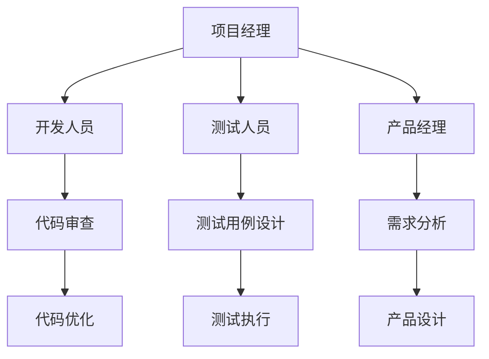
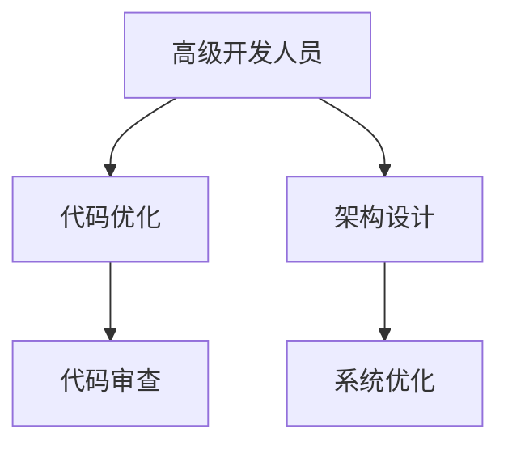
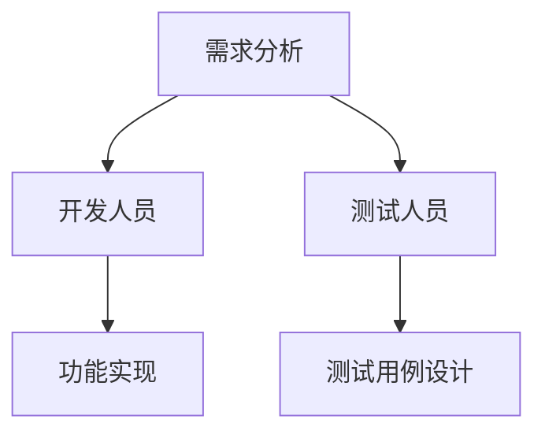

                 

# 文章标题：团队角色分配：发挥每个人的长处

> 关键词：团队角色分配、能力模型、角色适配性、角色管理、项目实战、案例分析

> 摘要：本文将探讨团队角色分配的重要性，以及如何通过合理的角色分配，最大化每个成员的能力，实现团队的高效运作和项目的成功。文章分为六部分，包括概述与目标、核心概念与联系、团队角色分配方法、角色适配性评估、项目实战和案例分析，以及角色管理与优化等内容。

### 概述与目标

在现代企业中，团队协作已经成为实现项目成功的关键因素。然而，如何合理分配团队角色，发挥每个人的长处，成为了一个重要的课题。本文旨在帮助读者理解和实践如何在团队中合理分配角色，最大化每个成员的能力，以实现团队的高效运作和项目的成功。

目录大纲如下：

1. **核心概念与联系**
2. **团队角色分配方法**
3. **角色适配性评估**
4. **项目实战**
5. **角色管理与优化**
6. **案例分析**

### 核心概念与联系

在团队角色分配中，我们需要理解几个核心概念：团队角色、能力模型和角色适配性。

**团队角色**是指团队成员在项目中承担的不同职责和任务。常见的团队角色包括项目经理、开发人员、测试人员、产品经理等。每个角色都有其特定的职责和技能要求。

**能力模型**是指团队成员所具备的能力和技能。这包括技术能力、沟通能力、团队协作能力等。团队角色分配时，需要考虑成员的能力模型，以确保团队角色与成员能力的匹配。

**角色适配性**是指团队成员在特定角色中的适应程度。一个高适配性的团队成员能够在其角色中发挥最佳水平，从而提高团队的整体效能。

为了更直观地展示团队角色之间的关系和协作流程，我们可以使用Mermaid流程图。



### 团队角色分配方法

团队角色分配的方法有多种，包括基于能力的分配、基于任务的分配和动态角色调整等。

**基于能力的分配**是指根据成员的能力模型，将其分配到合适的角色。这种方法适用于成员能力较强且多样化的团队。



**基于任务的分配**是指根据项目的需求和任务，将角色分配给成员。这种方法适用于项目需求明确、任务相对固定的团队。



**动态角色调整**是指根据项目进展和团队需求，适时调整成员的角色。这种方法适用于项目变化较多、需求不明确的团队。

```mermaid
graph TD
    A[开发人员] --> B{项目初期}
    A --> C[测试人员]{项目中期}
    A --> D[产品经理]{项目后期}
    B --> E[代码实现]
    C --> F[测试用例设计]
    D --> G[需求分析]
```

### 角色适配性评估

评估团队成员的角色适配性是团队角色分配的重要环节。以下是个体评估和团队整体评估的方法：

**个体评估**：通过问卷调查、面试和技能测试等方法，评估成员在特定角色中的适应程度和表现。

**团队整体评估**：通过项目绩效、团队协作情况和成员满意度等指标，评估团队的整体效能。

为了更准确地评估角色适配性，可以使用以下工具：

- **角色评估问卷**：用于评估成员在特定角色中的适应性和满意度。
- **绩效管理系统**：用于跟踪成员在项目中的表现和贡献。
- **团队反馈机制**：用于收集成员对角色分配和团队协作的反馈。

### 项目实战

在一个实际项目中，如何进行角色分配和角色调整是一个重要问题。以下是一个具体案例的解析。

**案例背景**：一个由5名成员组成的开发团队，负责一个电子商务网站的开发。团队成员包括项目经理、开发人员、测试人员、UI设计师和产品经理。

**角色分配**：

- **项目经理**：负责项目规划、进度控制和团队协作。
- **开发人员**：负责功能实现、代码审查和系统优化。
- **测试人员**：负责测试用例设计、测试执行和Bug跟踪。
- **UI设计师**：负责网站界面设计和用户体验优化。
- **产品经理**：负责需求分析、产品设计和市场调研。

**角色调整**：

- **项目初期**：团队成员按照各自的角色展开工作，项目经理负责项目规划和进度控制，开发人员负责功能实现，测试人员负责测试用例设计，UI设计师负责界面设计，产品经理负责需求分析和产品设计。
- **项目中期**：随着项目的进展，部分任务发生变动，项目经理调整开发人员和测试人员的角色，使其在特定阶段负责不同的任务。
- **项目后期**：在项目即将上线时，团队成员再次调整角色，以确保项目按时交付。

**代码实现与解读**：

以下是一个简单的伪代码，用于描述团队角色分配和角色调整的过程。

```python
# 初始化团队角色
team_roles = {
    "project_manager": "PM",
    "developers": ["Dev1", "Dev2", "Dev3"],
    "testers": ["Tester1", "Tester2"],
    "ui_designer": "UID",
    "product_manager": "PM"
}

# 角色分配
assign_roles(team_roles)

# 角色调整
adjust_roles(team_roles)

# 输出角色分配和调整结果
print(team_roles)
```

**代码解读**：

- `team_roles`：用于存储团队成员和角色的字典。
- `assign_roles()`：用于初始化团队角色的函数。
- `adjust_roles()`：用于根据项目进展调整团队成员角色的函数。
- `print()`：用于输出角色分配和调整结果的函数。

### 角色管理与优化

为了确保团队角色分配的有效性，需要持续进行角色管理和优化。以下是一些最佳实践：

- **角色冲突的解决**：当团队成员在角色分配上出现冲突时，项目经理应及时介入，进行协调和沟通，确保团队协作顺利进行。
- **角色效率评估**：定期评估团队成员的角色效率，识别低效角色，并采取相应措施进行优化。
- **角色优化策略**：根据项目需求和团队情况，适时调整角色，以适应项目变化和团队发展。

### 案例分析

以下是几个成功的团队角色分配案例，以及其成功原因和可借鉴的经验：

1. **案例1：敏捷开发团队**  
成功原因：敏捷开发团队通过灵活的角色分配，快速响应项目变化，提高了开发效率。  
可借鉴经验：引入敏捷开发方法，灵活调整团队角色，确保项目顺利推进。

2. **案例2：跨部门协作项目**  
成功原因：跨部门协作项目通过明确各部门的角色和职责，提高了团队协作效率。  
可借鉴经验：建立跨部门沟通机制，明确角色和职责，确保项目顺利进行。

3. **案例3：初创公司团队**  
成功原因：初创公司团队通过角色调整和优化，提高了团队整体效能。  
可借鉴经验：初创公司应注重团队角色分配的灵活性和适应性，以应对市场变化。

### 附录

**附录A：实用工具与资源**

- **角色分配工具**：如Trello、Jira等项目管理工具，用于角色分配和任务跟踪。
- **角色评估工具**：如SurveyMonkey、Google Forms等在线问卷调查工具，用于角色适配性评估。
- **实用资源链接**：推荐一些关于团队角色分配和管理的专业书籍、博客和论坛，供读者进一步学习。

### 小结

本文探讨了团队角色分配的重要性，以及如何通过合理的角色分配，最大化每个成员的能力，实现团队的高效运作和项目的成功。文章分为概述与目标、核心概念与联系、团队角色分配方法、角色适配性评估、项目实战和案例分析等部分，提供了丰富的实践经验和最佳实践。

通过本文的阅读，读者应能够理解团队角色分配的基本概念，掌握不同的角色分配方法，学会评估和优化团队角色，以及从成功案例中吸取经验，提高团队协作效率。

### 注意事项

- 在进行团队角色分配时，要充分考虑成员的能力和兴趣，确保角色与能力的匹配。
- 定期进行角色评估和调整，以适应项目变化和团队发展。
- 关注团队成员的反馈和需求，确保角色分配的公正性和合理性。
- 引入敏捷开发方法，提高团队协作效率。

### 拓展阅读

- 《敏捷开发实践指南》
- 《团队协作的艺术》
- 《绩效管理实战》
- 《项目管理知识体系指南》

作者：AI天才研究院/AI Genius Institute & 禅与计算机程序设计艺术 /Zen And The Art of Computer Programming

本文旨在为读者提供关于团队角色分配的全面指导，帮助团队实现高效运作和项目成功。希望本文能对您的团队建设和项目管理工作有所帮助。

# 提问：你好，我有一个关于Git的问题，在使用Git rebase时，我想将某个特定的提交记录（例如提交ID为abcd1234）移动到另一个特定的位置，如何在Git中实现这个操作？

你好！在Git中，如果你想要移动一个特定的提交记录到另一个位置，你可以使用`git rebase`命令结合`git cherry-pick`命令来完成这个操作。这里是一个具体的步骤：

### 步骤1：找到提交记录

首先，你需要找到你要移动的提交的ID。你可以在Git的提交历史中找到它，使用以下命令：

```bash
git log --oneline
```

### 步骤2：创建临时分支

在移动提交之前，为了防止破坏现有的历史记录，建议创建一个临时分支：

```bash
git checkout -b temp-branch
```

### 步骤3：cherry-pick提交

接着，使用`git cherry-pick`命令将目标提交移动到临时分支的顶部：

```bash
git cherry-pick abcd1234
```

这里`abcd1234`是你想要移动的提交ID。

### 步骤4：移动提交

现在，你可以手动将这个提交移动到目标位置。你可以使用Git的命令行来移动提交：

```bash
git rebase -i origin/main
```

这个命令会打开一个交互式界面，让你编辑提交历史。在这里，你可以找到你刚刚cherry-pick的提交，将它移动到目标位置。修改`.git/rebase`文件，使用以下格式：

```
pick bcd2345 Modify commit message
pick abcd1234 Move this commit to the desired position
pick fgh5678 Another commit
```

将`abcd1234`移动到你想要的位置。

### 步骤5：完成rebase

保存并关闭文件后，Git会重新应用提交。如果出现冲突，你需要解决冲突并继续：

```bash
git add .
git rebase --continue
```

### 步骤6：推送更改

完成rebase后，将你的更改推送到远程仓库：

```bash
git push origin temp-branch --force
```

使用`--force`标志是因为`git rebase`会创建一个新的分支历史，与现有的历史不兼容。

**注意事项**：

- 在进行这类操作时，请确保你有充分的备份，以防意外情况发生。
- 如果你的分支已经被其他人拉取，使用`--force`可能会破坏他们的工作。因此，务必与团队成员沟通，确保他们已经拉取了最新的更改。

希望这个方法能够帮助到你！如果你有任何其他问题，欢迎继续提问。

