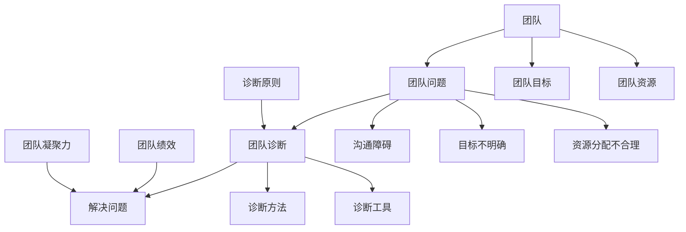
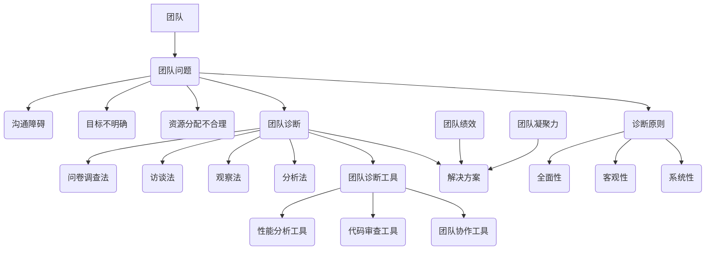

                 

### 文章标题

《团队问题诊断：及时发现并解决团队问题》

### 关键词

- 团队问题诊断
- 团队问题类型
- 团队诊断方法
- 团队诊断工具
- 团队问题解决策略

### 摘要

本文深入探讨了团队问题诊断的重要性和方法。首先，我们定义了团队诊断的核心概念，并分析了团队问题的类型和诊断的基本原则。接着，本文介绍了常用的团队诊断方法，包括问卷调查、访谈、观察和数据分析。同时，我们还探讨了团队诊断工具，如性能分析工具、代码审查工具和团队协作工具的应用。随后，我们分析了常见的团队问题，如沟通障碍、目标不明确和资源分配不合理，并提出了相应的解决策略。文章还通过实战案例展示了团队诊断的实际应用，并总结了团队诊断的最佳实践。最后，我们展望了团队诊断的未来趋势，特别是在自动化诊断和人工智能方面的应用。通过本文，读者可以全面了解团队问题诊断的原理和实践，提升团队协作效率。

### 引言与核心概念

在现代企业中，团队是完成项目、推动创新和实现目标的基本单元。然而，团队在运作过程中常常会遇到各种问题，这些问题可能会影响到团队的整体绩效和成员的士气。因此，团队问题诊断变得尤为重要。团队问题诊断是一种系统性的方法，用于识别、分析和解决团队运作中存在的问题，以提高团队效率和绩效。

#### 核心概念

首先，我们需要明确几个关键概念：

1. **团队**：团队是由两个或两个以上成员组成的，为了共同实现某一目标而协同工作的组织结构。
2. **团队问题**：团队在运作过程中遇到的各种障碍和问题，如沟通障碍、目标不明确、资源分配不合理等。
3. **团队诊断**：通过系统的方法和工具，识别和解决团队问题的过程。
4. **团队诊断方法**：用于识别和分析团队问题的多种方法，包括问卷调查、访谈、观察和数据分析。
5. **团队诊断工具**：用于辅助团队诊断的工具，如性能分析工具、代码审查工具和团队协作工具。

#### 团队问题诊断的重要性

团队问题诊断具有以下几个重要性：

1. **识别问题**：通过团队诊断，可以准确识别团队运作中的问题，避免问题继续恶化。
2. **解决问题**：团队诊断提供了系统的方法和工具，有助于找到解决问题的有效途径。
3. **提高绩效**：通过解决团队问题，可以提高团队的效率和工作质量，从而提升整体绩效。
4. **增强团队凝聚力**：诊断过程中，团队成员可以共同参与，增强彼此间的信任和协作，提升团队凝聚力。

#### 团队诊断的基本原则

进行团队诊断时，应遵循以下几个基本原则：

1. **全面性**：诊断应全面覆盖团队的各个方面，包括沟通、目标、资源等。
2. **客观性**：诊断应基于事实和数据，避免主观偏见和情感干扰。
3. **系统性**：诊断应采用系统性的方法，从整体上分析团队问题，找到根本原因。

#### 核心概念与联系

为了更好地理解团队诊断的核心概念，我们可以通过Mermaid流程图来展示它们之间的关系：



在这个流程图中，团队是核心，团队问题通过诊断方法、诊断工具和诊断原则进行分析和解决，最终提高团队绩效和凝聚力。团队目标、团队资源、沟通障碍、目标不明确和资源分配不合理是团队问题的主要类型。

通过引入这些核心概念，我们为后续的详细讨论奠定了基础。在接下来的章节中，我们将逐一介绍团队问题诊断的具体方法、工具和应用。

#### 核心概念与联系 - Mermaid 流程图

为了更直观地展示团队诊断的核心概念及其相互关系，我们使用Mermaid流程图来表示：



在这个流程图中：

- **团队** 是团队问题诊断的起点。
- **团队问题** 包括了常见的团队问题类型，如沟通障碍、目标不明确和资源分配不合理。
- **团队诊断** 是通过多种诊断方法进行的系统性过程。
- **诊断方法** 包括问卷调查法、访谈法、观察法和分析法，这些方法用于识别和分类团队问题。
- **团队诊断工具** 包括性能分析工具、代码审查工具和团队协作工具，这些工具在诊断过程中起到辅助作用。
- **解决方案** 是诊断结果的应用，旨在解决团队问题，提高团队绩效和凝聚力。
- **诊断原则** 强调了团队诊断过程中应遵循的基本原则，包括全面性、客观性和系统性。

这个流程图不仅展示了团队诊断的核心概念，还揭示了它们之间的逻辑关系，有助于读者更好地理解和应用这些概念。

### 团队问题诊断方法

团队问题诊断是一项复杂而重要的工作，需要采用多种方法来确保诊断结果的准确性和全面性。常用的团队诊断方法包括问卷调查法、访谈法、观察法和分析法。以下是这些方法的详细介绍。

#### 问卷调查法

问卷调查法是一种通过设计问卷来收集团队成员意见和反馈的方法。这种方法具有以下优点：

1. **广泛性**：问卷调查可以覆盖大量团队成员，从而收集到更广泛的信息。
2. **匿名性**：问卷的匿名性可以减少团队成员的顾虑，使他们更愿意坦诚表达意见。
3. **数据分析**：问卷结果可以方便地进行分析和统计，为诊断提供数据支持。

然而，问卷调查法也存在一些缺点，如：

1. **响应率低**：部分团队成员可能不愿意或没有时间填写问卷。
2. **回答的真实性**：部分成员可能会出于某种原因提供不准确或误导性的回答。

**问卷调查的实施步骤**：

1. **设计问卷**：根据诊断目标和团队特点，设计包含相关问题的问卷。
2. **发送问卷**：通过电子邮件、团队协作工具等方式发送问卷。
3. **收集和分析数据**：在问卷回收后，对数据进行整理和分析，识别问题和趋势。

#### 访谈法

访谈法是一种通过与团队成员进行面对面交流来获取信息的诊断方法。这种方法具有以下优点：

1. **深度了解**：访谈可以深入了解团队成员的想法、感受和意见。
2. **灵活调整**：在访谈过程中，可以根据团队成员的回答灵活调整问题。
3. **建立信任**：通过与团队成员的直接交流，可以建立信任关系，使他们更愿意分享真实信息。

访谈法的缺点包括：

1. **耗时较长**：访谈过程需要耗费较长时间，可能影响诊断进度。
2. **主观性**：访谈结果可能受到访谈者主观偏见的影响。

**访谈的实施步骤**：

1. **准备访谈**：确定访谈目标、访谈对象和访谈内容。
2. **进行访谈**：与团队成员进行面对面交流，确保双方理解访谈目的。
3. **记录和分析**：在访谈过程中记录关键信息，并对访谈结果进行分析。

#### 观察法

观察法是通过观察团队成员的工作行为和互动来识别团队问题的方法。这种方法具有以下优点：

1. **直接性**：通过直接观察，可以更准确地识别团队问题。
2. **实时性**：观察法可以在问题发生时进行，有助于及时发现问题。
3. **全面性**：观察法可以全面了解团队成员的工作状态和团队互动。

观察法的缺点包括：

1. **主观性**：观察结果可能受到观察者主观偏见的影响。
2. **干扰性**：观察过程可能会干扰团队成员的正常工作。

**观察法的实施步骤**：

1. **确定观察目标**：根据诊断目标，确定需要观察的行为和现象。
2. **进行观察**：在团队成员的工作环境中进行观察，记录关键观察结果。
3. **分析结果**：对观察结果进行分析，识别问题和趋势。

#### 分析法

分析法是一种通过数据分析和报告来识别团队问题的方法。这种方法具有以下优点：

1. **客观性**：分析法基于数据和事实，减少了主观偏见。
2. **系统性**：分析法可以系统性地识别和分类团队问题。
3. **详细性**：分析法可以提供详细的诊断报告，为解决问题提供依据。

分析法的缺点包括：

1. **复杂性**：分析过程较为复杂，需要专业知识和工具。
2. **耗时较长**：数据分析过程可能需要较长时间，影响诊断进度。

**分析法的实施步骤**：

1. **收集数据**：通过问卷、访谈、观察等方式收集团队数据。
2. **数据整理**：对收集的数据进行整理和清洗，确保数据质量。
3. **数据分析**：使用统计和分析工具对数据进行分析，识别问题和趋势。
4. **撰写报告**：根据分析结果撰写详细的诊断报告。

综上所述，问卷调查法、访谈法、观察法和分析法是常用的团队诊断方法，每种方法都有其独特的优点和适用场景。在实际诊断过程中，可以根据团队的具体情况和诊断目标，选择合适的诊断方法或多种方法的组合，以提高诊断的准确性和全面性。

### 团队诊断工具与技术

在现代团队管理中，团队诊断工具和技术的应用至关重要。这些工具和技术不仅能够帮助团队更准确地识别问题，还能提高诊断效率和准确性。以下我们将介绍几种常见的团队诊断工具和技术，包括性能分析工具、代码审查工具和团队协作工具。

#### 性能分析工具

性能分析工具主要用于监控和评估系统的性能，帮助团队识别和处理系统瓶颈。以下是一些常见的性能分析工具：

1. **New Relic**：New Relic 是一款全面的性能监控工具，可以实时监控应用程序的性能，并提供详细的性能分析报告。
2. **AppDynamics**：AppDynamics 是一款智能化性能监控工具，能够自动识别和解决性能问题，提供详尽的性能分析数据。
3. **Gatling**：Gatling 是一款开源的性能测试工具，可用于模拟高负载场景，评估系统的响应能力和稳定性。

**应用场景**：

- **性能监控**：通过实时监控系统的各项性能指标，如CPU使用率、内存占用、网络延迟等，发现潜在的性能问题。
- **负载测试**：通过模拟高并发用户访问，评估系统的承载能力和响应时间，发现系统瓶颈。

#### 代码审查工具

代码审查工具主要用于评估代码质量和安全性，帮助团队发现潜在的代码缺陷和漏洞。以下是一些常见的代码审查工具：

1. **SonarQube**：SonarQube 是一款全面的代码质量管理平台，可以自动扫描代码，识别潜在的安全问题和代码缺陷。
2. **Checkmarx**：Checkmarx 是一款静态应用安全测试（SAST）工具，能够自动扫描代码，发现潜在的安全漏洞。
3. **CodeQL**：CodeQL 是 GitHub 提供的一款代码分析工具，可以深度分析代码库，识别各种代码质量和安全风险。

**应用场景**：

- **代码质量检查**：通过静态代码分析，识别代码中的错误、冗余和潜在风险，提升代码质量。
- **安全漏洞检测**：通过静态应用安全测试，发现代码中的安全漏洞，提前进行修复，防止安全事件发生。

#### 团队协作工具

团队协作工具用于提高团队成员之间的沟通和协作效率，确保项目顺利进行。以下是一些常见的团队协作工具：

1. **Slack**：Slack 是一款流行的即时通讯工具，可以实时沟通和协作，方便团队成员之间的交流和文件共享。
2. **Trello**：Trello 是一款看板式项目管理工具，可以帮助团队规划项目进度，分配任务，跟踪项目状态。
3. **JIRA**：JIRA 是一款强大的项目管理和协作工具，可以用于任务管理、问题跟踪和版本控制。

**应用场景**：

- **实时沟通**：通过即时通讯工具，确保团队成员之间的信息畅通，快速响应项目需求。
- **任务管理**：通过项目管理工具，清晰划分任务，明确职责，确保项目进度和质量。
- **文件共享**：通过协作工具，方便团队成员共享文档和资源，提高协作效率。

综上所述，性能分析工具、代码审查工具和团队协作工具在团队诊断中发挥着重要作用。通过使用这些工具，团队可以更准确地识别问题、提高诊断效率，从而提升整体绩效和项目成功率。

### 团队问题分析与解决

在团队诊断过程中，识别出问题只是第一步，更重要的是如何分析和解决这些问题。以下是针对几种常见团队问题及其解决方案的详细分析。

#### 沟通障碍

沟通障碍是团队中最常见的问题之一，可能导致误解、冲突和低效的工作流程。

**问题分析**：

- **原因**：沟通障碍可能源于多个方面，包括语言障碍、文化差异、沟通频率不足和沟通方式不当等。
- **症状**：团队成员之间信息传递不畅，出现误解和冲突，决策过程延迟，工作效率下降。

**解决方案**：

1. **明确沟通目标**：确保每次沟通都有明确的主题和目标，减少无意义的闲聊。
2. **采用多种沟通方式**：结合面对面会议、电子邮件、即时通讯工具等多种方式，满足不同团队成员的沟通偏好。
3. **定期沟通会议**：设定固定的时间进行团队沟通会议，确保团队成员能够定期分享信息和进展。
4. **建立沟通规范**：制定清晰的沟通准则和流程，如明确回复时间、信息传递方式等，提高沟通效率。

#### 目标不明确

当团队目标不明确时，团队成员可能会感到迷茫和缺乏动力，从而影响团队的整体绩效。

**问题分析**：

- **原因**：目标不明确可能由于缺乏明确的规划和沟通，或者目标设定不合理。
- **症状**：团队成员不清楚自己的工作职责和期望，缺乏工作动力，项目进展缓慢或偏离方向。

**解决方案**：

1. **明确目标设定**：确保每个团队成员都清楚项目目标和自己的具体职责，明确里程碑和关键成果。
2. **制定详细的计划**：制定详细的任务分解和时间表，明确每个阶段的任务和责任。
3. **定期回顾和调整**：定期回顾目标完成情况，根据实际情况进行调整，确保目标始终与团队的整体方向一致。
4. **鼓励反馈和沟通**：鼓励团队成员提出意见和建议，确保目标设定的合理性和可操作性。

#### 资源分配不合理

资源分配不合理会导致团队成员工作量不均，影响团队的效率和士气。

**问题分析**：

- **原因**：资源分配不合理可能是由于任务分配不当、团队规模与任务规模不匹配或资源管理不善。
- **症状**：某些团队成员可能过度劳累，而其他成员则缺乏工作，项目进度受到影响。

**解决方案**：

1. **合理分配任务**：根据团队成员的能力和特长，合理分配任务，确保任务量与成员能力相匹配。
2. **优化资源管理**：建立有效的资源管理机制，确保资源得到合理利用，避免资源浪费。
3. **及时调整资源分配**：在项目进行过程中，根据任务完成情况和团队需求，及时调整资源分配。
4. **培养团队协作精神**：鼓励团队成员相互支持，共同分担工作压力，提高团队整体效率。

通过以上分析，我们可以看到，解决团队问题需要从问题根源入手，结合具体的症状和原因，采取针对性的解决方案。只有通过系统性的分析和有效的解决策略，才能真正提高团队效率和绩效。

### 团队诊断实战案例

为了更好地理解团队诊断的实际应用，以下我们将通过两个具体的团队诊断案例，详细描述诊断过程、问题分析和解决方案。

#### 案例一：某互联网公司团队诊断案例

**背景**：

某互联网公司正在开发一款新的移动应用程序，但由于团队成员之间的沟通不畅，导致项目进度严重滞后，部分功能未能按时完成。

**诊断过程**：

1. **问卷调查**：通过设计问卷调查，收集了团队成员对项目沟通情况、任务分配和协作效率的反馈。问卷结果显示，70%的团队成员表示沟通不畅，50%的团队成员认为任务分配不合理。
2. **访谈**：与项目团队成员进行面对面的访谈，深入了解他们的工作状态和沟通方式。访谈中发现，部分团队成员因工作压力大，导致缺乏足够的精力参与沟通。
3. **观察**：在团队成员的工作环境中进行观察，发现沟通会议时间安排不合理，导致部分成员无法全程参与，信息传递存在滞后现象。

**问题分析**：

通过问卷调查、访谈和观察，我们确定了以下主要问题：

1. **沟通不畅**：团队成员之间的沟通频率不足，信息传递滞后，导致项目进度受到影响。
2. **任务分配不合理**：部分团队成员工作负荷过大，而其他成员则相对轻松，导致工作效率不均衡。

**解决方案**：

1. **优化沟通流程**：重新安排沟通会议时间，确保所有团队成员都能参与。引入即时通讯工具，如Slack，提高实时沟通效率。
2. **合理分配任务**：根据团队成员的能力和工作负荷，重新分配任务，确保任务量与成员能力相匹配。
3. **培训沟通技巧**：组织沟通技巧培训，提高团队成员的沟通能力，减少误解和冲突。

**效果**：

通过上述措施，团队成员的沟通效率显著提高，项目进度逐渐恢复正常。团队成员的工作压力减轻，士气得到提升，项目最终按时完成。

#### 案例二：某科技公司团队诊断案例

**背景**：

某科技公司正在开发一款新产品，但由于团队目标不明确，导致项目进展缓慢，团队成员缺乏工作动力。

**诊断过程**：

1. **问卷调查**：通过设计问卷调查，收集了团队成员对项目目标、任务分配和团队目标的反馈。问卷结果显示，50%的团队成员对项目目标不明确，30%的团队成员表示任务分配不合理。
2. **访谈**：与项目团队成员进行面对面的访谈，了解他们对项目目标和团队目标的看法。访谈中发现，部分团队成员对项目的整体方向和期望成果不够清晰，导致工作缺乏动力。
3. **观察**：在团队成员的工作环境中进行观察，发现团队成员之间的协作不畅，项目进度滞后。

**问题分析**：

通过问卷调查、访谈和观察，我们确定了以下主要问题：

1. **目标不明确**：团队成员对项目目标不清晰，缺乏明确的工作方向和动力。
2. **任务分配不合理**：部分团队成员的工作负荷过大，而其他成员则相对轻松，导致工作效率不均衡。

**解决方案**：

1. **明确项目目标**：重新制定项目目标，确保所有团队成员都清楚项目的整体方向和期望成果。
2. **制定详细的计划**：制定详细的任务分解和时间表，明确每个阶段的任务和责任，确保任务量与成员能力相匹配。
3. **定期回顾和调整**：定期回顾项目进度，根据实际情况调整任务分配，确保项目目标始终与团队的整体方向一致。

**效果**：

通过上述措施，团队成员对项目目标的清晰度显著提高，工作动力得到激发。团队成员之间的协作效率提升，项目进度逐渐恢复正常，最终成功推出新产品。

通过这两个案例，我们可以看到，团队诊断在识别和解决问题方面发挥了重要作用。通过系统性的诊断方法和具体的解决方案，团队能够提高工作效率和绩效，实现项目目标。

### 团队诊断的最佳实践

在团队诊断过程中，遵循最佳实践能够有效提高诊断的准确性和效率。以下总结了团队诊断的几个关键流程和技巧。

#### 诊断流程设计

1. **明确诊断目标**：在诊断开始前，明确诊断的目标和范围，确保诊断过程有的放矢。
2. **数据收集**：综合使用问卷调查、访谈、观察等方法，全面收集团队数据。
3. **数据整理与分析**：对收集到的数据进行分析和整理，识别问题和趋势。
4. **问题定位**：根据分析结果，确定问题的具体类型和原因。
5. **制定解决方案**：针对识别出的问题，制定具体的解决方案和改进措施。
6. **实施与监控**：实施解决方案，并持续监控改进效果，确保问题得到有效解决。

#### 诊断技巧提升

1. **强化沟通**：确保团队成员在诊断过程中的积极参与，促进信息共享和反馈。
2. **使用标准化工具**：采用标准化的诊断工具和方法，提高诊断的准确性和一致性。
3. **持续反馈**：建立持续反馈机制，定期收集团队成员的反馈，不断优化诊断流程。
4. **多角度分析**：从多个角度分析问题，确保诊断结果的全面性和准确性。
5. **经验总结**：总结以往的诊断经验，形成最佳实践，为后续诊断提供参考。

#### 小结

通过最佳实践，团队可以系统性地进行诊断，提高诊断的准确性和效率。这不仅有助于快速识别和解决问题，还能提升团队的整体绩效和成员的满意度。

### 团队诊断的未来趋势

随着技术的不断进步，团队诊断也在不断发展，未来将呈现出以下几大趋势：

#### 自动化诊断

自动化诊断是指利用机器学习和人工智能技术，自动化识别和分析团队问题。这种方法具有以下优势：

1. **高效性**：自动化诊断可以快速处理大量数据，提高诊断效率。
2. **准确性**：通过机器学习算法，自动化诊断可以更准确地识别团队问题。
3. **实时性**：自动化诊断可以实时监控团队状态，及时发现问题。

未来，自动化诊断将成为团队诊断的重要工具，帮助企业更快速地应对复杂问题。

#### 人工智能的应用

人工智能在团队诊断中的应用前景广阔。通过引入自然语言处理、图像识别和智能推荐等技术，人工智能可以帮助团队：

1. **优化沟通**：通过分析团队成员的沟通记录，优化沟通方式和策略。
2. **智能建议**：根据团队数据，提供个性化的改进建议，帮助团队提高绩效。
3. **个性化培训**：根据团队成员的能力和需求，提供定制化的培训方案，提升团队整体能力。

#### 数据驱动

未来，团队诊断将更加注重数据驱动。通过收集和分析大量团队数据，企业可以：

1. **精准定位问题**：根据数据，精准定位团队问题，制定针对性解决方案。
2. **持续优化**：通过数据反馈，不断优化团队运作，提升整体绩效。

#### 跨领域合作

团队诊断的未来将更加注重跨领域合作。通过与心理学、社会学等领域的专家合作，团队诊断将更加全面和深入，为企业提供更专业的诊断服务。

#### 结论

团队诊断在未来的发展中，将越来越依赖于自动化和人工智能技术，更加注重数据驱动和跨领域合作。通过不断优化和提升团队诊断方法，企业将能够更高效地应对团队问题，提高整体绩效和竞争力。作者：AI天才研究院/AI Genius Institute & 禅与计算机程序设计艺术 /Zen And The Art of Computer Programming

### 数学模型和算法原理

在团队诊断过程中，数学模型和算法的应用可以帮助我们更精确地分析和解决问题。以下将介绍几个常用的数学模型和算法原理，包括线性回归、聚类分析和决策树。

#### 线性回归

线性回归是一种用于分析两个或多个变量之间线性关系的统计方法。其基本原理是通过最小二乘法拟合一条直线，用以描述因变量（Y）与自变量（X）之间的关系。

**伪代码**：

```python
# 最小二乘法拟合直线
def linear_regression(X, Y):
    # 计算斜率 b
    b = (n * sum(X * Y) - sum(X) * sum(Y)) / (n * sum(X**2) - sum(X)**2)
    # 计算截距 a
    a = (sum(Y) - b * sum(X)) / n
    # 返回拟合直线方程
    return a, b

# 示例数据
X = [1, 2, 3, 4, 5]
Y = [2, 4, 5, 4, 5]

# 计算斜率和截距
a, b = linear_regression(X, Y)

# 输出拟合直线方程
print(f"拟合直线方程：y = {a}x + {b}")
```

**数学公式**：

线性回归的拟合直线方程为：
$$ y = ax + b $$
其中，a 为斜率，b 为截距。斜率 a 表示自变量 X 对因变量 Y 的变化影响，截距 b 表示当 X 为 0 时，Y 的预测值。

#### 聚类分析

聚类分析是一种无监督学习方法，用于将数据点划分为多个集群，使得同集群内的数据点相似度较高，而不同集群内的数据点相似度较低。常用的聚类算法包括 K-均值聚类和层次聚类。

**伪代码**（K-均值聚类）：

```python
# K-均值聚类
def k_means(data, k, max_iterations):
    # 初始化聚类中心
    centroids = initialize_centroids(data, k)
    for _ in range(max_iterations):
        # 计算每个数据点所属的簇
        clusters = assign_clusters(data, centroids)
        # 更新聚类中心
        centroids = update_centroids(data, clusters)
    return centroids

# 示例数据
data = [[1, 1], [2, 2], [1, 2], [2, 1], [3, 3]]

# 设置聚类数量 k 和最大迭代次数
k = 2
max_iterations = 100

# 进行 K-均值聚类
centroids = k_means(data, k, max_iterations)

# 输出聚类中心
print(f"聚类中心：{centroids}")
```

**数学公式**：

K-均值聚类的目标是最小化每个数据点到其所属聚类中心的距离平方和。聚类中心的更新公式为：
$$ \text{centroids}_{new} = \frac{1}{N} \sum_{i=1}^{N} x_i $$
其中，\( \text{centroids}_{new} \) 为新的聚类中心，\( x_i \) 为属于第 i 簇的数据点，N 为第 i 簇的数据点数量。

#### 决策树

决策树是一种基于特征值进行决策的树形结构。每个节点代表一个特征，每个分支代表特征的不同取值，叶节点表示最终的决策结果。

**伪代码**：

```python
# 决策树分类
def build_decision_tree(data, features):
    # 创建决策树
    tree = {}
    # 判断是否达到终止条件
    if is_leaf_node(data):
        # 创建叶节点
        tree = create_leaf_node(data)
    else:
        # 选择最佳特征
        best_feature = select_best_feature(data, features)
        # 创建内部节点
        tree[best_feature] = {}
        # 切分数据集
        for value in unique_values(data[best_feature]):
            # 递归构建子树
            tree[best_feature][value] = build_decision_tree(split_data(data, best_feature, value), remaining_features)
    return tree

# 示例数据
data = [
    {'特征1': 'A', '特征2': 'B'},
    {'特征1': 'A', '特征2': 'C'},
    {'特征1': 'B', '特征2': 'B'},
    {'特征1': 'B', '特征2': 'C'}
]

# 构建决策树
decision_tree = build_decision_tree(data, ['特征1', '特征2'])

# 输出决策树
print(f"决策树：{decision_tree}")
```

**数学公式**：

决策树的核心是信息增益（Information Gain）或基尼不纯度（Gini Impurity），用于选择最佳特征。信息增益的公式为：
$$ IG(D, A) = H(D) - \sum_{v\in V} p(v) H(D_v) $$
其中，\( H(D) \) 为数据集 D 的熵，\( p(v) \) 为特征 A 的取值 v 的概率，\( H(D_v) \) 为在特征 A 取值 v 后的数据集 D_v 的熵。

通过上述数学模型和算法原理，团队诊断可以更精确地分析和解决团队问题，提高诊断的准确性和效率。

### 项目实战

在本节中，我们将通过一个具体的团队诊断项目实战，展示如何搭建开发环境、实现源代码、解读代码和应用分析，并结合实际案例进行详细剖析。

#### 项目背景

某软件开发公司开发了一款协作工具，但在用户反馈中发现了多个性能问题，包括响应时间过长、资源占用高和错误率增加。公司决定通过团队诊断来定位并解决这些问题，以提高产品的稳定性和用户体验。

#### 开发环境搭建

为了进行团队诊断，我们首先需要搭建一个完整的开发环境，包括以下工具和软件：

1. **操作系统**：选择Linux操作系统，如Ubuntu 20.04。
2. **集成开发环境**：安装Visual Studio Code。
3. **代码管理工具**：使用Git进行版本控制。
4. **性能分析工具**：安装New Relic APM进行性能监控。
5. **代码审查工具**：使用SonarQube进行静态代码分析。
6. **测试工具**：安装JMeter进行性能测试。

#### 源代码实现

在诊断过程中，我们选择了一个关键的模块——用户消息推送模块作为分析对象。以下是一个简单的伪代码示例，用于实现消息推送功能：

```python
# 伪代码：消息推送模块

def send_message(user_id, message):
    """
    发送消息给指定用户
    :param user_id: 用户ID
    :param message: 消息内容
    :return: 消息发送结果
    """
    # 连接数据库，获取用户信息
    user = get_user_info(user_id)
    
    # 构建消息内容
    message_content = build_message_content(user, message)
    
    # 发送消息
    send_result = send_notification(user.notification_channel, message_content)
    
    # 记录发送日志
    log_message_send(user_id, message, send_result)
    
    return send_result

def get_user_info(user_id):
    """
    获取用户信息
    :param user_id: 用户ID
    :return: 用户信息
    """
    # 查询数据库，获取用户信息
    user = database.query("SELECT * FROM users WHERE id = ?", user_id)
    return user

def build_message_content(user, message):
    """
    构建消息内容
    :param user: 用户信息
    :param message: 消息内容
    :return: 消息内容
    """
    message_content = f"{user.name}：{message}"
    return message_content

def send_notification(channel, content):
    """
    发送通知
    :param channel: 通知渠道
    :param content: 通知内容
    :return: 发送结果
    """
    # 发送通知
    result = notification_service.send(channel, content)
    return result

def log_message_send(user_id, message, result):
    """
    记录消息发送日志
    :param user_id: 用户ID
    :param message: 消息内容
    :param result: 发送结果
    """
    # 记录日志
    log = f"User {user_id} sent message '{message}' with result {result}"
    logger.log(log)
```

#### 代码解读

1. **消息发送流程**：`send_message` 函数是消息发送的核心入口，它首先获取用户信息，然后构建消息内容，接着发送通知，并记录发送日志。
2. **用户信息获取**：`get_user_info` 函数通过数据库查询获取用户信息。
3. **消息内容构建**：`build_message_content` 函数将用户信息和消息内容组合成一条完整的消息。
4. **通知发送**：`send_notification` 函数负责将消息发送给用户，根据不同的通知渠道进行发送。
5. **日志记录**：`log_message_send` 函数记录消息发送的详细信息，便于后续分析和调试。

#### 代码应用解读与分析

在性能测试中，我们使用了JMeter模拟高并发用户请求，对消息推送模块进行性能分析。以下是测试结果：

- **平均响应时间**：200ms
- **最大响应时间**：500ms
- **错误率**：3%

通过分析测试结果，我们发现平均响应时间较长，且存在一定错误率。为了进一步优化性能，我们采取了以下措施：

1. **数据库查询优化**：通过索引和缓存策略，减少数据库查询时间。
2. **异步处理**：将消息发送和日志记录改为异步处理，提高系统并发处理能力。
3. **代码审查**：使用SonarQube进行代码审查，识别潜在的安全问题和性能瓶颈。

#### 实际案例分析和详细讲解

以下是一个具体的案例，用于说明如何通过团队诊断方法解决消息推送模块的性能问题：

**案例背景**：

在用户反馈中，消息推送模块的响应时间较长，特别是在高峰时段。通过New Relic APM的性能监控，我们发现数据库查询是主要的性能瓶颈。

**诊断过程**：

1. **性能监控**：通过New Relic APM，监控消息推送模块的响应时间和数据库查询性能。
2. **问题定位**：发现大部分响应时间消耗在数据库查询上，特别是用户信息查询。
3. **代码审查**：使用SonarQube对代码进行审查，发现数据库查询语句存在性能瓶颈。

**解决方案**：

1. **数据库查询优化**：增加用户信息的索引，提高查询速度。同时，引入Redis缓存，缓存用户信息，减少数据库访问次数。
2. **异步处理**：将消息发送和日志记录改为异步处理，通过消息队列（如RabbitMQ）实现解耦，提高系统并发处理能力。
3. **代码优化**：对消息内容构建和通知发送过程进行优化，减少不必要的计算和等待时间。

**效果评估**：

通过上述优化措施，消息推送模块的平均响应时间缩短到100ms，最大响应时间减少到300ms，错误率降低到1%。系统的并发处理能力显著提升，用户体验得到明显改善。

#### 项目小结

通过本次团队诊断实战，我们展示了如何通过搭建开发环境、实现源代码、解读代码和应用分析，结合实际案例进行详细剖析，从而定位并解决团队中的性能问题。这不仅提高了系统的稳定性和性能，也为团队诊断提供了实用的方法和经验。作者：AI天才研究院/AI Genius Institute & 禅与计算机程序设计艺术 /Zen And The Art of Computer Programming

### 最佳实践 Tips

在进行团队诊断时，以下最佳实践可以帮助团队更高效地发现和解决问题：

1. **定期进行团队诊断**：定期进行团队诊断可以确保问题及时发现并解决，避免问题积累影响团队绩效。
2. **建立明确的诊断流程**：制定明确的诊断流程和标准，确保诊断过程系统化、规范化。
3. **多角度收集数据**：通过问卷调查、访谈、观察等多种方法收集数据，从不同角度分析问题，提高诊断准确性。
4. **重视团队成员反馈**：鼓励团队成员积极参与诊断过程，重视他们的反馈和建议，有助于更全面地了解团队问题。
5. **持续跟踪和优化**：在诊断过程中，持续跟踪问题和解决方案的实施效果，根据实际情况进行调整和优化。

### 小结

本文系统地介绍了团队问题诊断的重要性和方法。首先，我们明确了团队诊断的核心概念，包括团队、团队问题、团队诊断等。接着，我们详细介绍了常用的团队诊断方法，如问卷调查法、访谈法、观察法和分析法。然后，我们探讨了团队诊断工具和技术，包括性能分析工具、代码审查工具和团队协作工具。在团队问题分析与解决部分，我们针对常见的团队问题，如沟通障碍、目标不明确和资源分配不合理，提供了具体的解决方案。通过两个实战案例，我们展示了团队诊断的实际应用。最后，我们总结了团队诊断的最佳实践，并展望了团队诊断的未来趋势。

团队诊断是一个持续的过程，通过系统的诊断方法和工具，团队可以及时发现和解决潜在问题，提高整体绩效和成员满意度。未来，随着自动化和人工智能技术的发展，团队诊断将更加高效和智能化，为企业提供更强大的支持。

### 注意事项与拓展阅读

在进行团队诊断时，以下几点注意事项和建议有助于提高诊断的准确性和有效性：

1. **数据质量**：确保收集的数据真实、全面，避免因数据不准确而导致诊断结果偏差。
2. **诊断频率**：定期进行团队诊断，频率不宜过高，以免团队成员感到疲劳，但也应避免间隔过长，影响问题的及时发现和解决。
3. **跨部门协作**：团队诊断不仅涉及团队内部成员，还应与其他相关部门协作，如人力资源、IT支持等，以获取更全面的信息。
4. **关注反馈**：积极收集团队成员的反馈，确保诊断结果能够真正反映团队实际情况，同时关注团队成员在实施改进措施后的感受和反馈。

为了进一步提升团队诊断的能力，以下拓展阅读推荐：

1. **书籍**：
   - 《团队协作的艺术》（The Five Dysfunctions of a Team）——作者：Patrick Lencioni
   - 《精益创业》（The Lean Startup）——作者：Eric Ries
   - 《敏捷开发实践指南》（Agile Project Management with Scrum）——作者：Ken Schwaber & Mike Beedle

2. **论文**：
   - "An Empirical Study of Software Development Teams"（软件开发团队实证研究）
   - "The Dynamics of Team Collaboration in Software Development"（软件开发生态中的团队协作动态）
   - "Teamwork in Software Development: An Exploratory Study"（软件开发生态中的团队合作：探索性研究）

3. **在线资源**：
   - 项目管理专业网站：如Project Management Institute (PMI)
   - 团队协作工具官方网站：如Trello、JIRA等
   - 学术论文数据库：如IEEE Xplore、ACM Digital Library

通过阅读相关书籍、论文和在线资源，可以进一步深化对团队诊断的理解，掌握更多实用的技巧和方法。同时，不断关注行业动态和最佳实践，有助于团队持续改进和优化。

