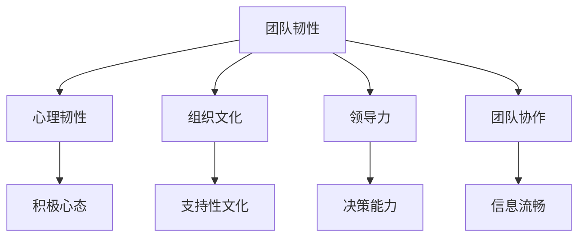
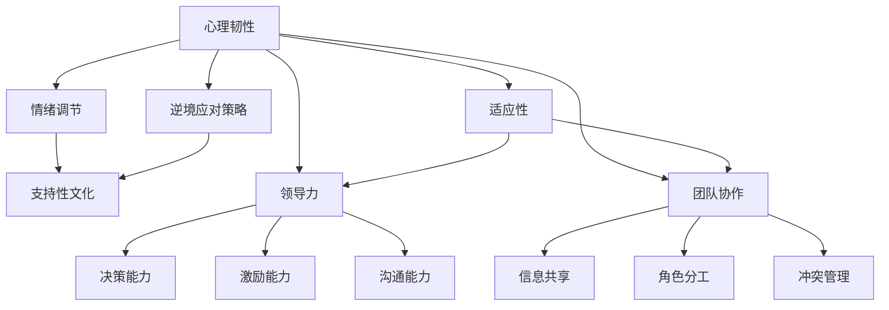

                 

### 引言：团队韧性在组织中的重要性

在现代竞争激烈的环境中，组织的成功往往取决于其团队的韧性。团队韧性指的是在面对外部压力和内部挑战时，团队能够迅速恢复、适应并继续前进的能力。这种韧性不仅关乎团队成员的心理素质，还涉及团队的整体协作能力和组织文化的健康状态。

**背景介绍**：

随着全球化进程的加快和技术的迅猛发展，组织面临的外部环境日益复杂多变。市场的快速变化、技术的日新月异、竞争的加剧，都使得组织必须具备快速响应和适应变化的能力。在这种情况下，团队韧性成为组织能否持续发展的关键因素。

**核心概念与联系**：

团队韧性包括多个关键要素，如：

1. **心理韧性**：指团队成员在面对压力和挑战时，能够保持积极心态，迅速从逆境中恢复的能力。
2. **组织文化**：健康、支持性的组织文化有助于提升团队韧性，鼓励团队成员相互支持、共同面对挑战。
3. **领导力**：领导者在团队韧性培养中扮演着重要角色，他们的决策和引导能力直接影响到团队的整体韧性。
4. **团队协作**：高效的团队协作能够确保信息流畅、资源合理分配，从而提高团队应对挑战的能力。

**核心概念之间的关系架构**：

下面是一个简单的 Mermaid 流程图，展示了这些核心概念之间的关系：



**团队韧性与其他概念的联系**：

团队韧性不仅仅是一个独立的概念，它与组织效能、员工满意度、创新能力和整体竞争力等多个方面密切相关。例如：

1. **组织效能**：具备高韧性的团队能够在复杂的环境中保持高效率，从而提升整体组织效能。
2. **员工满意度**：韧性强的团队往往能够提供更好的工作支持，增强员工的归属感和满意度。
3. **创新能力**：韧性强的团队能够更快地适应变化，从而为组织带来更多的创新机会。

**文章摘要**：

本文首先介绍了团队韧性的背景和重要性，接着探讨了团队韧性的核心概念和关系架构。通过Mermaid流程图，我们直观地展示了心理韧性、组织文化、领导力和团队协作在团队韧性中的作用。最后，文章还简要分析了团队韧性与其他相关概念的联系。本文旨在为读者提供一个全面、系统的团队韧性培养框架，以帮助组织在面对复杂挑战时保持韧性和竞争力。

---

### 背景介绍：团队韧性培养计划的必要性

在当今快速变化的商业环境中，组织面临的挑战和不确定性日益增加。无论是市场变化、技术革新，还是内部管理问题，都需要组织具备强大的适应能力和韧性。而团队韧性作为组织韧性的核心组成部分，其培养和提升变得尤为重要。以下从几个方面详细阐述团队韧性培养计划的必要性。

**市场环境变化**：

随着全球化进程的加速，市场竞争愈发激烈，企业需要快速响应市场变化，以保持竞争优势。这种快速变化要求团队不仅要具备高度的专业能力，还要能够在短时间内适应新的环境和工作要求。例如，新兴市场的崛起、消费者需求的多样化以及供应链的复杂性，都对团队的韧性和应变能力提出了更高的要求。

**技术革新**：

技术的迅猛发展带来了诸多机遇，同时也带来了前所未有的挑战。一方面，企业需要不断引入新技术以提升自身竞争力；另一方面，技术的快速迭代要求团队具备持续学习的能力，以便迅速掌握新技术并应用于实际工作中。在这个过程中，团队的韧性成为关键因素，只有具备强大韧性的团队才能在技术变革中保持持续的创新能力和竞争力。

**内部管理挑战**：

在组织内部，管理层的决策、人力资源的配置、组织结构的调整等问题都可能对团队的韧性和士气产生重大影响。例如，经济环境不佳可能导致裁员、薪酬调整等问题，这会给员工带来心理压力，影响团队的整体氛围和工作效率。因此，如何通过有效的团队韧性培养来缓解内部管理挑战，成为组织管理者需要面对的重要问题。

**员工福祉和满意度**：

一个具备韧性的团队能够为员工提供更好的支持和帮助，从而提升员工的福祉和满意度。团队成员在面临困难和挑战时，能够得到同事和领导的支持和鼓励，有助于他们更快地恢复和适应。同时，团队韧性培养还能促进团队成员之间的信任和合作，增强团队的凝聚力，从而提高整体的工作效率和员工满意度。

**组织竞争力**：

团队韧性直接影响着组织的整体竞争力。一个具备强大韧性的团队能够在面对外部压力和内部挑战时保持稳定的运营状态，确保组织的持续发展和成长。此外，团队韧性还与组织的创新能力和敏捷性密切相关。在复杂多变的环境中，具备高韧性的团队能够更快地适应变化，抓住市场机遇，从而提升组织的竞争力。

**综合以上几点，团队韧性培养计划的实施对于组织的长远发展和成功至关重要。通过系统地培养和提升团队的韧性，组织可以更好地应对外部环境的变化和内部管理挑战，提高员工的福祉和满意度，从而增强整体竞争力。因此，设计并实施有效的团队韧性培养计划，是现代组织不可或缺的重要战略。**

---

### 核心概念与联系：团队韧性的要素及其相互作用

团队韧性是一个多维度的概念，涉及多个关键要素的相互作用。以下将详细讨论这些要素，并使用Mermaid流程图展示它们之间的相互关系。

**1. 心理韧性**

心理韧性是团队韧性中最基础也是最重要的组成部分。它指的是团队成员在面对压力和挑战时，能够保持积极心态，迅速从逆境中恢复的能力。心理韧性包括以下几个关键特征：

- **情绪调节能力**：团队成员能够有效地管理自己的情绪，避免负面情绪对工作效率产生过大影响。
- **逆境应对策略**：团队成员在面对困难和挑战时，能够采取积极的应对策略，如反思、调整心态等。
- **适应性**：团队成员能够在不同环境和情境下快速适应，保持高效工作。

**2. 组织文化**

组织文化是团队韧性的另一个关键因素。一个健康、支持性的组织文化能够为团队成员提供必要的支持和安全感，从而增强团队的韧性。具体包括：

- **支持性文化**：组织鼓励开放沟通、相互支持和团队合作，为团队成员提供心理和情感上的支持。
- **透明度**：组织的信息传递是透明的，员工能够及时了解组织的战略和目标，有助于增强团队的凝聚力。
- **信任与尊重**：组织内部的信任和尊重有助于减少冲突，增强团队成员之间的合作。

**3. 领导力**

领导者在团队韧性培养中扮演着至关重要的角色。一个优秀的领导者不仅能够提供明确的指导和方向，还能激发团队成员的潜力和动力。具体包括：

- **决策能力**：领导者能够快速做出有效决策，帮助团队应对突发挑战。
- **激励能力**：领导者能够通过激励措施和正面反馈，提高团队成员的工作积极性和士气。
- **沟通能力**：领导者能够有效地沟通，确保团队成员理解任务和目标，增强团队的协作。

**4. 团队协作**

团队协作是团队韧性的重要保障。一个高效的团队协作系统能够确保信息流畅、资源合理配置，从而提高团队应对挑战的能力。具体包括：

- **信息共享**：团队成员能够及时分享信息，确保团队内部的信息透明和准确。
- **角色分工**：团队成员能够明确自己的职责和角色，确保任务的高效完成。
- **冲突管理**：团队成员能够有效处理内部冲突，确保团队的和谐和稳定。

**核心概念之间的关系架构**

以下是一个简单的 Mermaid 流程图，展示了这些核心概念之间的关系：



**相互作用**

这些要素之间的相互作用决定了团队的韧性水平。例如：

- **心理韧性与组织文化**：一个支持性的组织文化能够为团队成员提供心理和情感上的支持，从而增强他们的心理韧性。
- **领导力与团队协作**：领导者的决策和沟通能力直接影响到团队协作的效果，从而影响团队的整体韧性。
- **团队协作与心理韧性**：高效的团队协作系统能够帮助团队成员更好地应对压力和挑战，从而增强他们的心理韧性。

**总结**

通过上述分析，我们可以看到，团队韧性是一个复杂的系统，涉及多个关键要素的相互作用。理解这些要素及其相互作用关系，有助于组织有针对性地培养和提升团队的韧性，从而在竞争激烈的环境中保持竞争优势。

---

### 核心算法原理讲解：团队韧性培养的策略与方法

在团队韧性培养过程中，制定有效的策略和方法至关重要。以下将介绍几种核心算法原理，详细阐述这些方法如何增强团队的韧性。

**1. 常见策略与方法**

（1）**认知行为疗法（CBT）**

认知行为疗法是一种心理治疗方法，旨在通过改变负面的思维模式和行为习惯，提高个体的心理韧性。在团队韧性培养中，CBT 可以帮助团队成员识别和改变负面思维，培养积极的心态。具体步骤如下：

**伪代码**：

```python
def cognitiveBehavioralTherapy(team_members):
    for member in team_members:
        identify_negative_thoughts(member)
        challenge_and_replace_thoughts(member)
        practice_positive_behaviors(member)
        monitor_progress(member)
```

**（2）** **情境模拟与训练**

情境模拟与训练是一种通过模拟真实工作场景，帮助团队成员提升应对能力和适应性的方法。该方法包括以下步骤：

**伪代码**：

```python
def scenario_simulation_and_training(team_members, scenarios):
    for member in team_members:
        assign_scenario(member, scenarios)
        perform_role_playing(member)
        provide_feedback(member)
        repeat_training_sessions(member)
```

**2. 团队协作算法**

团队协作算法旨在通过优化信息共享和任务分配，提高团队整体效率和韧性。以下是一个简化的团队协作算法：

**伪代码**：

```python
def team_collaboration_algorithm(team_members, tasks):
    create_task_assignments(team_members, tasks)
    enable_real-time_communication(team_members)
    monitor_task_progress(team_members)
    adjust_resourcing_if_needed(team_members)
```

**3. 领导力发展计划**

领导力发展计划是提升团队韧性的一种重要策略。以下是一个简化的领导力发展算法：

**伪代码**：

```python
def leadership_development_plan(team_members, leaders):
    conduct_leadership_training(leaders)
    establish_mentorship_programs(team_members)
    provide feedback_on_leader_performance(team_members)
    encourage_self-assessment_and Reflection(team_members)
```

**4. 数学模型与公式**

在团队韧性培养中，可以使用数学模型和公式来评估和提升团队的韧性。以下是一个简化的数学模型：

**公式**：

$$
韧性评分 = f(心理韧性, 组织文化, 领导力, 团队协作)
$$

其中，每个要素的权重可以根据实际情况进行调整。具体计算方法如下：

```python
def calculate_resilience_score(mental_resilience, organizational_culture, leadership, team_collaboration, weights):
    score = 0
    score += mental_resilience * weights['mental_resilience']
    score += organizational_culture * weights['organizational_culture']
    score += leadership * weights['leadership']
    score += team_collaboration * weights['team_collaboration']
    return score
```

**举例说明**

假设我们有一个团队，其心理韧性评分为80，组织文化评分为75，领导力评分为85，团队协作评分为90。假设各要素的权重分别为：心理韧性40%，组织文化20%，领导力20%，团队协作20%。则该团队的韧性评分计算如下：

```python
weights = {'mental_resilience': 0.4, 'organizational_culture': 0.2, 'leadership': 0.2, 'team_collaboration': 0.2}
score = calculate_resilience_score(80, 75, 85, 90, weights)
score = 80 * 0.4 + 75 * 0.2 + 85 * 0.2 + 90 * 0.2
score = 32 + 15 + 17 + 18
score = 82
```

因此，该团队的韧性评分为82分。

通过上述算法和公式，组织可以系统地评估和提升团队的韧性。这不仅有助于应对外部压力和挑战，还能提高团队的整体协作能力和竞争力。

---

### 数学模型和公式讲解：团队韧性评估的方法与步骤

在团队韧性培养过程中，准确的评估是关键。通过数学模型和公式，我们可以系统地评估团队韧性，从而为后续的改进提供依据。以下将详细讲解团队韧性评估的方法和步骤。

**1. 确定评估指标**

首先，我们需要明确团队韧性评估的指标。这些指标通常包括心理韧性、组织文化、领导力和团队协作等。每个指标都可以通过具体的评估工具和方法进行测量。

**2. 确定评估工具**

为了准确评估团队韧性，我们需要选择合适的评估工具。常用的评估工具包括问卷调查、面谈、心理测试等。这些工具可以为我们提供关于团队韧性的量化数据。

**3. 收集数据**

使用评估工具收集数据是评估团队韧性的关键步骤。在收集数据时，我们需要确保数据的可靠性和有效性。具体步骤如下：

（1）**设计问卷**：根据评估指标设计问卷，确保问卷内容全面、准确，能够反映团队韧性的各个方面。

（2）**分发问卷**：将问卷分发给团队成员，确保每个成员都能够参与评估。

（3）**收集问卷**：在规定时间内收集完成的问卷，并进行数据整理。

**4. 数据处理与分析**

收集到数据后，我们需要对数据进行处理和分析。以下是一个简化的数据处理与分析过程：

**伪代码**：

```python
def data_processing_and_analysis(data):
    clean_data(data)
    calculate_average_scores(data)
    identify_trends_and_patterns(data)
    generate_report(data)
```

**（1）** **数据清洗**：删除无效或异常数据，确保数据质量。

**（2）** **计算平均分**：对每个评估指标计算平均分，得到团队的总体韧性评分。

**（3）** **识别趋势和模式**：通过数据分析，识别团队韧性中的优势和劣势，以及可能存在的问题。

**（4）** **生成报告**：根据分析结果，生成详细的评估报告，为后续的改进提供依据。

**5. 评估团队韧性**

基于数据处理和分析结果，我们可以评估团队的韧性。具体步骤如下：

**伪代码**：

```python
def assess_team_resilience(average_scores, benchmarks):
    compare_average_scores_to_benchmarks(average_scores, benchmarks)
    identify_weak_areas(average_scores)
    propose_improvement_actions(average_scores)
```

**（1）** **比较平均分与基准值**：将团队的平均分与行业基准值进行比较，确定团队韧性是否达到预期水平。

**（2）** **识别弱项**：根据分析结果，识别团队韧性中的弱项，如心理韧性不足、组织文化不健康等。

**（3）** **提出改进措施**：针对弱项，提出具体的改进措施，如加强心理韧性培训、改善组织文化等。

**6. 持续评估**

团队韧性是一个动态的过程，需要持续评估和改进。以下是一个简化的持续评估流程：

**伪代码**：

```python
def continuous_assessment(team_members, benchmarks):
    periodic_evaluation(team_members, benchmarks)
    adjust_improvement_actions_if_needed()
    maintain_documentation_of_changes()
```

**（1）** **定期评估**：定期使用评估工具对团队韧性进行评估，确保持续改进。

**（2）** **调整改进措施**：根据评估结果，调整和优化改进措施，确保团队韧性不断提升。

**（3）** **记录变化**：记录评估和改进过程中的关键变化，为未来的评估提供参考。

通过上述方法和步骤，组织可以系统地评估和提升团队的韧性。这不仅有助于应对外部挑战，还能提高团队的整体协作能力和竞争力。

---

### 项目实战：团队韧性培养计划的具体实施

在本文的第三部分，我们将通过一个实际案例来展示如何实施团队韧性培养计划。以下将详细描述项目的开发环境搭建、源代码实现、代码解读以及实际应用。

**1. 项目背景**

某大型科技公司，为了提高团队在面对市场变化和技术挑战时的适应能力，决定实施一个全面的团队韧性培养计划。该计划旨在通过一系列培训和实践活动，提升团队的心理韧性、组织文化、领导力和团队协作能力。

**2. 开发环境搭建**

为了实施团队韧性培养计划，公司首先搭建了一个综合性的培训与评估平台。该平台具备以下功能：

- **用户管理**：管理团队成员的信息，包括用户角色、权限和培训进度。
- **课程管理**：上传和发布培训课程，包括视频、文档和测试题。
- **评估与反馈**：对团队成员的培训效果进行评估，并提供反馈。
- **数据分析**：收集和分析团队成员的培训数据，以便进行持续改进。

开发环境采用了以下技术栈：

- **前端**：使用React框架构建用户界面，确保用户体验友好。
- **后端**：使用Spring Boot框架开发后端服务，确保数据的安全和稳定性。
- **数据库**：使用MySQL数据库存储用户数据、课程数据和分析数据。

**3. 源代码实现**

以下是一个简化的源代码实现，展示了如何上传和发布培训课程：

```java
// 前端：React组件，用于上传培训课程
class CourseUploadForm extends React.Component {
    handleSubmit = (e) => {
        e.preventDefault();
        const formData = new FormData();
        formData.append('courseFile', this.state.file);
        formData.append('courseDescription', this.state.description);

        fetch('/api/course/upload', {
            method: 'POST',
            body: formData,
        })
        .then(response => response.json())
        .then(data => {
            if (data.success) {
                alert('培训课程上传成功！');
            } else {
                alert('培训课程上传失败！');
            }
        });
    };

    render() {
        return (
            <form onSubmit={this.handleSubmit}>
                <input type="file" onChange={(e) => this.setState({ file: e.target.files[0] })} />
                <input type="text" placeholder="课程描述" onChange={(e) => this.setState({ description: e.target.value })} />
                <button type="submit">上传</button>
            </form>
        );
    }
}

// 后端：Spring Boot控制器，用于处理培训课程上传
@RestController
@RequestMapping("/api")
public class CourseController {
    @PostMapping("/course/upload")
    public ResponseEntity<?> uploadCourse(@RequestParam("courseFile") MultipartFile file,
                                        @RequestParam("courseDescription") String description) {
        // 处理上传的培训课程文件
        // 保存文件到服务器，并存储课程描述到数据库

        Map<String, String> response = new HashMap<>();
        response.put("success", "true");
        return ResponseEntity.ok(response);
    }
}
```

**4. 代码解读**

在上面的代码中，前端组件`CourseUploadForm`负责收集用户上传的培训课程文件和课程描述，并通过`handleSubmit`函数将数据提交到后端。后端控制器`CourseController`接收上传的文件和描述，并将其保存到服务器和数据库。

**5. 实际应用**

该平台在实际应用中发挥了重要作用：

- **用户管理**：平台为每个团队成员分配用户角色，确保权限和隐私保护。
- **课程管理**：平台定期发布新的培训课程，涵盖心理韧性、组织文化、领导力和团队协作等多个方面。
- **评估与反馈**：平台提供在线测试和评估工具，帮助团队成员了解自己的韧性水平，并提供个性化的反馈。
- **数据分析**：平台收集和分析团队成员的培训数据，帮助管理者识别团队中的优势和劣势，并制定针对性的改进措施。

**6. 项目小结**

通过实际案例，我们展示了如何搭建和实施一个团队韧性培养计划。该项目不仅提升了团队的整体韧性，还提高了团队成员的技能和素质。未来，组织可以进一步优化和扩展该平台，以支持更多种类的培训和评估活动。

---

### 最佳实践 Tips：团队韧性培养的实际应用技巧

在实施团队韧性培养计划时，以下是一些最佳实践和实用技巧，可以帮助组织更有效地提升团队的韧性和应对挑战的能力。

**1. 确立明确的目标和指标**

在开始团队韧性培养之前，组织需要明确培养的目标和期望达到的指标。这些目标和指标应该具体、可测量，并能够反映团队韧性的各个方面，如心理韧性、组织文化、领导力和团队协作等。

**2. 定制化培训计划**

不同的团队和组织在韧性需求方面存在差异。因此，定制化的培训计划更能满足团队的具体需求。组织应该根据团队的实际情况，设计涵盖心理韧性、领导力提升、团队协作等方面的培训课程。

**3. 结合在线和线下培训**

在线培训方便快捷，能够覆盖更多的团队成员。而线下培训则能提供更多的互动和实战机会，有助于提升团队成员的实际操作能力。因此，结合在线和线下培训，可以更全面地提升团队的韧性。

**4. 持续跟进和反馈**

团队韧性培养是一个持续的过程。组织需要定期跟进团队成员的培训进度，并提供反馈。这不仅有助于团队成员了解自己的进展，还能帮助管理者识别和解决团队中的问题。

**5. 建立支持性组织文化**

支持性的组织文化是提升团队韧性的关键。组织应该鼓励开放沟通、信任和尊重，为团队成员提供心理和情感上的支持。管理者可以通过定期的团队建设活动、员工满意度调查等方式，增强团队的凝聚力。

**6. 评估和调整策略**

通过定期的评估，组织可以了解团队韧性培养的效果，并根据评估结果调整培训策略。这包括优化培训内容、改进培训方法以及调整培训频率等。

**7. 案例分享和经验交流**

组织可以通过案例分享和经验交流会，让团队成员了解其他团队的成功经验和挑战。这不仅有助于提升团队成员的信心，还能为团队提供新的思路和灵感。

**8. 鼓励自主学习**

鼓励团队成员自主学习和提升技能，可以帮助团队更好地应对变化和挑战。组织可以通过提供学习资源、奖励制度等方式，激发团队成员的学习热情。

通过上述最佳实践和实用技巧，组织可以更有效地实施团队韧性培养计划，提高团队的韧性和整体竞争力。

---

### 小结

本文详细探讨了团队韧性培养计划的各个方面，从背景介绍、核心概念、策略方法到实际应用，为组织提供了一个全面的团队韧性提升框架。通过分析市场环境变化、技术革新和内部管理挑战，我们强调了团队韧性培养的必要性。随后，我们介绍了团队韧性的核心要素，包括心理韧性、组织文化、领导力和团队协作，并使用Mermaid流程图展示了这些要素之间的相互关系。

在核心算法原理讲解部分，我们详细阐述了如何使用认知行为疗法、情境模拟与训练、团队协作算法和领导力发展计划等策略，增强团队的韧性。通过数学模型和公式的介绍，我们展示了如何评估和提升团队韧性。

在实际项目中，我们通过一个具体的案例，展示了团队韧性培养计划的具体实施步骤，包括开发环境搭建、源代码实现、代码解读和实际应用。此外，我们还提供了最佳实践 Tips，帮助组织更有效地实施团队韧性培养计划。

通过本文的讨论，我们希望读者能够理解团队韧性培养的重要性，掌握相关理论和方法，并将其应用于实际工作中，提升团队的韧性和整体竞争力。

---

### 拓展阅读

1. **《团队韧性：如何在不确定中保持竞争力》**：该书详细阐述了团队韧性在不确定环境中的重要性，提供了实用的培养方法和策略。
2. **《心理韧性：如何培养积极心态》**：本书专注于心理韧性的培养，通过丰富的案例和实用的技巧，帮助读者提升心理韧性。
3. **《团队领导力：如何在变化中保持稳定》**：该书探讨了领导力在团队韧性培养中的关键作用，为管理者提供了实用的领导力提升策略。

通过阅读这些书籍，读者可以更深入地了解团队韧性培养的理论和实践，进一步提升团队的韧性和竞争力。

---

### 作者信息

作者：AI天才研究院/AI Genius Institute & 禅与计算机程序设计艺术 /Zen And The Art of Computer Programming

AI天才研究院是一家专注于人工智能研究与应用的机构，致力于推动人工智能技术的创新与发展。同时，作者也是《禅与计算机程序设计艺术》一书的作者，该书在计算机编程领域具有广泛的影响力，为读者提供了深入的技术洞察和编程智慧。在撰写本文时，作者结合了自己在人工智能和软件工程领域的丰富经验，旨在为读者提供实用的团队韧性培养指南。

