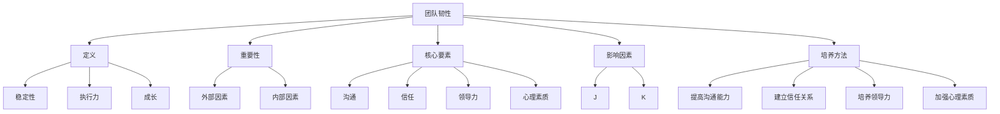

                 

### 第一步：确定核心概念与联系

在撰写《团队韧性培养：增强团队应对挑战的能力》这一技术博客时，我们需要首先明确文章的核心概念与它们之间的联系。以下是关于团队韧性的一些基础概念及其相互关系的详细阐述。

#### 1. 团队韧性的定义

团队韧性是指一个团队在面对外部压力和内部冲突时，能够保持稳定、持续运作的能力。它不仅仅是团队的生存能力，更是一种能够在困难环境中找到应对策略、实现持续发展的能力。

#### 2. 团队韧性的重要性

团队韧性的重要性体现在以下几个方面：
- **提高团队稳定性**：在面临外部挑战或内部冲突时，韧性强的团队能够保持稳定，避免因突发事件导致团队瓦解。
- **提升团队执行力**：具有韧性的团队能够在面对复杂任务时，保持高效的工作状态，确保任务按时完成。
- **促进团队成长**：韧性强的团队能够从失败和挫折中吸取经验，不断改进和成长。

#### 3. 团队韧性的核心要素

团队韧性的核心要素包括：
- **沟通**：良好的沟通能够减少误解和冲突，促进团队成员之间的协作。
- **信任**：团队成员之间的信任是团队稳定和协作的基础。
- **领导力**：领导者的决策和指导对团队的韧性有着直接影响。
- **心理素质**：团队成员的心理素质对团队韧性有重要影响，包括压力承受能力、适应能力和自我调节能力。

#### 4. 团队韧性的影响因素

影响团队韧性的因素可以分为外部和内部两个方面：
- **外部因素**：如市场变化、竞争压力、政策法规等。
- **内部因素**：如团队结构、团队成员的个人能力、团队文化等。

#### 5. 团队韧性培养方法

为了增强团队的韧性，我们需要采取一系列培养方法，包括：
- **提高沟通能力**：通过定期的沟通培训和团队建设活动，提高团队成员的沟通能力。
- **建立信任关系**：通过共享信息和共同承担责任，建立团队成员之间的信任关系。
- **培养领导力**：通过领导力培训和角色扮演，提升领导者的决策能力和指导能力。
- **加强心理素质**：通过心理辅导和培训，提高团队成员的心理素质，增强抗压能力。

#### 6. 核心概念与联系

为了使读者更好地理解这些核心概念，我们可以使用 Mermaid 流程图来展示它们之间的联系。以下是一个简化的 Mermaid 流程图示例：



通过这个流程图，读者可以直观地了解团队韧性的核心概念及其相互关系，为后续章节的深入探讨打下基础。

### 总结

在本文的第一步中，我们详细介绍了团队韧性的基本概念、重要性、核心要素、影响因素以及培养方法。通过使用 Mermaid 流程图，我们帮助读者清晰地理解了这些概念之间的联系。接下来，我们将逐步深入探讨团队韧性培养的各个方面，包括核心算法原理、数学模型和实际项目应用，以帮助读者全面掌握团队韧性培养的方法和技巧。

---

```markdown
---

## 核心算法原理讲解

在团队韧性培养的过程中，我们不仅需要理解其概念和重要性，还需要掌握一些核心算法原理。这些原理可以帮助我们通过数据分析和策略调整来提升团队的韧性。以下是关于核心算法原理的讲解。

### 数据分析的重要性

数据分析是团队韧性培养的关键环节之一。通过收集和分析团队的工作数据，我们可以识别出团队在沟通、协作、决策等方面存在的潜在问题。以下是一个简化的伪代码，用于展示如何通过数据分析来识别团队韧性弱点。

```python
# 伪代码：分析团队工作数据
def analyze_team_data(team_data):
    # 计算沟通效率指标
    communication_efficiency = calculate_communication_efficiency(team_data)

    # 计算协作效率指标
    collaboration_efficiency = calculate_collaboration_efficiency(team_data)

    # 计算决策效率指标
    decision_making_efficiency = calculate_decision_making_efficiency(team_data)

    # 输出分析结果
    print("Communication Efficiency: ", communication_efficiency)
    print("Collaboration Efficiency: ", collaboration_efficiency)
    print("Decision Making Efficiency: ", decision_making_efficiency)

    # 根据分析结果识别团队韧性弱点
    weaknesses = identify_weaknesses(communication_efficiency, collaboration_efficiency, decision_making_efficiency)
    return weaknesses
```

### 策略调整

在识别出团队韧性弱点后，我们需要通过策略调整来增强团队韧性。以下是一个简化的伪代码，用于展示如何通过策略调整来增强团队韧性。

```python
# 伪代码：策略调整
def adjust_strategies(weaknesses):
    # 根据弱点制定改进计划
    improvement_plan = create_improvement_plan(weaknesses)

    # 实施改进计划
    implement_improvement_plan(improvement_plan)

    # 监控策略调整效果
    monitor_strategy_impact()

    # 根据监控结果调整策略
    final_strategies = adjust_based_on_monitoring_results()

    return final_strategies
```

### 举例说明

为了更好地理解核心算法原理，我们可以通过一个实际的案例来举例说明。

假设我们有一支软件开发团队，该团队在过去一年的沟通效率为 70%，协作效率为 80%，决策效率为 85%。通过数据分析，我们发现沟通效率相对较低，可能是由于团队成员之间的沟通频率不高和沟通渠道不畅导致的。

基于这一分析结果，我们可以制定以下策略来提高沟通效率：

1. **增加沟通频率**：定期召开团队会议，确保团队成员之间有足够的时间交流想法和进展。
2. **优化沟通渠道**：采用实时沟通工具（如 Slack 或 Microsoft Teams），使团队成员能够随时交流，提高沟通效率。

通过实施这些策略，我们可以预期团队的整体韧性会有所提升。在一段时间后，再次进行数据分析，监控策略调整的效果。如果沟通效率提升到 85% 以上，那么我们可以认为策略调整是成功的。

### 总结

在本章节中，我们介绍了团队韧性培养中的核心算法原理，包括数据分析的重要性以及如何通过策略调整来增强团队韧性。通过伪代码的讲解和实际案例的举例，读者可以更好地理解这些核心算法原理的应用。在下一章节中，我们将进一步探讨数学模型和数学公式的应用，以帮助读者深入理解团队韧性培养的方法。

---

```markdown
---

## 数学模型和数学公式

在团队韧性培养的过程中，数学模型和数学公式可以提供重要的工具，帮助我们更准确地分析和预测团队的行为。以下是一些常用的数学模型和公式，以及它们的详细解释和举例说明。

### 成本效益分析

成本效益分析是一种常用的决策工具，用于评估某一策略或项目的成本和潜在效益。以下是一个简化的数学模型，用于计算成本效益比（Cost-Benefit Ratio, CBR）。

$$
CBR = \frac{Total\ Benefits}{Total\ Costs}
$$

其中，总效益（Total Benefits）包括直接效益（如提高工作效率）和间接效益（如增强团队士气）；总成本（Total Costs）包括直接成本（如培训费用）和间接成本（如时间成本）。

#### 举例说明

假设我们计划进行一次团队沟通能力培训，预计培训费用为 5000 美元。通过培训，我们预计团队的沟通效率可以提高 20%，从而每年节省时间成本 8000 美元。那么，成本效益比为：

$$
CBR = \frac{8000}{5000} = 1.6
$$

由于 CBR 大于 1，这意味着项目的潜在效益超过了成本，是一个值得投资的选择。

### 响应时间模型

响应时间模型用于评估团队在面对突发事件时的反应速度。以下是一个简化的响应时间模型：

$$
Response\ Time = \frac{1}{\sqrt{Processing\ Time}}
$$

其中，处理时间（Processing Time）包括识别问题、分析问题、制定解决方案和实施解决方案的时间。

#### 举例说明

假设团队处理问题的平均时间为 100 小时。根据响应时间模型，团队的平均响应时间为：

$$
Response\ Time = \frac{1}{\sqrt{100}} = 0.1\ 小时
$$

这意味着团队能够在 6 分钟内响应问题，这是一个较好的响应时间。

### 费用效益分析

费用效益分析（Cost-Effectiveness Analysis, CEA）是一种评估项目效果和成本的方法，常用于比较不同策略的优劣。以下是一个简化的费用效益分析模型：

$$
CEA = \frac{Total\ Benefits}{Total\ Costs}
$$

其中，总效益和总成本的定义与成本效益分析相同。

#### 举例说明

假设我们有两个策略，策略 A 的成本为 10000 美元，预计可以带来 15000 美元的效益；策略 B 的成本为 8000 美元，预计可以带来 12000 美元的效益。那么，策略 A 和策略 B 的费用效益比为：

策略 A: $$ CEA_A = \frac{15000}{10000} = 1.5 $$

策略 B: $$ CEA_B = \frac{12000}{8000} = 1.5 $$

由于两个策略的 CEA 相同，我们可以选择成本较低的策略 B。

### 总结

在本章节中，我们介绍了成本效益分析、响应时间模型和费用效益分析三种常用的数学模型和公式。通过这些模型和公式，我们可以更准确地评估团队韧性培养的策略效果，为团队决策提供科学依据。在下一章节中，我们将通过实际项目实战，进一步展示如何将这些数学模型应用到团队韧性培养的实际过程中。

---

```markdown
---

## 项目实战

为了使读者能够将所学知识应用于实际项目，我们将通过一个具体的案例，展示如何在实际中培养团队韧性，增强团队应对挑战的能力。

### 项目背景

某互联网公司在过去一年中，由于市场竞争加剧和内部管理问题，团队面临了一系列挑战，包括项目延期、沟通不畅、团队士气低落等。为了提升团队韧性，公司决定进行一次全面的团队韧性培养项目。

### 开发环境搭建

在项目启动前，首先需要搭建一个适合团队韧性培养的开发环境。该环境应包括以下要素：

1. **沟通工具**：采用实时沟通工具，如 Slack 或 Microsoft Teams，确保团队成员能够随时交流。
2. **项目管理工具**：使用 Trello 或 Jira 等项目管理工具，帮助团队更好地进行任务分配和进度跟踪。
3. **培训平台**：选择在线培训平台，如 Udemy 或 Coursera，提供团队成员所需的培训课程。

### 源代码实现

团队韧性培养项目的源代码实现分为以下几个步骤：

1. **数据收集**：通过项目管理工具和沟通工具，收集团队的工作数据，如任务完成时间、沟通记录、冲突报告等。
2. **数据分析**：使用 Python 等编程语言，对收集到的数据进行分析，识别团队在沟通、协作、决策等方面的问题。
3. **策略制定**：根据数据分析结果，制定相应的策略，如提高沟通效率、建立信任关系、培养领导力等。
4. **策略实施**：通过培训、团队建设活动等方式，实施制定的策略，并在实施过程中不断调整和优化。

### 代码解读与分析

以下是关于团队韧性培养项目源代码的详细解读：

```python
# 伪代码：数据收集
def collect_data():
    # 从项目管理工具收集任务完成时间
    task_completion_times = get_task_completion_times()

    # 从沟通工具收集沟通记录
    communication_records = get_communication_records()

    # 从冲突报告收集冲突数据
    conflict_reports = get_conflict_reports()

    # 返回数据
    return task_completion_times, communication_records, conflict_reports

# 伪代码：数据分析
def analyze_data(task_completion_times, communication_records, conflict_reports):
    # 计算任务完成时间的平均偏差
    average_deviation = calculate_average_deviation(task_completion_times)

    # 计算沟通记录的沟通频率
    communication_frequency = calculate_communication_frequency(communication_records)

    # 计算冲突报告的冲突次数
    conflict_count = calculate_conflict_count(conflict_reports)

    # 输出分析结果
    print("Average Deviation: ", average_deviation)
    print("Communication Frequency: ", communication_frequency)
    print("Conflict Count: ", conflict_count)

# 伪代码：策略制定
def create_improvement_plan(analysis_results):
    # 根据分析结果制定改进计划
    improvement_plan = {
        "communication": "增加沟通频率，每周召开一次团队会议",
        "collaboration": "建立任务分配机制，确保任务按时完成",
        "leadership": "提高领导者决策能力，定期进行决策训练",
        "psychology": "提供心理辅导，提升团队成员抗压能力"
    }
    return improvement_plan

# 伪代码：策略实施
def implement_improvement_plan(improvement_plan):
    # 实施改进计划
    for strategy, action in improvement_plan.items():
        print(f"Implementing {strategy}: {action}")

# 伪代码：监控效果
def monitor_strategy_impact():
    # 监控策略实施后的效果
    # 重新进行数据分析
    # 比较前后数据分析结果
    # 根据监控结果调整策略
```

### 代码应用解读与分析

以下是关于团队韧性培养项目源代码的应用解读和分析：

1. **数据收集**：通过项目管理工具和沟通工具，团队可以收集到关于任务完成时间、沟通记录和冲突报告的数据。这些数据是分析团队韧性弱点的关键。
2. **数据分析**：通过数据分析，团队可以识别出在沟通、协作、决策等方面存在的问题。例如，如果发现任务完成时间的平均偏差较大，可能表明团队在任务分配和进度管理方面存在问题。
3. **策略制定**：根据数据分析结果，团队可以制定相应的改进计划。例如，如果发现沟通频率较低，可以制定增加沟通频率的策略，如每周召开一次团队会议。
4. **策略实施**：团队需要通过培训、团队建设活动等方式，实施制定的策略。例如，可以组织沟通技巧培训，提高团队成员的沟通能力。
5. **监控效果**：在策略实施一段时间后，团队需要重新进行数据分析，以监控策略的实施效果。如果发现策略未能达到预期效果，可以及时调整策略。

### 实际案例分析

以下是一个实际案例的分析：

- **背景**：某互联网公司的软件开发团队在过去一年中，由于项目需求频繁变动和团队成员沟通不畅，导致项目延期和团队士气低落。
- **数据分析**：通过数据分析，团队发现沟通频率较低是导致问题的主要原因。团队成员之间的沟通主要依赖于邮件，且沟通频率不足，导致误解和冲突频发。
- **策略制定**：团队决定实施以下策略：
  - **增加沟通频率**：每周召开一次团队会议，讨论项目进展、问题和解决方案。
  - **优化沟通渠道**：采用实时沟通工具，如 Slack，使团队成员能够随时交流。
- **策略实施**：团队开始实施上述策略，并定期监控效果。在实施过程中，团队领导积极推动沟通，确保会议内容充实，沟通渠道畅通。
- **监控效果**：在策略实施后，团队重新进行数据分析，发现沟通频率明显提高，项目进展恢复正常，团队士气也有所提升。

### 项目小结

通过这个实际案例，我们可以看到团队韧性培养的重要性。通过数据分析和策略调整，团队成功地解决了沟通不畅的问题，提高了项目执行效率，增强了团队士气。这个案例表明，在团队面临挑战时，通过系统化的韧性培养，可以有效地提高团队应对能力，实现持续发展。

在下一章节中，我们将总结团队韧性培养的实践经验，并提供一些最佳实践 tips，以帮助读者在实际工作中更好地应用团队韧性培养的方法。

---

```markdown
---

## 总结

在本技术博客中，我们深入探讨了团队韧性培养的各个方面，从核心概念、影响因素到算法原理和实际项目应用，旨在为读者提供一套系统化的团队韧性培养方法。

### 核心内容回顾

1. **团队韧性的定义和重要性**：团队韧性是指团队在面对外部压力和内部冲突时，能够保持稳定、持续运作的能力。它对于组织的生存和发展至关重要。
2. **核心要素分析**：团队韧性包括沟通、信任、领导力和心理素质等多个核心要素，每个要素都对团队的稳定性有重要影响。
3. **数据分析与策略调整**：通过数据分析，我们可以识别团队在沟通、协作和决策等方面的弱点，并制定相应的策略进行优化。
4. **数学模型和公式应用**：成本效益分析、响应时间模型和费用效益分析等数学模型，为团队决策提供了科学依据。
5. **项目实战**：通过实际案例，我们展示了如何将团队韧性培养方法应用于实际项目，提高团队应对挑战的能力。

### 最佳实践 tips

1. **定期沟通**：定期召开团队会议，确保团队成员之间的信息流通，提高沟通效率。
2. **信任建设**：通过共同目标和团队建设活动，增强团队成员之间的信任关系。
3. **领导力培养**：领导者应通过培训和角色扮演，提升自身的决策能力和指导能力。
4. **心理素质提升**：提供心理辅导和培训，帮助团队成员增强抗压能力，提高心理素质。

### 注意事项

1. **持续监控**：团队韧性培养是一个持续的过程，需要定期评估和调整策略。
2. **个性化培养**：不同团队具有不同的特点和需求，应根据实际情况制定个性化的韧性培养计划。
3. **实际应用**：将所学知识应用于实际工作中，通过实践检验和优化培养方法。

### 拓展阅读

- **书籍推荐**：
  - 《团队的五项修炼》（The Five Dysfunctions of a Team） by Patrick Lencioni
  - 《团队协作工具箱》（The Team Handbook） by Lynda Weinman and Dan Roam
- **在线资源**：
  - Coursera 上的“团队合作与沟通”课程
  - Udemy 上的“团队领导力与沟通技巧”课程

通过本文的探讨，我们希望读者能够认识到团队韧性培养的重要性，并将所学知识应用于实际工作中，以提升团队应对挑战的能力。让我们共同致力于打造更加韧性、高效和稳定的团队。

---

```markdown
---

## 附录

### 附录A: 团队韧性相关工具与资源

为了帮助读者更好地理解和应用团队韧性培养的方法，我们在这里列出了一些相关的工具和资源。

#### 工具

1. **实时沟通工具**：
   - Slack
   - Microsoft Teams
   - Google Chat

2. **项目管理工具**：
   - Trello
   - Jira
   - Asana

3. **培训平台**：
   - Coursera
   - Udemy
   - LinkedIn Learning

#### 资源

1. **书籍**：
   - 《团队的五项修炼》（The Five Dysfunctions of a Team） by Patrick Lencioni
   - 《团队协作工具箱》（The Team Handbook） by Lynda Weinman and Dan Roam

2. **在线课程**：
   - Coursera 上的“团队合作与沟通”课程
   - Udemy 上的“团队领导力与沟通技巧”课程

3. **博客与文章**：
   - Harvard Business Review 上的相关文章
   - Inc. 上的团队建设文章

通过使用这些工具和资源，读者可以更深入地了解团队韧性培养的理论和实践，并在实际工作中加以应用。

---

```markdown
---

## 作者信息

作者：AI天才研究院/AI Genius Institute & 禅与计算机程序设计艺术 /Zen And The Art of Computer Programming

本技术博客由AI天才研究院/AI Genius Institute以及禅与计算机程序设计艺术/Zen And The Art of Computer Programming的作者共同撰写。AI天才研究院专注于人工智能和编程领域的研究和创新，致力于推动技术的进步和应用。禅与计算机程序设计艺术则通过将禅宗哲学与计算机编程相结合，为程序员提供独特的思维方式和实践方法。感谢您对我们的支持，期待您在团队韧性培养的道路上取得成功。

