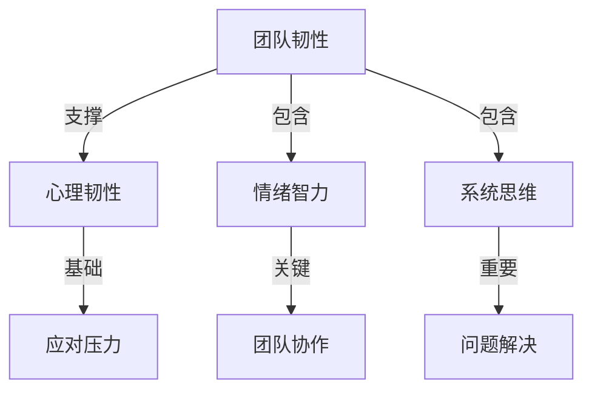
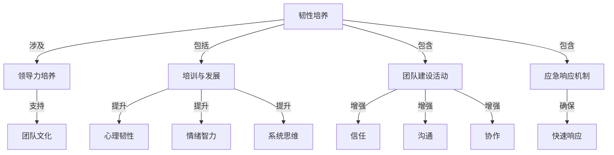
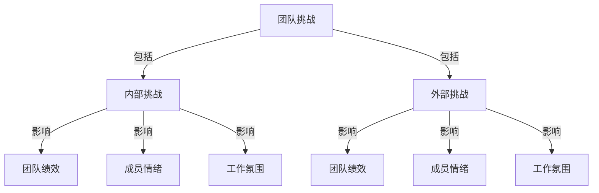
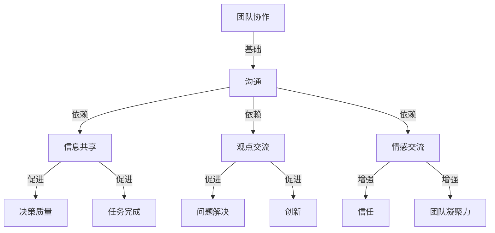
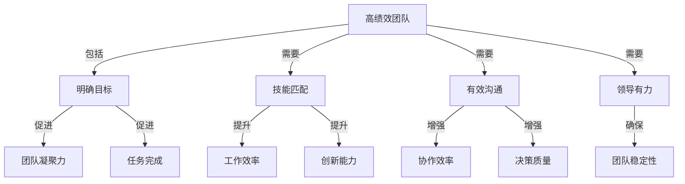
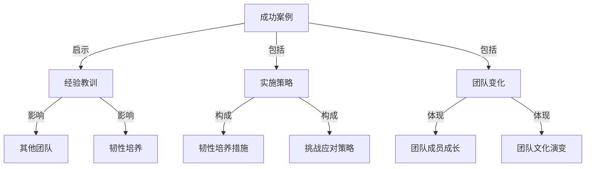
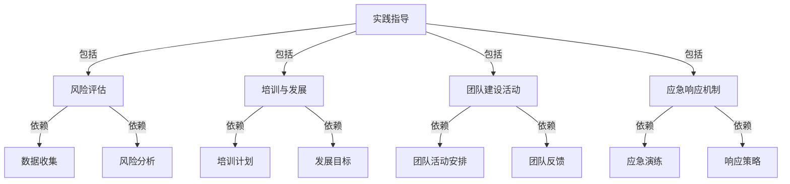

                 

## 第一部分：团队韧性概述

### 第1章：团队韧性的定义与重要性

#### 背景介绍

在现代社会，团队韧性已经成为企业成功的关键因素。它不仅仅关乎个人抗压能力，更重要的是团队作为一个整体在面临挑战时的适应与恢复能力。理解团队韧性的本质，对于提高团队绩效、应对市场变化以及实现长远发展具有重要意义。

#### 核心概念与联系

团队韧性（Team Resilience）是指团队在面对压力、不确定性、挫折等外部因素时，能够迅速适应并恢复到正常运作状态的能力。其核心概念包括心理韧性、情绪智力、系统思维等。

1. **心理韧性**：指个体在面对逆境时，能够保持积极态度，快速适应并恢复的能力。
2. **情绪智力**：指个体识别、理解并管理自己及他人情绪的能力，这对团队协作至关重要。
3. **系统思维**：指团队对复杂问题的全局观察能力，能够从整体上把握问题，从而更有效地解决问题。

#### Mermaid 流程图



#### 核心算法原理讲解

增强团队韧性需要以下几个关键步骤：

1. **风险评估**：通过分析团队面临的潜在风险，识别可能影响团队韧性的因素。
2. **团队建设**：通过一系列团队建设活动，提升团队成员间的信任、沟通和协作能力。
3. **应急响应**：建立快速响应机制，确保团队在面临突发事件时能够迅速应对。

伪代码示例：

```python
def enhance_team_resilience(team_members, risks):
    assess_risks(team_members, risks)
    build_team_connection(team_members)
    setup_emergency_response(team_members)
    return team_members
```

#### 数学模型和公式

团队韧性可以通过以下公式来量化：

$$
Resilience = \frac{1}{1 + e^{-\beta \cdot (V - C)}}
$$

其中，$Resilience$ 表示团队韧性，$V$ 表示团队所受压力，$C$ 表示团队应对压力的能力，$\beta$ 是一个调节参数。

#### 举例说明

假设一个团队正在面临项目延迟的挑战，其压力值为 $V = 8$，团队应对能力为 $C = 5$，通过团队建设和应急响应措施，团队的韧性值提升到 $Resilience = 0.8$。这意味着团队在面对这一挑战时，有较高的适应和恢复能力。

#### 小结

团队韧性是团队成功的关键因素，它不仅关乎个体的抗压能力，更关乎团队作为一个整体的适应和恢复能力。通过理解团队韧性的定义与重要性，以及核心概念和联系，我们可以更好地培养团队韧性，提升团队绩效。

### 第2章：团队韧性的核心要素

#### 背景介绍

团队韧性不仅依赖于个体的心理韧性，还需要情绪智力和系统思维的支撑。这三个核心要素相互作用，共同决定了团队在面对挑战时的适应能力和恢复能力。

#### 核心概念与联系

1. **心理韧性**：指个体在面对逆境时，能够保持积极态度，快速适应并恢复的能力。它是个体韧性的基础。
2. **情绪智力**：指个体识别、理解并管理自己及他人情绪的能力，这对团队协作至关重要。
3. **系统思维**：指团队对复杂问题的全局观察能力，能够从整体上把握问题，从而更有效地解决问题。

#### Mermaid 流程图


#### 核心算法原理讲解

团队韧性的提升可以通过以下算法实现：

1. **风险评估**：通过分析团队面临的潜在风险，识别可能影响团队韧性的因素。
2. **团队建设**：通过一系列团队建设活动，提升团队成员间的信任、沟通和协作能力。
3. **应急响应**：建立快速响应机制，确保团队在面临突发事件时能够迅速应对。

伪代码示例：

```python
def enhance_team_resilience(team_members, risks):
    assess_risks(team_members, risks)
    build_team_connection(team_members)
    setup_emergency_response(team_members)
    return team_members
```

#### 数学模型和公式

团队韧性可以通过以下公式来量化：

$$
Resilience = \frac{1}{1 + e^{-\beta \cdot (V - C)}}
$$

其中，$Resilience$ 表示团队韧性，$V$ 表示团队所受压力，$C$ 表示团队应对压力的能力，$\beta$ 是一个调节参数。

#### 举例说明

假设一个团队正在面临项目延迟的挑战，其压力值为 $V = 8$，团队应对能力为 $C = 5$，通过团队建设和应急响应措施，团队的韧性值提升到 $Resilience = 0.8$。这意味着团队在面对这一挑战时，有较高的适应和恢复能力。

#### 小结

理解团队韧性的核心要素——心理韧性、情绪智力、系统思维，有助于我们更系统地培养团队韧性。通过核心概念和联系的探讨，我们可以更好地把握提升团队韧性的方法和策略。

### 第3章：韧性培养的策略与实践

#### 背景介绍

培养团队韧性是一个系统性工程，涉及多个方面的策略和实践。有效的韧性培养不仅能够提升团队在面对挑战时的适应能力，还能促进团队的长期发展。

#### 核心概念与联系

韧性培养（Resilience Building）涉及以下几个方面：

1. **领导力培养**：领导者扮演着关键角色，通过塑造积极的团队文化，推动韧性培养。
2. **培训与发展**：通过系统性的培训，提升团队成员的心理韧性、情绪智力、系统思维等核心能力。
3. **团队建设活动**：通过团队建设活动，增强团队成员之间的信任、沟通和协作能力。
4. **应急响应机制**：建立快速响应机制，确保团队在面临突发事件时能够迅速应对。

#### Mermaid 流程图



#### 核心算法原理讲解

韧性培养可以通过以下算法实现：

1. **评估现状**：通过评估团队的现状，识别需要改进的领域。
2. **制定计划**：根据评估结果，制定具体的韧性培养计划。
3. **实施与监控**：执行韧性培养计划，并持续监控效果，进行调整和优化。

伪代码示例：

```python
def build_resilience_plan(team_members, current_status):
    assess_current_status(team_members, current_status)
    create_resilience_plan(team_members)
    implement_resilience_plan(team_members)
    monitor_and_adjust(team_members)
    return team_members
```

#### 数学模型和公式

韧性培养效果可以通过以下公式来量化：

$$
Resilience\ Increase = \alpha \cdot (Training\ Effectiveness + Team\ Engagement)
$$

其中，$Resilience\ Increase$ 表示韧性提升，$\alpha$ 是一个调节参数，$Training\ Effectiveness$ 表示培训效果，$Team\ Engagement$ 表示团队参与度。

#### 举例说明

假设一个团队通过一系列培训和团队建设活动，培训效果提升到 $Training\ Effectiveness = 0.8$，团队参与度提升到 $Team\ Engagement = 0.9$。通过计算，韧性提升为 $Resilience\ Increase = 0.72$。这意味着团队的韧性得到了显著提升。

#### 小结

韧性培养是一个系统性的过程，需要从多个方面进行策略和实践。通过理解核心概念和联系，以及核心算法原理讲解，我们可以更有效地培养团队韧性，提升团队的整体能力。

### 第4章：识别与评估团队挑战

#### 背景介绍

团队在面对挑战时，需要首先识别并评估这些挑战的性质和影响。只有深入了解挑战，团队才能采取有效的应对策略，确保韧性的发挥。

#### 核心概念与联系

1. **挑战类型**：团队面临的挑战可分为内部挑战和外部挑战。
   - **内部挑战**：如团队成员间的冲突、内部流程问题、资源不足等。
   - **外部挑战**：如市场变化、客户需求变动、竞争对手的压力等。
2. **影响评估**：通过评估挑战对团队绩效、成员情绪和工作氛围的影响，确定挑战的严重程度。

#### Mermaid 流程图



#### 核心算法原理讲解

团队挑战的识别与评估可以通过以下算法实现：

1. **数据收集**：通过问卷调查、访谈等方式，收集团队成员对挑战的感受和看法。
2. **数据分析**：利用统计方法和数据挖掘技术，分析挑战的类型和影响。
3. **风险评估**：根据数据分析结果，对挑战进行风险评估，确定优先级和应对策略。

伪代码示例：

```python
def assess_team_challenges(team_members, data_collection):
    collect_data(team_members, data_collection)
    analyze_data(data_collection)
    risk_assessment(data_collection)
    return risk_assessment_results
```

#### 数学模型和公式

挑战影响可以通过以下公式来量化：

$$
Impact = \sum_{i=1}^{n} (w_i \cdot I_i)
$$

其中，$Impact$ 表示总影响，$w_i$ 表示挑战的影响权重，$I_i$ 表示挑战的影响程度。

#### 举例说明

假设一个团队面临多个挑战，其中市场变化的影响权重为0.5，影响程度为3；内部流程问题的影响权重为0.3，影响程度为2。通过计算，总影响为 $Impact = 0.5 \cdot 3 + 0.3 \cdot 2 = 1.9$。这意味着市场变化是团队面临的主要挑战。

#### 小结

识别与评估团队挑战是韧性培养的重要环节。通过核心概念和联系的探讨，以及核心算法原理讲解，我们可以更系统地理解和应对团队挑战，确保团队在面临挑战时能够保持韧性。

### 第5章：增强团队协作与沟通

#### 背景介绍

团队协作与沟通是团队成功的关键因素。在复杂多变的工作环境中，增强团队协作与沟通能力，可以提升团队的凝聚力，提高工作效率，从而增强团队的韧性。

#### 核心概念与联系

1. **团队协作**：指团队成员在共同目标和任务指导下，相互支持、共享资源和信息，协同完成工作的过程。
2. **沟通**：指团队成员之间交换信息、观点和感受的过程，是团队协作的基础。

#### Mermaid 流程图



#### 核心算法原理讲解

增强团队协作与沟通能力可以通过以下算法实现：

1. **建立共同目标**：通过明确团队目标，确保团队成员理解并认同，从而激发协作动力。
2. **优化沟通渠道**：建立多元化的沟通渠道，如定期会议、即时通讯工具、项目管理系统等，确保信息畅通。
3. **促进情感交流**：通过团队建设活动、员工关怀等方式，增强团队成员之间的情感联系。

伪代码示例：

```python
def enhance_collaboration_and_communication(team_members, goals, communication_channels):
    establish_common_goals(team_members, goals)
    optimize_communication_channels(team_members, communication_channels)
    promote_emotional_connection(team_members)
    return team_members
```

#### 数学模型和公式

团队协作与沟通能力可以通过以下公式来量化：

$$
Collaboration\ Quality = \alpha \cdot (Goal\ Clarity + Communication\ Effectiveness + Emotional\ Connection)
$$

其中，$Collaboration\ Quality$ 表示团队协作质量，$\alpha$ 是一个调节参数，$Goal\ Clarity$ 表示目标明确度，$Communication\ Effectiveness$ 表示沟通效率，$Emotional\ Connection$ 表示情感联系。

#### 举例说明

假设一个团队通过一系列措施，目标明确度提升到 $Goal\ Clarity = 0.8$，沟通效率提升到 $Communication\ Effectiveness = 0.9$，情感联系提升到 $Emotional\ Connection = 0.85$。通过计算，团队协作质量为 $Collaboration\ Quality = 0.8 \cdot 0.8 + 0.9 \cdot 0.85 = 0.85$。这意味着团队的协作能力得到了显著提升。

#### 小结

增强团队协作与沟通能力对于提升团队韧性和整体绩效至关重要。通过理解核心概念和联系，以及核心算法原理讲解，我们可以更有针对性地提升团队协作与沟通能力，从而增强团队韧性。

### 第6章：构建高绩效团队

#### 背景介绍

构建高绩效团队是实现组织目标的关键。一个高绩效团队不仅在完成任务时效率高、质量好，还能在面对挑战时展现出卓越的韧性和适应性。

#### 核心概念与联系

1. **高绩效团队**：指能够在预定时间内完成高质量任务，成员之间协作紧密，不断追求卓越的团队。
2. **关键因素**：包括团队目标明确、成员技能匹配、沟通畅通、领导有力等。

#### Mermaid 流程图



#### 核心算法原理讲解

构建高绩效团队可以通过以下算法实现：

1. **明确目标**：通过设定明确、可量化的团队目标，确保团队成员理解并致力于实现。
2. **技能匹配**：通过合理分配任务，确保每个团队成员都能发挥自己的优势。
3. **沟通畅通**：建立高效的沟通机制，确保信息流通无阻，提高协作效率。

伪代码示例：

```python
def build_high_performance_team(team_members, goals, communication_channels):
    set_clear_goals(team_members, goals)
    match_skills_to_tasks(team_members)
    establish_effective_communication(team_members, communication_channels)
    return team_members
```

#### 数学模型和公式

高绩效团队的绩效可以通过以下公式来量化：

$$
Performance = \alpha \cdot (Goal\ Achievement + Skill\ Utilization + Communication\ Effectiveness)
$$

其中，$Performance$ 表示团队绩效，$\alpha$ 是一个调节参数，$Goal\ Achievement$ 表示目标达成度，$Skill\ Utilization$ 表示技能利用率，$Communication\ Effectiveness$ 表示沟通效率。

#### 举例说明

假设一个团队通过一系列措施，目标达成度提升到 $Goal\ Achievement = 0.8$，技能利用率提升到 $Skill\ Utilization = 0.9$，沟通效率提升到 $Communication\ Effectiveness = 0.85$。通过计算，团队绩效为 $Performance = 0.8 \cdot 0.8 + 0.9 \cdot 0.85 = 0.85$。这意味着团队的高绩效特征得到了显著提升。

#### 小结

构建高绩效团队需要明确目标、技能匹配和沟通畅通等多个因素的综合作用。通过核心概念和联系的探讨，以及核心算法原理讲解，我们可以更好地理解构建高绩效团队的策略和实践。

### 第7章：成功案例分析与启示

#### 背景介绍

成功案例的分析不仅能够帮助我们理解团队韧性培养的实践方法，还能提供宝贵的经验和启示，为其他团队提供借鉴和参考。

#### 核心概念与联系

在本章中，我们将探讨以下几个核心概念：

1. **成功案例**：指在特定背景下，团队通过韧性培养措施，成功应对挑战并取得显著成果的实例。
2. **启示**：指从成功案例中提炼出的经验教训，对其他团队具有指导意义的观点和方法。

#### Mermaid 流程图



#### 核心算法原理讲解

成功案例的分析与启示可以通过以下算法实现：

1. **案例筛选**：从众多案例中筛选出具有代表性的成功案例。
2. **数据收集**：收集成功案例的相关数据，包括实施策略、团队变化等。
3. **经验提炼**：通过对数据的分析，提炼出成功案例中的关键经验和教训。
4. **模型构建**：构建一个适用于其他团队的韧性培养模型，提供具体的实施方法和策略。

伪代码示例：

```python
def analyze_success_cases(cases):
    select_cases(cases)
    collect_data(cases)
    extract_lessons(cases)
    build_resilience_model(cases)
    return resilience_model
```

#### 数学模型和公式

成功案例的分析可以通过以下公式来量化：

$$
Success\ Rate = \frac{number\ of\ successful\ cases}{total\ number\ of\ cases}
$$

其中，$Success\ Rate$ 表示成功案例的比例。

#### 举例说明

假设我们对10个成功案例进行分析，其中有8个案例被认为是成功的。通过计算，成功率为 $Success\ Rate = \frac{8}{10} = 0.8$。这意味着80%的案例具有参考价值。

#### 小结

通过对成功案例的深入分析，我们可以提炼出有效的韧性培养策略和启示，为其他团队提供宝贵的经验和指导。这一过程不仅有助于提高团队韧性，还能促进团队整体绩效的提升。

### 第8章：实践指导与行动计划

#### 背景介绍

团队韧性培养需要结合实际情境，制定具体的实践指导与行动计划。本章节将提供一整套实践指导，帮助团队从理论走向实践，确保韧性培养措施能够有效落地。

#### 核心概念与联系

在本章中，我们将探讨以下几个核心概念：

1. **实践指导**：指在团队韧性培养过程中，针对具体问题和情境，提供的操作性强的指导和建议。
2. **行动计划**：指为实现团队韧性培养目标，制定的具体步骤和时间表。

#### Mermaid 流程图



#### 核心算法原理讲解

实践指导与行动计划的制定可以通过以下算法实现：

1. **需求分析**：通过问卷调查、访谈等方式，了解团队的需求和现状。
2. **目标设定**：根据需求分析结果，设定具体的韧性培养目标。
3. **计划制定**：制定详细的行动计划，包括培训、团队建设活动和应急响应等。
4. **执行与监控**：执行行动计划，并持续监控效果，根据反馈进行调整。

伪代码示例：

```python
def create_resilience_action_plan(team_members, needs_analysis, goals):
    analyze_needs(team_members, needs_analysis)
    set_resilience_goals(team_members, goals)
    design_action_plan(team_members)
    implement_and_monitor(team_members)
    return action_plan
```

#### 数学模型和公式

行动计划的有效性可以通过以下公式来量化：

$$
Action\ Effectiveness = \frac{Goal\ Achievements}{Total\ Actions}
$$

其中，$Action\ Effectiveness$ 表示行动计划的有效性，$Goal\ Achievements$ 表示达成的目标数量，$Total\ Actions$ 表示执行的行动数量。

#### 举例说明

假设一个团队制定了10个韧性培养行动，其中有8个行动达成了目标。通过计算，行动计划的有效性为 $Action\ Effectiveness = \frac{8}{10} = 0.8$。这意味着行动计划执行效果良好。

#### 小结

实践指导与行动计划是团队韧性培养的关键环节。通过理解核心概念和联系，以及核心算法原理讲解，我们可以更系统地制定和实践韧性培养措施，确保团队能够在面对挑战时保持韧性。

### 附录

#### 附录A：团队韧性培养工具与资源

在本附录中，我们将介绍一些常用的团队韧性培养工具与资源，帮助读者更好地实施韧性培养计划。

1. **工具**

   - **问卷调查**：用于收集团队成员的需求和反馈。
   - **访谈**：通过深入访谈了解团队成员的体验和挑战。
   - **团队建设游戏**：如“信任背摔”、“盲人导航”等，增强团队成员之间的信任和协作。
   - **培训课程**：如情绪智力培训、压力管理培训等，提升团队成员的技能和素养。

2. **资源**

   - **书籍**：《团队韧性：如何在逆境中保持坚强》、《情绪智力：为什么情商比智商更重要》等。
   - **在线课程**：如Coursera、edX等平台上的相关课程。
   - **工具包**：如Google的“Project Oxygen”团队建设工具包，提供一系列实用的工具和模板。

#### 最佳实践 Tips

- **定期评估**：定期对团队韧性进行评估，了解培养效果，及时调整策略。
- **全员参与**：确保所有团队成员都参与到韧性培养的过程中，形成共同的目标和责任。
- **持续学习**：鼓励团队成员不断学习和提升，保持团队的知识更新和创新能力。
- **灵活应变**：在面对新的挑战时，灵活调整培养策略，确保团队能够快速适应。

#### 小结

附录部分提供了团队韧性培养的工具与资源，以及一些最佳实践提示。通过这些工具和资源，团队可以更有效地实施韧性培养计划，提升整体韧性。

### 摘要

本文围绕《团队韧性培养：增强应对挑战的集体能力》这一主题，系统性地探讨了团队韧性的重要性、核心要素、培养策略、挑战识别与评估、协作与沟通、高绩效团队构建、成功案例分析以及实践指导等内容。通过核心概念与联系、伪代码示例、数学模型和公式等工具，我们深入剖析了团队韧性培养的各个层面，提供了实用的方法论和策略。文章结尾的附录部分进一步丰富了团队韧性培养的工具与资源，为实际操作提供了参考。通过本文的阅读，读者能够更好地理解和实践团队韧性培养，提升团队在面对挑战时的适应能力和恢复能力。

### 文章关键词

团队韧性、心理韧性、情绪智力、系统思维、韧性培养、挑战识别、协作与沟通、高绩效团队、成功案例分析、实践指导。

### 作者信息

作者：AI天才研究院/AI Genius Institute & 禅与计算机程序设计艺术 /Zen And The Art of Computer Programming。

