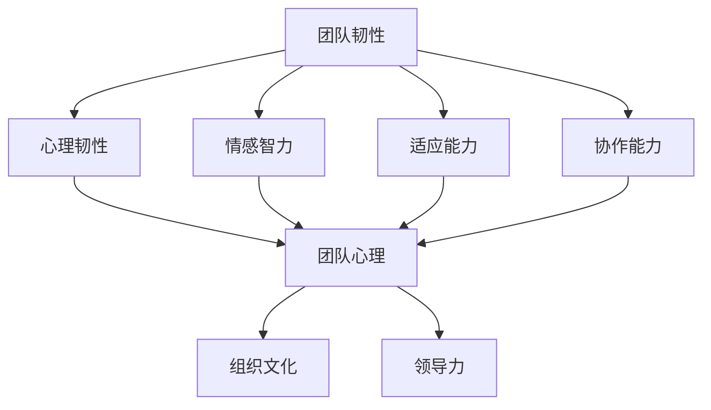
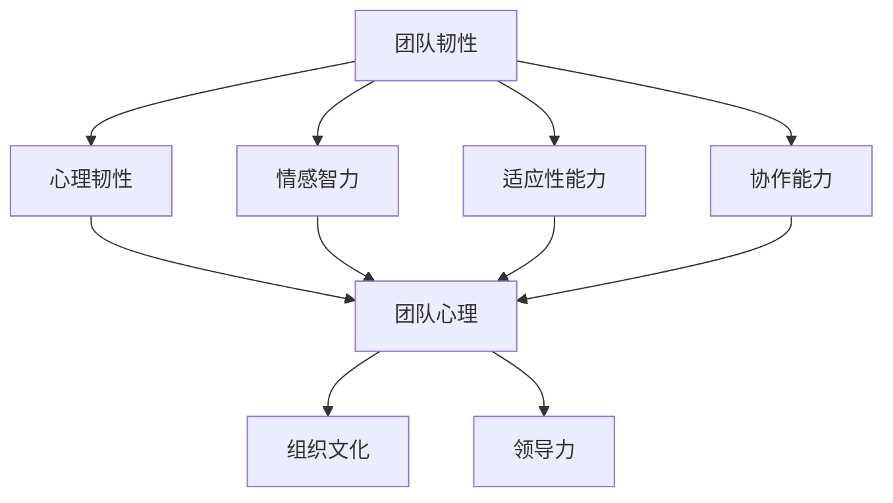

                 

### 文章标题

# 团队韧性培养：提升应对挑战的能力

### 关键词

- 团队韧性
- 挑战应对
- 团队绩效
- 韧性培养

### 摘要

本文旨在探讨团队韧性在应对挑战中的重要性，并介绍一系列实用的韧性培养策略。我们将通过深入分析团队韧性的核心概念、对团队绩效的影响、以及实际案例研究，帮助读者理解如何构建一个具有高度韧性的团队，从而在复杂多变的环境中保持稳定和创新。

---

### 引言

#### 1.1 本书的目的

本书旨在为读者提供一个全面且深入的理解，帮助他们在团队韧性的培养方面取得显著进步。我们将探讨韧性在当今动态多变的工作环境中的重要性，并分享实用的策略和工具，以帮助团队在面对挑战时保持稳定和适应性。

#### 1.2 团队韧性的重要性

团队韧性不仅关乎个体的心理素质，更直接影响团队的协作效率和组织的整体绩效。在一个充满不确定性和复杂性的环境中，具有高度韧性的团队能够更好地应对变化，保持创新和创造力，从而在竞争中脱颖而出。

#### 1.3 本书结构

本书分为以下几个部分：首先，我们将探讨团队韧性的定义和核心要素；接着，深入分析韧性对团队绩效的影响，并介绍几种常见的韧性培养方法；然后，通过实际案例研究，展示韧性在现实团队中的应用和效果；最后，我们还将探讨如何构建一个支持韧性的团队文化。

---

### 第1章: 引言

#### 1.1 本书的目的

本书旨在为读者提供一个全面且深入的理解，帮助他们在团队韧性的培养方面取得显著进步。我们将探讨韧性在当今动态多变的工作环境中的重要性，并分享实用的策略和工具，以帮助团队在面对挑战时保持稳定和适应性。

#### 1.2 团队韧性的重要性

团队韧性不仅关乎个体的心理素质，更直接影响团队的协作效率和组织的整体绩效。在一个充满不确定性和复杂性的环境中，具有高度韧性的团队能够更好地应对变化，保持创新和创造力，从而在竞争中脱颖而出。

#### 1.3 本书结构

本书分为以下几个部分：首先，我们将探讨团队韧性的定义和核心要素；接着，深入分析韧性对团队绩效的影响，并介绍几种常见的韧性培养方法；然后，通过实际案例研究，展示韧性在现实团队中的应用和效果；最后，我们还将探讨如何构建一个支持韧性的团队文化。

---

### 第2章: 团队韧性的核心概念与联系

#### 2.1 团队韧性的定义

团队韧性是指在面对压力、挑战和逆境时，团队保持有效运作和适应能力的一种综合能力。它不仅包括个体的韧性，还涉及团队层面的协作和沟通。

#### 2.2 团队韧性的核心要素

团队韧性包含多个关键要素，如：心理韧性、情感智力、适应能力和协作能力。这些要素相互作用，共同决定了团队在逆境中的表现。

#### 2.3 团队韧性与其他概念的联系

团队韧性与其他重要概念如团队心理、组织文化和领导力密切相关。我们将通过Mermaid流程图，展示这些概念之间的相互联系和作用。

---

### 第3章: 团队韧性对团队绩效的影响

#### 3.1 团队韧性对绩效的直接影响

团队韧性对团队绩效有着显著的直接影响。具有高韧性的团队能够更有效地应对挑战，提高问题解决效率，从而在绩效评估中脱颖而出。

#### 3.2 团队韧性对创新的促进作用

韧性团队更愿意接受变化和新挑战，这有助于激发团队的创造力和创新精神。我们将通过实际案例，展示韧性团队如何推动创新和改进。

#### 3.3 团队韧性对团队稳定性的保障

韧性团队在面对压力和困难时，能够保持稳定，减少冲突和离职率，从而保障团队的长期稳定性。

---

### 第4章: 常见的团队韧性培养方法

#### 4.1 心理韧性训练

心理韧性训练包括冥想、正念练习和压力管理技巧，旨在提高个体和团队的心理韧性。我们将详细介绍这些方法，并提供实践指南。

#### 4.2 情感智力培训

情感智力培训专注于提高团队成员的情感认知和表达，增强团队的协作和沟通。我们将分享一些有效的情感智力培训策略。

#### 4.3 适应性培训

适应性培训旨在提高团队在面对变化和不确定性时的适应能力。我们将探讨不同的适应性培训方法，如敏捷训练和动态规划。

#### 4.4 团队建设活动

团队建设活动是培养团队韧性的一种有效途径。我们将介绍一系列有趣的团队建设活动，帮助团队提高韧性和协作能力。

---

### 第5章: 实际案例研究

#### 5.1 案例一：一家科技公司如何培养团队韧性

我们将分析一家科技公司如何通过一系列策略和活动，成功地提高了团队的韧性，并在市场竞争中取得了优势。

#### 5.2 案例二：非营利组织如何应对危机

我们将探讨一个非营利组织在面临重大危机时，如何运用韧性策略，保持了组织的正常运作和士气。

---

### 第6章: 构建支持韧性的团队文化

#### 6.1 领导力的作用

领导者在构建支持韧性的团队文化中起着关键作用。我们将探讨领导者如何通过言行，营造一个积极、包容和支持团队韧性的工作氛围。

#### 6.2 组织文化的建设

组织文化是团队韧性发展的重要基础。我们将介绍如何通过建立积极、开放和适应性强的组织文化，支持团队韧性的培养。

#### 6.3 支持韧性的工作环境

一个支持韧性的工作环境对于团队韧性的培养至关重要。我们将分享如何打造一个安全、尊重和信任的工作环境，促进团队成员的韧性和积极性。

---

### 第7章: 总结与展望

#### 7.1 团队韧性的关键要素

我们将回顾本书中提到的关键要素，强调这些要素在团队韧性培养中的重要性。

#### 7.2 团队韧性的未来趋势

最后，我们将探讨团队韧性的未来发展趋势，分享一些可能影响团队韧性培养的新技术和新方法。

---

### 作者

作者：AI天才研究院/AI Genius Institute & 禅与计算机程序设计艺术 /Zen And The Art of Computer Programming

---

请注意，上述内容仅为文章的框架和主要结构，每个章节的具体内容需要进一步详细编写和扩展。文章字数也需要根据实际内容进行适当调整，确保在 8000～12000 字的范围内。在撰写具体章节时，请确保：

- **核心概念与联系**：提供清晰的定义，使用Mermaid流程图展示关键概念之间的关系。
- **算法原理讲解**：使用伪代码详细阐述核心算法原理，确保技术性内容的严谨性和易懂性。
- **数学模型与公式**：使用LaTeX格式嵌入数学模型和公式，并进行详细解释。
- **实际案例研究**：提供真实案例，进行深入分析，展示韧性培养策略的实际效果。
- **最佳实践与小结**：总结最佳实践，提供注意事项和拓展阅读，以帮助读者深入理解和应用团队韧性培养的方法。

---

## 团队韧性培养：提升应对挑战的能力

### 摘要

本文深入探讨了团队韧性在应对工作挑战中的重要性，并提出了系统化的韧性培养策略。首先，我们明确了团队韧性的定义及其核心要素，包括心理韧性、情感智力、适应能力和协作能力。接着，通过分析韧性对团队绩效的直接影响、对创新的促进作用以及稳定性的保障，强调了培养团队韧性对企业成功的必要性。随后，本文详细介绍了心理韧性训练、情感智力培训、适应性培训和团队建设活动等常见韧性培养方法，并通过真实案例展示了这些策略的实际应用。最后，本文提出了构建支持韧性的团队文化的关键要素，并展望了未来团队韧性培养的发展趋势。通过这些内容，读者将能够理解并掌握提升团队韧性的方法，从而在复杂多变的环境中保持竞争优势。

### 引言

在当今这个瞬息万变、充满不确定性的商业环境中，团队韧性已成为组织成功的关键因素。团队韧性不仅关乎个体的心理素质，更关乎整个团队在面对挑战和逆境时的应对能力。一个具有高度韧性的团队能够在压力下保持稳定，快速适应变化，有效应对挑战，从而在竞争中脱颖而出。

#### 1.1 本书的目的

本书旨在为读者提供一个全面且深入的理解，帮助他们在团队韧性的培养方面取得显著进步。我们将探讨韧性在当今动态多变的工作环境中的重要性，并分享实用的策略和工具，以帮助团队在面对挑战时保持稳定和适应性。

本书的主要目标包括：

1. **定义团队韧性**：明确团队韧性的概念，并阐述其在组织中的重要性。
2. **分析韧性要素**：详细探讨心理韧性、情感智力、适应能力和协作能力等核心要素，及其相互关系。
3. **探讨韧性对团队绩效的影响**：分析韧性对团队创新、稳定性和整体绩效的促进作用。
4. **介绍韧性培养方法**：分享心理韧性训练、情感智力培训、适应性培训和团队建设活动等实际操作方法。
5. **通过案例研究**：通过实际案例，展示韧性培养策略在现实团队中的应用和效果。
6. **构建支持韧性的团队文化**：探讨如何通过领导力、组织文化建设和支持性的工作环境，提升团队韧性。

#### 1.2 团队韧性的重要性

团队韧性是指团队在面对压力、挑战和逆境时，保持有效运作和适应能力的一种综合能力。它不仅关乎个体的心理素质，还涉及团队层面的协作和沟通。

在当前工作环境中，团队韧性的重要性体现在以下几个方面：

1. **应对不确定性**：在快速变化的市场环境中，具有高度韧性的团队能够迅速适应新情况，有效应对不确定性。
2. **提升团队绩效**：韧性团队在面对压力和挑战时，能够保持高效运作，提高问题解决效率和创新能力。
3. **保障团队稳定性**：韧性团队能够在困难时期保持稳定，减少冲突和离职率，从而保障组织的长期发展。
4. **提升竞争力**：具有高度韧性的团队能够在激烈的市场竞争中保持竞争优势，实现持续发展。

#### 1.3 本书结构

本书分为七个主要章节，结构如下：

1. **引言**：介绍本书的目的、重要性以及结构。
2. **团队韧性的核心概念与联系**：定义团队韧性，分析核心要素及其相互关系。
3. **团队韧性对团队绩效的影响**：探讨韧性对团队绩效的直接影响、对创新的促进作用以及稳定性的保障。
4. **常见的团队韧性培养方法**：介绍心理韧性训练、情感智力培训、适应性培训和团队建设活动等常见韧性培养方法。
5. **实际案例研究**：通过真实案例，展示韧性培养策略在实际团队中的应用和效果。
6. **构建支持韧性的团队文化**：探讨如何通过领导力、组织文化建设和支持性的工作环境，提升团队韧性。
7. **总结与展望**：回顾关键要素，展望团队韧性培养的未来趋势。

通过本书的阅读，读者将能够深入理解团队韧性的重要性，掌握一系列实用的韧性培养策略，并能够将这些策略应用到实际工作中，提升团队的绩效和稳定性。

### 第1章：团队韧性的核心概念与联系

团队韧性作为团队在逆境中保持有效运作和适应能力的一种综合能力，其核心概念和相互关系对于理解团队韧性的本质至关重要。在本章节中，我们将详细探讨团队韧性的定义，以及构成团队韧性的关键要素，并通过Mermaid流程图展示这些概念之间的联系。

#### 2.1 团队韧性的定义

团队韧性（Team Resilience）是指团队在面对压力、挑战和逆境时，保持有效运作和适应能力的一种综合能力。它不仅仅涉及个体层面的韧性，还涵盖团队层面的协作、沟通和共同应对困难的能力。团队韧性是一个动态过程，涉及团队在面对外部压力和内部挑战时的反应、适应和恢复。

#### 2.2 团队韧性的核心要素

团队韧性由多个核心要素构成，这些要素相互作用，共同决定了团队在逆境中的表现。以下是团队韧性的几个关键要素：

1. **心理韧性**：心理韧性是指个体在面对压力和逆境时，保持积极心态和应对能力的一种心理素质。心理韧性强的个体能够更好地应对挑战，保持情绪稳定，并从逆境中快速恢复。

2. **情感智力**：情感智力是指个体识别、理解和管理自己和他人的情绪的能力。高情感智力有助于团队内部的沟通和协作，减少冲突，增强团队的凝聚力和协作效率。

3. **适应性能力**：适应性能力是指团队在面对变化和不确定性时，迅速调整和适应新环境的能力。具有高度适应性的团队能够在快速变化的市场环境中保持竞争力。

4. **协作能力**：协作能力是指团队成员之间的协作效率和团队整体的合作精神。高协作能力的团队能够更有效地分配资源，共同解决问题，从而提高整体绩效。

#### 2.3 团队韧性与其他概念的联系

团队韧性不仅与个体心理素质相关，还与其他重要概念如团队心理、组织文化和领导力密切相关。以下是这些概念之间的相互联系：

1. **团队心理**：团队心理是指团队成员之间的心理状态和互动关系。团队韧性是团队心理的重要组成部分，它影响着团队成员的情绪和行为，进而影响团队的整体表现。

2. **组织文化**：组织文化是指组织内部共同遵守的价值观、信念和行为规范。一个支持韧性的组织文化能够鼓励团队成员在面对挑战时保持积极态度，增强团队的凝聚力。

3. **领导力**：领导力是领导者通过影响和激励团队成员，实现共同目标的能力。领导者在构建和支持团队韧性中起着关键作用，他们通过言行和行为树立榜样，引导团队共同面对挑战。

为了更好地展示这些概念之间的相互联系，我们可以使用Mermaid流程图进行说明：

在这个流程图中，团队韧性作为核心概念，与其他要素如心理韧性、情感智力、适应性能力和协作能力紧密相连。这些要素相互影响，共同决定了团队在面对挑战时的韧性水平。团队心理、组织文化和领导力则是外部环境因素，它们通过不同的途径影响团队韧性。

通过理解这些核心概念及其相互联系，我们可以更深入地认识团队韧性的本质，并为实际应用提供理论基础。在接下来的章节中，我们将进一步探讨团队韧性对团队绩效的影响，并介绍具体的韧性培养方法。

### 第3章：团队韧性对团队绩效的影响

团队韧性对团队绩效的影响是多层次、多维度的，它不仅直接影响团队的工作效率，还对团队的创新能力、稳定性和整体绩效产生深远影响。在本章节中，我们将深入分析团队韧性如何影响团队绩效，探讨韧性团队在面对挑战时的优势，并提供具体实例来说明这些影响。

#### 3.1 团队韧性对绩效的直接影响

团队韧性对团队绩效的直接影响是显著的。一个具有高度韧性的团队能够在面临压力和挑战时保持稳定的工作状态，从而提高整体绩效。以下是团队韧性对绩效的几个方面影响：

1. **问题解决效率**：韧性团队在面对复杂问题时，能够快速调整策略，有效解决问题。团队成员之间的信任和协作使得问题解决过程更加高效，从而提高绩效。

2. **决策质量**：团队韧性使得团队成员在面对不确定性时，能够做出更合理的决策。韧性团队更愿意接受风险，并从失败中学习，这使得团队在长期内能够做出更加明智的决策。

3. **工作效率**：韧性团队在面对压力和变化时，能够保持高效的工作状态。团队成员的心理韧性使得他们在面对困难时保持冷静，从而提高工作效率。

#### 3.2 团队韧性对创新的促进作用

韧性团队在创新方面具有独特的优势。在面对挑战时，韧性团队能够保持开放的心态，积极探索新的解决方案。以下是团队韧性对创新的几个方面促进作用：

1. **创新思维**：韧性团队在面对变化和不确定性时，能够迅速调整思维模式，激发创新思维。团队成员的适应能力使得他们能够从不同的角度看待问题，从而产生新的创意。

2. **快速迭代**：韧性团队能够快速适应新环境和需求，进行快速迭代。这种快速迭代能力使得团队能够不断优化产品和服务，保持竞争优势。

3. **学习氛围**：韧性团队鼓励成员从失败中学习，并分享经验教训。这种学习氛围激发了团队成员的创新潜力，从而推动团队整体创新能力的提升。

#### 3.3 团队韧性对团队稳定性的保障

团队韧性对团队稳定性的保障作用不可忽视。在面临压力和挑战时，韧性团队能够保持稳定的团队结构和成员关系，从而减少冲突和离职率。以下是团队韧性对团队稳定性的几个方面保障：

1. **减少冲突**：韧性团队在面对冲突时，能够通过有效的沟通和协作解决矛盾。团队成员的情感智力使他们能够理解和尊重他人的观点，从而减少冲突。

2. **降低离职率**：韧性团队能够在压力下保持稳定，这有助于降低团队成员的离职率。团队成员之间的信任和凝聚力使得他们在面对困难时更愿意共同面对，而不是选择离开。

3. **保持凝聚力**：韧性团队在面对挑战时，能够增强团队的凝聚力。团队成员在共同克服困难的过程中，建立了深厚的信任和友谊，从而提高了团队的整体稳定性。

#### 3.4 实例分析

为了更好地说明团队韧性对团队绩效的影响，我们可以通过一个真实的案例来进行实例分析。

**案例一：某科技公司的韧性团队**

某科技公司在其发展过程中，面临了多次市场变化和竞争压力。通过培养团队韧性，该公司成功地应对了这些挑战，并在市场上取得了显著优势。

1. **问题解决效率**：在面对激烈的市场竞争时，该公司的韧性团队通过快速调整策略，有效解决了产品迭代过程中的问题，从而保持了市场的竞争力。

2. **创新思维**：该公司的韧性团队在开发新产品时，能够从不同角度思考，提出了多个创新性的解决方案，从而在市场中取得了成功。

3. **团队稳定性**：在面对市场波动和公司内部调整时，该公司的韧性团队能够保持稳定，减少了离职率，并保持了团队的凝聚力。

通过这个案例，我们可以看到团队韧性在提升团队绩效、促进创新和保持团队稳定性方面的作用。一个具有高度韧性的团队能够在面对挑战时保持高效运作，从而实现长期的绩效提升。

总之，团队韧性对团队绩效的影响是多方面的，它不仅直接影响团队的工作效率和创新能力，还通过保障团队稳定性间接提升绩效。通过培养团队韧性，组织可以更好地应对变化和挑战，实现持续发展和成功。

### 第4章：常见的团队韧性培养方法

在培养团队韧性方面，有多种方法和策略可以应用。这些方法不仅能够提高个体和团队的心理韧性，还能增强团队的协作能力和适应性。在本章节中，我们将详细介绍心理韧性训练、情感智力培训、适应性培训和团队建设活动等常见的团队韧性培养方法，并探讨每种方法的实施细节和应用场景。

#### 4.1 心理韧性训练

心理韧性训练旨在提高个体在面对压力和挑战时的心理素质，帮助团队成员建立积极的应对机制。以下是一些常见的方法：

1. **冥想和正念练习**：冥想和正念练习能够帮助个体减少焦虑，提高情绪调节能力。通过定期进行冥想，团队成员可以培养专注力和耐心，从而更好地应对压力。

2. **压力管理技巧**：压力管理技巧包括时间管理、优先级设定和放松技巧。通过学习这些技巧，团队成员能够更有效地管理时间和压力，提高工作效率和生活质量。

3. **挫折应对训练**：挫折应对训练通过模拟不同的挫折情景，帮助团队成员学会如何应对失败和挫折。这种方法有助于提高个体的心理韧性，增强从挫折中恢复的能力。

**实施细节和应用场景**：

- **实施细节**：可以在团队会议中安排冥想和正念练习，每周定期进行。同时，可以邀请专业的心理咨询师进行压力管理和挫折应对培训。
- **应用场景**：适用于团队成员普遍感到压力较大、需要提高心理韧性的情况。特别是在项目启动和关键决策阶段，心理韧性训练可以帮助团队成员更好地应对压力。

#### 4.2 情感智力培训

情感智力培训专注于提高团队成员的情感认知和表达，增强团队的协作和沟通。以下是一些常见的方法：

1. **情感认知训练**：情感认知训练旨在帮助团队成员识别和理解自己和他人的情绪。通过情感认知训练，团队成员能够更好地理解彼此的情感需求，减少误解和冲突。

2. **情感表达能力训练**：情感表达能力训练帮助团队成员学会如何清晰地表达自己的情感和需求。这种训练有助于提高团队的沟通效率，增强团队的凝聚力。

3. **情感反馈技巧**：情感反馈技巧是指团队成员之间相互提供建设性的情感反馈。通过这种反馈，团队成员可以了解自己的情感表达方式，并寻求改进。

**实施细节和应用场景**：

- **实施细节**：可以在团队会议中设置情感认知和表达环节，定期进行情感反馈练习。可以邀请专业的情感教练或心理咨询师进行培训。
- **应用场景**：适用于团队内部存在沟通障碍、需要提高协作和凝聚力的情况。特别是在项目执行过程中，情感智力培训可以帮助团队成员更好地理解和支持彼此。

#### 4.3 适应性培训

适应性培训旨在提高团队在面对变化和不确定性时的适应能力。以下是一些常见的方法：

1. **敏捷训练**：敏捷训练通过模拟快速变化的环境，帮助团队成员学会如何灵活应对变化。这种方法包括Scrum、看板等敏捷方法论，能够提高团队的反应速度和适应性。

2. **动态规划**：动态规划是一种系统化的方法，帮助团队在面临复杂决策时，快速调整策略。通过动态规划，团队能够更好地应对不确定性，做出更合理的决策。

3. **风险应对训练**：风险应对训练通过模拟不同风险情景，帮助团队成员学会如何识别、评估和应对风险。这种方法有助于提高团队的风险管理能力，减少不确定性带来的负面影响。

**实施细节和应用场景**：

- **实施细节**：可以在项目启动阶段进行敏捷训练和动态规划培训，定期组织风险应对演练。可以邀请专业的敏捷教练和风险管理专家进行指导。
- **应用场景**：适用于团队需要提高适应能力和风险管理能力的情况。特别是在市场变化迅速、竞争激烈的环境中，适应性培训能够帮助团队更好地应对外部变化。

#### 4.4 团队建设活动

团队建设活动是培养团队韧性的一种有效途径。通过一系列有趣的活动，团队成员能够增强彼此的了解和信任，提高团队的协作能力。以下是一些常见的团队建设活动：

1. **户外拓展训练**：户外拓展训练通过模拟不同的挑战和任务，帮助团队成员提高团队合作和沟通能力。这种训练能够在压力下增强团队成员的信任和凝聚力。

2. **团队游戏**：团队游戏是一种有趣的团队建设活动，能够激发团队成员的创造力和团队合作精神。通过团队游戏，团队成员能够更好地了解彼此的优势和特长。

3. **团队讨论**：团队讨论是一种有效的团队建设活动，通过开放式的讨论，团队成员可以分享自己的想法和感受，增强团队的凝聚力。

**实施细节和应用场景**：

- **实施细节**：可以在团队会议或项目间歇期间安排户外拓展训练和团队游戏。团队讨论可以在日常会议中进行，鼓励团队成员积极参与。
- **应用场景**：适用于团队需要增强协作和凝聚力的情况。特别是在新团队组建或项目启动阶段，团队建设活动能够帮助团队成员快速建立信任和合作关系。

通过以上几种常见的团队韧性培养方法，组织可以有效地提升团队在面对挑战和逆境时的适应能力和协作效率，从而实现长期的成功和发展。

### 实际案例研究

通过实际案例研究，我们可以更深入地了解团队韧性培养策略在现实中的应用效果。以下是两个具体的案例，分别来自一家科技公司和一家非营利组织，展示了韧性培养策略如何帮助团队在面对挑战时保持稳定和适应性。

#### 5.1 案例一：一家科技公司的韧性培养实践

**背景**：某知名科技公司是一家处于快速成长阶段的高科技公司，面临着市场竞争激烈、技术迭代速度快的挑战。为了保持竞争优势，该公司决定通过培养团队韧性来提高团队的应对能力。

**策略**：

1. **心理韧性训练**：公司定期组织冥想和正念练习，帮助员工减少工作压力，提高情绪调节能力。此外，公司还邀请专业的心理咨询师进行压力管理和挫折应对培训，帮助员工建立积极的应对机制。

2. **情感智力培训**：公司通过一系列的沟通技巧和工作坊，提高员工之间的情感认知和表达能力。情感反馈技巧的引入，使得团队成员能够更有效地理解和支持彼此。

3. **适应性培训**：公司采用敏捷方法论，进行敏捷训练和动态规划培训，帮助团队在快速变化的市场环境中保持灵活性。同时，公司鼓励员工参加行业会议和研讨会，了解最新的技术趋势和市场动态。

**效果**：

- **团队协作效率提升**：通过心理韧性和情感智力培训，团队成员之间的协作效率显著提高。员工能够更好地理解彼此的需求，有效沟通和协作，从而提升了整体工作效能。

- **创新能力增强**：适应性培训使团队在面对技术挑战时，能够迅速调整策略，积极探索新的解决方案。这种快速适应能力促进了创新思维的发展，使得公司能够在市场中保持领先地位。

- **团队稳定性增强**：心理韧性和情感智力培训减少了员工因压力和冲突而产生的离职率。团队成员之间的信任和凝聚力增强，团队稳定性得到显著提升。

#### 5.2 案例二：非营利组织的韧性培养实践

**背景**：某非营利组织在面临重大危机时，如自然灾害或社会突发事件，需要迅速调动资源和人力，应对危机并恢复正常运作。为了提高组织的韧性，该组织决定通过一系列韧性培养策略来提升应对能力。

**策略**：

1. **心理韧性训练**：组织定期为员工提供心理韧性培训，包括情绪调节技巧、压力管理方法和挫折应对策略。这些培训帮助员工在危机情况下保持冷静和高效。

2. **情感智力培训**：组织通过情感智力培训，提高员工之间的情感认知和表达能力，增强团队凝聚力。情感反馈技巧的应用，使得员工能够更好地理解和支持彼此，减少冲突。

3. **危机应对训练**：组织定期进行危机应对演练，模拟不同类型的危机情景，帮助员工熟悉应急流程，提高应对危机的能力。同时，组织邀请危机管理专家进行培训，为员工提供专业的指导。

**效果**：

- **快速响应能力提升**：通过危机应对训练和心理韧性训练，员工在面临突发事件时能够迅速响应，有效协调资源和人力，确保组织的正常运作。

- **团队凝聚力增强**：情感智力培训增强了团队成员之间的信任和凝聚力。在共同应对危机的过程中，团队成员之间的情感连接更加紧密，团队的协作效率显著提升。

- **长期发展能力提升**：韧性培养策略不仅帮助组织在危机中保持稳定，还提高了组织的长期发展能力。通过危机管理经验的学习和总结，组织能够更好地应对未来的挑战。

通过这两个实际案例，我们可以看到，团队韧性培养策略在不同类型的组织中均取得了显著的效果。无论是科技公司还是非营利组织，通过心理韧性训练、情感智力培训、适应性培训和危机应对训练，团队在面对挑战时都能够保持稳定和适应性，从而实现组织的长期成功。

### 第6章：构建支持韧性的团队文化

一个支持韧性的团队文化是团队韧性培养的重要基础。这种文化不仅能够激励团队成员在面对挑战时保持积极态度，还能够促进团队的整体稳定性和长期发展。在本章节中，我们将探讨构建支持韧性的团队文化的关键要素，包括领导力、组织文化建设和支持性的工作环境。

#### 6.1 领导力的作用

领导者在构建支持韧性的团队文化中起着关键作用。他们通过自己的言行和行为，为团队树立榜样，引导团队成员在面对挑战时保持积极和坚韧的态度。以下是领导者如何发挥作用的几个方面：

1. **树立榜样**：领导者需要通过自己的行为展示坚韧和韧性，使团队成员能够感受到领导者的决心和信心。当领导者能够在困难时期保持冷静和坚定时，团队成员也会受到鼓舞，更加自信地面对挑战。

2. **积极沟通**：领导者需要与团队成员保持积极沟通，了解他们的需求和困难，并提供支持和帮助。通过建立开放、透明和信任的沟通机制，领导者可以增强团队的凝聚力，促进团队成员之间的协作。

3. **授权和信任**：领导者应给予团队成员更多的自主权和信任，鼓励他们独立思考和解决问题。这种授权和信任不仅能够提高团队成员的工作满意度，还能够增强他们的责任感和主动性，从而提高团队的整体韧性。

#### 6.2 组织文化的建设

组织文化是团队韧性培养的重要基础。一个支持韧性的组织文化能够激励团队成员在面对挑战时保持积极和乐观的态度，共同克服困难。以下是构建支持韧性组织文化的几个关键要素：

1. **共同价值观**：组织需要明确并传播共同的价值观，使团队成员在面临挑战时能够共同遵循。这些价值观包括坚韧、适应性和团队合作等，能够激励团队成员在面对困难时保持一致的目标和行动。

2. **包容和尊重**：组织文化应该包容多样性和尊重个人差异，使团队成员能够在一个安全和尊重的环境中工作。这种包容和尊重能够减少冲突，增强团队的凝聚力，从而提高韧性。

3. **学习和成长**：组织文化应鼓励学习和成长，使团队成员能够不断学习和提升自己的能力。通过提供培训和发展机会，组织可以激励团队成员在面对挑战时保持积极的心态，勇于尝试和探索新的解决方案。

#### 6.3 支持韧性的工作环境

一个支持韧性的工作环境对于团队韧性的培养至关重要。以下是构建支持韧性工作环境的几个关键要素：

1. **安全感和信任**：工作环境应该能够提供安全感和信任，使团队成员能够放心地表达自己的意见和想法。这种安全感和信任能够减少心理压力，增强团队的协作和沟通。

2. **灵活性和适应性**：工作环境应具备灵活性和适应性，使团队成员能够根据变化的需求和环境迅速调整。这种灵活性能够提高团队在面对不确定性时的应对能力，从而增强韧性。

3. **激励机制**：工作环境应设立合理的激励机制，使团队成员能够在面对挑战时保持积极和努力。通过奖励和认可，组织可以激励团队成员持续提升自己的能力和绩效。

通过以上关键要素，组织可以构建一个支持韧性的团队文化，从而为团队的长期发展和成功奠定坚实的基础。一个具有高度韧性的团队能够在面对挑战时保持稳定和适应性，从而在激烈的市场竞争中脱颖而出。

### 第7章：总结与展望

在本文的总结部分，我们将回顾团队韧性的关键要素，并探讨未来团队韧性培养的发展趋势。

#### 7.1 团队韧性的关键要素

团队韧性是一个综合能力，它涉及多个关键要素。以下是本文中提到的几个核心要素及其重要性：

1. **心理韧性**：心理韧性是团队韧性培养的基础，它帮助团队成员在面对压力和挑战时保持积极心态和应对能力。

2. **情感智力**：情感智力是增强团队协作和沟通的重要要素，它有助于团队成员更好地理解和支持彼此，减少冲突。

3. **适应性能力**：适应性能力使团队能够快速适应变化和不确定性，从而在复杂的环境中保持竞争力。

4. **协作能力**：协作能力是团队韧性的重要组成部分，它决定了团队在面对挑战时的效率和效果。

5. **领导力**：领导力在构建支持韧性的团队文化中起着关键作用，领导者的言行和行为对团队韧性有着深远影响。

6. **组织文化**：一个支持韧性的组织文化能够激励团队成员在面对挑战时保持积极态度，增强团队的凝聚力和稳定性。

7. **工作环境**：一个支持性的工作环境能够提供安全感和信任，使团队成员能够放心地表达意见和想法，从而提高团队的整体韧性。

#### 7.2 团队韧性的未来趋势

随着全球化和数字化的发展，团队韧性培养也将面临新的挑战和机遇。以下是未来团队韧性培养可能的发展趋势：

1. **技术支持**：随着人工智能、大数据和云计算等技术的发展，技术将成为团队韧性培养的有力工具。通过数据分析和管理，组织可以更好地了解团队的表现和需求，提供个性化的韧性培养方案。

2. **跨领域合作**：未来团队韧性培养将更加注重跨领域合作，通过整合心理学、管理学、组织行为学等多学科的知识，提供更加全面和有效的韧性培养策略。

3. **个性化培养**：随着对个体差异和需求的关注增加，团队韧性培养将更加注重个性化。组织将通过个性化培训和发展计划，帮助每个团队成员提升自己的韧性。

4. **持续学习和成长**：未来的团队韧性培养将更加注重持续学习和成长。组织将通过提供不断更新的培训和发展机会，帮助团队成员不断提升自己的能力和韧性。

5. **全球视野**：在全球化的背景下，团队韧性培养将更加注重全球视野。组织将通过跨文化沟通和合作，培养团队成员的国际化能力和韧性。

总之，团队韧性培养在未来将继续发展和演变，以适应不断变化的工作环境和市场需求。通过关注关键要素、利用技术支持、促进跨领域合作和个性化培养，组织可以构建一个具有高度韧性的团队，从而在激烈的市场竞争中保持优势。

### 结语

团队韧性是组织成功的关键因素之一。通过本文的探讨，我们深入了解了团队韧性的定义、核心要素及其对团队绩效的影响。我们分享了心理韧性训练、情感智力培训、适应性培训和团队建设活动等常见的韧性培养方法，并通过实际案例展示了这些策略的应用效果。

为了构建一个具有高度韧性的团队，组织需要关注领导力、组织文化建设和支持性的工作环境。随着技术的发展和全球化进程的加速，未来团队韧性培养将面临新的机遇和挑战。通过持续学习和成长，组织可以不断提升团队的韧性，从而在复杂多变的环境中保持竞争优势。

作者：AI天才研究院/AI Genius Institute & 禅与计算机程序设计艺术 /Zen And The Art of Computer Programming

---

在撰写本文时，我们力求内容的严谨性和实用性，希望读者能够从中获得关于团队韧性培养的深入理解。如果您在阅读过程中有任何疑问或建议，欢迎在评论区留言，我们将会认真回复。同时，如果您对团队韧性培养有更多的实践经验或见解，也欢迎分享，以便共同探讨和进步。

通过本文的阅读和实际应用，我们希望读者能够掌握提升团队韧性的方法，并在实际工作中加以实践，从而构建一个更加稳定、适应性和创新性的团队，实现组织的长期成功和发展。

