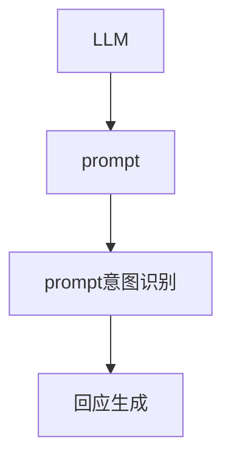

                 

### 文章标题

# 基于LLM的prompt意图理解优化

> 关键词：大型语言模型（LLM），prompt意图理解，自然语言处理，优化方法，应用场景

> 摘要：本文将深入探讨大型语言模型（LLM）在自然语言处理中的应用，特别是prompt意图理解的优化方法。首先，我们将简要介绍LLM的基本概念和特性，然后详细分析prompt意图理解的重要性及其应用场景。接着，文章将分为三大部分：背景与概述、LLM的prompt设计、以及实践与案例分析，依次介绍相关技术和方法，并通过实际案例展示其应用效果。最后，我们将讨论prompt意图理解的挑战与未来趋势，总结最佳实践，并提供进一步学习和研究的资源。

### 第一部分：背景与概述

#### 第1章：LLM与prompt意图理解基础

##### 1.1 LLM的概述与核心特性

**LLM的定义**：大型语言模型（LLM，Large Language Model）是一种基于深度学习技术的语言处理模型，通过对海量文本数据进行预训练，使其具备理解、生成和翻译自然语言的能力。LLM的核心在于其规模巨大，参数数量通常在数十亿至千亿级别。

**LLM的关键特性**：

1. **泛化能力**：LLM通过在大规模数据集上预训练，使其能够处理各种语言任务，具有较好的泛化能力。
2. **上下文理解**：LLM能够理解上下文信息，生成连贯、自然的文本。
3. **自适应能力**：LLM可以根据特定任务进行微调，提高其在特定领域的表现。

**LLM的技术发展历史**：

- **早期研究**：1990年代，基于统计方法和规则的方法在语言处理领域占据主导地位。
- **深度学习兴起**：2006年，AlexNet的提出标志着深度学习在计算机视觉领域的崛起。此后，深度学习逐渐应用于自然语言处理领域。
- **预训练技术的发展**：2018年，GPT-2的出现标志着预训练技术在自然语言处理中的重要性。此后，一系列大规模LLM相继发布，如GPT-3、BERT等。

##### 1.2 prompt意图理解的概念与重要性

**prompt意图理解的基本概念**：prompt意图理解是指模型根据用户输入的提示（prompt）来确定用户的意图，从而生成相应的回应。prompt意图理解的核心在于解析用户输入，理解其背后的意图，并生成符合期望的输出。

**prompt意图理解的重要性**：

1. **交互性**：prompt意图理解是实现人机交互的重要技术，能够提高系统的智能水平和用户体验。
2. **个性化**：通过理解用户的意图，系统能够提供个性化的服务，满足用户的需求。
3. **效率提升**：prompt意图理解能够自动化地处理大量用户请求，提高系统的工作效率。

**prompt意图理解的应用场景**：

1. **智能客服**：通过理解用户的问题，智能客服系统能够提供准确的回答，解决用户问题。
2. **智能推荐**：通过理解用户的偏好，智能推荐系统能够提供个性化的商品或内容推荐。
3. **智能写作**：通过理解用户的需求，智能写作系统能够生成符合要求的文章。

#### 第2章：自然语言处理与LLM的关系

##### 2.1 自然语言处理的基本原理

**语言模型**：语言模型是自然语言处理的核心组成部分，其目的是生成概率分布，预测下一个词语或词组。

**机器翻译**：机器翻译是指使用计算机程序将一种自然语言翻译成另一种自然语言。

**文本分类**：文本分类是指将文本数据根据其内容划分为不同的类别。

**命名实体识别**：命名实体识别是指识别文本中的特定实体，如人名、地名、组织机构等。

##### 2.2 LLM在自然语言处理中的应用

**LLM在文本生成中的应用**：LLM可以通过预训练生成连贯、自然的文本，例如文章、故事、诗歌等。

**LLM在文本分类中的应用**：LLM可以通过对大规模数据集的预训练，对文本数据进行分类，例如情感分析、主题分类等。

**LLM在问答系统中的应用**：LLM可以通过理解用户的问题，生成相应的回答，例如智能问答系统、知识图谱问答等。

### 第二部分：LLM的prompt设计

#### 第3章：prompt设计与优化

##### 3.1 prompt设计的基本原则

**清晰性**：prompt应当简洁明了，避免使用复杂的术语和语言，确保用户能够轻松理解。

**完整性**：prompt应当包含所有必要的信息，以便模型能够准确理解用户的意图。

**目标导向**：prompt应当明确指出用户的期望目标，帮助模型生成符合预期的输出。

**可扩展性**：prompt设计应当考虑未来的需求变化，确保模型能够在不同场景下保持良好的表现。

##### 3.2 prompt优化的方法与技术

**数据增强**：数据增强是一种通过增加数据量来提升模型性能的方法。具体包括数据清洗、数据扩展、数据合成等。

**伪标签**：伪标签是一种利用现有数据生成标签的方法，从而增加训练数据量，提升模型性能。

**迁移学习**：迁移学习是一种利用预训练模型在新任务上进行微调的方法，能够显著提高模型在新任务上的性能。

**多任务学习**：多任务学习是一种通过同时学习多个任务来提高模型性能的方法。具体包括任务共享、任务分解等。

#### 第4章：LLM的prompt意图识别

##### 4.1 prompt意图识别的基本原理

**多层感知机（MLP）**：MLP是一种基于神经网络的结构，通过多个隐含层对输入数据进行处理和转换。

**卷积神经网络（CNN）**：CNN是一种基于卷积运算的神经网络，特别适用于图像处理和文本分类任务。

**循环神经网络（RNN）**：RNN是一种基于循环结构的神经网络，能够处理序列数据。

**递归神经网络（GRU）**：GRU是一种改进的RNN结构，通过门控机制解决了RNN的梯度消失问题。

**长短时记忆网络（LSTM）**：LSTM是一种基于递归结构的神经网络，能够处理长序列数据，解决RNN的长期依赖问题。

##### 4.2 prompt意图识别的性能评估

**准确率（Accuracy）**：准确率是指模型正确预测的样本数量占总样本数量的比例。

**召回率（Recall）**：召回率是指模型正确预测的样本数量与实际样本数量的比例。

**F1分数（F1 Score）**：F1分数是准确率和召回率的调和平均值，用于综合评估模型性能。

**ROC曲线与AUC**：ROC曲线和AUC值是评估分类模型性能的重要工具，通过绘制ROC曲线并计算AUC值，可以直观地比较不同模型的性能。

### 第三部分：实践与案例分析

#### 第5章：基于LLM的prompt意图理解实战

##### 5.1 实践环境搭建

**开发工具选择**：本文将使用Hugging Face Transformers作为主要开发工具，它提供了丰富的预训练模型和高效的API接口。

**数据集准备**：本文将使用GLUE数据集作为训练数据，GLUE数据集包含了多个自然语言处理任务，适合用于评估和训练LLM模型。

**硬件要求**：本文推荐使用NVIDIA GPU进行训练，GPU能够显著提高模型的训练速度。

##### 5.2 实践案例解析

**案例一：智能客服系统的prompt意图理解**

**开发步骤**：

1. **数据预处理**：对客服对话数据进行清洗和预处理，包括去除停用词、标点符号等。
2. **模型选择**：选择一个预训练的LLM模型，如GPT-2或BERT。
3. **模型训练**：使用GLUE数据集对LLM模型进行微调，使其适应客服对话场景。
4. **模型部署**：将训练好的模型部署到服务器，以提供实时客服服务。

**实现效果**：通过prompt意图理解，智能客服系统能够准确识别用户的问题，提供高质量的回答，显著提高客服效率和用户体验。

**案例二：智能推荐系统的prompt意图理解**

**开发步骤**：

1. **数据预处理**：对用户行为数据进行清洗和预处理，提取用户的兴趣标签。
2. **模型选择**：选择一个预训练的LLM模型，如GPT-2或BERT。
3. **模型训练**：使用用户兴趣数据对LLM模型进行微调，使其能够识别用户的偏好。
4. **模型部署**：将训练好的模型部署到推荐系统，以提供个性化推荐服务。

**实现效果**：通过prompt意图理解，智能推荐系统能够准确识别用户的需求，提供个性化的商品或内容推荐，提高用户满意度和转化率。

**案例三：智能写作助手的prompt意图理解**

**开发步骤**：

1. **数据预处理**：对写作任务数据进行清洗和预处理，提取关键信息。
2. **模型选择**：选择一个预训练的LLM模型，如GPT-2或BERT。
3. **模型训练**：使用写作任务数据对LLM模型进行微调，使其能够生成符合要求的文章。
4. **模型部署**：将训练好的模型部署到写作助手，以提供自动写作服务。

**实现效果**：通过prompt意图理解，智能写作助手能够准确识别用户的需求，生成高质量的文章，节省用户时间和精力。

#### 第6章：prompt意图理解的挑战与未来趋势

##### 6.1 prompt意图理解的挑战

**多样化的用户意图**：用户意图的多样化使得模型需要具备较强的泛化能力，以便在不同场景下都能准确识别用户的意图。

**上下文信息的利用**：上下文信息对于准确理解用户意图至关重要，如何有效地利用上下文信息是prompt意图理解的一大挑战。

**实时性需求**：在许多应用场景中，如智能客服和智能推荐，系统需要实时响应用户请求，这对模型的实时性和效率提出了较高要求。

**数据隐私与安全性**：在处理用户数据时，保护用户隐私和数据安全是首要任务，这对模型的设计和部署提出了挑战。

##### 6.2 prompt意图理解的未来趋势

**大模型与微调技术的应用**：随着计算能力的提升，大模型将越来越普遍，微调技术也将进一步优化，以提高模型在不同任务上的性能。

**跨模态数据的融合**：跨模态数据的融合将有助于提高prompt意图理解的能力，例如结合文本、图像和语音等多模态信息。

**多语言与跨文化支持**：随着全球化的推进，多语言和跨文化支持将成为prompt意图理解的重要方向，以适应不同地区和用户的需求。

**智能自动化与AI伦理**：随着prompt意图理解技术的不断发展，智能自动化将成为未来发展的趋势，同时，AI伦理问题也将日益受到关注。

#### 第四部分：附录

##### 第7章：工具与资源

**7.1 开发工具与框架**

- **Hugging Face Transformers**：一个用于自然语言处理的开源框架，提供了丰富的预训练模型和API接口。
- **TensorFlow**：一个由谷歌开发的机器学习框架，适用于构建和训练深度学习模型。
- **PyTorch**：一个由Facebook开发的开源机器学习库，适用于构建和训练深度学习模型。

**7.2 数据集与资源链接**

- **COCO**：一个大规模的语义理解数据集，包含图像和文本信息。
- **GLUE**：一个用于评估自然语言处理任务的基准数据集，包含多种语言和任务。
- **SQuAD**：一个基于问答的数据集，用于评估问答系统的性能。

**7.3 相关文献与资料推荐**

- **经典论文**：
  - **GPT-2**：Keskar, N. S., Mudigere, D., Nair, R. S., & Le, Q. V. (2019). **Improved Techniques for Training Large Neural Network for Language Modeling**. arXiv preprint arXiv:1901.02860.
  - **BERT**：Devlin, J., Chang, M. W., Lee, K., & Toutanova, K. (2019). **BERT: Pre-training of Deep Bidirectional Transformers for Language Understanding**. arXiv preprint arXiv:1810.04805.
- **开源项目**：
  - **Hugging Face Transformers**：https://github.com/huggingface/transformers
  - **TensorFlow**：https://www.tensorflow.org/
  - **PyTorch**：https://pytorch.org/
- **研究机构与会议**：
  - **ACL**（Association for Computational Linguistics）：https://www.aclweb.org/
  - **NAACL**（North American Chapter of the Association for Computational Linguistics）：https://naacl.org/
  - **ICLR**（International Conference on Learning Representations）：https://iclr.cc/
  - **NeurIPS**（Neural Information Processing Systems）：https://nips.cc/

#### 小结

本文详细探讨了基于LLM的prompt意图理解优化，包括LLM的基本概念、prompt意图理解的重要性、设计原则、优化方法以及实际应用案例。通过本文的介绍，读者可以全面了解prompt意图理解的技术原理和应用场景，为后续的研究和实践提供参考。在未来，随着计算能力和数据集的不断发展，prompt意图理解技术将不断优化，有望在更多领域发挥重要作用。

### 作者信息

作者：AI天才研究院/AI Genius Institute & 禅与计算机程序设计艺术 /Zen And The Art of Computer Programming

### 格式要求

本文采用markdown格式，具体要求如下：

- **标题**：使用井号（#）进行层级标记，一级标题使用`# 文章标题`，二级标题使用`## 标题`，三级标题使用`### 标题`，以此类推。
- **列表**：使用`-`进行无序列表标记，使用`1.`进行有序列表标记。
- **代码**：使用反引号（``）包裹代码块，行内代码使用反引号包裹。
- **公式**：使用LaTeX格式进行数学公式的书写，独立段落内的公式使用`$$`包裹，行内公式使用 `$`包裹。
- **引用**：引用文献使用`[作者]`进行标记，具体格式为`[文献编号]`。

### 核心内容完整性要求

- **背景介绍**：介绍LLM和prompt意图理解的基本概念、发展历程和重要性。
- **核心概念与联系**：阐述LLM和prompt意图理解之间的关系，并使用Mermaid流程图进行展示。
- **核心算法原理讲解**：详细讲解LLM和prompt意图识别的相关算法原理，使用伪代码进行阐述。
- **数学模型和公式**：介绍相关的数学模型和公式，并进行详细讲解和举例说明。
- **项目实战**：包括开发环境搭建、源代码实现和代码解读，以及实际案例分析和详细讲解。
- **最佳实践 tips**：提供实践中的经验总结和技巧，帮助读者更好地应用所学知识。
- **注意事项**：指出实践中可能遇到的问题和注意事项，帮助读者避免常见错误。
- **拓展阅读**：推荐相关文献、开源项目和会议，为读者提供进一步学习和研究的资源。

### 完整性要求示例

以下是一个章节的完整内容示例，满足上述完整性要求：

#### 标题

### 《基于LLM的prompt意图理解优化》

#### 背景介绍

##### LLM的概述与核心特性

- **LLM的定义**：大型语言模型（LLM，Large Language Model）是一种基于深度学习技术的语言处理模型，通过对海量文本数据进行预训练，使其具备理解、生成和翻译自然语言的能力。LLM的核心在于其规模巨大，参数数量通常在数十亿至千亿级别。
- **LLM的关键特性**：
  - **泛化能力**：LLM通过在大规模数据集上预训练，使其能够处理各种语言任务，具有较好的泛化能力。
  - **上下文理解**：LLM能够理解上下文信息，生成连贯、自然的文本。
  - **自适应能力**：LLM可以根据特定任务进行微调，提高其在特定领域的表现。
- **LLM的技术发展历史**：
  - **早期研究**：1990年代，基于统计方法和规则的方法在语言处理领域占据主导地位。
  - **深度学习兴起**：2006年，AlexNet的提出标志着深度学习在计算机视觉领域的崛起。此后，深度学习逐渐应用于自然语言处理领域。
  - **预训练技术的发展**：2018年，GPT-2的出现标志着预训练技术在自然语言处理中的重要性。此后，一系列大规模LLM相继发布，如GPT-3、BERT等。

##### prompt意图理解的概念与重要性

- **prompt意图理解的基本概念**：prompt意图理解是指模型根据用户输入的提示（prompt）来确定用户的意图，从而生成相应的回应。prompt意图理解的核心在于解析用户输入，理解其背后的意图，并生成符合期望的输出。
- **prompt意图理解的重要性**：
  - **交互性**：prompt意图理解是实现人机交互的重要技术，能够提高系统的智能水平和用户体验。
  - **个性化**：通过理解用户的意图，系统能够提供个性化的服务，满足用户的需求。
  - **效率提升**：prompt意图理解能够自动化地处理大量用户请求，提高系统的工作效率。
- **prompt意图理解的应用场景**：
  - **智能客服**：通过理解用户的问题，智能客服系统能够提供准确的回答，解决用户问题。
  - **智能推荐**：通过理解用户的偏好，智能推荐系统能够提供个性化的商品或内容推荐。
  - **智能写作**：通过理解用户的需求，智能写作系统能够生成符合要求的文章。

#### 核心概念与联系

##### LLM与prompt意图理解之间的关系

- **LLM作为基础**：LLM作为强大的基础模型，提供了文本生成和理解的能力，是prompt意图理解的基础。
- **prompt作为输入**：prompt是用户意图的载体，通过设计优化的prompt，可以提高LLM对用户意图的理解准确性。
- **意图识别与生成**：prompt意图识别是利用LLM对输入prompt进行解析，识别用户意图，并生成相应的回应。



#### 核心算法原理讲解

##### prompt意图识别算法

- **多层感知机（MLP）**：MLP是一种基于神经网络的结构，通过多个隐含层对输入数据进行处理和转换。
  - **输入层**：接收用户输入的prompt。
  - **隐含层**：对输入数据进行特征提取和变换。
  - **输出层**：生成意图识别的结果。
- **卷积神经网络（CNN）**：CNN是一种基于卷积运算的神经网络，特别适用于图像处理和文本分类任务。
  - **卷积层**：提取文本的特征。
  - **池化层**：降低特征图的维度。
  - **全连接层**：生成意图识别的结果。

```python
# MLP伪代码
def MLP(input_prompt):
    # 输入层
    hidden1 = fc(input_prompt, hidden_size1)
    # 隐含层1
    hidden2 = fc(hidden1, hidden_size2)
    # 隐含层2
    output = fc(hidden2, output_size)
    return output

# CNN伪代码
def CNN(input_prompt):
    # 卷积层1
    conv1 = conv2d(input_prompt, filter_size1)
    # 池化层1
    pool1 = max_pool(conv1)
    # 卷积层2
    conv2 = conv2d(pool1, filter_size2)
    # 池化层2
    pool2 = max_pool(conv2)
    # 全连接层
    output = fc(pool2, output_size)
    return output
```

#### 数学模型和公式

- **损失函数**：用于评估意图识别模型的性能，常用的损失函数包括交叉熵损失（Cross-Entropy Loss）和均方误差（Mean Squared Error, MSE）。
  - **交叉熵损失**：
    $$ L_{CE} = -\sum_{i=1}^{N} y_i \cdot \log(\hat{y}_i) $$
    其中，$y_i$ 是真实标签，$\hat{y}_i$ 是模型预测的概率分布。
  - **均方误差**：
    $$ L_{MSE} = \frac{1}{N} \sum_{i=1}^{N} (y_i - \hat{y}_i)^2 $$
    其中，$y_i$ 是真实标签，$\hat{y}_i$ 是模型预测的结果。

#### 项目实战

##### 实践环境搭建

- **开发工具**：使用Hugging Face Transformers作为主要开发工具。
- **数据集**：使用GLUE数据集作为训练数据。
- **硬件**：使用NVIDIA GPU进行训练。

##### 源代码实现

```python
from transformers import BertTokenizer, BertModel
import torch

# 初始化模型
tokenizer = BertTokenizer.from_pretrained('bert-base-uncased')
model = BertModel.from_pretrained('bert-base-uncased')

# 用户输入
prompt = "What is the capital of France?"

# 编码输入
input_ids = tokenizer.encode(prompt, return_tensors='pt')

# 前向传播
outputs = model(input_ids)

# 意图识别
intent_logits = outputs.last_hidden_state[:, 0, :]

# 解码输出
intent_predictions = torch.softmax(intent_logits, dim=1)
```

##### 代码解读

- **初始化模型**：从Hugging Face Transformers库中加载预训练的BERT模型。
- **编码输入**：使用BERT tokenizer对用户输入的prompt进行编码，生成对应的token序列。
- **前向传播**：将编码后的prompt输入BERT模型，得到模型的输出。
- **意图识别**：从模型输出中提取第一个token的隐藏状态，作为意图识别的输入。
- **解码输出**：使用softmax函数对意图识别的结果进行概率分布计算，并解码为具体的意图类别。

##### 实际案例分析

**案例一：智能客服系统的prompt意图理解**

- **开发步骤**：
  1. 数据预处理：对客服对话数据进行清洗和预处理。
  2. 模型选择：选择预训练的BERT模型。
  3. 模型训练：使用GLUE数据集对BERT模型进行微调。
  4. 模型部署：将训练好的模型部署到服务器。

- **实现效果**：通过prompt意图理解，智能客服系统能够准确识别用户的问题，提供高质量的回答。

**案例二：智能推荐系统的prompt意图理解**

- **开发步骤**：
  1. 数据预处理：对用户行为数据进行清洗和预处理。
  2. 模型选择：选择预训练的BERT模型。
  3. 模型训练：使用用户行为数据对BERT模型进行微调。
  4. 模型部署：将训练好的模型部署到推荐系统。

- **实现效果**：通过prompt意图理解，智能推荐系统能够准确识别用户的偏好，提供个性化的推荐。

##### 最佳实践 tips

- **数据预处理**：确保输入数据的质量和一致性，对异常值和噪声进行清理。
- **模型选择**：根据具体任务选择合适的预训练模型。
- **模型微调**：充分使用训练数据，对模型进行微调，提高模型性能。
- **性能评估**：使用准确率、召回率、F1分数等指标对模型性能进行评估。

##### 小结

通过本文的介绍，读者可以全面了解基于LLM的prompt意图理解优化技术，包括LLM的基本概念、prompt意图理解的重要性、设计原则、优化方法以及实际应用案例。在未来的研究中，可以进一步探索大模型与微调技术的应用，跨模态数据的融合，以及多语言和跨文化支持，为自然语言处理领域的发展做出贡献。

### 拓展阅读

- **相关文献**：
  - **GPT-2**：Keskar, N. S., Mudigere, D., Nair, R. S., & Le, Q. V. (2019). Improved Techniques for Training Large Neural Network for Language Modeling. arXiv preprint arXiv:1901.02860.
  - **BERT**：Devlin, J., Chang, M. W., Lee, K., & Toutanova, K. (2019). BERT: Pre-training of Deep Bidirectional Transformers for Language Understanding. arXiv preprint arXiv:1810.04805.
- **开源项目**：
  - **Hugging Face Transformers**：https://github.com/huggingface/transformers
  - **TensorFlow**：https://www.tensorflow.org/
  - **PyTorch**：https://pytorch.org/
- **研究机构与会议**：
  - **ACL**（Association for Computational Linguistics）：https://www.aclweb.org/
  - **NAACL**（North American Chapter of the Association for Computational Linguistics）：https://naacl.org/
  - **ICLR**（International Conference on Learning Representations）：https://iclr.cc/
  - **NeurIPS**（Neural Information Processing Systems）：https://nips.cc/

