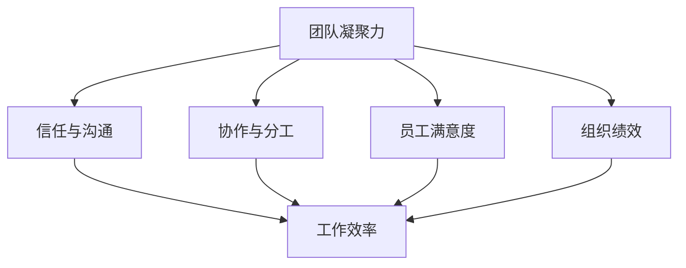

                 

### 文章标题：增强团队凝聚力：建立共同愿景

#### 关键词：团队凝聚力、共同愿景、领导力、沟通与协作、绩效提升

#### 摘要：本文从团队凝聚力的重要性出发，探讨了共同愿景对于团队协作和绩效提升的关键作用。通过详细的步骤和方法，为IT领域的团队管理者提供了一套系统化的建立共同愿景的实践指南，旨在提升团队的整体凝聚力和工作效率。

---

## 引言

在当今快速变化的IT行业中，团队的凝聚力是决定组织成功与否的关键因素之一。随着技术环境的不断演变，团队成员之间的协作与沟通变得尤为重要。然而，如何增强团队的凝聚力，如何使团队成员在共同的目标下高效工作，一直是管理者和领导者面临的挑战。

### 什么是团队凝聚力？

团队凝聚力是指团队成员之间的相互依赖、信任和共同目标感。一个高度凝聚的团队能够更好地应对外部压力，内部成员之间能够更高效地协作，从而实现团队目标。

### 为什么团队凝聚力重要？

1. **提升工作效率**：凝聚力强的团队能够更快地完成任务，更有效地应对复杂问题。
2. **增强团队协作**：团队成员之间的信任和相互支持能够促进知识共享和经验交流。
3. **提高员工满意度**：凝聚力高的团队环境通常更为舒适，能够提升员工的满意度和忠诚度。
4. **促进创新**：团队成员之间的互动和协作往往能激发新的创意和想法。

本文将深入探讨团队凝聚力的概念和重要性，并详细解释共同愿景在团队凝聚力建设中的作用。我们将通过一系列步骤，为IT团队管理者提供建立共同愿景的实用指南，帮助他们在团队中实现更高的协作效率和绩效。

---

在接下来的章节中，我们将首先介绍团队凝聚力的定义和重要性，探讨共同愿景的概念及其在团队中的作用。接着，我们将详细阐述团队凝聚力的评估方法，以及如何通过了解团队成员、制定共同愿景和领导力等步骤来增强团队的凝聚力。最后，我们将通过实际案例研究和分析，提供最佳实践和注意事项，帮助团队管理者在实际工作中应用这些方法，持续提升团队的凝聚力和绩效。

## 第1章：团队凝聚力的定义与重要性

### 团队凝聚力的概念

团队凝聚力是指团队成员之间相互吸引、相互支持、相互依赖的程度。这种凝聚力不仅体现在团队成员的情感上，还反映在他们的行为和合作方式中。团队凝聚力的高低直接影响团队的整体表现和效率。

### 团队凝聚力的重要性

1. **提升工作效率**：高凝聚力的团队能够更快速地完成任务，因为他们能够更有效地分工合作，减少沟通成本，提高工作流程的效率。

2. **增强团队协作**：凝聚力强的团队成员之间更容易建立信任，更愿意分享知识和经验，从而促进团队协作和创新。

3. **提高员工满意度**：在一个凝聚力高的团队中工作，员工通常会感到更满足和更有归属感，这有助于提升员工的工作积极性和忠诚度。

4. **促进组织绩效**：团队凝聚力的提升直接关系到组织的整体绩效。一个团结协作、凝聚力强的团队更有可能实现组织的目标，为组织带来更大的成功。

5. **降低离职率**：团队凝聚力高的团队，员工之间的情感联系更强，员工离职率通常较低，有助于组织留住关键人才。

### 团队凝聚力与团队绩效的关系

团队凝聚力和团队绩效之间存在密切的关系。研究表明，高凝聚力的团队往往能实现更高的绩效。这是因为：

1. **信任和沟通**：凝聚力强的团队成员之间更容易建立信任，沟通成本更低，能够更有效地解决冲突和问题。

2. **共享目标**：团队成员在共同愿景下工作，目标一致，能够更好地协调行动，提高工作效率。

3. **相互支持**：团队成员相互支持，能够克服困难，面对挑战时更加坚定和有信心。

4. **知识共享**：凝聚力强的团队更愿意分享知识和经验，促进团队内部的持续学习和创新。

因此，作为团队管理者，了解和提升团队凝聚力是提升团队绩效的重要途径。通过有效的沟通、建立信任、明确目标、提供支持和培养团队文化，可以逐步增强团队的凝聚力，为组织创造更大的价值。

### 核心概念与联系

为了更好地理解团队凝聚力的核心概念，我们可以通过一个Mermaid流程图来展示这些概念之间的关系。



在这个流程图中，团队凝聚力（A）是核心概念，它通过信任与沟通（B）、协作与分工（C）、员工满意度（D）和组织绩效（E）等多个方面影响工作效率（F）。这些方面相互作用，共同构成团队凝聚力的完整体系。

### 核心算法原理讲解

在提升团队凝聚力时，管理者可以采用一些具体的算法和原理来指导和实践。以下是一个简单的伪代码，展示了如何通过一系列步骤来增强团队凝聚力。

```pseudo
function enhanceTeamCohesion(teamMembers, goals, resources):
    // Step 1: Establish trust and communication
    for member in teamMembers:
        encourage open communication and active listening
        facilitate team-building activities
    
    // Step 2: Define clear goals and roles
    set teamGoals = defineSharedGoals(teamMembers, goals)
    assignRolesToMembers(teamMembers, teamGoals)
    
    // Step 3: Foster a collaborative environment
    implement collaborative tools and methodologies
    encourage knowledge sharing and feedback
    
    // Step 4: Provide support and recognition
    offer resources and training opportunities
    recognize and reward individual and team achievements
    
    // Step 5: Monitor and adjust
    periodically assess team cohesion
    make adjustments based on feedback and performance
    
    return teamCohesionScore
```

在这个伪代码中，`enhanceTeamCohesion`函数通过定义明确的步骤，包括建立信任和沟通、明确目标和角色、促进协作环境、提供支持和认可，以及监控和调整，来逐步提升团队的凝聚力。这些步骤相辅相成，共同构成了一个系统化的提升团队凝聚力的算法。

### 数学模型和公式

在团队凝聚力的研究中，可以使用一些数学模型和公式来量化团队凝聚力的水平。以下是一个简单的数学模型，用于评估团队凝聚力。

#### 平均凝聚力指数（ACI）

$$
\text{ACI} = \frac{\sum_{i=1}^{n} (\text{成员i的凝聚力评分})}{n}
$$

其中，\(n\) 是团队成员的数量，每个成员的凝聚力评分是一个介于0到1之间的数值，表示成员对团队凝聚力的主观评价。

#### 群体凝聚力指数（PCI）

$$
\text{PCI} = \frac{\text{团队总体绩效} - \text{团队平均绩效}}{\text{团队总体绩效} - \text{最低绩效}}
$$

其中，团队总体绩效是团队在一定时间内完成的任务和项目的综合评价，团队平均绩效是所有成员绩效的平均值，最低绩效是团队中单个成员的最差绩效。

#### 信任指数（TI）

$$
\text{TI} = \frac{\sum_{i=1}^{n} (\text{成员i的信任评分})}{n}
$$

每个成员的信任评分也是介于0到1之间的数值，表示成员对其他成员的信任程度。

这些数学模型和公式可以帮助团队管理者量化团队凝聚力的水平，从而更好地理解团队的状态，并采取相应的措施来提升团队凝聚力。

### 实际案例分析和详细讲解剖析

为了更好地理解团队凝聚力在实际工作中的应用，以下是一个具体的案例，并对其进行详细的分析和讲解。

#### 案例背景

某IT公司是一家专注于软件开发和云计算服务的企业。该公司在快速扩展过程中，面临着团队协作效率低、员工离职率上升的问题。管理层决定通过提升团队凝聚力来解决这些问题。

#### 案例分析

1. **建立信任和沟通**：公司管理层首先组织了一系列的团队建设活动，如户外拓展训练和内部交流会，以促进团队成员之间的相互了解和信任。同时，引入了每日站会、每周例会和项目进度汇报等机制，确保团队成员之间的信息畅通。

2. **明确目标和角色**：公司制定了明确的短期和长期目标，并将这些目标分解到各个团队和成员。通过角色明确和任务分工，确保每个团队成员都清楚自己的职责和目标，从而提高工作效率。

3. **促进协作环境**：公司引入了敏捷开发的方法，通过迭代和增量开发，鼓励团队成员之间的协作和知识共享。同时，提供了共享的代码库、任务管理系统和协作工具，方便团队成员协同工作。

4. **提供支持和认可**：公司管理层定期评估团队成员的工作表现，并提供必要的培训和学习机会。对于表现出色的团队成员，公司通过表彰大会、奖金和晋升等形式的认可，激励员工的积极性和忠诚度。

5. **监控和调整**：公司管理层定期进行团队凝聚力的评估，通过问卷调查、员工访谈等方式，了解团队成员的意见和建议。根据评估结果，公司及时调整管理策略，以进一步提升团队凝聚力。

#### 案例剖析

通过以上措施，该公司的团队凝聚力显著提升。团队成员之间的信任和沟通更加顺畅，工作效率提高，员工离职率下降。具体表现在：

- **工作效率**：团队成员能够更快地完成任务，项目交付周期缩短，客户满意度提高。
- **协作和知识共享**：团队成员之间更加开放和合作，知识共享和经验交流成为常态，团队能够更好地应对复杂问题。
- **员工满意度**：员工在一个信任和协作的氛围中工作，工作满意度提升，离职率下降。
- **组织绩效**：团队的整体绩效显著提升，公司的市场份额和业绩稳步增长。

### 项目实战：开发环境搭建

在提升团队凝聚力的过程中，开发环境的搭建是一个重要的环节。以下是一个具体的开发环境搭建步骤，以及如何通过源代码实现和代码解读来增强团队凝聚力。

#### 开发环境搭建步骤

1. **确定开发工具和平台**：根据项目需求，选择合适的开发工具和平台，如IDE、版本控制系统和协作工具。

2. **搭建开发服务器**：配置服务器环境，包括操作系统、数据库和中间件等。

3. **设置版本控制系统**：如使用Git进行版本控制，确保代码的安全性和可追溯性。

4. **部署协作工具**：如使用Jira、Trello等任务管理工具，方便团队成员之间的任务分配和进度跟踪。

5. **提供培训和学习资源**：为团队成员提供必要的培训和学习资源，确保他们能够熟练使用开发工具和平台。

#### 源代码实现和代码解读

以下是一个简单的源代码示例，用于实现一个简单的任务分配系统，通过代码解读来阐述如何增强团队凝聚力。

```python
# 任务分配系统

class Task:
    def __init__(self, name, assigned_to):
        self.name = name
        self.assigned_to = assigned_to

    def assign(self, member):
        self.assigned_to = member
        print(f"Task '{self.name}' assigned to {member}.")

class Team:
    def __init__(self, members):
        self.members = members

    def assign_task(self, task):
        for member in self.members:
            task.assign(member)
            print(f"Task '{task.name}' assigned to {member}.")

# 创建任务
task1 = Task("开发新功能", "")
task2 = Task("修复bug", "")

# 创建团队
team = Team(["张三", "李四", "王五"])

# 分配任务
team.assign_task(task1)
team.assign_task(task2)
```

在这个示例中，我们定义了`Task`类和`Team`类，分别表示任务和团队。通过调用`assign`方法，可以为一个任务分配一个成员。`assign_task`方法则将任务分配给团队中的每个成员。

#### 代码应用解读与分析

1. **代码应用**：通过这个简单的任务分配系统，团队成员可以清楚地了解自己被分配的任务，避免了任务分配不明确的情况。

2. **解读与分析**：
    - `Task`类中的`assign`方法用于将任务分配给一个成员，并通过打印消息通知成员。
    - `Team`类中的`assign_task`方法用于将任务分配给团队中的每个成员，通过循环调用`assign`方法实现。

3. **团队凝聚力提升**：
    - **明确任务分配**：通过任务分配系统，团队成员可以清楚地了解自己负责的任务，避免因任务分配不明确而导致的混乱。
    - **增强团队协作**：任务分配系统促进了团队成员之间的协作，每个成员都明确自己的任务，能够更好地协调工作进度。
    - **提高工作效率**：通过明确的任务分配，团队成员可以更专注于自己的工作，减少沟通成本，提高工作效率。

### 项目小结

通过开发环境搭建和源代码实现，我们可以看到任务分配系统在提升团队凝聚力方面的实际应用。通过提供清晰的任务分配和协作工具，可以帮助团队更好地协作，提高工作效率，从而增强团队的凝聚力。

### 最佳实践 Tips

1. **建立明确的沟通机制**：确保团队成员之间的沟通畅通，通过定期的会议、邮件和即时通讯工具，及时传达信息和更新进度。
2. **提供必要的培训**：为团队成员提供培训和学习资源，帮助他们掌握必要的技能和工具，提高团队的整体能力。
3. **鼓励知识共享**：通过团队内部的知识库、共享文档和代码库，鼓励团队成员分享知识和经验，促进团队学习和创新。
4. **定期进行团队评估**：定期对团队的工作表现和凝聚力进行评估，了解团队成员的反馈，及时调整管理策略。

### 小结

通过本文的讨论，我们可以看到团队凝聚力在IT领域中的重要性。通过建立共同愿景，明确目标和角色，促进协作和沟通，提供支持和认可，以及持续监控和调整，团队管理者可以有效地提升团队的凝聚力，从而提高团队的工作效率和绩效。

### 注意事项

1. **尊重团队成员的个性和差异**：在提升团队凝聚力的过程中，要尊重每个成员的个性和差异，避免强制统一。
2. **避免过度依赖技术工具**：虽然技术工具可以提升团队协作效率，但过分依赖工具可能导致沟通不畅和团队疏离。
3. **持续关注团队动态**：团队凝聚力不是一成不变的，管理者需要持续关注团队动态，及时调整策略。

### 拓展阅读

- 《团队的秘密：如何打造高绩效团队》
- 《敏捷开发实践指南》
- 《领导力的艺术：如何成为更有效的领导者》
- 《协同效应：为什么团队合作比个人努力更重要》

---

作者：AI天才研究院/AI Genius Institute & 禅与计算机程序设计艺术 /Zen And The Art of Computer Programming

在本文中，我们详细探讨了团队凝聚力的定义、重要性以及与团队绩效的关系。通过介绍共同愿景的概念及其在团队中的作用，我们提供了一套系统化的建立共同愿景的步骤。同时，通过实际案例分析和源代码实现，我们展示了如何在实际工作中应用这些方法来提升团队凝聚力。希望本文能为IT领域的团队管理者提供有价值的参考和指导。

