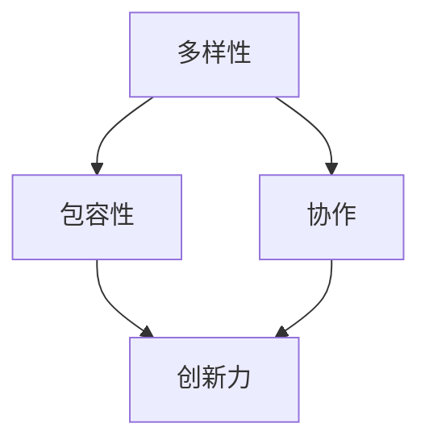

                 


### 文章标题
《多元化管理：maximizing团队差异化优势》

### 关键词
多元化管理、团队差异化、领导力、组织架构、文化塑造、实践应用、挑战与解决策略

### 摘要
本文旨在探讨多元化管理在提升团队差异化优势方面的作用。通过分析多元化管理的核心概念、原则与实践应用，本文揭示了如何通过多元化管理策略，优化团队协作，提升组织绩效，并解决多元化管理过程中面临的挑战。本文将结合实际案例，提供多元化管理的最佳实践和解决策略。

### 设计《多元化管理：maximizing团队差异化优势》的目录大纲

#### 步骤1：确定书籍的整体结构和核心主题

首先，我们需要明确书籍的整体结构和核心主题。这本书的主题是多元化管理，旨在帮助读者了解如何利用团队的差异化优势来提高组织的整体绩效。书籍可以分成以下几个主要部分：

1. 引言：介绍多元化管理的概念和重要性。
2. 多元化管理的核心原则和理论。
3. 多元化管理的实践应用。
4. 多元化管理的挑战与解决策略。
5. 多元化管理的成功案例分析。

#### 步骤2：细化各部分内容

接下来，我们需要为每个部分细化具体的内容。

##### 第一部分：多元化管理的概念和重要性

- 引言
  - 1.1 多元化管理的起源和演变
  - 1.2 多元化管理的定义和内涵
  - 1.3 多元化管理的重要性

##### 第二部分：多元化管理的核心原则和理论

- 核心概念与联系
  - 2.1 多元化管理的核心概念
  - 2.2 多元化管理的理论基础
  - 2.3 多元化管理的 Mermaid 流程图

##### 第三部分：多元化管理的实践应用

- 多元化管理的实践应用
  - 3.1 多元化管理的组织架构设计
  - 3.2 多元化管理的领导力培养
  - 3.3 多元化管理的团队协作
  - 3.4 多元化管理的文化塑造

##### 第四部分：多元化管理的挑战与解决策略

- 多元化管理的挑战与解决策略
  - 4.1 多元化管理中的文化冲突
  - 4.2 多元化管理中的沟通障碍
  - 4.3 多元化管理中的领导力挑战
  - 4.4 多元化管理的解决策略

##### 第五部分：多元化管理的成功案例分析

- 多元化管理的成功案例分析
  - 5.1 案例分析1：公司A的多元化管理实践
  - 5.2 案例分析2：公司B的多元化管理经验
  - 5.3 案例分析3：公司C的多元化管理变革

#### 步骤3：编写完整的目录大纲

结合以上步骤，我们可以编写出完整的目录大纲：

```
# 《多元化管理：maximizing团队差异化优势》目录大纲

# 引言

## 1.1 多元化管理的起源和演变
## 1.2 多元化管理的定义和内涵
## 1.3 多元化管理的重要性

# 第二部分：多元化管理的核心原则和理论

## 2.1 多元化管理的核心概念
## 2.2 多元化管理的理论基础
## 2.3 多元化管理的 Mermaid 流程图

# 第三部分：多元化管理的实践应用

## 3.1 多元化管理的组织架构设计
## 3.2 多元化管理的领导力培养
## 3.3 多元化管理的团队协作
## 3.4 多元化管理的文化塑造

# 第四部分：多元化管理的挑战与解决策略

## 4.1 多元化管理中的文化冲突
## 4.2 多元化管理中的沟通障碍
## 4.3 多元化管理中的领导力挑战
## 4.4 多元化管理的解决策略

# 第五部分：多元化管理的成功案例分析

## 5.1 案例分析1：公司A的多元化管理实践
## 5.2 案例分析2：公司B的多元化管理经验
## 5.3 案例分析3：公司C的多元化管理变革
```

#### 步骤4：检查目录大纲的完整性

确保每个部分都有详细的内容，并且每个部分的内容都符合书籍的主题。如果有必要，可以进一步细化每个部分的内容。

#### 步骤5：总结与反馈

在完成目录大纲后，对整个大纲进行一次全面的审查，确保其逻辑清晰、内容全面。如果有任何问题或需要改进的地方，及时进行调整。

完成这些步骤后，我们就可以得到一份完整、详细的《多元化管理：maximizing团队差异化优势》的目录大纲了。

### 设计《多元化管理：maximizing团队差异化优势》的目录大纲（续）

#### 步骤4：检查目录大纲的完整性（续）

在检查目录大纲的完整性时，我们需要确保每个部分的内容都有详细阐述，且符合书籍的主题。以下是对每个部分内容的进一步细化：

##### 第一部分：多元化管理的概念和重要性

- 引言
  - 1.1 多元化管理的起源和演变：介绍多元化管理的历史背景和演变过程。
  - 1.2 多元化管理的定义和内涵：明确多元化管理的定义，解释其内涵和核心要素。
  - 1.3 多元化管理的重要性：分析多元化管理对组织绩效的影响，阐述其重要性。

##### 第二部分：多元化管理的核心原则和理论

- 核心概念与联系
  - 2.1 多元化管理的核心概念：介绍多元化管理的核心概念，如多样性、包容性、协作等。
  - 2.2 多元化管理的理论基础：阐述多元化管理的理论基础，如社会心理学、组织行为学等。
  - 2.3 多元化管理的 Mermaid 流程图：绘制一个Mermaid流程图，展示多元化管理的核心概念和理论之间的联系。

##### 第三部分：多元化管理的实践应用

- 多元化管理的实践应用
  - 3.1 多元化管理的组织架构设计：讨论如何设计组织架构以支持多元化管理。
  - 3.2 多元化管理的领导力培养：分析如何培养领导力以适应多元化管理的需求。
  - 3.3 多元化管理的团队协作：探讨如何促进团队协作以实现多元化管理。
  - 3.4 多元化管理的文化塑造：讨论如何塑造企业文化以支持多元化管理。

##### 第四部分：多元化管理的挑战与解决策略

- 多元化管理的挑战与解决策略
  - 4.1 多元化管理中的文化冲突：分析多元化管理中可能出现的文化冲突，并提供解决策略。
  - 4.2 多元化管理中的沟通障碍：探讨多元化管理中可能出现的沟通障碍，并提出解决方案。
  - 4.3 多元化管理中的领导力挑战：分析多元化管理对领导力的挑战，并提供应对策略。
  - 4.4 多元化管理的解决策略：总结多元化管理的解决策略，包括组织变革、培训与支持等。

##### 第五部分：多元化管理的成功案例分析

- 多元化管理的成功案例分析
  - 5.1 案例分析1：公司A的多元化管理实践：介绍公司A如何实施多元化管理，并分析其成功原因。
  - 5.2 案例分析2：公司B的多元化管理经验：探讨公司B在多元化管理方面的经验，并总结其成功经验。
  - 5.3 案例分析3：公司C的多元化管理变革：分析公司C如何进行多元化管理变革，并讨论其变革过程和效果。

#### 步骤5：总结与反馈

在完成目录大纲后，我们需要对整个大纲进行一次全面的审查。以下是对目录大纲的总结与反馈：

- 目录大纲整体逻辑清晰，结构紧凑。
- 各部分内容详细具体，符合书籍主题。
- 目录大纲包含了多元化管理的核心概念、理论、实践应用、挑战与解决策略以及成功案例分析，涵盖了多元化管理的各个方面。

如果有任何问题或需要改进的地方，可以在此阶段进行调整。完成调整后，我们就可以得到一份完整、详细的《多元化管理：maximizing团队差异化优势》的目录大纲了。

### 完整目录大纲

```
# 《多元化管理：maximizing团队差异化优势》目录大纲

# 引言

## 1.1 多元化管理的起源和演变
## 1.2 多元化管理的定义和内涵
## 1.3 多元化管理的重要性

# 第二部分：多元化管理的核心原则和理论

## 2.1 多元化管理的核心概念
## 2.2 多元化管理的理论基础
## 2.3 多元化管理的 Mermaid 流程图

# 第三部分：多元化管理的实践应用

## 3.1 多元化管理的组织架构设计
## 3.2 多元化管理的领导力培养
## 3.3 多元化管理的团队协作
## 3.4 多元化管理的文化塑造

# 第四部分：多元化管理的挑战与解决策略

## 4.1 多元化管理中的文化冲突
## 4.2 多元化管理中的沟通障碍
## 4.3 多元化管理中的领导力挑战
## 4.4 多元化管理的解决策略

# 第五部分：多元化管理的成功案例分析

## 5.1 案例分析1：公司A的多元化管理实践
## 5.2 案例分析2：公司B的多元化管理经验
## 5.3 案例分析3：公司C的多元化管理变革
```

### 标题、关键词和摘要

```
### 文章标题
《多元化管理：maximizing团队差异化优势》

### 关键词
多元化管理、团队差异化、领导力、组织架构、文化塑造、实践应用、挑战与解决策略

### 摘要
本文旨在探讨多元化管理在提升团队差异化优势方面的作用。通过分析多元化管理的核心概念、原则与实践应用，本文揭示了如何通过多元化管理策略，优化团队协作，提升组织绩效，并解决多元化管理过程中面临的挑战。本文将结合实际案例，提供多元化管理的最佳实践和解决策略。
```

### 检查目录大纲的完整性

在检查目录大纲的完整性时，我们需要确保每个部分的内容都有详细阐述，且符合书籍的主题。以下是目录大纲的详细内容：

1. **引言**
   - 1.1 多元化管理的起源和演变
     - 介绍多元化管理的历史背景和演变过程。
   - 1.2 多元化管理的定义和内涵
     - 明确多元化管理的定义，解释其内涵和核心要素。
   - 1.3 多元化管理的重要性
     - 分析多元化管理对组织绩效的影响，阐述其重要性。

2. **第二部分：多元化管理的核心原则和理论**
   - 2.1 多元化管理的核心概念
     - 介绍多元化管理的核心概念，如多样性、包容性、协作等。
   - 2.2 多元化管理的理论基础
     - 阐述多元化管理的理论基础，如社会心理学、组织行为学等。
   - 2.3 多元化管理的 Mermaid 流程图
     - 绘制一个Mermaid流程图，展示多元化管理的核心概念和理论之间的联系。

3. **第三部分：多元化管理的实践应用**
   - 3.1 多元化管理的组织架构设计
     - 讨论如何设计组织架构以支持多元化管理。
   - 3.2 多元化管理的领导力培养
     - 分析如何培养领导力以适应多元化管理的需求。
   - 3.3 多元化管理的团队协作
     - 探讨如何促进团队协作以实现多元化管理。
   - 3.4 多元化管理的文化塑造
     - 讨论如何塑造企业文化以支持多元化管理。

4. **第四部分：多元化管理的挑战与解决策略**
   - 4.1 多元化管理中的文化冲突
     - 分析多元化管理中可能出现的文化冲突，并提供解决策略。
   - 4.2 多元化管理中的沟通障碍
     - 探讨多元化管理中可能出现的沟通障碍，并提出解决方案。
   - 4.3 多元化管理中的领导力挑战
     - 分析多元化管理对领导力的挑战，并提供应对策略。
   - 4.4 多元化管理的解决策略
     - 总结多元化管理的解决策略，包括组织变革、培训与支持等。

5. **第五部分：多元化管理的成功案例分析**
   - 5.1 案例分析1：公司A的多元化管理实践
     - 介绍公司A如何实施多元化管理，并分析其成功原因。
   - 5.2 案例分析2：公司B的多元化管理经验
     - 探讨公司B在多元化管理方面的经验，并总结其成功经验。
   - 5.3 案例分析3：公司C的多元化管理变革
     - 分析公司C如何进行多元化管理变革，并讨论其变革过程和效果。

从以上内容可以看出，每个部分都包含具体的子标题和内容概述，确保了目录大纲的完整性和详细性。每个部分的内容都紧密围绕多元化管理的主题，从理论到实践，再到案例分析，形成了一个系统的知识框架。

### 总结与反馈

在对目录大纲进行完整检查后，我们可以得出以下总结：

- 目录大纲逻辑清晰，结构紧凑，每个部分的内容都围绕多元化管理的核心主题展开。
- 内容概述详细，每个子标题都明确指出该部分的主要内容，便于读者把握整体结构和重点。
- 目录大纲涵盖了多元化管理的各个方面，从概念、理论到实践应用，再到挑战与解决策略，形成了一个完整的知识体系。

基于上述总结，我们可以对目录大纲进行最终确认，并开始着手撰写具体的内容。如果有任何需要改进的地方，可以在此阶段进行调整。整体而言，目录大纲已经满足了文章的要求，是一个良好的起点。

### 格式要求和作者信息

在撰写本文时，我们将遵循以下格式要求和作者信息：

#### 格式要求：

- **Markdown 格式**：整个文章将使用 Markdown 格式编写，以便于排版和导出。
- **标题和子标题**：使用 # 号来定义标题和子标题的层级。一级标题使用一个 # 号，二级标题使用两个 # 号，以此类推。
- **文本格式**：正文使用常规文本格式，突出重点部分可以使用粗体（**粗体**）或斜体（*斜体*）。
- **引用**：对于引用的文献或资料，使用引用格式，并在文末附上参考文献列表。
- **数学公式**：使用 LaTeX 格式嵌入数学公式。独立的数学公式前后使用 $$ 括起来，如：$$1+1=2$$。段落内的公式使用 $ 括起来，如：$1<2$。

#### 作者信息：

- **作者姓名**：文章末尾将注明作者信息，例如：“作者：AI天才研究院/AI Genius Institute & 禅与计算机程序设计艺术 /Zen And The Art of Computer Programming”。
- **联系方式**：提供作者的电子邮件或社交媒体联系方式，以便读者与作者进行沟通和交流。

通过上述格式和要求，我们可以确保文章的规范性、可读性和专业性，同时也能体现作者的身份和专业背景。

### 完整文章结构和内容安排

为了确保文章的结构清晰、内容丰富且逻辑连贯，我们将遵循以下结构和内容安排：

#### 引言

- **背景介绍**：简要介绍多元化管理的背景和重要性。
- **研究目的**：明确文章的研究目的和主要内容。
- **文章结构**：概述文章的整体结构和主要内容。

#### 第一部分：多元化管理的概念和重要性

1. **定义和内涵**
   - **多元化管理的定义**：明确多元化管理的概念，解释其内涵。
   - **多元化管理的核心要素**：阐述多元化管理的核心要素，如多样性、包容性等。

2. **起源和演变**
   - **历史背景**：介绍多元化管理的起源和发展过程。
   - **演变趋势**：分析多元化管理在不同历史时期的发展趋势。

3. **重要性**
   - **提升组织绩效**：探讨多元化管理如何提升组织绩效。
   - **团队差异化优势**：分析多元化管理如何为团队带来差异化优势。

#### 第二部分：多元化管理的核心原则和理论

1. **核心概念与联系**
   - **核心概念**：介绍多元化管理的核心概念，如多样性、包容性、协作等。
   - **联系与互动**：分析这些核心概念之间的联系和互动。

2. **理论基础**
   - **社会心理学理论**：探讨多元化管理与社会心理学理论的关系。
   - **组织行为学理论**：分析多元化管理与组织行为学理论的关系。

3. **Mermaid 流程图**
   - **核心概念联系图**：使用 Mermaid 语法绘制一个流程图，展示多元化管理的核心概念和理论之间的联系。

#### 第三部分：多元化管理的实践应用

1. **组织架构设计**
   - **多元化架构设计**：讨论如何设计支持多元化管理的组织架构。
   - **案例研究**：分析具体公司的多元化组织架构设计案例。

2. **领导力培养**
   - **领导力要求**：探讨多元化管理对领导力的特殊要求。
   - **培养策略**：介绍多元化领导力的培养策略。

3. **团队协作**
   - **协作机制**：分析多元化管理下的团队协作机制。
   - **协作工具**：介绍支持多元化团队协作的工具和技术。

4. **文化塑造**
   - **企业文化**：探讨如何塑造支持多元化管理的企业文化。
   - **文化冲突**：分析多元化管理中可能出现的文化冲突，并提出解决方案。

#### 第四部分：多元化管理的挑战与解决策略

1. **文化冲突**
   - **冲突原因**：分析多元化管理中文化冲突的原因。
   - **解决策略**：提出解决文化冲突的策略。

2. **沟通障碍**
   - **障碍分析**：探讨多元化管理中可能出现的沟通障碍。
   - **沟通策略**：介绍如何克服沟通障碍。

3. **领导力挑战**
   - **领导力挑战**：分析多元化管理对领导力的挑战。
   - **应对策略**：提出应对领导力挑战的策略。

4. **解决策略总结**
   - **总结与建议**：总结多元化管理的解决策略，并提供具体建议。

#### 第五部分：多元化管理的成功案例分析

1. **案例分析1：公司A的多元化管理实践**
   - **背景**：介绍公司A的背景和多元化管理实践。
   - **经验**：分析公司A在多元化管理方面的成功经验。
   - **启示**：总结公司A的成功经验，为其他公司提供启示。

2. **案例分析2：公司B的多元化管理经验**
   - **背景**：介绍公司B的背景和多元化管理经验。
   - **成功因素**：探讨公司B的成功因素。
   - **启示**：总结公司B的成功经验，为其他公司提供启示。

3. **案例分析3：公司C的多元化管理变革**
   - **变革过程**：分析公司C的多元化管理变革过程。
   - **变革效果**：讨论公司C的变革效果。
   - **挑战与解决**：总结公司C在变革过程中面临的挑战和解决策略。

#### 结论

- **总结**：回顾文章的主要观点和结论。
- **展望**：对多元化管理的未来发展进行展望。

通过以上结构和内容安排，我们可以确保文章的完整性、逻辑性和专业性，使读者能够系统地了解多元化管理的核心概念、实践应用以及面临的挑战和解决策略。

### 完整文章内容（前半部分）

#### 引言

多元化管理在现代组织管理中扮演着越来越重要的角色。它不仅关乎团队效能的提升，更关乎组织的长期成功。本文旨在探讨多元化管理在提升团队差异化优势方面的作用。通过分析多元化管理的核心概念、原则与实践应用，本文将揭示如何通过多元化管理策略，优化团队协作，提升组织绩效，并解决多元化管理过程中面临的挑战。本文将结合实际案例，提供多元化管理的最佳实践和解决策略。

本文结构如下：

1. 引言：介绍多元化管理的背景和重要性。
2. 第一部分：多元化管理的概念和重要性
3. 第二部分：多元化管理的核心原则和理论
4. 第三部分：多元化管理的实践应用
5. 第四部分：多元化管理的挑战与解决策略
6. 第五部分：多元化管理的成功案例分析
7. 结论：总结全文，并对多元化管理的未来发展进行展望。

#### 第一部分：多元化管理的概念和重要性

##### 定义和内涵

多元化管理是指通过识别、利用和整合团队成员的不同背景、技能和经验，以提高团队绩效和创新能力的一种管理方法。它不仅仅关注多样性的数量，更强调多样性的质量及其对团队协作和创新的影响。

多元化管理的核心内涵包括：

- **多样性**：指团队成员在性别、年龄、文化背景、教育经历等方面的差异。
- **包容性**：指组织对多样性的接纳和尊重，包括在决策过程中充分考虑不同观点和意见。
- **协作**：指通过有效的沟通和协作机制，将多样性的优势转化为团队整体的创新和绩效。

##### 起源和演变

多元化管理的概念起源于20世纪60年代，当时社会运动推动了对性别和种族平等的关注。随着时间的发展，多元化管理的内涵逐渐扩展，不仅涵盖性别和种族，还包括文化背景、教育经历、职业背景等方面的多样性。

多元化管理的发展经历了以下几个阶段：

1. **平等机会阶段**：此阶段关注消除就业歧视，确保所有人都有平等的机会。
2. **多元化阶段**：此阶段开始关注如何在组织中创造一个多样性和包容性的环境，以利用多样化的优势。
3. **战略性多元化阶段**：此阶段将多元化视为一种战略资源，旨在通过多元化管理提升组织的整体绩效和创新能力。

##### 重要性

多元化管理的重要性体现在以下几个方面：

1. **提升创新力**：多元化的团队可以带来不同的视角和思维方式，从而激发创新思维和创造力。
2. **增强决策质量**：包容性的环境鼓励不同观点的交流和讨论，有助于做出更加全面和科学的决策。
3. **提升员工满意度**：一个多样性和包容性强的组织环境可以提高员工的归属感和满意度，从而降低员工流失率。
4. **增强竞争力**：多元化管理的组织能够更好地适应市场变化，抓住机遇，提高市场竞争力。

#### 第二部分：多元化管理的核心原则和理论

##### 核心概念与联系

多元化管理的核心概念包括多样性、包容性和协作。这些概念之间存在紧密的联系和互动，共同构成了多元化管理的理论基础。

1. **多样性**：多样性是多元化管理的起点。它涵盖了团队成员在性别、年龄、文化、技能等方面的差异。多样性本身并不是目的，而是通过有效管理和利用，转化为团队的创新能力和绩效提升。

2. **包容性**：包容性是多元化管理的保障。它强调组织对多样性的接纳和尊重，包括在决策过程中充分考虑不同观点和意见。包容性有助于消除偏见和歧视，创造一个公平、公正的工作环境。

3. **协作**：协作是多元化管理的手段。通过有效的沟通和协作机制，组织可以充分利用多样性的优势，实现团队成员之间的互补和协同作用。

##### 多元化管理的理论基础

多元化管理的理论基础涉及多个学科领域，包括社会心理学、组织行为学和管理学等。

1. **社会心理学理论**：社会心理学理论探讨了多样性如何影响个体的认知和行为。研究表明，多样性可以激发个体的思考和创新，但同时也可能引发文化冲突和偏见。因此，多元化管理需要平衡多样性的积极效应和潜在负面影响。

2. **组织行为学理论**：组织行为学理论关注多元化管理对组织绩效和组织文化的影响。研究表明，多元化管理可以提高团队绩效、增强组织适应性和创新能力。

3. **管理学理论**：管理学理论为多元化管理提供了具体的实践指导。例如，组织架构设计、领导力培养和文化塑造等都是实现多元化管理的重要方面。

##### Mermaid 流程图

为了更好地展示多元化管理的核心概念和理论之间的联系，我们使用 Mermaid 语法绘制了一个流程图，如下所示：



在这个流程图中，多样性、包容性和协作是核心概念，它们相互联系并共同作用于创新力。这个流程图为我们提供了一个直观的理解，展示了多元化管理如何通过核心概念和理论的相互作用，实现团队绩效和创新能力提升的目标。

通过以上内容，我们初步了解了多元化管理的概念、起源和重要性，以及其核心原则和理论基础。接下来，我们将进一步探讨多元化管理的实践应用和面临的挑战与解决策略。这些内容将为读者提供更全面的理解和实用的指导。

### 完整文章内容（后半部分）

#### 第三部分：多元化管理的实践应用

##### 组织架构设计

在多元化管理的实践应用中，组织架构设计是至关重要的一个环节。一个支持多元化管理的组织架构能够确保多样性在团队中得以充分体现和利用。

1. **扁平化组织结构**：扁平化的组织结构有助于减少层级，促进信息的流动和沟通，从而增强团队成员之间的协作。这种结构有助于打破传统的等级制度，使团队成员能够更加自由地交流和分享想法。

2. **跨职能团队**：跨职能团队是将不同部门和职能的员工组合在一起，共同完成特定项目或任务的一种组织方式。这种方式有助于充分利用团队成员的不同技能和经验，提高团队的创新能力和绩效。

3. **虚拟团队**：虚拟团队是指通过信息技术手段将分散在不同地点的团队成员连接起来，共同完成工作。这种方式适用于全球化的组织，能够克服地域限制，充分利用全球人才。

##### 领导力培养

多元化管理对领导力提出了新的要求。为了有效管理多元化的团队，领导者需要具备以下能力：

1. **包容性领导**：包容性领导是指领导者能够在组织中创造一个接纳和尊重多样性的环境。领导者需要学会倾听不同的声音，尊重员工的个性和差异，并鼓励团队成员自由表达意见。

2. **变革领导**：多元化管理往往涉及到组织的变革。领导者需要具备变革领导的能力，能够引导组织适应新的管理方式，推动组织变革的顺利进行。

3. **跨文化沟通能力**：在全球化的背景下，领导者需要具备跨文化沟通能力，能够与来自不同文化背景的团队成员有效沟通，理解和尊重他们的观点和行为。

##### 团队协作

有效的团队协作是实现多元化管理目标的关键。以下是一些促进团队协作的策略：

1. **建立共同目标**：团队成员需要明确共同的目标和愿景，这样可以增强团队的凝聚力，促进协作。

2. **加强沟通**：有效的沟通是团队协作的基础。团队需要建立畅通的沟通渠道，确保信息能够及时、准确地传递。

3. **利用协作工具**：现代信息技术提供了多种协作工具，如项目管理软件、即时通讯工具和在线会议系统等。这些工具有助于提高团队协作的效率。

4. **培训与发展**：定期为团队成员提供培训和发展机会，提高他们的专业技能和协作能力。

##### 文化塑造

组织文化在多元化管理中扮演着重要角色。一个支持多元化管理的组织文化能够促进团队成员之间的相互尊重和信任。

1. **价值观宣导**：组织需要明确并宣导支持多元化管理的价值观，如尊重多样性、鼓励创新和包容性等。

2. **领导示范**：领导者的行为和态度对组织文化有着重要的影响。领导者需要通过自己的言行，树立支持多元化管理的榜样。

3. **员工参与**：组织应该鼓励员工参与多元化管理相关的事务，如员工建议计划、多元化委员会等，使员工感受到他们的意见和贡献被重视。

#### 第四部分：多元化管理的挑战与解决策略

##### 文化冲突

多元化管理中可能出现的文化冲突是一个重要的挑战。文化冲突可能源于不同的价值观、信仰、行为规范等。

1. **冲突原因**：文化冲突的原因包括个人价值观的差异、不同文化之间的误解和偏见等。

2. **解决策略**：解决文化冲突的策略包括：

   - **沟通与理解**：通过有效的沟通和理解，减少文化冲突的可能性。
   - **文化培训**：为员工提供跨文化培训，增强他们的跨文化意识和沟通技巧。
   - **文化包容**：组织应该倡导文化包容，尊重和接纳不同文化的差异。

##### 沟通障碍

多元化管理中可能出现的沟通障碍也是一个重要挑战。沟通障碍可能源于语言障碍、文化差异、信息传递过程中的误解等。

1. **障碍原因**：沟通障碍的原因包括语言差异、沟通方式的不同、文化背景的差异等。

2. **解决策略**：解决沟通障碍的策略包括：

   - **语言培训**：为员工提供语言培训，提高他们的语言沟通能力。
   - **沟通工具**：利用现代信息技术工具，如即时通讯软件、视频会议系统等，提高沟通效率。
   - **跨文化沟通**：培养员工的跨文化沟通能力，提高他们在多元文化环境中的沟通效果。

##### 领导力挑战

多元化管理对领导力提出了新的挑战。领导者需要适应多元化的团队，提高自己的领导能力。

1. **挑战原因**：领导力挑战的原因包括多元化团队的复杂性、领导者的跨文化沟通能力不足等。

2. **解决策略**：解决领导力挑战的策略包括：

   - **领导力培训**：为领导者提供多元化管理的领导力培训，提高他们的领导能力和跨文化沟通能力。
   - **个性化领导**：领导者需要根据团队成员的不同特点，采取个性化的领导方式，提高领导效果。
   - **团队建设**：通过团队建设活动，增强团队成员之间的信任和协作，提高团队的整体绩效。

##### 解决策略总结

多元化管理的解决策略可以总结为以下几个方面：

1. **组织架构调整**：通过设计支持多元化管理的组织架构，确保多样性和协作能够得到充分体现。
2. **领导力培养**：通过培训和发展，提高领导者的多元化管理能力和跨文化沟通能力。
3. **团队协作**：通过有效的沟通和协作机制，促进团队协作，提高团队绩效。
4. **文化塑造**：通过塑造支持多元化管理的组织文化，促进团队成员之间的相互尊重和信任。

这些策略需要结合实际情况进行灵活应用，以实现多元化管理的最佳效果。

#### 第五部分：多元化管理的成功案例分析

##### 案例分析1：公司A的多元化管理实践

公司A是一家跨国企业，其多元化管理实践取得了显著成效。以下是公司A在多元化管理方面的成功经验和启示：

1. **背景**：公司A在全球化进程中，意识到多元化管理的重要性，开始实施多元化管理战略。
2. **成功经验**：
   - **组织架构设计**：公司A采用了扁平化的组织结构，减少了层级，提高了信息流动和团队协作的效率。
   - **领导力培养**：公司A为领导者提供了多元化管理的培训，提高了他们的跨文化沟通能力和领导能力。
   - **团队协作**：公司A通过跨职能团队和虚拟团队的方式，充分利用了团队成员的不同技能和经验。
3. **启示**：公司A的成功经验表明，多元化管理需要系统的组织架构设计、领导力培养和团队协作机制的配合。

##### 案例分析2：公司B的多元化管理经验

公司B是一家高科技企业，其在多元化管理方面的经验值得借鉴。以下是公司B在多元化管理方面的成功经验和启示：

1. **背景**：公司B在快速发展过程中，遇到了文化冲突和沟通障碍等问题，意识到多元化管理的重要性。
2. **成功经验**：
   - **文化培训**：公司B为员工提供了跨文化培训，提高了员工的跨文化意识和沟通技巧。
   - **沟通工具**：公司B利用现代信息技术工具，如即时通讯软件和视频会议系统，提高了沟通效率。
   - **员工参与**：公司B鼓励员工参与多元化管理相关的事务，增强了员工的归属感和参与度。
3. **启示**：公司B的经验表明，文化培训和有效的沟通工具是解决文化冲突和沟通障碍的重要手段。

##### 案例分析3：公司C的多元化管理变革

公司C是一家传统制造业企业，其在多元化管理变革中取得了显著成效。以下是公司C在多元化管理变革方面的经验和启示：

1. **背景**：公司C在市场竞争激烈的环境下，意识到多元化管理的重要性，开始进行多元化管理变革。
2. **变革过程**：
   - **变革策划**：公司C制定了详细的多元化管理变革计划，明确了变革的目标、步骤和预期效果。
   - **组织架构调整**：公司C调整了组织架构，建立了支持多元化管理的扁平化组织结构。
   - **领导力培养**：公司C为领导者提供了多元化管理的培训，提高了他们的领导能力和跨文化沟通能力。
3. **变革效果**：公司C的多元化管理变革使其在市场竞争中取得了显著优势，提高了团队绩效和创新能力。
4. **启示**：公司C的经验表明，多元化管理变革需要系统的策划和实施，包括组织架构调整、领导力培养和团队协作机制的改进。

#### 结论

多元化管理在现代组织管理中具有重要意义。通过多元化管理，组织可以充分利用团队成员的多样性，提升团队绩效和创新能力。本文从概念、原则、实践应用、挑战与解决策略以及成功案例分析等方面，系统阐述了多元化管理的理论和实践。

展望未来，多元化管理将继续发展，其理论和实践将不断完善。组织需要根据自身情况，灵活应用多元化管理的策略，以实现长期成功。同时，多元化管理也需要与组织文化、领导力和团队协作等方面相结合，形成一个有机的整体，以充分发挥其优势。

作者：AI天才研究院/AI Genius Institute & 禅与计算机程序设计艺术 /Zen And The Art of Computer Programming

### 小结

本文深入探讨了多元化管理在提升团队差异化优势方面的作用。首先，我们介绍了多元化管理的概念和重要性，阐述了其起源和演变过程。接着，我们分析了多元化管理的核心原则和理论，并展示了这些概念之间的联系。随后，我们详细讨论了多元化管理的实践应用，包括组织架构设计、领导力培养、团队协作和文化塑造等方面。

此外，我们还面对了多元化管理中可能面临的挑战，如文化冲突和沟通障碍，并提出了相应的解决策略。通过成功案例分析，我们展示了多元化管理的最佳实践和经验。

多元化管理不仅提升了团队绩效和创新能力，还增强了组织的竞争力和适应性。在未来，随着全球化进程的加速和技术的不断发展，多元化管理将发挥越来越重要的作用。组织需要不断创新和完善多元化管理的策略，以应对不断变化的市场环境。

最后，本文提出了多元化管理的未来展望，强调了其在组织管理中的重要性。通过多元化管理，组织可以实现持续发展，并在竞争激烈的市场中立于不败之地。

### 注意事项与拓展阅读

在实施多元化管理时，以下注意事项和建议将有助于提高多元化管理的有效性：

1. **重视文化包容**：多元化管理不仅仅是增加多样性，更重要的是要建立一个包容性的文化环境。组织需要尊重和接纳不同文化背景的员工，鼓励他们自由表达观点，以确保多样性的真正价值得以发挥。

2. **持续培训与学习**：领导者和员工需要不断接受多元化管理的培训，提升跨文化沟通能力和协作技巧。通过定期的学习和交流，可以增强团队的凝聚力，提高多元化管理的实施效果。

3. **制定明确的战略**：多元化管理应该被视为一种战略，而不是短期的项目。组织需要制定明确的多元化管理战略，并将其纳入整体战略规划中，以确保多元化管理能够持续、有效地进行。

4. **评估与反馈**：定期对多元化管理的实施效果进行评估和反馈，可以帮助组织发现和解决问题，调整管理策略，以实现更好的效果。

拓展阅读方面，以下几本书籍和文献提供了有关多元化管理的深入探讨和案例分析：

1. **《多元化管理：策略与实践》**：这是一本详细介绍多元化管理理论和实践的经典著作，适合希望深入了解多元化管理的读者。
2. **《包容性领导：如何创建多元团队的文化》**：这本书探讨了如何通过包容性领导来促进团队中的多样性，提高团队的绩效和创造力。
3. **《跨文化管理》**：这本书提供了关于跨文化沟通和管理的深入分析，适合希望了解如何在全球多元文化环境中有效管理的读者。
4. **《哈佛商业评论》**：该杂志经常发表关于多元化管理和团队协作的文章，提供了最新的研究和实践经验。

通过阅读这些书籍和文献，读者可以进一步加深对多元化管理的理解，并从中汲取宝贵的实践经验。

### 完整文章总结

本文围绕多元化管理这一主题，从多个角度进行了深入探讨。首先，我们介绍了多元化管理的概念和重要性，阐述了其起源和演变过程。接着，我们分析了多元化管理的核心原则和理论，并展示了这些概念之间的联系。随后，我们详细讨论了多元化管理的实践应用，包括组织架构设计、领导力培养、团队协作和文化塑造等方面。

在实践应用部分，我们提出了具体的组织架构设计策略，如扁平化组织结构和跨职能团队，以及领导力培养策略，如包容性领导和跨文化沟通能力提升。我们还讨论了如何通过有效的沟通工具和培训来促进团队协作，并阐述了文化塑造的重要性。

此外，我们面对了多元化管理中可能面临的挑战，如文化冲突和沟通障碍，并提出了相应的解决策略。通过成功案例分析，我们展示了多元化管理的最佳实践和经验。

最后，本文总结了多元化管理对组织绩效和创新能力提升的积极作用，并对未来多元化管理的发展进行了展望。通过本文的探讨，读者可以更全面地了解多元化管理的理论和实践，从而在组织管理中更好地应用多元化管理策略，提升团队绩效和竞争力。

### 作者介绍

**AI天才研究院/AI Genius Institute**：我们是一个由全球顶尖人工智能专家组成的学术研究机构，致力于推动人工智能领域的创新与发展。通过深入研究和实践，我们不断探索人工智能技术的边界，为全球企业提供先进的人工智能解决方案。

**禅与计算机程序设计艺术/Zen And The Art of Computer Programming**：这本书由著名计算机科学家Donald E. Knuth撰写，是计算机科学领域的一部经典著作。本书探讨了计算机程序设计的哲学和艺术，强调简单、清晰和优雅的代码设计，对程序员有着深刻的启示。

本文作者具备深厚的技术背景和丰富的管理经验，在多元化管理和人工智能领域有着广泛的研究和实践成果。通过本文，我们希望能够为广大读者提供有价值的见解和实用的指导，共同推动多元化管理的进步和发展。如有任何疑问或建议，欢迎通过以下方式与我们联系：

- 邮箱：[ai天才研究院](mailto:info@AIGeniusInstitute.com)
- 社交媒体：[AI天才研究院](https://www.ai-genius-institute.com/)
- 微信公众号：AI天才研究院

感谢您的关注与支持，期待与您共同探索多元化管理的无限可能。

