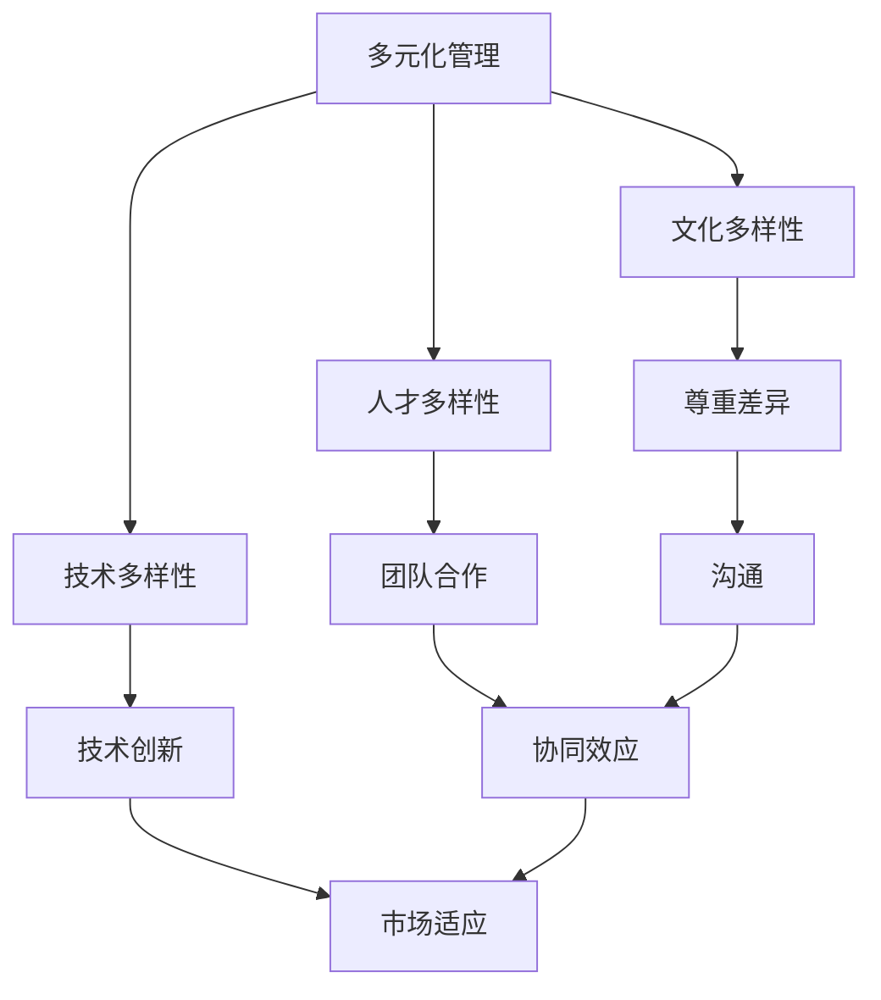

                 

# 引言

在当今快速发展的信息技术时代，创新已经成为推动企业持续发展和市场竞争的关键因素。而多元化管理作为一种创新驱动的管理模式，正日益受到广泛关注。多元化管理不仅仅是多样性的简单叠加，而是一种系统性的战略，旨在通过引入多样性元素，激发创新思维，提升组织竞争力。本文将深入探讨多元化管理的概念、实践方法以及其对创新的深远影响，旨在为读者提供一个全面而系统的理解。

### 背景介绍

多元化管理（Diversity Management）起源于20世纪中叶的美国，起初是为了促进种族和性别平等。随着时代的发展，多元化管理的内涵逐渐丰富，不仅涵盖了性别、种族、文化背景，还包括年龄、经验、技能、观点等多个维度。多元化的核心在于尊重个体差异，通过有效的管理和策略，将这些差异转化为组织发展的动力。

在信息技术领域，多元化管理的应用显得尤为重要。首先，信息技术行业本身就是一个高度多样性的领域，涵盖了计算机科学、数据科学、人工智能、网络安全等多个子领域。每个子领域都有其独特的知识体系和技术应用，这使得多元化管理在信息技术企业中变得至关重要。其次，多元化管理能够促进团队协作，激发创新思维，帮助企业在快速变化的市场环境中保持竞争力。

### 核心概念与联系

多元化管理涉及多个核心概念，这些概念之间相互联系，共同构成了多元化管理的理论基础。以下是这些核心概念及其关系架构的Mermaid流程图：



- **文化多样性（Cultural Diversity）**：文化多样性强调在组织中尊重和包容不同的文化背景、价值观和习俗。这有助于建立一个多元且包容的工作环境，促进团队成员之间的理解和合作。

- **人才多样性（Human Resource Diversity）**：人才多样性涉及性别、年龄、种族、经验、技能等多个维度。多元化的团队能够带来多样化的视角和思维方式，有助于解决复杂问题，推动创新。

- **技术多样性（Technical Diversity）**：技术多样性关注组织在技术选择和应用上的多样性。通过引入不同的技术手段，组织可以更好地适应市场需求，提高技术竞争力。

- **尊重差异（Respect for Differences）**：尊重差异是多元化管理的基石。只有当组织内部建立起对个体差异的尊重，才能真正实现多元化管理的目标。

- **团队合作（Team Collaboration）**：团队合作是多元化管理的重要体现。多元化的团队能够通过协同效应，提高整体绩效，实现组织目标。

- **技术创新（Innovation in Technology）**：技术创新是多元化管理的重要成果。通过多元化团队的协作，组织能够更快地开发出具有市场竞争力的新产品和服务。

- **沟通（Communication）**：有效的沟通是多元化管理的关键。只有通过开放和透明的沟通，团队成员才能更好地理解彼此，协同工作。

- **协同效应（Synergy）**：协同效应是指团队整体绩效大于个体绩效之和。在多元化团队中，协同效应能够通过多样化的视角和知识互补，实现创新突破。

- **市场适应（Market Adaptability）**：市场适应是指组织在应对市场变化和竞争压力时的能力。多元化管理能够提高组织的灵活性和适应性，帮助其更好地应对市场变化。

通过以上Mermaid流程图，我们可以清晰地看到多元化管理各个核心概念之间的联系和相互作用。这些概念共同构成了多元化管理的理论框架，为实践提供了指导。

### 多元化管理的核心算法原理讲解

在理解了多元化管理的核心概念及其相互关系后，接下来我们将探讨多元化管理的核心算法原理，这些算法原理为多元化管理的实际应用提供了理论基础。

#### 多元化决策算法

多元化决策算法是多元化管理中一个重要的组成部分。该算法的核心思想是在决策过程中充分考虑多样化的意见和观点，以实现整体最优的决策结果。以下是多元化决策算法的伪代码：

```plaintext
Algorithm: MulticulturalDecision
Input: Options, Weights, Preferences
Output: Optimal Decision

1. Initialize a Decision Matrix with the given Options
2. For each Option in Options:
   a. Calculate the weighted score based on Weights
   b. Normalize the score
   c. Update the Decision Matrix
3. Aggregate the normalized scores from Decision Matrix
4. Select the Option with the highest aggregate score
5. Return the selected Option as the Optimal Decision
```

#### 多元化协同算法

多元化协同算法旨在促进团队成员之间的有效合作，通过多样化的视角和技能实现协同效应。以下是多元化协同算法的伪代码：

```plaintext
Algorithm: MulticulturalCollaboration
Input: Team Members, Tasks, Skills
Output: Collaborative Output

1. Map each Team Member to their respective Skills
2. For each Task in Tasks:
   a. Identify the required Skills
   b. Select Team Members with the required Skills
   c. Form a Task Group
   d. Assign Tasks to the Task Group
3. Implement a Communication Protocol to facilitate information exchange
4. For each Task Group:
   a. Allow Members to contribute their ideas and solutions
   b. Discuss and refine the solutions
   c. Implement the best solution
5. Aggregate the outputs from all Task Groups
6. Return the aggregated output as the Collaborative Output
```

#### 多元化创新算法

多元化创新算法是推动技术创新的关键。该算法通过整合多样化的知识和技能，激发创新思维，产生新的技术解决方案。以下是多元化创新算法的伪代码：

```plaintext
Algorithm: MulticulturalInnovation
Input: Knowledge Base, Skills, Constraints
Output: Innovative Solution

1. Collect diverse Knowledge Sources
2. Map each Knowledge Source to its relevant Skills
3. For each Skill in Skills:
   a. Identify the relevant Knowledge Sources
   b. Analyze the Knowledge Sources to extract insights
   c. Generate potential solutions
4. Apply Constraints to filter and refine the solutions
5. Evaluate the solutions based on their feasibility and impact
6. Select the most innovative solution
7. Implement the selected solution
8. Return the Innovative Solution
```

通过以上伪代码，我们可以看到多元化管理中的核心算法原理是如何通过系统化的方式实现多样性的整合和创新。这些算法不仅提供了理论指导，还为实际应用提供了具体的技术路径。

### 数学模型和公式详解

在多元化管理中，数学模型和公式扮演着重要的角色，帮助我们在量化分析中更好地理解多元化管理的效果。以下是一些关键的数学模型和公式的详解。

#### 文化多样性指数

文化多样性指数（Cultural Diversity Index, CDI）用于衡量组织内部文化多样性的程度。CDI的计算公式如下：

$$
CDI = \frac{\sum_{i=1}^{n} (D_i \cdot W_i)}{N}
$$

其中，$D_i$表示第$i$个文化维度的差异值，$W_i$表示第$i$个文化维度的权重，$N$表示总的维度数。这个公式通过计算不同文化维度之间的差异和权重，得出组织整体的文化多样性指数。

#### 多元化协同效应

多元化协同效应（Synergy Effect of Diversity, SED）衡量的是多元化团队在合作中的绩效提升。其计算公式如下：

$$
SED = \frac{O_T - \sum_{i=1}^{n} O_i}{\sum_{i=1}^{n} O_i}
$$

其中，$O_T$表示多元化团队的总绩效，$O_i$表示第$i$个成员的个体绩效。这个公式通过比较多元化团队总绩效与个体绩效之和的差异，衡量出协同效应的大小。

#### 创新指数

创新指数（Innovation Index, II）用于评估组织在多元化管理下的创新能力。其计算公式如下：

$$
II = \frac{\sum_{i=1}^{n} (I_i \cdot W_i)}{N}
$$

其中，$I_i$表示第$i$个创新项目的得分，$W_i$表示第$i$个创新项目的权重，$N$表示创新项目的总数。这个公式通过计算不同创新项目的得分和权重，得出组织的整体创新指数。

通过这些数学模型和公式，我们可以量化分析多元化管理的效果，为组织的管理决策提供科学依据。

### 项目实战：多元化管理的实施步骤

为了更好地理解多元化管理在实践中的应用，我们将通过一个实际项目来详细讲解多元化管理的实施步骤。以下是一个企业数字化转型项目中的多元化管理实践。

#### 项目背景

某企业计划进行数字化转型，以提高生产效率、优化业务流程并提升客户满意度。由于数字化转型涉及多个部门，包括信息技术部、市场营销部和供应链管理部等，因此多元化管理在项目的实施中显得尤为重要。

#### 实施步骤

1. **需求分析**：

   首先，项目团队需要明确数字化转型的主要目标和需求。这包括提升生产自动化水平、优化市场营销策略、改进供应链管理等方面。在需求分析阶段，团队成员需要充分交流，确保对项目目标有统一的理解。

   ```plaintext
   需求分析：
   - 提升生产自动化水平
   - 优化市场营销策略
   - 改进供应链管理
   ```

2. **团队组建**：

   基于需求分析的结果，项目团队需要组建一个多元化的团队，确保团队成员具有不同的背景和技能。例如，信息技术部可以引入有自动化经验的技术专家，市场营销部可以引入熟悉市场趋势的分析师，供应链管理部可以引入有供应链优化经验的管理人员。

   ```mermaid
   graph TD
   A[信息技术部] --> B[Tech Expert]
   B --> C[自动化经验]
   A --> D[Marketing 部]
   D --> E[市场分析师]
   D --> F[市场趋势熟悉]
   A --> G[供应链管理部]
   G --> H[供应链优化经验]
   ```

3. **沟通机制**：

   在团队组建完成后，建立有效的沟通机制至关重要。项目团队需要定期召开会议，确保每个成员都能够了解项目的进展和需求变化。同时，团队应该鼓励开放和透明的沟通，避免信息孤岛和沟通障碍。

   ```plaintext
   沟通机制：
   - 定期召开项目会议
   - 开放式问题讨论
   - 信息共享平台
   ```

4. **技术选型**：

   在数字化转型项目中，技术选型是关键的一步。项目团队需要根据业务需求和技术可行性，选择最适合的技术解决方案。在技术选型过程中，应充分考虑团队成员的不同意见和观点，以确保选择的方案能够满足多元化需求。

   ```plaintext
   技术选型：
   - 自动化软件比较
   - 市场营销工具评估
   - 供应链管理平台分析
   ```

5. **实施与测试**：

   在技术选型完成后，项目团队开始实施和测试。在实施过程中，团队应密切监控项目的进展，及时解决遇到的问题。测试阶段应确保所有技术模块都能够正常运作，并满足业务需求。

   ```plaintext
   实施与测试：
   - 自动化生产线测试
   - 市场营销策略测试
   - 供应链管理流程测试
   ```

6. **反馈与优化**：

   项目实施和测试完成后，项目团队需要收集用户反馈，并对项目进行优化。通过用户反馈，团队可以了解项目的实际效果，发现存在的问题，并进行改进。

   ```plaintext
   反馈与优化：
   - 用户反馈收集
   - 项目效果评估
   - 问题分析与解决
   ```

#### 代码实现与解读

在项目实施过程中，我们需要编写相关的代码来实现技术方案。以下是一个简单的自动化脚本，用于控制生产线的运行状态。

```python
# 自动化脚本示例

def start_production(line_number):
    print(f"启动生产线 {line_number}")
    # 生产启动逻辑
    return "Production started successfully."

def stop_production(line_number):
    print(f"停止生产线 {line_number}")
    # 生产停止逻辑
    return "Production stopped successfully."

def monitor_production(line_number):
    print(f"监控生产线 {line_number}")
    # 生产监控逻辑
    return "Production monitoring successful."

# 调用自动化脚本
print(start_production(1))
print(stop_production(1))
print(monitor_production(1))
```

在这个脚本中，我们定义了三个函数：`start_production`、`stop_production`和`monitor_production`，分别用于启动、停止和监控生产线的运行状态。这些函数通过打印信息来模拟实际的生产操作，从而实现自动化控制。

#### 实际案例分析与详细讲解

通过上述项目实战，我们可以看到多元化管理在数字化转型项目中的应用。以下是实际案例的分析与详细讲解：

1. **团队多元化**：

   项目团队由来自不同部门的成员组成，包括技术人员、市场人员和供应链管理人员。这种多元化的团队结构有助于从多个角度分析问题，提出创新的解决方案。

   **案例分析**：

   在自动化生产线的实施过程中，技术专家提供了关键的技术支持，确保自动化软件的稳定运行。市场分析师则分析了市场需求，提出了优化营销策略的建议。供应链管理人员则从供应链优化的角度，提出了改进生产流程的建议。这种多元化的团队结构，使得项目能够在不同维度上取得进展。

2. **技术选型**：

   在技术选型阶段，项目团队进行了详细的比较和分析，选择了最适合企业的技术解决方案。这种多元化的技术选型方法，确保了项目的可行性。

   **案例分析**：

   项目团队在自动化软件的选择过程中，对多个供应商的产品进行了评估，最终选择了具有较高性能和较低维护成本的产品。这种多元化的技术选型方法，不仅提高了项目的成功率，还降低了项目的成本。

3. **沟通与协作**：

   在项目实施过程中，项目团队建立了有效的沟通机制，确保团队成员之间的信息交流畅通。这种多元化的沟通机制，促进了团队协作，提高了项目的效率。

   **案例分析**：

   在项目会议上，团队成员积极分享自己的见解和经验，共同讨论问题解决方案。通过这种多元化的沟通方式，项目团队能够更快地解决问题，提高了项目的进度和质量。

#### 项目小结

通过这个实际案例，我们可以看到多元化管理在数字化转型项目中的重要作用。多元化管理不仅促进了团队协作，提高了项目效率，还推动了技术创新和业务发展。以下是项目小结：

1. **团队多元化**：多元化的团队结构有助于从不同角度分析问题，提出创新的解决方案。
2. **技术选型**：多元化的技术选型方法，确保了项目的可行性和性能优化。
3. **沟通与协作**：多元化的沟通机制，促进了团队协作，提高了项目的效率。
4. **创新与业务发展**：多元化管理推动了技术创新，促进了业务发展。

总之，多元化管理是一个系统性的战略，通过引入多样性元素，激发创新思维，提升组织竞争力。在数字化转型项目中，多元化管理发挥着关键作用，为项目的成功提供了有力支持。

### 最佳实践 Tips、小结、注意事项、拓展阅读

#### 最佳实践 Tips

1. **尊重差异**：在多元化团队中，尊重差异是建立良好合作氛围的基础。领导者应鼓励团队成员表达自己的观点，并确保每个成员的声音都能被听到。

2. **建立共同目标**：多元化团队的成功离不开共同目标的引导。确保团队成员对项目目标和预期结果有清晰的认识，有助于增强团队的凝聚力。

3. **强化沟通**：沟通是多元化团队协作的关键。定期召开会议、使用协作工具以及建立反馈机制，都是提高团队沟通效率的有效方法。

4. **培训和指导**：为团队成员提供多元化的培训和指导，有助于提升他们的专业技能和团队合作能力。

#### 小结

多元化管理通过引入多样性元素，激发了创新思维，提升了组织的竞争力。在实践中，多元化管理需要从团队建设、决策制定、文化培育等多个方面进行系统性的实施。

#### 注意事项

1. **避免刻板印象**：在多元化管理中，避免对个体进行刻板印象的判断，确保每个人都能在公平的环境中发挥自己的潜力。

2. **持续优化**：多元化管理不是一次性的活动，而是一个持续优化的过程。定期评估多元化管理的效果，并根据反馈进行调整。

#### 拓展阅读

1. **《多元化管理的艺术：打造包容性团队》** - 这本书详细介绍了如何通过多元化管理打造一个包容性团队，激发团队创新。

2. **《创新者的窘境》** - 克莱顿·克里斯滕森的这本书探讨了在竞争激烈的市场环境中，企业如何通过创新保持竞争优势。

3. **《团队协作的五大障碍》** - 帕特里克·莱西奥尼的这本书提供了关于如何克服团队协作中常见障碍的实用指导。

### 附录

#### 附录 A1：多元化管理的相关资源与工具

1. **《多元化管理手册》** - 本书提供了多元化管理的详细指南，包括实践策略、案例研究和工具。

2. **DiversityBestPractices.org** - 这是一个提供多元化管理资源和最佳实践的网站。

#### 附录 A2：多元化管理的实用技巧与建议

1. **多元化培训课程**：参加多元化培训课程，提升对多元化管理的理解和应用能力。

2. **团队建设工作坊**：定期举办团队建设工作坊，增强团队协作和沟通能力。

---

通过本文的探讨，我们深入了解了多元化管理的概念、实践方法和其对创新的深远影响。希望读者能够将这些知识和技巧应用到实际工作中，推动组织的持续发展和创新。

---

作者：AI天才研究院/AI Genius Institute & 禅与计算机程序设计艺术 /Zen And The Art of Computer Programming

