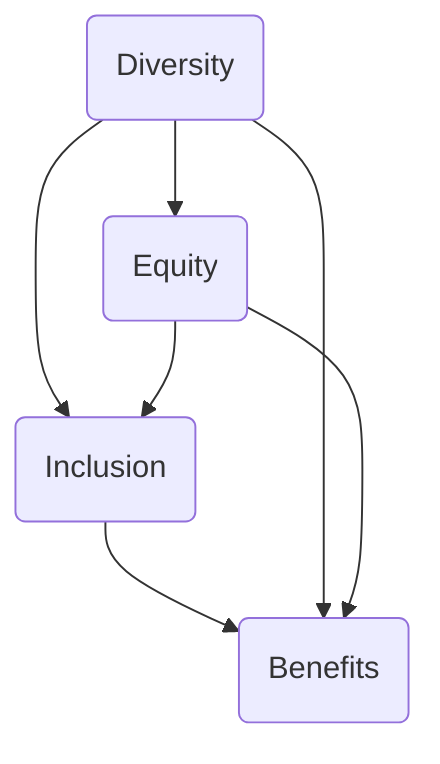
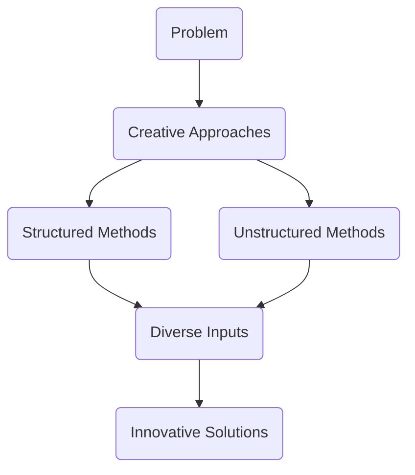
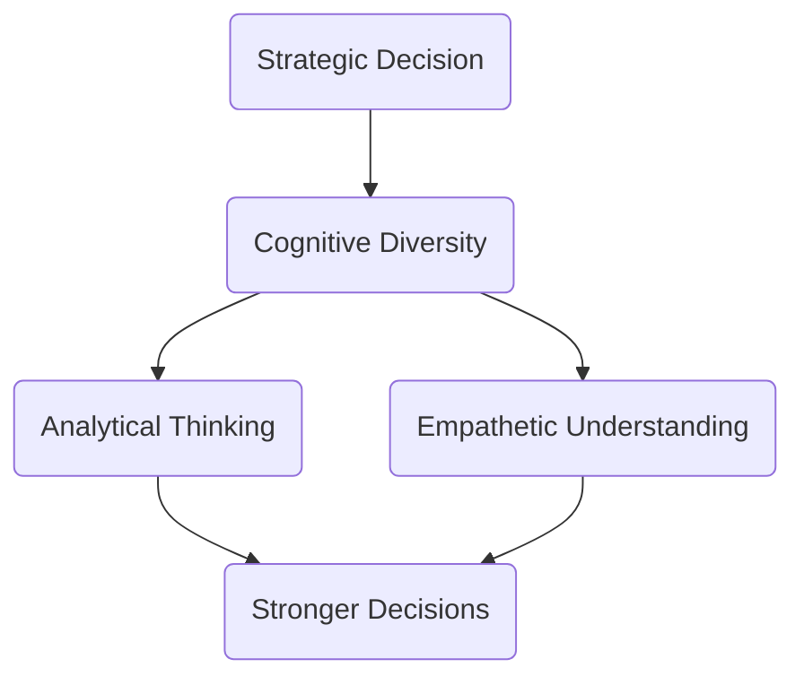
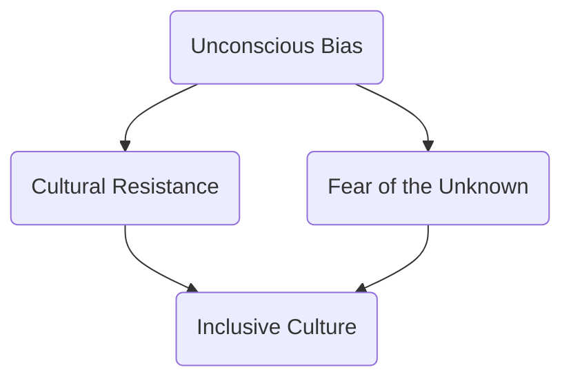
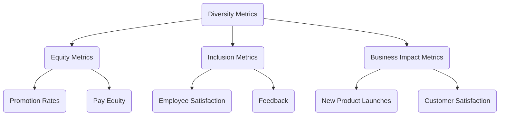

                 

### Introduction and Overview

**Chapter 1: The Importance of Diversity Leadership**

Diversity leadership is more than just a buzzword; it's a transformative approach that can elevate organizations to new heights. At its core, diversity leadership focuses on creating an inclusive environment where individuals from diverse backgrounds—cultural, ethnic, gender, age, and more—can thrive. This chapter will delve into the essential aspects of diversity leadership, providing a comprehensive overview that sets the stage for deeper exploration.

#### Section 1.1: Defining Diversity in Leadership

To truly understand the significance of diversity leadership, we must first define what diversity entails. Diversity encompasses a wide range of characteristics, including race, ethnicity, gender, age, sexual orientation, physical abilities, and more. In a leadership context, diversity is about recognizing and valuing the unique perspectives that these differences bring to the table. It's about fostering an environment where every individual feels valued, respected, and empowered to contribute their best.

#### Section 1.2: The Benefits of Diversity Leadership

Diversity brings a myriad of benefits to any organization. By embracing diversity, companies can tap into a broader talent pool, leading to enhanced innovation, improved decision-making, and increased employee engagement. A diverse workforce can better understand and serve a diverse customer base, leading to improved customer satisfaction and loyalty. Moreover, organizations that prioritize diversity are more likely to attract top talent, as they are seen as inclusive and forward-thinking. This section will explore these benefits in detail, providing evidence and examples to support our claims.

#### Section 1.3: Challenges and Barriers in Diversity Leadership

While the benefits of diversity leadership are clear, achieving true diversity can be a complex and challenging process. Organizations often face resistance from within, including biases, stereotypes, and a lack of understanding. In this section, we will discuss some of the common challenges and barriers to diversity leadership, as well as strategies for overcoming them. By addressing these issues head-on, organizations can create a more inclusive and equitable workplace.

In conclusion, this chapter will lay the foundation for our exploration of diversity leadership by defining its importance, outlining its benefits, and addressing the challenges that organizations may face. As we move forward, we will delve deeper into the core concepts and strategies that can help organizations maximize the advantages of diversity leadership.

### Core Concepts and Frameworks

**Chapter 2: Core Concepts in Diversity Leadership**

In order to fully grasp the intricacies of diversity leadership, it's crucial to understand the core concepts that underpin this approach. This chapter will delve into the fundamental principles of diversity, equity, and inclusion, as well as the key theories that inform diversity leadership practices. By establishing a strong conceptual framework, we can better appreciate the importance of these principles in creating an inclusive and equitable organizational culture.

#### Section 2.1: Understanding Diversity, Equity, and Inclusion

Diversity, equity, and inclusion are often used interchangeably, but they are distinct concepts with overlapping goals. Diversity refers to the range of visible and invisible differences among individuals. This can include characteristics such as race, ethnicity, gender, age, sexual orientation, and more. Equity, on the other hand, is about ensuring that everyone has fair access to opportunities and resources, regardless of their background. Inclusion goes beyond mere representation; it's about creating an environment where all individuals feel valued, respected, and empowered to contribute their unique perspectives.

#### Figure 1: Relationship between Diversity, Equity, and Inclusion

In this diagram, we can see how diversity, equity, and inclusion are interconnected, with each contributing to the overall benefits of a diverse and inclusive workplace.

#### Section 2.2: Key Theories in Diversity Leadership

Several key theories have shaped the field of diversity leadership. One of the most influential is the Social Identity Theory, which posits that individuals derive their sense of self from their membership in social groups. This theory highlights the importance of understanding how group identities can influence behavior and attitudes. Another key theory is the Double Bind Theory, which explores the challenges that individuals from marginalized groups face in navigating workplace environments. By understanding these theories, leaders can better address the systemic barriers that may impede diversity and inclusion efforts.

#### Section 2.3: The Role of Leadership in Diversity Initiatives

Leaders play a critical role in shaping the culture and values of an organization. Effective diversity leadership involves more than just promoting diversity; it requires a commitment to creating an inclusive environment where all employees can thrive. This section will explore the specific responsibilities of leaders in promoting diversity and inclusion, as well as the strategies they can employ to foster an inclusive workplace culture.

In conclusion, this chapter has provided a foundational understanding of the core concepts and theories that underpin diversity leadership. By grasping these fundamental principles, leaders can better navigate the complexities of creating an inclusive and equitable organizational culture. In the next chapter, we will delve deeper into the practical strategies for building an inclusive organization, exploring the steps leaders can take to foster a culture of diversity and inclusion.

### Building an Inclusive Organization

**Chapter 3: Cultivating an Inclusive Work Environment**

Creating an inclusive work environment is a critical component of effective diversity leadership. An inclusive organization not only values diversity but also actively works to ensure that all employees feel valued, respected, and supported. This chapter will outline key strategies for fostering an inclusive culture, highlighting the importance of leadership, communication, and teamwork in this process.

#### Section 3.1: Strategies for Fostering Inclusion

1. **Leadership Commitment**: The first step in fostering an inclusive work environment is for leaders to demonstrate a clear commitment to diversity and inclusion. This involves setting clear goals, providing resources, and actively modeling inclusive behaviors. Leaders should also create opportunities for employees to voice their concerns and suggestions regarding diversity and inclusion initiatives.

2. **Diverse Recruitment and Hiring Practices**: Building an inclusive organization starts with hiring a diverse workforce. This requires a commitment to diverse recruitment strategies and the use of diverse interview panels. Organizations should also address biases in their hiring processes through training and the use of objective evaluation criteria.

3. **Equitable Policies and Practices**: Ensuring equity in policies and practices is crucial for fostering an inclusive work environment. This includes fair pay and promotion practices, as well as addressing any systemic barriers that may impede the advancement of diverse talent.

4. **Training and Education**: Providing ongoing training and education on diversity and inclusion topics can help raise awareness and promote a culture of inclusivity. This can include workshops, seminars, and online courses that cover topics such as unconscious bias, cultural competence, and inclusive communication.

5. **Employee Resource Groups**: Employee Resource Groups (ERGs) can play a key role in fostering an inclusive work environment. ERGs are voluntary, employee-led groups that bring together individuals who share a common background or interest. These groups can provide support, advocacy, and a platform for employees to share their experiences and perspectives.

#### Section 3.2: Creating an Inclusive Culture

Creating an inclusive culture is about more than just policies and practices—it's about embedding inclusivity into the very fabric of the organization. This involves:

1. **Active Listening and Engagement**: Leaders should actively listen to employees and engage with them on diversity and inclusion topics. This can be done through surveys, focus groups, and regular feedback sessions. By actively seeking input from all employees, organizations can ensure that diverse perspectives are heard and valued.

2. **Celebrating Differences**: Organizations should celebrate the diverse backgrounds and experiences of their employees. This can be done through events, recognition programs, and other initiatives that highlight the value of diversity. By celebrating differences, organizations can foster a sense of belonging and appreciation among employees.

3. **Supporting Work-Life Balance**: Providing support for work-life balance is an important aspect of creating an inclusive work environment. This can include flexible work arrangements, parental leave policies, and support for mental and physical well-being. By supporting work-life balance, organizations can help ensure that all employees feel valued and supported in both their personal and professional lives.

4. **Inclusive Leadership**: Leaders play a crucial role in setting the tone for inclusivity within the organization. This involves modeling inclusive behaviors, being open to feedback, and addressing any issues of bias or exclusion that may arise. Inclusive leaders also prioritize the development and advancement of diverse talent.

#### Section 3.3: Effective Communication and Team Collaboration

Effective communication and collaboration are essential for building an inclusive work environment. This involves:

1. **Clear and Transparent Communication**: Leaders should communicate clearly and transparently about diversity and inclusion initiatives, ensuring that all employees are informed and involved. This can include regular updates, town hall meetings, and open forums for discussion.

2. **Inclusive Team Collaboration**: Teams should be encouraged to collaborate inclusively, valuing diverse perspectives and experiences. This can be facilitated through team-building activities, workshops on inclusive collaboration, and the use of diverse project teams.

3. **Conflict Resolution**: Organizations should have processes in place for addressing and resolving conflicts related to diversity and inclusion. This can include training on conflict resolution, the establishment of an ombudsman office, and the use of mediation and other alternative dispute resolution methods.

In conclusion, building an inclusive work environment requires a comprehensive approach that involves leadership commitment, diverse recruitment practices, equitable policies, training and education, and active communication and collaboration. By fostering an inclusive culture, organizations can create a workplace where all employees can thrive and contribute their best.

### Leveraging Diversity for Innovation

**Chapter 4: Harnessing Diversity to Drive Innovation**

Diversity is not just a moral imperative; it's a catalyst for innovation. When diverse perspectives come together, they spark creativity and drive new ideas that can propel organizations forward. In this chapter, we will explore the ways in which diversity can be leveraged to drive innovation, highlighting key concepts, strategies, and real-world examples.

#### Section 4.1: Diversity and Creative Problem Solving

Diverse teams are more likely to approach problems from multiple angles, breaking down complex issues into manageable parts. This multifaceted problem-solving approach can lead to more innovative solutions. For example, research has shown that diverse teams are more effective at identifying and solving complex problems than homogeneous teams.

##### Figure 2: The Role of Diversity in Creative Problem Solving

In this diagram, we can see how diversity leads to a variety of creative approaches, which in turn result in innovative solutions.

#### Section 4.2: Leveraging Diversity for Strategic Decision Making

Diverse teams bring a wider range of perspectives to the table, which can lead to more informed and strategic decision-making. When teams include individuals from different backgrounds, they are more likely to consider a broader range of factors and potential outcomes. This can help organizations avoid groupthink and make more balanced decisions.

##### Figure 3: Leveraging Diversity for Strategic Decision Making

In this diagram, we can see how cognitive diversity—characterized by different ways of thinking and problem-solving—enables organizations to make stronger, more strategic decisions.

#### Section 4.3: Case Studies in Diversity-Led Innovation

Several real-world examples demonstrate the power of diversity-led innovation. For instance, IBM has long been a champion of diversity and inclusion, with initiatives aimed at fostering an inclusive culture that drives innovation. The company's commitment to diversity has led to the development of cutting-edge technologies and has helped IBM maintain its position as a leader in the tech industry.

Another example is the tech company P&G, which has leveraged diversity to drive innovation in its product development process. By including diverse perspectives in the ideation and development stages, P&G has been able to create products that better meet the needs of a diverse customer base.

##### Case Study: IBM's Diversity-Led Innovation

- **Background**: IBM has been a leader in diversity and inclusion for over 20 years. The company has implemented a range of initiatives aimed at fostering an inclusive culture, including unconscious bias training, diverse recruitment practices, and the establishment of employee resource groups.
- **Process**: IBM's approach to innovation involves leveraging the diverse perspectives of its employees. This includes bringing together diverse teams to work on complex problems and encouraging open dialogue and the exchange of ideas.
- **Results**: IBM's commitment to diversity has led to the development of groundbreaking technologies, such as Watson, the AI-powered computer system that can answer questions posed in natural language. Watson has revolutionized industries ranging from healthcare to finance, demonstrating the power of diversity-led innovation.

In conclusion, leveraging diversity to drive innovation is a strategic advantage that can help organizations stay ahead of the curve. By embracing diversity, organizations can foster a culture of creativity and innovation, leading to new ideas, improved products, and a competitive edge in the market.

### Developing Diverse Leaders

**Chapter 5: Developing Leaders in a Diverse Workplace**

In order to effectively lead a diverse workforce, it's essential to cultivate a pipeline of diverse leaders who can understand and leverage the benefits of diversity. This chapter will discuss strategies for building diverse leadership pipelines, developing leadership programs tailored to diverse talent, and fostering inclusive leadership skills.

#### Section 5.1: Building Diverse Leadership Pipelines

Developing a diverse pipeline of leaders begins with identifying and nurturing potential leaders from diverse backgrounds. This involves:

1. **Diverse Recruitment**: Ensuring that the recruitment process is inclusive and attracts a diverse pool of candidates. This can be achieved through targeted outreach, partnerships with diverse organizations, and the use of diverse interview panels.

2. **Unconscious Bias Training**: Providing unconscious bias training to hiring managers and leadership development programs can help mitigate bias and ensure that diverse candidates are given fair consideration.

3. **Mentorship and Sponsorship**: Establishing mentorship and sponsorship programs that pair diverse individuals with mentors and sponsors who can advocate for their development and advancement. These programs can provide valuable guidance and support as diverse leaders navigate their careers.

4. **Inclusive Leadership Development Programs**: Designing leadership development programs that are inclusive and accessible to all employees, regardless of background. This can include training on diversity and inclusion, as well as soft skills such as communication, teamwork, and emotional intelligence.

#### Section 5.2: Leadership Development Programs for Diverse Talent

Leadership development programs should be tailored to meet the unique needs of diverse talent. This can involve:

1. **Customized Learning**: Offering programs that cater to different learning styles and needs. For example, some employees may benefit from hands-on, project-based learning, while others may prefer more theoretical or interactive sessions.

2. **Cultural Competence Training**: Providing training on cultural competence to help leaders understand and navigate the complexities of a diverse workplace. This can include topics such as cultural communication styles, cultural norms, and unconscious bias.

3. **Leadership Shadowing Programs**: Offering opportunities for diverse leaders to shadow more experienced leaders and gain insights into leadership roles and responsibilities.

4. **Diversity Networking Opportunities**: Creating networking opportunities that allow diverse leaders to connect with peers and mentors, share experiences, and build their professional networks.

#### Section 5.3: Fostering Inclusive Leadership Skills

Inclusive leadership is about more than just having a diverse leadership team; it's about fostering a culture where all leaders can thrive and contribute their best. This involves:

1. **Active Inclusion**: Encouraging leaders to actively seek out diverse perspectives and include diverse voices in decision-making processes. This can be achieved through the use of diverse decision-making structures, such as consensus-building or collaborative approaches.

2. **Support and Advocacy**: Providing support and advocacy for diverse leaders, including resources, mentorship, and sponsorship. Leaders should also be encouraged to advocate for the development and advancement of diverse talent within the organization.

3. **Cultural Intelligence**: Developing cultural intelligence to help leaders navigate and understand the diverse backgrounds of their teams. This can include training on cultural awareness, communication, and adaptability.

4. **Inclusive Communication**: Encouraging leaders to communicate inclusively, using language and approaches that respect and value diverse perspectives. This can include active listening, empathy, and open dialogue.

In conclusion, developing diverse leaders is a critical component of effective diversity leadership. By building diverse leadership pipelines, tailoring leadership development programs, and fostering inclusive leadership skills, organizations can create a pipeline of leaders who are equipped to navigate the complexities of a diverse workplace and leverage the benefits of diversity to drive innovation and success.

### Overcoming Resistance and Barriers

**Chapter 6: Addressing Resistance to Diversity**

While the benefits of diversity leadership are clear, implementing diverse leadership practices can be met with resistance. This resistance often stems from unconscious biases, lack of understanding, and a fear of change. In this chapter, we will explore common barriers to diversity leadership and discuss strategies for overcoming them, as well as the importance of building a coalition for change.

#### Section 6.1: Identifying and Understanding Resistance

Resistance to diversity can manifest in various ways, including:

1. **Unconscious Bias**: Unconscious bias refers to the automatic, unintentional attitudes or behaviors that individuals hold towards certain groups. These biases can affect hiring, promotion, and daily interactions within the workplace. Recognizing and addressing unconscious bias is crucial for fostering an inclusive environment.

2. **Cultural Resistance**: Some employees may resist diversity because they are uncomfortable with change or feel threatened by the introduction of new ideas and perspectives. This resistance can be especially pronounced in organizations with a homogeneous culture.

3. **Fear of the Unknown**: Employees may resist diversity because they are unfamiliar with or uncomfortable with different cultures, backgrounds, or communication styles. This fear can lead to a lack of openness and willingness to embrace diversity.

#### Figure 4: Identifying and Understanding Resistance

In this diagram, we can see how unconscious bias, cultural resistance, and fear of the unknown can impede the development of an inclusive culture.

#### Section 6.2: Strategies for Overcoming Barriers

1. **Education and Training**: Providing education and training on diversity and inclusion can help employees understand the benefits of diversity and address unconscious biases. This can include workshops, seminars, and online courses that cover topics such as cultural competence, unconscious bias, and inclusive communication.

2. **Leadership buy-in**: Leaders must actively support diversity initiatives and demonstrate their commitment to an inclusive culture. By modeling inclusive behaviors and promoting diversity, leaders can set the tone for the entire organization.

3. **Foster Open Dialogue**: Encouraging open dialogue and creating safe spaces for employees to discuss diversity and inclusion topics can help address resistance and build understanding. This can be facilitated through town hall meetings, focus groups, and employee forums.

4. **Inclusion Champions**: Identifying and empowering inclusion champions within the organization can help drive diversity initiatives and address resistance at the grassroots level. These champions can serve as advocates for diversity and provide support and guidance to employees.

#### Section 6.3: Building a Coalition for Change

Building a coalition for change is essential for overcoming resistance to diversity leadership. This coalition can include a diverse group of stakeholders, such as leaders, employees, and external partners. Here are some strategies for building a coalition:

1. **Identify Key Stakeholders**: Identify individuals and groups who are influential in shaping organizational culture and who are committed to promoting diversity and inclusion. This can include leaders, managers, and employees from diverse backgrounds.

2. **Develop a Shared Vision**: Establish a shared vision for diversity and inclusion that aligns with the organization's goals and values. This vision should be communicated clearly to all stakeholders and serve as a guiding principle for diversity initiatives.

3. **Create a Strategic Plan**: Develop a strategic plan for implementing diversity and inclusion initiatives, including specific goals, timelines, and responsibilities. This plan should be reviewed and updated regularly to ensure ongoing progress.

4. **Collaborate and Engage**: Collaborate with stakeholders to implement diversity initiatives and engage employees in the process. This can include involving employees in decision-making, seeking their input, and celebrating successes.

In conclusion, overcoming resistance and barriers to diversity leadership requires a proactive and strategic approach. By addressing unconscious bias, fostering open dialogue, and building a coalition for change, organizations can create a culture that values and embraces diversity, leading to improved performance and innovation.

### Evaluating and Measuring Impact

**Chapter 7: Assessing the Impact of Diversity Leadership**

Effectively assessing the impact of diversity leadership initiatives is crucial for understanding their success and identifying areas for improvement. This chapter will discuss key metrics for evaluating diversity leadership, the process of measuring these metrics, and how to use the results to drive continuous improvement.

#### Section 7.1: Key Metrics for Evaluating Diversity Leadership

To assess the impact of diversity leadership, organizations should consider a range of metrics that reflect the diversity and inclusion outcomes across different dimensions. Here are some key metrics to consider:

1. **Diversity Metrics**: Track the representation of diverse groups at all levels of the organization, including gender, race/ethnicity, age, sexual orientation, and physical abilities. This can be measured through demographic surveys, employee engagement surveys, and HR data.

2. **Equity Metrics**: Assess the fairness of opportunities and resources available to diverse groups. This can be measured through metrics such as promotion rates, pay equity, and the representation of diverse groups in leadership roles.

3. **Inclusion Metrics**: Measure the extent to which diverse groups feel valued, respected, and supported in the workplace. This can be assessed through employee satisfaction surveys, feedback from focus groups, and the number of employees participating in diversity and inclusion programs.

4. **Business Impact Metrics**: Evaluate the impact of diversity leadership on business outcomes, such as innovation, customer satisfaction, and financial performance. This can be measured through metrics such as new product launches, customer retention rates, and revenue growth.

#### Figure 5: Key Metrics for Evaluating Diversity Leadership

#### Section 7.2: Measuring Diversity Leadership Metrics

Measuring diversity leadership metrics involves a systematic approach that includes data collection, analysis, and reporting. Here are the steps for measuring these metrics:

1. **Data Collection**: Collect data from various sources, including HR systems, employee engagement surveys, customer satisfaction surveys, and feedback from focus groups and employee resource groups.

2. **Data Analysis**: Analyze the collected data to identify trends, patterns, and areas for improvement. This can involve statistical analysis, benchmarking against industry standards, and comparing current metrics with past performance.

3. **Reporting**: Develop comprehensive reports that summarize the findings and highlight areas of success and areas for improvement. These reports should be shared with key stakeholders, including leadership, HR teams, and employees.

#### Section 7.3: Using Metrics to Drive Continuous Improvement

The results of diversity leadership assessments should be used to drive continuous improvement. Here are some strategies for using metrics to make data-driven decisions:

1. **Setting Goals**: Use the metrics to set clear, measurable goals for improving diversity and inclusion outcomes. These goals should be aligned with the organization's overall strategic objectives.

2. **Prioritizing Initiatives**: Identify the initiatives that have the greatest potential impact based on the metrics and allocate resources accordingly. This can involve focusing on areas where the organization is underperforming or where there is a clear opportunity for improvement.

3. **Monitoring Progress**: Continuously monitor progress towards diversity and inclusion goals, using the same metrics to track improvements over time. This can help identify any issues or setbacks and enable timely adjustments to strategies.

4. **Celebrating Successes**: Recognize and celebrate successes in diversity and inclusion initiatives to reinforce the organization's commitment to these efforts and motivate employees.

In conclusion, assessing the impact of diversity leadership initiatives through key metrics is essential for understanding their success and driving continuous improvement. By systematically measuring and analyzing diversity and inclusion outcomes, organizations can create a more inclusive culture that drives innovation, enhances employee engagement, and delivers business results.

### Conclusion

In conclusion, "Diversity Leadership: Strategies for Maximizing Diversity Advantages" has explored the fundamental concepts and practical strategies for fostering an inclusive and diverse organizational culture. From defining diversity and understanding its benefits to building inclusive environments, leveraging diversity for innovation, and developing diverse leaders, this book provides a comprehensive guide for organizations seeking to harness the power of diversity.

As we have discussed, diversity leadership is not just a matter of compliance or social responsibility; it is a strategic imperative that can drive innovation, improve decision-making, and enhance organizational performance. By embracing diversity and creating an inclusive workplace, organizations can tap into a broader talent pool, foster a culture of creativity and collaboration, and achieve sustainable growth.

However, the journey towards diversity leadership is complex and requires a commitment to ongoing learning and improvement. Leaders must be proactive in addressing resistance, fostering open dialogue, and continuously assessing and refining their diversity initiatives.

In closing, I would like to leave you with a few key takeaways:

1. **Embrace Diversity**: Recognize that diversity is a strength and actively seek out diverse perspectives and experiences.
2. **Lead by Example**: As leaders, it is crucial to model inclusive behaviors and demonstrate a commitment to diversity.
3. **Foster Inclusion**: Create an environment where all employees feel valued, respected, and empowered to contribute their best.
4. **Measure and Improve**: Continuously assess the impact of your diversity initiatives and use data to drive ongoing improvement.

By following these principles, organizations can maximize the advantages of diversity leadership and create a more inclusive, innovative, and successful workplace.

---

**作者：AI天才研究院/AI Genius Institute & 禅与计算机程序设计艺术 /Zen And The Art of Computer Programming**

