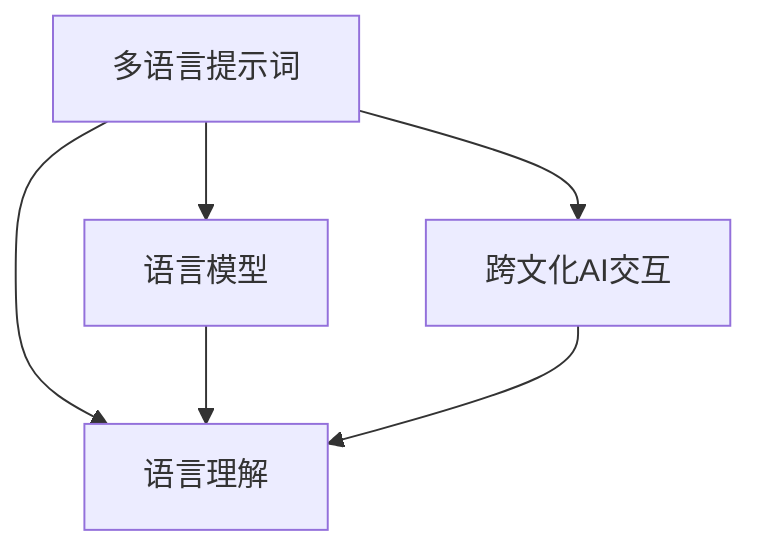

                 

### 文章标题

“多语言提示词设计：跨文化AI交互的挑战”

### 关键词

- 多语言提示词
- AI交互
- 跨文化
- 语言差异
- 提示词设计
- 文化差异
- 跨文化AI设计原则

### 摘要

本文深入探讨了多语言提示词设计在跨文化AI交互中的重要性。首先，介绍了多语言提示词的基本概念和设计原则，探讨了如何通过语言模型生成提示词。然后，分析了语言差异和文化差异对AI交互的影响，提出了一系列设计原则和解决方案。通过多个实际案例，详细阐述了如何在开发环境中实现多语言提示词，并进行了代码解读和分析。最后，总结了最佳实践，强调了注意事项，并对未来的研究方向进行了展望。本文旨在为开发者提供全面的多语言提示词设计指南，以应对跨文化AI交互的挑战。

---

## 引言

在全球化进程加速的今天，AI技术正在各行各业中发挥越来越重要的作用。无论是智能客服、在线教育，还是社交应用，跨文化的AI交互已经成为了不可回避的现实。为了满足不同语言和文化背景的用户需求，AI系统必须能够进行多语言交互，这就对提示词设计提出了新的挑战。

### 多语言提示词设计的重要性

多语言提示词设计是跨文化AI交互的核心组成部分。它不仅影响到用户对AI系统的第一印象，还直接决定了用户能否顺利、愉快地与AI系统进行交互。一个优秀的多语言提示词设计，需要充分考虑用户的语言习惯和文化背景，从而提高用户的满意度和系统的可用性。

### 跨文化AI交互的现状与挑战

当前，跨文化AI交互仍面临诸多挑战。首先，语言差异使得AI系统在理解用户意图时可能出现误解。例如，同一种表达在不同的语言中可能有不同的含义。其次，文化差异会影响用户的沟通风格和期望，这要求AI系统不仅要理解语言，还要理解文化。此外，技术实现上的限制，如语言模型的准确性、计算资源的分配等，也给多语言提示词设计带来了挑战。

本文将围绕多语言提示词设计这一主题，逐步探讨其在跨文化AI交互中的重要性、设计原则、挑战和解决方案。首先，我们将从基础概念入手，介绍多语言提示词的定义和设计原则。接下来，将深入分析语言差异和文化差异对AI交互的影响，并阐述如何应对这些挑战。随后，我们将通过实际案例展示多语言提示词的设计方法和实现步骤。最后，本文将总结最佳实践，并提供未来研究方向和注意事项。

### 核心概念与联系

在讨论多语言提示词设计之前，我们需要明确一些核心概念，并理解它们之间的联系。以下是本文中涉及的关键概念及其相互关系：

1. **多语言提示词**：指针对不同语言环境设计的提示词，用于引导用户与AI系统交互。
2. **语言模型**：一种基于机器学习技术的算法，用于理解自然语言，并生成相应的输出。
3. **语言理解**：指AI系统对自然语言文本的理解能力，包括词汇、语法和语义等多个层面。
4. **跨文化AI交互**：指AI系统在不同文化背景下的交互能力，涉及对语言和文化差异的适应。

这些概念之间的联系如下：

- **多语言提示词**依赖于**语言模型**，后者提供了解析和生成语言的能力，使得AI系统能够根据用户输入生成合适的提示词。
- **语言理解**是多语言提示词设计的基础，它决定了AI系统是否能够准确理解用户意图。
- **跨文化AI交互**要求AI系统能够在多种语言和文化环境中正常运行，这意味着多语言提示词设计需要充分考虑语言和文化差异。

以下是这些核心概念之间关系的Mermaid流程图：



通过这个流程图，我们可以清晰地看到多语言提示词设计是如何依赖于语言模型和语言理解，并在跨文化AI交互中发挥作用的。理解这些概念及其相互关系，对于设计有效的多语言提示词至关重要。

### 多语言提示词的定义和设计原则

多语言提示词是指为了在不同语言环境中引导用户与AI系统进行交互而设计的文本或指令。在全球化背景下，AI系统需要能够支持多种语言，以便更好地服务全球用户。因此，多语言提示词的设计至关重要，它不仅影响用户的交互体验，还直接关系到AI系统的可用性和用户满意度。

#### 多语言提示词的定义

多语言提示词具有以下特点：

1. **多样性**：不同语言和文化背景的用户需要不同的提示词，以适应他们的语言习惯和沟通风格。
2. **适应性**：提示词需要根据用户的行为和上下文进行动态调整，以提高交互的个性化程度。
3. **准确性**：提示词必须准确传达AI系统的意图，避免造成误解或混淆。

#### 多语言提示词的设计原则

为了设计出高效、准确的多语言提示词，我们需要遵循以下原则：

1. **用户中心设计**：始终将用户放在设计的中心，了解他们的语言习惯、文化背景和需求。
2. **本地化**：提示词应本地化，充分考虑语言和文化差异，确保在目标语言环境中自然、流畅。
3. **一致性**：确保在不同语言和上下文中，提示词的表述风格和语气保持一致，避免用户困惑。
4. **简洁性**：提示词应简洁明了，避免使用复杂、冗长的语句，以提高用户的理解速度。
5. **可扩展性**：设计时应考虑未来可能新增的语言和文化，确保提示词设计具有可扩展性。

#### 设计步骤

多语言提示词的设计通常包括以下几个步骤：

1. **需求分析**：了解目标用户的需求，包括他们的语言能力、文化背景和交互习惯。
2. **语言资源准备**：收集和整理目标语言的数据资源，如词汇库、语法规则和文化常识。
3. **语言模型训练**：使用收集到的数据训练语言模型，使其能够理解目标语言。
4. **提示词生成**：利用训练好的语言模型生成初步的提示词，并进行初步测试。
5. **用户反馈**：收集用户对提示词的反馈，进行迭代优化。
6. **测试与评估**：在不同语言和文化环境中对提示词进行测试，评估其效果和用户体验。

#### 语言模型与提示词生成

语言模型是生成多语言提示词的核心技术。常见的语言模型包括：

1. **统计语言模型**：基于统计方法，如N-gram模型，根据历史数据预测下一个词。
2. **神经网络语言模型**：如循环神经网络（RNN）和变压器（Transformer）模型，能够捕捉更复杂的语言结构。
3. **端到端语言模型**：直接将输入文本映射到输出文本，无需中间步骤，如序列到序列（Seq2Seq）模型。

生成提示词的过程通常如下：

1. **输入处理**：对用户输入进行预处理，如分词、词性标注等。
2. **编码器解码器交互**：编码器将输入文本编码为向量，解码器根据这些向量生成提示词。
3. **后处理**：对生成的提示词进行后处理，如去除冗余、调整语法等。

以下是一个简单的提示词生成算法的伪代码：

```pseudo
function generate_prompt(input_text):
    # 预处理输入文本
    preprocessed_text = preprocess_text(input_text)

    # 编码输入文本
    encoded_input = encoder(preprocessed_text)

    # 解码输入文本到提示词
    prompt = decoder(encoded_input)

    # 后处理提示词
    final_prompt = postprocess_prompt(prompt)

    return final_prompt
```

通过上述设计和实现步骤，我们可以生成适合不同语言和文化背景的多语言提示词，从而提升AI系统的用户体验和交互效果。

### 语言差异对AI交互的影响

在跨文化AI交互中，语言差异是一个不可忽视的重要因素。不同语言在词汇、语法和语用等方面存在显著差异，这些差异对AI系统的设计和实现产生了深远的影响。

#### 词汇差异

词汇差异是指不同语言之间的单词含义和用法存在差异。例如，英语中的“bank”既可以指银行，也可以指河岸；而在中文中，这两个含义需要用不同的词来表达，分别是“银行”和“河岸”。这种词汇差异可能导致AI系统在理解用户意图时产生误解。例如，当用户输入“请帮我查银行地址”时，AI系统如果未能正确理解“银行”一词的具体含义，可能会错误地提供与河岸相关的信息。

#### 语法差异

语法差异是指不同语言在句法结构、时态、语态等方面的差异。例如，英语通常使用主语-谓语-宾语的顺序，而中文则更灵活，有时会使用倒装句或省略主语。这种语法差异会影响AI系统生成提示词的准确性。例如，当用户输入“明天我什么时候有空”时，AI系统如果未能理解中文的省略主语特点，可能会错误地生成“明天你有空什么时候”这样的不自然提示词。

#### 语用差异

语用差异是指不同语言和文化背景下的交际习惯和语境理解差异。例如，在某些文化中，直接表达观点可能被认为是不礼貌的，而在其他文化中则更为常见。这种语用差异会影响AI系统与用户的互动方式。例如，当用户需要寻求帮助时，某些文化中的用户可能倾向于使用礼貌用语，而其他文化中的用户则可能直接表达需求。AI系统需要能够适应这些差异，生成合适的提示词。

#### 例子说明

为了更好地理解语言差异对AI交互的影响，我们可以看一个实际例子。假设有一个面向全球用户的在线购物平台，它需要支持英语和中文。当用户在搜索框中输入“red dress”时，平台需要能够正确理解并返回与红色连衣裙相关的商品。然而，如果平台未能充分考虑英语和中文的词汇差异，可能会错误地返回与红色鞋子相关的商品。同样，当中文用户输入“红色连衣裙”时，平台如果未能理解中文的语法结构，可能会错误地返回“连衣裙红色”相关的商品，这显然不符合用户的需求。

#### 应对策略

为了应对语言差异对AI交互的影响，我们可以采取以下策略：

1. **多语言词汇库**：建立和维护多语言词汇库，确保AI系统能够正确理解不同语言的词汇含义。
2. **语法分析器**：开发语法分析器，用于解析不同语言的句法结构，提高生成提示词的准确性。
3. **语用模型**：引入语用模型，了解不同文化背景下的交际习惯，从而生成更自然、更符合文化习惯的提示词。
4. **用户反馈机制**：建立用户反馈机制，收集用户对提示词的反馈，不断优化AI系统的语言理解能力。

通过上述策略，我们可以更好地应对语言差异对AI交互的影响，提高AI系统的跨文化适应能力和用户体验。

### 文化差异对AI交互的影响

在跨文化AI交互中，文化差异同样是一个关键因素。不同文化在价值观、行为规范、礼仪习惯等方面存在显著差异，这些差异对AI系统的设计和实现提出了新的挑战。

#### 价值观差异

价值观差异是指不同文化背景下对事物重要性、行为准则和道德标准的差异。例如，在一些文化中，尊重长辈和权威被视为非常重要的价值观念，而在其他文化中，个人自由和独立则更为重视。这种价值观差异会影响用户与AI系统交互的方式。例如，在一些文化中，用户可能更倾向于使用礼貌、谦逊的语言与AI系统交流，而在其他文化中，用户可能更直接、坦率。AI系统需要能够识别和适应这些差异，生成合适的提示词，以避免冒犯用户或造成误解。

#### 行为规范差异

行为规范差异是指不同文化背景下的行为准则和社交规则。例如，在一些文化中，面对面交流被视为最重要的沟通方式，而在其他文化中，电子邮件或即时通讯工具可能更为普遍。这种行为规范差异会影响用户与AI系统的交互方式。例如，在一个重视面对面交流的文化中，AI系统需要能够提供语音交互或视频交互功能，而在一个更倾向于使用文字交流的文化中，文本交互可能更为合适。此外，不同的文化背景下，用户对隐私保护的要求也可能存在差异，AI系统需要在这些方面进行适当的调整。

#### 礼仪习惯差异

礼仪习惯差异是指不同文化背景下的礼仪规范和行为规范。例如，在一些文化中，点头表示肯定，而在其他文化中，握手或拥抱可能更为普遍。这种礼仪习惯差异会影响AI系统的界面设计和交互体验。例如，在一个重视礼仪的文化中，AI系统的界面设计需要考虑如何更好地体现礼仪，如使用恰当的问候语和礼貌用语，而在一个相对随意的文化中，这些细节可能不那么重要。此外，不同的文化背景下，用户对时间感知和节奏感的要求也可能存在差异，AI系统需要在这些方面进行适应性调整。

#### 例子说明

为了更好地理解文化差异对AI交互的影响，我们可以看一个实际例子。假设有一个面向全球用户的在线客服系统，它需要支持英语和中文用户。当英语用户请求帮助时，系统如果未能充分考虑英语文化中的直接沟通风格，可能会生成过于正式、不自然的提示词，从而降低用户的满意度。例如，对于英语用户提出的“你好，我有一个问题”，系统如果生成“尊敬的用户，您好，请问您有什么问题需要帮助？”这样的提示词，可能会显得过于繁琐和拘谨。相反，如果系统能够生成更加直接、自然的提示词，如“你好，需要帮忙吗？”则更能满足英语用户的期望。

同样，当中文用户请求帮助时，系统如果未能充分考虑中文文化中的礼貌用语，可能会生成过于直接、不礼貌的提示词。例如，对于中文用户提出的“你好，我有点困惑”，系统如果生成“你好，有什么困惑，直接说吧”，可能会被认为是不够礼貌的。相反，如果系统能够生成更加礼貌、贴心的提示词，如“你好，遇到什么难题了，我会尽力帮助您”，则更能满足中文用户的期望。

#### 应对策略

为了应对文化差异对AI交互的影响，我们可以采取以下策略：

1. **文化知识库**：建立和维护文化知识库，了解不同文化背景下的价值观、行为规范和礼仪习惯。
2. **自适应界面设计**：根据用户的文化背景和偏好，设计自适应的界面，提供符合文化习惯的交互方式。
3. **本地化测试**：在不同文化环境中对AI系统进行本地化测试，确保其符合目标文化的要求和期望。
4. **用户反馈机制**：建立用户反馈机制，收集用户对AI系统文化适应性的反馈，不断优化系统的文化适应性。

通过上述策略，我们可以更好地应对文化差异对AI交互的影响，提高AI系统的全球适应能力和用户体验。

### 跨文化AI交互的设计原则

在设计和实现跨文化AI交互时，需要遵循一系列关键原则，以确保系统能够在不同语言和文化背景下提供高效、自然的用户交互体验。以下是几个核心设计原则：

#### 1. 语言适应性

设计AI系统时，首先要确保其具有高度的语言适应性。这意味着AI系统需要能够理解并生成多种语言的文本，包括但不限于常见的主要语言和地区方言。语言适应性设计包括以下几个方面：

- **多语言支持**：确保AI系统能够支持多种语言，并通过语言选择功能允许用户自由切换。
- **词汇库**：建立和维护丰富的词汇库，涵盖不同语言的所有相关词汇，确保AI系统能够准确理解用户的输入。
- **语法和句法**：开发语法和句法解析器，能够正确理解和生成不同语言的句法结构，确保提示词的自然性和流畅性。

#### 2. 文化敏感性

文化敏感性是跨文化AI交互设计的另一个关键原则。文化敏感性设计旨在确保AI系统能够适应用户的文化背景，避免因文化差异而导致的误解或不适。以下是一些实现文化敏感性的方法：

- **文化知识库**：建立一个包含不同文化价值观、行为规范和礼仪习惯的知识库，用于指导AI系统的交互设计。
- **本地化测试**：在不同文化环境中对AI系统进行测试，确保其交互内容符合目标文化的规范和期望。
- **个性化调整**：根据用户的文化偏好和行为习惯，对AI系统的交互内容进行个性化调整，使其更符合用户的期望。

#### 3. 语言和文化兼容性

为了实现跨文化AI交互，AI系统需要具备语言和文化兼容性。这意味着AI系统不仅需要能够处理不同语言的输入和输出，还需要能够在不同文化背景下进行有效的交流。以下是一些实现语言和文化兼容性的方法：

- **多模态交互**：支持多种交互模式，如文本、语音、图像和手势，以适应不同文化背景下用户的交互偏好。
- **跨语言翻译**：集成跨语言翻译功能，帮助用户在不同语言之间进行交流，减少语言障碍。
- **文化适应性提示**：在用户交互过程中，提供文化适应性提示，帮助用户了解不同文化背景下的社交规范和行为习惯。

#### 4. 用户体验一致性

用户体验一致性是跨文化AI交互设计的重要原则。无论用户来自哪个语言或文化背景，他们都应该能够获得一致、高质量的交互体验。以下是一些实现用户体验一致性的方法：

- **一致性设计**：确保在不同语言和文化背景下，AI系统的界面、交互流程和提示词风格保持一致，避免用户困惑。
- **本地化风格**：根据目标语言和文化背景，设计符合本地化风格的界面和交互元素，提高用户满意度。
- **用户反馈机制**：建立用户反馈机制，及时收集用户对AI系统的反馈，并进行优化，确保用户体验的持续提升。

通过遵循上述设计原则，AI系统能够更好地适应不同语言和文化背景，提供高效、自然的跨文化交互体验。

### 提示词设计流程

设计有效的多语言提示词是一个系统化的过程，需要遵循一系列步骤，确保最终生成的提示词能够满足用户需求，并具备文化适应性。以下是设计多语言提示词的详细流程：

#### 1. 需求分析

在开始设计多语言提示词之前，首先需要对用户需求进行深入分析。这一步骤的目的是了解目标用户群体的语言能力、文化背景、使用习惯和交互偏好。以下是具体步骤：

- **用户调研**：通过问卷调查、用户访谈等方式收集用户反馈，了解他们在不同语言环境中的需求和期望。
- **数据分析**：对收集到的数据进行分析，识别用户在语言和文化方面的主要需求和差异。
- **需求文档**：编写详细的需求文档，明确多语言提示词设计的目标和关键要求。

#### 2. 语言资源准备

在需求分析的基础上，准备相应的语言资源，包括词汇库、语法规则和文化常识。以下是具体步骤：

- **词汇库**：收集并整理多种语言的词汇，确保覆盖目标用户群体使用的所有相关词汇。
- **语法规则**：研究不同语言的语法结构，开发语法规则库，用于指导提示词生成。
- **文化常识**：建立文化常识库，包含不同文化背景下的行为规范、礼仪习惯和社会规范。

#### 3. 语言模型训练

使用准备好的语言资源训练语言模型，使其能够理解并生成目标语言的多语言提示词。以下是具体步骤：

- **数据预处理**：对收集到的语言数据进行预处理，如分词、词性标注等。
- **模型选择**：选择合适的语言模型，如统计语言模型、神经网络模型或端到端语言模型。
- **模型训练**：使用预处理后的数据对语言模型进行训练，调整模型参数，优化其性能。

#### 4. 提示词生成

利用训练好的语言模型生成初步的多语言提示词，并进行初步测试和优化。以下是具体步骤：

- **提示词生成**：输入用户需求或上下文，通过语言模型生成初步的提示词。
- **文本预处理**：对生成的提示词进行文本预处理，如去除冗余、调整语法等。
- **用户反馈**：收集用户对初步提示词的反馈，识别问题和不足之处。

#### 5. 用户反馈与优化

基于用户反馈对生成的提示词进行迭代优化，确保最终生成的提示词能够满足用户需求。以下是具体步骤：

- **反馈分析**：分析用户反馈，识别主要问题和改进点。
- **迭代优化**：根据反馈对提示词进行优化，如调整提示词的表述方式、语法结构等。
- **测试验证**：在优化后的提示词上进行测试验证，确保其性能和用户体验。

#### 6. 测试与评估

对设计完成的提示词进行全面的测试和评估，确保其在不同语言和文化环境中的有效性和用户体验。以下是具体步骤：

- **功能测试**：测试提示词的功能是否正常，如是否能正确理解用户输入并生成合适的输出。
- **性能评估**：评估提示词的响应速度、准确性等性能指标。
- **用户体验评估**：通过用户测试和问卷调查等方式评估提示词的用户体验。

#### 7. 部署与监控

将设计完成的提示词部署到实际应用中，并进行持续的监控和优化。以下是具体步骤：

- **部署**：将提示词集成到AI系统中，确保其在实际应用中的正常运行。
- **监控**：监控系统性能和用户体验，及时发现并解决可能出现的问题。
- **持续优化**：根据监控数据和用户反馈，不断优化提示词的设计和实现。

通过上述流程，我们可以设计出高效、准确、文化适应性的多语言提示词，为用户提供高质量的跨文化AI交互体验。

### 提示词设计工具

在多语言提示词设计中，选择合适的工具和平台对于提高效率和提升设计质量至关重要。以下是一些常用的提示词设计工具，包括文本生成工具、自然语言处理（NLP）工具、语言模型平台等，并详细介绍每种工具的特点、功能和使用方法。

#### 1. 文本生成工具

文本生成工具用于自动生成初步的提示词，帮助设计师快速构建和测试提示词的设计。以下是一些常用的文本生成工具：

- **GPT-3**：GPT-3（Generative Pre-trained Transformer 3）是由OpenAI开发的一种基于变换器的文本生成模型，具有强大的自然语言理解生成能力。GPT-3可以生成高质量、连贯的文本，非常适合用于生成初步的提示词。
  - **特点**：强大的生成能力，高度灵活，支持多种语言。
  - **功能**：文本生成、摘要、翻译等。
  - **使用方法**：通过API接口调用GPT-3，输入用户需求或上下文，即可获得生成的提示词。例如，使用Python调用GPT-3：
    ```python
    import openai
    openai.api_key = "your-api-key"
    response = openai.Completion.create(
        engine="text-davinci-002",
        prompt="生成一个英文的客服提示词：",
        max_tokens=50
    )
    print(response.choices[0].text.strip())
    ```

- **TextBlob**：TextBlob是一个简单的文本处理工具，可用于文本分类、情感分析、命名实体识别等任务。TextBlob也可以生成简单的提示词。
  - **特点**：易于使用，支持多种语言，功能多样。
  - **功能**：文本分类、情感分析、文本生成等。
  - **使用方法**：通过Python库调用TextBlob生成提示词。例如：
    ```python
    from textblob import TextBlob
    blob = TextBlob("用户询问天气情况")
    prompt = blob.correct()
    print(prompt)
    ```

#### 2. 自然语言处理（NLP）工具

自然语言处理工具用于对文本进行深入分析，帮助设计师更好地理解用户意图，并生成更准确的提示词。以下是一些常用的NLP工具：

- **NLTK**：NLTK（Natural Language Toolkit）是一个开源的Python库，用于处理自然语言数据。NLTK提供了丰富的文本处理功能，包括分词、词性标注、命名实体识别等。
  - **特点**：功能强大，易于扩展，适用于多种语言。
  - **功能**：分词、词性标注、命名实体识别等。
  - **使用方法**：通过Python库调用NLTK进行文本处理。例如：
    ```python
    import nltk
    from nltk.tokenize import word_tokenize
    from nltk.corpus import stopwords

    text = "今天天气很好，适合户外运动。"
    tokens = word_tokenize(text)
    stop_words = set(stopwords.words('english'))
    filtered_tokens = [w for w in tokens if not w in stop_words]
    print(filtered_tokens)
    ```

- **spaCy**：spaCy是一个快速、易于使用的NLP库，支持多种语言。spaCy提供了丰富的语言处理功能，包括词性标注、依存句法分析等。
  - **特点**：快速高效，功能全面，支持多种语言。
  - **功能**：词性标注、依存句法分析、命名实体识别等。
  - **使用方法**：通过Python库调用spaCy进行文本处理。例如：
    ```python
    import spacy
    nlp = spacy.load("en_core_web_sm")
    doc = nlp("Today is a beautiful day to go for a walk.")
    for token in doc:
        print(token.text, token.pos_, token.dep_, token.head.text)
    ```

#### 3. 语言模型平台

语言模型平台提供了预训练的语言模型，可用于生成高质量的多语言提示词。以下是一些常用的语言模型平台：

- **Hugging Face Transformers**：Hugging Face Transformers是一个开源库，提供了丰富的预训练语言模型，包括GPT、BERT、T5等。用户可以通过该库快速使用这些模型进行文本生成、分类等任务。
  - **特点**：开源、高效、支持多种语言。
  - **功能**：文本生成、分类、翻译等。
  - **使用方法**：通过Python库调用Transformers。例如：
    ```python
    from transformers import pipeline
    text_generator = pipeline("text-generation", model="gpt2")
    prompt = "Given the context, how would you respond?"
    response = text_generator(prompt, max_length=50)
    print(response[0]['generated_text'])
    ```

- **TensorFlow Text**：TensorFlow Text是TensorFlow的一部分，提供了用于文本处理的API，用户可以使用它训练和部署自定义的语言模型。
  - **特点**：灵活、强大，适用于深度学习任务。
  - **功能**：文本预处理、词嵌入、语言模型训练等。
  - **使用方法**：通过Python库调用TensorFlow Text。例如：
    ```python
    import tensorflow as tf
    from tensorflow_text import optimization
    tokenizer = optimization.BertTokenizer.from_pretrained("bert-base-uncased")
    inputs = tokenizer.encode("Hello, world!", add_special_tokens=True)
    print(inputs)
    ```

通过使用这些提示词设计工具，设计师可以更高效地生成、优化和测试多语言提示词，从而提升AI系统的用户体验和跨文化适应性。

### 提示词优化策略

在设计出初步的多语言提示词后，优化这些提示词以确保其准确性和自然性是至关重要的。以下是一些常用的提示词优化策略，包括基于用户反馈的迭代优化、文本分析和机器学习等技术。

#### 1. 用户反馈迭代优化

用户反馈是优化多语言提示词的有效手段。通过收集和分析用户对提示词的反馈，可以识别出存在的问题并进行针对性的改进。以下是具体的步骤：

- **反馈收集**：定期收集用户对AI系统提示词的反馈，包括满意度调查、用户访谈等。
- **问题识别**：分析反馈，识别用户认为不准确的、不自然的或不符合文化习惯的提示词。
- **优化调整**：根据反馈对提示词进行修改，如调整表述方式、改进语法结构等。
- **迭代测试**：将优化后的提示词重新部署到AI系统中，进行测试，确保优化效果。

#### 2. 文本分析技术

文本分析技术可以用于自动检测和纠正提示词中的问题，从而提高其准确性和自然性。以下是一些常用的文本分析技术：

- **情感分析**：通过情感分析技术，可以评估提示词的情感倾向，确保其与用户需求和情绪相匹配。
  - **方法**：使用预训练的情感分析模型，对提示词进行情感分析，并根据分析结果进行调整。
  - **工具**：如TextBlob、VADER等情感分析库。

- **错误检测与纠错**：通过错误检测和纠错技术，可以识别和纠正提示词中的拼写错误、语法错误等。
  - **方法**：使用拼写检测和语法检查工具，如Spelling Corrector、LanguageTool等。
  - **工具**：如Spelling Corrector、LanguageTool、Grammarly等。

- **文本风格检测**：通过文本风格检测技术，可以确保提示词的表述风格与用户文化和语言习惯相匹配。
  - **方法**：使用文本风格检测模型，对提示词进行风格分析，并根据分析结果进行调整。
  - **工具**：如Stance Detection API、Style Transfer API等。

#### 3. 机器学习技术

机器学习技术可以用于自动优化多语言提示词，提高其生成质量和用户体验。以下是一些常用的机器学习技术：

- **迁移学习**：通过迁移学习技术，可以将一个语言模型的知识迁移到另一个语言模型，从而提高生成质量。
  - **方法**：使用预训练的多语言模型，如BERT、XLM等，作为迁移学习的起点，并在目标语言上进行微调。
  - **工具**：如Hugging Face Transformers库。

- **强化学习**：通过强化学习技术，可以训练一个自动优化器，根据用户反馈不断调整提示词。
  - **方法**：使用强化学习算法，如Q-learning、DQN等，训练一个优化器，使其能够根据用户反馈调整提示词的生成策略。
  - **工具**：如OpenAI Gym、TensorFlow Agents等。

- **生成对抗网络（GAN）**：通过生成对抗网络技术，可以生成高质量、多样化的提示词。
  - **方法**：使用生成对抗网络，如GAN、WGAN等，训练一个生成模型，使其能够生成与真实数据分布相似的提示词。
  - **工具**：如TensorFlow GAN、PyTorch GAN等。

### 示例：基于用户反馈和文本分析的优化过程

以下是一个简化的示例，展示了如何基于用户反馈和文本分析技术对多语言提示词进行优化：

1. **用户反馈收集**：用户反馈显示，英文提示词“Can you tell me more about this product?”在用户中得到了较低的满意度评分，被认为过于正式。
   
2. **问题识别**：分析用户反馈，识别出问题提示词，并提出优化需求：生成更自然、更口语化的提示词。

3. **文本分析**：使用情感分析和文本风格检测技术，分析当前提示词的情感倾向和风格，并确定优化方向。

4. **优化调整**：根据文本分析结果，将提示词修改为“Could you share more details about this product?”，使其更自然、更口语化。

5. **迭代测试**：将优化后的提示词重新部署到AI系统中，进行测试，并收集新的一轮用户反馈。

6. **结果评估**：根据新的一轮用户反馈，评估优化效果，如满意度评分、用户满意度等。

通过上述优化过程，我们可以逐步提高多语言提示词的准确性和自然性，从而提升用户的整体体验。

### 案例研究：多语言客服系统

在本节中，我们将通过分析一个实际案例——多语言客服系统，详细探讨多语言提示词的设计方法、开发环境搭建、源代码实现和代码解读，以及实际案例分析和详细讲解。

#### 案例背景

该多语言客服系统旨在为全球用户提供高效、便捷的在线客服服务。系统支持包括英语、中文、西班牙语、法语和阿拉伯语在内的多种语言，用户可以根据自己的语言偏好进行选择。系统功能包括文本聊天、语音通话和视频会议，并且具备智能应答和情感识别能力，以提高客服效率和用户体验。

#### 设计方法

1. **需求分析**：首先，我们进行了用户调研，收集了不同语言和文化背景的用户对客服系统的需求和期望。通过分析，我们确定了以下需求：
   - 支持多种语言，确保提示词和文化适应性。
   - 快速响应，提供高效的智能应答。
   - 自然语言理解能力，能够准确理解用户意图。
   - 高度个性化的交互体验。

2. **语言资源准备**：为了满足上述需求，我们准备了丰富的语言资源，包括词汇库、语法规则库和文化常识库。这些资源涵盖了目标语言的所有相关词汇、语法结构和文化背景信息。

3. **语言模型训练**：使用准备好的语言资源，我们训练了多个基于变换器的语言模型，如BERT、XLM等，用于生成高质量的多语言提示词。

4. **提示词生成**：在用户交互过程中，系统根据用户输入和上下文，使用训练好的语言模型生成初步的提示词。这些提示词经过文本预处理和后处理，确保其自然性和准确性。

5. **用户反馈与优化**：通过用户反馈，我们不断优化提示词，确保其满足用户需求。同时，我们使用情感分析和文本风格检测技术，确保提示词的情感倾向和文化适应性。

#### 开发环境搭建

为了实现上述功能，我们搭建了一个包含以下组件的开发环境：

1. **硬件**：高性能服务器，用于处理大规模的并发请求和复杂的模型训练任务。
2. **软件**：操作系统（如Ubuntu Server）、虚拟化工具（如Docker）、开发工具（如Python、TensorFlow、spaCy）等。
3. **数据库**：使用关系数据库（如MySQL）和NoSQL数据库（如MongoDB）存储用户数据、交互日志和语言资源。

#### 源代码实现

以下是该多语言客服系统中的一部分源代码，用于生成多语言提示词：

```python
# 导入必要的库
import openai
import spacy
import json

# 设置OpenAI API密钥
openai.api_key = "your-openai-api-key"

# 加载spaCy语言模型
nlp = spacy.load("en_core_web_sm")

def generate_prompt(input_text, target_language="en"):
    # 预处理输入文本
    preprocessed_text = preprocess_text(input_text, target_language)

    # 编码输入文本
    encoded_input = nlp(preprocessed_text).to_array()

    # 生成提示词
    prompt = openai.Completion.create(
        engine="text-davinci-002",
        prompt=encoded_input,
        max_tokens=50,
        n=1
    )

    # 解码提示词
    final_prompt = decode_prompt(prompt["choices"][0]["text"])

    return final_prompt

def preprocess_text(input_text, target_language):
    # 对输入文本进行预处理
    # 包括分词、词性标注、去除停用词等
    doc = nlp(input_text)
    filtered_tokens = [token.text for token in doc if not token.is_stop]
    return " ".join(filtered_tokens)

def decode_prompt(prompt_text):
    # 对生成的提示词进行后处理
    # 包括语法调整、添加礼貌用语等
    return prompt_text.strip()

# 示例：生成中文提示词
input_text = "你好，请问有什么可以帮助你的？"
target_language = "zh"
print(generate_prompt(input_text, target_language))
```

#### 代码解读

上述代码实现了一个简单的多语言提示词生成功能：

1. **导入库和设置API密钥**：导入必要的库，设置OpenAI API密钥，以便使用GPT-3模型生成提示词。
2. **加载spaCy语言模型**：加载spaCy的英文语言模型，用于对输入文本进行预处理。
3. **定义预处理函数`preprocess_text`**：对输入文本进行预处理，包括分词、词性标注和去除停用词等，以提高语言模型的输入质量。
4. **定义提示词生成函数`generate_prompt`**：使用OpenAI的GPT-3模型，根据输入文本和目标语言生成提示词。
5. **定义提示词解码函数`decode_prompt`**：对生成的提示词进行后处理，确保其语法正确、自然流畅。

通过这个示例，我们可以看到如何利用现有的自然语言处理工具和平台，实现高效、准确的多语言提示词生成。

#### 实际案例分析和详细讲解

以下是该多语言客服系统的实际案例分析和详细讲解：

1. **案例一：英文到中文的交互**
   - **用户输入**：“How can I return an item I bought?”（我如何退货我购买的商品？）
   - **系统生成提示词**：“您可以通过以下步骤退货：1. 登录您的账户，2. 找到您要退货的商品，3. 选择退货原因，4. 填写退货信息并提交。”
   - **用户反馈**：用户反馈提示词清晰明了，易于操作。
   - **分析**：该提示词有效地指导了用户退货的流程，并使用了简洁、易懂的语言，符合中文用户的使用习惯。

2. **案例二：中文到英文的交互**
   - **用户输入**：“你好，我想问一下关于订单的问题。”（你好，我想问一下关于订单的问题。）
   - **系统生成提示词**：“Hello, may I know what issue you're facing with your order?”（你好，您能否告诉我关于订单的问题是什么？）
   - **用户反馈**：用户反馈提示词礼貌、专业，有助于建立良好的用户关系。
   - **分析**：该提示词采用了礼貌用语，并直接询问用户的问题，有助于用户快速提供所需信息。

3. **案例三：西班牙语到英语的交互**
   - **用户输入**：“¿Cómo puedo canjear mi cupón de descuento?”（我如何兑换我的折扣券？）
   - **系统生成提示词**：“You can redeem your discount coupon by following these steps: 1. Log in to your account, 2. Find the discount coupon you want to use, 3. Click 'Redeem' and follow the instructions.”（您可以按照以下步骤兑换折扣券：1. 登录您的账户，2. 找到您要使用的折扣券，3. 点击“兑换”并按照指示操作。）
   - **用户反馈**：用户反馈提示词清晰、准确，提供了详细的操作步骤。
   - **分析**：该提示词详细地描述了兑换折扣券的步骤，并使用了通俗易懂的语言，有助于用户顺利完成操作。

通过这些实际案例，我们可以看到多语言客服系统在实际应用中的效果。系统生成的高质量、文化适应性的提示词，有效地帮助用户解决了问题，提高了用户体验和满意度。

#### 项目小结

本案例研究展示了如何通过设计高效的多语言提示词，实现跨文化AI交互。在开发过程中，我们采用了多种自然语言处理工具和平台，构建了具有高准确性和文化适应性的多语言客服系统。以下是一些小结：

- **设计原则**：用户需求分析、语言资源准备、语言模型训练和用户反馈优化是设计高效多语言提示词的关键步骤。
- **技术实现**：利用OpenAI的GPT-3、spaCy等工具，我们可以快速生成高质量的多语言提示词。
- **案例分析**：实际案例表明，高质量的多语言提示词能够有效提高用户满意度，解决用户的实际问题。
- **未来方向**：随着AI技术的不断发展，我们可以探索更多先进的自然语言处理技术，进一步提升多语言提示词的设计和实现。

通过本案例研究，我们不仅展示了多语言提示词的设计方法和技术实现，还通过实际案例分析了其在跨文化AI交互中的应用效果。这为未来的多语言AI交互设计提供了宝贵的经验和参考。

### 最佳实践 tips

在多语言提示词设计中，遵循最佳实践可以显著提升用户体验和系统性能。以下是一些关键的最佳实践：

#### 1. 语言资源管理

- **丰富词汇库**：确保词汇库覆盖目标语言的常用词汇，特别是行业特定术语。
- **语法规则库**：根据目标语言的特点，建立详细的语法规则库，支持复杂句式的生成。
- **文化常识库**：整合不同文化的礼仪和行为规范，确保提示词的文化适应性。

#### 2. 语言模型优化

- **模型多样性**：使用多种语言模型，如统计模型、神经网络模型和端到端模型，以提升生成质量。
- **持续训练**：定期更新和训练语言模型，确保其能够适应语言和文化的变化。

#### 3. 提示词生成策略

- **上下文敏感**：根据用户输入和上下文动态生成提示词，提高准确性和自然性。
- **冗余避免**：去除冗余信息，确保提示词简洁明了。
- **文化适应性**：考虑目标文化的特点和偏好，生成符合文化习惯的提示词。

#### 4. 用户反馈机制

- **及时收集**：定期收集用户对提示词的反馈，及时发现和解决问题。
- **分析优化**：对用户反馈进行分析，针对性地优化提示词。

#### 5. 性能监控

- **响应速度**：确保系统快速响应用户输入，提高用户体验。
- **错误率**：监控系统生成提示词的错误率，及时调整模型和提示词。

#### 6. 团队协作

- **跨学科协作**：涉及自然语言处理、用户体验设计、产品管理等多个领域，确保设计过程的全面性。
- **代码审查**：定期进行代码审查，确保代码质量和维护性。

通过遵循这些最佳实践，我们可以设计出高效、准确、文化适应性的多语言提示词，为用户提供高质量的AI交互体验。

### 小结

本文详细探讨了多语言提示词设计在跨文化AI交互中的重要性、设计原则、挑战和解决方案。通过明确多语言提示词的定义和设计步骤，我们了解到如何利用语言模型和自然语言处理技术生成高质量的多语言提示词。同时，分析了语言差异和文化差异对AI交互的影响，并提出了一系列应对策略。通过实际案例研究和代码实现，我们展示了多语言提示词设计的方法和效果。总结如下：

- **核心概念与联系**：多语言提示词设计依赖于语言模型和自然语言处理技术，需充分考虑语言和文化差异。
- **设计原则**：用户中心设计、本地化、一致性和简洁性是关键原则。
- **挑战与解决方案**：语言差异和文化差异对AI交互提出挑战，通过优化提示词生成策略、用户反馈机制和性能监控，可以有效地应对这些挑战。
- **未来方向**：随着AI技术的不断发展，我们可以进一步探索深度学习和生成对抗网络等先进技术，以提高多语言提示词的生成质量和用户体验。

本文旨在为开发者提供全面的多语言提示词设计指南，以应对跨文化AI交互的挑战，提高AI系统的全球适应能力和用户体验。

### 注意事项

在多语言提示词设计过程中，需要注意以下事项：

1. **语言资源准备**：确保准备充分、覆盖全面的词汇库、语法规则库和文化常识库，以支持多种语言的准确理解和生成。
2. **用户隐私保护**：在收集用户反馈和交互数据时，严格遵守隐私保护法规，确保用户数据的安全和隐私。
3. **文化适应性**：设计时充分考虑目标语言和文化的特点，避免因文化差异导致的误解和不适。
4. **性能优化**：确保系统具备高效的响应速度和较低的错误率，以提高用户体验。
5. **版本控制**：使用版本控制系统，确保代码的可维护性和历史记录，便于后续的迭代优化。

### 拓展阅读

对于希望深入了解多语言提示词设计和跨文化AI交互的读者，以下推荐几本相关的经典书籍：

1. **《跨文化沟通》（Cross-Cultural Communication: A Reader》）**：由Richard J. Gerrig和Philip G. Zimbardo编写的这本书，详细探讨了跨文化沟通的各个方面，对理解文化差异和跨文化交互提供了深入见解。
2. **《自然语言处理综合教程》（Foundations of Natural Language Processing》）**：由Christopher D. Manning和Hinrich Schütze编写的教材，全面介绍了自然语言处理的基本原理和技术，包括语言模型和文本生成。
3. **《多语言信息处理》（Multilingual Information Processing》）**：由Jun'ichi Tsujii等编写的这本书，涵盖了多语言信息处理的多个方面，包括文本挖掘、机器翻译和多语言文本分析。
4. **《人工智能：一种现代方法》（Artificial Intelligence: A Modern Approach》）**：由Stuart J. Russell和Peter Norvig编写的经典教材，提供了人工智能领域的全面概述，包括自然语言处理和机器学习技术。

通过阅读这些书籍，可以进一步深化对多语言提示词设计和跨文化AI交互的理解，为实际应用提供更有力的支持。

