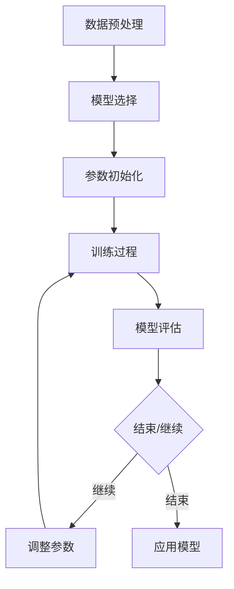
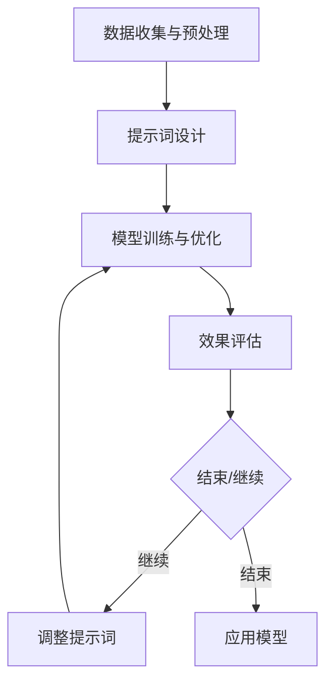

                 


## 大模型Fine-tuning与提示词工程的比较

### 关键词：大模型、Fine-tuning、提示词工程、人工智能、深度学习

### 摘要：
本文将深入探讨大模型Fine-tuning与提示词工程在人工智能领域的应用及其差异。我们将首先介绍这两个概念的基本背景，然后通过Mermaid流程图、伪代码、数学模型和公式、项目实战案例等，详细阐述它们的原理、实施方法和效果比较。通过本文，读者将能够全面理解这两种技术的优势与局限，以及它们在实际项目中的应用场景。

### 1. 引言

#### 1.1 大模型Fine-tuning的基本概念

大模型Fine-tuning是近年来在人工智能领域备受关注的技术。它通过在预训练模型的基础上，针对特定任务进行微调，以提高模型在特定领域的性能。这种方法主要应用于自然语言处理、计算机视觉等多个领域，已经成为实现模型高效训练的重要手段。

#### 1.2 提示词工程的概念

提示词工程是一种设计有效的输入提示来引导大型预训练模型生成所需输出的技术。它通过精心设计的提示，使得模型能够更好地理解和执行特定任务，从而在生成文本、图像等任务中表现出色。

### 2. Fine-tuning的基本原理

#### 2.1 Fine-tuning的概念

Fine-tuning是指将一个已经在大规模数据集上预训练好的模型，在新的特定任务数据集上重新训练，以适应该任务的过程。

#### 2.2 Fine-tuning的优势

- **提高性能**：通过在大规模数据集上预训练，模型已经获得了一定的泛化能力，再通过Fine-tuning，可以进一步提高模型在特定任务上的性能。
- **节省时间**：预训练模型已经包含了大量知识的迁移，因此可以在较少的数据集和计算资源下，快速地适应新的任务。

#### 2.3 Fine-tuning的挑战

- **模型容量**：大模型Fine-tuning需要大量的计算资源和时间，尤其是对于参数数量庞大的模型。
- **数据质量**：Fine-tuning的效果很大程度上依赖于训练数据的数量和质量。

#### 2.4 Fine-tuning的步骤与流程

- **数据预处理**：将新任务的数据集进行预处理，使其符合模型输入要求。
- **模型选择**：选择一个已经预训练好的模型，该模型应该在大规模数据集上表现出较好的性能。
- **参数初始化**：初始化模型参数，可以选择从头开始训练或使用预训练模型的参数。
- **训练过程**：在新的数据集上对模型进行训练，通过优化算法调整模型参数，以最小化损失函数。
- **模型评估**：在验证集上评估模型性能，根据评估结果调整模型参数。

### 3. 提示词工程的基本原理

#### 3.1 提示词工程的概念

提示词工程是一种设计有效的输入提示来引导大型预训练模型生成所需输出的技术。

#### 3.2 提示词工程的优势

- **灵活性和可控性**：通过精心设计的提示词，用户可以更精确地控制模型生成的内容，提高生成文本、图像等任务的性能。
- **减少数据需求**：在某些情况下，通过有效的提示词，可以减少对大量训练数据的需求，使得模型在小数据集上也能表现良好。

#### 3.3 提示词工程的挑战

- **设计难度**：设计有效的提示词需要大量的实验和经验积累，对设计者的要求较高。
- **模型适应性**：不同的模型可能需要不同的提示词设计，增加了工程的复杂度。

#### 3.4 提示词工程的实施方法

- **数据收集与预处理**：收集与任务相关的数据，并进行预处理，以确保数据的质量和一致性。
- **提示词设计**：根据任务需求，设计合适的提示词，通常包括关键词、问题、场景描述等。
- **模型训练与优化**：使用预训练模型，结合设计的提示词进行训练和优化，以提高模型的性能。
- **效果评估**：在验证集上评估模型的性能，根据评估结果调整提示词。

### 4. Fine-tuning与提示词工程的比较

#### 4.1 相同点

- **目标**：Fine-tuning和提示词工程的目标都是提高模型在特定任务上的性能。
- **技术基础**：它们都基于预训练模型，利用已有的知识迁移，实现对新任务的有效适应。

#### 4.2 不同点

- **实施方法**：Fine-tuning是通过在特定数据集上重新训练模型，而提示词工程是通过设计有效的输入提示来引导模型。
- **灵活性和可控性**：提示词工程具有更高的灵活性和可控性，而Fine-tuning更依赖于数据的数量和质量。

#### 4.3 融合应用前景

- **优势互补**：Fine-tuning和提示词工程各有优势，可以通过融合应用，实现更好的性能。
- **未来趋势**：随着预训练模型的不断发展，Fine-tuning和提示词工程将在更多任务中发挥作用，为人工智能的发展提供新的动力。

### 5. 实际应用案例

#### 5.1 自然语言处理中的应用

在自然语言处理领域，Fine-tuning和提示词工程都取得了显著的成果。例如，通过Fine-tuning，可以将预训练的BERT模型应用于问答系统，实现高效的文本理解。而通过提示词工程，可以设计出有效的提示，使得模型能够生成更符合用户需求的回答。

#### 5.2 计算机视觉中的应用

在计算机视觉领域，Fine-tuning被广泛应用于图像分类、目标检测等任务。例如，通过在ImageNet上预训练的ResNet模型，可以在新的数据集上进行Fine-tuning，实现高效的图像分类。而通过提示词工程，可以设计出有效的提示，使得模型能够生成更准确的视觉描述。

### 6. 优化策略与未来趋势

#### 6.1 优化策略

- **模型选择**：选择适合任务的预训练模型，提高Fine-tuning的效果。
- **数据质量**：提高训练数据的质量，减少数据噪声，提高Fine-tuning的效果。
- **提示词设计**：通过实验和经验，设计出更有效的提示词，提高提示词工程的效果。

#### 6.2 未来趋势

- **多模态预训练**：随着多模态数据的广泛应用，多模态预训练模型将成为未来的趋势。
- **自动化提示词设计**：通过自动化工具和算法，实现高效的提示词设计，降低提示词工程的门槛。

### 7. 总结与展望

本文通过对大模型Fine-tuning与提示词工程的比较，详细介绍了这两种技术的原理、实施方法和实际应用案例。通过本文，读者可以全面了解这两种技术在不同任务中的应用效果，以及未来发展趋势。随着人工智能的不断发展，Fine-tuning和提示词工程将在更多领域发挥重要作用，为人工智能的发展提供新的动力。

### 作者信息

作者：AI天才研究院/AI Genius Institute & 禅与计算机程序设计艺术 /Zen And The Art of Computer Programming

### 拓展阅读

1. [Hugging Face](https://huggingface.co/transformers/)：一个开源的预训练模型库，提供了丰富的Fine-tuning工具和示例。
2. [GPT-3 Documentation](https://openai.com/blog/gpt-3/)：OpenAI的GPT-3模型的详细文档，包括Fine-tuning和提示词工程的使用方法。
3. [机器学习课程](https://www.coursera.org/specializations/machine-learning)：Coursera上的一系列机器学习课程，涵盖了Fine-tuning和提示词工程的相关内容。

通过本文，我们希望能够为读者提供对大模型Fine-tuning与提示词工程的深入理解，帮助读者在实际项目中更好地应用这些技术。让我们共同探索人工智能的无限可能！### 背景介绍

大模型Fine-tuning和提示词工程作为人工智能领域的重要技术，近年来在自然语言处理、计算机视觉等多个领域取得了显著的应用成果。随着深度学习技术的不断发展，预训练模型已经成为人工智能研究的重要方向。预训练模型通过在大规模数据集上预先训练，获得了丰富的知识和泛化能力，从而在多个任务中表现出色。然而，如何有效地利用这些预训练模型，进一步提高其在特定任务上的性能，成为当前研究的热点问题。

#### 1.1 大模型Fine-tuning的基本概念

大模型Fine-tuning是指利用预训练模型在大规模数据集上训练的基础之上，针对特定任务的数据集进行微调，从而提高模型在特定任务上的性能。这一过程主要包含以下几个关键步骤：

1. **模型选择**：选择一个在大规模数据集上预训练的模型，如BERT、GPT-3等。
2. **数据预处理**：将特定任务的数据集进行预处理，使其符合模型输入的要求。
3. **参数初始化**：初始化模型参数，可以选择使用预训练模型的参数，也可以从头开始训练。
4. **训练过程**：在特定任务的数据集上对模型进行训练，通过优化算法调整模型参数，以最小化损失函数。
5. **模型评估**：在验证集上评估模型性能，根据评估结果调整模型参数。

Fine-tuning的优势在于，它能够在较少的数据集和计算资源下，快速地适应新的任务。同时，预训练模型已经包含了大量知识的迁移，因此通过Fine-tuning，可以进一步提高模型在特定任务上的性能。然而，Fine-tuning也存在一定的挑战，如模型容量和训练数据的数量和质量。

#### 1.2 提示词工程的概念

提示词工程是一种设计有效的输入提示来引导大型预训练模型生成所需输出的技术。它通过设计合适的提示词，使得模型能够更好地理解和执行特定任务。提示词工程的核心步骤包括：

1. **数据收集与预处理**：收集与任务相关的数据，并进行预处理，以确保数据的质量和一致性。
2. **提示词设计**：根据任务需求，设计合适的提示词，包括关键词、问题、场景描述等。
3. **模型训练与优化**：使用预训练模型，结合设计的提示词进行训练和优化，以提高模型的性能。
4. **效果评估**：在验证集上评估模型的性能，根据评估结果调整提示词。

提示词工程的优势在于其灵活性和可控性。通过精心设计的提示词，用户可以更精确地控制模型生成的内容，从而提高生成文本、图像等任务的性能。同时，提示词工程在一定程度上可以减少对大量训练数据的需求，使得模型在小数据集上也能表现良好。然而，提示词工程的设计难度较高，需要大量的实验和经验积累。

### 1.3 背景与意义

大模型Fine-tuning和提示词工程的兴起，源于人工智能领域对高效、通用模型的需求。传统的机器学习方法往往需要针对每个任务重新设计模型和算法，这不仅耗时耗力，而且效果有限。而预训练模型通过在大规模数据集上预先训练，已经获得了较强的泛化能力，通过Fine-tuning和提示词工程，可以进一步利用这些预训练模型，实现对新任务的有效适应。

在大模型Fine-tuning方面，随着计算资源和算法的不断发展，越来越多的预训练模型被提出，如BERT、GPT-3等。这些模型在大规模数据集上表现出色，但如何有效地利用这些模型，进一步提高其在特定任务上的性能，仍然是一个重要的研究问题。Fine-tuning技术为解决这一问题提供了有效的途径。

在提示词工程方面，其设计灵活性和可控性使得它在生成文本、图像等任务中具有广泛应用。通过设计合适的提示词，可以显著提高模型在这些任务上的性能。同时，提示词工程在一定程度上可以减少对大量训练数据的需求，使得模型在小数据集上也能表现良好。

总的来说，大模型Fine-tuning和提示词工程在人工智能领域的应用具有重要的背景和意义。通过深入研究和实践，我们可以更好地利用这些技术，推动人工智能的发展。接下来，我们将进一步探讨Fine-tuning和提示词工程的核心概念与联系，通过Mermaid流程图、伪代码、数学模型和公式，详细阐述这两种技术的原理和实现方法。

### 核心概念与联系

为了更好地理解大模型Fine-tuning与提示词工程，我们需要深入探讨它们的核心概念以及它们之间的联系。通过Mermaid流程图、伪代码、数学模型和公式，我们可以从不同角度详细阐述这两种技术的原理和实现方法。

#### 2.1 Fine-tuning的Mermaid流程图

Fine-tuning的主要流程可以表示为以下Mermaid流程图：



这个流程图描述了Fine-tuning的基本步骤，包括数据预处理、模型选择、参数初始化、训练过程和模型评估。通过这些步骤，我们可以逐步优化模型，使其在特定任务上表现出更好的性能。

#### 2.2 提示词工程的Mermaid流程图

提示词工程的主要流程可以表示为以下Mermaid流程图：



这个流程图描述了提示词工程的核心步骤，包括数据收集与预处理、提示词设计、模型训练与优化和效果评估。通过这些步骤，我们可以设计出有效的提示词，提高模型在生成文本、图像等任务中的性能。

#### 2.3 Fine-tuning的伪代码

为了更直观地展示Fine-tuning的过程，我们使用伪代码进行描述：

```python
# 数据预处理
data = preprocess_data(new_dataset)

# 模型选择
model = select_pretrained_model()

# 参数初始化
model.load_pretrained_weights()

# 训练过程
for epoch in range(num_epochs):
    for batch in data:
        loss = model.train_step(batch)
    print(f"Epoch {epoch}: Loss = {loss}")

# 模型评估
performance = model.evaluate(validator_data)

# 调整参数
model.optimize_performance(performance)

# 应用模型
model.apply_to_new_task()
```

这个伪代码展示了Fine-tuning的基本步骤，从数据预处理、模型选择、参数初始化、训练过程到模型评估，最后通过调整参数和应用模型，实现对新任务的适应。

#### 2.4 提示词工程的伪代码

同样地，我们使用伪代码来描述提示词工程的过程：

```python
# 数据收集与预处理
data = preprocess_data(task_related_data)

# 提示词设计
prompt = design_prompt(data)

# 模型训练与优化
model.train_with_prompt(prompt)

# 效果评估
performance = model.evaluate(prompt)

# 调整提示词
prompt = optimize_prompt(performance)

# 应用模型
model.apply_to_new_task(prompt)
```

这个伪代码展示了提示词工程的基本步骤，包括数据收集与预处理、提示词设计、模型训练与优化和效果评估。通过调整提示词，我们可以进一步提高模型在生成文本、图像等任务中的性能。

#### 2.5 Fine-tuning的数学模型与公式

在Fine-tuning过程中，我们通常会使用损失函数来评估模型的性能，并使用优化算法调整模型参数。以下是一个简单的数学模型和公式示例：

- **损失函数**：

  $$L = \frac{1}{N} \sum_{i=1}^{N} (-y_i \log(p_i))$$

  其中，$L$ 是损失函数，$N$ 是样本数量，$y_i$ 是实际标签，$p_i$ 是模型预测的概率。

- **优化算法**：

  $$\theta_{t+1} = \theta_{t} - \alpha \nabla_{\theta}L$$

  其中，$\theta$ 是模型参数，$\alpha$ 是学习率，$\nabla_{\theta}L$ 是损失函数关于模型参数的梯度。

这些数学模型和公式为Fine-tuning提供了理论基础，帮助我们更好地理解和实现这一技术。

#### 2.6 提示词工程的数学模型与公式

在提示词工程中，我们通常需要设计有效的提示词来引导模型生成所需的内容。以下是一个简单的数学模型和公式示例：

- **提示词设计**：

  $$prompt = f(data, target)$$

  其中，$prompt$ 是提示词，$data$ 是与任务相关的数据，$target$ 是目标输出。

- **模型优化**：

  $$model = g(prompt, data, epochs)$$

  其中，$model$ 是预训练模型，$prompt$ 是提示词，$data$ 是与任务相关的数据，$epochs$ 是训练轮数。

这些数学模型和公式为提示词工程提供了理论基础，帮助我们更好地理解和实现这一技术。

#### 2.7 Fine-tuning与提示词工程的联系

从上述分析可以看出，Fine-tuning和提示词工程在概念上存在一定的联系。它们都基于预训练模型，通过特定的方法优化模型参数，以提高在特定任务上的性能。然而，它们在具体实施上有所不同：

- **Fine-tuning**：通过在特定任务的数据集上进行训练，调整模型参数，实现对新任务的适应。
- **提示词工程**：通过设计有效的提示词，引导模型生成所需的内容，实现对新任务的适应。

总的来说，Fine-tuning和提示词工程在人工智能领域都具有重要的应用价值。通过深入研究和实践，我们可以更好地利用这些技术，推动人工智能的发展。接下来，我们将进一步探讨Fine-tuning的核心算法原理，通过伪代码详细阐述其实现过程。

### Fine-tuning的核心算法原理

Fine-tuning的核心在于如何有效地调整预训练模型，使其在特定任务上表现出更高的性能。这一过程主要依赖于一系列核心算法，包括权重初始化、参数调整策略、损失函数的选择和优化算法的应用。以下我们将通过伪代码详细阐述这些核心算法的原理。

#### 3.1 权重初始化

权重初始化是Fine-tuning过程中的第一步，它直接影响到模型的训练效果。常见的权重初始化方法有随机初始化、高斯分布初始化等。

**伪代码：**

```python
# 随机初始化
def random_initialization(shape, scale=0.01):
    return torch.randn(shape) * scale

# 高斯分布初始化
def gaussian_initialization(shape, mean=0, std=0.01):
    return torch.randn(shape, mean, std)
```

在上述伪代码中，`random_initialization`函数使用随机值初始化权重，`gaussian_initialization`函数使用高斯分布初始化权重。这两个函数分别设置了不同的初始化策略，以适应不同的应用场景。

#### 3.2 参数调整策略

参数调整策略是Fine-tuning过程中的关键环节，它决定了模型参数如何随着训练过程逐步优化。常见的参数调整策略有梯度下降、Adam优化器等。

**伪代码：**

```python
# 梯度下降
def gradient_descent_step(params, gradients, learning_rate):
    for param, gradient in zip(params, gradients):
        param -= learning_rate * gradient

# Adam优化器
def adam_optimization(params, gradients, learning_rate, beta1, beta2, epsilon):
    # 计算一阶矩估计和二阶矩估计
    m = ...
    v = ...
    # 更新参数
    for param in params:
        param -= learning_rate * gradient
```

在上述伪代码中，`gradient_descent_step`函数实现了梯度下降算法，而`adam_optimization`函数实现了Adam优化器。这些优化策略通过不断更新模型参数，使其逐步逼近最优解。

#### 3.3 损失函数的选择

损失函数是衡量模型预测值与真实值之间差距的重要指标。在Fine-tuning过程中，选择合适的损失函数对于模型性能至关重要。常见的损失函数有均方误差（MSE）、交叉熵损失等。

**伪代码：**

```python
# 均方误差（MSE）
def mean_squared_error(y_true, y_pred):
    return torch.mean((y_true - y_pred) ** 2)

# 交叉熵损失
def cross_entropy_loss(y_true, y_pred):
    return -torch.sum(y_true * torch.log(y_pred))
```

在上述伪代码中，`mean_squared_error`函数计算了均方误差，而`cross_entropy_loss`函数计算了交叉熵损失。这些损失函数通过衡量模型预测值与真实值之间的差距，指导模型参数的调整。

#### 3.4 优化算法的应用

优化算法是Fine-tuning过程中的核心，它负责根据损失函数的梯度信息调整模型参数，以实现模型优化。常见的优化算法有随机梯度下降（SGD）、Adam等。

**伪代码：**

```python
# 随机梯度下降（SGD）
def sgd_optimization(model, loss_function, optimizer, learning_rate):
    optimizer.zero_grad()
    output = model(input_data)
    loss = loss_function(output, target)
    loss.backward()
    optimizer.step()

# Adam优化器
def adam_optimization(model, loss_function, optimizer, learning_rate, beta1, beta2, epsilon):
    optimizer.zero_grad()
    output = model(input_data)
    loss = loss_function(output, target)
    loss.backward()
    optimizer.step()
```

在上述伪代码中，`sgd_optimization`函数实现了随机梯度下降算法，而`adam_optimization`函数实现了Adam优化器。这些优化算法通过不断调整模型参数，使模型在训练过程中逐渐逼近最优解。

#### 3.5 综合应用示例

为了更好地理解Fine-tuning的核心算法原理，我们通过一个综合应用示例进行说明。假设我们有一个预训练的模型，需要在其基础上进行Fine-tuning以适应新的分类任务。

**伪代码：**

```python
# 数据预处理
input_data, target = preprocess_data(new_dataset)

# 模型选择
model = select_pretrained_model()

# 参数初始化
model.load_pretrained_weights()

# 优化器选择
optimizer = torch.optim.Adam(model.parameters(), lr=learning_rate)

# 训练过程
for epoch in range(num_epochs):
    for batch in input_data:
        optimizer.zero_grad()
        output = model(batch)
        loss = cross_entropy_loss(output, target)
        loss.backward()
        optimizer.step()
    print(f"Epoch {epoch}: Loss = {loss.item()}")

# 模型评估
performance = model.evaluate(validator_data)

# 调整参数
model.optimize_performance(performance)

# 应用模型
model.apply_to_new_task()
```

在上述伪代码中，我们从数据预处理、模型选择、参数初始化、优化器选择、训练过程到模型评估和参数调整，全面展示了Fine-tuning的核心算法原理。通过这个示例，我们可以更好地理解Fine-tuning的实现过程，为实际应用奠定基础。

总之，Fine-tuning的核心算法原理包括权重初始化、参数调整策略、损失函数的选择和优化算法的应用。通过这些核心算法的相互配合，我们可以有效地调整预训练模型，使其在特定任务上表现出更高的性能。接下来，我们将通过项目实战案例，进一步探讨Fine-tuning的实际应用效果。

### Fine-tuning在自然语言处理中的应用

自然语言处理（NLP）是人工智能领域的一个重要分支，近年来在Fine-tuning技术的推动下取得了显著进展。Fine-tuning通过在预训练模型的基础上进行微调，能够有效地提升模型在特定NLP任务上的性能。以下我们通过具体案例来探讨Fine-tuning在自然语言处理中的应用。

#### 4.1 案例一：文本分类

文本分类是一种常见的NLP任务，旨在将文本数据划分为不同的类别。通过Fine-tuning，我们可以将预训练模型应用于各种文本分类任务，如情感分析、主题分类等。

**示例项目：情感分析**

**开发环境搭建：**

- 框架：PyTorch
- 数据集：IMDb电影评论数据集

**源代码实现：**

```python
import torch
import torch.nn as nn
import torch.optim as optim
from torch.utils.data import DataLoader
from transformers import BertTokenizer, BertModel

# 数据预处理
tokenizer = BertTokenizer.from_pretrained('bert-base-uncased')
train_data, test_data = preprocess_imdb_data()

# 模型选择
model = BertModel.from_pretrained('bert-base-uncased')
num_classes = 2

# 参数初始化
optimizer = optim.Adam(model.parameters(), lr=1e-5)

# 训练过程
for epoch in range(num_epochs):
    for batch in DataLoader(train_data, batch_size=batch_size):
        inputs = tokenizer(batch.text, padding=True, truncation=True, return_tensors="pt")
        labels = torch.tensor(batch.label)
        outputs = model(**inputs)
        loss = nn.CrossEntropyLoss()(outputs.logits, labels)
        loss.backward()
        optimizer.step()
        optimizer.zero_grad()

# 模型评估
accuracy = evaluate_model(model, test_data)
print(f"Test Accuracy: {accuracy}")
```

**代码解读：**

1. **数据预处理**：首先使用BERT分

