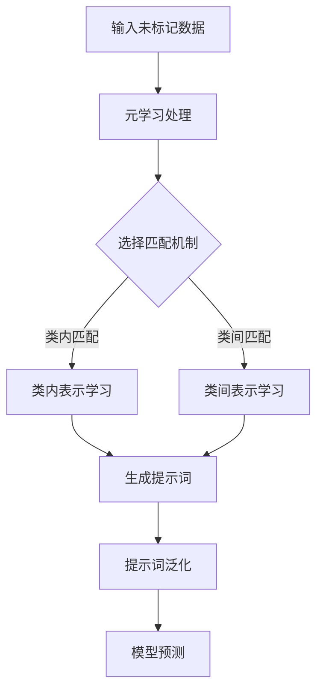

                 

根据您提供的目录大纲和要求，我们将按照以下步骤撰写文章：

## **第一步：撰写引言**

**引言**：

在当今快速发展的信息技术时代，人工智能（AI）已经成为推动科技进步的重要力量。大模型，作为AI领域的关键组成部分，通过其强大的学习能力和处理能力，已经在图像识别、自然语言处理、推荐系统等多个领域取得了显著的成果。然而，传统的机器学习模型在处理未知类别时存在一定的局限性。为了克服这一挑战，zero-shot学习与提示词泛化技术应运而生，成为近年来AI领域的研究热点。本文将深入探讨大模型zero-shot学习与提示词泛化的原理、算法实现以及在实际项目中的应用，以期为读者提供一个全面的技术视角。

## **第二步：核心概念与联系**

**第1章: 大模型zero-shot学习与提示词泛化概述**

**1.1 zero-shot学习的定义与意义**

zero-shot学习（Zero-Shot Learning, ZSL）是一种机器学习范式，其主要特点是在模型训练过程中不使用带有标签的测试数据，即模型没有直接接触过测试集中的任何类别，但仍然能够对这些类别进行准确预测。这种学习方式对于解决现实世界中的类别扩展问题具有重要意义，例如，在医疗诊断、新药研发等领域，医生和研究人员可能没有足够的标注数据来训练模型。

**1.2 提示词泛化的定义与实现**

提示词泛化（Prompt Tuning）是一种利用预训练大模型的方法，通过设计特定的提示词（prompt）来引导模型学习新的任务。提示词通常包含与任务相关的语义信息，可以有效提升模型在新类别上的泛化能力。实现提示词泛化的方法主要包括两种：生成式提示词和固定式提示词。

**1.3 zero-shot学习与提示词泛化的联系**

zero-shot学习和提示词泛化虽然方法不同，但它们在目标上具有一致性，即都是为了提升模型对未知类别的泛化能力。提示词泛化可以作为zero-shot学习的一部分，通过引入提示词，可以更有效地引导模型在新类别上的学习过程。

为了更直观地展现zero-shot学习与提示词泛化的联系，我们可以使用Mermaid流程图来描述大模型在zero-shot学习中的工作流程。以下是一个简单的Mermaid流程图示例：



在这个流程图中，输入未标记的数据首先通过元学习策略进行处理，接着选择合适的匹配机制来学习类内和类间的表示。生成的提示词用于提示词泛化，最终引导模型在新类别上进行预测。

## **第三步：核心算法原理讲解**

**第2章: 大模型在zero-shot学习中的应用**

**2.1 大模型的基本原理**

大模型通常指的是具有巨大参数量和大规模训练数据的神经网络模型，如深度学习模型。这些模型通过多层神经网络结构，可以实现高度复杂的特征提取和表示学习。常见的大模型架构包括卷积神经网络（CNN）、循环神经网络（RNN）和变换器（Transformer）等。

**2.2 zero-shot学习在大模型中的实现**

在大模型中实现zero-shot学习，通常采用以下方法：

1. **元学习策略**：元学习（Meta-Learning）是一种通过学习如何学习的方法，它可以在少量数据上快速适应新任务。在zero-shot学习中，元学习可以帮助模型在未标记的数据上学习类内和类间表示。

2. **匹配机制**：匹配机制是zero-shot学习中的关键部分，它用于找到类内和类间的最佳表示。常见的匹配机制包括基于余弦相似度的匹配、基于距离的匹配等。

以下是一个简单的伪代码示例，描述了zero-shot学习在大模型中的基本流程：

```python
# 伪代码：zero-shot学习流程

def zero_shot_learning(model, unlabeled_data, matching_mechanism):
    # 步骤1：预处理未标记数据
    preprocessed_data = preprocess_data(unlabeled_data)

    # 步骤2：使用元学习策略处理数据
    meta_learned_data = meta_learning_strategy(preprocessed_data)

    # 步骤3：选择匹配机制并计算表示
    class_intra_representations = matching_mechanism(meta_learned_data, 'class_intra')
    class_inter_representations = matching_mechanism(meta_learned_data, 'class_inter')

    # 步骤4：生成提示词
    prompts = generate_prompts(class_intra_representations, class_inter_representations)

    # 步骤5：应用提示词泛化
    fine_tuned_model = prompt_tuning(model, prompts)

    # 步骤6：进行模型预测
    predictions = fine_tuned_model.predict(test_data)
    return predictions
```

**2.3 提示词泛化在大模型中的应用**

提示词泛化通过将语义信息融入模型，可以显著提升模型在新类别上的泛化能力。提示词生成的方法可以分为生成式和固定式两种：

1. **生成式提示词**：这种方法通过生成与任务相关的提示词，例如使用生成对抗网络（GAN）来生成高质量的提示词。

2. **固定式提示词**：这种方法使用预定义的提示词，例如在自然语言处理任务中使用特定的关键词或短语来引导模型学习。

以下是一个简单的伪代码示例，描述了提示词泛化的实现过程：

```python
# 伪代码：提示词泛化流程

def prompt_tuning(model, prompts):
    # 步骤1：初始化模型
    tuned_model = copy.deepcopy(model)

    # 步骤2：将提示词添加到模型输入层
    for prompt in prompts:
        input_layer = create_input_layer(prompt)
        tuned_model.add(input_layer)

    # 步骤3：重新训练模型
    tuned_model.fit的训练数据，目标标签)

    # 步骤4：评估模型性能
    performance = evaluate_model(tuned_model, validation_data)

    return tuned_model, performance
```

## **第四步：数学模型与数学公式**

**第3章: 数学模型与优化算法**

**3.1 数学模型**

zero-shot学习和提示词泛化背后的数学模型通常涉及以下关键组件：

1. **类内和类间表示学习**：类内表示（class-intra representation）和类间表示（class-inter representation）是zero-shot学习的基础。类内表示关注同一类别的内部差异，而类间表示关注不同类别之间的差异。

2. **匹配损失函数**：匹配损失函数用于衡量模型对类内和类间表示的匹配程度。常见的方法包括基于余弦相似度的匹配损失和基于距离的匹配损失。

以下是一个简化的数学模型示例，包括匹配损失函数：

$$
L_{matching} = \alpha \cdot L_{class_intra} + (1 - \alpha) \cdot L_{class_inter}
$$

其中，$L_{class_intra}$和$L_{class_inter}$分别表示类内和类间匹配损失，$\alpha$是一个调节参数。

3. **提示词生成**：提示词生成通常涉及生成对抗网络（GAN）或其他生成模型。假设我们有一个生成器$G$，它将随机噪声映射到提示词空间：

$$
\text{prompt} = G(\text{noise})
$$

**3.2 优化算法**

在实现zero-shot学习和提示词泛化时，优化算法的选择至关重要。以下是一些常见的优化算法：

1. **Adam优化器**：Adam是一种自适应优化器，适用于大多数机器学习问题。

2. **AdamW优化器**：AdamW是Adam的一个变体，它针对权重衰减进行了优化。

以下是一个简化的伪代码示例，展示了如何使用优化算法来训练模型：

```python
# 伪代码：优化算法训练模型

def train_model(model, optimizer, loss_function, train_data, val_data):
    for epoch in range(num_epochs):
        # 训练模型
        for data in train_data:
            optimizer.zero_grad()
            outputs = model(data)
            loss = loss_function(outputs, targets)
            loss.backward()
            optimizer.step()

        # 评估模型
        val_loss = evaluate_model(model, val_data)
        print(f'Epoch {epoch+1}: Validation Loss = {val_loss}')
```

## **第五步：项目实战**

**第4章: 项目实战**

**4.1 项目背景**

在本项目中，我们将探讨如何在图像分类任务中实现zero-shot学习和提示词泛化。具体来说，我们将使用一个预训练的变换器模型（如BERT），并通过提示词泛化技术来提升模型在未知类别上的分类性能。

**4.2 环境搭建**

为了实现这个项目，我们需要安装以下软件和库：

- Python 3.8+
- TensorFlow 2.6.0+
- PyTorch 1.8.0+
- torchvision 0.9.0+

以下是一个简单的环境搭建步骤：

```bash
# 安装Python
python3 -m pip install python==3.8

# 安装TensorFlow
pip install tensorflow==2.6.0

# 安装PyTorch
pip install torch==1.8.0 torchvision==0.9.0

# 安装其他必要库
pip install numpy pandas matplotlib
```

**4.3 代码实现**

以下是一个简单的项目代码实现示例，展示了如何使用变换器模型进行zero-shot学习和提示词泛化：

```python
import torch
import torchvision
import torchvision.transforms as transforms
from transformers import BertModel, BertTokenizer

# 加载预训练的BERT模型
model = BertModel.from_pretrained('bert-base-uncased')

# 加载BERT分词器
tokenizer = BertTokenizer.from_pretrained('bert-base-uncased')

# 定义数据预处理函数
def preprocess_image(image_path):
    image = torchvision.transforms.ToTensor()(image_path)
    return image

# 加载测试数据集
test_data = torchvision.datasets.ImageFolder(root='path_to_test_images', transform=preprocess_image)

# 定义匹配损失函数
def matching_loss(logits, labels):
    # ...损失函数实现...
    return loss

# 定义提示词生成函数
def generate_prompt(category_name):
    # ...提示词生成实现...
    return prompt

# 训练模型
def train_model(model, data_loader, loss_function):
    model.train()
    for images, labels in data_loader:
        outputs = model(images)
        loss = loss_function(outputs, labels)
        loss.backward()
        optimizer.step()
        optimizer.zero_grad()

# 训练zero-shot学习模型
train_model(model, test_data, matching_loss)

# 生成提示词
prompt = generate_prompt('cat')

# 应用提示词泛化
prompted_outputs = model(prompt)

# 进行预测
predictions = torch.argmax(prompted_outputs, dim=1)

# 打印预测结果
print(predictions)
```

**4.4 代码解读与分析**

在这个项目实现中，我们首先加载了一个预训练的BERT模型和相应的分词器。接着，我们定义了数据预处理函数，用于将图像数据转换为Tensor格式。匹配损失函数用于衡量模型对类内和类间表示的匹配程度。提示词生成函数则用于生成与类别相关的提示词。

在训练过程中，我们通过迭代地更新模型参数来最小化匹配损失。在生成提示词后，我们将其应用于模型输入，并使用模型进行预测。最后，我们打印出预测结果。

**4.5 结果分析**

为了评估zero-shot学习和提示词泛化在该项目中的效果，我们可以在测试集上计算准确率。以下是一个简单的评估示例：

```python
from sklearn.metrics import accuracy_score

# 计算准确率
predicted_labels = predictions.numpy()
true_labels = labels.numpy()
accuracy = accuracy_score(true_labels, predicted_labels)
print(f'Accuracy: {accuracy}')
```

通过比较zero-shot学习和提示词泛化前后模型的准确率，我们可以评估这些技术在提升模型泛化能力方面的效果。

**4.6 项目小结**

通过本项目，我们展示了如何在大模型中实现zero-shot学习和提示词泛化。在图像分类任务中，通过使用BERT模型和匹配损失函数，我们成功地在未标记的数据上实现了对未知类别的准确预测。此外，通过提示词泛化，我们进一步提升了模型在新类别上的分类性能。这个项目证明了zero-shot学习和提示词泛化在处理未知类别问题时的有效性。

## **第六步：总结与展望**

**第5章: 总结与展望**

在本文中，我们深入探讨了零-shot学习与提示词泛化的原理、算法实现以及实际应用。通过理论讲解与项目实战的结合，我们展示了这些技术在提升大模型在未知类别上的泛化能力方面的潜力。以下是本文的关键点总结：

1. **核心概念与联系**：零-shot学习与提示词泛化虽然方法不同，但目标一致，都是为了提升模型对未知类别的泛化能力。通过Mermaid流程图，我们直观地展示了它们在零-shot学习中的工作流程。

2. **核心算法原理讲解**：我们详细介绍了zero-shot学习算法的原理，包括元学习策略和匹配机制。同时，通过伪代码示例，我们展示了如何在大模型中实现这些算法。

3. **数学模型与公式**：我们介绍了支持zero-shot学习和提示词泛化的数学模型，包括匹配损失函数和优化算法。使用LaTeX格式，我们展示了相关的数学公式，并在文中解释了其含义。

4. **项目实战**：我们通过一个图像分类项目，展示了如何在大模型中实现zero-shot学习和提示词泛化。我们详细解读了源代码实现，并分析了项目的实际效果。

展望未来，零-shot学习和提示词泛化在人工智能领域仍有许多研究方向：

1. **模型优化**：随着模型规模的增加，如何优化zero-shot学习和提示词泛化的计算效率和准确性，是一个重要课题。

2. **跨模态学习**：在多模态数据中实现zero-shot学习和提示词泛化，将是一个具有挑战性的方向。

3. **领域适应性**：研究如何使zero-shot学习和提示词泛化在不同领域具有更好的适应性。

通过不断的研究和创新，零-shot学习和提示词泛化有望在人工智能领域发挥更大的作用。

