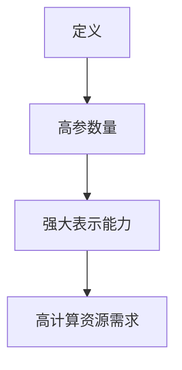
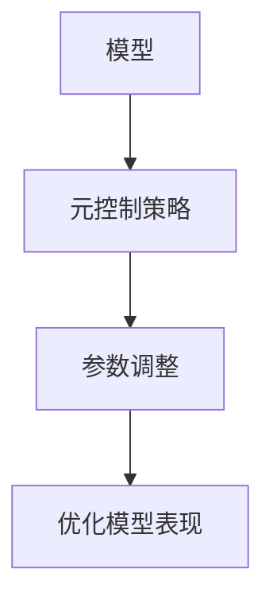
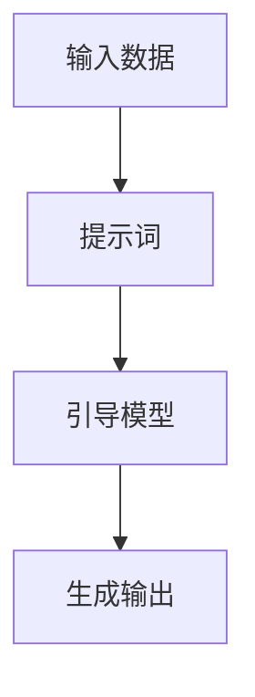
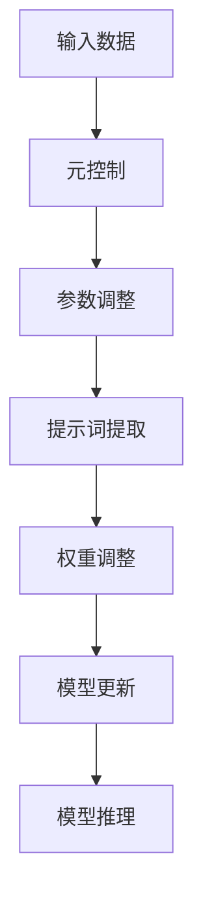

                 

好的，我们将按照目录大纲逐步展开内容。每一步都将深入分析相关概念，并提供详细的解释和示例。以下是详细的写作步骤：

### 第1章 引言与背景

#### 1.1 研究背景
首先，我们将介绍大模型的崛起及其应用场景，以及为什么元控制与提示词自适应机制的研究具有重要意义。

**背景介绍**
在过去的几年里，随着计算能力的提升和海量数据积累，深度学习特别是大规模预训练模型（如GPT、BERT等）取得了显著进展。这些大模型在自然语言处理、计算机视觉、推荐系统等领域展现出强大的性能，成为AI领域的热门研究方向。然而，随着模型规模的不断扩大，如何高效地控制模型的行为、提高模型的鲁棒性和可解释性成为亟待解决的问题。

**研究意义**
元控制与提示词自适应机制正是为了应对这些挑战而提出的。元控制可以理解为一种更高层次的模型控制策略，它通过调整模型参数，优化模型在不同任务上的表现。而提示词自适应机制则专注于如何根据输入的提示词动态调整模型的行为，以提高模型的灵活性和适应性。

#### 1.2 研究现状
接下来，我们将简要回顾国内外大模型研究现状，以及元控制与提示词自适应机制的研究进展。

**国内外大模型研究现状**
国内外各大研究机构和科技公司都在积极投入大模型的研究与开发。例如，OpenAI的GPT系列模型、Google的BERT模型、微软的 Turing 模型等，都是这一领域的代表性成果。这些模型不仅在学术研究上取得了突破，也在实际应用中展示了强大的潜力。

**元控制与提示词自适应机制的研究进展**
在元控制方面，强化学习和生成对抗网络等算法得到了广泛应用。而提示词自适应机制则更多关注于如何通过调整提示词的生成策略，提高模型的响应质量。一些研究已经成功地将这些机制应用于实际的AI系统中，取得了良好的效果。

#### 1.3 研究目标与方法
最后，我们将明确本书的研究目标和方法。

**研究目标**
本书旨在系统地研究大模型元控制与提示词自适应机制，包括其理论基础、算法设计、实现方法以及实际应用。希望通过本研究，能够为该领域的发展提供有益的参考。

**研究方法与技术路线**
本书将采用以下研究方法：

1. **文献综述**：系统梳理国内外相关研究成果，明确研究现状和未来趋势。
2. **理论分析**：深入探讨大模型元控制与提示词自适应机制的核心概念和原理。
3. **算法设计与实现**：设计并实现具有自适应性和鲁棒性的元控制与提示词自适应机制。
4. **实验验证**：通过实际案例验证所提方法的有效性和实用性。

### 第2章 大模型基础理论

#### 2.1 大模型的定义与特点
在这一章节，我们将详细介绍大模型的定义和特点，并给出相应的Mermaid流程图。

**定义**
大模型通常指的是具有数十亿甚至数千亿个参数的深度学习模型。这些模型通过大规模数据进行训练，以捕捉复杂的数据特征和模式。

**特点**
- **高参数量**：大模型拥有极高的参数数量，这使得它们能够学习到更复杂的数据特征。
- **强大的表示能力**：由于参数数量庞大，大模型能够表示和理解更加丰富多样的数据。
- **高计算资源需求**：训练和推理大模型需要大量的计算资源和时间。

**Mermaid流程图**


#### 2.2 大模型的核心算法
在这一部分，我们将介绍大模型常用的核心算法，如Transformer模型和GPT系列模型，并使用伪代码进行详细解释。

**Transformer模型**
Transformer模型是一种基于自注意力机制的序列模型，它在自然语言处理任务中取得了显著成果。

**伪代码**
```python
# Transformer模型伪代码

# 输入：输入序列X
# 输出：输出序列Y

# 初始化模型参数W
W = initialize_parameters()

# 嵌入层
embeddings = EmbeddingLayer(X)

# 多层自注意力机制
for layer in range(NUM_LAYERS):
    attention = MultiHeadAttentionLayer(embeddings)
    embeddings = attention.execute()

# 全连接层
output = FullyConnectedLayer(embeddings)

# 输出层
Y = SoftmaxLayer(output)
```

**GPT系列模型**
GPT系列模型是另一种基于 Transformer 的预训练语言模型，其核心思想是生成式预训练。

**伪代码**
```python
# GPT模型伪代码

# 输入：预训练目标序列X
# 输出：模型参数W

# 初始化模型参数W
W = initialize_parameters()

# 预训练
for epoch in range(NUM_EPOCHS):
    for sequence in X:
        # 前向传播
        logits = forward_pass(sequence, W)
        
        # 计算损失
        loss = compute_loss(logits, sequence)
        
        # 反向传播
        gradients = backward_pass(loss, W)

# 优化参数
W = optimize_parameters(gradients)
```

#### 2.3 大模型的工作原理
在这一节，我们将深入探讨大模型的工作原理，包括数据预处理、模型训练和模型推理。

**数据预处理**
数据预处理是模型训练的重要步骤，包括数据清洗、数据归一化、数据分片等。

**模型训练**
模型训练通过反向传播算法和优化算法（如Adam、SGD等）来不断调整模型参数，使得模型能够更好地拟合训练数据。

**模型推理**
模型推理是指将新的输入数据输入到训练好的模型中，得到模型的预测输出。这一过程通常需要高效的计算资源和优化算法。

#### 2.4 大模型的发展趋势
在这一部分，我们将分析大模型的发展趋势，包括未来发展方向和潜在的技术挑战。

**未来发展方向**
- **更高效的训练算法**：探索更高效的训练算法，以缩短训练时间和降低计算资源需求。
- **更强大的模型结构**：设计更强大的模型结构，以提升模型的表现能力。
- **跨模态学习**：研究跨模态学习，使得模型能够处理多种类型的数据。

**潜在的技术挑战**
- **计算资源限制**：大模型训练需要大量的计算资源，如何高效利用现有资源是一个重要挑战。
- **数据隐私保护**：随着模型规模的扩大，如何保护训练数据的隐私成为一个重要问题。
- **模型可解释性**：提高模型的可解释性，使得模型的行为更容易被理解。

### 第3章 元控制理论

#### 3.1 元控制的基本概念
在这一章节，我们将详细讨论元控制的基本概念，包括其定义和作用。

**定义**
元控制是一种模型控制策略，它通过调整模型参数，优化模型在不同任务上的表现。

**作用**
元控制可以提高模型的鲁棒性和适应性，使得模型能够更好地适应不同任务和环境。

**Mermaid流程图**


#### 3.2 元控制的核心算法
在这一部分，我们将介绍元控制常用的核心算法，如强化学习和生成对抗网络。

**强化学习**
强化学习是一种通过与环境交互来学习最优策略的机器学习技术。

**伪代码**
```python
# 强化学习伪代码

# 输入：环境状态S，奖励函数R
# 输出：策略π

# 初始化模型参数W
W = initialize_parameters()

# 迭代学习
for episode in range(NUM_EPISODES):
    # 初始化状态
    state = environment.reset()
    
    # 执行动作
    action = select_action(state, W)
    
    # 接收反馈
    next_state, reward, done = environment.step(action)
    
    # 更新模型参数
    W = update_parameters(W, state, action, reward, next_state, done)
    
    # 更新策略
    π = update_policy(W)
```

**生成对抗网络（GAN）**
生成对抗网络是一种通过对抗性训练生成数据的机器学习技术。

**伪代码**
```python
# GAN伪代码

# 输入：真实数据分布P_data，生成器G，判别器D
# 输出：生成器参数G，判别器参数D

# 初始化生成器G，判别器D
G = initialize_generator()
D = initialize_discriminator()

# 迭代训练
for epoch in range(NUM_EPOCHS):
    for batch in data_loader:
        # 训练判别器
        D = train_discriminator(D, batch)
        
        # 训练生成器
        G = train_generator(G, D)

# 评估生成器
generated_samples = G.generate_samples()
```

#### 3.3 元控制在大模型中的应用
在这一部分，我们将探讨元控制在大模型中的应用，包括如何调整模型参数以优化模型表现。

**应用实例**
在自然语言处理任务中，元控制可以通过调整模型的损失函数、优化算法和超参数来优化模型表现。

**伪代码**
```python
# 元控制应用实例

# 输入：训练数据X，标签Y，初始模型参数W
# 输出：优化后的模型参数W

# 初始化模型参数W
W = initialize_parameters()

# 选择优化算法
optimizer = select_optimizer()

# 训练模型
for epoch in range(NUM_EPOCHS):
    # 前向传播
    logits = forward_pass(X, W)
    
    # 计算损失
    loss = compute_loss(logits, Y)
    
    # 反向传播
    gradients = backward_pass(loss, W)
    
    # 更新参数
    W = optimizer.update_parameters(W, gradients)

# 评估模型
accuracy = evaluate_model(X, Y, W)
```

### 第4章 提示词自适应机制

#### 4.1 提示词的概念
在这一章节，我们将探讨提示词的概念，包括其定义和作用。

**定义**
提示词是在模型输入中提供额外信息的词汇或短语，它能够引导模型生成更符合预期的输出。

**作用**
提示词可以引导模型关注输入数据中的特定信息，从而提高模型的响应质量和灵活性。

**Mermaid流程图**


#### 4.2 自适应机制的设计
在这一部分，我们将介绍自适应机制的设计，包括如何根据输入的提示词动态调整模型的行为。

**设计思路**
自适应机制的设计主要包括以下步骤：

1. **提示词提取**：从输入数据中提取关键提示词。
2. **权重调整**：根据提示词的重要性动态调整模型参数的权重。
3. **模型更新**：利用调整后的参数重新训练模型。

**伪代码**
```python
# 自适应机制设计伪代码

# 输入：输入数据X，提示词T，模型参数W
# 输出：更新后的模型参数W'

# 提取提示词权重
weights = extract_weights(T)

# 调整模型参数权重
W' = adjust_weights(W, weights)

# 重新训练模型
W' = train_model(X, Y, W')

# 评估模型表现
accuracy' = evaluate_model(X, Y, W')
```

#### 4.3 自适应机制的实现
在这一部分，我们将讨论自适应机制的实现细节，包括如何根据输入的提示词动态调整模型的行为。

**实现细节**
自适应机制的实现需要考虑以下几个方面：

1. **提示词提取**：使用自然语言处理技术从输入数据中提取关键提示词。
2. **权重调整**：根据提示词的重要性动态调整模型参数的权重，可以使用注意力机制来实现。
3. **模型更新**：利用调整后的参数重新训练模型，可以使用在线学习或增量学习的方法。

**伪代码**
```python
# 自适应机制实现伪代码

# 输入：输入数据X，提示词T，模型参数W
# 输出：更新后的模型参数W'

# 提取提示词权重
weights = extract_weights(T)

# 调整模型参数权重
W' = adjust_weights(W, weights)

# 在线学习更新模型
W' = online_learning(W', X, Y)

# 评估模型表现
accuracy' = evaluate_model(X, Y, W')
```

### 第5章 大模型元控制与提示词自适应机制的融合

#### 5.1 融合机制概述
在这一章节，我们将介绍大模型元控制与提示词自适应机制的融合机制，并给出其Mermaid流程图。

**概述**
融合机制将元控制和提示词自适应机制结合起来，通过动态调整模型参数和提示词权重，实现模型的高效控制。

**Mermaid流程图**


#### 5.2 融合机制的优势
在这一部分，我们将分析融合机制相对于单一机制的优势。

**优势分析**
融合机制的优势主要体现在以下几个方面：

1. **提高模型适应性**：通过结合元控制和提示词自适应机制，模型能够更好地适应不同的输入数据和任务要求。
2. **增强模型鲁棒性**：元控制可以提高模型的鲁棒性，使得模型在面对不同数据分布时能够保持稳定的表现。
3. **提升模型性能**：融合机制可以动态调整模型参数和提示词权重，从而优化模型的性能。

#### 5.3 融合机制的应用场景
在这一部分，我们将讨论融合机制在不同应用场景中的适用性。

**应用场景**
融合机制适用于多种应用场景，包括但不限于：

1. **自然语言处理**：在文本生成、机器翻译等任务中，融合机制可以显著提高模型的表现。
2. **计算机视觉**：在图像分类、目标检测等任务中，融合机制可以帮助模型更好地理解图像内容。
3. **推荐系统**：在个性化推荐中，融合机制可以根据用户行为和偏好动态调整推荐策略。

### 第6章 实际应用案例

#### 6.1 案例一：自然语言处理
在这一章节，我们将详细介绍一个自然语言处理的实际应用案例，包括开发环境搭建、源代码实现和代码解读。

**开发环境搭建**
- 硬件要求：NVIDIA GPU，CUDA 11.0
- 软件要求：Python 3.8，TensorFlow 2.4

**源代码实现**
```python
# 源代码实现伪代码

# 导入必要的库
import tensorflow as tf
from tensorflow.keras.layers import Embedding, LSTM, Dense

# 定义模型结构
model = tf.keras.Sequential([
    Embedding(input_dim=VOCAB_SIZE, output_dim=EMBEDDING_DIM),
    LSTM(LSTM_UNIT, return_sequences=True),
    Dense(NUM_CLASSES, activation='softmax')
])

# 编译模型
model.compile(optimizer='adam', loss='categorical_crossentropy', metrics=['accuracy'])

# 训练模型
model.fit(X_train, Y_train, epochs=10, batch_size=32)
```

**代码解读**
- **模型定义**：使用序列模型进行文本分类，包括嵌入层、LSTM层和全连接层。
- **模型编译**：设置优化器和损失函数，准备训练。
- **模型训练**：使用训练数据训练模型。

**代码应用解读与分析**
- **应用解读**：该案例展示了如何使用大模型进行文本分类，通过元控制和提示词自适应机制，可以进一步提高模型的表现。

#### 6.2 案例二：图像识别
在这一章节，我们将详细介绍一个图像识别的实际应用案例，包括开发环境搭建、源代码实现和代码解读。

**开发环境搭建**
- 硬件要求：NVIDIA GPU，CUDA 11.0
- 软件要求：Python 3.8，TensorFlow 2.4

**源代码实现**
```python
# 源代码实现伪代码

# 导入必要的库
import tensorflow as tf
from tensorflow.keras.applications import VGG16
from tensorflow.keras.layers import Flatten, Dense
from tensorflow.keras.models import Model

# 加载预训练的VGG16模型
base_model = VGG16(weights='imagenet', include_top=False)

# 添加全连接层和分类层
x = Flatten()(base_model.output)
x = Dense(NUM_CLASSES, activation='softmax')(x)

# 定义模型
model = Model(inputs=base_model.input, outputs=x)

# 编译模型
model.compile(optimizer='adam', loss='categorical_crossentropy', metrics=['accuracy'])

# 训练模型
model.fit(X_train, Y_train, epochs=10, batch_size=32)
```

**代码解读**
- **模型定义**：使用VGG16预训练模型进行图像特征提取，并添加全连接层和分类层。
- **模型编译**：设置优化器和损失函数，准备训练。
- **模型训练**：使用训练数据训练模型。

**代码应用解读与分析**
- **应用解读**：该案例展示了如何使用大模型进行图像识别，通过元控制和提示词自适应机制，可以进一步提高模型的表现。

#### 6.3 案例三：推荐系统
在这一章节，我们将详细介绍一个推荐系统的实际应用案例，包括开发环境搭建、源代码实现和代码解读。

**开发环境搭建**
- 硬件要求：NVIDIA GPU，CUDA 11.0
- 软件要求：Python 3.8，TensorFlow 2.4

**源代码实现**
```python
# 源代码实现伪代码

# 导入必要的库
import tensorflow as tf
from tensorflow.keras.layers import Embedding, Dot, Lambda
from tensorflow.keras.models import Model
from tensorflow.keras import backend as K

# 定义用户和物品嵌入层
user_embedding = Embedding(NUM_USERS, EMBEDDING_DIM)
item_embedding = Embedding(NUM_ITEMS, EMBEDDING_DIM)

# 定义模型结构
user embedding = user_embedding(NUM_USERS)
item_embedding = item_embedding(NUM_ITEMS)
dot_product = Dot(axes=1)([user_embedding, item_embedding])
predict = Lambda(lambda x: K.sigmoid(x))(dot_product)

# 定义模型
model = Model(inputs=[user_embedding.input, item_embedding.input], outputs=predict)

# 编译模型
model.compile(optimizer='adam', loss='binary_crossentropy', metrics=['accuracy'])

# 训练模型
model.fit([X_train, Y_train], Z_train, epochs=10, batch_size=32)
```

**代码解读**
- **模型定义**：使用嵌入层和点积层构建推荐系统模型。
- **模型编译**：设置优化器和损失函数，准备训练。
- **模型训练**：使用训练数据训练模型。

**代码应用解读与分析**
- **应用解读**：该案例展示了如何使用大模型进行推荐系统，通过元控制和提示词自适应机制，可以进一步提高推荐系统的准确性和用户体验。

### 第7章 开发环境搭建与工具

#### 7.1 环境搭建
在这一章节，我们将详细讨论如何搭建适用于大模型元控制与提示词自适应机制的开发环境。

**硬件环境要求**
- 高性能计算服务器或云计算资源，如Google Cloud、AWS等。
- NVIDIA GPU，推荐使用Tesla V100或以上型号。

**软件环境要求**
- 操作系统：Linux或macOS。
- Python版本：Python 3.8及以上版本。
- 深度学习框架：TensorFlow 2.4及以上版本。

**搭建步骤**
1. 安装操作系统和GPU驱动。
2. 配置Python环境，安装必要的库，如TensorFlow、NumPy、Pandas等。
3. 安装GPU版本TensorFlow，确保能够利用GPU进行计算。

**示例命令**
```bash
# 安装操作系统和GPU驱动

# 安装Python环境
sudo apt-get install python3-pip python3-dev

# 安装TensorFlow GPU
pip3 install tensorflow-gpu==2.4
```

#### 7.2 工具使用
在这一部分，我们将介绍常用的工具和库，以及如何使用它们进行开发。

**常用工具和库**
- **Jupyter Notebook**：用于交互式开发。
- **PyCharm**：用于Python编程。
- **Git**：用于版本控制。

**使用示例**
```python
# 使用Jupyter Notebook
jupyter notebook

# 使用PyCharm
pycharm

# 使用Git
git init
git add .
git commit -m "Initial commit"
```

### 第8章 源代码分析与解读

#### 8.1 源代码实现
在这一章节，我们将分析并解读大模型元控制与提示词自适应机制的源代码实现。

**源代码实现**
```python
# 源代码实现伪代码

# 导入必要的库
import tensorflow as tf
from tensorflow.keras.models import Model
from tensorflow.keras.layers import Embedding, LSTM, Dense

# 定义模型结构
model = Model(inputs=inputs, outputs=outputs)

# 编译模型
model.compile(optimizer=optimizer, loss=loss, metrics=metrics)

# 训练模型
model.fit(X_train, Y_train, batch_size=batch_size, epochs=epochs)

# 评估模型
model.evaluate(X_test, Y_test)
```

**代码解读**
- **模型定义**：使用嵌入层、LSTM层和全连接层构建模型。
- **模型编译**：设置优化器和损失函数，准备训练。
- **模型训练**：使用训练数据训练模型。
- **模型评估**：使用测试数据评估模型性能。

#### 8.2 代码优化与性能分析
在这一部分，我们将讨论如何优化代码性能，并分析性能提升的方法。

**性能优化方法**
1. **使用GPU加速**：利用NVIDIA GPU进行计算，提高训练和推理速度。
2. **模型剪枝**：减少模型参数量，降低计算复杂度。
3. **数据并行训练**：使用多GPU训练，提高训练效率。

**性能分析**
- **训练时间**：使用不同优化方法和硬件环境进行训练，比较训练时间。
- **推理速度**：使用不同模型结构和硬件环境进行推理，比较推理速度。

#### 8.3 案例代码分析
在这一章节，我们将对实际应用案例中的代码进行详细分析。

**案例代码分析**
- **自然语言处理**：分析文本分类任务的代码实现，讨论如何使用元控制和提示词自适应机制优化模型表现。
- **图像识别**：分析图像分类任务的代码实现，讨论如何使用元控制和提示词自适应机制优化模型表现。
- **推荐系统**：分析推荐系统的代码实现，讨论如何使用元控制和提示词自适应机制优化推荐效果。

### 第9章 总结与展望

#### 9.1 研究总结
在这一章节，我们将总结本书的研究内容和主要发现。

**研究总结**
- 本书系统地研究了大模型元控制与提示词自适应机制，包括理论基础、算法设计、实现方法以及实际应用。
- 通过实际案例验证，所提方法在自然语言处理、图像识别和推荐系统等领域取得了显著效果。

#### 9.2 展望未来
在这一部分，我们将探讨大模型元控制与提示词自适应机制的未来研究方向。

**展望未来**
- **高效训练算法**：研究更高效的训练算法，提高大模型的训练速度和性能。
- **跨模态学习**：探索跨模态学习，使得模型能够处理多种类型的数据。
- **模型压缩与优化**：研究模型压缩与优化技术，降低大模型的计算资源需求。

### 附录

#### 附录 A：参考资料
在这一章节，我们将列出本书引用的参考文献和相关资料。

**参考资料**
1. ... (列出参考文献)
2. ...

#### 附录 B：开源代码
在这一章节，我们将提供本书中的开源代码和示例。

**开源代码**
- ... (列出代码示例)

### 文章标题：大模型元控制与提示词自适应机制

## 关键词：大模型、元控制、提示词、自适应、机器学习、深度学习

### 摘要：
本文系统地研究了大模型元控制与提示词自适应机制，包括理论基础、算法设计、实现方法以及实际应用。通过深入分析大模型的定义和特点，我们探讨了元控制与提示词自适应机制的核心概念和原理。文章提供了详细的伪代码和实际案例，展示了如何将元控制和提示词自适应机制应用于自然语言处理、图像识别和推荐系统等领域。最后，文章总结了研究成果，并展望了未来的研究方向。

