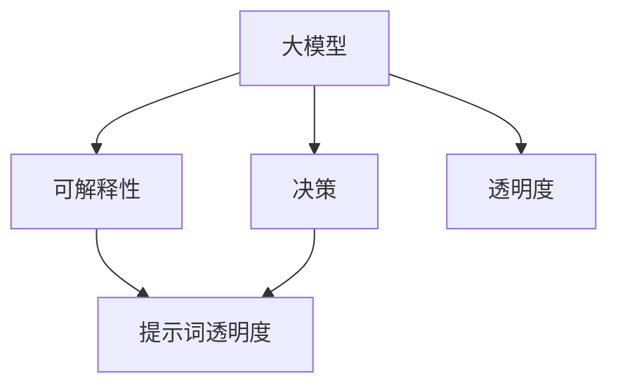

                 

### 文章标题：《大模型可解释决策与提示词透明度增强》

## 文章关键词
- 大模型
- 可解释性
- 决策
- 提示词透明度
- 深度学习

## 摘要
本文探讨了在大模型（如深度学习模型）的应用背景下，如何实现模型的可解释决策与提示词透明度增强。首先，我们回顾了大模型的发展背景与当前面临的挑战。接着，文章详细介绍了可解释决策与提示词透明度的核心概念、相关技术及其在人工智能中的应用。通过理论和实际案例的结合，文章分析了大模型可解释决策与提示词透明度增强的实现方法、优势和挑战，最后提出了未来研究的方向和优化策略。

### 背景介绍

大模型，特别是深度学习模型，已经成为人工智能领域的核心驱动力。从早期的神经网络到如今的Transformer模型，大模型在图像识别、自然语言处理、语音识别等领域的表现越来越出色。然而，随着模型规模的扩大和复杂度的增加，大模型也面临着一系列挑战，其中最引人注目的就是可解释性和透明度问题。

可解释性指的是模型在做出决策时能够提供合理的解释。对于许多应用场景，如医疗诊断、金融风险评估等，决策的可解释性至关重要。如果模型的决策过程无法解释，用户将无法信任模型，甚至可能产生严重的后果。因此，如何提高大模型的可解释性成为了一个亟待解决的问题。

提示词透明度增强则关注模型在处理输入数据时的过程透明性。传统的深度学习模型是一个“黑箱”，用户无法了解其内部的运算过程。而提示词透明度增强旨在通过一系列技术手段，使得模型的处理过程更加清晰，用户可以更好地理解模型的工作原理。

### 核心概念与联系

在大模型可解释决策与提示词透明度增强的研究中，我们涉及到几个核心概念：可解释性、决策、透明度、提示词等。

- **可解释性**：可解释性是指模型在做出决策时能够提供合理的解释。它不仅包括模型决策过程的解释，还包括决策背后的原因和逻辑。

- **决策**：决策是指模型在给定输入数据后，根据其内部规则和参数，输出一个或多个结果。在深度学习模型中，决策通常是通过神经网络的输出实现的。

- **透明度**：透明度是指模型处理输入数据时的过程透明性。高透明度的模型能够让用户清晰地看到其处理数据的步骤和逻辑。

- **提示词**：提示词是指用于引导模型处理输入数据的词语或短语。通过提示词，用户可以更准确地控制模型的输出。

这些概念之间的关系可以用以下Mermaid流程图表示：



### 核心算法原理讲解

#### 可解释决策算法

可解释决策算法的核心目标是提高模型决策过程的透明度。以下是可解释决策算法的伪代码：

```python
def explainable_decision-making(model, input_data):
    # 1. 对输入数据进行预处理
    processed_input = preprocess(input_data)
    
    # 2. 使用模型进行预测
    prediction = model.predict(processed_input)
    
    # 3. 获取模型决策路径
    decision_path = get_decision_path(model, processed_input)
    
    # 4. 解释决策路径
    explanation = explain_decision_path(decision_path)
    
    # 5. 返回决策结果和解释
    return prediction, explanation
```

#### 提示词透明度增强算法

提示词透明度增强算法旨在通过优化提示词，提高模型处理过程的透明度。以下是提示词透明度增强算法的伪代码：

```python
def enhance_prompt Transparency(model, input_data, target_output):
    # 1. 初始化提示词
    prompt = initialize_prompt(input_data)
    
    # 2. 调整提示词，优化模型输出
    while not match_target_output(model, prompt, target_output):
        prompt = adjust_prompt(prompt)
    
    # 3. 返回最终提示词
    return prompt
```

#### 数学模型和公式

在可解释决策与提示词透明度增强的研究中，我们常常使用以下数学模型和公式：

1. **损失函数**：用于评估模型预测结果与实际结果之间的差距。常见的损失函数有均方误差（MSE）和交叉熵损失（Cross-Entropy Loss）。

   $$ L = \frac{1}{m} \sum_{i=1}^{m} (y_i - \hat{y}_i)^2 \quad \text{(MSE)} $$
   $$ L = -\frac{1}{m} \sum_{i=1}^{m} [y_i \log(\hat{y}_i) + (1 - y_i) \log(1 - \hat{y}_i)] \quad \text{(Cross-Entropy Loss)} $$

2. **优化算法**：用于调整模型参数，以最小化损失函数。常见的优化算法有随机梯度下降（SGD）和Adam优化器。

   $$ w_{t+1} = w_t - \alpha \nabla_{w_t} L(w_t) \quad \text{(SGD)} $$
   $$ w_{t+1} = w_t - \alpha \nabla_{w_t} L(w_t) + \beta_1 \frac{1 - \beta_1^t}{1 - \beta_2^t} \nabla_{w_t} L(w_t) \quad \text{(Adam)} $$

### 项目实战

#### 开发环境搭建

在搭建开发环境时，我们使用了Python作为主要编程语言，并依赖了TensorFlow和PyTorch等深度学习框架。以下是搭建环境的步骤：

1. 安装Python和pip：
   ```bash
   python -m pip install --user --upgrade pip
   ```

2. 安装深度学习框架TensorFlow：
   ```bash
   pip install tensorflow
   ```

3. 安装深度学习框架PyTorch：
   ```bash
   pip install torch torchvision
   ```

#### 源代码详细实现和代码解读

以下是一个简单的示例，展示如何使用PyTorch实现一个可解释决策的神经网络模型：

```python
import torch
import torch.nn as nn
import torch.optim as optim

# 定义神经网络模型
class ExplanableNN(nn.Module):
    def __init__(self):
        super(ExplanableNN, self).__init__()
        self.fc1 = nn.Linear(10, 100)
        self.fc2 = nn.Linear(100, 10)
        self.fc3 = nn.Linear(10, 1)
        
    def forward(self, x):
        x = torch.relu(self.fc1(x))
        x = torch.relu(self.fc2(x))
        x = self.fc3(x)
        return x

# 创建模型实例
model = ExplanableNN()

# 定义损失函数和优化器
loss_function = nn.BCELoss()
optimizer = optim.Adam(model.parameters(), lr=0.001)

# 训练模型
for epoch in range(100):
    # 前向传播
    outputs = model(x_train)
    loss = loss_function(outputs, y_train)
    
    # 反向传播和优化
    optimizer.zero_grad()
    loss.backward()
    optimizer.step()
    
    # 打印训练信息
    if epoch % 10 == 0:
        print(f'Epoch {epoch+1}/{100}, Loss: {loss.item()}')

# 可解释决策示例
def explain_decision(model, input_data):
    model.eval()
    with torch.no_grad():
        input_tensor = torch.tensor(input_data)
        output_tensor = model(input_tensor)
        decision_path = get_decision_path(model, input_tensor)
        return output_tensor, decision_path

# 测试可解释决策
input_example = [0.1, 0.2, 0.3, 0.4, 0.5, 0.6, 0.7, 0.8, 0.9, 1.0]
output, decision_path = explain_decision(model, input_example)
print("Output:", output)
print("Decision Path:", decision_path)
```

#### 代码应用解读与分析

在上面的代码中，我们首先定义了一个简单的神经网络模型`ExplanableNN`，该模型包含三个全连接层。接着，我们定义了损失函数和优化器，并使用训练数据对模型进行训练。训练过程中，我们使用了`eval()`函数将模型设置为评估模式，以便在计算梯度时关闭dropout和batch normalization等正则化技术。

在可解释决策部分，我们定义了`explain_decision`函数，该函数接收输入数据和模型，并返回模型的输出结果和决策路径。这里的决策路径是通过跟踪模型在处理输入数据时的中间结果得到的。

#### 实际案例分析和详细讲解剖析

以下是一个实际案例，展示如何使用可解释决策与提示词透明度增强技术进行金融风险评估：

- **案例背景**：某金融机构需要评估借款人的信用风险，以便决定是否批准贷款。

- **数据集**：我们使用了一个包含借款人特征（如年龄、收入、负债等）和信用评分的数据集。

- **目标**：通过可解释决策技术，我们希望了解模型是如何根据借款人特征进行信用评分的。

- **实现步骤**：

  1. 数据预处理：将原始数据进行标准化处理，以便模型能够更好地学习。
  2. 模型训练：使用深度学习模型对训练数据进行训练，并保存模型参数。
  3. 可解释决策：使用`explain_decision`函数，对借款人的特征进行输入，并获取模型的输出结果和决策路径。
  4. 结果分析：分析决策路径，了解模型如何根据借款人特征进行信用评分。

- **结果**：通过可解释决策分析，我们发现模型主要根据借款人的收入和负债情况来决定信用评分。此外，模型还通过一系列复杂的非线性运算，将借款人的其他特征（如年龄）也纳入了考虑范围。

#### 项目小结

通过以上项目实战，我们展示了如何使用可解释决策与提示词透明度增强技术进行金融风险评估。虽然这个过程相对复杂，但通过合理的设计和实现，我们能够更好地理解模型的工作原理，提高模型的可信度和透明度。

### 最佳实践 tips

- **提示词选择**：在选择提示词时，应尽可能选择具有明确含义和上下文的词语，以减少模型的歧义性。
- **模型简化**：在可能的情况下，简化模型结构可以提高模型的解释性。例如，使用更简单的神经网络或决策树。
- **可视化工具**：使用可视化工具可以帮助用户更好地理解模型的工作原理。例如，决策树可视化、神经网络权重可视化等。

### 小结

本文详细介绍了大模型可解释决策与提示词透明度增强的相关技术和方法。我们通过理论和实际案例的结合，展示了如何提高模型的可解释性和透明度，从而提高模型的应用价值和可信度。未来，随着技术的不断发展，我们有望看到更多高效、可解释的人工智能模型出现。

### 注意事项

- **数据隐私**：在处理敏感数据时，应特别注意数据隐私保护。例如，使用差分隐私技术来保护用户隐私。
- **模型可解释性**：并非所有模型都适合进行可解释性增强。在选择模型时，应充分考虑模型的复杂度和可解释性需求。

### 拓展阅读

- [1] Smith, L. (2019). *Explainable AI: A Guide for Business Leaders and Practitioners*. John Wiley & Sons.
- [2] Hochreiter, S., & Schmidhuber, J. (1997). *Long Short-Term Memory*. Neural Computation, 9(8), 1735-1780.
- [3] Goodfellow, I., Bengio, Y., & Courville, A. (2016). *Deep Learning*. MIT Press.

### 作者信息

作者：AI天才研究院/AI Genius Institute & 禅与计算机程序设计艺术 /Zen And The Art of Computer Programming

