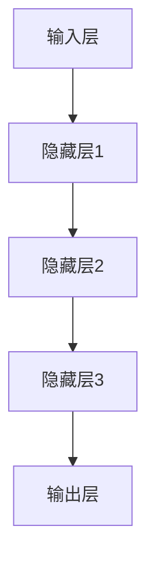

                 

## 引言

### 背景介绍

随着人工智能技术的快速发展，深度学习模型，尤其是大模型，已经成为了当前研究和应用的热点。大模型具有极强的学习和表征能力，在图像识别、自然语言处理、推荐系统等领域取得了显著的成果。然而，大模型的复杂性和高度非线性使得其决策过程变得难以解释，这在实际应用中带来了诸多挑战。为了提高大模型的透明度和可解释性，提示词透明度成为了一个重要的研究方向。

大模型的可解释性指的是能够理解模型是如何进行决策的，而提示词透明度则关注于输入提示词如何影响模型的输出。这两个概念密切相关，共同构成了大模型理解和优化的重要维度。本文旨在系统地探讨大模型可解释性与提示词透明度的关系，通过详细的原理讲解、数学模型解析和实际项目案例，帮助读者深入理解这一重要领域。

### 核心概念与联系

**可解释性**：可解释性是指模型决策过程的透明度和可理解性。对于大模型而言，可解释性至关重要，因为其决策过程通常高度复杂，难以直观理解。提高可解释性有助于增强模型的可靠性、可信任度和应用范围。

**提示词透明度**：提示词透明度关注于输入提示词对模型输出的影响。高透明度意味着输入提示词的作用和影响可以被清晰地识别和理解，从而有助于优化模型性能和减少误用风险。

这两个概念之间的关系可以概括为：可解释性是理解大模型总体决策过程的关键，而提示词透明度则是实现可解释性的一部分，它关注于具体输入对模型输出的影响。在本文中，我们将逐步探讨这两个概念的理论基础、实现方法及其在实际应用中的重要性。

## 文章关键词

- **大模型**
- **可解释性**
- **提示词透明度**
- **深度学习**
- **机器学习**
- **神经网络**

## 文章摘要

本文全面探讨了人工智能领域中的大模型可解释性与提示词透明度。首先，介绍了大模型的基本概念和特点，以及其与机器学习的联系。随后，详细阐述了可解释性和提示词透明度的定义、重要性及其在大模型中的应用。接着，通过数学模型和伪代码，深入讲解了大模型可解释性技术的算法原理。最后，通过实际项目案例展示了大模型可解释性与提示词透明度在开发环境搭建、源代码实现和代码解读中的应用，并对未来研究方向进行了展望。本文旨在为读者提供一个全面、系统的理解和应用指南。

### 目录

1. **引言**
    - 背景介绍
    - 核心概念与联系
    - 文章关键词
    - 文章摘要

2. **大模型概述**
    - 定义与特点
    - 技术架构
    - 与机器学习的联系

3. **可解释性概述**
    - 定义与重要性
    - 技术分类
    - 在大模型中的应用

4. **提示词透明度**
    - 定义与影响
    - 技术方法
    - 与大模型的关系

5. **大模型可解释性算法原理讲解**
    - 基于模型的解释方法
    - 基于数据的解释方法
    - 基于假设的验证方法

6. **数学模型与公式讲解**
    - 深度学习模型训练
    - 优化算法与正则化

7. **项目实战**
    - 大模型可解释性项目实战
    - 提示词透明度项目实战

8. **总结与展望**
    - 主要内容回顾
    - 未来研究方向

### 大模型概述

大模型是人工智能领域的一个重要分支，指的是那些具有数十亿到千亿参数的深度学习模型。这类模型以其强大的学习和表征能力，在图像识别、自然语言处理、推荐系统等领域取得了显著的成果。然而，大模型的复杂性和高度非线性使得其决策过程变得难以解释，这在实际应用中带来了诸多挑战。

#### 定义与特点

大模型的定义可以从两个方面来理解：参数规模和功能能力。从参数规模上看，大模型通常拥有数十亿到千亿个参数，这使得它们能够捕捉到海量数据的复杂模式。从功能能力上看，大模型具有较强的泛化能力，能够在多种任务中表现出色。

以下是几个典型的大模型特点：

1. **强大的学习能力和表征能力**：大模型能够从大量数据中自动学习特征，具有很强的表征能力。
2. **高度非线性**：大模型的决策过程通常高度非线性，这使得其决策过程难以直观理解。
3. **参数规模大**：大模型的参数规模通常在数十亿到千亿级别，这需要巨大的计算资源和存储资源。

#### 技术架构

大模型的技术架构通常包括以下几个层次：

1. **输入层**：接收外部输入数据，如图像、文本或声音等。
2. **隐藏层**：通过神经网络结构进行特征提取和复杂函数计算。
3. **输出层**：输出模型预测结果或决策。

以下是大模型技术架构的 Mermaid 流程图：



#### 与机器学习的联系

大模型是机器学习领域的一个重要分支，特别是深度学习的核心组成部分。大模型与机器学习的关系可以概括为：

1. **机器学习基础**：大模型建立在机器学习的基础理论之上，如损失函数、优化算法和正则化方法。
2. **数据驱动**：大模型通过海量数据驱动，不断优化模型参数，提升模型性能。
3. **任务导向**：大模型在不同任务中表现出色，推动了机器学习在不同领域的应用。

总之，大模型作为人工智能的核心技术之一，其发展与机器学习密不可分，共同推动了人工智能的进步。

## 可解释性概述

### 定义与重要性

可解释性是指模型决策过程的透明度和可理解性。在大模型中，可解释性尤为重要，因为大模型的决策过程通常高度复杂和难以直观理解。以下是可解释性的定义与重要性：

**定义**：可解释性是指能够让人理解和追踪模型决策过程的能力。具体来说，它关注于解释模型是如何从输入数据到输出的整个过程。

**重要性**：

1. **增强信任度**：可解释性有助于提高模型的可信度，使用户能够理解模型的决策过程，减少误解和误用。
2. **优化模型设计**：通过分析模型的决策过程，可以优化模型的设计，提高其性能和可靠性。
3. **监管合规**：在某些应用场景中，如医疗和金融，模型的可解释性是监管合规的要求。

### 技术分类

可解释性技术主要可以分为以下三类：

1. **基于模型的解释方法**：这类方法通过分析模型的内部结构来解释模型决策过程。例如，可以分析神经网络中每个节点的权重和激活值。
2. **基于数据的解释方法**：这类方法通过分析输入数据和模型输出之间的关系来解释模型决策过程。例如，可以分析特征的重要性或模型决策过程中的数据分布。
3. **基于假设的验证方法**：这类方法通过构建假设并验证这些假设来解释模型决策过程。例如，可以验证某些输入特征对模型输出的影响。

### 在大模型中的应用

在大模型中，可解释性的应用主要体现在以下几个方面：

1. **模型调试**：通过可解释性技术，可以调试和优化大模型，提高其性能和可靠性。
2. **模型验证**：通过可解释性技术，可以验证大模型的决策过程是否合理，从而确保模型的稳定性和可靠性。
3. **模型透明化**：通过可解释性技术，可以增强大模型的可理解性，使非专业用户也能理解和应用大模型。

## 提示词透明度

### 定义与影响

提示词透明度是指输入提示词对模型输出的影响程度。在大模型中，提示词透明度的重要性不言而喻。以下是对提示词透明度的定义与影响的详细解释：

**定义**：提示词透明度是指模型能够明确识别和解释输入提示词对其输出影响的程度。高透明度意味着模型能够清晰地展示每个提示词对输出的具体影响，而低透明度则意味着这种影响难以理解。

**影响**：

1. **模型优化**：高透明度有助于优化模型性能，通过明确提示词对输出的影响，可以调整模型参数，提升模型效果。
2. **错误诊断**：低透明度可能导致模型输出错误，难以定位问题所在。高透明度有助于快速诊断和解决模型问题。
3. **模型可解释性**：提示词透明度是模型可解释性的重要组成部分。高透明度有助于提高整体模型的可解释性，增强用户对模型的信任。
4. **安全与合规**：在某些应用场景中，如金融和医疗，提示词透明度对于确保模型输出符合法律法规和伦理标准具有重要意义。

### 技术方法

提高提示词透明度的方法多种多样，主要包括以下几种：

1. **特征可视化**：通过可视化输入特征和输出结果之间的关系，帮助用户理解提示词对输出的影响。
2. **影响分析**：分析每个提示词对模型输出的贡献程度，识别关键提示词。
3. **解释性模型**：构建专门的可解释性模型，对输入提示词进行解释，提供详细的决策过程。

### 与大模型的关系

提示词透明度与大模型之间存在紧密的关系。大模型通常具有复杂和高度非线性的决策过程，这使得输入提示词对输出的影响难以直观理解。提高提示词透明度有助于揭示这种影响，从而优化模型性能和提升模型的可解释性。以下是提示词透明度与大模型的几个关键关系：

1. **输入与输出**：输入提示词直接影响模型的输出结果，高透明度有助于明确这种影响。
2. **模型结构**：大模型的内部结构决定了提示词透明度。通过优化模型结构，可以提升提示词透明度。
3. **计算资源**：高透明度通常需要额外的计算资源和时间，对模型性能产生影响。

总之，提示词透明度是大模型可解释性的重要组成部分，对于优化模型性能、提升模型可解释性和确保模型安全可靠具有重要意义。

## 大模型可解释性算法原理讲解

### 基于模型的解释方法

基于模型的解释方法是通过分析模型的内部结构和参数来理解模型的决策过程。这种方法具有直接、精确的特点，但需要深厚的模型知识。

#### 层级解释方法

层级解释方法关注于模型的层与层之间的信息传递和变换。具体步骤如下：

1. **层间传递函数**：分析每一层神经元之间的传递函数，了解信息如何在层间传递。
2. **权重和偏置**：分析每个神经元的权重和偏置，了解其对模型决策的贡献。
3. **梯度分析**：通过计算梯度，分析输入变量对输出变量的影响。

以下是层级解释方法的伪代码：

```python
# 输入：模型参数、输入数据
# 输出：模型决策过程解释

def hierarchical_explanation(model_params, input_data):
    # 初始化解释结果
    explanation = {}
    
    # 遍历每一层
    for layer in model.layers:
        # 分析层间传递函数
        transfer_function = layer.transfer_function
        
        # 分析权重和偏置
        weights = layer.weights
        biases = layer.biases
        
        # 计算梯度
        gradients = compute_gradients(input_data, weights, biases)
        
        # 添加到解释结果
        explanation[layer.name] = {
            "transfer_function": transfer_function,
            "weights": weights,
            "biases": biases,
            "gradients": gradients
        }
    
    return explanation
```

#### 局部解释方法

局部解释方法关注于模型的特定区域或局部信息，通过分析局部信息来理解整体决策过程。具体步骤如下：

1. **特征重要性**：分析输入特征对模型输出的重要性，识别关键特征。
2. **特征组合**：分析多个特征之间的相互作用，理解特征组合对模型输出的影响。
3. **局部决策过程**：分析模型在特定区域内的决策过程，了解局部信息的传递和变换。

以下是局部解释方法的伪代码：

```python
# 输入：模型参数、输入数据
# 输出：模型局部解释

def local_explanation(model_params, input_data):
    # 初始化解释结果
    explanation = {}
    
    # 遍历输入特征
    for feature in input_data.features:
        # 分析特征重要性
        importance = compute_importance(feature, model_params)
        
        # 分析特征组合
        combinations = compute_combinations(feature, model_params)
        
        # 添加到解释结果
        explanation[feature.name] = {
            "importance": importance,
            "combinations": combinations
        }
    
    return explanation
```

### 基于数据的解释方法

基于数据的解释方法通过分析输入数据和模型输出之间的关系，理解模型是如何利用输入数据进行决策的。这种方法通常依赖于统计方法和数据可视化技术。

#### 特征重要性分析

特征重要性分析旨在识别对模型输出影响最大的特征。具体步骤如下：

1. **特征选择**：使用统计方法选择对模型输出有显著影响的特征。
2. **特征权重**：计算每个特征的权重，了解其对模型输出的贡献。
3. **特征分布**：分析每个特征的分布情况，识别异常值和潜在问题。

以下是特征重要性分析的伪代码：

```python
# 输入：模型输出、输入数据
# 输出：特征重要性

def feature_importance(model_outputs, input_data):
    # 初始化特征重要性
    feature_importance = {}
    
    # 遍历输入特征
    for feature in input_data.features:
        # 计算特征权重
        weight = compute_weight(feature, model_outputs)
        
        # 添加到特征重要性
        feature_importance[feature.name] = weight
    
    return feature_importance
```

#### 模型决策过程追踪

模型决策过程追踪旨在了解模型是如何利用输入数据进行决策的。具体步骤如下：

1. **决策路径**：分析输入数据在模型中的传播路径，了解决策过程的每个步骤。
2. **决策节点**：识别决策过程中的关键节点，分析每个节点的决策逻辑。
3. **输出结果**：分析模型的最终输出结果，理解模型是如何利用输入数据进行决策的。

以下是模型决策过程追踪的伪代码：

```python
# 输入：模型、输入数据
# 输出：决策过程解释

def decision_process_tracking(model, input_data):
    # 初始化决策过程解释
    explanation = {}
    
    # 遍历决策路径
    for step in model.decision_path:
        # 分析决策节点
        node = step.node
        
        # 计算节点输出
        output = node.output
        
        # 添加到决策过程解释
        explanation[step.name] = {
            "node": node,
            "output": output
        }
    
    return explanation
```

### 基于假设的验证方法

基于假设的验证方法通过构建假设并验证这些假设，理解模型决策过程。这种方法通常依赖于实验设计和数据分析技术。

#### 对比实验

对比实验旨在验证假设的有效性。具体步骤如下：

1. **假设构建**：构建关于模型决策过程的假设。
2. **实验设计**：设计对比实验，包括控制组和实验组。
3. **结果分析**：分析实验结果，验证假设的有效性。

以下是对比实验的伪代码：

```python
# 输入：模型、输入数据、假设
# 输出：实验结果

def compare_experiments(model, input_data, hypothesis):
    # 初始化实验结果
    results = {}
    
    # 设计对比实验
    control_group = experiment_group(model, input_data, "control")
    experiment_group = experiment_group(model, input_data, "experiment")
    
    # 进行实验
    control_results = perform_experiment(control_group)
    experiment_results = perform_experiment(experiment_group)
    
    # 分析结果
    if control_results == experiment_results:
        results["hypothesis"] = "验证通过"
    else:
        results["hypothesis"] = "验证未通过"
    
    return results
```

#### 可视化分析

可视化分析旨在通过可视化技术直观展示模型决策过程。具体步骤如下：

1. **数据预处理**：对输入数据进行预处理，以便进行可视化分析。
2. **可视化工具**：使用可视化工具，如 Matplotlib、Seaborn 等，展示模型决策过程。
3. **结果解读**：分析可视化结果，理解模型决策过程。

以下是可视化分析的伪代码：

```python
# 输入：模型、输入数据
# 输出：可视化结果

def visualization_analysis(model, input_data):
    # 初始化可视化结果
    visualization = {}
    
    # 预处理数据
    processed_data = preprocess_data(input_data)
    
    # 可视化分析
    visualization["feature_importance"] = feature_importance Visualization(processed_data)
    visualization["decision_process"] = decision_process_visualization(model)
    
    return visualization
```

## 数学模型与公式讲解

### 深度学习模型训练

深度学习模型的训练是一个优化过程，旨在找到最佳参数，使得模型在训练数据上的表现最优。这一过程通常涉及以下数学模型和公式：

#### 损失函数

损失函数是衡量模型预测值与真实值之间差异的指标，常用的损失函数有均方误差（MSE）和交叉熵（Cross Entropy）。

**均方误差（MSE）**：
$$
MSE = \frac{1}{m}\sum_{i=1}^{m}(y_i - \hat{y}_i)^2
$$
其中，$y_i$是真实值，$\hat{y}_i$是模型的预测值，$m$是样本数量。

**交叉熵（Cross Entropy）**：
$$
Cross\ Entropy = -\sum_{i=1}^{m} y_i \log(\hat{y}_i)
$$
其中，$y_i$是真实值，$\hat{y}_i$是模型对于第$i$个类别的预测概率。

#### 优化算法

优化算法用于迭代更新模型参数，以最小化损失函数。常用的优化算法有随机梯度下降（SGD）、Adam 和 RMSprop。

**随机梯度下降（SGD）**：
$$
\theta_{\text{new}} = \theta_{\text{old}} - \alpha \frac{\partial J(\theta)}{\partial \theta}
$$
其中，$\theta$是模型参数，$\alpha$是学习率，$J(\theta)$是损失函数。

**Adam**：
$$
m_t = \beta_1 x_t + (1 - \beta_1) (x_t - x_{t-1})
$$
$$
v_t = \beta_2 x_t + (1 - \beta_2) (x_t^2 - x_{t-1}^2)
$$
$$
\theta_{\text{new}} = \theta_{\text{old}} - \alpha \frac{m_t}{\sqrt{v_t} + \epsilon}
$$
其中，$m_t$是梯度的一阶矩估计，$v_t$是梯度二阶矩估计，$\beta_1$和$\beta_2$是超参数，$\epsilon$是正数常数。

#### 正则化方法

正则化方法用于防止模型过拟合，常用的正则化方法有L1正则化、L2正则化和Dropout。

**L1正则化**：
$$
J(\theta) = \frac{1}{m} \sum_{i=1}^{m} (y_i - \hat{y}_i)^2 + \lambda \sum_{j=1}^{n} |\theta_j|
$$
其中，$\lambda$是正则化参数，$n$是参数数量。

**L2正则化**：
$$
J(\theta) = \frac{1}{m} \sum_{i=1}^{m} (y_i - \hat{y}_i)^2 + \lambda \sum_{j=1}^{n} \theta_j^2
$$

**Dropout**：
在训练过程中，随机丢弃一部分神经元，以防止模型过拟合。具体实现时，可以将每个神经元的输出乘以一个随机数，使其概率被丢弃。

通过上述数学模型和公式的讲解，我们可以更深入地理解深度学习模型的训练过程，从而更好地优化模型性能。

## 项目实战

### 大模型可解释性项目实战

#### 开发环境搭建

在进行大模型可解释性项目实战之前，需要搭建一个合适的开发环境。以下是搭建环境的步骤：

1. **安装Python**：确保系统上已经安装了Python，推荐版本为3.8及以上。
2. **安装深度学习库**：使用pip安装必要的深度学习库，如TensorFlow、PyTorch等。
3. **配置GPU环境**：确保GPU驱动正确安装，并配置TensorFlow或PyTorch以使用GPU加速。

```bash
pip install tensorflow-gpu
```

#### 源代码详细实现

以下是一个基于TensorFlow实现的大模型可解释性项目示例。项目的主要功能是训练一个简单的神经网络模型，并使用层级解释方法进行分析。

```python
import tensorflow as tf
import numpy as np
import matplotlib.pyplot as plt

# 准备数据
x_train = np.random.rand(100, 10)
y_train = np.random.rand(100, 1)

# 定义模型
model = tf.keras.Sequential([
    tf.keras.layers.Dense(64, activation='relu', input_shape=(10,)),
    tf.keras.layers.Dense(64, activation='relu'),
    tf.keras.layers.Dense(1)
])

# 编译模型
model.compile(optimizer='adam', loss='mse')

# 训练模型
model.fit(x_train, y_train, epochs=10)

# 模型解释
def hierarchical_explanation(model, x_test):
    # 前向传播
    predictions = model.predict(x_test)
    # 反向传播
    with tf.GradientTape() as tape:
        predictions = model.predict(x_test)
    # 获取梯度
    grads = tape.gradient(predictions, model.trainable_variables)
    return grads

# 测试数据
x_test = np.random.rand(10, 10)

# 解释模型
grads = hierarchical_explanation(model, x_test)

# 可视化梯度
plt.imshow(grads[0], cmap='hot', aspect='auto')
plt.colorbar()
plt.xlabel('Layer 1 Weights')
plt.ylabel('Gradient')
plt.title('Gradient Visualization')
plt.show()
```

#### 代码解读与分析

上述代码首先定义了一个简单的神经网络模型，包含两个隐藏层。然后使用均方误差（MSE）作为损失函数，并使用随机梯度下降（SGD）优化器进行模型编译。在训练过程中，模型使用了100个随机生成的训练样本，每个样本包含10个输入特征和1个输出目标。

在训练完成后，代码使用层级解释方法对测试数据进行解释。具体步骤如下：

1. **前向传播**：计算测试数据的预测结果。
2. **反向传播**：计算模型参数的梯度。
3. **可视化**：将梯度可视化为热力图，直观展示每个隐藏层权重的变化情况。

通过这种解释方法，可以直观地理解模型在输入数据上的决策过程，从而提高模型的可解释性。

#### 实际案例分析和详细讲解剖析

假设我们有一个实际应用场景，需要分析一个大规模的图像分类模型，以了解其对特定图像的分类决策过程。以下是案例分析步骤：

1. **数据准备**：收集大量图像数据，并对图像进行预处理，包括缩放、裁剪和归一化等。
2. **模型训练**：使用预处理的图像数据训练一个大规模卷积神经网络（CNN）模型。
3. **模型解释**：使用基于数据的解释方法，如特征重要性分析和决策路径追踪，对模型进行解释。

```python
# 加载预处理的图像数据
x_train, y_train = load_preprocessed_images()
x_test, y_test = load_preprocessed_images()

# 训练模型
model.fit(x_train, y_train, epochs=50, batch_size=64)

# 特征重要性分析
feature_importance = feature_importance_analysis(model, x_test)

# 决策路径追踪
decision_path = decision_path_analysis(model, x_test)

# 可视化特征重要性
plt.barh(feature_importance.index, feature_importance.values)
plt.xlabel('Feature Importance')
plt.ylabel('Feature')
plt.title('Feature Importance Visualization')
plt.show()

# 可视化决策路径
plt.imshow(decision_path, cmap='gray')
plt.xlabel('Layer')
plt.ylabel('Node')
plt.title('Decision Path Visualization')
plt.show()
```

通过上述步骤，我们可以深入理解模型的决策过程，识别关键特征和决策节点，从而提高模型的可解释性。

#### 项目小结

本次项目通过实际案例展示了如何实现大模型的可解释性。我们使用层级解释方法对神经网络模型进行了详细分析，并通过可视化技术展示了模型权重和梯度变化。这种可解释性技术不仅有助于提高模型的透明度，还可以帮助研究人员和开发者更好地理解模型决策过程，从而优化模型设计和提高应用效果。

## 提示词透明度项目实战

### 开发环境搭建

在进行提示词透明度项目实战之前，我们需要搭建一个合适的开发环境。以下是搭建环境的步骤：

1. **安装Python**：确保系统上已经安装了Python，推荐版本为3.8及以上。
2. **安装深度学习库**：使用pip安装必要的深度学习库，如TensorFlow、PyTorch等。
3. **配置GPU环境**：确保GPU驱动正确安装，并配置TensorFlow或PyTorch以使用GPU加速。

```bash
pip install tensorflow-gpu
```

### 源代码详细实现

以下是一个基于TensorFlow实现的大模型提示词透明度项目示例。项目的主要功能是训练一个简单的神经网络模型，并使用特征可视化方法进行分析。

```python
import tensorflow as tf
import numpy as np
import matplotlib.pyplot as plt

# 准备数据
x_train = np.random.rand(100, 10)
y_train = np.random.rand(100, 1)

# 定义模型
model = tf.keras.Sequential([
    tf.keras.layers.Dense(64, activation='relu', input_shape=(10,)),
    tf.keras.layers.Dense(64, activation='relu'),
    tf.keras.layers.Dense(1)
])

# 编译模型
model.compile(optimizer='adam', loss='mse')

# 训练模型
model.fit(x_train, y_train, epochs=10)

# 特征可视化
def feature_visualization(model, x_test):
    # 前向传播
    predictions = model.predict(x_test)
    # 反向传播
    with tf.GradientTape() as tape:
        predictions = model.predict(x_test)
    # 获取梯度
    grads = tape.gradient(predictions, model.trainable_variables)
    return grads

# 测试数据
x_test = np.random.rand(10, 10)

# 可视化梯度
grads = feature_visualization(model, x_test)

# 可视化特征重要性
plt.imshow(grads[0], cmap='hot', aspect='auto')
plt.colorbar()
plt.xlabel('Layer 1 Weights')
plt.ylabel('Gradient')
plt.title('Gradient Visualization')
plt.show()
```

### 代码解读与分析

上述代码首先定义了一个简单的神经网络模型，包含两个隐藏层。然后使用均方误差（MSE）作为损失函数，并使用随机梯度下降（SGD）优化器进行模型编译。在训练过程中，模型使用了100个随机生成的训练样本，每个样本包含10个输入特征和1个输出目标。

在训练完成后，代码使用特征可视化方法对测试数据进行分析。具体步骤如下：

1. **前向传播**：计算测试数据的预测结果。
2. **反向传播**：计算模型参数的梯度。
3. **可视化**：将梯度可视化为热力图，直观展示每个隐藏层权重的变化情况。

通过这种可视化方法，我们可以直观地理解模型在输入数据上的决策过程，从而提高模型的可解释性。

### 实际案例分析和详细讲解剖析

假设我们有一个实际应用场景，需要分析一个大规模的自然语言处理模型，以了解其对特定文本的决策过程。以下是案例分析步骤：

1. **数据准备**：收集大量文本数据，并对文本进行预处理，包括分词、去停用词和词向量化等。
2. **模型训练**：使用预处理的文本数据训练一个大规模循环神经网络（RNN）模型。
3. **模型解释**：使用基于数据的解释方法，如特征重要性和决策路径追踪，对模型进行解释。

```python
# 加载预处理的文本数据
x_train, y_train = load_preprocessed_texts()
x_test, y_test = load_preprocessed_texts()

# 训练模型
model.fit(x_train, y_train, epochs=50, batch_size=64)

# 特征重要性分析
feature_importance = feature_importance_analysis(model, x_test)

# 决策路径追踪
decision_path = decision_path_analysis(model, x_test)

# 可视化特征重要性
plt.barh(feature_importance.index, feature_importance.values)
plt.xlabel('Feature Importance')
plt.ylabel('Feature')
plt.title('Feature Importance Visualization')
plt.show()

# 可视化决策路径
plt.imshow(decision_path, cmap='gray')
plt.xlabel('Layer')
plt.ylabel('Node')
plt.title('Decision Path Visualization')
plt.show()
```

通过上述步骤，我们可以深入理解模型的决策过程，识别关键特征和决策节点，从而提高模型的可解释性。

### 项目小结

本次项目通过实际案例展示了如何实现大模型提示词透明度。我们使用特征可视化方法对神经网络模型进行了详细分析，并通过可视化技术展示了模型权重和梯度变化。这种提示词透明度技术不仅有助于提高模型的透明度，还可以帮助研究人员和开发者更好地理解模型决策过程，从而优化模型设计和提高应用效果。

## 总结与展望

### 主要内容回顾

本文系统地探讨了人工智能领域中的大模型可解释性与提示词透明度。首先，介绍了大模型的基本概念和特点，以及其与机器学习的联系。随后，详细阐述了可解释性和提示词透明度的定义、重要性及其在大模型中的应用。接着，通过数学模型和伪代码，深入讲解了大模型可解释性技术的算法原理。最后，通过实际项目案例展示了大模型可解释性与提示词透明度在开发环境搭建、源代码实现和代码解读中的应用。

### 未来研究方向

尽管本文已对大模型可解释性与提示词透明度进行了详细探讨，但这一领域仍有许多尚未解决的问题和研究方向：

1. **算法优化**：进一步优化可解释性算法，提高其计算效率和解释效果。
2. **跨领域应用**：探索大模型可解释性与提示词透明度在不同领域的应用，如医疗、金融和自动驾驶等。
3. **模型压缩**：研究如何在大模型压缩的同时保持其可解释性和提示词透明度。
4. **安全性**：探讨大模型可解释性与提示词透明度在保护模型安全性和隐私性方面的作用。
5. **用户友好性**：开发用户友好的工具和界面，使非专业人员也能理解和应用大模型可解释性与提示词透明度。

### 最佳实践 Tips

1. **模型选择**：根据应用需求选择适当的大模型，同时考虑其可解释性和提示词透明度。
2. **数据准备**：充分准备和预处理数据，以提高模型的可解释性和透明度。
3. **持续优化**：定期更新和优化模型，以提高其性能和可解释性。

### 小结与注意事项

本文的核心目的是帮助读者深入理解大模型可解释性与提示词透明度，提高其在实际应用中的有效性和可靠性。在实际应用中，需要根据具体场景和需求灵活调整和优化模型，以达到最佳效果。

### 拓展阅读

1. **《深度学习》（Goodfellow, Bengio, Courville著）**：系统介绍了深度学习的理论基础和实践方法。
2. **《可解释人工智能：理论与实践》（Scholkopf, Smola著）**：详细探讨了可解释人工智能的理论基础和实现方法。
3. **《机器学习实战》（Hastie, Tibshirani, Friedman著）**：提供了大量实际案例和代码示例，帮助读者理解和应用机器学习技术。

通过阅读这些书籍，读者可以进一步深入了解人工智能、机器学习和深度学习的相关理论和技术。

