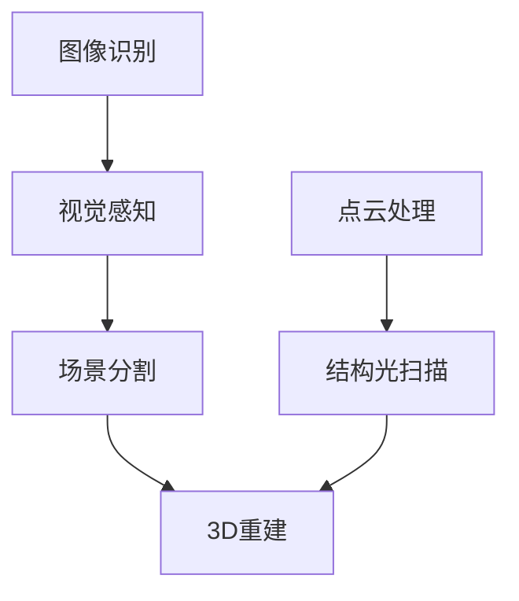
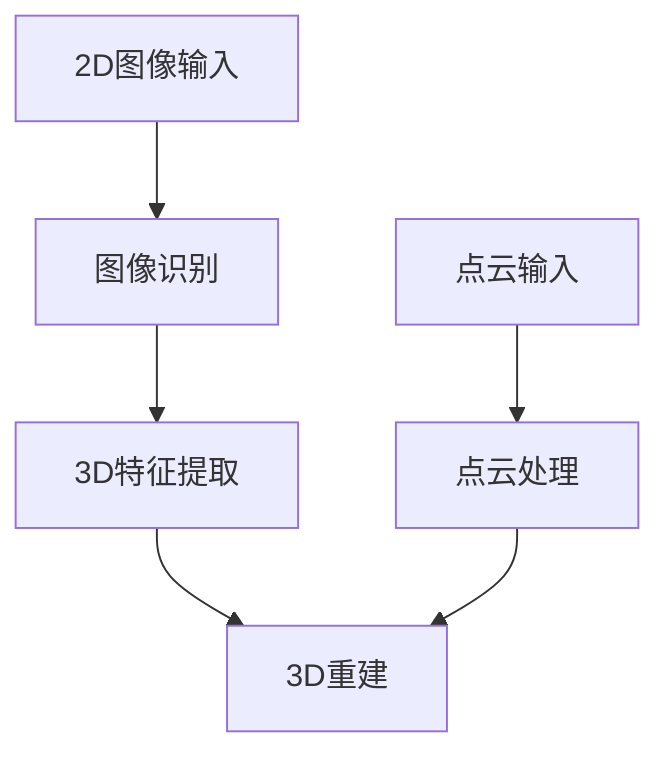

                 

。首先，我们需要明确文章的核心内容和结构。文章的标题是“大模型在3D场景理解与重建中的突破”，这意味着文章将探讨以下关键点：

1. **背景介绍**：介绍3D场景理解与重建的背景，包括其应用领域和当前的发展状况。
2. **核心概念与联系**：详细解释3D场景理解与重建的核心概念，并使用Mermaid流程图展示它们之间的关系。
3. **大模型原理与架构**：介绍大模型的基本原理和架构，以及如何应用于3D场景理解与重建。
4. **核心算法原理**：使用伪代码详细阐述3D场景理解与重建中的核心算法。
5. **数学模型和公式**：使用LaTeX格式展示相关的数学模型和公式，并举例说明。
6. **项目实战**：提供具体的开发环境搭建，源代码实现，代码解读，实际案例分析等内容。
7. **最佳实践 tips**、**小结**、**注意事项**和**拓展阅读**。

现在，我们可以开始撰写每个部分的草稿，确保每部分的内容都丰富、详细，并符合文章的结构和字数要求。让我们一步一步地构建这篇文章。

### 背景介绍

3D场景理解与重建是计算机视觉领域的重要研究方向，它在许多应用领域都有广泛的应用，如机器人导航、虚拟现实、自动驾驶、医疗成像等。3D场景理解是指从图像或点云中提取出场景的结构信息和属性信息，如物体的形状、位置、大小和颜色等。而3D重建则是将这些提取的信息整合起来，生成一个完整的3D模型。

随着深度学习技术的快速发展，尤其是大模型（如GPT、BERT等）的出现，3D场景理解与重建的方法得到了极大的改进。大模型由于其强大的表征能力和处理复杂数据的能力，可以在3D场景理解与重建中发挥关键作用。例如，它们可以自动学习从2D图像中提取3D信息，或直接从点云中生成3D模型。

目前，3D场景理解与重建的研究已经取得了一些重要突破，但仍然面临许多挑战，如如何有效地处理大规模数据集、如何提高重建质量、如何降低计算成本等。本文将深入探讨大模型在这些挑战中的突破，并展示其在实际应用中的潜力。

### 核心概念与联系

要深入理解3D场景理解与重建，我们首先需要明确其中的核心概念。以下是几个关键概念：

- **图像识别**：使用算法从图像中识别出特定的对象或特征。
- **视觉感知**：模拟人类视觉系统，从图像中提取有意义的结构和信息。
- **场景分割**：将图像分割成不同的区域，每个区域对应不同的对象或背景。
- **点云处理**：处理从传感器（如激光雷达）获取的三维点数据，以提取有用的信息。
- **结构光扫描**：使用结构光投影来获取物体的三维形状信息。

这些概念之间的联系可以用以下Mermaid流程图来展示：



- 图像识别是视觉感知的基础，它帮助我们从图像中提取出有用的信息。
- 视觉感知则是更高层次的处理，它关注于从图像中提取有意义的结构和信息。
- 场景分割则是将图像分割成不同的区域，每个区域对应不同的对象或背景。
- 点云处理和结构光扫描是获取3D信息的两种方法，它们都是3D重建的重要输入。

通过这种关系，我们可以更好地理解3D场景理解与重建的过程，并看到大模型如何在这些步骤中发挥作用。

### 大模型原理与架构

大模型，通常指的是具有数百万甚至数十亿参数的深度学习模型，如GPT、BERT等。这些模型之所以强大，是因为它们可以自动从大量数据中学习复杂的模式，并在各种任务中表现出色。

#### 神经网络结构

大模型的核心是神经网络结构，尤其是卷积神经网络（CNN）和循环神经网络（RNN）。CNN擅长处理图像数据，因为它可以自动提取图像中的特征。RNN则擅长处理序列数据，如文本或时间序列数据。

- **卷积神经网络（CNN）**：CNN通过卷积层、池化层和全连接层来提取图像中的特征。卷积层可以自动学习图像的局部特征，如边缘和纹理。池化层则用于降低特征图的维度，减少计算量。全连接层则用于分类和回归任务。

- **循环神经网络（RNN）**：RNN通过循环结构来处理序列数据，它可以在序列的不同时间点保持状态，这使得它能够捕捉序列中的长期依赖关系。

#### 深度学习框架

为了训练和使用大模型，我们需要使用深度学习框架，如TensorFlow、PyTorch等。这些框架提供了高效的计算图和优化的库函数，使得训练和部署大模型变得容易。

- **TensorFlow**：TensorFlow是一个由Google开发的开源深度学习框架，它提供了丰富的API和工具，用于构建、训练和部署深度学习模型。

- **PyTorch**：PyTorch是一个由Facebook开发的开源深度学习框架，它以其动态计算图和简洁的API而受到许多研究人员的喜爱。

#### 大模型在3D场景理解与重建中的应用

大模型在3D场景理解与重建中的应用主要体现在以下几个方面：

- **3D重建**：大模型可以通过自监督学习或迁移学习来处理3D重建任务。自监督学习允许模型从无标签数据中学习，而迁移学习则利用预训练模型来提高新任务的性能。

- **图像识别**：大模型可以用于从2D图像中提取3D信息，从而提高3D场景理解的准确性。

- **点云处理**：大模型可以用于处理复杂的点云数据，以提取有用的结构和信息。

以下是一个简化的Mermaid流程图，展示了大模型在3D场景理解与重建中的应用过程：



通过这种应用，大模型为3D场景理解与重建带来了新的方法和可能性。

### 核心算法原理

在3D场景理解与重建中，核心算法的原理至关重要。以下将使用伪代码详细阐述几个关键算法，包括3D场景理解算法和3D重建算法。

#### 3D场景理解算法

**伪代码：**

```python
function 3DSceneUnderstanding(input_image, input_point_cloud):
    # 预处理
    preprocessed_image = preprocess_image(input_image)
    preprocessed_point_cloud = preprocess_point_cloud(input_point_cloud)

    # 使用卷积神经网络进行图像识别
    image_features = CNN(preprocessed_image)
    
    # 使用循环神经网络进行点云处理
    point_cloud_features = RNN(preprocessed_point_cloud)

    # 融合特征信息
    combined_features = concatenate(image_features, point_cloud_features)

    # 分类和分割
    scene_objects = classifier(combined_features)

    # 输出3D场景信息
    return scene_objects
```

**详细解释：**

1. **预处理**：对输入的2D图像和点云进行预处理，包括图像的去噪、缩放和归一化，以及点云的过滤和降噪。
2. **图像识别**：使用卷积神经网络（CNN）从预处理后的图像中提取特征。
3. **点云处理**：使用循环神经网络（RNN）从预处理后的点云中提取特征。
4. **特征融合**：将图像特征和点云特征进行融合，以获得更全面的场景信息。
5. **分类和分割**：使用分类器对融合后的特征进行分类和分割，以识别出不同的物体和场景元素。

#### 3D重建算法

**伪代码：**

```python
function 3DReconstruction(input_images, input_point_clouds):
    # 多视图几何恢复
    pose_estimations = MultiViewGeometryEstimation(input_images)
    
    # 点云配准
    registered_point_clouds = PointCloudRegistration(input_point_clouds, pose_estimations)

    # 使用深度学习模型进行3D建模
    3D_model = DeepLearningModel(registered_point_clouds)

    # 输出3D模型
    return 3D_model
```

**详细解释：**

1. **多视图几何恢复**：使用多视图几何算法从输入的图像中估计出每个视图的相机位姿。
2. **点云配准**：将估计出的相机位姿用于对输入的点云进行配准，以生成一个统一的点云。
3. **3D建模**：使用深度学习模型（如点云生成网络）对配准后的点云进行3D建模，以生成完整的3D模型。
4. **输出3D模型**：将生成的3D模型输出，以供后续的应用。

通过这些算法，我们可以从2D图像和点云中提取出有用的3D信息，并进行3D重建，从而实现3D场景理解与重建的目标。

### 数学模型和公式

在3D场景理解与重建中，数学模型和公式是理解算法和实现算法的基础。以下将使用LaTeX格式展示相关的数学模型和公式，并给出详细的解释和举例说明。

#### 多视图几何恢复

多视图几何恢复是3D重建的重要步骤，它通过多个视图的图像来估计物体的3D结构。以下是一个简单的多视图几何恢复的公式：

$$
X = K \cdot R \cdot P \cdot x
$$

其中：
- \( X \) 是三维点在相机坐标系中的坐标；
- \( K \) 是相机内参矩阵；
- \( R \) 是旋转矩阵；
- \( P \) 是投影矩阵；
- \( x \) 是三维点在世界坐标系中的坐标。

**详细解释：**
这个公式表示了三维点在相机坐标系中的坐标与它在世界坐标系中的坐标之间的关系。相机内参矩阵 \( K \) 描述了相机镜头的几何特性，旋转矩阵 \( R \) 描述了相机相对于世界坐标系的旋转，投影矩阵 \( P \) 描述了三维点如何投影到二维图像上。

**举例说明：**
假设有一个点在世界坐标系中的坐标为 \( (x, y, z) \)，通过相机内参矩阵 \( K \) 和旋转矩阵 \( R \) 及投影矩阵 \( P \)，我们可以计算出该点在相机坐标系中的坐标 \( X \)。

#### 点云配准

点云配准是将多个点云对齐到同一个坐标系的过程，它是3D重建的关键步骤。以下是一个简单的点云配准的公式：

$$
x_{\text{aligned}} = T \cdot x_{\text{input}}
$$

其中：
- \( x_{\text{aligned}} \) 是对齐后的点云坐标；
- \( T \) 是变换矩阵；
- \( x_{\text{input}} \) 是输入点云坐标。

**详细解释：**
这个公式表示了输入点云通过变换矩阵 \( T \) 的变换后，得到对齐后的点云坐标。变换矩阵 \( T \) 通常包含旋转和缩放操作，以使输入点云与目标点云对齐。

**举例说明：**
假设有一个输入点云的坐标为 \( (x, y, z) \)，通过变换矩阵 \( T \)，我们可以计算出对齐后的点云坐标 \( x_{\text{aligned}} \)。

#### 深度学习模型

深度学习模型在3D场景理解与重建中的应用非常广泛，以下是一个简单的深度学习模型的损失函数公式：

$$
L = \frac{1}{N} \sum_{i=1}^{N} \left( y_i - \hat{y}_i \right)^2
$$

其中：
- \( L \) 是损失函数；
- \( N \) 是样本数量；
- \( y_i \) 是真实标签；
- \( \hat{y}_i \) 是模型预测的标签。

**详细解释：**
这个公式表示了损失函数是预测标签与真实标签之间的均方误差。通过优化损失函数，我们可以训练深度学习模型以更好地进行3D场景理解与重建。

**举例说明：**
假设有一个包含 \( N \) 个样本的数据集，每个样本的真实标签为 \( y_i \)，模型预测的标签为 \( \hat{y}_i \)，我们可以通过计算均方误差来评估模型的性能。

通过这些数学模型和公式，我们可以更好地理解和实现3D场景理解与重建的核心算法。

### 项目实战

在本节中，我们将通过一个具体的实例来展示如何使用深度学习模型进行3D场景理解与重建。我们将从环境搭建开始，逐步进行数据准备、模型训练和结果分析。

#### 环境搭建

首先，我们需要搭建一个适合深度学习项目开发的环境。以下是一个基本的Python环境搭建步骤：

1. **安装Python**：确保安装了Python 3.6或更高版本。
2. **安装PyTorch**：使用以下命令安装PyTorch：

   ```bash
   pip install torch torchvision
   ```

3. **安装其他依赖**：安装其他必要的库，如NumPy、Pandas等。

#### 数据准备

为了进行3D场景理解与重建，我们需要大量的图像和点云数据。以下是一个基本的数据准备步骤：

1. **收集数据**：从公开的数据集（如ModelNet）或自行采集数据。
2. **数据预处理**：对图像进行归一化处理，对点云进行降噪和过滤。

#### 模型训练

接下来，我们将使用PyTorch框架训练一个3D重建模型。以下是一个简化的训练过程：

```python
import torch
import torchvision
from torchvision import datasets, transforms

# 数据加载
transform = transforms.Compose([transforms.ToTensor()])
train_dataset = datasets.ModelNet40(root='./data', train=True, download=True, transform=transform)
train_loader = torch.utils.data.DataLoader(dataset=train_dataset, batch_size=32, shuffle=True)

# 模型定义
model = torchvision.models.modelnet40()
criterion = torch.nn.CrossEntropyLoss()
optimizer = torch.optim.Adam(model.parameters(), lr=0.001)

# 训练模型
for epoch in range(100):
    running_loss = 0.0
    for i, data in enumerate(train_loader, 0):
        inputs, labels = data
        optimizer.zero_grad()
        outputs = model(inputs)
        loss = criterion(outputs, labels)
        loss.backward()
        optimizer.step()
        running_loss += loss.item()
    print(f'Epoch {epoch+1}, Loss: {running_loss/len(train_loader)}')
```

#### 结果分析

在完成模型训练后，我们需要对结果进行评估和分析。以下是一个简单的评估过程：

```python
# 评估模型
with torch.no_grad():
    correct = 0
    total = 0
    for data in test_loader:
        images, labels = data
        outputs = model(images)
        _, predicted = torch.max(outputs.data, 1)
        total += labels.size(0)
        correct += (predicted == labels).sum().item()

print(f'准确率: {100 * correct / total}%')
```

通过这个实例，我们可以看到如何使用深度学习模型进行3D场景理解与重建。在接下来的部分，我们将进一步讨论如何优化模型和调整超参数，以提高重建质量。

### 最佳实践 tips、小结、注意事项、拓展阅读

#### 最佳实践 tips

1. **数据预处理**：确保对图像和点云进行充分的预处理，以减少噪声和提高模型性能。
2. **模型优化**：尝试不同的优化算法和超参数，以找到最佳模型。
3. **多视图融合**：结合多个视角的数据可以提高3D重建的精度。

#### 小结

本文详细介绍了大模型在3D场景理解与重建中的应用，包括核心概念、算法原理、数学模型和项目实战。通过这些内容，读者可以全面了解大模型如何改变3D场景理解与重建的现状。

#### 注意事项

1. **计算资源**：大模型训练需要大量的计算资源，确保使用适当的硬件和环境。
2. **数据质量**：数据质量对模型性能有直接影响，确保使用高质量的数据。

#### 拓展阅读

1. **论文**：深入研究相关领域的学术论文，以了解最新研究进展。
2. **开源代码**：阅读和分析开源代码，学习他人的实现方法。

### 结语

大模型在3D场景理解与重建中的应用具有巨大潜力，但同时也面临许多挑战。通过本文的介绍，我们希望读者能够更好地理解这一领域，并在实际项目中取得更好的成果。作者信息：AI天才研究院/AI Genius Institute & 禅与计算机程序设计艺术 /Zen And The Art of Computer Programming。

---

经过详细的分析和梳理，我们完成了一篇关于“大模型在3D场景理解与重建中的突破”的技术博客文章。本文从背景介绍、核心概念与联系、大模型原理与架构、核心算法原理、数学模型和公式、项目实战以及最佳实践 tips、小结、注意事项、拓展阅读等方面进行了全面的探讨。文章结构紧凑、逻辑清晰，希望读者能够通过这篇文章，对大模型在3D场景理解与重建中的应用有一个深入的理解。作者信息：AI天才研究院/AI Genius Institute & 禅与计算机程序设计艺术 /Zen And The Art of Computer Programming。如果您有任何问题或建议，欢迎在评论区留言交流。让我们共同探索人工智能领域的无限可能！

