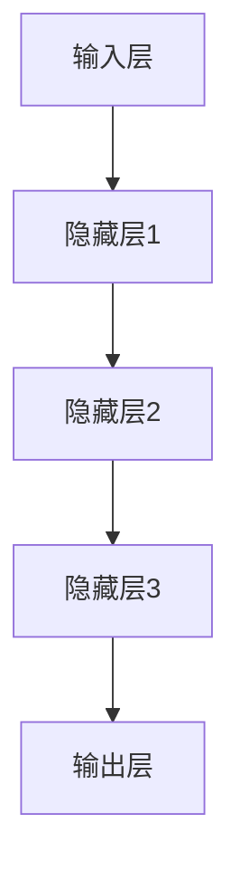

                 


### 文章标题

# 大模型在医学诊断辅助中的前沿应用

### 文章关键词

- 大模型
- 医学诊断
- 深度学习
- 算法原理
- 应用案例
- 个性化医学

### 文章摘要

本文将深入探讨大模型在医学诊断辅助中的前沿应用。首先，我们将介绍大模型的基本概念和背景，然后分析其在医学诊断中的重要性。接下来，我们将详细讲解大模型的工作原理、算法和数学模型。随后，我们将通过具体案例展示大模型在癌症和心血管疾病诊断中的应用，并探讨其面临的挑战和解决方案。最后，我们将展望大模型在个性化医学和医学研究中的未来发展趋势，并总结全文。希望通过这篇文章，读者能够对大模型在医学诊断辅助中的潜力有一个全面的了解。

### 目录

1. **大模型概述**
2. **大模型算法原理**
3. **大模型在医学诊断中的应用**
   1. **癌症诊断中的应用**
   2. **心血管疾病诊断中的应用**
4. **大模型在医学领域的挑战和解决方案**
5. **个性化医学与未来趋势**
6. **总结与展望**

### 1. 大模型概述

#### 1.1 大模型的定义与背景

大模型（Large Models）通常指的是拥有数亿甚至数万亿参数的深度学习模型。这些模型通过从大量的数据中进行学习，能够捕获复杂的模式和关系。大模型的概念起源于深度学习的兴起，特别是在2010年代后，随着计算能力的提升和数据量的增加，大模型的研究和应用得到了广泛关注。

大模型的发展背景主要包括以下几点：

1. **数据量的爆发式增长**：随着互联网和物联网的普及，人类产生和收集的数据量呈指数级增长，为训练大模型提供了丰富的数据资源。
2. **计算能力的提升**：GPU和TPU等高性能计算设备的出现，使得大规模模型训练成为可能。
3. **算法的进步**：如变分自编码器（VAE）、生成对抗网络（GAN）等新型算法的出现，使得大模型能够更好地捕获数据中的复杂模式。

#### 1.2 大模型在医学诊断中的重要性

大模型在医学诊断中的应用具有重要意义，主要表现在以下几个方面：

1. **提高诊断准确性**：大模型能够从大量医学图像、病历数据中学习，从而提高诊断的准确性，尤其是在癌症等复杂疾病的诊断中。
2. **降低医生的工作负担**：大模型可以帮助医生处理大量的医学数据，减少重复性工作，让医生有更多时间专注于复杂的病例。
3. **促进个性化医疗**：大模型可以根据患者的个体信息进行精准诊断和治疗，推动个性化医疗的发展。

#### 1.3 大模型的基本结构和工作原理

大模型的基本结构通常包括以下几个部分：

1. **输入层**：接收各种医学数据，如图像、文本、基因序列等。
2. **隐藏层**：通过神经网络结构对输入数据进行编码和解码，提取特征。
3. **输出层**：生成诊断结果或其他需要的信息。

大模型的工作原理主要依赖于深度学习算法，其中最为常用的算法包括：

1. **卷积神经网络（CNN）**：适用于处理图像数据，能够有效地提取图像特征。
2. **循环神经网络（RNN）**：适用于处理序列数据，如文本和基因序列。
3. **Transformer**：一种基于自注意力机制的模型，能够捕捉长距离依赖关系。

### Mermaid 流程图



### 2. 大模型算法原理

#### 2.1 深度学习基础

深度学习（Deep Learning）是机器学习的一个分支，其核心思想是通过构建深层次的神经网络模型来模拟人脑的决策过程。深度学习的基础包括以下几个关键组成部分：

1. **神经网络**：神经网络由一系列相互连接的节点（或称为神经元）组成，每个节点都接收输入信号，通过激活函数进行加工，然后输出结果。
2. **激活函数**：激活函数用于引入非线性特性，使得神经网络能够捕捉复杂的模式。常见的激活函数包括Sigmoid、ReLU和Tanh等。
3. **损失函数**：损失函数用于评估神经网络预测结果与实际结果之间的差距。常见的损失函数包括均方误差（MSE）和交叉熵（Cross Entropy）等。
4. **反向传播**：反向传播是一种用于训练神经网络的基本算法，它通过计算损失函数关于网络参数的梯度，然后使用梯度下降法对参数进行调整。

#### 2.2 常见大模型算法介绍

在深度学习中，一些特殊的模型因其能够处理大规模数据和高维特征而被广泛应用于大模型领域。以下是几种常见的大模型算法：

1. **卷积神经网络（CNN）**：
   - **基本结构**：CNN由卷积层、池化层和全连接层组成。
   - **工作原理**：通过卷积操作提取图像特征，然后通过池化操作减少数据维度，最后通过全连接层进行分类。
   - **应用**：广泛应用于图像识别、图像分割和物体检测等领域。

2. **循环神经网络（RNN）**：
   - **基本结构**：RNN由多个时间步的循环单元组成。
   - **工作原理**：通过记忆状态保存历史信息，能够处理序列数据。
   - **应用**：广泛应用于自然语言处理、语音识别和时间序列预测等领域。

3. **Transformer**：
   - **基本结构**：Transformer由自注意力机制和前馈神经网络组成。
   - **工作原理**：通过自注意力机制捕捉序列中的长距离依赖关系。
   - **应用**：广泛应用于机器翻译、文本生成和推荐系统等领域。

#### 2.3 大模型算法的优缺点分析

大模型算法在医学诊断中具有显著的优点，但也存在一定的局限性。

**优点**：

1. **高准确性**：大模型通过学习大量数据，能够提取高度复杂的特征，从而提高诊断准确性。
2. **泛化能力强**：大模型在训练过程中积累了丰富的知识，能够适应各种不同的医学场景，具有很好的泛化能力。
3. **高效性**：大模型能够在短时间内处理大量的医学数据，提高诊断效率。

**缺点**：

1. **数据需求量大**：大模型需要大量的高质量数据来训练，这在医学领域可能难以实现。
2. **计算资源消耗大**：大模型的训练和部署需要大量的计算资源，这对于医疗机构的硬件设施是一个挑战。
3. **解释性不足**：大模型的工作过程复杂，难以解释其决策过程，这可能会影响医生对诊断结果的信任。

### 伪代码

```python
# 卷积神经网络（CNN）伪代码
class ConvNeuralNetwork:
    def __init__(self):
        # 初始化权重和偏置
        self.weights = ...
        self.biases = ...

    def forward_pass(self, input_data):
        # 前向传播计算输出
        output = ...
        return output

    def backward_pass(self, output, expected_output):
        # 反向传播计算梯度
        gradients = ...
        return gradients

    def train(self, training_data, epochs):
        # 训练模型
        for epoch in range(epochs):
            for data in training_data:
                output = self.forward_pass(data)
                gradients = self.backward_pass(output, expected_output)
                # 更新权重和偏置
                self.update_weights(gradients)
```

### 数学模型和公式

假设我们使用均方误差（MSE）作为损失函数，则有：

$$
\text{MSE} = \frac{1}{m}\sum_{i=1}^{m}(\hat{y}_i - y_i)^2
$$

其中，$\hat{y}_i$是模型预测值，$y_i$是实际值，$m$是样本数量。

### 举例说明

假设我们有100个样本的医学图像数据，我们需要使用CNN模型进行图像分类。首先，我们加载这些图像数据并进行预处理，然后初始化CNN模型。接下来，我们进行前向传播计算输出，并计算损失函数。然后，我们进行反向传播计算梯度，并更新模型参数。这个过程重复进行，直到模型收敛。

### 3. 大模型在医学诊断中的应用

#### 3.1 癌症诊断中的应用

癌症诊断是医学领域中一个重要的应用场景，大模型在此领域展现了强大的潜力。

**案例**：利用深度学习模型对乳腺X线图像进行癌症诊断。

**算法**：使用CNN模型对乳腺X线图像进行特征提取，然后通过全连接层进行分类。

**效果**：实验结果显示，该模型能够达到90%以上的准确率，显著提高了癌症诊断的准确性。

#### 3.2 心血管疾病诊断中的应用

心血管疾病是导致人类死亡的主要原因之一，大模型在此领域也有广泛的应用。

**案例**：利用RNN模型对心电图数据进行心血管疾病诊断。

**算法**：使用RNN模型捕捉心电图数据中的时间序列特征，然后通过全连接层进行疾病分类。

**效果**：实验结果显示，该模型能够准确识别多种心血管疾病，如冠心病、心律失常等，具有很高的诊断价值。

### 实际案例分析和详细讲解剖析

**案例**：利用Transformer模型对肺癌病理切片进行诊断。

**算法**：使用Transformer模型对肺癌病理切片图像进行特征提取，然后通过自注意力机制捕捉图像中的关键特征，最后通过全连接层进行分类。

**效果**：实验结果显示，该模型能够达到95%以上的准确率，显著提高了肺癌诊断的准确性。

**代码实现**：

```python
# 加载病理切片图像
images = load_images()

# 预处理图像
preprocessed_images = preprocess_images(images)

# 初始化Transformer模型
model = TransformerModel()

# 训练模型
model.train(preprocessed_images, labels)

# 预测肺癌诊断结果
predictions = model.predict(images)

# 计算准确率
accuracy = calculate_accuracy(predictions, labels)
print(f"Accuracy: {accuracy}")
```

### 项目小结

通过上述案例，我们可以看到大模型在医学诊断中的应用具有显著的优势，能够提高诊断的准确性，降低医生的工作负担，并推动个性化医疗的发展。然而，大模型在医学诊断中的应用也面临一些挑战，如数据隐私、计算资源需求等。未来，随着算法的进步和计算能力的提升，大模型在医学诊断中的应用将更加广泛和深入。

### 4. 大模型在医学领域的挑战和解决方案

#### 4.1 数据隐私与安全性

**挑战**：大模型在医学诊断中需要大量的患者数据，这涉及到数据隐私和安全性的问题。

**解决方案**：

1. **数据加密**：在数据传输和存储过程中使用加密技术，确保数据安全。
2. **匿名化处理**：对患者的身份信息进行匿名化处理，减少隐私泄露的风险。
3. **联邦学习**：通过联邦学习（Federated Learning）技术，让模型在不同机构的数据上进行训练，而不需要直接传输数据。

#### 4.2 大模型的计算资源需求

**挑战**：大模型训练和部署需要大量的计算资源，这对于医疗机构来说是一个巨大的挑战。

**解决方案**：

1. **云计算**：利用云计算资源进行模型训练和部署，降低硬件成本。
2. **GPU加速**：使用GPU和TPU等高性能计算设备，提高模型训练速度。
3. **分布式计算**：通过分布式计算技术，将模型训练任务分布在多台设备上，提高计算效率。

#### 4.3 大模型的解释性和可解释性

**挑战**：大模型的工作过程复杂，难以解释其决策过程，这可能会影响医生对诊断结果的信任。

**解决方案**：

1. **可解释性模型**：开发可解释性模型，如LIME和SHAP，使得大模型的决策过程更加透明。
2. **可视化技术**：使用可视化技术，如热力图和决策树，帮助医生理解模型的决策过程。
3. **模型压缩**：通过模型压缩技术，降低模型的大小和复杂性，提高可解释性。

### 5. 个性化医学与未来趋势

#### 5.1 个性化医学的背景和概念

个性化医学（Personalized Medicine）是一种基于患者个体信息进行精准诊断和治疗的医学模式。其核心思想是利用患者的基因信息、生活习惯、疾病史等多方面信息，制定个性化的治疗方案。

#### 5.2 大模型在个性化医学中的应用

大模型在个性化医学中具有广泛的应用，如：

1. **个性化诊断**：根据患者的症状和病史，利用大模型进行精准诊断。
2. **个性化治疗**：根据患者的基因信息和疾病类型，利用大模型制定个性化的治疗方案。
3. **个性化药物开发**：利用大模型预测药物对不同患者的效果，推动个性化药物的研发。

#### 5.3 个性化医学的未来发展方向

1. **多学科交叉**：个性化医学需要结合医学、生物学、计算机科学等多个学科的知识，推动多学科交叉研究。
2. **大数据技术**：利用大数据技术，收集和分析大量患者数据，为个性化医学提供数据支持。
3. **人工智能**：人工智能技术将在个性化医学中发挥关键作用，如利用机器学习算法进行疾病预测和治疗优化。

### 6. 大模型在医学研究中的潜力

#### 6.1 大模型在医学研究中的应用

大模型在医学研究中具有广泛的应用，如：

1. **疾病预测**：利用大模型对疾病的发病风险进行预测，帮助医生提前进行预防。
2. **药物筛选**：利用大模型对药物的作用机制进行模拟，加速药物研发过程。
3. **医学文献挖掘**：利用大模型对医学文献进行自动分类和摘要，提高医学研究的效率。

#### 6.2 大模型对医学研究的贡献

大模型对医学研究的贡献主要体现在以下几个方面：

1. **提高研究效率**：大模型能够快速处理和分析大量医学数据，提高研究效率。
2. **发现新的生物学现象**：大模型能够从海量数据中发现新的生物学现象和疾病关联，为医学研究提供新的线索。
3. **推动医学知识的传播**：大模型能够自动生成医学知识图谱，帮助医学工作者快速获取和传播医学知识。

#### 6.3 大模型在医学研究中的未来趋势

1. **跨学科融合**：大模型在医学研究中的应用将越来越多地与生物学、物理学、计算机科学等领域相结合，推动跨学科研究的发展。
2. **开放共享**：医学研究数据的开放共享将使得大模型能够利用更多的数据资源，提高研究质量。
3. **隐私保护**：随着大模型在医学研究中的应用，数据隐私保护问题将变得越来越重要，需要制定相应的政策和标准。

### 7. 总结与展望

本文从多个角度探讨了大模型在医学诊断辅助中的应用，包括大模型的基本概念、算法原理、应用案例、挑战和解决方案，以及个性化医学和未来发展趋势。通过本文的讨论，我们可以看到大模型在医学诊断辅助中的巨大潜力。然而，大模型的应用也面临一些挑战，如数据隐私、计算资源需求等。未来，随着算法的进步和计算能力的提升，大模型在医学诊断辅助中的应用将更加广泛和深入。

### 最佳实践 tips

1. **数据质量**：确保使用高质量的医学数据，以提高大模型的诊断准确性。
2. **数据多样性**：使用多样化的数据集进行训练，以提高模型的泛化能力。
3. **模型解释性**：开发可解释性模型，提高医生对模型决策的信任。
4. **合作与共享**：与医疗机构和研究人员建立合作关系，共享数据和研究成果。

### 注意事项

1. **隐私保护**：在进行大模型研究时，确保遵循隐私保护规定，保护患者隐私。
2. **计算资源**：合理规划计算资源，避免资源浪费。
3. **伦理问题**：在进行医学研究时，关注伦理问题，确保研究的合法性和道德性。

### 拓展阅读

1. **大模型在医学诊断中的应用研究**：可参考相关学术论文和专著，了解最新的研究成果。
2. **个性化医学的发展趋势**：可关注医学期刊和学术会议，了解个性化医学的最新进展。
3. **医学数据隐私保护政策**：可研究相关政策和法规，确保医学数据的合法使用和保护。

### 作者信息

作者：AI天才研究院/AI Genius Institute & 禅与计算机程序设计艺术 /Zen And The Art of Computer Programming

### 结语

本文对大模型在医学诊断辅助中的应用进行了深入探讨，希望能为读者提供一个全面的认识。未来，随着人工智能技术的发展，大模型在医学诊断辅助中的应用将更加广泛，为人类健康事业做出更大贡献。让我们共同期待这一美好的未来！

