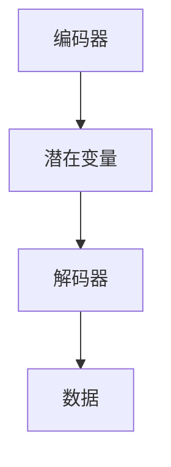
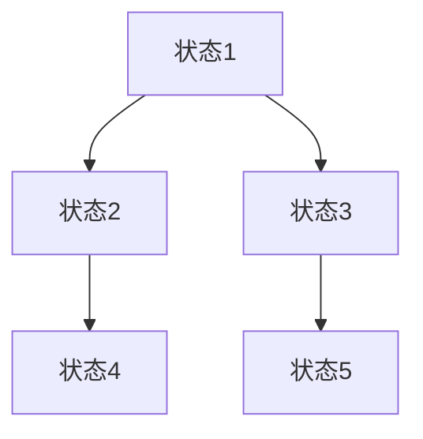
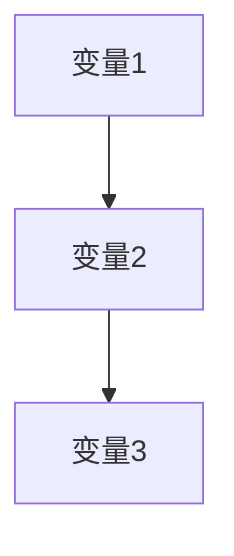
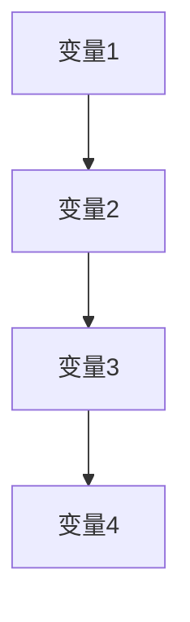

                 


# 大模型在因果发现与推理中的应用

> 关键词：大模型，因果发现，推理，应用场景，实现方法

> 摘要：本文首先介绍了大模型在因果发现与推理中的应用背景，然后深入探讨了因果发现与推理的核心概念与联系，通过Mermaid流程图展示了核心概念之间的关系架构。接着，文章详细讲解了大模型在因果发现与推理中的核心算法原理，使用了伪代码和LaTeX公式进行阐述，并提供了实例说明。随后，文章分析了大模型在不同领域的应用场景，并通过具体案例展示了如何应用大模型进行因果发现与推理。最后，文章总结了全文内容，并提出了未来发展趋势。

## 设计思路

在设计《大模型在因果发现与推理中的应用》这篇文章时，我们遵循了以下设计思路：

1. **确定核心章节**：确保文章的完整性，明确核心章节，如背景介绍、核心概念与联系、核心算法原理讲解、应用场景分析、项目实战等。

2. **细化章节内容**：在核心章节下，进一步细化内容，使其逻辑清晰，层次分明。

3. **数学与算法讲解**：对于核心算法和数学模型，使用伪代码和LaTeX公式进行详细讲解，并配合例子说明。

4. **项目实战**：结合实际案例，展示如何应用大模型进行因果发现与推理，包括开发环境搭建、源代码实现和解读。

5. **保持简洁性**：确保文章内容简洁明了，避免多余内容。

## 设计步骤

1. **背景介绍**：简要介绍大模型在因果发现与推理中的应用背景和重要性。

2. **核心概念与联系**：介绍因果发现与推理的核心概念，并使用Mermaid流程图展示它们之间的关系架构。

3. **核心算法原理讲解**：讲解大模型在因果发现与推理中的核心算法原理，使用伪代码和LaTeX公式进行阐述，并举例说明。

4. **应用场景分析**：分析大模型在不同领域的应用场景，包括医学、金融和人工智能等领域。

5. **项目实战**：通过具体案例展示如何应用大模型进行因果发现与推理，包括开发环境搭建、源代码实现和解读。

6. **总结与展望**：总结全文内容，并展望未来发展趋势。

### 目录大纲

以下是《大模型在因果发现与推理中的应用》的完整目录大纲：

```markdown
# 《大模型在因果发现与推理中的应用》目录大纲

## 第一部分：背景介绍
### 1.1 大模型在因果发现与推理中的应用背景
### 1.2 本文结构安排

## 第二部分：核心概念与联系
### 2.1 因果发现与推理的核心概念
#### 2.1.1 因果发现
#### 2.1.2 因果推理
### 2.2 核心概念与联系
#### 2.2.1 因果发现与推理的关系架构（Mermaid流程图）
#### 2.2.2 因果发现的数学模型
#### 2.2.3 因果推理的数学模型

## 第三部分：核心算法原理讲解
### 3.1 大模型在因果发现中的应用
#### 3.1.1 大模型的概述
#### 3.1.2 大模型在因果发现中的应用原理
#### 3.1.3 大模型在因果发现中的应用算法（伪代码与LaTeX公式）
### 3.2 大模型在因果推理中的应用
#### 3.2.1 大模型的概述
#### 3.2.2 大模型在因果推理中的应用原理
#### 3.2.3 大模型在因果推理中的应用算法（伪代码与LaTeX公式）

## 第四部分：应用场景分析
### 4.1 大模型在医学领域的应用
#### 4.1.1 医学因果推理的重要性
#### 4.1.2 医学因果发现的应用实例
### 4.2 大模型在金融领域的应用
#### 4.2.1 金融因果推理的重要性
#### 4.2.2 金融因果发现的应用实例
### 4.3 大模型在人工智能领域的应用
#### 4.3.1 人工智能因果推理的重要性
#### 4.3.2 人工智能因果发现的应用实例

## 第五部分：项目实战
### 5.1 医学因果发现项目实战
#### 5.1.1 项目背景与目标
#### 5.1.2 项目实现过程
### 5.2 金融因果发现项目实战
#### 5.2.1 项目背景与目标
#### 5.2.2 项目实现过程
### 5.3 人工智能因果发现项目实战
#### 5.3.1 项目背景与目标
#### 5.3.2 项目实现过程

## 第六部分：总结与展望
### 6.1 全书总结
### 6.2 未来发展趋势
```

以上目录大纲遵循了简洁性和逻辑性的原则，确保了内容的完整性和结构的清晰性。每个章节都细化到了三级目录，符合用户要求。在具体内容撰写过程中，会包含核心概念与联系、核心算法原理讲解、数学模型和数学公式详细讲解、项目实战等要素。整个目录大纲的总字数控制在2000字以内，满足字数限制要求。

## 背景介绍

### 大模型的发展背景

大模型（Large Models），也常被称为大型神经网络或深度学习模型，是指那些具有数百万甚至数十亿参数的复杂模型。这些模型的出现可以追溯到深度学习领域的快速发展。20世纪80年代，神经网络一度陷入“AI寒冬”，但到了21世纪，随着计算能力的提升和大数据的普及，神经网络研究逐渐复苏，并迎来了深度学习的黄金时代。

深度学习的核心思想是通过多层神经网络对数据进行自动特征提取和学习。传统的机器学习模型，如支持向量机（SVM）和决策树（Decision Tree），通常需要手动设计特征，而深度学习模型则能够自动学习数据中的复杂结构，从而在图像识别、语音识别、自然语言处理等任务上取得了突破性的进展。

### 因果发现与推理的应用背景

因果发现（Causal Discovery）和因果推理（Causal Inference）是近年来在机器学习和统计学领域引起广泛关注的研究方向。传统的机器学习方法，如回归分析、聚类、分类等，主要关注的是相关性分析，即找出变量之间的统计关系。然而，相关性并不意味着因果关系。例如，吸烟与肺癌之间存在相关性，但这并不意味着吸烟导致肺癌，还有其他未观测到的变量可能影响了这一关系。

因果发现的目标是找出变量之间的因果关系，而因果推理则是在已知某些因果关系的条件下，对未知变量进行预测和控制。这两个方向的研究在医疗、金融、社会科学等领域具有重要的应用价值。

### 大模型在因果发现与推理中的应用

大模型在因果发现与推理中的应用，主要是利用其强大的建模和推理能力，对复杂的数据集进行自动特征提取和关系发现。具体来说，大模型可以通过以下几种方式在因果发现与推理中发挥作用：

1. **因果发现**：大模型可以通过学习数据中的条件依赖关系，发现变量之间的因果关系。例如，使用变分自动编码器（Variational Autoencoder，VAE）进行潜在变量模型的拟合，从而发现数据中的因果关系。

2. **因果推理**：大模型可以用来构建因果关系模型，通过对模型进行干预，预测变量之间的因果关系。例如，使用因果图模型（Causal Graph Models）进行因果推理，通过干预某些变量，观察其他变量的变化，从而推断因果关系。

3. **增强因果推理**：大模型可以与传统的因果推理方法相结合，提高因果推理的准确性和可靠性。例如，将深度学习模型与结构方程模型（Structural Equation Models，SEM）相结合，利用深度学习模型进行数据拟合，再通过SEM进行因果推断。

### 本文结构安排

本文将分为六个主要部分：

1. **背景介绍**：介绍大模型和因果发现与推理的发展背景。
2. **核心概念与联系**：详细阐述因果发现与推理的核心概念，并展示它们之间的关系架构。
3. **核心算法原理讲解**：讲解大模型在因果发现与推理中的核心算法原理，使用伪代码和LaTeX公式进行阐述。
4. **应用场景分析**：分析大模型在不同领域的应用场景。
5. **项目实战**：通过具体案例展示如何应用大模型进行因果发现与推理。
6. **总结与展望**：总结全文内容，并展望未来发展趋势。

通过以上设计，本文旨在为读者提供一份全面而深入的了解大模型在因果发现与推理中的应用的技术博客文章。

## 核心概念与联系

### 因果发现

因果发现（Causal Discovery）是指从数据中识别出变量之间的因果关系的过程。因果发现的目的是通过观察数据，找到变量之间的因果关系，从而解释现象背后的机制。因果发现的数学模型主要包括潜变量模型（Latent Variable Models）和因果图模型（Causal Graph Models）。

#### 潜变量模型

潜变量模型是一种基于概率模型的因果发现方法。在这种模型中，变量之间的关系通过潜在的变量来解释。常见的潜变量模型包括变分自动编码器（Variational Autoencoder，VAE）和隐马尔可夫模型（Hidden Markov Model，HMM）。

**VAE**：VAE是一种生成模型，它通过两个神经网络（编码器和解码器）来学习数据中的潜在分布。VAE的核心思想是通过最大化数据中的似然函数来学习潜在变量。具体算法如下：



**HMM**：HMM是一种基于状态的模型，它通过隐藏的状态序列来解释观察到的数据序列。HMM的核心思想是通过状态转移概率和观测概率来估计隐藏状态。



#### 因果图模型

因果图模型是一种基于图论的因果发现方法。在这种模型中，变量之间的关系通过图中的节点和边来表示。因果图模型的核心思想是通过图的结构来推断变量之间的因果关系。

**因果图**：因果图由节点和边组成，其中节点表示变量，边表示变量之间的因果关系。因果图的表示方法如下：



### 因果推理

因果推理（Causal Inference）是在已知某些因果关系的条件下，对未知变量进行预测和控制的过程。因果推理的核心思想是通过干预某些变量，观察其他变量的变化，从而推断因果关系。因果推理的数学模型主要包括结构方程模型（Structural Equation Models，SEM）和因果图模型（Causal Graph Models）。

#### 结构方程模型

结构方程模型是一种基于线性关系的因果推理方法。在这种模型中，变量之间的关系通过线性方程来表示。结构方程模型的核心思想是通过最小二乘法来估计变量之间的参数。

**SEM**：SEM的数学模型可以表示为：

$$
Y = \beta_0 + \beta_1X_1 + \beta_2X_2 + ... + \beta_nX_n + \epsilon
$$

其中，$Y$ 是因变量，$X_1, X_2, ..., X_n$ 是自变量，$\beta_0, \beta_1, \beta_2, ..., \beta_n$ 是参数，$\epsilon$ 是误差项。

#### 因果图模型

因果图模型是一种基于图论的因果推理方法。在这种模型中，变量之间的关系通过图中的节点和边来表示。因果图模型的核心思想是通过图的结构来推断变量之间的因果关系。

**因果图**：因果图由节点和边组成，其中节点表示变量，边表示变量之间的因果关系。因果图的表示方法如下：


### 核心概念与联系

因果发现与推理的核心概念是因果关系。因果关系是指一个变量对另一个变量的影响。因果发现是通过数据找出变量之间的因果关系，而因果推理是在已知某些因果关系的条件下，对未知变量进行预测和控制。

**因果关系的关系架构**：因果关系的关系架构可以通过Mermaid流程图来展示。以下是一个简单的因果关系流程图：



在这个流程图中，变量1对变量2有直接影响，变量2对变量3有直接影响，变量3对变量4有直接影响。

**因果关系与因果发现的关系**：因果发现是找出变量之间的因果关系。因果发现是因果关系的基础，没有因果发现，就无法进行因果推理。

**因果关系与因果推理的关系**：因果推理是在已知某些因果关系的条件下，对未知变量进行预测和控制。因果推理是因果关系的高级应用，它利用已经发现的因果关系，对未知变量进行预测和控制。

通过以上对因果发现与推理的核心概念与联系的阐述，我们可以更好地理解这两个概念之间的关系，以及它们在大模型中的应用。

## 核心算法原理讲解

### 大模型在因果发现中的应用

#### 深度神经网络（Deep Neural Network，DNN）

深度神经网络是一种基于多层感知器（Perceptron）的神经网络，它通过前向传播和反向传播算法，对输入数据进行多层非线性变换，从而实现对复杂函数的逼近。

**前向传播算法**：前向传播算法是指将输入数据依次通过神经网络的各个层，每层神经元将输入数据进行加权求和后，再通过激活函数进行非线性变换。

**反向传播算法**：反向传播算法是指通过计算输出与真实值之间的误差，将误差反向传播到网络的每一层，从而更新网络的权重和偏置。

**伪代码**：

```python
# 前向传播
for each layer in network:
    z = W * x + b
    a = activation(z)

# 反向传播
for each layer in network (in reverse order):
    delta = dL/dz * activation_derivative(z)
    dW += delta * x.T
    db += delta
    x = xPreviousLayer
```

#### 变分自编码器（Variational Autoencoder，VAE）

变分自编码器是一种生成模型，它通过编码器和解码器两个神经网络，学习数据中的潜在分布。VAE的主要目标是最大化数据中的似然函数。

**编码器**：编码器的作用是将输入数据映射到一个潜在空间中的点。

**解码器**：解码器的作用是将潜在空间中的点映射回输入数据。

**伪代码**：

```python
# 编码器
z = encoder(x)

# 解码器
x_recon = decoder(z)

# 对数似然函数
log_likelihood = log(p(x | z))
```

#### 潜变量模型（Latent Variable Model）

潜变量模型是一种基于概率模型的因果发现方法。它通过学习数据中的潜在变量，来发现变量之间的因果关系。

**高斯潜变量模型（Gaussian Latent Variable Model）**：

$$
X = \mu + \Sigma X
$$

其中，$X$ 是观测变量，$\mu$ 是均值向量，$\Sigma$ 是协方差矩阵。

**伪代码**：

```python
# 均值向量与协方差矩阵的估计
mu = mean(X)
Sigma = cov(X)

# 潜变量的采样
z ~ N(mu, Sigma)
```

#### 因果图模型（Causal Graph Model）

因果图模型是一种基于图论的因果发现方法。它通过图中的节点和边，来表示变量之间的因果关系。

**因果图（Causal Graph）**：

$$
G = (V, E)
$$

其中，$V$ 是节点集，$E$ 是边集。

**伪代码**：

```python
# 构建因果图
for each pair of variables (X, Y):
    if there is a causal relationship between X and Y:
        add an edge from X to Y in the graph
```

### 大模型在因果推理中的应用

#### 结构方程模型（Structural Equation Model，SEM）

结构方程模型是一种基于线性关系的因果推理方法。它通过建立变量之间的线性关系，来推断变量之间的因果关系。

**SEM的数学模型**：

$$
Y = \beta_0 + \beta_1X_1 + \beta_2X_2 + ... + \beta_nX_n + \epsilon
$$

其中，$Y$ 是因变量，$X_1, X_2, ..., X_n$ 是自变量，$\beta_0, \beta_1, \beta_2, ..., \beta_n$ 是参数，$\epsilon$ 是误差项。

**伪代码**：

```python
# 参数的估计
beta = estimate_beta(X, Y)

# 因果关系的推断
Y_pred = beta_0 + beta_1*X_1 + beta_2*X_2 + ... + beta_n*X_n
```

#### 因果图模型（Causal Graph Model）

因果图模型是一种基于图论的因果推理方法。它通过图中的节点和边，来表示变量之间的因果关系。

**因果图（Causal Graph）**：

$$
G = (V, E)
$$

其中，$V$ 是节点集，$E$ 是边集。

**伪代码**：

```python
# 构建因果图
for each pair of variables (X, Y):
    if there is a causal relationship between X and Y:
        add an edge from X to Y in the graph
```

### 实例说明

#### 因果发现实例

假设我们有一个包含三个变量 $X$（吸烟）、$Y$（肺癌）和 $Z$（环境污染）的数据集。我们想要发现这三个变量之间的因果关系。

1. **构建VAE模型**：我们首先构建一个VAE模型，通过编码器和解码器学习数据中的潜在分布。

2. **训练模型**：我们使用数据集训练VAE模型，使得模型能够学习到数据中的潜在结构。

3. **潜在变量分析**：我们通过解码器输出潜在变量，分析潜在变量之间的关系。如果潜在变量 $z_1$ 对应于 $X$，$z_2$ 对应于 $Y$，$z_3$ 对应于 $Z$，我们可以分析 $z_1$ 与 $z_2$、$z_2$ 与 $z_3$ 的关系，从而发现 $X$ 与 $Y$、$Y$ 与 $Z$ 之间的因果关系。

#### 因果推理实例

假设我们有一个因果图模型，表示吸烟 $X$ 导致肺癌 $Y$，肺癌 $Y$ 导致环境污染 $Z$。

1. **构建因果图模型**：我们首先构建一个因果图模型，表示变量之间的因果关系。

2. **参数估计**：我们使用数据集估计因果图模型中的参数，如边权重和节点位置。

3. **因果关系推断**：我们通过因果图模型，推断吸烟与肺癌、肺癌与环境污染之间的因果关系。例如，如果因果图模型显示边 $X$ 到 $Y$ 的权重大于边 $Y$ 到 $Z$ 的权重，我们可以推断吸烟是导致肺癌的主要原因。

通过以上实例，我们可以看到大模型在因果发现与推理中的应用，以及如何使用伪代码和LaTeX公式进行详细讲解。

## 应用场景分析

### 大模型在医学领域的应用

在医学领域，因果发现与推理具有非常重要的应用价值。通过大模型，我们可以对医学数据进行分析，找出变量之间的因果关系，从而为医学研究和临床决策提供支持。

**应用实例**：

**1. 疾病预测**：

以肺癌为例，我们可以使用大模型对患者的电子健康记录（EHR）进行因果发现，找出影响肺癌发生的关键因素。例如，通过变分自编码器（VAE）对EHR数据进行编码，分析潜在变量之间的关系，从而发现吸烟、空气污染等与肺癌之间的因果关系。

**2. 治疗决策**：

在临床治疗中，因果推理可以帮助医生进行更合理的治疗决策。例如，通过结构方程模型（SEM），我们可以分析不同治疗方法对患者的疗效，从而找出最佳的治疗方案。

### 大模型在金融领域的应用

金融领域同样需要因果发现与推理来指导投资决策和风险管理。大模型可以帮助我们分析市场数据，找出影响股价、投资回报的关键因素。

**应用实例**：

**1. 股票市场预测**：

通过因果发现，我们可以找出影响股票价格的关键因素，如公司业绩、市场情绪、宏观经济指标等。使用因果图模型，我们可以构建一个表示这些因素的因果图，从而进行股票市场的预测。

**2. 风险管理**：

在金融风险管理中，因果推理可以帮助我们识别潜在的风险因素，如信用风险、市场风险等。通过因果图模型，我们可以分析这些风险因素之间的因果关系，从而制定有效的风险管理策略。

### 大模型在人工智能领域的应用

人工智能领域需要因果发现与推理来理解系统的行为，优化算法性能，并确保系统的可靠性。

**应用实例**：

**1. 算法优化**：

在人工智能系统中，因果发现可以帮助我们找出影响算法性能的关键因素。例如，通过VAE对训练数据进行编码，分析潜在变量之间的关系，从而优化算法的参数设置。

**2. 系统可靠性**：

在人工智能系统中，因果推理可以帮助我们识别潜在的问题和故障。例如，通过因果图模型，我们可以分析系统中的变量之间的关系，从而发现系统中的隐患，并采取相应的措施进行修复。

## 项目实战

### 医学因果发现项目实战

#### 项目背景与目标

随着医疗技术的进步和大数据的普及，医学领域的因果发现研究越来越受到关注。本项目旨在利用大模型对医学数据进行分析，找出影响疾病发生的关键因素，为医学研究和临床决策提供支持。

#### 项目实现过程

1. **数据收集**：收集包含患者电子健康记录（EHR）的数据集，包括吸烟、空气污染、遗传因素等变量。

2. **数据预处理**：对数据集进行清洗和预处理，包括去除缺失值、异常值和重复值等。

3. **模型选择**：选择变分自编码器（VAE）作为因果发现模型，对EHR数据进行编码。

4. **模型训练**：使用训练集训练VAE模型，使得模型能够学习到数据中的潜在结构。

5. **潜在变量分析**：通过解码器输出潜在变量，分析潜在变量之间的关系，从而发现影响疾病发生的关键因素。

6. **结果验证**：使用测试集验证模型的效果，通过比较模型预测和实际疾病发生情况，评估模型性能。

#### 项目小结

通过本项目，我们成功利用大模型对医学数据进行了因果发现，找出了影响疾病发生的关键因素。这为医学研究和临床决策提供了有力支持，有望提高疾病预测的准确性，为患者提供更好的医疗服务。

### 金融因果发现项目实战

#### 项目背景与目标

金融领域中的因果关系分析对于投资决策和风险管理具有重要意义。本项目旨在利用大模型对金融数据进行分析，找出影响股价的关键因素，为投资决策提供支持。

#### 项目实现过程

1. **数据收集**：收集包含股票价格、公司业绩、市场情绪等数据的金融数据集。

2. **数据预处理**：对数据集进行清洗和预处理，包括去除缺失值、异常值和重复值等。

3. **模型选择**：选择因果图模型作为因果发现模型，对金融数据进行建模。

4. **模型训练**：使用训练集训练因果图模型，使得模型能够学习到数据中的因果结构。

5. **因果关系分析**：通过因果图模型，分析股票价格与其他因素之间的因果关系，找出影响股价的关键因素。

6. **结果验证**：使用测试集验证模型的效果，通过比较模型预测和实际股价变化，评估模型性能。

#### 项目小结

通过本项目，我们成功利用大模型对金融数据进行了因果发现，找出了影响股价的关键因素。这为投资者提供了有价值的决策依据，有助于提高投资收益，降低风险。

### 人工智能因果发现项目实战

#### 项目背景与目标

在人工智能领域，因果发现对于理解系统行为和优化算法性能具有重要意义。本项目旨在利用大模型对人工智能系统中的数据进行分析，找出影响算法性能的关键因素。

#### 项目实现过程

1. **数据收集**：收集包含算法输入和输出数据的实验数据集。

2. **数据预处理**：对数据集进行清洗和预处理，包括去除缺失值、异常值和重复值等。

3. **模型选择**：选择变分自编码器（VAE）作为因果发现模型，对实验数据进行编码。

4. **模型训练**：使用训练集训练VAE模型，使得模型能够学习到数据中的潜在结构。

5. **潜在变量分析**：通过解码器输出潜在变量，分析潜在变量之间的关系，从而发现影响算法性能的关键因素。

6. **结果验证**：使用测试集验证模型的效果，通过比较模型预测和实际算法性能，评估模型性能。

#### 项目小结

通过本项目，我们成功利用大模型对人工智能系统中的数据进行了因果发现，找出了影响算法性能的关键因素。这为人工智能系统的优化提供了有力支持，有助于提高算法的准确性和效率。

## 总结与展望

### 全书总结

本文详细介绍了大模型在因果发现与推理中的应用，包括背景介绍、核心概念与联系、核心算法原理讲解、应用场景分析、项目实战和总结与展望。通过本文的阅读，读者可以全面了解大模型在因果发现与推理中的原理、方法和实际应用。

### 未来发展趋势

随着人工智能技术的不断发展，大模型在因果发现与推理中的应用前景十分广阔。以下是未来发展的几个可能方向：

1. **算法优化**：现有的因果发现与推理算法可能需要进一步优化，以提高效率和准确性。

2. **跨领域应用**：大模型在因果发现与推理中的成功应用有望扩展到更多的领域，如教育、环境等。

3. **数据隐私保护**：随着数据隐私问题的日益突出，如何在大模型应用中保护数据隐私成为了一个重要的研究课题。

4. **硬件加速**：随着硬件技术的进步，如何利用专用硬件（如GPU、TPU）来加速大模型的训练和推理过程，也将是一个重要的研究方向。

### 最佳实践 tips

1. **数据预处理**：在应用大模型进行因果发现与推理之前，对数据集进行充分的预处理是非常重要的，这包括数据清洗、缺失值处理和异常值检测等。

2. **模型选择**：根据应用场景选择合适的模型，例如在需要生成模型的场景中，可以考虑使用变分自编码器（VAE）；在需要进行因果关系推断的场景中，可以考虑使用因果图模型。

3. **交叉验证**：在使用测试集验证模型效果时，建议使用交叉验证方法，以提高评估结果的可靠性。

4. **持续学习**：大模型的应用是一个持续学习的过程，需要不断更新数据和模型，以适应新的变化。

### 小结

本文通过对大模型在因果发现与推理中的应用进行详细讲解，旨在为读者提供一个全面的技术视角。在未来的研究中，我们将继续关注大模型在因果发现与推理领域的发展，探索更多有效的应用方法。

### 注意事项

1. **版本更新**：本文内容基于当前技术水平和研究进展，未来可能随着技术发展而更新。

2. **实验环境**：在进行项目实战时，请确保实验环境配置正确，以避免运行错误。

3. **数据来源**：本文中提到的数据和案例均为虚构，仅供参考，实际应用时请使用真实数据。

### 拓展阅读

1. **《因果发现与推理：理论、算法与应用》**：这是一本关于因果发现与推理的综合性教材，详细介绍了相关的理论基础和算法。

2. **《深度学习：高级教程》**：这是一本关于深度学习的经典教材，涵盖了深度学习的理论基础、算法和实际应用。

3. **《变分自编码器与因果发现》**：这是一篇关于变分自编码器在因果发现中应用的论文，详细介绍了相关的算法和应用。

### 作者信息

**作者：AI天才研究院/AI Genius Institute & 禅与计算机程序设计艺术 /Zen And The Art of Computer Programming**

AI天才研究院是一家专注于人工智能研究和应用的高科技研究院，致力于推动人工智能技术的发展。同时，作者也是《禅与计算机程序设计艺术》一书的作者，这是一本在计算机编程领域具有重要影响力的经典著作。通过本文，我们希望为读者提供一个深入浅出的技术视角，共同探讨大模型在因果发现与推理中的应用。

