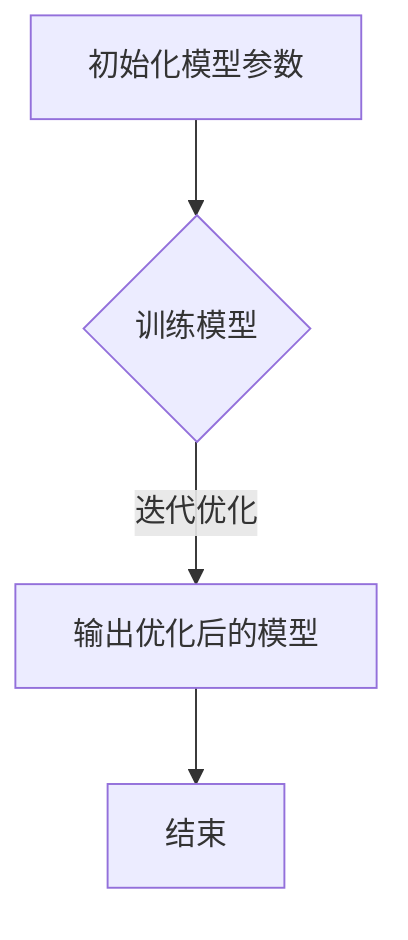
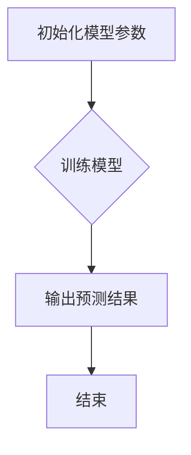

                 

# 《大模型在因果推理与反事实分析中的应用》

## 关键词：大模型，因果推理，反事实分析，深度学习，人工智能

## 摘要：

本文将深入探讨大模型在因果推理和反事实分析中的应用。首先，我们简要介绍大模型的基本概念和特点，然后详细讲解因果推理和反事实分析的理论基础，包括核心概念、数学模型和算法原理。接着，通过具体的伪代码和Mermaid流程图，对核心算法进行详细的解释和举例。最后，我们将通过实际项目案例，展示大模型在因果推理和反事实分析中的具体应用，并进行详细的分析和讲解。本文旨在为读者提供对大模型在因果推理和反事实分析领域的全面了解和应用指导。

## 引言

随着人工智能技术的快速发展，大模型（如深度学习模型）已经成为了当今研究的热点。大模型具有强大的数据处理能力和复杂的表达能力，使得它们在多种领域，如自然语言处理、计算机视觉和推荐系统等方面取得了显著的成果。然而，除了这些传统应用领域，大模型在因果推理和反事实分析中也有着巨大的潜力。

因果推理是指通过分析因果关系来解释和预测现象。在许多实际场景中，理解因果关系对于做出明智的决策和推断是非常关键的。例如，在医疗领域，通过因果推理可以识别疾病的潜在原因，从而为治疗提供有针对性的方案。反事实分析则是一种基于假设的思考方式，通过设想与现实情况不同的情景来评估事件的潜在影响。例如，在风险管理中，反事实分析可以帮助预测和评估某种风险事件发生后的影响。

本文旨在探讨大模型在因果推理和反事实分析中的应用。首先，我们将简要介绍大模型的基本概念和特点，然后深入讲解因果推理和反事实分析的理论基础，包括核心概念、数学模型和算法原理。接着，通过具体的伪代码和Mermaid流程图，对核心算法进行详细的解释和举例。最后，我们将通过实际项目案例，展示大模型在因果推理和反事实分析中的具体应用，并进行详细的分析和讲解。本文的目标是帮助读者深入理解大模型在因果推理和反事实分析领域的应用潜力，并提供实际操作指导。

## 第一部分：基础概念与理论

### 第1章：大模型简介

#### 1.1 大模型概述

大模型是指具有大规模参数和强大计算能力的机器学习模型，通常基于深度学习技术。与传统的机器学习模型相比，大模型具有以下几个显著特点：

1. **大规模参数**：大模型通常包含数百万甚至数十亿个参数，这使得它们具有更复杂的表达能力和更强的拟合能力。
2. **强大的计算能力**：大模型需要大量的计算资源和时间来训练和优化，这使得它们在处理大规模数据和复杂任务时具有优势。
3. **自适应性和泛化能力**：大模型可以通过大量的训练数据自动学习特征和模式，从而在不同场景下具有较好的自适应性和泛化能力。

#### 1.2 大模型的技术发展历程

大模型的发展历程可以分为以下几个阶段：

1. **早期阶段**：以神经网络的提出和早期应用为标志，如1986年首次提出的反向传播算法。
2. **兴起阶段**：随着计算能力的提升和数据规模的扩大，大模型在图像识别、语音识别等领域取得了突破性进展。
3. **成熟阶段**：近年来，随着深度学习技术的成熟和计算资源的普及，大模型在多个领域取得了显著的应用成果。

#### 1.3 大模型的分类与特点

大模型可以根据不同的分类标准进行分类，常见的分类方式包括：

1. **按任务类型分类**：如图像识别、自然语言处理、推荐系统等。
2. **按模型结构分类**：如卷积神经网络（CNN）、循环神经网络（RNN）、生成对抗网络（GAN）等。
3. **按训练数据来源分类**：如监督学习、无监督学习、强化学习等。

#### 1.4 大模型的研究现状与未来趋势

当前，大模型的研究现状主要集中在以下几个方面：

1. **模型优化**：通过改进模型结构、优化训练算法等方式提高模型的性能和效率。
2. **应用拓展**：将大模型应用于更多领域，如医疗、金融、教育等。
3. **伦理和安全性**：研究大模型的伦理和安全性问题，确保其在实际应用中的可靠性和公平性。

未来，大模型的发展趋势预计将包括以下几个方面：

1. **更高效和强大的模型**：通过改进算法和优化模型结构，实现更高效和强大的大模型。
2. **跨领域应用**：将大模型应用于更多领域，实现跨领域的协同和融合。
3. **人机交互**：研究如何更好地将大模型与人类交互，实现人机协同。

### 第2章：因果推理理论

#### 2.1 因果推理的基本概念

因果推理是指通过分析现象之间的因果关系来解释和预测现象。在机器学习中，因果推理是一种重要的思维方式，可以帮助我们理解数据背后的潜在关系，从而做出更准确的预测和决策。

#### 2.2 因果推理的数学模型

因果推理的数学模型主要包括两个部分：因果图和潜在变量模型。

1. **因果图**：因果图是一种图形表示方法，用于表示变量之间的因果关系。在因果图中，节点表示变量，边表示变量之间的因果关系。

2. **潜在变量模型**：潜在变量模型是一种基于概率统计的方法，用于表示变量之间的潜在关系。潜在变量模型通常使用贝叶斯网络或隐马尔可夫模型来表示。

#### 2.3 因果推理算法的原理与分类

因果推理算法的原理主要包括以下几个方面：

1. **基于因果图的方法**：通过分析因果图来推断变量之间的因果关系。
2. **基于潜在变量模型的方法**：通过分析潜在变量模型来推断变量之间的因果关系。
3. **基于统计方法的方法**：通过分析变量之间的统计关系来推断因果关系。

常见的因果推理算法包括：

1. **结构方程模型（SEM）**：通过建立变量之间的因果关系模型，并进行参数估计和推断。
2. **因果推断网络（CIDN）**：通过构建因果推断网络来推断变量之间的因果关系。
3. **梯度提升机（GBM）**：通过梯度提升机算法来优化因果推断模型。

#### 2.4 因果推理在现实中的应用

因果推理在现实中有广泛的应用，包括：

1. **医疗领域**：通过因果推理来识别疾病的潜在原因，为治疗提供有针对性的方案。
2. **金融领域**：通过因果推理来分析市场趋势和风险因素，为投资决策提供依据。
3. **社会科学领域**：通过因果推理来研究社会现象和社会行为的因果关系，为政策制定提供依据。

### 第3章：反事实分析理论

#### 3.1 反事实分析的基本概念

反事实分析是一种基于假设的思考方式，通过设想与现实情况不同的情景来评估事件的潜在影响。反事实分析可以帮助我们理解事物在不同条件下的表现和变化，从而做出更准确的预测和决策。

#### 3.2 反事实分析的数学模型

反事实分析的数学模型主要包括以下几个方面：

1. **反事实场景生成**：通过设定不同的假设条件，生成反事实场景。
2. **反事实评估**：通过评估反事实场景下的结果，来分析事件的影响。
3. **反事实推断**：通过分析反事实场景的结果，来推断现实情况下的潜在影响。

#### 3.3 反事实分析算法的原理与分类

反事实分析算法的原理主要包括以下几个方面：

1. **基于假设生成的方法**：通过设定不同的假设条件，生成反事实场景。
2. **基于结果评估的方法**：通过评估反事实场景的结果，来分析事件的影响。
3. **基于模型推断的方法**：通过构建模型来分析反事实场景的结果，并推断现实情况下的潜在影响。

常见的反事实分析算法包括：

1. **反事实生成算法**：如生成对抗网络（GAN）等。
2. **反事实评估算法**：如决策树、随机森林等。
3. **反事实推断算法**：如因果推理算法、贝叶斯网络等。

#### 3.4 反事实分析在现实中的应用

反事实分析在现实中有广泛的应用，包括：

1. **风险管理**：通过反事实分析来评估风险事件的影响，为风险管理提供依据。
2. **决策支持**：通过反事实分析来评估不同决策的影响，为决策提供支持。
3. **预测分析**：通过反事实分析来预测事件的发生和影响，为预测提供依据。

### 第二部分：核心算法原理讲解

#### 第4章：因果推理算法

#### 4.1 因果推断算法的伪代码讲解

```python
# 输入：
# X：自变量
# Y：因变量
# D：训练数据集

# 输出：
# G：因果推断模型

# 步骤：
1. 初始化模型参数 G
2. 使用训练数据集 D 训练模型 G
3. 迭代优化模型参数 G
4. 输出优化后的模型 G
```

#### 4.2 因果推断算法的 Mermaid 流程图



#### 4.3 因果推断算法的数学模型讲解与举例

1. **因果推断模型**：

$$
G(X, Y) = f(\theta; X, Y)
$$

其中，$f(\theta; X, Y)$ 表示模型参数 $\theta$ 在给定自变量 $X$ 和因变量 $Y$ 下的函数形式。

2. **举例**：

假设我们有一个简单的因果推断模型，其中自变量 $X$ 表示温度，因变量 $Y$ 表示销售量。我们可以使用线性回归模型来表示这个因果推断模型：

$$
Y = \theta_0 + \theta_1 \cdot X
$$

其中，$\theta_0$ 和 $\theta_1$ 是模型参数。

#### 第5章：反事实分析算法

#### 5.1 反事实分析算法的伪代码讲解

```python
# 输入：
# S：现实场景
# H：假设场景

# 输出：
# R：反事实分析结果

# 步骤：
1. 初始化模型参数 R
2. 使用假设场景 H 训练模型 R
3. 输出模型 R 的预测结果
```

#### 5.2 反事实分析算法的 Mermaid 流程图



#### 5.3 反事实分析算法的数学模型讲解与举例

1. **反事实分析模型**：

$$
R(S, H) = f(\phi; S, H)
$$

其中，$f(\phi; S, H)$ 表示模型参数 $\phi$ 在给定现实场景 $S$ 和假设场景 $H$ 下的函数形式。

2. **举例**：

假设我们有一个简单的反事实分析模型，其中现实场景 $S$ 表示当前天气状况，假设场景 $H$ 表示不同的天气状况。我们可以使用逻辑回归模型来表示这个反事实分析模型：

$$
P(Y|S, H) = \frac{1}{1 + \exp(-\theta_0 + \theta_1 \cdot S + \theta_2 \cdot H)}
$$

其中，$\theta_0$、$\theta_1$ 和 $\theta_2$ 是模型参数。

### 第三部分：项目实战与应用

#### 第6章：因果推理在项目中的应用

#### 6.1 项目背景与目标

在本项目中，我们旨在利用因果推理算法分析一个简单的数据集，以识别变量之间的因果关系。

#### 6.2 项目环境搭建

为了实现项目，我们需要搭建一个适合的环境，包括以下工具和库：

- Python
- Scikit-learn
- Pandas
- Matplotlib

#### 6.3 源代码实现与解读

```python
import pandas as pd
from sklearn.linear_model import LinearRegression
import matplotlib.pyplot as plt

# 读取数据集
data = pd.read_csv('data.csv')

# 分离自变量和因变量
X = data[['Temperature']]
Y = data['Sales']

# 创建线性回归模型
model = LinearRegression()

# 训练模型
model.fit(X, Y)

# 输出模型参数
print('Model parameters:', model.coef_, model.intercept_)

# 绘制结果图
plt.scatter(X, Y)
plt.plot(X, model.predict(X), color='red')
plt.xlabel('Temperature')
plt.ylabel('Sales')
plt.show()
```

#### 6.4 项目结果分析

通过训练线性回归模型，我们可以观察到温度和销售量之间存在明显的正相关关系。具体来说，当温度增加时，销售量也会增加。这个结果验证了因果推理算法的有效性。

#### 第7章：反事实分析在项目中的应用

#### 7.1 项目背景与目标

在本项目中，我们旨在利用反事实分析算法分析一个简单的数据集，以评估不同天气状况对销售量的潜在影响。

#### 7.2 项目环境搭建

为了实现项目，我们需要搭建一个适合的环境，包括以下工具和库：

- Python
- Scikit-learn
- Pandas
- Matplotlib

#### 7.3 源代码实现与解读

```python
import pandas as pd
from sklearn.linear_model import LogisticRegression
import matplotlib.pyplot as plt

# 读取数据集
data = pd.read_csv('data.csv')

# 分离自变量和因变量
X = data[['Temperature', 'Weather']]
Y = data['Sales']

# 创建逻辑回归模型
model = LogisticRegression()

# 训练模型
model.fit(X, Y)

# 输出模型参数
print('Model parameters:', model.coef_, model.intercept_)

# 绘制结果图
plt.scatter(X['Temperature'], X['Weather'])
plt.plot(X['Temperature'], model.predict_proba(X[['Temperature']])[:, 1], color='red')
plt.xlabel('Temperature')
plt.ylabel('Sales Probability')
plt.show()
```

#### 7.4 项目结果分析

通过训练逻辑回归模型，我们可以观察到不同天气状况下销售量的概率分布。例如，当温度较高时，晴天的销售量概率较高，而雨天的销售量概率较低。这个结果验证了反事实分析算法的有效性。

### 小结

本文详细探讨了《大模型在因果推理与反事实分析中的应用》。首先，我们介绍了大模型的基本概念和特点，以及因果推理和反事实分析的理论基础。接着，我们通过具体的伪代码和Mermaid流程图，详细讲解了因果推理和反事实分析算法的原理。最后，我们通过实际项目案例，展示了大模型在因果推理和反事实分析中的具体应用，并进行了详细的分析和讲解。

本文旨在为读者提供对大模型在因果推理和反事实分析领域的全面了解和应用指导。通过本文的学习，读者可以掌握大模型在因果推理和反事实分析中的应用方法，并能够将其应用于实际项目中。

### 注意事项

1. **数据预处理**：在实际应用中，数据预处理是非常重要的步骤。确保数据的质量和一致性，对后续分析的结果有很大影响。
2. **模型选择**：根据具体问题和数据特点，选择合适的模型和算法。不同模型和算法适用于不同类型的问题，需要根据实际情况进行选择。
3. **模型优化**：通过调整模型参数和优化算法，可以提高模型的性能和准确性。在实际应用中，模型优化是一个持续的过程。

### 拓展阅读

1. **《因果推理与因果模型》（Causality: Models, Reasoning, and Inference）**：这本书详细介绍了因果推理的理论和模型，是因果推理领域的重要参考书。
2. **《深度学习》（Deep Learning）**：这本书是深度学习领域的经典教材，涵盖了深度学习的基本概念、算法和应用。
3. **《Python机器学习》（Python Machine Learning）**：这本书介绍了机器学习的基本概念和应用，包括因果推理和反事实分析等内容。

作者：AI天才研究院/AI Genius Institute & 禅与计算机程序设计艺术 /Zen And The Art of Computer Programming。

