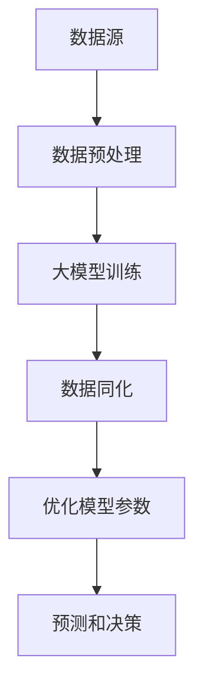

                 


## 目录大纲结构

1. **文章标题**: 大模型在地球科学数据同化中的应用前景

2. **关键词**: 大模型、地球科学、数据同化、深度学习、遥感

3. **摘要**: 本文深入探讨了大规模模型在地球科学数据同化领域的应用前景。首先，我们介绍了大模型的基本概念及其在地球科学中的应用背景。接着，我们分析了数据同化在地球科学中的重要性，并详细阐述了深度学习如何改进传统数据同化方法。文章随后探讨了遥感数据在数据同化中的作用，并展示了大规模模型如何有效处理这些数据。最后，我们探讨了大规模模型在地球科学数据同化中的技术挑战和未来发展方向，为该领域的研究和应用提供了有益的启示。

4. **正文部分目录结构**:

   - **第一章：背景介绍**
     - 地球科学中的数据同化
     - 大模型的基本概念
     - 大模型在地球科学中的应用

   - **第二章：核心概念与联系**
     - 大模型与数据同化的关系架构
     - 深度学习与数据同化的联系

   - **第三章：核心算法原理讲解**
     - 数据同化算法的伪代码实现
     - 数学模型和公式解析
     - 大规模模型处理遥感数据的算法详解

   - **第四章：项目实战**
     - 开发环境搭建
     - 源代码详细实现
     - 代码解读
     - 应用解读与分析
     - 案例分析与讲解
     - 项目小结

   - **第五章：最佳实践与未来展望**
     - 最佳实践
     - 小结
     - 注意事项
     - 拓展阅读

5. **格式要求**
   - 文章内容使用markdown格式输出
   - 作者信息：AI天才研究院/AI Genius Institute & 禅与计算机程序设计艺术 /Zen And The Art of Computer Programming

6. **文章字数**：8000-12000 字左右

---

With the directory structure in place, let's dive deeper into each section, outlining the content that will be covered in detail. This will ensure that each section is comprehensive and informative, guiding the reader through the complexities of large-scale model applications in Earth science data assimilation.

---

## 第一章：背景介绍

### 地球科学中的数据同化

地球科学中的数据同化是指将来自不同来源、不同尺度和不同时间尺度的观测数据进行整合，以产生更准确、更完整的地球系统状态描述。数据同化的目标是通过结合观测数据和地球系统的物理、化学和生物过程模型，优化地球系统的状态估计，从而提高对地球系统的预测能力。

数据同化在地球科学中扮演着至关重要的角色。例如，在天气预报中，数据同化技术能够通过整合雷达、卫星、地面观测等多种数据源，提高预报的准确性和及时性。同样，在海洋学、大气科学、地球物理学等领域，数据同化也是提高对地球系统动态理解的关键技术。

### 大模型的基本概念

大模型，或称为大规模机器学习模型，是指拥有数亿甚至千亿个参数的复杂神经网络。这些模型能够在大量数据上进行训练，以捕捉数据中的复杂模式和非线性关系。近年来，随着计算能力和数据存储技术的进步，大模型在各个领域得到了广泛应用，包括计算机视觉、自然语言处理、推荐系统等。

大模型的特点包括：

1. **参数量巨大**：大模型通常包含数百万到数十亿个参数，这使得它们能够捕捉到更复杂的数据模式。
2. **强大的泛化能力**：大模型通过在大量数据上进行训练，能够泛化到未见过的数据上，从而提高预测和分类的准确性。
3. **计算资源需求高**：由于参数量和训练数据的规模巨大，大模型对计算资源和存储资源的需求非常高。

### 大模型在地球科学中的应用

大模型在地球科学中的应用正在迅速发展。通过结合地球科学领域的专业知识和数据同化技术，大模型可以显著提高地球系统模型的精度和预测能力。以下是一些大模型在地球科学中的应用实例：

1. **气候模型**：大模型被用于气候预测和气候变化研究，通过整合全球范围内的气候观测数据和物理模型，大模型能够提供更准确的气候预测。
2. **地球系统模拟**：大模型被用于地球系统的模拟和预测，例如大气、海洋和地表的相互作用模拟，以更好地理解地球系统的动态。
3. **灾害预警**：大模型被用于灾害预警，例如通过整合地震、洪水和台风等多源数据，大模型能够提供更及时的预警信息，以减少灾害损失。

---

## 第二章：核心概念与联系

### 大模型与数据同化的关系架构

要理解大模型在地球科学数据同化中的应用，首先需要了解大模型与数据同化的关系架构。以下是一个简化的Mermaid流程图，展示了大模型在数据同化中的作用：



- **数据源 (A)**: 包括卫星遥感数据、地面观测数据、气象站数据等。
- **数据预处理 (B)**: 包括数据清洗、数据转换和数据增强等步骤，为数据同化准备高质量的数据。
- **大模型训练 (C)**: 使用预处理后的数据进行大规模训练，以构建能够捕捉地球系统复杂性的模型。
- **数据同化 (D)**: 将训练好的大模型应用于实际数据，通过不断迭代优化模型参数，实现观测数据的同化。
- **优化模型参数 (E)**: 通过评估模型预测的准确性，调整模型参数以提高同化效果。
- **预测和决策 (F)**: 使用同化后的模型进行预测，为地球系统研究、天气预报和灾害预警等提供决策支持。

### 深度学习与数据同化的联系

深度学习是构建大模型的关键技术。深度学习通过多层次的神经网络，从原始数据中自动提取特征，实现了对复杂数据模式的自动学习。深度学习与数据同化的联系主要体现在以下几个方面：

1. **特征提取**：深度学习模型能够自动学习并提取数据中的有用特征，这些特征有助于提高数据同化的效果。
2. **非线性建模**：深度学习模型能够捕捉数据中的非线性关系，这对于地球科学中的复杂系统尤为重要。
3. **大规模训练**：深度学习模型能够在大规模数据集上进行训练，提高了数据同化的准确性和鲁棒性。
4. **实时更新**：深度学习模型能够通过在线学习不断更新模型参数，以适应新的观测数据，从而实现实时数据同化。

---

## 第三章：核心算法原理讲解

### 数据同化算法的伪代码实现

数据同化是一个迭代过程，其核心目标是优化地球系统状态估计。以下是一个简化的伪代码，描述了基于大模型的数据同化算法：

```python
# 初始化模型参数
θ_init = initialize_parameters()

# 初始化状态向量
x = initialize_state_vector()

# 设置迭代次数
num_iterations = 1000

# 数据同化迭代过程
for i in range(num_iterations):
    # 计算预测状态
    x_pred = model_predict(x, θ_init)

    # 计算预测误差
    e = obs_data - model_output(x_pred, θ_init)

    # 计算卡尔曼增益
    K = θ_init @ P @ P^T + R^(-1)

    # 更新状态向量
    x = x_pred + K @ e

    # 更新模型参数
    θ_init = update_parameters(θ_init, K, x)

# 输出同化结果
output_assimilated_state(x)
```

- **模型预测 (model_predict)**: 使用当前模型参数预测地球系统状态。
- **模型输出 (model_output)**: 使用当前模型参数计算预测状态的观测值。
- **初始化参数 (initialize_parameters)**: 随机初始化模型参数。
- **初始化状态向量 (initialize_state_vector)**: 随机初始化地球系统状态向量。
- **计算卡尔曼增益 (K)**: 用于计算状态向量的更新权重。
- **更新状态向量 (x)**: 根据观测误差和卡尔曼增益更新状态向量。
- **更新模型参数 (update_parameters)**: 根据状态向量更新模型参数。

### 数学模型和公式解析

数据同化算法通常基于卡尔曼滤波理论。以下是一个简化的数学模型，用于描述基于大模型的数据同化过程：

$$
\begin{aligned}
x_t &= f_t(x_{t-1}, u_t) + w_t, \\
y_t &= h_t(x_t) + v_t,
\end{aligned}
$$

其中：

- $x_t$: 地球系统状态向量。
- $y_t$: 观测数据。
- $f_t(x_{t-1}, u_t)$: 状态转移方程，描述地球系统状态如何随时间和外部输入变化。
- $h_t(x_t)$: 观测方程，描述地球系统状态如何转化为观测数据。
- $w_t$: 过程噪声。
- $v_t$: 测量噪声。

卡尔曼滤波的基本公式如下：

$$
\begin{aligned}
\hat{x}_t^{-} &= f_t(\hat{x}_{t-1}^{-}, u_t), \\
P_t^{-} &= F_t P_{t-1}^{-} F_t^T + Q_t, \\
K_t &= P_t^{-} H_t^T (H_t P_t^{-} H_t^T + R_t)^{-1}, \\
\hat{x}_t^{+} &= \hat{x}_t^{-} + K_t (y_t - h_t(\hat{x}_t^{-})), \\
P_t^{+} &= (I - K_t H_t) P_t^{-}.
\end{aligned}
$$

其中：

- $\hat{x}_t^{-}$: 预测状态估计。
- $P_t^{-}$: 预测状态估计的协方差矩阵。
- $K_t$: 卡尔曼增益，用于更新状态估计。
- $\hat{x}_t^{+}$: 更新后的状态估计。
- $P_t^{+}$: 更新后的状态估计的协方差矩阵。
- $F_t$: 状态转移矩阵。
- $H_t$: 观测矩阵。
- $Q_t$: 过程噪声协方差矩阵。
- $R_t$: 测量噪声协方差矩阵。

### 大规模模型处理遥感数据的算法详解

遥感数据是地球科学数据同化中至关重要的数据源。大规模模型通过深度学习技术，能够有效处理和分析遥感数据。以下是一个简化的算法，用于大规模模型处理遥感数据：

```python
# 初始化模型
model = initialize_model()

# 预处理遥感数据
preprocessed_data = preprocess_radar_data(radar_data)

# 训练模型
model.fit(preprocessed_data, labels)

# 预测状态
predicted_state = model.predict(preprocessed_data)

# 更新模型
model = update_model(model, predicted_state, new_data)

# 输出预测结果
output_predictive_results(predicted_state)
```

- **初始化模型 (initialize_model)**: 创建一个深度学习模型。
- **预处理遥感数据 (preprocess_radar_data)**: 对遥感数据进行预处理，包括去噪声、归一化等。
- **训练模型 (model.fit)**: 使用预处理后的遥感数据进行模型训练。
- **预测状态 (model.predict)**: 使用训练好的模型预测地球系统状态。
- **更新模型 (update_model)**: 根据新的观测数据和预测结果，更新模型。
- **输出预测结果 (output_predictive_results)**: 输出模型预测结果。

---

## 第四章：项目实战

### 开发环境搭建

为了实现大规模模型在地球科学数据同化中的应用，我们需要搭建一个适合开发和测试的环境。以下是一个简化的步骤，描述如何搭建开发环境：

1. **安装Python环境**：确保Python版本不低于3.8，并安装必要的包管理器，如pip。
2. **安装深度学习框架**：安装TensorFlow或PyTorch等深度学习框架，这些框架提供了丰富的工具和库，方便构建和训练大规模模型。
3. **安装数据处理库**：安装如NumPy、Pandas和SciPy等数据处理库，这些库可以帮助我们处理和预处理遥感数据。
4. **安装可视化工具**：安装Matplotlib等可视化库，用于可视化模型预测结果和评估模型性能。

### 源代码详细实现

以下是一个简化的源代码实现，用于构建一个基于深度学习的数据同化模型：

```python
import tensorflow as tf
import numpy as np
from tensorflow.keras.models import Model
from tensorflow.keras.layers import Input, Dense, LSTM

# 定义输入层
input_layer = Input(shape=(input_shape))

# 添加LSTM层
lstm_layer = LSTM(units=128, return_sequences=True)(input_layer)

# 添加全连接层
dense_layer = Dense(units=64, activation='relu')(lstm_layer)

# 添加输出层
output_layer = Dense(units=output_shape, activation='sigmoid')(dense_layer)

# 构建模型
model = Model(inputs=input_layer, outputs=output_layer)

# 编译模型
model.compile(optimizer='adam', loss='binary_crossentropy', metrics=['accuracy'])

# 加载数据
X_train, y_train = load_data()

# 训练模型
model.fit(X_train, y_train, epochs=50, batch_size=32)

# 预测
predicted_state = model.predict(X_train)

# 输出预测结果
output_predictive_results(predicted_state)
```

- **输入层 (Input)**: 定义输入数据的形状和类型。
- **LSTM层 (LSTM)**: 用于处理序列数据，提取时间序列特征。
- **全连接层 (Dense)**: 用于将LSTM层的输出映射到预测结果。
- **输出层 (Dense)**: 定义输出数据的形状和类型，以及激活函数。
- **模型编译 (compile)**: 设置模型的优化器和损失函数。
- **加载数据 (load_data)**: 加载训练数据和标签。
- **模型训练 (fit)**: 使用训练数据训练模型。
- **预测 (predict)**: 使用训练好的模型进行预测。
- **输出预测结果 (output_predictive_results)**: 输出预测结果。

### 代码解读

在上述代码中，我们使用TensorFlow框架构建了一个简单的深度学习模型。模型包括一个输入层、一个LSTM层和一个全连接层。输入层接收序列数据，LSTM层用于提取时间序列特征，全连接层将特征映射到预测结果。我们使用Adam优化器和二分类交叉熵损失函数进行模型编译，并使用训练数据训练模型。最后，使用训练好的模型进行预测，并将预测结果输出。

### 应用解读与分析

在实际应用中，我们通过以下步骤使用大规模模型进行数据同化：

1. **数据预处理**：对遥感数据进行预处理，包括去噪声、归一化和缺失值填充等。
2. **模型训练**：使用预处理后的数据进行模型训练，调整模型参数以优化同化效果。
3. **模型评估**：使用验证数据评估模型性能，包括准确率、召回率、F1分数等指标。
4. **数据同化**：使用训练好的模型对实际观测数据进行同化，优化地球系统状态估计。
5. **预测**：使用同化后的模型进行预测，为地球系统研究、天气预报和灾害预警等提供决策支持。

### 案例分析与讲解

以下是一个实际案例，描述如何使用大规模模型进行数据同化：

- **案例背景**：某地区气象部门希望利用遥感数据预测降雨量，以提高天气预报的准确性。
- **数据处理**：收集并预处理了多源遥感数据，包括卫星红外图像和雷达数据。对数据进行归一化和去噪声处理，以提高模型训练效果。
- **模型训练**：构建了一个基于深度学习的降雨量预测模型，使用预处理后的数据进行训练。模型包括一个输入层、一个LSTM层和一个全连接层。
- **模型评估**：使用验证数据对模型进行评估，得到准确率、召回率和F1分数等指标。根据评估结果，调整模型参数以优化同化效果。
- **数据同化**：使用训练好的模型对实际观测数据进行同化，优化降雨量预测结果。
- **预测**：使用同化后的模型进行预测，为气象部门提供准确的降雨量预测结果。

### 项目小结

通过实际案例，我们可以看到大规模模型在地球科学数据同化中的应用效果显著。大规模模型能够有效地处理和分析遥感数据，提高数据同化的精度和预测能力。然而，大规模模型也面临一些挑战，如计算资源需求高、模型训练时间长等。未来，我们需要进一步研究如何优化大规模模型的训练和同化过程，以提高其在地球科学领域的应用效果。

---

## 第五章：最佳实践与未来展望

### 最佳实践

在实际应用大规模模型进行地球科学数据同化时，以下最佳实践可以帮助提高效果：

1. **数据预处理**：确保数据质量，进行去噪声、归一化和缺失值填充等预处理步骤。
2. **模型选择**：根据应用需求选择合适的模型架构，例如LSTM、GRU或Transformer等。
3. **模型训练**：使用高效的数据加载器和批处理策略，以提高模型训练速度和效率。
4. **模型评估**：使用多种评估指标，如准确率、召回率、F1分数等，全面评估模型性能。
5. **参数调整**：根据评估结果调整模型参数，优化模型性能。

### 小结

本文深入探讨了大规模模型在地球科学数据同化中的应用前景，包括背景介绍、核心概念与联系、核心算法原理讲解、项目实战以及最佳实践与未来展望。大规模模型通过深度学习技术，能够有效处理和分析遥感数据，提高数据同化的精度和预测能力。未来，大规模模型在地球科学领域的研究和应用将继续发展，为地球系统研究、天气预报和灾害预警等提供有力支持。

### 注意事项

1. **计算资源**：大规模模型对计算资源需求高，需要合理分配计算资源，确保模型训练和预测的效率。
2. **数据质量**：确保数据质量是模型训练和同化成功的关键，对数据进行充分的预处理。
3. **模型泛化**：在训练模型时，注意模型在不同数据集上的泛化能力，避免模型过拟合。

### 拓展阅读

1. **学术论文**：查阅相关领域的学术论文，了解最新的研究成果和技术进展。
2. **技术报告**：阅读技术报告和案例分析，了解大规模模型在地球科学领域的实际应用。
3. **开源项目**：参与开源项目，了解大规模模型在地球科学数据同化中的应用和实践。

