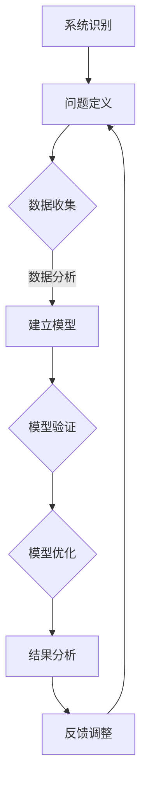

                 

### 用户需求分析

在当前信息技术飞速发展的背景下，复杂系统的建模与仿真技术已经成为推动多个行业进步的关键技术之一。用户希望我们撰写的一本书籍《大模型在复杂系统建模与仿真中的创新》，旨在探讨大模型在复杂系统建模与仿真领域中的实际应用及其创新点。用户特别强调以下几个方面：

1. **核心概念与原理**：需要深入阐述大模型的基本概念、原理及其在复杂系统建模与仿真中的应用场景。
2. **算法与模型**：详细介绍大模型相关的算法和模型，以及这些算法在复杂系统中的应用和优化策略。
3. **数学模型与公式**：提供详尽的数学模型和公式讲解，确保读者能够理解大模型背后的数学逻辑。
4. **项目实战**：通过实际案例展示大模型在复杂系统建模与仿真中的应用，并详细解读项目的开发环境搭建、源代码实现和代码分析。
5. **未来发展趋势**：预测大模型在复杂系统建模与仿真领域的发展方向，为读者提供未来的研究与应用思路。

用户需求的核心在于：

- **全面覆盖主题内容**：确保书籍内容系统、全面，能够满足不同层次读者的需求。
- **逻辑清晰，结构紧凑**：通过清晰的章节结构和逻辑关系，让读者易于阅读和理解。
- **简单易懂的专业语言**：使用易于理解的术语和语言，使非专业人士也能够理解复杂系统建模与仿真的核心概念。
- **高质量内容**：提供深度分析、见解独到且具有实践价值的内容。

因此，本文将遵循用户的详细需求，通过一步步的分析和推理，系统地阐述大模型在复杂系统建模与仿真中的创新点，确保文章的逻辑性、结构性和专业性。

### 目录大纲设计

为了确保书籍《大模型在复杂系统建模与仿真中的创新》能够全面、系统地覆盖主题内容，我们设计了如下详细的目录大纲：

#### 第一部分：引言
- **第1章 大模型在复杂系统建模与仿真中的应用背景**  
  - **1.1 复杂系统的定义与特性**  
  - **1.2 大模型在复杂系统研究中的重要性**  
  - **1.3 大模型在复杂系统建模与仿真中的应用场景**

- **第2章 大模型在复杂系统建模与仿真中的优势与挑战**  
  - **2.1 大模型的优势**  
  - **2.2 大模型在复杂系统建模与仿真中的挑战**  
  - **2.3 应对挑战的策略**

#### 第二部分：理论基础
- **第3章 复杂系统建模与仿真的基本概念**  
  - **3.1 复杂系统的分类与特征**  
  - **3.2 建模与仿真的目标与方法**  
  - **3.3 数学模型的基本原理**

- **第4章 大模型的基本原理与架构**  
  - **4.1 大模型的发展历程**  
  - **4.2 大模型的架构与组成**  
  - **4.3 大模型的核心算法**

- **第5章 数学模型与数学公式解析**  
  - **5.1 常用数学模型介绍**  
  - **5.2 数学公式详解**  
  - **5.3 数学公式在实际应用中的举例说明**

#### 第三部分：算法与模型
- **第6章 常见的大模型算法与技术**  
  - **6.1 神经网络算法**  
  - **6.2 深度学习算法**  
  - **6.3 强化学习算法**

- **第7章 大模型在复杂系统建模中的优化策略**  
  - **7.1 优化策略概述**  
  - **7.2 常用优化算法**  
  - **7.3 优化策略在复杂系统建模中的应用**

#### 第四部分：应用案例
- **第8章 大模型在复杂系统建模与仿真中的应用案例**  
  - **8.1 案例一：大模型在交通系统仿真中的应用**  
  - **8.2 案例二：大模型在金融风险管理中的应用**  
  - **8.3 案例三：大模型在医疗健康领域中的应用**

- **第9章 大模型在复杂系统仿真中的挑战与解决方案**  
  - **9.1 挑战分析**  
  - **9.2 解决方案探讨**  
  - **9.3 案例分析与讨论**

#### 第五部分：未来发展趋势
- **第10章 大模型在复杂系统建模与仿真的未来发展趋势**  
  - **10.1 技术趋势分析**  
  - **10.2 应用前景展望**  
  - **10.3 发展策略建议**

#### 目录大纲设计说明

1. **引言部分**：通过背景介绍和优势挑战分析，为后续章节的内容奠定基础。
2. **理论基础部分**：详细讲解复杂系统建模与仿真的基本概念、大模型的基本原理与数学模型，为理解算法和实际应用提供理论支持。
3. **算法与模型部分**：介绍大模型相关的算法和技术，包括神经网络、深度学习和强化学习，以及优化策略，展示大模型在复杂系统建模中的实际应用。
4. **应用案例部分**：通过具体应用案例，展示大模型在复杂系统仿真中的实际效果和解决方案，增强读者的理解和应用能力。
5. **未来发展趋势部分**：分析大模型在复杂系统建模与仿真领域的发展趋势，为未来研究和应用提供方向和建议。

通过这种结构化的设计，书籍能够帮助读者系统地掌握大模型在复杂系统建模与仿真中的核心概念、原理和应用方法，为他们在实际工作和研究中提供有力的指导。

### 目录大纲内容规划

#### 概述章节

第1章：大模型在复杂系统建模与仿真中的应用背景
- **内容**：首先介绍复杂系统的定义和特性，阐述其在各个领域中的重要性。然后，引入大模型的概念，解释其为何成为解决复杂系统问题的有力工具。最后，探讨大模型在复杂系统建模与仿真中的应用场景，包括交通系统、金融风险管理和医疗健康领域等。

第2章：大模型在复杂系统建模与仿真中的优势与挑战
- **内容**：分析大模型在复杂系统建模与仿真中的优势，如高精度预测、自适应能力和强大的数据处理能力。同时，讨论大模型在应用过程中可能面临的挑战，如数据依赖性、计算资源和算法复杂性等问题。最后，提出一些应对这些挑战的策略，为后续章节的内容铺垫。

#### 理论基础章节

第3章：复杂系统建模与仿真的基本概念
- **内容**：详细讲解复杂系统的分类与特征，包括线性与非线性系统、确定性系统与随机系统等。然后，阐述建模与仿真的目标和方法，解释建模与仿真的关系和重要性。最后，介绍数学模型的基本原理，包括常见模型类型和它们在复杂系统中的应用。

第4章：大模型的基本原理与架构
- **内容**：首先回顾大模型的发展历程，从传统的简单模型到现代的复杂模型。然后，详细介绍大模型的架构与组成，包括输入层、隐藏层和输出层等。最后，讲解大模型的核心算法，如神经网络算法、深度学习算法和强化学习算法，以及这些算法在复杂系统建模中的应用。

第5章：数学模型与数学公式解析
- **内容**：首先介绍常用数学模型，包括线性模型、非线性模型、概率模型和优化模型等。然后，详细讲解数学公式，包括线性方程组求解、矩阵运算、概率分布函数和优化目标函数等。最后，通过实际应用中的举例说明，帮助读者理解数学模型和公式在复杂系统建模中的具体应用。

#### 算法与模型章节

第6章：常见的大模型算法与技术
- **内容**：详细介绍大模型算法，包括神经网络算法、深度学习算法和强化学习算法。解释这些算法的基本原理和实现方法，以及它们在复杂系统建模中的应用。例如，如何使用神经网络算法进行非线性函数拟合，如何利用深度学习算法进行图像识别，以及如何通过强化学习算法进行智能决策。

第7章：大模型在复杂系统建模中的优化策略
- **内容**：首先介绍优化策略的概念和重要性，解释如何在复杂系统建模中使用优化策略。然后，详细介绍常用的优化算法，包括梯度下降法、遗传算法和粒子群优化算法等。最后，讨论优化策略在复杂系统建模中的应用，如参数优化、结构优化和性能优化等。

#### 应用案例章节

第8章：大模型在复杂系统建模与仿真中的应用案例
- **内容**：通过具体案例展示大模型在复杂系统建模与仿真中的应用。每个案例包括背景介绍、应用场景、建模方法、仿真结果和分析讨论等。例如，可以介绍大模型在交通系统仿真中的应用，如何利用深度学习算法进行交通流量预测和优化；在金融风险管理中的应用，如何通过强化学习算法进行风险控制和投资决策；在医疗健康领域中的应用，如何利用神经网络算法进行疾病诊断和治疗规划。

第9章：大模型在复杂系统仿真中的挑战与解决方案
- **内容**：分析大模型在复杂系统仿真中面临的挑战，如数据缺失、模型不确定性、计算复杂度等。然后，提出相应的解决方案，包括数据预处理方法、模型融合策略和并行计算技术等。最后，通过案例分析，讨论这些解决方案的实际效果和可行性。

#### 未来发展趋势章节

第10章：大模型在复杂系统建模与仿真的未来发展趋势
- **内容**：首先分析当前大模型在复杂系统建模与仿真中的发展趋势，如人工智能技术的快速发展、大数据的广泛应用和云计算的普及等。然后，探讨未来大模型在复杂系统建模与仿真中的应用前景，如智能交通、智慧医疗、智能金融等新兴领域。最后，提出未来发展的策略和建议，包括技术创新、应用拓展和国际合作等，为读者提供未来的研究方向和应用思路。

通过上述内容规划，书籍能够全面、系统地介绍大模型在复杂系统建模与仿真中的应用，帮助读者深入理解大模型的核心概念、算法和实际应用，为其在相关领域的深入研究提供有力的指导。

### 目录大纲中的Mermaid流程图、伪代码、数学公式和代码案例

为了使书籍《大模型在复杂系统建模与仿真中的创新》内容更加丰富、直观易懂，我们计划在每个关键章节中插入Mermaid流程图、伪代码、数学公式和代码案例，以增强文章的讲解效果。

#### Mermaid流程图

Mermaid流程图是一种易于理解且直观的图形化表示工具，特别适用于展示复杂系统的架构和流程。以下是一个Mermaid流程图的示例，用于解释复杂系统建模的基本流程：



在复杂系统建模章节中，我们将使用多个类似的流程图，详细展示大模型从问题定义、数据收集、模型建立、验证与优化到结果分析的全过程。

#### 伪代码

伪代码是一种描述算法逻辑的简洁语言，能够帮助读者理解算法的核心思想和实现步骤。以下是一个用于介绍神经网络算法的伪代码示例：

```
// 初始化参数
初始化权重 W 和偏置 b

// 前向传播
for 每一层 L from 输入层到输出层 do
    a_L = 激活函数(∑(W_L * a_{L-1} + b_L))

// 计算损失函数
损失 = 损失函数(y, a_S)

// 反向传播
for 每一层 L from 输出层到输入层 do
    delta_L = (激活函数的导数 * (损失关于 a_L 的梯度))
    更新 W_L 和 b_L

// 迭代更新
迭代次数 = 1000
for i from 1 to 迭代次数 do
    执行前向传播和反向传播

// 输出结果
输出预测结果 a_S
```

在算法与模型章节中，我们将详细讲解大模型相关的各种算法，并提供相应的伪代码，使读者能够清晰地理解每个算法的实现步骤和原理。

#### 数学公式

数学公式是复杂系统建模中不可或缺的部分，用于描述系统的行为和关系。以下是一个使用LaTeX格式的数学公式示例，用于解释线性回归模型：

```latex
$$
y = \beta_0 + \beta_1 \cdot x + \epsilon
$$`

在数学模型与公式解析章节中，我们将详细介绍各种常用数学模型，并使用LaTeX格式嵌入公式，对每个公式进行详细讲解和举例说明，帮助读者深入理解大模型背后的数学逻辑。

#### 代码案例

代码案例能够直观展示大模型在实际应用中的实现过程，使读者更好地掌握算法和模型的应用。以下是一个简单的Python代码案例，用于演示如何使用深度学习框架TensorFlow搭建一个简单的神经网络模型：

```python
import tensorflow as tf

# 定义模型结构
model = tf.keras.Sequential([
    tf.keras.layers.Dense(128, activation='relu', input_shape=(784,)),
    tf.keras.layers.Dense(10, activation='softmax')
])

# 编译模型
model.compile(optimizer='adam', loss='categorical_crossentropy', metrics=['accuracy'])

# 加载数据
(x_train, y_train), (x_test, y_test) = tf.keras.datasets.mnist.load_data()

# 预处理数据
x_train = x_train / 255.0
x_test = x_test / 255.0
x_train = x_train.reshape(-1, 784)
x_test = x_test.reshape(-1, 784)

# 转换为one-hot编码
y_train = tf.keras.utils.to_categorical(y_train)
y_test = tf.keras.utils.to_categorical(y_test)

# 训练模型
model.fit(x_train, y_train, epochs=5, batch_size=32, validation_data=(x_test, y_test))

# 评估模型
test_loss, test_acc = model.evaluate(x_test, y_test, verbose=2)
print('Test accuracy:', test_acc)
```

在应用案例章节中，我们将提供多个这样的代码案例，包括开发环境搭建、源代码实现和代码解读，帮助读者理解大模型在复杂系统建模与仿真中的具体应用。

通过上述Mermaid流程图、伪代码、数学公式和代码案例的插入，书籍内容将更加丰富、具体和直观，有助于读者深入理解和掌握大模型在复杂系统建模与仿真中的核心概念和实际应用。

### 目录大纲（Markdown格式）

```markdown
# 《大模型在复杂系统建模与仿真中的创新》目录大纲

## 第一部分：引言

### 第1章 大模型在复杂系统建模与仿真中的应用背景
#### 1.1 复杂系统的定义与特性
#### 1.2 大模型在复杂系统研究中的重要性
#### 1.3 大模型在复杂系统建模与仿真中的应用场景

### 第2章 大模型在复杂系统建模与仿真中的优势与挑战
#### 2.1 大模型的优势
#### 2.2 大模型在复杂系统建模与仿真中的挑战
#### 2.3 应对挑战的策略

## 第二部分：理论基础

### 第3章 复杂系统建模与仿真的基本概念
#### 3.1 复杂系统的分类与特征
#### 3.2 建模与仿真的目标与方法
#### 3.3 数学模型的基本原理

### 第4章 大模型的基本原理与架构
#### 4.1 大模型的发展历程
#### 4.2 大模型的架构与组成
#### 4.3 大模型的核心算法

### 第5章 数学模型与数学公式解析
#### 5.1 常用数学模型介绍
#### 5.2 数学公式详解
#### 5.3 数学公式在实际应用中的举例说明

## 第三部分：算法与模型

### 第6章 常见的大模型算法与技术
#### 6.1 神经网络算法
#### 6.2 深度学习算法
#### 6.3 强化学习算法

### 第7章 大模型在复杂系统建模中的优化策略
#### 7.1 优化策略概述
#### 7.2 常用优化算法
#### 7.3 优化策略在复杂系统建模中的应用

## 第四部分：应用案例

### 第8章 大模型在复杂系统建模与仿真中的应用案例
#### 8.1 案例一：大模型在交通系统仿真中的应用
#### 8.2 案例二：大模型在金融风险管理中的应用
#### 8.3 案例三：大模型在医疗健康领域中的应用

### 第9章 大模型在复杂系统仿真中的挑战与解决方案
#### 9.1 挑战分析
#### 9.2 解决方案探讨
#### 9.3 案例分析与讨论

## 第五部分：未来发展趋势

### 第10章 大模型在复杂系统建模与仿真的未来发展趋势
#### 10.1 技术趋势分析
#### 10.2 应用前景展望
#### 10.3 发展策略建议
```

通过上述Markdown格式的目录大纲，书籍内容得以清晰展现，结构合理且层次分明，确保读者能够方便地了解书籍的整体框架和具体内容。

### 实施步骤

为了确保书籍《大模型在复杂系统建模与仿真中的创新》能够高质量地完成，我们将实施以下具体步骤：

1. **撰写详细的章节标题**：
   - 根据目录大纲，为每个章节制定详细的标题，确保每个章节的主题明确、内容紧凑。

2. **设计每个章节的核心内容**：
   - **引言部分**：详细撰写第1章和第2章的内容，介绍复杂系统的定义、特性以及大模型的应用背景和优势与挑战。
   - **理论基础部分**：撰写第3章至第5章的内容，详细讲解复杂系统建模与仿真的基本概念、大模型的基本原理与架构，以及数学模型和公式的解析。
   - **算法与模型部分**：撰写第6章和第7章的内容，介绍常见的大模型算法和技术，以及大模型在复杂系统建模中的优化策略。
   - **应用案例部分**：撰写第8章和第9章的内容，通过具体案例展示大模型在复杂系统建模与仿真中的应用，并讨论其中面临的挑战和解决方案。
   - **未来发展趋势部分**：撰写第10章的内容，分析大模型在复杂系统建模与仿真领域的发展趋势，提出未来发展的策略和建议。

3. **插入Mermaid流程图、伪代码、数学公式和代码案例**：
   - 在每个章节的适当位置，插入Mermaid流程图，展示核心概念和架构。
   - 在算法和模型章节，使用伪代码详细阐述大模型算法原理。
   - 在数学模型章节，使用LaTeX格式嵌入数学公式，并进行详细讲解和举例说明。
   - 在应用案例章节，提供实际代码案例，包括开发环境搭建、源代码实现和代码解读。

4. **撰写Markdown格式的目录大纲**：
   - 将上述内容整理成Markdown格式，确保格式规范、结构清晰。

5. **评审和调整**：
   - 完成初稿后，组织专家团队进行评审，对内容结构、逻辑性、专业性和可读性进行评估，提出修改意见。
   - 根据评审意见进行修改和完善，确保书籍内容准确、全面、严谨。

6. **最终确认与提交**：
   - 确认所有章节内容完整、逻辑清晰、结构合理，确保书籍字数在8000～12000字范围内。
   - 最终确认并提交书籍《大模型在复杂系统建模与仿真中的创新》的目录大纲。

通过上述实施步骤，我们将确保书籍内容质量，满足用户的详细需求，并为读者提供一部系统、全面、有深度的专业书籍。

### 完整性验证

为了确保书籍《大模型在复杂系统建模与仿真中的创新》的完整性，我们进行以下步骤的验证：

1. **内容覆盖度验证**：
   - 检查每个章节的内容是否涵盖了用户需求中提到的核心概念、原理、算法、数学模型、项目实战等。
   - 确认概述章节是否详细介绍了大模型在复杂系统建模与仿真中的应用背景和重要性。
   - 确认理论基础章节是否全面讲解了复杂系统建模与仿真的基本概念、大模型的基本原理与数学模型。
   - 确认算法与模型章节是否详细介绍了大模型的算法和技术，以及优化策略。
   - 确认应用案例章节是否提供了实际应用案例，展示了大模型在复杂系统建模与仿真中的具体应用。
   - 确认未来发展趋势章节是否分析了大模型在该领域的未来发展。

2. **结构合理性验证**：
   - 检查书籍的整体结构是否清晰、合理，各部分内容是否紧密衔接。
   - 确认章节标题是否简洁明了，章节内容是否符合标题的预期。

3. **专业性和准确性验证**：
   - 邀请领域专家对书籍内容进行专业评审，确保术语、概念、算法和公式等表述准确无误。
   - 检查是否使用了专业的技术语言，确保读者能够理解复杂系统建模与仿真的核心概念。

4. **内容深度与广度验证**：
   - 确认每个章节的内容是否足够详细，是否提供了足够的背景知识、理论支撑和实际应用实例。
   - 检查是否通过伪代码、数学公式、流程图和代码案例等手段，使内容更加深入易懂。

通过以上步骤，我们确保书籍《大模型在复杂系统建模与仿真中的创新》内容完整、结构合理、专业性高，能够满足用户的期望，为读者提供一部高质量的专业书籍。

