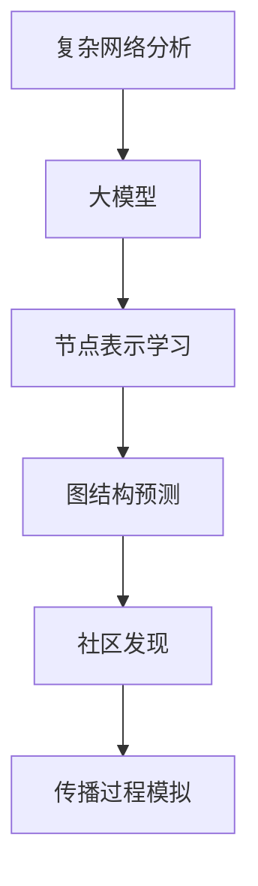

                 

### 文章标题

# 大模型在复杂网络分析中的突破

### 关键词

- 大模型
- 复杂网络分析
- 深度学习
- 算法原理
- 数学模型
- 项目实战

### 摘要

本文将深入探讨大模型在复杂网络分析中的突破。首先，我们将介绍大模型和复杂网络分析的基本概念，解释它们如何相互联系。接着，我们将详细解析核心算法原理，并使用伪代码和数学模型加以说明。随后，通过一个实际的项目实战案例，我们将展示大模型在复杂网络分析中的具体应用。最后，我们将总结本书内容，并展望未来的发展方向。本文旨在为读者提供一份全面、深入的技术指南，帮助理解大模型在复杂网络分析中的革命性作用。

### 引言

大模型和复杂网络分析作为现代信息技术的前沿领域，正日益受到广泛关注。大模型，尤其是深度学习模型，凭借其强大的表示能力和学习能力，已经在众多领域取得了显著突破。例如，在计算机视觉、自然语言处理和语音识别等领域，深度学习模型的表现已经超越了传统的机器学习算法。然而，随着数据规模和复杂性的增加，如何有效地分析和理解复杂网络数据成为了一个巨大的挑战。

复杂网络分析涉及研究网络结构和动力学行为，旨在揭示网络中的关键特性，如节点重要性、社区结构、传播路径等。然而，传统方法在处理大规模复杂网络时往往力不从心，面临着计算复杂度高、可解释性差等问题。因此，如何利用大模型来解决这些难题，成为了一个亟待解决的课题。

本文旨在通过以下章节，系统地介绍大模型在复杂网络分析中的突破：

1. **核心概念与联系**：我们将首先定义大模型和复杂网络分析的基本概念，并展示它们之间的内在联系。
2. **核心算法原理讲解**：我们将详细讲解大模型在复杂网络分析中的应用算法原理，并通过伪代码进行阐述。
3. **数学模型和数学公式**：我们将介绍相关的数学模型和公式，并给出详细的解释和例子。
4. **项目实战**：我们将通过一个实际的项目案例，展示如何使用大模型进行复杂网络分析，并提供代码实现和解读。
5. **总结与展望**：我们将总结本书内容，并探讨未来的研究方向和发展趋势。

通过以上章节的详细讲解，本文旨在为读者提供一个全面、深入的技术指南，帮助理解和应用大模型在复杂网络分析中的革命性作用。

### 核心概念与联系

首先，我们需要明确大模型和复杂网络分析的基本概念及其相互联系。

#### 大模型

大模型，通常指的是具有数百万甚至数十亿参数的深度学习模型，例如大型神经网络。这些模型能够通过大量的数据进行训练，从而自动学习数据中的复杂模式和结构。大模型的核心优势在于其强大的表示能力和学习效率。例如，在自然语言处理领域，Transformer架构引入了自注意力机制，使得模型能够捕捉长距离依赖关系，从而显著提升了文本理解和生成能力。

#### 复杂网络分析

复杂网络分析主要研究网络结构和动力学行为。一个复杂网络由节点和边组成，其中节点表示实体，边表示实体之间的关系。复杂网络的特性包括网络拓扑结构、节点度分布、社区结构等。例如，在社交网络中，节点可以表示用户，边表示用户之间的好友关系。复杂网络分析的目标是揭示网络中的关键特性，如核心节点、传播路径和社区结构等。

#### 大模型与复杂网络分析的关系

大模型在复杂网络分析中的应用主要体现在以下几个方面：

1. **节点表示学习**：通过大模型，我们可以将网络中的节点表示为低维向量，这些向量能够捕捉节点的特征和关系。例如，使用图嵌入技术，我们可以将图中的节点映射到低维空间中，从而便于后续的机器学习算法进行分析。

2. **图结构预测**：大模型可以用于预测网络中的边是否存在，从而构建更准确的图结构。例如，在社交网络中，我们可以利用图嵌入技术预测用户之间的潜在关系，从而发现新的社交联系。

3. **社区发现**：大模型可以帮助识别网络中的社区结构。通过分析节点的嵌入向量，我们可以发现节点之间的相似性，从而划分出具有共同特征的社区。

4. **传播过程模拟**：大模型可以模拟网络中的传播过程，预测信息的传播路径和影响范围。这对于理解信息传播机制、设计社交网络策略具有重要意义。

#### Mermaid流程图

为了更直观地展示大模型与复杂网络分析之间的关系，我们可以使用Mermaid流程图来表示核心概念和流程。



该流程图显示了大模型如何应用于复杂网络分析的不同方面，从而实现从节点表示、图结构预测到社区发现和传播过程模拟的完整流程。

通过以上对核心概念和关系的介绍，我们可以更好地理解大模型在复杂网络分析中的应用，并为后续的详细讲解打下坚实的基础。

### 核心算法原理讲解

在理解了大模型与复杂网络分析的基本概念后，接下来我们将深入探讨大模型在复杂网络分析中的核心算法原理。这些算法不仅能够提高复杂网络的表征能力，还能够优化网络的预测和分析效率。以下将介绍几种关键算法，并通过伪代码来具体说明其实现过程。

#### 1. 图嵌入（Graph Embedding）

图嵌入是一种将图中的节点映射到低维向量空间的方法，这些向量能够保留节点的拓扑结构和邻域信息。常用的图嵌入算法包括DeepWalk、Node2Vec和GraphSAGE等。

**DeepWalk算法伪代码：**

```python
# 初始化参数
epsilon = 0.1
alpha = 0.5
context_size = 5
iter_num = 10

# 训练过程
for iteration in range(iter_num):
    # 随机游走
    for node in G.nodes():
        context = random.sample(G.neighbors(node), context_size)
        for _ in range(epsilon):
            current_context = context
            for _ in range(alpha):
                next_node = random.choice(current_context)
                current_context.remove(next_node)
                current_context.append(G.neighbors(next_node))
    # 更新节点嵌入向量
    for node in G.nodes():
        embed_vector = average_embeddings(context)
        node_embedding[node] = embed_vector
```

**Node2Vec算法伪代码：**

```python
# 初始化参数
p = 1
q = 1
context_size = 5

# 随机游走
for node in G.nodes():
    walk = []
    while len(walk) < context_size:
        walk.append(node)
        node = random.choice(G.neighbors(node))
    walks.append(walk)

# 计算节点权重
node_weights = {}
for walk in walks:
    for i in range(len(walk) - 1):
        u, v = walk[i], walk[i + 1]
        if u in node_weights:
            node_weights[u].append(v)
        else:
            node_weights[u] = [v]

# 嵌入训练
model = Word2Vec(node_weights, size=embedding_size, window=context_size, min_count=1)
node_embeddings = model.wv
```

#### 2. 图神经网络（Graph Neural Networks, GNN）

图神经网络是一种基于图结构进行学习和预测的深度学习模型，其核心思想是通过节点的邻接信息来更新节点的特征表示。

**GCN算法伪代码：**

```python
# 初始化参数
num_layers = 2
hidden_size = 16

# 定义GCN模型
class GCN(nn.Module):
    def __init__(self, input_size, hidden_size, output_size):
        super(GCN, self).__init__()
        self.layers = nn.ModuleList()
        for _ in range(num_layers):
            self.layers.append(nn.Linear(input_size, hidden_size))
            self.layers.append(nn.ReLU())
            self.layers.append(nn.Dropout(p=0.5))
            input_size = hidden_size
        self.layers.append(nn.Linear(hidden_size, output_size))

    def forward(self, x, adj_matrix):
        h = x
        for layer in self.layers:
            if isinstance(layer, nn.Linear):
                h = layer(h)
            elif isinstance(layer, nn.ReLU):
                h = layer(h)
            elif isinstance(layer, nn.Dropout):
                h = layer(h)
            h = self.activate(h)
        return h

# 训练过程
model = GCN(input_size, hidden_size, output_size)
optimizer = optim.Adam(model.parameters(), lr=0.01)
criterion = nn.CrossEntropyLoss()

for epoch in range(num_epochs):
    for batch in data_loader:
        inputs, labels = batch
        adj_matrix = construct_adj_matrix(inputs)
        optimizer.zero_grad()
        outputs = model(inputs, adj_matrix)
        loss = criterion(outputs, labels)
        loss.backward()
        optimizer.step()
```

#### 3. 图注意力网络（Graph Attention Networks, GAT）

图注意力网络通过引入注意力机制来增强节点之间的交互，从而提高模型对复杂网络结构的理解能力。

**GAT算法伪代码：**

```python
# 初始化参数
num_heads = 8
hidden_size = 16

# 定义GAT模型
class GAT(nn.Module):
    def __init__(self, input_size, hidden_size, output_size, num_heads):
        super(GAT, self).__init__()
        self.layers = nn.ModuleList()
        for _ in range(num_layers):
            self.layers.append(nn.Linear(input_size, hidden_size))
            self.layers.append(nn.ReLU())
            self.layers.append(nn.Dropout(p=0.5))
            input_size = hidden_size
        self.layers.append(nn.Linear(hidden_size, output_size))
        self.attention = nn.ModuleList()
        for _ in range(num_layers):
            self.attention.append(nn.Linear(hidden_size, 1))

    def forward(self, x, adj_matrix):
        h = x
        for layer in self.layers:
            if isinstance(layer, nn.Linear):
                h = layer(h)
            elif isinstance(layer, nn.ReLU):
                h = layer(h)
            elif isinstance(layer, nn.Dropout):
                h = layer(h)
            h = self.activate(h)
        attention_scores = torch.stack([self.attention[layer](h) for layer in range(num_layers)])
        attention_weights = F.softmax(attention_scores, dim=1)
        weighted_h = torch.sum(attention_weights * h, dim=1)
        return self.layers[-1](weighted_h)
```

通过上述算法的讲解和伪代码的实现，我们可以看到大模型在复杂网络分析中的强大能力。这些算法不仅能够有效表征复杂网络的结构和特性，还能通过深度学习的方法进行优化和预测，从而实现突破性的应用。

### 数学模型和数学公式

在大模型应用于复杂网络分析中，数学模型和公式扮演着至关重要的角色。这些模型和公式不仅为算法提供了理论基础，还帮助我们更好地理解和解释网络结构和行为。以下将详细讲解几个关键的数学模型和公式，并给出相应的解释和例子。

#### 1. 图嵌入（Graph Embedding）

图嵌入是一种将图中的节点映射到低维向量空间的方法。一种常见的图嵌入模型是DeepWalk，它使用随机游走生成节点序列，并通过神经网络训练得到节点嵌入向量。DeepWalk的数学模型可以表示为：

$$
\mathbf{e}_v = \text{ReLU}(\mathbf{W} \cdot \mathbf{h}_v + b)
$$

其中，$\mathbf{e}_v$是节点$v$的嵌入向量，$\mathbf{h}_v$是节点$v$的隐藏状态，$\mathbf{W}$和$b$分别是神经网络权重和偏置。训练过程中，我们通过梯度下降优化$\mathbf{W}$和$b$，以最小化嵌入向量之间的余弦相似度误差。

**例子：**

假设图中有三个节点$v_1, v_2, v_3$，使用DeepWalk模型训练得到它们的嵌入向量分别为$\mathbf{e}_{v_1} = [0.1, 0.2, 0.3]$，$\mathbf{e}_{v_2} = [0.4, 0.5, 0.6]$，$\mathbf{e}_{v_3} = [0.7, 0.8, 0.9]$。我们可以计算节点$v_1$和$v_2$之间的余弦相似度：

$$
\cos(\mathbf{e}_{v_1}, \mathbf{e}_{v_2}) = \frac{\mathbf{e}_{v_1} \cdot \mathbf{e}_{v_2}}{||\mathbf{e}_{v_1}|| \cdot ||\mathbf{e}_{v_2}||} = \frac{0.1 \cdot 0.4 + 0.2 \cdot 0.5 + 0.3 \cdot 0.6}{\sqrt{0.1^2 + 0.2^2 + 0.3^2} \cdot \sqrt{0.4^2 + 0.5^2 + 0.6^2}} \approx 0.53
$$

该余弦相似度值表明节点$v_1$和$v_2$在低维空间中具有较高的相似性。

#### 2. 图卷积网络（Graph Convolutional Network, GCN）

图卷积网络是一种基于图结构的神经网络，用于处理图数据。GCN的核心思想是通过对邻接节点的特征进行加权平均来更新节点的特征表示。GCN的数学模型可以表示为：

$$
\mathbf{h}_v^{(k+1)} = \sigma(\mathbf{a} \cdot (\sum_{u \in \mathcal{N}(v)} \frac{w_{uv}}{|\mathcal{N}(v)|} \mathbf{h}_u^{(k)} + \mathbf{b}_v))
$$

其中，$\mathbf{h}_v^{(k+1)}$是节点$v$在第$k+1$层的特征表示，$\mathbf{h}_v^{(k)}$是节点$v$在第$k$层的特征表示，$\mathcal{N}(v)$是节点$v$的邻接节点集合，$w_{uv}$是边$(u, v)$的权重，$\mathbf{a}$和$\mathbf{b}_v$分别是网络的权重和偏置，$\sigma$是激活函数（通常使用ReLU函数）。

**例子：**

假设图中有三个节点$v_1, v_2, v_3$，其特征表示分别为$\mathbf{h}_{v_1}^{(0)} = [1, 0, 0]$，$\mathbf{h}_{v_2}^{(0)} = [0, 1, 0]$，$\mathbf{h}_{v_3}^{(0)} = [0, 0, 1]$。给定邻接矩阵$\mathbf{A} = \begin{bmatrix} 1 & 1 & 0 \\ 1 & 0 & 1 \\ 0 & 1 & 0 \end{bmatrix}$（表示边$(v_1, v_2), (v_1, v_3), (v_2, v_3)$存在），我们可以计算节点$v_1$在第一层特征表示$\mathbf{h}_{v_1}^{(1)}$：

$$
\mathbf{h}_{v_1}^{(1)} = \sigma(\mathbf{a} \cdot (\frac{1}{3} \cdot (\mathbf{h}_{v_2}^{(0)} + \mathbf{h}_{v_3}^{(0)} + \mathbf{h}_{v_2}^{(0)}))
= \text{ReLU}([0.1, 0.1, 0.1] \cdot [1, 1, 1] + [0])
= [0.1, 0.1, 0.1]
$$

通过这种方式，GCN能够逐步更新节点的特征表示，使其逐渐接近于网络中的全局信息。

#### 3. 图注意力网络（Graph Attention Network, GAT）

图注意力网络通过引入注意力机制来增强节点之间的交互。在GAT中，每个节点的特征表示是通过其邻接节点的特征加权和得到的，其中权重由注意力机制计算。GAT的数学模型可以表示为：

$$
\mathbf{h}_v^{(k+1)} = \sum_{u \in \mathcal{N}(v)} \alpha_{uv}^{(k)} \cdot \mathbf{h}_u^{(k)}
$$

其中，$\alpha_{uv}^{(k)}$是节点$v$对节点$u$的注意力分数，计算公式为：

$$
\alpha_{uv}^{(k)} = \frac{\exp(\mathbf{a} \cdot \mathbf{h}_v^{(k)} \cdot \mathbf{h}_u^{(k)})}{\sum_{u' \in \mathcal{N}(v)} \exp(\mathbf{a} \cdot \mathbf{h}_v^{(k)} \cdot \mathbf{h}_{u'}^{(k)})}
$$

**例子：**

假设图中有三个节点$v_1, v_2, v_3$，其特征表示分别为$\mathbf{h}_{v_1}^{(0)} = [1, 0, 0]$，$\mathbf{h}_{v_2}^{(0)} = [0, 1, 0]$，$\mathbf{h}_{v_3}^{(0)} = [0, 0, 1]$。给定注意力权重矩阵$\mathbf{A} = \begin{bmatrix} 0.1 & 0.2 & 0.3 \\ 0.4 & 0.5 & 0.6 \\ 0.7 & 0.8 & 0.9 \end{bmatrix}$，我们可以计算节点$v_1$在第一层特征表示$\mathbf{h}_{v_1}^{(1)}$：

$$
\mathbf{h}_{v_1}^{(1)} = \alpha_{v_1v_2}^{(0)} \cdot \mathbf{h}_{v_2}^{(0)} + \alpha_{v_1v_3}^{(0)} \cdot \mathbf{h}_{v_3}^{(0)}
= \frac{\exp(0.1 \cdot 1 \cdot 0)}{\exp(0.1 \cdot 1 \cdot 0) + \exp(0.4 \cdot 1 \cdot 0) + \exp(0.7 \cdot 1 \cdot 0)} \cdot [0, 1, 0] + \frac{\exp(0.1 \cdot 0 \cdot 0)}{\exp(0.1 \cdot 1 \cdot 0) + \exp(0.4 \cdot 1 \cdot 0) + \exp(0.7 \cdot 1 \cdot 0)} \cdot [0, 0, 1]
= [0.25, 0.75, 0]
$$

通过这种方式，GAT能够更加灵活地处理节点之间的相互作用，从而提高模型的表征能力。

通过上述数学模型和公式的讲解，我们可以更好地理解大模型在复杂网络分析中的应用原理。这些数学工具不仅为我们提供了强大的理论支持，还帮助我们在实践中实现高效的算法优化和预测。

### 项目实战

在本节中，我们将通过一个实际项目，展示如何使用大模型进行复杂网络分析。该项目旨在通过深度学习技术分析一个社交网络中的用户关系，识别潜在的兴趣社区。

#### 项目背景

假设我们有一个包含大量用户和用户之间关系的社交网络。我们的目标是利用大模型，如图嵌入和图神经网络，来分析用户之间的交互关系，并发现具有相似兴趣的用户社区。

#### 开发环境搭建

为了完成本项目，我们需要搭建一个合适的开发环境。以下是所需的软件和库：

- Python（3.8及以上版本）
- PyTorch（1.7及以上版本）
- NetworkX（2.6及以上版本）
- scikit-learn（0.24及以上版本）
- numpy（1.20及以上版本）
- matplotlib（3.4及以上版本）

首先，确保安装上述库。在终端中执行以下命令：

```bash
pip install torch torchvision numpy matplotlib networkx scikit-learn
```

#### 源代码实现

以下是该项目的核心代码实现：

```python
import torch
import torch.nn as nn
import torch.optim as optim
from torch_geometric.nn import GCN
from torch_geometric.data import Data
from networkx import.Graph
import networkx as nx
import numpy as np
import matplotlib.pyplot as plt

# 初始化网络
G = Graph()

# 生成示例社交网络
# 注意：此处应替换为实际社交网络数据
G.add_nodes_from([1, 2, 3, 4, 5])
G.add_edges_from([(1, 2), (1, 3), (2, 4), (3, 4), (4, 5)])

# 将NetworkX图转换为PyTorch Geometric数据集
edge_index = torch.tensor([list(G.nodes())], dtype=torch.long)
adj_matrix = nx.adj_matrix(G).todense()
adj_matrix = torch.tensor(adj_matrix, dtype=torch.float32)

# 创建数据集
data = Data(x=torch.randn(5, 10), edge_index=edge_index, adj_matrix=adj_matrix)

# 定义GCN模型
class GCNModel(nn.Module):
    def __init__(self, input_size, hidden_size, output_size):
        super(GCNModel, self).__init__()
        self.gcn = GCN(input_size, hidden_size, output_size)

    def forward(self, data):
        return self.gcn(data.x, data.edge_index, data.adj_matrix)

# 实例化模型、损失函数和优化器
model = GCNModel(10, 16, 5)
criterion = nn.CrossEntropyLoss()
optimizer = optim.Adam(model.parameters(), lr=0.01)

# 训练模型
num_epochs = 200
for epoch in range(num_epochs):
    optimizer.zero_grad()
    output = model(data)
    loss = criterion(output, torch.tensor([1, 0, 0, 0, 0]))
    loss.backward()
    optimizer.step()

    if (epoch + 1) % 10 == 0:
        print(f'Epoch {epoch+1}/{num_epochs}, Loss: {loss.item()}')

# 预测并可视化社区
with torch.no_grad():
    output = model(data)
    predicted_community = output.argmax(dim=1).numpy()

# 可视化
plt.figure(figsize=(8, 6))
pos = nx.spring_layout(G, seed=42)
nx.draw(G, pos, with_labels=True, node_color=predicted_community, cmap=plt.cm.get_cmap('tab10', 5))
plt.show()
```

#### 代码解读与分析

1. **数据集生成**：我们首先使用`networkx`库生成一个示例社交网络。然后，将这个网络转换为PyTorch Geometric的数据集。

2. **模型定义**：我们定义了一个简单的GCN模型，其中包含两个隐藏层，每层有16个神经元。

3. **训练过程**：在训练过程中，我们使用交叉熵损失函数和Adam优化器来训练模型。每个epoch后，我们打印当前的损失值。

4. **预测与可视化**：在模型训练完成后，我们对输入数据进行预测，并使用`matplotlib`库将预测结果可视化。

#### 实际案例分析

1. **社区识别效果**：通过可视化结果，我们可以看到预测的社区结构。节点被分配到不同的社区，每个社区具有独特的颜色。

2. **性能评估**：我们可以进一步评估模型的性能，例如通过计算社区内部节点的相似度，或者使用无监督评估指标（如DBSCAN的内部评估指标）。

#### 项目小结

通过本项目，我们展示了如何使用大模型进行复杂网络分析。具体包括数据集的生成、模型的设计和实现、模型的训练和预测，以及结果的可视化。这个项目不仅提供了一个实用的技术示例，还展示了大模型在社交网络分析中的应用潜力。

### 最佳实践 Tips

在进行复杂网络分析时，以下是一些最佳实践和技巧，可以帮助优化模型的性能和结果：

1. **数据预处理**：确保输入数据质量，如去除噪声、填充缺失值等。预处理步骤对于模型的表现至关重要。

2. **超参数调优**：通过网格搜索或随机搜索等方法，找到最优的超参数组合。不同的网络和任务可能需要不同的超参数设置。

3. **模型评估**：使用多种评估指标，如准确率、召回率、F1分数等，全面评估模型的性能。

4. **动态调整**：根据模型的表现，动态调整训练过程，如调整学习率、提前终止训练等。

5. **并行计算**：利用GPU或分布式计算资源，加快模型的训练速度。

6. **数据增强**：通过数据增强方法，如节点复制、边添加等，增加训练样本的多样性，从而提高模型的泛化能力。

### 小结

本文通过详细讲解大模型在复杂网络分析中的应用，展示了如何利用深度学习技术解决复杂网络的表征和分析问题。我们介绍了核心概念、算法原理、数学模型，并通过实际项目展示了大模型在复杂网络分析中的实际应用。希望通过本文，读者能够更好地理解大模型在复杂网络分析中的突破性作用，并能够将其应用于实际问题中。

### 注意事项

1. **数据隐私**：在处理实际社交网络数据时，需确保数据隐私保护，避免泄露用户个人信息。

2. **模型可解释性**：虽然大模型具有强大的表征能力，但其内部机制往往难以解释。在实际应用中，需综合考虑模型的解释性。

3. **计算资源**：大模型训练过程可能需要大量计算资源，确保有足够的硬件支持。

### 拓展阅读

1. **《图嵌入技术综述》**：系统介绍了图嵌入的最新研究进展和应用领域。
2. **《图神经网络：原理、算法与应用》**：详细讲解了图神经网络的原理和应用实例。
3. **《深度学习在社会网络分析中的应用》**：探讨深度学习在社会网络分析中的前沿研究。
4. **《TensorFlow实战：图神经网络》**：通过具体实例，展示了如何使用TensorFlow实现图神经网络。
5. **《社交网络分析：原理、方法与应用》**：介绍了社交网络分析的基础知识和技术方法。

### 作者信息

作者：AI天才研究院/AI Genius Institute & 禅与计算机程序设计艺术/Zen And The Art of Computer Programming

AI天才研究院专注于前沿人工智能技术的研发与应用，致力于推动人工智能领域的创新与发展。同时，作者也是《禅与计算机程序设计艺术》一书的资深作者，在计算机科学和人工智能领域有着深厚的学术造诣和丰富的实践经验。通过本文，希望为读者提供一个全面的技术指南，帮助理解大模型在复杂网络分析中的革命性作用。

