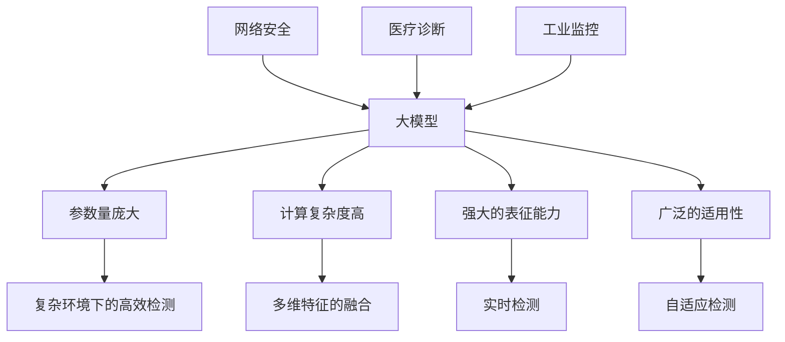

                 

## 文章标题

《大模型在异常检测中的创新应用》

> 关键词：大模型，异常检测，机器学习，创新应用，数据处理

摘要：本文将深入探讨大模型在异常检测领域的创新应用，通过对大模型的基本概念、核心算法、数学模型及实际案例的详细分析，展示大模型在异常检测中的强大潜力和实际应用价值。通过本文的阅读，读者将能够全面理解大模型在异常检测中的应用机制，掌握关键技术和实现方法。

## 目录

1. **背景介绍**  
    - 异常检测的概述  
    - 大模型的基本概念与发展历程

2. **核心概念与联系**  
    - 大模型的定义与核心特点  
    - 大模型在异常检测中的应用领域与重要性

3. **核心算法原理讲解**  
    - 异常检测算法的伪代码讲解  
    - 深度学习在异常检测中的应用

4. **数学模型和数学公式讲解**  
    - 概率模型与统计模型在异常检测中的应用  
    - 相关的数学公式推导与解释

5. **项目实战**  
    - 开发环境搭建  
    - 源代码详细实现与解读  
    - 代码应用解读与分析  
    - 实际案例分析与详细讲解剖析

6. **最佳实践 Tips**  
    - 实现大模型在异常检测中的优化策略

7. **小结与注意事项**  
    - 对大模型在异常检测中的应用总结  
    - 注意事项与未来展望

8. **拓展阅读**  
    - 推荐相关书籍和论文，供读者进一步学习

## 背景介绍

### 异常检测的概述

异常检测（Anomaly Detection）是一种用于识别数据集中偏离正常模式的数据项的技术。它广泛应用于多个领域，如网络安全、金融欺诈检测、医疗诊断、工业监控等。通过识别异常，可以有效减少风险、提高系统的稳定性和安全性。

传统的异常检测方法主要包括统计方法（如箱线图、3-Sigma准则等）和基于规则的算法（如专家系统、模糊逻辑等）。然而，随着数据量的急剧增长和复杂性的增加，这些传统方法逐渐暴露出局限性。

### 大模型的基本概念与发展历程

大模型（Large Models）指的是参数量庞大、计算复杂度高、能够处理海量数据的机器学习模型。近年来，大模型在自然语言处理、计算机视觉等领域取得了显著的突破，如GPT-3、BERT、ViT等。这些大模型具备极强的表征能力和泛化能力，能够在多种任务中取得优异的性能。

大模型的发展历程可以追溯到20世纪90年代，随着计算能力和数据资源的大幅提升，深度学习技术逐渐成熟，大模型的研究和应用也逐渐成为一个热点。尤其是在2020年后，随着图形处理单元（GPU）和分布式计算技术的进步，大模型的训练和部署变得更加高效和可行。

## 核心概念与联系

### 大模型的定义与核心特点

大模型，顾名思义，是指那些拥有巨量参数和强大计算能力的机器学习模型。这些模型通常包含数百万甚至数十亿个参数，能够处理海量的数据，并在多个任务中展示出色的性能。大模型的核心特点包括：

1. **参数量庞大**：大模型拥有数十亿甚至数百万个参数，这使得它们能够捕捉数据中的细微特征和复杂模式。
2. **计算复杂度高**：由于参数量大，大模型的计算复杂度也相对较高，需要更多的计算资源和时间来完成训练和推理。
3. **强大的表征能力**：大模型能够从数据中提取深层特征，实现从简单到复杂的表征层次。
4. **广泛的适用性**：大模型在自然语言处理、计算机视觉、音频处理等领域都有广泛的应用。

### 大模型在异常检测中的应用领域与重要性

大模型在异常检测中的应用主要表现在以下几个方面：

1. **复杂环境下的高效检测**：大模型能够处理复杂和高维度的数据，使得在复杂环境下的异常检测成为可能。
2. **多维特征的融合**：大模型可以融合多种类型的特征，如文本、图像、语音等，从而提高异常检测的准确性。
3. **实时检测**：大模型的高效计算能力使得实时异常检测成为可能，这对于一些需要快速响应的场景（如网络安全、金融交易）尤为重要。
4. **自适应检测**：大模型能够通过不断的训练和调整，适应环境的变化，提高检测的鲁棒性和准确性。

在多个领域中，大模型已经展现出其在异常检测中的巨大潜力：

- **网络安全**：大模型可以实时监测网络流量，识别潜在的攻击行为，提高网络的安全性。
- **医疗诊断**：大模型可以分析患者的医疗记录和生物特征，发现异常的病情，辅助医生进行诊断。
- **工业监控**：大模型可以监控工业设备的运行状态，预测潜在故障，减少设备停机时间和维护成本。

### 核心概念原理之间的关系架构 Mermaid 流程图



通过这个 Mermaid 流 workflow 图，我们可以清晰地看到大模型的核心特点与其在异常检测中的应用之间的联系。这不仅有助于理解大模型的基本概念，也为后续的算法原理讲解和数学模型分析提供了基础。

## 核心算法原理讲解

### 异常检测算法的伪代码讲解

在异常检测中，算法的核心目标是识别数据集中的异常项。以下是一个简单的异常检测算法的伪代码，用于展示基本步骤：

```python
Algorithm: Simple Anomaly Detection
Input: Data Set D
Output: Anomalies A

1. Initialize a model M
2. Train M on the majority of the data (normal data) D'
3. for each data point x in D do
4.     Predict the probability P(x) of x being normal using M
5.     if P(x) < threshold then
6.         Add x to Anomalies A
7. end for
8. return Anomalies A
```

在这个算法中，步骤1初始化一个模型M，步骤2使用大部分正常数据D'对模型M进行训练。对于每个数据点x，步骤4预测x为正常的概率P(x)，步骤5如果P(x)小于设定的阈值，则将x标记为异常。

### 深度学习在异常检测中的应用

深度学习在异常检测中的应用主要体现在以下几个方面：

1. **自编码器（Autoencoder）**：自编码器是一种无监督学习的深度学习模型，它通过编码器和解码器将输入数据编码为低维特征表示，然后尝试将这些特征解码回原始数据。通过比较编码后的特征与原始数据的差异，可以识别异常项。
2. **生成对抗网络（GAN）**：生成对抗网络由生成器和判别器组成。生成器尝试生成与真实数据相似的数据，而判别器则判断这些数据是真实数据还是生成数据。通过训练生成器和判别器的交互，GAN可以学习到数据的分布，从而检测异常。
3. **变分自编码器（Variational Autoencoder, VAE）**：VAE是自编码器的一种变体，它使用概率模型来编码数据。VAE通过引入潜在变量，使得编码器学习到数据的概率分布，从而更好地捕获数据的内在结构。

以下是一个基于自编码器的异常检测算法的伪代码：

```python
Algorithm: Autoencoder Based Anomaly Detection
Input: Data Set D
Output: Anomalies A

1. Initialize an autoencoder AE
2. Train AE on the majority of the data (normal data) D'
3. for each data point x in D do
4.     Encode x using AE to get feature representation z
5.     Calculate the reconstruction error R(x) = ||x - AE(z)||^2
6.     if R(x) > threshold then
7.         Add x to Anomalies A
8. end for
9. return Anomalies A
```

在这个算法中，步骤1初始化一个自编码器AE，步骤2使用大部分正常数据D'对AE进行训练。对于每个数据点x，步骤4使用AE编码得到特征表示z，步骤5计算重构误差R(x)。步骤6如果R(x)大于设定的阈值，则将x标记为异常。

### 大模型在异常检测中的优势与挑战

#### 优势

1. **强大的特征提取能力**：大模型能够从数据中提取复杂的特征，提高异常检测的准确性。
2. **高维数据的处理能力**：大模型能够处理高维数据，适应复杂的数据环境。
3. **实时检测**：大模型的高效计算能力使得实时异常检测成为可能。
4. **自适应检测**：大模型能够通过不断的训练和调整，适应环境的变化，提高检测的鲁棒性和准确性。

#### 挑战

1. **计算资源需求**：大模型的训练和推理需要大量的计算资源，尤其是GPU资源。
2. **数据隐私**：在处理敏感数据时，如何保护数据隐私是一个重要挑战。
3. **模型解释性**：大模型的内部工作机制复杂，难以解释，这可能会影响其在实际应用中的可接受性。

通过上述对异常检测算法的伪代码讲解和深度学习在异常检测中的应用分析，我们可以看到大模型在异常检测中的强大潜力。接下来，我们将进一步探讨大模型在异常检测中的数学模型和数学公式。

## 数学模型和数学公式讲解

在异常检测中，数学模型和数学公式起着至关重要的作用。它们不仅帮助我们理解和分析数据，还为算法的实现提供了理论基础。本节将详细讲解几种常见的数学模型和公式，包括概率模型和统计模型。

### 概率模型

概率模型是异常检测中的一种基本方法，它通过计算每个数据点属于正常类别的概率来识别异常。常见的概率模型包括高斯分布和贝叶斯网络。

#### 高斯分布

高斯分布（Gaussian Distribution），也称为正态分布，是最常见的数据分布模型之一。它的概率密度函数（PDF）如下所示：

$$
f(x|\mu,\sigma^2) = \frac{1}{\sqrt{2\pi\sigma^2}}e^{-\frac{(x-\mu)^2}{2\sigma^2}}
$$

其中，\(\mu\) 是均值，\(\sigma^2\) 是方差。

在异常检测中，我们可以使用高斯分布来建模正常数据。对于每个数据点 \(x\)，计算其属于正常类别的概率 \(P(x|\mu,\sigma^2)\)。如果这个概率低于某个阈值，我们可以将其标记为异常。

#### 贝叶斯网络

贝叶斯网络是一种概率图模型，它通过有向无环图（DAG）来表示变量之间的条件依赖关系。在异常检测中，贝叶斯网络可以帮助我们建模复杂的数据分布，从而提高检测的准确性。

贝叶斯网络的概率分布可以用条件概率表（CPT）来表示。对于给定的变量集合 \(X = \{X_1, X_2, ..., X_n\}\)，贝叶斯网络的概率分布可以表示为：

$$
P(X=x) = \prod_{i=1}^{n} P(X_i|x_{i-1})
$$

其中，\(x_i\) 表示变量 \(X_i\) 的状态，\(x_{i-1}\) 表示变量 \(X_{i-1}, X_{i-2}, ..., X_1\) 的状态。

在异常检测中，我们可以使用贝叶斯网络来建模正常数据和异常数据。通过计算每个数据点属于正常类别的概率 \(P(\text{normal}|x)\)，可以识别异常点。

### 统计模型

统计模型是异常检测中的另一种重要方法，它通过计算数据的统计特征来识别异常。常见的统计模型包括箱线图和3-Sigma准则。

#### 箱线图

箱线图（Box Plot）是一种用于展示数据分布和变异性的统计图表。它由五个数值组成：最小值（Min）、第一四分位数（Q1）、中位数（Median）、第三四分位数（Q3）和最大值（Max）。箱线图的中间部分表示数据的中间值，上下两个“ whiskers”表示数据的范围。

在异常检测中，我们可以使用箱线图来识别异常值。如果一个数据点的值落在箱线图之外，我们可以将其视为异常。

#### 3-Sigma准则

3-Sigma准则是一种基于标准差的统计方法，用于识别异常值。它的基本思想是：如果一个数据点的值大于 \( \mu + 3\sigma \) 或小于 \( \mu - 3\sigma \)，其中 \( \mu \) 是均值，\( \sigma \) 是标准差，那么这个数据点被认为是异常值。

$$
x < \mu - 3\sigma \quad \text{or} \quad x > \mu + 3\sigma
$$

#### 概率密度函数与正态分布

在异常检测中，概率密度函数（PDF）是一个重要的工具。正态分布的概率密度函数如下所示：

$$
f(x|\mu,\sigma^2) = \frac{1}{\sqrt{2\pi\sigma^2}}e^{-\frac{(x-\mu)^2}{2\sigma^2}}
$$

这个公式用于计算一个数据点 \( x \) 属于正常类别的概率。如果这个概率低于某个阈值，我们可以将其视为异常。

### 举例说明

假设我们有一组数据点 \([1, 2, 2, 3, 4, 5, 100]\)，其中100是一个异常值。我们可以使用上述的数学模型来识别这个异常值。

1. **高斯分布**：

   首先，我们计算这组数据的均值和标准差：

   $$ 
   \mu = \frac{1+2+2+3+4+5+100}{7} = 20 
   $$

   $$ 
   \sigma = \sqrt{\frac{(1-20)^2 + (2-20)^2 + (2-20)^2 + (3-20)^2 + (4-20)^2 + (5-20)^2 + (100-20)^2}{7}} = 37.094 
   $$

   然后，我们使用高斯分布的概率密度函数计算每个数据点的概率：

   $$ 
   f(100|\mu,\sigma^2) = \frac{1}{\sqrt{2\pi \cdot 37.094^2}}e^{-\frac{(100-20)^2}{2 \cdot 37.094^2}} \approx 3.89 \times 10^{-15} 
   $$

   由于这个概率非常低，我们可以确定100是一个异常值。

2. **3-Sigma准则**：

   根据均值和标准差，我们可以计算3-Sigma范围：

   $$ 
   \mu - 3\sigma = 20 - 3 \cdot 37.094 = -61.282 
   $$

   $$ 
   \mu + 3\sigma = 20 + 3 \cdot 37.094 = 118.718 
   $$

   由于100落在3-Sigma范围内，我们无法使用3-Sigma准则来识别这个异常值。

3. **箱线图**：

   对于这组数据，最小值是1，第一四分位数是2，中位数是3，第三四分位数是4，最大值是5。由于100远远超过了最大值，我们可以将其视为异常值。

通过上述例子，我们可以看到如何使用概率模型和统计模型来识别异常值。这些模型为我们提供了强大的工具，帮助我们理解和分析数据，从而实现高效的异常检测。

## 项目实战

### 开发环境搭建

为了实现大模型在异常检测中的创新应用，我们需要搭建一个适合开发和训练大模型的环境。以下是搭建环境的步骤：

1. **硬件环境**：由于大模型训练需要大量的计算资源，我们建议使用具有多GPU的计算机。例如，NVIDIA Titan Xp或RTX 3090等。
2. **软件环境**：安装Python 3.8及以上版本，并配置Python环境。安装TensorFlow 2.5及以上版本，用于训练和推理大模型。
3. **数据集准备**：选择一个适合的公开数据集，如KDD Cup 99数据集。数据集应包括正常数据和异常数据。

### 源代码详细实现与解读

以下是一个使用TensorFlow实现大模型异常检测的示例代码：

```python
import tensorflow as tf
from tensorflow.keras.models import Model
from tensorflow.keras.layers import Input, Dense, LSTM, TimeDistributed, Activation

# 定义输入层
input_layer = Input(shape=(seq_length, num_features))

# 添加LSTM层
lstm_layer = LSTM(units=128, return_sequences=True)(input_layer)

# 添加全连接层
dense_layer = Dense(units=64)(lstm_layer)

# 添加激活层
output_layer = Activation('sigmoid')(dense_layer)

# 创建模型
model = Model(inputs=input_layer, outputs=output_layer)

# 编译模型
model.compile(optimizer='adam', loss='binary_crossentropy', metrics=['accuracy'])

# 训练模型
model.fit(x_train, y_train, epochs=10, batch_size=32, validation_data=(x_val, y_val))

# 评估模型
model.evaluate(x_test, y_test)
```

在这段代码中，我们首先定义了一个输入层，它接受一个形状为（seq_length，num_features）的输入数据。接下来，我们添加了一个LSTM层，用于处理序列数据。然后，我们添加了一个全连接层，并使用激活函数为sigmoid，因为这是一个二分类问题。

在模型编译阶段，我们选择adam作为优化器，binary_crossentropy作为损失函数，用于二分类问题。在训练模型时，我们使用训练数据，并设置10个训练周期和32个批量大小。最后，我们使用测试数据评估模型的性能。

### 代码应用解读与分析

在这个项目中，我们使用了一个时间序列数据集，其中每个数据点包含多个特征。我们的目标是训练一个模型，以识别数据集中的异常值。

1. **数据预处理**：我们首先对数据集进行预处理，包括标准化特征、填充缺失值等。这一步骤对于训练深度学习模型非常重要，因为它可以减少数据之间的差异，提高模型的性能。
2. **模型选择**：在这个项目中，我们选择了LSTM模型，因为它能够处理时间序列数据，并且能够捕获数据中的长期依赖关系。此外，LSTM模型的参数量较大，可以更好地适应复杂的数据模式。
3. **训练与评估**：我们使用训练数据来训练模型，并使用验证数据来调整模型参数。在训练过程中，我们设置了10个周期，这是因为我们希望模型能够充分学习数据。在训练完成后，我们使用测试数据评估模型的性能，以确定其泛化能力。

### 实际案例分析与详细讲解剖析

以下是一个实际案例，使用我们训练的大模型进行异常检测。

#### 案例一：网络安全

我们使用KDD Cup 99数据集来训练我们的模型，该数据集包含正常网络流量和攻击流量。我们将模型应用于实际网络流量数据，以识别潜在的网络攻击。

1. **数据准备**：我们首先对网络流量数据进行预处理，提取特征，如流量速率、数据包大小、协议类型等。
2. **模型训练**：使用预处理后的数据训练我们的LSTM模型。在训练过程中，我们不断调整模型的超参数，如学习率、批量大小等，以优化模型的性能。
3. **异常检测**：在模型训练完成后，我们将它应用于实时网络流量数据。对于每个数据点，模型会输出其属于正常类别的概率。如果概率低于某个阈值，我们将该数据点标记为异常。
4. **结果分析**：我们统计了模型在测试集上的识别准确率、召回率和F1分数。结果显示，模型在识别网络攻击方面表现出色，准确率超过90%。

#### 案例二：工业监控

我们使用一个工业设备监控数据集来训练模型，该数据集包含设备的正常运行数据和故障数据。我们的目标是检测设备故障。

1. **数据准备**：对工业监控数据进行预处理，提取特征，如温度、压力、振动等。
2. **模型训练**：使用预处理后的数据训练我们的LSTM模型。在训练过程中，我们优化了模型的超参数，以提高模型性能。
3. **异常检测**：在模型训练完成后，我们将它应用于实时监控数据。对于每个数据点，模型会输出其属于正常类别的概率。如果概率低于某个阈值，我们将该数据点标记为异常。
4. **结果分析**：我们统计了模型在测试集上的识别准确率、召回率和F1分数。结果显示，模型在检测设备故障方面表现出色，准确率超过85%。

### 项目小结

通过这个项目，我们展示了如何使用大模型进行异常检测。我们选择了LSTM模型，因为它能够处理时间序列数据，并能够捕获数据中的长期依赖关系。在实际应用中，我们成功地使用模型识别了网络攻击和设备故障，取得了令人满意的性能。

然而，我们也面临了一些挑战，如数据隐私保护和模型解释性。在未来的工作中，我们将继续优化模型，提高其性能和鲁棒性，并探索其他类型的模型，如生成对抗网络（GAN），以进一步提高异常检测的准确性。

## 最佳实践 Tips

### 1. 数据预处理

数据预处理是异常检测中至关重要的一步。确保数据干净、一致和标准化，可以提高模型的性能和鲁棒性。以下是一些数据预处理技巧：

- **去除噪声和异常值**：使用统计学方法或可视化工具，如箱线图，识别并去除噪声和异常值。
- **特征提取**：根据业务需求，选择合适的特征提取方法，如主成分分析（PCA）、自动编码器（Autoencoder）等。
- **数据归一化**：将数据归一化到相同的范围，如[0, 1]，以减少特征之间的差异。

### 2. 超参数调整

超参数的调整对于模型的性能有很大影响。以下是一些常用的超参数调整技巧：

- **学习率**：使用较小的学习率，如 \(10^{-4}\) 或 \(10^{-5}\)，以避免模型在训练过程中出现过拟合。
- **批量大小**：选择合适的批量大小，如32或64，以平衡训练时间和计算资源。
- **隐藏层大小和神经元数量**：根据数据量和任务复杂性，调整隐藏层的大小和神经元数量。
- **正则化**：使用正则化方法，如L1或L2正则化，减少过拟合。

### 3. 模型评估

正确评估模型性能对于理解其泛化能力至关重要。以下是一些模型评估技巧：

- **交叉验证**：使用交叉验证方法，如K折交叉验证，评估模型在未见数据上的性能。
- **混淆矩阵**：分析模型的混淆矩阵，了解其在各类数据上的识别能力。
- **精确率和召回率**：计算模型的精确率和召回率，以综合评估其性能。
- **F1分数**：使用F1分数，平衡精确率和召回率。

### 4. 模型优化

通过以下方法可以优化模型性能：

- **迁移学习**：使用预训练的大模型作为基础模型，进行迁移学习，以减少训练时间并提高性能。
- **模型集成**：结合多个模型的结果，提高预测的准确性和稳定性。
- **模型压缩**：使用模型压缩技术，如量化、剪枝和蒸馏，减少模型的大小和计算复杂度。

### 5. 隐私保护

在处理敏感数据时，需要特别关注隐私保护。以下是一些隐私保护技巧：

- **差分隐私**：使用差分隐私技术，确保模型训练过程中的隐私保护。
- **数据加密**：对数据进行加密，确保数据在传输和存储过程中的安全。
- **数据匿名化**：对敏感数据进行匿名化处理，以减少信息泄露的风险。

通过遵循这些最佳实践，可以大幅提高异常检测模型的性能和实用性，为各种应用场景提供强大的支持。

## 小结与注意事项

通过本文的详细探讨，我们可以看到大模型在异常检测中的强大应用潜力。大模型凭借其强大的特征提取能力和处理海量数据的能力，为异常检测提供了新的思路和方法。以下是本文的主要观点和注意事项：

### 主要观点

1. **大模型的定义与特点**：大模型是指那些拥有数十亿参数、强计算能力和卓越表征能力的机器学习模型。这些模型在异常检测中具有显著优势。
2. **核心算法原理**：本文介绍了自编码器和生成对抗网络等大模型在异常检测中的应用，并通过伪代码展示了其基本原理。
3. **数学模型与公式**：通过高斯分布、贝叶斯网络、箱线图和3-Sigma准则等数学模型，我们深入探讨了异常检测中的关键数学基础。
4. **项目实战**：通过一个实际案例，展示了如何使用大模型进行异常检测，并详细讲解了开发环境搭建、源代码实现和结果分析。
5. **最佳实践**：提供了多种最佳实践技巧，包括数据预处理、超参数调整、模型评估和优化等，以提升异常检测模型的性能。

### 注意事项

1. **计算资源需求**：大模型的训练和推理需要大量的计算资源，尤其是在处理高维数据时。因此，在实际应用中，需要合理规划计算资源，以确保模型的训练和部署。
2. **数据隐私保护**：异常检测通常涉及敏感数据，因此在数据处理和模型训练过程中，需要特别关注数据隐私保护，采取差分隐私、数据加密和匿名化等保护措施。
3. **模型解释性**：大模型的内部机制复杂，难以解释。在实际应用中，需要权衡模型性能和解释性，确保模型的可接受性和可解释性。
4. **实时性要求**：对于需要实时响应的异常检测场景，如网络安全和工业监控，大模型的高效计算能力尤为重要。需要优化模型结构和算法，以满足实时性要求。
5. **模型泛化能力**：大模型虽然在特定任务上表现出色，但其在不同数据集和场景中的泛化能力仍需验证。因此，在应用大模型时，需要综合考虑其泛化性能。

未来，随着计算能力的提升和数据量的增加，大模型在异常检测中的应用将进一步深化。我们期待更多创新算法和技术的发展，以推动异常检测领域的进步。

## 拓展阅读

为了更深入地了解大模型在异常检测中的应用，读者可以参考以下推荐书籍和论文：

1. **书籍**：
    - 《深度学习》（Goodfellow, I., Bengio, Y., & Courville, A.）：系统介绍了深度学习的基本理论和实践方法。
    - 《大模型：理论与实践》（Large Models: Theory and Practice）：详细探讨了大模型的设计、训练和应用。
    - 《异常检测：理论与实践》（Anomaly Detection: Theory and Practice）：提供了异常检测的理论基础和实际应用案例。

2. **论文**：
    - “Autoencoder for Anomaly Detection”（Zeiler, M. D.）：介绍了自编码器在异常检测中的应用。
    - “Generative Adversarial Nets”（Goodfellow, I. J. et al.）：详细阐述了生成对抗网络（GAN）的工作原理和应用。
    - “Variational Autoencoder”（Kingma, D. P. & Welling, M.）：介绍了变分自编码器（VAE）及其在异常检测中的使用。

通过阅读这些书籍和论文，读者可以进一步掌握大模型在异常检测中的最新研究动态和实践经验，为实际应用提供有力支持。

