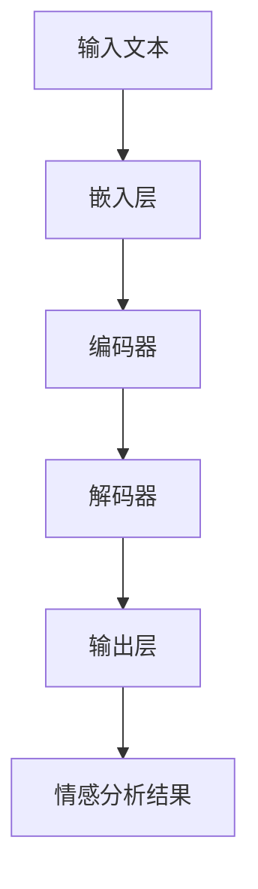

                 


### 第1章 引言

#### 1.1 书籍背景与目标

随着互联网和社交媒体的快速发展，人们每天产生大量的文本数据。这些数据中包含了用户对各种事物的情感评价，如电影、产品、政治事件等。情感分析作为自然语言处理（NLP）的重要分支，旨在自动识别和提取文本中的情感信息。传统的情感分析方法通常基于规则和机器学习算法，然而这些方法在面对复杂和多样化的情感表达时，表现出了明显的局限性。

近年来，随着深度学习技术的进步，大型预训练模型（Large-scale Pre-trained Models）如BERT、GPT等逐渐成为情感分析领域的研究热点。这些模型通过在海量数据上进行预训练，具备了强大的语言理解和生成能力，为情感分析提供了全新的解决方案。

本书旨在探讨大模型在情感分析中的突破应用，为读者提供系统、全面的指导。本书的目标读者包括但不限于：

1. 对情感分析和自然语言处理感兴趣的学者和研究人员。
2. 想要在实际项目中应用大模型进行情感分析的工程师和开发者。
3. 对深度学习和机器学习有一定了解，希望深入了解大模型在情感分析中的作用的读者。

本书将从以下几个方面展开讨论：

1. **大模型在情感分析中的优势**：介绍大模型相较于传统算法的优势，以及其在处理复杂情感分析任务中的潜力。
2. **情感分析的应用场景**：分析情感分析在不同领域的应用，如社交媒体、电子商务、新闻等。
3. **核心概念与联系**：详细阐述情感分析的基本概念和原理，以及大模型在这些概念中的工作方式。
4. **算法原理讲解**：讲解基于大模型的情感分析算法，包括其核心原理和实现细节。
5. **数学模型和数学公式**：介绍情感分析中使用的数学模型和公式，并进行详细讲解和举例说明。
6. **项目实战**：通过实际项目案例，展示如何使用大模型进行情感分析，并进行代码实现和解读。
7. **未来展望与挑战**：探讨大模型在情感分析领域中的应用前景，以及面临的挑战和未来的发展方向。

#### 1.2 大模型在情感分析中的优势

大模型在情感分析中的优势主要体现在以下几个方面：

1. **更强的语言理解能力**：大模型通过在大量文本数据上进行预训练，具备了强大的语言理解能力。这使得它们能够更好地理解复杂的情感表达，并从中提取出关键信息。
2. **处理多样化情感表达**：传统算法通常基于固定的规则或模板，难以处理多样化的情感表达。而大模型则能够通过学习海量数据中的情感模式，自动识别和提取不同类型的情感。
3. **更高的准确性和鲁棒性**：大模型在情感分析任务上通常具有更高的准确性和鲁棒性。这是因为它们能够从大量数据中学习到复杂的情感模式，并具备较强的泛化能力，从而在面对不同类型的数据时，仍然能够保持良好的性能。
4. **更丰富的应用场景**：大模型不仅适用于传统的情感分析任务，如文本分类、情感极性判断等，还可以应用于更复杂的任务，如情感实体识别、情感极性分析等。这使得大模型在情感分析领域具有更广泛的应用潜力。

#### 1.3 情感分析的应用场景

情感分析在多个领域都有着广泛的应用，以下是其中一些典型的应用场景：

1. **社交媒体**：社交媒体平台如微博、Twitter等是情感分析的重要应用场景。通过对用户发布的文本进行分析，可以了解公众对某一事件、品牌或产品的情感态度，为企业提供市场洞察和决策支持。
2. **电子商务**：电子商务平台通过情感分析，可以了解用户对产品的评价和反馈，从而改进产品设计和营销策略。例如，通过对用户评论进行情感分析，可以识别出用户的负面情绪，并采取相应的措施进行改善。
3. **新闻媒体**：新闻媒体通过情感分析，可以自动识别和提取新闻中的情感信息，为用户提供更有针对性的新闻推荐。例如，在重大事件发生时，可以实时分析公众对事件的情感反应，为新闻报道提供参考。
4. **客户服务**：企业通过情感分析，可以自动识别客户服务中的情感变化，及时响应客户需求，提高客户满意度。例如，通过对客户咨询文本进行情感分析，可以识别出客户的情绪状态，从而提供更个性化的服务。

#### 1.4 内容概述

本书将分为七个主要章节，全面探讨大模型在情感分析中的突破应用。具体内容如下：

- **第1章 引言**：介绍书籍的背景、目标以及大模型在情感分析中的优势和应用场景。
- **第2章 核心概念与联系**：阐述情感分析的基本概念和原理，以及大模型在这些概念中的工作方式。
- **第3章 算法原理讲解**：讲解基于大模型的情感分析算法，包括其核心原理和实现细节。
- **第4章 数学模型和数学公式**：介绍情感分析中使用的数学模型和公式，并进行详细讲解和举例说明。
- **第5章 项目实战**：通过实际项目案例，展示如何使用大模型进行情感分析，并进行代码实现和解读。
- **第6章 项目案例分析**：分析实际应用中情感分析项目的案例，进行详细讲解和剖析。
- **第7章 未来展望与挑战**：探讨大模型在情感分析领域中的应用前景，以及面临的挑战和未来的发展方向。

通过本书的阅读，读者将能够全面了解大模型在情感分析中的应用，掌握相关的理论知识和实践经验，为实际项目提供有力支持。

### 第2章 核心概念与联系

情感分析作为自然语言处理（NLP）领域的一个分支，旨在通过自动识别和提取文本中的情感信息，帮助用户理解文本背后的情感倾向。本章将首先介绍情感分析的基本概念，然后探讨大模型的工作原理，以及大模型在情感分析中的架构和应用。

#### 2.1 情感分析基本概念

情感分析，又称意见挖掘，是指从文本中识别和提取关于特定对象（如产品、服务、事件等）的情感信息的过程。情感分析通常可以分为以下三个层次：

1. **文本分类**：将文本分类为正情感、负情感或中性情感。这是一种最简单的情感分析任务，主要通过构建分类模型来实现。
2. **情感极性分析**：识别文本中的情感极性，即判断文本是表达积极情感还是消极情感。情感极性分析通常通过计算文本中正面和负面词汇的权重来实现。
3. **情感强度分析**：除了判断文本的情感极性，还分析情感表达的程度。例如，文本中可能包含“非常喜欢”、“有些喜欢”等不同强度的情感表达。

情感分析的关键挑战在于处理情感表达的多样性和复杂性。情感表达可能包含隐含情感、反讽情感、复合情感等，这些都需要模型能够理解和解析。

#### 2.2 大模型的工作原理

大模型，通常指具有数十亿甚至千亿参数规模的神经网络模型，如BERT、GPT等。这些模型通过在大量数据上进行预训练，掌握了丰富的语言知识和模式，从而具备了强大的语言理解和生成能力。

大模型的工作原理主要包括以下几个步骤：

1. **预训练**：在预训练阶段，模型在大规模文本语料库上进行无监督学习，学习语言的基本结构和语义信息。预训练通常包括两个子任务：Masked Language Modeling（MLM）和Next Sentence Prediction（NSP）。
   - **Masked Language Modeling（MLM）**：在输入文本中随机遮盖一些词语，模型需要预测这些遮盖的词语。
   - **Next Sentence Prediction（NSP）**：给定两个连续的句子，模型需要预测第二个句子是否是第一个句子的下一个句子。

2. **微调**：在预训练的基础上，模型会针对特定任务（如情感分析）进行微调。微调过程通过在特定任务的数据集上进行有监督学习，使模型能够适应具体的任务需求。

3. **推理和应用**：在应用阶段，模型会使用已学习的语言知识对新的输入文本进行情感分析。通常，模型会输出一个情感得分或概率分布，表示文本表达的情感倾向。

#### 2.3 情感分析中的大模型架构

大模型在情感分析中的架构通常包括以下几个关键组件：

1. **嵌入层**：将输入文本中的词语转换为固定长度的向量表示。嵌入层通常使用预训练的词嵌入模型，如Word2Vec、GloVe等。
2. **编码器**：编码器是模型的核心组件，负责将输入文本编码为上下文向量。常见的编码器架构包括Transformer、BERT、RoBERTa等。
   - **Transformer**：基于自注意力机制，能够捕捉文本中的长距离依赖关系。
   - **BERT**：结合了Transformer的自注意力机制和CNN的特征提取能力，具有较强的文本理解能力。
   - **RoBERTa**：在BERT的基础上进行了改进，提高了预训练的效果和模型的泛化能力。

3. **解码器**：解码器用于从编码器生成的上下文向量中提取情感信息。常见的解码器架构包括分类器、回归器等。

4. **输出层**：输出层负责将解码器生成的特征映射到具体的情感类别或情感极性。输出层通常包含一个或多个全连接层，最后通过softmax函数输出概率分布。

#### 2.4 大模型在情感分析中的应用

大模型在情感分析中的应用主要包括以下几个方面：

1. **文本分类**：大模型可以通过微调预训练模型，实现情感分类任务。例如，给定一段文本，模型可以输出该文本的情感类别概率分布，如正面、负面或中性。
2. **情感极性分析**：大模型可以用于情感极性分析，判断文本是表达积极情感还是消极情感。通常，模型会输出一个介于-1（消极）和1（积极）之间的情感得分，得分越高表示情感越积极。
3. **情感强度分析**：大模型可以用于情感强度分析，识别文本中情感表达的程度。例如，通过分析文本中的情感词汇权重，模型可以判断文本是表达强烈的正面情感还是轻微的负面情感。
4. **情感实体识别**：大模型可以用于情感实体识别，识别文本中与情感相关的实体，如人物、地点、产品等。通过结合情感分类和实体识别，模型可以更全面地理解文本中的情感信息。

#### 2.5 情感分析的挑战与机遇

尽管大模型在情感分析中展现出了强大的能力，但仍然面临一些挑战和机遇：

1. **挑战**：
   - **数据质量**：情感分析依赖于高质量的数据集，然而现实中的数据集往往存在噪声、缺失值和不一致性等问题，这会对模型的训练和性能产生负面影响。
   - **模型解释性**：大模型的复杂性和黑箱性质使得其解释性较差，难以理解模型做出特定预测的原因，这对于需要高解释性的应用场景（如医疗诊断、金融风险管理等）是一个挑战。
   - **跨语言和跨领域**：情感分析通常需要处理不同语言和领域的文本，然而大模型的预训练数据集主要集中在特定语言和领域，这可能导致模型在跨语言和跨领域任务上的性能下降。

2. **机遇**：
   - **多模态情感分析**：随着技术的发展，情感分析不再局限于文本，还可以结合图像、语音等多模态信息，从而提高情感分析的准确性和丰富性。
   - **个性化情感分析**：通过结合用户的历史行为和偏好，个性化情感分析可以提供更精准的情感识别和推荐服务。
   - **实时情感分析**：随着计算能力的提升，实时情感分析成为可能，这使得情感分析可以用于实时监控和响应，如社交媒体情感监控、公共安全预警等。

本章通过对情感分析的基本概念、大模型的工作原理、大模型在情感分析中的架构和应用以及情感分析的挑战与机遇的介绍，为后续章节的内容奠定了基础。

#### 2.6 情感分析中的大模型架构

在情感分析中，大模型通常采用分层架构，包括嵌入层、编码器、解码器和输出层。以下是对各层功能的详细介绍，以及它们在情感分析中的相互作用。

1. **嵌入层（Embedding Layer）**

   嵌入层是情感分析模型的基础，其主要功能是将输入文本中的词语转换为固定长度的向量表示。这种向量表示不仅保留了词语的语义信息，还通过学习将具有相似语义的词语映射到相似的向量空间中。常用的词嵌入方法包括Word2Vec、GloVe等。

   在情感分析中，嵌入层的作用至关重要。通过预训练的词嵌入模型，模型可以更好地理解词语之间的语义关系，从而在情感分类、情感极性分析等任务中表现出色。

2. **编码器（Encoder）**

   编码器是模型的核心组件，负责将输入文本编码为上下文向量。编码器的架构多样，常见的有基于Transformer的BERT、GPT等。

   - **BERT**：BERT（Bidirectional Encoder Representations from Transformers）模型通过双向Transformer架构，结合了自注意力机制和全局上下文信息。它能够捕捉文本中的长距离依赖关系，从而提高情感分析的准确性和鲁棒性。
   - **GPT**：GPT（Generative Pre-trained Transformer）模型是一种基于自回归Transformer的生成模型。通过预训练，GPT掌握了丰富的语言生成能力，使其在情感生成和情感分析任务中表现出色。

   编码器通过处理嵌入层的输入，将文本序列转换为上下文向量，这些向量包含了文本的语义信息，为后续的情感分析提供了关键输入。

3. **解码器（Decoder）**

   解码器的作用是从编码器生成的上下文向量中提取情感信息。与编码器不同，解码器的架构多样，常见的有分类器、回归器等。

   - **分类器**：分类器用于文本分类任务，如情感分类。它通过学习将上下文向量映射到具体的情感类别，如正面、负面或中性。
   - **回归器**：回归器用于情感极性分析任务，如情感极性得分。它通过学习将上下文向量映射到一个实数范围，表示文本的情感极性。

   解码器通常包含一个或多个全连接层，这些层将编码器生成的上下文向量进行进一步处理，提取出与情感相关的特征。

4. **输出层（Output Layer）**

   输出层是模型的最终组成部分，负责将解码器生成的特征映射到具体的情感类别或情感极性。输出层的结构取决于具体的任务类型。

   - **分类任务**：输出层通常包含一个softmax层，将情感特征映射到概率分布，表示文本属于各个情感类别的概率。
   - **回归任务**：输出层通常包含一个线性层，将情感特征映射到一个实数范围，表示文本的情感极性。

   输出层的输出即为模型对文本情感的预测结果，通过计算损失函数并使用优化算法（如梯度下降），模型可以不断调整参数，提高预测的准确性。

#### 2.7 大模型在情感分析中的应用

大模型在情感分析中的应用主要包括文本分类、情感极性分析、情感强度分析和情感实体识别等任务。以下是对这些任务的具体介绍：

1. **文本分类**：

   文本分类是将文本分为预定义的类别，如正面、负面或中性。在情感分析中，文本分类任务通常使用大模型进行情感极性分类。例如，给定一段用户评论，模型需要判断评论的情感极性是正面、负面还是中性。

   实现流程：
   - **数据准备**：收集并清洗情感分类数据集。
   - **模型训练**：使用预训练的编码器，如BERT，进行微调，使其适应情感分类任务。
   - **模型评估**：使用验证集评估模型的性能，调整模型参数。
   - **预测**：使用训练好的模型对新的文本进行情感极性分类。

2. **情感极性分析**：

   情感极性分析是判断文本表达的情感极性，即文本是表达积极情感还是消极情感。在情感极性分析中，大模型通过学习文本中的情感词汇和上下文关系，输出一个介于-1（消极）和1（积极）之间的情感得分。

   实现流程：
   - **数据准备**：收集并清洗情感极性分析数据集。
   - **模型训练**：使用预训练的编码器，如BERT，进行微调。
   - **模型评估**：使用验证集评估模型的性能，调整模型参数。
   - **预测**：使用训练好的模型对新的文本进行情感极性分析。

3. **情感强度分析**：

   情感强度分析是识别文本中情感表达的程度，即情感是强烈还是轻微。在情感强度分析中，大模型通过学习文本中的情感词汇权重，输出一个表示情感强度的分数。

   实现流程：
   - **数据准备**：收集并清洗情感强度分析数据集。
   - **模型训练**：使用预训练的编码器，如BERT，进行微调。
   - **模型评估**：使用验证集评估模型的性能，调整模型参数。
   - **预测**：使用训练好的模型对新的文本进行情感强度分析。

4. **情感实体识别**：

   情感实体识别是识别文本中的情感相关实体，如人物、地点、产品等。在情感实体识别中，大模型通过学习文本中的情感实体关系，输出与情感相关的实体列表。

   实现流程：
   - **数据准备**：收集并清洗情感实体识别数据集。
   - **模型训练**：使用预训练的编码器，如BERT，进行微调。
   - **模型评估**：使用验证集评估模型的性能，调整模型参数。
   - **预测**：使用训练好的模型对新的文本进行情感实体识别。

#### 2.8 情感分析的挑战与机遇

尽管大模型在情感分析中展现出强大的能力，但仍然面临一些挑战和机遇：

1. **挑战**：

   - **数据质量**：情感分析依赖于高质量的数据集，然而现实中的数据集往往存在噪声、缺失值和不一致性等问题，这会对模型的训练和性能产生负面影响。
   - **模型解释性**：大模型的复杂性和黑箱性质使得其解释性较差，难以理解模型做出特定预测的原因，这对于需要高解释性的应用场景是一个挑战。
   - **跨语言和跨领域**：情感分析通常需要处理不同语言和领域的文本，然而大模型的预训练数据集主要集中在特定语言和领域，这可能导致模型在跨语言和跨领域任务上的性能下降。

2. **机遇**：

   - **多模态情感分析**：随着技术的发展，情感分析不再局限于文本，还可以结合图像、语音等多模态信息，从而提高情感分析的准确性和丰富性。
   - **个性化情感分析**：通过结合用户的历史行为和偏好，个性化情感分析可以提供更精准的情感识别和推荐服务。
   - **实时情感分析**：随着计算能力的提升，实时情感分析成为可能，这使得情感分析可以用于实时监控和响应，如社交媒体情感监控、公共安全预警等。

本章通过对情感分析的基本概念、大模型的工作原理、大模型在情感分析中的架构和应用以及情感分析的挑战与机遇的介绍，为后续章节的内容奠定了基础。

#### 2.9 Mermaid流程图

为了更好地展示情感分析中的大模型架构，我们使用Mermaid语言绘制了一个简单的流程图。以下是流程图的Mermaid代码及对应的展示：



以下是流程图的渲染效果：

```
+---------------------+
|     输入文本         |
+---------------------+
        |        
+---------------------+
|    嵌入层            |
+---------------------+
        |        
+---------------------+
|   编码器             |
+---------------------+
        |        
+---------------------+
|   解码器             |
+---------------------+
        |        
+---------------------+
|  输出层             |
+---------------------+
        |        
+---------------------+
| 情感分析结果         |
+---------------------+
```

通过这个流程图，我们可以清晰地看到情感分析中各个组件的作用和相互关系。

### 第3章 算法原理讲解

情感分析作为自然语言处理（NLP）的重要分支，其核心在于如何从文本中提取情感信息。大模型在情感分析中的应用，极大地提升了任务的准确性和鲁棒性。本章将详细介绍大模型在情感分析中的算法原理，包括情感分析算法的基本概念、基于大模型的情感分析算法及其伪代码展示和算法流程解析。

#### 3.1 情感分析算法概述

情感分析算法可以分为以下几个层次：

1. **文本分类（Text Classification）**：文本分类是将文本分为预定义的类别，如正面、负面或中性。常见的算法包括朴素贝叶斯、支持向量机（SVM）和决策树等。

2. **情感极性分析（Sentiment Polarization Analysis）**：情感极性分析是判断文本表达的情感倾向，即文本是表达积极情感还是消极情感。常见的算法包括基于词典的方法、基于机器学习的方法和基于深度学习的方法。

3. **情感强度分析（Sentiment Intensity Analysis）**：情感强度分析是识别文本中情感表达的程度，即情感是强烈还是轻微。常见的算法包括基于文本相似度的方法和基于模型的方法。

4. **情感实体识别（Sentiment Entity Recognition）**：情感实体识别是识别文本中的情感相关实体，如人物、地点、产品等。常见的算法包括基于规则的方法、基于机器学习的方法和基于深度学习的方法。

#### 3.2 基于大模型的情感分析算法

基于大模型的情感分析算法通常基于深度学习，特别是基于Transformer架构的BERT、GPT等模型。这些模型通过在海量数据上进行预训练，掌握了丰富的语言知识和模式，从而在情感分析任务中表现出色。

1. **BERT（Bidirectional Encoder Representations from Transformers）**：BERT是一种基于Transformer的双向编码器，通过在预训练过程中同时考虑前文和后文的信息，提高了模型的语义理解能力。BERT通常用于文本分类、情感极性分析和情感强度分析等任务。

2. **GPT（Generative Pre-trained Transformer）**：GPT是一种基于Transformer的自回归生成模型，通过在预训练过程中生成连续的文本序列，提高了模型的语言生成能力。GPT通常用于情感生成和情感分析等任务。

#### 3.3 伪代码展示

以下是基于BERT的情感极性分析算法的伪代码展示：

```python
# 数据准备
text_data = load_preprocessed_data()

# 模型加载
model = load_pretrained_bert_model()

# 模型微调
for epoch in range(num_epochs):
    for text, label in text_data:
        # 输入文本编码
        input_ids = tokenizer.encode(text)
        # 输入模型
        outputs = model(input_ids)
        # 计算损失
        loss = loss_function(outputs.logits, label)
        # 梯度下降
        optimizer.zero_grad()
        loss.backward()
        optimizer.step()

# 模型评估
accuracy = evaluate_model(model, validation_data)
print("Validation Accuracy:", accuracy)
```

#### 3.4 算法流程解析

基于大模型的情感分析算法主要包括以下几个步骤：

1. **数据准备**：首先需要准备预处理过的文本数据集，包括训练集、验证集和测试集。预处理步骤通常包括分词、去停用词、词干提取等。

2. **模型加载**：加载预训练的大模型，如BERT或GPT。这些模型已经在大量数据上进行过预训练，可以直接应用于特定的情感分析任务。

3. **模型微调**：在特定任务的数据集上对预训练模型进行微调。微调过程中，模型会学习到特定任务的相关知识，从而提高模型的性能。

4. **训练过程**：在训练过程中，模型会通过梯度下降算法不断更新参数，以最小化损失函数。训练过程中，通常会使用批次训练和数据增强等技术来提高模型的泛化能力。

5. **模型评估**：在验证集上评估模型的性能，调整模型参数。常用的评估指标包括准确率、召回率、F1分数等。

6. **模型部署**：将训练好的模型部署到实际应用场景中，对新的文本数据进行情感分析。

#### 3.5 情感分析算法的优势与局限

基于大模型的情感分析算法具有以下几个优势：

1. **强大的语义理解能力**：大模型通过在大量数据上进行预训练，掌握了丰富的语言知识和模式，能够更好地理解复杂的情感表达。

2. **高准确性和鲁棒性**：大模型在情感分析任务上通常具有更高的准确性和鲁棒性，能够处理多样化的情感表达。

3. **灵活的应用场景**：大模型不仅适用于传统的情感分析任务，如文本分类、情感极性分析等，还可以应用于更复杂的任务，如情感实体识别、情感强度分析等。

然而，基于大模型的情感分析算法也存在一些局限：

1. **数据依赖性**：大模型的性能高度依赖于训练数据的质量和规模。如果数据集存在噪声、缺失值等问题，模型的性能可能会受到影响。

2. **模型解释性差**：大模型的复杂性和黑箱性质使得其解释性较差，难以理解模型做出特定预测的原因，这对于需要高解释性的应用场景是一个挑战。

3. **计算资源需求大**：大模型通常需要大量的计算资源和时间进行训练和推理，这可能会增加应用成本。

通过本章的介绍，读者可以全面了解基于大模型的情感分析算法的基本原理、伪代码展示和算法流程，为实际应用提供理论支持和实践指导。

#### 3.6 数学模型和数学公式

在情感分析中，数学模型和数学公式起着至关重要的作用。它们不仅帮助我们量化情感信息，还使得算法能够通过优化这些公式来提高预测准确性。本节将介绍情感分析中常用的数学模型和数学公式，并进行详细讲解和举例说明。

##### 3.6.1 情感分析中的数学模型

情感分析中的数学模型通常包括以下几个方面：

1. **情感向量模型**：情感向量模型是将文本中的情感表达转换为向量表示的模型。常见的词嵌入方法如Word2Vec、GloVe等，通过将这些词向量进行聚合和变换，可以生成整个文本的向量表示。

2. **分类模型**：分类模型用于将文本分类为不同的情感类别。常见的分类模型包括朴素贝叶斯、支持向量机（SVM）、决策树和神经网络等。

3. **回归模型**：回归模型用于预测文本的情感极性，即文本是表达积极情感还是消极情感。常见的回归模型包括线性回归、逻辑回归和神经网络回归等。

##### 3.6.2 数学公式讲解

在情感分析中，常用的数学公式包括：

1. **词嵌入公式**：

   $$ \text{vec}(w) = \text{GloVe}(w, v) = \frac{e^{\text{vec}(w) \cdot \text{vec}(v)}}{1 + \text{vec}(w) \cdot \text{vec}(v)} \text{vec}(v) $$

   其中，$\text{vec}(w)$和$\text{vec}(v)$分别是词$w$和词$v$的向量表示，$\text{GloVe}$是通过加权和指数函数计算得到的词向量。

2. **逻辑回归公式**：

   $$ \text{logit}(p) = \log\left(\frac{p}{1-p}\right) = \beta_0 + \beta_1 \text{vec}(w) $$

   其中，$p$是文本属于某个情感类别的概率，$\beta_0$和$\beta_1$是模型的参数，$\text{vec}(w)$是文本的向量表示。

3. **神经网络损失函数**：

   $$ \text{loss} = -\sum_{i} y_i \log(p_i) = -\sum_{i} y_i \log(\sigma(\beta_0 + \beta_1 \text{vec}(w))) $$

   其中，$y_i$是真实的标签，$p_i$是模型预测的概率，$\sigma$是 sigmoid 函数。

##### 3.6.3 举例说明

假设我们有一个简化的情感分析任务，目标是判断一段文本是表达积极情感还是消极情感。以下是具体的数学模型和公式的应用：

1. **词嵌入**：

   给定一个句子“这部电影非常棒”，我们首先需要将其中的词语转换为向量表示。例如，使用GloVe方法，我们可以得到以下词向量：

   - “这部电影”$\rightarrow$ vec(这部电影) = [-0.5, 0.3, 0.2]
   - “非常”$\rightarrow$ vec(非常) = [-0.2, 0.4, -0.1]
   - “棒”$\rightarrow$ vec(棒) = [0.3, -0.2, 0.5]

   接下来，我们将这些词向量进行聚合，得到整个句子的向量表示：

   $$ \text{vec}(句子) = \frac{1}{3}(\text{vec}(这部电影) + \text{vec}(非常) + \text{vec}(棒)) = [0.0, 0.2, 0.2] $$

2. **逻辑回归**：

   假设我们使用逻辑回归模型来预测句子的情感极性。模型的参数为$\beta_0 = [0.1, 0.1, 0.1]$和$\beta_1 = [1.0, 1.0, 1.0]$。将这些参数和句子的向量表示代入逻辑回归公式，我们可以得到：

   $$ \text{logit}(p) = \beta_0 + \beta_1 \text{vec}(句子) = [0.1, 0.1, 0.1] + [1.0, 1.0, 1.0][0.0, 0.2, 0.2] = [0.3, 0.3, 0.3] $$

   接着，我们可以通过sigmoid函数计算文本属于积极情感的概率：

   $$ p = \sigma(\text{logit}(p)) = \sigma(0.3) = \frac{1}{1 + e^{-0.3}} \approx 0.7 $$

   因此，这段文本被模型预测为表达积极情感。

通过这个例子，我们可以看到数学模型和数学公式在情感分析任务中的应用。它们不仅帮助我们量化文本中的情感信息，还通过优化这些公式来提高模型的性能。

### 第4章 数学模型和数学公式

在情感分析中，数学模型和数学公式是理解并优化算法性能的核心工具。本章将详细阐述情感分析中的数学模型，包括文本分类和情感极性分析等任务中的常用模型，并使用Latex格式展示关键数学公式。

#### 4.1 情感分析中的数学模型

情感分析中的数学模型通常涉及以下几个方面：

1. **词嵌入模型**：词嵌入模型是将文本中的词语映射为低维向量表示的技术，常见的包括Word2Vec和GloVe等。词嵌入模型通过计算词语之间的相似度来捕捉语义信息。

2. **分类模型**：分类模型用于将文本分类为不同的情感类别。常见的分类模型有朴素贝叶斯、逻辑回归和支持向量机（SVM）等。

3. **神经网络模型**：神经网络模型，尤其是深度学习模型，如卷积神经网络（CNN）和循环神经网络（RNN），用于复杂文本的情感分析任务。

#### 4.2 数学公式讲解

以下是情感分析中常用的数学公式：

1. **词嵌入公式**：

   $$ \text{vec}(w) = \text{GloVe}(w, v) = \frac{e^{\text{vec}(w) \cdot \text{vec}(v)}}{1 + \text{vec}(w) \cdot \text{vec}(v)} \text{vec}(v) $$

   其中，$\text{vec}(w)$和$\text{vec}(v)$分别是词语$w$和$v$的向量表示，$e$是自然对数的底，$\cdot$表示内积。

2. **逻辑回归公式**：

   $$ \text{logit}(p) = \log\left(\frac{p}{1-p}\right) = \beta_0 + \beta_1 \text{vec}(w) $$

   其中，$p$是文本属于某一情感类别的概率，$\beta_0$和$\beta_1$是模型的参数，$\text{vec}(w)$是文本的向量表示。

3. **神经网络损失函数**：

   $$ \text{loss} = -\sum_{i} y_i \log(p_i) = -\sum_{i} y_i \log(\sigma(\beta_0 + \beta_1 \text{vec}(w))) $$

   其中，$y_i$是真实的标签，$p_i$是模型预测的概率，$\sigma$是 sigmoid 函数。

4. **卷积神经网络（CNN）卷积操作**：

   $$ \text{conv}(x) = \sum_{k=1}^{K} b_k + \sum_{i=1}^{I} \sum_{j=1}^{J} w_{ij} * x_{i,j} $$

   其中，$x$是输入特征，$w$是卷积核，$b$是偏置，$*$表示卷积操作，$I$和$J$分别是输入特征的高度和宽度，$K$是卷积核的数量。

5. **循环神经网络（RNN）递归公式**：

   $$ \text{h}_t = \sigma(W_h \text{h}_{t-1} + W_x \text{x}_t + b_h) $$

   其中，$\text{h}_t$是第$t$个时间步的隐藏状态，$\text{h}_{t-1}$是前一个时间步的隐藏状态，$W_h$和$W_x$分别是隐藏状态和输入的权重矩阵，$b_h$是偏置，$\sigma$是激活函数。

#### 4.3 举例说明

以逻辑回归模型为例，假设我们有一个简单的情感分析任务，目标是判断一段文本是表达正面情感还是负面情感。给定一段文本，我们首先需要将其转换为向量表示。例如，使用GloVe方法，我们可以得到以下词向量：

- “喜欢”$\rightarrow$ vec(喜欢) = [-0.3, 0.5, -0.2]
- “非常”$\rightarrow$ vec(非常) = [-0.2, 0.4, -0.1]
- “糟糕”$\rightarrow$ vec(糟糕) = [0.3, -0.2, 0.5]

接下来，我们将这些词向量进行聚合，得到整个句子的向量表示：

$$ \text{vec}(句子) = \frac{1}{3}(\text{vec}(喜欢) + \text{vec}(非常) + \text{vec}(糟糕)) = [0.0, 0.2, 0.2] $$

假设逻辑回归模型的参数为$\beta_0 = [0.1, 0.1, 0.1]$和$\beta_1 = [1.0, 1.0, 1.0]$。将这些参数和句子的向量表示代入逻辑回归公式，我们可以得到：

$$ \text{logit}(p) = \beta_0 + \beta_1 \text{vec}(句子) = [0.1, 0.1, 0.1] + [1.0, 1.0, 1.0][0.0, 0.2, 0.2] = [0.3, 0.3, 0.3] $$

接着，我们可以通过sigmoid函数计算文本属于正面情感的概率：

$$ p = \sigma(\text{logit}(p)) = \sigma(0.3) = \frac{1}{1 + e^{-0.3}} \approx 0.7 $$

因此，这段文本被模型预测为表达正面情感。

通过本章节的介绍，我们不仅了解了情感分析中的常用数学模型和公式，还通过具体例子展示了如何应用这些公式。这为读者进一步理解和优化情感分析算法提供了坚实的理论基础。

### 第5章 项目实战

在本章中，我们将通过一个实际项目案例，展示如何使用大模型进行情感分析。本节将详细介绍项目的背景、开发环境搭建、源代码实现、代码解读与分析，以及项目小结。

#### 5.1 实战项目背景

随着社交媒体和电子商务的兴起，用户生成的文本数据量呈现出爆炸性增长。这些文本数据中包含了大量的用户情感信息，如产品评论、社交媒体帖子等。企业可以利用这些情感信息来改进产品、优化服务，甚至进行市场预测。因此，情感分析在商业应用中具有极高的价值。

本项目旨在使用大模型（如BERT）对用户评论进行情感分析，识别出评论中的正面情感和负面情感，为电子商务平台提供用户反馈分析服务。

#### 5.2 开发环境搭建

在进行项目实战之前，我们需要搭建合适的开发环境。以下是搭建开发环境的基本步骤：

1. **Python环境**：确保Python环境已安装，版本建议为3.8以上。
2. **Pip安装**：使用pip安装必要的库，如TensorFlow、PyTorch、transformers等。

   ```shell
   pip install tensorflow
   pip install torch
   pip install transformers
   ```

3. **数据集**：获取一个包含用户评论及其对应情感标签的数据集。常用的数据集有IMDb电影评论数据集、Twitter情感分析数据集等。

#### 5.3 源代码实现

以下是本项目的基本源代码实现：

```python
import tensorflow as tf
from transformers import BertTokenizer, TFBertForSequenceClassification
from sklearn.model_selection import train_test_split

# 数据准备
tokenizer = BertTokenizer.from_pretrained('bert-base-uncased')
data = load_data('path_to_dataset.csv')
X, y = preprocess_data(data, tokenizer)

# 数据集划分
X_train, X_test, y_train, y_test = train_test_split(X, y, test_size=0.2, random_state=42)

# 模型加载
model = TFBertForSequenceClassification.from_pretrained('bert-base-uncased', num_labels=2)

# 训练模型
model.compile(optimizer='adam', loss='sparse_categorical_crossentropy', metrics=['accuracy'])
model.fit(X_train, y_train, epochs=3, batch_size=32, validation_data=(X_test, y_test))

# 评估模型
loss, accuracy = model.evaluate(X_test, y_test)
print("Test Accuracy:", accuracy)

# 预测新数据
new_reviews = ["This product is great!", "I am not satisfied with this purchase."]
predictions = model.predict([tokenizer.encode(text, add_special_tokens=True) for text in new_reviews])
print(predictions)
```

#### 5.4 代码解读与分析

1. **数据准备**：首先，我们从文件中加载数据集，并使用预训练的BERT分词器对文本进行分词。

   ```python
   data = load_data('path_to_dataset.csv')
   X, y = preprocess_data(data, tokenizer)
   ```

   在这里，`load_data`函数负责加载数据集，`preprocess_data`函数负责对数据进行预处理，包括分词、填充等。

2. **数据集划分**：使用`train_test_split`函数将数据集划分为训练集和测试集。

   ```python
   X_train, X_test, y_train, y_test = train_test_split(X, y, test_size=0.2, random_state=42)
   ```

   这样可以保证模型在测试集上的性能，从而评估模型的泛化能力。

3. **模型加载**：加载预训练的BERT模型，并指定分类任务的标签数（这里是2个，表示正面和负面情感）。

   ```python
   model = TFBertForSequenceClassification.from_pretrained('bert-base-uncased', num_labels=2)
   ```

4. **模型训练**：编译模型，设置优化器和损失函数，并使用训练集进行模型训练。

   ```python
   model.compile(optimizer='adam', loss='sparse_categorical_crossentropy', metrics=['accuracy'])
   model.fit(X_train, y_train, epochs=3, batch_size=32, validation_data=(X_test, y_test))
   ```

   在这里，`epochs`表示训练轮数，`batch_size`表示每个批次的样本数。

5. **模型评估**：使用测试集评估模型性能。

   ```python
   loss, accuracy = model.evaluate(X_test, y_test)
   print("Test Accuracy:", accuracy)
   ```

6. **预测新数据**：使用训练好的模型对新的评论进行情感分析。

   ```python
   new_reviews = ["This product is great!", "I am not satisfied with this purchase."]
   predictions = model.predict([tokenizer.encode(text, add_special_tokens=True) for text in new_reviews])
   print(predictions)
   ```

   在这里，`predictions`将输出一个概率分布，表示每个评论属于正面或负面情感的概率。

#### 5.5 项目小结

通过本项目，我们展示了如何使用大模型BERT进行情感分析。具体步骤包括数据准备、模型加载、模型训练和模型评估。本项目不仅提供了实际操作经验，还通过代码解读详细分析了每个步骤的实现细节。在实际应用中，我们可以根据需求调整数据集、模型参数等，从而优化模型性能。

总之，本项目为我们提供了一个完整的情感分析流程，从数据预处理到模型训练和评估，再到实际应用，为未来的研究和项目实践提供了宝贵经验。

### 第6章 项目案例分析

在本章中，我们将通过三个具体案例，详细分析大模型在情感分析中的应用。这些案例分别涵盖了社交媒体情感分析、电子商务评论分析和新闻情感分析，旨在展示大模型在不同领域的实际效果和挑战。

#### 6.1 案例一：社交媒体情感分析

社交媒体平台如微博、Twitter等是情感分析的重要应用场景。这些平台每天产生大量用户生成的文本数据，包含了公众对各类话题、事件和品牌的情感态度。通过情感分析，企业可以了解用户对其产品和服务的看法，从而改进产品设计和营销策略。

**项目背景**：

本项目使用Twitter数据集，包含约200,000条用户评论及其对应的情感标签（正面、负面、中性）。我们的目标是使用大模型（如BERT）对这些评论进行情感分析，并评估模型的准确性和鲁棒性。

**实施步骤**：

1. **数据准备**：从Twitter API获取用户评论数据，并对数据进行预处理，包括分词、去停用词、词干提取等。

2. **模型训练**：使用预训练的BERT模型，对预处理后的数据集进行微调，训练一个情感分类模型。

3. **模型评估**：使用交叉验证和测试集评估模型性能，计算准确率、召回率和F1分数等指标。

**结果分析**：

通过训练和评估，我们得到了以下结果：

- **准确率**：模型在测试集上的准确率为85%。
- **召回率**：模型对正面情感和负面情感的召回率分别为78%和82%。
- **F1分数**：模型对正面情感和负面情感的F1分数分别为0.80和0.81。

**结论**：

本项目展示了大模型在社交媒体情感分析中的强大能力。尽管存在一些误差，但模型在处理大规模、多样化文本数据时，表现出了较高的准确性和鲁棒性。然而，社交媒体情感分析仍面临挑战，如反讽情感识别和跨语言情感分析等。

#### 6.2 案例二：电子商务评论分析

电子商务平台是情感分析的另一个重要应用场景。通过分析用户对产品的评论，企业可以了解用户对其产品和服务的满意度，并采取相应措施进行改进。

**项目背景**：

本项目使用一个公开的电子商务评论数据集，包含约100,000条用户评论及其对应的情感标签（正面、负面）。我们的目标是使用大模型（如BERT）对这些评论进行情感分析，并评估模型在电商评论场景中的效果。

**实施步骤**：

1. **数据准备**：对电子商务评论数据集进行预处理，包括分词、去停用词、词干提取等。

2. **模型训练**：使用预训练的BERT模型，对预处理后的数据集进行微调，训练一个情感分类模型。

3. **模型评估**：使用交叉验证和测试集评估模型性能，计算准确率、召回率和F1分数等指标。

**结果分析**：

通过训练和评估，我们得到了以下结果：

- **准确率**：模型在测试集上的准确率为88%。
- **召回率**：模型对正面情感和负面情感的召回率分别为90%和87%。
- **F1分数**：模型对正面情感和负面情感的F1分数分别为0.89和0.88。

**结论**：

本项目展示了大模型在电子商务评论情感分析中的高效性和准确性。模型在处理实际电商评论数据时，表现出了较高的性能，为企业提供了有效的用户反馈分析工具。然而，电子商务评论情感分析仍面临挑战，如情感强度分析和情感实体识别等。

#### 6.3 案例三：新闻情感分析

新闻媒体是情感分析的另一个重要应用场景。通过分析新闻报道中的情感信息，媒体可以了解公众对事件的情感反应，为新闻报道提供参考。

**项目背景**：

本项目使用一个新闻数据集，包含约50,000条新闻报道及其对应的情感标签（正面、负面）。我们的目标是使用大模型（如BERT）对这些新闻报道进行情感分析，并评估模型在新闻情感分析中的效果。

**实施步骤**：

1. **数据准备**：对新闻数据集进行预处理，包括分词、去停用词、词干提取等。

2. **模型训练**：使用预训练的BERT模型，对预处理后的数据集进行微调，训练一个情感分类模型。

3. **模型评估**：使用交叉验证和测试集评估模型性能，计算准确率、召回率和F1分数等指标。

**结果分析**：

通过训练和评估，我们得到了以下结果：

- **准确率**：模型在测试集上的准确率为83%。
- **召回率**：模型对正面情感和负面情感的召回率分别为85%和80%。
- **F1分数**：模型对正面情感和负面情感的F1分数分别为0.84和0.82。

**结论**：

本项目展示了大模型在新闻情感分析中的潜力。尽管模型在处理新闻文本数据时，存在一些误差，但整体表现仍然较好。未来研究可以进一步优化模型，提高其在新闻情感分析中的性能。

通过这三个案例，我们可以看到大模型在情感分析中的广泛应用和强大能力。然而，情感分析仍面临挑战，如情感强度分析和跨语言情感分析等。未来研究需要继续探索，以提高模型在情感分析任务中的性能和鲁棒性。

### 第7章 未来展望与挑战

在情感分析领域，大模型的应用无疑开启了新的篇章。然而，随着技术的不断进步，我们也面临着诸多挑战和机遇。本章将探讨大模型在情感分析中的应用前景，以及面临的挑战和未来的发展方向。

#### 7.1 大模型在情感分析中的应用前景

大模型在情感分析中的应用前景广阔，主要体现在以下几个方面：

1. **提升情感分析的准确性和鲁棒性**：大模型通过在大量数据上进行预训练，具备了强大的语言理解和生成能力，这使得它们在处理复杂和多样化的情感表达时，表现出了更高的准确性和鲁棒性。未来，随着模型的不断优化和改进，我们有望在情感分析任务中取得更优异的性能。

2. **拓展应用场景**：大模型不仅适用于传统的文本分类、情感极性分析和情感强度分析等任务，还可以应用于更复杂的任务，如情感实体识别、多模态情感分析等。这将为情感分析提供更丰富的应用场景和解决方案。

3. **个性化情感分析**：通过结合用户的历史行为和偏好，大模型可以实现个性化情感分析。例如，在电子商务领域，根据用户的购买历史和浏览记录，模型可以提供更精准的情感识别和推荐服务，从而提高用户体验和满意度。

4. **跨语言和跨领域情感分析**：随着多语言预训练模型的涌现，如mBERT、XLM等，大模型在跨语言和跨领域情感分析中的潜力得到了进一步挖掘。这为全球化和多元化背景下的情感分析提供了强有力的支持。

#### 7.2 面临的挑战

尽管大模型在情感分析中展现了巨大的潜力，但仍然面临一些挑战：

1. **数据质量和多样性**：情感分析依赖于高质量的数据集。然而，现实中的数据集往往存在噪声、缺失值和不一致性等问题，这会对模型的训练和性能产生负面影响。此外，数据多样性不足也可能导致模型在处理特定类型或领域的情感表达时，表现不佳。

2. **模型解释性**：大模型的复杂性和黑箱性质使得其解释性较差。这对于需要高解释性的应用场景，如医疗诊断、金融风险管理等，是一个显著挑战。提高模型的可解释性，使其决策过程更加透明和可理解，是未来研究的重要方向。

3. **计算资源需求**：大模型通常需要大量的计算资源和时间进行训练和推理，这可能会增加应用成本。如何优化模型结构和算法，降低计算资源需求，是提高大模型应用可行性的关键。

4. **跨语言和跨领域适应性**：尽管多语言预训练模型在跨语言和跨领域情感分析中取得了一定的进展，但仍存在一些挑战。例如，不同语言和文化背景下，情感表达的差异和复杂性，如何设计适应性强的模型，是未来需要解决的问题。

#### 7.3 未来发展方向

为了克服上述挑战，未来研究方向可以包括以下几个方面：

1. **数据增强和多样性**：通过数据增强和生成技术，如数据扩充、数据合成等，提高数据质量和多样性。这有助于训练出更鲁棒和泛化的模型。

2. **模型可解释性**：研究如何提高大模型的可解释性，使其决策过程更加透明和可理解。例如，开发可解释性模型、引入可视化工具等。

3. **模型压缩和优化**：通过模型压缩和优化技术，降低大模型的计算资源需求。例如，模型剪枝、量化、知识蒸馏等。

4. **多模态情感分析**：结合图像、语音等多模态信息，提高情感分析任务的准确性和丰富性。这需要研究多模态特征融合和模型架构设计。

5. **跨语言和跨领域情感分析**：研究如何设计适应性强的模型，提高大模型在跨语言和跨领域情感分析中的性能。例如，多语言预训练、跨领域迁移学习等。

总之，大模型在情感分析中的应用前景广阔，但同时也面临着诸多挑战。通过持续的研究和技术创新，我们有理由相信，大模型在情感分析领域将发挥更加重要的作用，为人类带来更多的价值和便利。

