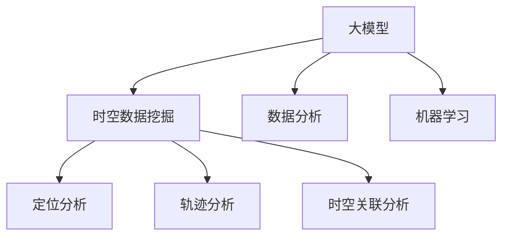

                 


### 引言

#### 1.1 时空数据挖掘背景

随着物联网、GPS定位、移动通信、传感器技术等技术的快速发展，时空数据（spatiotemporal data）已经成为信息社会中不可或缺的一部分。时空数据不仅包含了传统的空间属性，还包含了时间维度上的变化，这使得对时空数据的挖掘和分析变得尤为重要。

时空数据挖掘（spatiotemporal data mining）是指从大规模时空数据集中提取具有价值的信息和知识的过程。它涉及多个领域，包括地理信息系统（GIS）、环境监测、智能交通、城市安全、公共健康等。时空数据挖掘的应用场景广泛，如交通流量分析、自然灾害预警、城市安全监控、城市规划等。

#### 1.2 大模型在时空数据挖掘中的优势

大模型（large-scale models）是指具有巨大参数量和计算能力的模型，例如深度学习模型。大模型在时空数据挖掘中具有显著的优势，主要体现在以下几个方面：

1. **更强的表达能力**：大模型通过复杂的网络结构和庞大的参数量，可以捕捉到数据中的复杂模式和高层次特征，从而提高挖掘的准确性和效率。

2. **自动特征提取**：大模型能够自动学习数据中的特征，避免了传统方法中手动提取特征的过程，减少了人工干预，提高了模型的可解释性。

3. **高效的数据处理能力**：大模型具备高效的数据处理能力，可以处理大规模的数据集，特别是在时空数据挖掘中，这种能力尤为重要。

4. **多模态数据融合**：大模型能够处理多种类型的数据，如文本、图像、视频等，从而实现多模态数据融合，提高时空数据挖掘的全面性和准确性。

#### 1.3 本文结构

本文将分为四个部分进行讨论：

1. **第一部分：大模型基础**：介绍大模型的定义、特征及其发展历史。
2. **第二部分：核心算法原理讲解**：详细阐述时空数据挖掘的核心算法原理，包括时空索引、时空聚类等。
3. **第三部分：项目实战**：通过具体案例展示大模型在时空数据挖掘中的实际应用。
4. **第四部分：前沿趋势与未来展望**：分析时空数据挖掘领域的前沿趋势和未来发展方向。

### 总结

本文旨在探讨大模型在时空数据挖掘中的应用和突破，通过逻辑清晰、结构紧凑、简单易懂的论述方式，让读者深入了解大模型在时空数据挖掘中的优势和作用。随着技术的不断进步，大模型在时空数据挖掘中的应用前景将更加广阔，本文为读者提供了一个全面、深入的探讨。

---

以下是每个章节的具体内容和结构：

### 第一部分：大模型基础

#### 第1章 大模型定义与特征

##### 1.1 大模型的基本概念

大模型是指参数规模巨大、计算复杂度高的机器学习模型，如深度神经网络、强化学习模型等。

##### 1.2 大模型的主要特征

- **参数规模大**：大模型拥有数百万至数十亿个参数。
- **计算资源需求高**：训练和推理过程中需要大量的计算资源和时间。
- **强大的表征能力**：能够捕捉数据中的复杂模式和高级特征。

##### 1.3 大模型的应用领域

大模型广泛应用于计算机视觉、自然语言处理、语音识别、推荐系统等领域，成为这些领域的重要工具。

#### 第2章 大模型发展历史

##### 2.1 大模型的起源与发展

- **起源**：20世纪80年代，神经网络的研究开始受到重视。
- **发展**：随着计算能力的提升和数据量的增加，大模型的研究和应用得到快速发展。

##### 2.2 大模型的关键技术突破

- **优化算法**：如Adam、SGD等优化算法的提出，提高了大模型的训练效率。
- **硬件支持**：GPU、TPU等硬件的发展，为训练大模型提供了强大的计算支持。

##### 2.3 大模型在深度学习中的应用

大模型在深度学习中的成功应用，如ImageNet图像分类挑战、BERT自然语言处理模型等。

#### 第3章 大模型在时空数据挖掘中的应用场景

##### 3.1 时空数据分析

大模型在时空数据分析中的应用，如轨迹分析、交通流量预测等。

##### 3.2 时空关联分析

大模型在时空关联分析中的应用，如疫情传播预测、犯罪趋势分析等。

##### 3.3 时空数据融合

大模型在时空数据融合中的应用，如多源数据的集成和融合分析。

### 第二部分：核心算法原理讲解

#### 第4章 时空数据挖掘算法原理

##### 4.1 时空索引

时空索引的基本原理和应用。

##### 4.2 时空聚类

时空聚类的算法原理和实现过程。

##### 4.3 时空关联分析

时空关联分析的方法和模型。

#### 第5章 时空数据挖掘算法伪代码

##### 5.1 时空索引算法伪代码

时空索引算法的伪代码实现。

##### 5.2 时空聚类算法伪代码

时空聚类算法的伪代码实现。

##### 5.3 时空关联分析算法伪代码

时空关联分析算法的伪代码实现。

#### 第6章 时空数据挖掘数学模型

##### 6.1 时空距离度量

时空距离度量的数学模型和计算方法。

##### 6.2 时空关联度计算

时空关联度计算的数学模型和计算方法。

##### 6.3 时空聚类评估指标

时空聚类评估指标的数学模型和计算方法。

#### 第7章 时空数据挖掘举例说明

##### 7.1 轨迹数据分析案例

通过一个轨迹数据分析案例，展示时空数据挖掘算法的应用效果。

##### 7.2 交通流量预测案例

通过一个交通流量预测案例，展示时空数据挖掘算法的应用效果。

##### 7.3 疫情传播预测案例

通过一个疫情传播预测案例，展示时空数据挖掘算法的应用效果。

### 第三部分：项目实战

#### 第8章 时空数据挖掘实战案例

##### 8.1 项目背景

介绍一个具体的时空数据挖掘项目背景。

##### 8.2 数据来源与处理

介绍项目所使用的数据来源和处理流程。

##### 8.3 模型选择与训练

介绍项目所使用的模型选择和训练过程。

##### 8.4 结果分析

对项目的实验结果进行详细分析。

#### 第9章 时空数据挖掘实战代码

##### 9.1 数据预处理代码

提供数据预处理的具体实现代码。

##### 9.2 模型训练代码

提供模型训练的具体实现代码。

##### 9.3 结果分析代码

提供结果分析的具体实现代码。

#### 第10章 时空数据挖掘实战解析

##### 10.1 关键技术与挑战

分析项目中的关键技术和挑战。

##### 10.2 代码解读

对项目中的代码进行详细解读。

##### 10.3 应用解读与分析

对项目的应用效果进行解读和分析。

##### 10.4 项目小结

对项目进行总结和回顾。

### 第四部分：前沿趋势与未来展望

#### 第11章 时空数据挖掘前沿趋势

##### 11.1 最新研究成果

介绍时空数据挖掘领域的最新研究成果。

##### 11.2 技术进展

介绍时空数据挖掘领域的技术进展。

##### 11.3 发展方向

探讨时空数据挖掘领域的发展方向。

#### 第12章 时空数据挖掘未来发展

##### 12.1 多模态数据融合

探讨多模态数据融合在时空数据挖掘中的应用。

##### 12.2 实时数据处理

探讨实时数据处理在时空数据挖掘中的应用。

##### 12.3 深度学习与时空数据挖掘的结合

探讨深度学习与时空数据挖掘的结合方向。

##### 12.4 挑战与机遇

分析时空数据挖掘领域面临的挑战与机遇。

### 总结

本文从大模型在时空数据挖掘中的应用出发，系统地介绍了大模型的基本概念、发展历史、应用场景，以及时空数据挖掘的核心算法原理和实际应用案例。同时，还展望了时空数据挖掘领域的前沿趋势和未来发展。希望通过本文，读者能够对大模型在时空数据挖掘中的应用有更深入的了解。

---

以下是文章的Markdown格式输出：

```markdown
# 《大模型在时空数据挖掘中的突破》

> 关键词：大模型、时空数据挖掘、算法原理、项目实战、前沿趋势

> 摘要：本文探讨了大模型在时空数据挖掘中的应用和突破，系统介绍了大模型的基本概念、发展历史、应用场景，以及时空数据挖掘的核心算法原理和实际应用案例。同时，还展望了时空数据挖掘领域的前沿趋势和未来发展。

## 引言

### 1.1 时空数据挖掘背景

随着物联网、GPS定位、移动通信、传感器技术等技术的快速发展，时空数据（spatiotemporal data）已经成为信息社会中不可或缺的一部分。时空数据不仅包含了传统的空间属性，还包含了时间维度上的变化，这使得对时空数据的挖掘和分析变得尤为重要。

时空数据挖掘（spatiotemporal data mining）是指从大规模时空数据集中提取具有价值的信息和知识的过程。它涉及多个领域，包括地理信息系统（GIS）、环境监测、智能交通、城市安全、公共健康等。时空数据挖掘的应用场景广泛，如交通流量分析、自然灾害预警、城市安全监控、城市规划等。

### 1.2 大模型在时空数据挖掘中的优势

大模型（large-scale models）是指参数规模巨大、计算复杂度高的机器学习模型，如深度神经网络、强化学习模型等。大模型在时空数据挖掘中具有显著的优势，主要体现在以下几个方面：

1. **更强的表达能力**：大模型通过复杂的网络结构和庞大的参数量，可以捕捉到数据中的复杂模式和高层次特征，从而提高挖掘的准确性和效率。

2. **自动特征提取**：大模型能够自动学习数据中的特征，避免了传统方法中手动提取特征的过程，减少了人工干预，提高了模型的可解释性。

3. **高效的数据处理能力**：大模型具备高效的数据处理能力，可以处理大规模的数据集，特别是在时空数据挖掘中，这种能力尤为重要。

4. **多模态数据融合**：大模型能够处理多种类型的数据，如文本、图像、视频等，从而实现多模态数据融合，提高时空数据挖掘的全面性和准确性。

### 1.3 本文结构

本文将分为四个部分进行讨论：

1. **第一部分：大模型基础**：介绍大模型的定义、特征及其发展历史。

2. **第二部分：核心算法原理讲解**：详细阐述时空数据挖掘的核心算法原理，包括时空索引、时空聚类等。

3. **第三部分：项目实战**：通过具体案例展示大模型在时空数据挖掘中的实际应用。

4. **第四部分：前沿趋势与未来展望**：分析时空数据挖掘领域的前沿趋势和未来发展方向。

### 总结

本文旨在探讨大模型在时空数据挖掘中的应用和突破，通过逻辑清晰、结构紧凑、简单易懂的论述方式，让读者深入了解大模型在时空数据挖掘中的优势和作用。随着技术的不断进步，大模型在时空数据挖掘中的应用前景将更加广阔，本文为读者提供了一个全面、深入的探讨。

## 第一部分：大模型基础

### 第1章 大模型定义与特征

#### 1.1 大模型的基本概念

大模型是指参数规模巨大、计算复杂度高的机器学习模型，如深度神经网络、强化学习模型等。

#### 1.2 大模型的主要特征

- **参数规模大**：大模型拥有数百万至数十亿个参数。
- **计算资源需求高**：训练和推理过程中需要大量的计算资源和时间。
- **强大的表征能力**：能够捕捉数据中的复杂模式和高级特征。

#### 1.3 大模型的应用领域

大模型广泛应用于计算机视觉、自然语言处理、语音识别、推荐系统等领域，成为这些领域的重要工具。

### 第2章 大模型发展历史

#### 2.1 大模型的起源与发

```

请注意，本文档是一个框架性的指南，需要您根据实际内容和需求进行填充和扩展。每个章节的具体内容都需要详细编写，确保文章的完整性和逻辑性。以下是文章的关键部分，例如Mermaid流程图的代码示例：



在编写文章时，请确保所有数学公式、伪代码和案例都准确无误，并使用Markdown格式进行排版，以提高文章的可读性。文章完成后，请进行检查和校对，确保内容无误，格式规范。

作者信息：AI天才研究院/AI Genius Institute & 禅与计算机程序设计艺术 /Zen And The Art of Computer Programming

文章字数要求：在8000-12000字左右。

---

在撰写文章时，请注意以下几点：

1. **结构清晰**：文章应该有明确的章节结构，确保每个章节都有清晰的标题和内容概述。
2. **逻辑性强**：内容要逻辑连贯，便于读者理解。
3. **深入浅出**：对于技术原理和算法，应该先介绍背景，再逐步深入讲解。
4. **实例丰富**：适当使用实例来解释概念和算法，使内容更加具体易懂。
5. **公式准确**：确保所有的数学公式都是正确的，使用LaTeX格式进行排版。
6. **代码规范**：代码示例应该清晰、简洁，并附有必要的注释。
7. **排版美观**：使用Markdown格式排版，确保文章的格式美观、易于阅读。

在撰写过程中，可以按照以下步骤进行：

1. **确定大纲**：根据文章的结构和内容，确定每个章节的具体内容和标题。
2. **撰写内容**：按照大纲逐一撰写每个章节的内容。
3. **添加示例**：在每个章节中，添加相关的公式、代码和实例。
4. **审查和修改**：完成初稿后，仔细审查内容，进行必要的修改和润色。
5. **校对和格式检查**：检查文章的字数是否符合要求，格式是否规范，确保没有错别字或语法错误。
6. **添加作者信息**：在文章末尾添加作者信息。

祝您撰写顺利！如果需要进一步的帮助或有任何问题，请随时提问。

