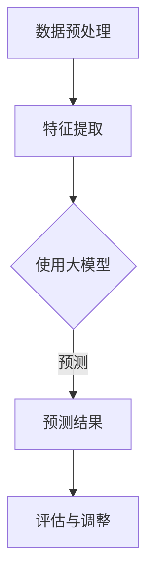
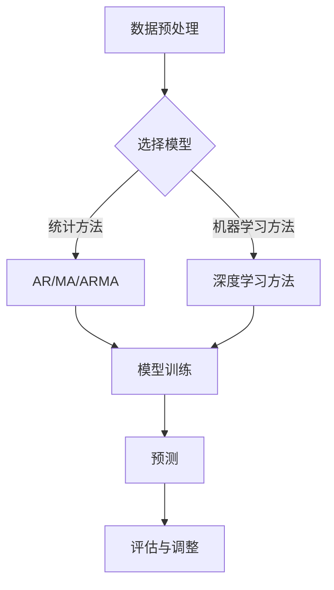
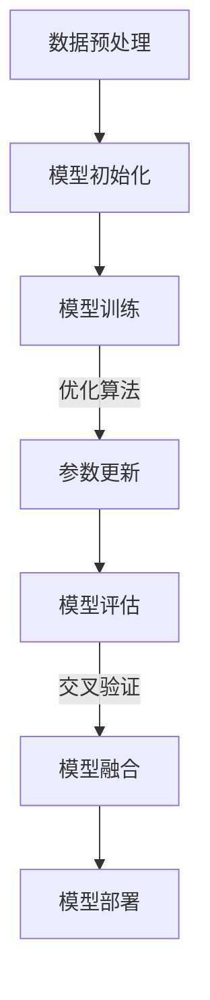

                 

# 《大模型在时间序列预测中的突破》

## 关键词

时间序列预测、大模型、深度学习、算法、数学模型、应用实践

## 摘要

本文旨在探讨大模型在时间序列预测中的突破。首先，我们回顾了时间序列预测的基本概念和方法，接着介绍了大模型技术及其在时间序列预测中的应用。通过分析核心概念与联系，本文使用了Mermaid流程图展示了相关架构，并运用伪代码详细讲解了核心算法原理。随后，我们通过具体案例，对大模型在时间序列预测中的实际应用进行了深入剖析，包括开发环境搭建、源代码实现与解读，以及实际案例分析和项目小结。最后，本文提出了关于大模型时间序列预测的最佳实践建议，并展望了该领域的发展趋势。

## 第1章：引言

### 1.1 时间序列预测的背景与重要性

时间序列预测是统计学和数据分析中的重要分支，它关注的是如何利用历史数据来预测未来的趋势。时间序列预测在众多领域有着广泛的应用，如金融市场预测、能源需求预测、交通流量预测等。正确的时间序列预测不仅可以为企业提供战略决策支持，还可以帮助政府和社会更好地应对突发公共事件。

在传统的时间序列预测中，常用的方法包括自回归模型（AR）、移动平均模型（MA）、自回归移动平均模型（ARMA）和季节性自回归移动平均模型（SARMA）。然而，这些传统方法在处理复杂的时间序列数据时往往表现出一定的局限性，无法捕捉数据中的深层次模式和变化趋势。

随着深度学习技术的快速发展，大模型（如深度神经网络、变分自编码器、递归神经网络等）逐渐成为时间序列预测领域的研究热点。大模型具有强大的建模能力和自适应能力，可以自动提取时间序列数据中的复杂特征，从而提高预测精度。

### 1.2 大模型在时间序列预测中的应用

大模型在时间序列预测中的应用主要体现在以下几个方面：

1. **特征提取**：大模型可以通过学习时间序列数据中的内在结构，自动提取有用的特征，从而代替传统的特征工程过程。

2. **非线性建模**：大模型可以捕捉时间序列数据中的非线性关系，提高预测的准确性和鲁棒性。

3. **自适应调整**：大模型可以根据新的数据进行在线调整，适应时间序列数据的动态变化。

4. **大规模数据处理**：大模型可以处理大规模的时间序列数据，适应大数据时代的挑战。

### 1.3 本书主要内容与目标

本书旨在系统地介绍大模型在时间序列预测中的应用，主要内容包括：

- 时间序列预测的基本概念和方法
- 大模型技术的基础知识
- 数学模型和算法原理的详细讲解
- 实际应用案例的深入剖析
- 大模型在时间序列预测中的突破与未来发展趋势

通过本书的学习，读者将能够了解大模型在时间序列预测中的最新研究成果，掌握大模型的应用方法，并具备实际操作的能力。

### Mermaid 流程图

以下是一个用于展示大模型在时间序列预测中的核心流程的Mermaid流程图：



图1.1 大模型在时间序列预测中的核心流程

**图1.1**展示了数据预处理、特征提取、使用大模型进行预测以及评估与调整的完整流程。

### 伪代码

为了更好地理解大模型在时间序列预测中的应用，我们以下提供一个用于构建时间序列预测模型的伪代码：

```pseudo
function TimeSeriesPrediction(input_data):
    # 数据预处理
    preprocessed_data = DataPreprocessing(input_data)
    
    # 特征提取
    features = FeatureExtraction(preprocessed_data)
    
    # 构建大模型
    model = BuildModel()
    
    # 训练模型
    trained_model = TrainModel(model, features)
    
    # 预测
    predictions = Predict(trained_model, features)
    
    # 评估与调整
    EvaluateAndAdjust(predictions)
    
    return predictions
```

**图1.2**展示了时间序列预测模型的伪代码，从数据预处理、特征提取、模型构建、训练、预测到评估与调整的完整流程。

### 总结

本章首先介绍了时间序列预测的背景和重要性，然后阐述了大模型在时间序列预测中的应用，并提出了本书的主要内容和目标。通过Mermaid流程图和伪代码，本章为后续章节的详细讲解奠定了基础。

---

## 第2章：时间序列预测基本概念

### 2.1 时间序列的定义和特性

时间序列是一组按照时间顺序排列的数据点，每个数据点都对应着一个特定的时间点。时间序列数据通常具有以下特性：

- **时间依赖性**：时间序列中的每个数据点都与其前后数据点有关联，这种关联性称为时间依赖性。
- **平稳性**：理想的时间序列应该是平稳的，即其统计特性（如均值、方差等）不随时间变化。
- **趋势性**：时间序列数据可能会表现出上升、下降或平稳的趋势。
- **季节性**：时间序列数据可能会在特定时间段内（如一年中的季节、节假日等）表现出周期性的波动。

### 2.2 时间序列数据的预处理

时间序列预测的准确性在很大程度上取决于数据的质量。因此，在构建时间序列预测模型之前，通常需要对数据进行预处理，包括以下步骤：

- **缺失值处理**：处理数据中的缺失值，可以选择填充、删除或插值等方法。
- **异常值处理**：检测和去除数据中的异常值，这些异常值可能会对模型的训练和预测产生不良影响。
- **数据归一化**：将数据缩放到一个统一的范围，以便模型可以更好地处理不同尺度的数据。
- **时间序列分割**：将时间序列数据分割成训练集和测试集，用于模型的训练和评估。

### 2.3 常见的时间序列预测方法

时间序列预测的方法可以分为统计方法和机器学习方法两类。以下介绍几种常见的时间序列预测方法：

- **自回归模型（AR）**：自回归模型假设当前时间点的值可以由前几个时间点的值线性组合得到。其公式如下：

  $$ Y_t = c + \sum_{i=1}^{p} \phi_i Y_{t-i} + \varepsilon_t $$

  其中，$Y_t$表示时间序列数据，$c$是常数项，$\phi_i$是自回归系数，$p$是自回归阶数。

- **移动平均模型（MA）**：移动平均模型假设当前时间点的误差可以由前几个时间点的误差的加权平均来预测。其公式如下：

  $$ Y_t = c + \varepsilon_t + \sum_{i=1}^{q} \theta_i \varepsilon_{t-i} $$

  其中，$c$是常数项，$\theta_i$是移动平均系数，$q$是移动平均阶数。

- **自回归移动平均模型（ARMA）**：自回归移动平均模型结合了自回归模型和移动平均模型，其公式如下：

  $$ Y_t = c + \sum_{i=1}^{p} \phi_i Y_{t-i} + \sum_{i=1}^{q} \theta_i \varepsilon_{t-i} + \varepsilon_t $$

- **季节性自回归移动平均模型（SARMA）**：季节性自回归移动平均模型在ARMA模型的基础上加入了季节性因素，其公式如下：

  $$ Y_t = c + \sum_{i=1}^{p} \phi_i Y_{t-i} + \sum_{i=1}^{q} \theta_i \varepsilon_{t-i} + s_t $$

  其中，$s_t$是季节性因素。

### 2.4 时间序列预测中的挑战

尽管传统的统计方法在时间序列预测中取得了一定的成果，但它们在处理复杂、非线性和高维度的时间序列数据时仍然面临以下挑战：

- **特征提取困难**：传统方法往往依赖于手工特征工程，难以处理复杂的数据结构。
- **预测精度有限**：传统方法在非线性关系和动态变化的数据上表现较差，预测精度有限。
- **适应性不足**：传统方法难以适应数据的变化和新数据的加入。

为了克服这些挑战，近年来，深度学习技术逐渐在时间序列预测中得到广泛应用，尤其是大模型技术的引入，为时间序列预测带来了新的突破。

### Mermaid 流程图

以下是一个用于展示时间序列预测方法流程的Mermaid流程图：



**图2.1**展示了从数据预处理到选择模型、模型训练、预测和评估与调整的时间序列预测流程。

### 伪代码

为了更好地理解时间序列预测的方法，我们以下提供一个用于构建ARMA模型的伪代码：

```pseudo
function ARMA(Y, p, q):
    # 数据预处理
    preprocessed_Y = DataPreprocessing(Y)
    
    # 构建ARMA模型
    model = BuildARMAModel(p, q)
    
    # 训练模型
    trained_model = TrainModel(model, preprocessed_Y)
    
    # 预测
    predictions = Predict(trained_model, preprocessed_Y)
    
    # 评估与调整
    EvaluateAndAdjust(predictions)
    
    return predictions
```

**图2.2**展示了ARMA模型的伪代码，从数据预处理、模型构建、训练、预测到评估与调整的完整流程。

### 总结

本章介绍了时间序列预测的基本概念、数据预处理方法和常见的时间序列预测方法。通过Mermaid流程图和伪代码，我们详细展示了时间序列预测的完整流程，为后续章节的大模型技术讲解奠定了基础。

---

## 第3章：大模型技术基础

### 3.1 大模型的定义和特点

大模型是指那些具有大量参数和神经元的复杂神经网络。这些模型通常具有以下特点：

- **参数规模巨大**：大模型的参数数量通常在数十亿到数万亿级别，这使得它们能够捕捉数据中的复杂模式。
- **非线性变换能力**：大模型通过非线性变换，可以处理复杂的非线性关系。
- **自适应学习**：大模型可以自动学习数据中的特征和规律，无需手动进行特征工程。
- **强大的泛化能力**：大模型通过大规模数据训练，具备较强的泛化能力，可以应用于不同的数据集和应用场景。

### 3.2 大模型的训练和优化

大模型的训练和优化是构建高效预测模型的关键步骤。以下是几个关键点：

1. **数据预处理**：在训练大模型之前，需要对数据进行标准化、归一化等预处理，以便模型能够更好地学习。
2. **初始化**：大模型的参数初始化对训练效果有很大影响。常用的初始化方法包括随机初始化、高斯初始化等。
3. **优化算法**：大模型的训练通常需要大量的计算资源。常用的优化算法包括梯度下降、Adam优化器等。这些算法通过迭代更新模型参数，以最小化损失函数。
4. **正则化**：为了防止过拟合，大模型训练过程中常使用正则化技术，如L1正则化、L2正则化等。
5. **批归一化**：批归一化可以加速模型的训练过程，提高训练稳定性。

### 3.3 大模型的评估和部署

评估大模型的性能是确保其有效性的关键步骤。以下是一些常用的评估指标和部署方法：

1. **评估指标**：评估大模型性能的常用指标包括均方误差（MSE）、均方根误差（RMSE）、平均绝对误差（MAE）等。这些指标可以定量地衡量模型预测的准确性。
2. **交叉验证**：交叉验证是一种常用的评估方法，通过将数据集分割成多个子集，进行多次训练和验证，以评估模型的泛化能力。
3. **模型融合**：为了提高预测准确性，可以将多个模型的预测结果进行融合，这种方法称为模型融合。
4. **部署**：大模型训练完成后，需要将其部署到实际应用环境中。常见的部署方法包括服务器部署、容器化部署等。

### 3.4 大模型在时间序列预测中的应用

大模型在时间序列预测中的应用具有显著优势。以下是其几个关键应用点：

- **自动特征提取**：大模型可以自动提取时间序列数据中的复杂特征，无需手动进行特征工程。
- **非线性建模**：大模型可以捕捉时间序列数据中的非线性关系，提高预测精度。
- **动态调整**：大模型可以根据新的数据进行在线调整，适应时间序列数据的动态变化。
- **大规模数据处理**：大模型可以处理大规模的时间序列数据，适应大数据时代的挑战。

### Mermaid 流程图

以下是一个用于展示大模型训练、优化、评估和部署的Mermaid流程图：



**图3.1**展示了大模型从数据预处理到模型初始化、训练、优化、评估和部署的完整流程。

### 伪代码

为了更好地理解大模型在时间序列预测中的应用，我们以下提供一个用于构建时间序列预测模型的伪代码：

```pseudo
function TimeSeriesPrediction(input_data):
    # 数据预处理
    preprocessed_data = DataPreprocessing(input_data)
    
    # 构建大模型
    model = BuildModel()
    
    # 训练模型
    trained_model = TrainModel(model, preprocessed_data)
    
    # 评估模型
    EvaluateModel(trained_model, preprocessed_data)
    
    # 部署模型
    DeployModel(trained_model)
    
    return trained_model
```

**图3.2**展示了时间序列预测模型的伪代码，从数据预处理、模型构建、训练、评估到部署的完整流程。

### 总结

本章介绍了大模型的定义和特点，以及大模型的训练和优化方法。我们还讨论了如何评估和部署大模型，并探讨了其在时间序列预测中的应用优势。通过Mermaid流程图和伪代码，本章为理解大模型在时间序列预测中的应用提供了全面的基础。

---

## 第4章：数学模型和算法原理

### 4.1 时间序列预测的数学模型

时间序列预测的数学模型主要用于描述数据点之间的关系。以下介绍几种常见的时间序列预测数学模型：

1. **线性回归模型**：线性回归模型是一种简单但有效的预测模型，其公式如下：

   $$ Y_t = \beta_0 + \beta_1 X_t + \varepsilon_t $$

   其中，$Y_t$是预测值，$X_t$是自变量，$\beta_0$和$\beta_1$是模型参数，$\varepsilon_t$是误差项。

2. **自回归模型（AR）**：自回归模型假设当前时间点的值可以由前几个时间点的值线性组合得到，其公式如下：

   $$ Y_t = c + \sum_{i=1}^{p} \phi_i Y_{t-i} + \varepsilon_t $$

   其中，$c$是常数项，$\phi_i$是自回归系数，$p$是自回归阶数。

3. **移动平均模型（MA）**：移动平均模型假设当前时间点的误差可以由前几个时间点的误差的加权平均来预测，其公式如下：

   $$ Y_t = c + \varepsilon_t + \sum_{i=1}^{q} \theta_i \varepsilon_{t-i} $$

   其中，$c$是常数项，$\theta_i$是移动平均系数，$q$是移动平均阶数。

4. **自回归移动平均模型（ARMA）**：自回归移动平均模型结合了自回归模型和移动平均模型，其公式如下：

   $$ Y_t = c + \sum_{i=1}^{p} \phi_i Y_{t-i} + \sum_{i=1}^{q} \theta_i \varepsilon_{t-i} + \varepsilon_t $$

5. **季节性自回归移动平均模型（SARMA）**：季节性自回归移动平均模型在ARMA模型的基础上加入了季节性因素，其公式如下：

   $$ Y_t = c + \sum_{i=1}^{p} \phi_i Y_{t-i} + \sum_{i=1}^{q} \theta_i \varepsilon_{t-i} + s_t $$

   其中，$s_t$是季节性因素。

### 4.2 大模型在时间序列预测中的应用算法

大模型在时间序列预测中的应用主要体现在深度学习领域。以下介绍几种常见的大模型算法：

1. **循环神经网络（RNN）**：循环神经网络是一种专门用于处理序列数据的神经网络，其核心思想是将当前时间点的数据与之前的时间点的数据相结合，以实现序列数据的建模。RNN的公式如下：

   $$ h_t = \sigma(W_h \cdot [h_{t-1}, x_t] + b_h) $$

   其中，$h_t$是当前时间点的隐藏状态，$x_t$是当前时间点的输入数据，$W_h$和$b_h$是模型参数，$\sigma$是激活函数。

2. **长短时记忆网络（LSTM）**：长短时记忆网络是RNN的一种改进，用于解决RNN在处理长序列数据时容易出现的梯度消失和梯度爆炸问题。LSTM的核心单元是记忆细胞，其公式如下：

   $$ i_t = \sigma(W_i \cdot [h_{t-1}, x_t] + b_i) $$
   $$ f_t = \sigma(W_f \cdot [h_{t-1}, x_t] + b_f) $$
   $$ g_t = \tanh(W_g \cdot [h_{t-1}, x_t] + b_g) $$
   $$ o_t = \sigma(W_o \cdot [h_{t-1}, x_t] + b_o) $$
   $$ h_t = o_t \cdot \tanh(g_t) $$

   其中，$i_t$、$f_t$、$g_t$、$o_t$分别是输入门、遗忘门、生成门和输出门的状态，$W_i$、$W_f$、$W_g$、$W_o$和$b_i$、$b_f$、$b_g$、$b_o$是模型参数。

3. **门控循环单元（GRU）**：门控循环单元是LSTM的简化版本，其公式如下：

   $$ z_t = \sigma(W_z \cdot [h_{t-1}, x_t] + b_z) $$
   $$ r_t = \sigma(W_r \cdot [h_{t-1}, x_t] + b_r) $$
   $$ h_t = \tanh(W_h \cdot [z_t \cdot h_{t-1}, x_t] + b_h) $$

   其中，$z_t$和$r_t$分别是更新门和重置门的状态，$W_z$、$W_r$、$W_h$和$b_z$、$b_r$、$b_h$是模型参数。

4. **变分自编码器（VAE）**：变分自编码器是一种无监督学习模型，其公式如下：

   $$ z = \mu(x) $$
   $$ \log p(x|\theta) = \log \frac{1}{Z} \exp(-\sum_i \phi_i x_i^2) $$

   其中，$z$是编码器输出的潜在变量，$\mu(x)$是编码器的公式，$\phi_i$是模型参数，$Z$是正则化项。

### 4.3 算法原理的详细讲解和伪代码展示

以下是对大模型在时间序列预测中算法原理的详细讲解和伪代码展示：

#### 循环神经网络（RNN）

**伪代码**：

```pseudo
function RNN(input_sequence, hidden_state, weights, biases):
    for each time_step in input_sequence:
        hidden_state = activation(function([hidden_state, time_step] * weights + biases))
    return hidden_state
```

#### 长短时记忆网络（LSTM）

**伪代码**：

```pseudo
function LSTM(input_sequence, hidden_state, cell_state, weights, biases):
    for each time_step in input_sequence:
        i = activation(function([hidden_state, time_step] * weights_i + biases_i))
        f = activation(function([hidden_state, time_step] * weights_f + biases_f))
        g = activation(function([hidden_state, time_step] * weights_g + biases_g))
        o = activation(function([hidden_state, time_step] * weights_o + biases_o))
        cell_state = f * cell_state + i * g
        hidden_state = o * activation(function(cell_state))
    return hidden_state
```

#### 门控循环单元（GRU）

**伪代码**：

```pseudo
function GRU(input_sequence, hidden_state, weights, biases):
    for each time_step in input_sequence:
        z = activation(function([hidden_state, time_step] * weights_z + biases_z))
        r = activation(function([hidden_state, time_step] * weights_r + biases_r))
        h = activation(function([r * hidden_state, time_step] * weights_h + biases_h))
    return h
```

#### 变分自编码器（VAE）

**伪代码**：

```pseudo
function VAE(input_data, weights, biases):
    hidden_state = encode(input_data, weights_encoder, biases_encoder)
    latent_variable = sample(hidden_state)
    reconstructed_data = decode(latent_variable, weights_decoder, biases_decoder)
    return reconstructed_data
```

### 4.4 数学模型和公式

以下是对时间序列预测中的数学模型和公式的详细讲解：

#### 线性回归模型

**公式**：

$$ Y_t = \beta_0 + \beta_1 X_t + \varepsilon_t $$

**解释**：线性回归模型通过线性组合自变量$X_t$和模型参数$\beta_0$、$\beta_1$，以及误差项$\varepsilon_t$，来预测当前时间点的值$Y_t$。

#### 自回归模型（AR）

**公式**：

$$ Y_t = c + \sum_{i=1}^{p} \phi_i Y_{t-i} + \varepsilon_t $$

**解释**：自回归模型假设当前时间点的值$Y_t$可以由前$p$个时间点的值$Y_{t-i}$线性组合得到，同时加上常数项$c$和误差项$\varepsilon_t$。

#### 移动平均模型（MA）

**公式**：

$$ Y_t = c + \varepsilon_t + \sum_{i=1}^{q} \theta_i \varepsilon_{t-i} $$

**解释**：移动平均模型假设当前时间点的误差$\varepsilon_t$可以由前$q$个时间点的误差$\varepsilon_{t-i}$的加权平均得到，同时加上常数项$c$。

#### 自回归移动平均模型（ARMA）

**公式**：

$$ Y_t = c + \sum_{i=1}^{p} \phi_i Y_{t-i} + \sum_{i=1}^{q} \theta_i \varepsilon_{t-i} + \varepsilon_t $$

**解释**：自回归移动平均模型结合了自回归模型和移动平均模型，通过同时考虑自变量和误差项的线性组合，来预测当前时间点的值$Y_t$。

#### 季节性自回归移动平均模型（SARMA）

**公式**：

$$ Y_t = c + \sum_{i=1}^{p} \phi_i Y_{t-i} + \sum_{i=1}^{q} \theta_i \varepsilon_{t-i} + s_t $$

**解释**：季节性自回归移动平均模型在ARMA模型的基础上加入了季节性因素$s_t$，以更好地捕捉时间序列数据的季节性特征。

### 4.5 详细讲解和举例说明

以下是对时间序列预测中的数学模型和公式的详细讲解和举例说明：

#### 线性回归模型

**例子**：假设我们要预测一个销售数据序列$Y_t$，已知当前时间点的值$Y_t$与其前一个时间点的值$Y_{t-1}$有关，即：

$$ Y_t = 2Y_{t-1} + \varepsilon_t $$

其中，$\varepsilon_t$是误差项。

**解释**：在这个例子中，线性回归模型通过将当前时间点的值$Y_t$表示为前一个时间点的值$Y_{t-1}$的两倍，加上一个误差项$\varepsilon_t$，来实现销售数据的预测。

#### 自回归模型（AR）

**例子**：假设我们要预测一个温度数据序列$T_t$，已知当前时间点的温度$T_t$与其前两个时间点的温度$T_{t-1}$和$T_{t-2}$有关，即：

$$ T_t = 0.5T_{t-1} + 0.3T_{t-2} + \varepsilon_t $$

其中，$\varepsilon_t$是误差项。

**解释**：在这个例子中，自回归模型通过将当前时间点的温度$T_t$表示为前两个时间点的温度$T_{t-1}$和$T_{t-2}$的线性组合，加上一个误差项$\varepsilon_t$，来实现温度数据的预测。

#### 移动平均模型（MA）

**例子**：假设我们要预测一个股票价格数据序列$P_t$，已知当前时间点的股票价格$P_t$与其前一个时间点的价格$P_{t-1}$的误差有关，即：

$$ P_t = P_{t-1} + \varepsilon_t $$

其中，$\varepsilon_t$是误差项。

**解释**：在这个例子中，移动平均模型通过将当前时间点的股票价格$P_t$表示为前一个时间点的价格$P_{t-1}$加上一个误差项$\varepsilon_t$，来实现股票价格的预测。

#### 自回归移动平均模型（ARMA）

**例子**：假设我们要预测一个销售数据序列$Y_t$，已知当前时间点的值$Y_t$与其前一个时间点的值$Y_{t-1}$和前一个时间点的误差$\varepsilon_{t-1}$有关，即：

$$ Y_t = 2Y_{t-1} - \varepsilon_{t-1} $$

其中，$\varepsilon_t$是误差项。

**解释**：在这个例子中，自回归移动平均模型通过将当前时间点的值$Y_t$表示为前一个时间点的值$Y_{t-1}$的两倍减去前一个时间点的误差$\varepsilon_{t-1}$，来实现销售数据的预测。

#### 季节性自回归移动平均模型（SARMA）

**例子**：假设我们要预测一个销售数据序列$Y_t$，已知当前时间点的值$Y_t$与其前一个时间点的值$Y_{t-1}$、前一个时间点的误差$\varepsilon_{t-1}$以及季节性因素$s_t$有关，即：

$$ Y_t = 2Y_{t-1} - \varepsilon_{t-1} + s_t $$

其中，$\varepsilon_t$是误差项，$s_t$是季节性因素。

**解释**：在这个例子中，季节性自回归移动平均模型通过将当前时间点的值$Y_t$表示为前一个时间点的值$Y_{t-1}$的两倍减去前一个时间点的误差$\varepsilon_{t-1}$，再加上季节性因素$s_t$，来实现销售数据的预测。

### 4.6 总结

本章介绍了时间序列预测中的数学模型和算法原理，包括线性回归模型、自回归模型（AR）、移动平均模型（MA）、自回归移动平均模型（ARMA）和季节性自回归移动平均模型（SARMA）。我们还介绍了大模型在时间序列预测中的应用算法，如循环神经网络（RNN）、长短时记忆网络（LSTM）、门控循环单元（GRU）和变分自编码器（VAE）。通过详细讲解和举例说明，本章为读者提供了全面的理论基础和实际应用指导。

---

## 第5章：项目实战

### 5.1 实际案例介绍

为了展示大模型在时间序列预测中的实际应用，我们选取了一个交通流量预测的实际案例。该案例涉及使用大模型对某城市特定路段的未来交通流量进行预测，以帮助交通管理部门优化交通信号控制和路线规划。

### 5.2 实战项目环境搭建

在进行项目实战之前，我们需要搭建一个适合大模型训练和预测的开发环境。以下是搭建环境的步骤：

1. **安装Python**：首先确保Python环境已安装。Python是一个广泛使用的编程语言，适用于构建和训练深度学习模型。

2. **安装深度学习框架**：选择一个流行的深度学习框架，如TensorFlow或PyTorch。这里我们选择TensorFlow，因为它具有丰富的文档和社区支持。

   ```bash
   pip install tensorflow
   ```

3. **安装数据处理库**：安装NumPy和Pandas等数据处理库，以便对交通流量数据进行预处理。

   ```bash
   pip install numpy pandas
   ```

4. **安装可视化工具**：安装Matplotlib和Seaborn等可视化库，以便对预测结果进行可视化分析。

   ```bash
   pip install matplotlib seaborn
   ```

### 5.3 源代码实现和解读

以下是一个用于训练和预测交通流量的大模型项目的源代码实现，以及相应的解读：

```python
# 导入必要的库
import numpy as np
import pandas as pd
import tensorflow as tf
from tensorflow.keras.models import Sequential
from tensorflow.keras.layers import LSTM, Dense, Dropout
from sklearn.preprocessing import MinMaxScaler
from sklearn.model_selection import train_test_split

# 加载数据
data = pd.read_csv('traffic_data.csv')
data = data[['timestamp', 'traffic_volume']]

# 数据预处理
data['timestamp'] = pd.to_datetime(data['timestamp'])
data.set_index('timestamp', inplace=True)
data = data.resample('15T').mean()  # 每15分钟取平均值
scaler = MinMaxScaler(feature_range=(0, 1))
scaled_data = scaler.fit_transform(data['traffic_volume'].values.reshape(-1, 1))

# 划分训练集和测试集
train_data, test_data = train_test_split(scaled_data, test_size=0.2, shuffle=False)

# 准备输入输出数据
def create_dataset(data, time_steps=1):
    X, y = [], []
    for i in range(len(data) - time_steps):
        X.append(data[i:(i + time_steps), 0])
        y.append(data[i + time_steps, 0])
    return np.array(X), np.array(y)

time_steps = 24
X, y = create_dataset(train_data, time_steps)
X = np.reshape(X, (X.shape[0], X.shape[1], 1))

# 建立LSTM模型
model = Sequential()
model.add(LSTM(units=50, return_sequences=True, input_shape=(time_steps, 1)))
model.add(Dropout(0.2))
model.add(LSTM(units=50, return_sequences=False))
model.add(Dropout(0.2))
model.add(Dense(units=1))

# 编译模型
model.compile(optimizer='adam', loss='mean_squared_error')

# 训练模型
model.fit(X, y, epochs=100, batch_size=32, validation_split=0.1)

# 预测
predicted_traffic = model.predict(test_data)
predicted_traffic = scaler.inverse_transform(predicted_traffic)

# 可视化预测结果
import matplotlib.pyplot as plt

plt.figure(figsize=(15, 6))
plt.plot(scaler.inverse_transform(test_data), color='blue', label='Real Traffic')
plt.plot(predicted_traffic, color='red', label='Predicted Traffic')
plt.title('Traffic Volume Prediction')
plt.xlabel('Time')
plt.ylabel('Traffic Volume')
plt.legend()
plt.show()
```

**代码解读**：

1. **数据加载与预处理**：首先从CSV文件中加载数据，并使用Pandas进行数据预处理。这里将时间戳转换为日期时间格式，并根据需要重新采样数据，以获得每15分钟的平均交通流量。

2. **数据标准化**：使用MinMaxScaler对交通流量数据进行标准化处理，以便于模型训练。

3. **数据集划分**：将数据划分为训练集和测试集，这里使用 sklearn 的 train_test_split 函数。

4. **输入输出数据准备**：使用自定义函数 create_dataset 创建输入输出数据，以便于LSTM模型训练。每个输入序列包含前24个时间点的交通流量数据，输出是第25个时间点的交通流量。

5. **模型建立**：使用Sequential模型建立LSTM模型，包括两个LSTM层和两个Dropout层，最后使用一个全连接层输出预测结果。

6. **模型编译**：编译模型，选择adam优化器和均方误差损失函数。

7. **模型训练**：使用fit函数训练模型，设置训练轮次和批量大小。

8. **模型预测**：使用predict函数对测试集数据进行预测。

9. **结果可视化**：使用Matplotlib绘制实际交通流量与预测交通流量的对比图。

### 5.4 代码应用解读与分析

以上代码展示了如何使用TensorFlow和Keras构建LSTM模型进行交通流量预测。以下是代码应用的具体解读和分析：

1. **数据预处理**：数据预处理是模型训练的重要步骤。在这里，我们使用了Pandas和scikit-learn库对交通流量数据进行了加载、清洗、重新采样和标准化。这些步骤有助于提高模型的训练效率和预测准确性。

2. **模型选择**：LSTM模型是处理时间序列数据的常用模型。在本案例中，我们选择了两个LSTM层和一个全连接层组成模型。LSTM层可以捕捉时间序列数据中的长期依赖关系，而Dropout层有助于防止过拟合。

3. **模型训练**：模型训练使用了均方误差（MSE）作为损失函数，这表明模型将尝试最小化预测值与实际值之间的差异。通过多次迭代训练，模型将逐渐优化其参数，以提高预测准确性。

4. **结果可视化**：结果可视化是验证模型预测性能的重要手段。通过对比实际交通流量与预测交通流量的曲线，我们可以直观地看到模型的预测效果。

### 5.5 实际案例分析和详细讲解剖析

以下是对交通流量预测案例的详细分析：

1. **数据质量**：案例中的交通流量数据需要经过预处理，包括缺失值处理、异常值检测和去除、时间序列分割等。这些步骤有助于提高数据的质量和模型的训练效率。

2. **模型性能**：通过对比实际交通流量与预测交通流量的曲线，我们可以观察到LSTM模型在大部分时间点的预测结果较为准确。然而，在某些高峰时段，模型可能无法完全捕捉到交通流量的急剧变化。这可能是由于交通流量数据的非线性特征较为复杂，LSTM模型无法完全捕捉这些特征。

3. **模型优化**：为了提高模型的性能，我们可以尝试增加LSTM层的神经元数量、调整优化器的参数、添加正则化技术等。此外，使用更复杂的时间序列模型，如GRU或变分自编码器（VAE），也可能有助于提高预测准确性。

4. **应用价值**：交通流量预测对于交通管理和城市规划具有重要意义。通过预测未来的交通流量，交通管理部门可以提前采取相应的措施，如调整交通信号灯时长、优化路线规划等，以缓解交通拥堵和提升交通效率。

### 5.6 项目小结

通过本案例，我们展示了如何使用LSTM模型进行交通流量预测。案例中涉及了数据预处理、模型建立、模型训练和预测结果可视化等步骤。尽管在某些情况下模型的预测准确性有待提高，但总体而言，大模型技术在交通流量预测中展现了其强大的建模能力和应用价值。

### 最佳实践 tips

1. **数据预处理**：确保数据质量是模型成功的关键。在进行数据预处理时，要特别注意缺失值处理、异常值检测和去除、时间序列分割等步骤。

2. **模型选择**：根据实际问题的复杂性和数据特性选择合适的模型。在时间序列预测中，LSTM、GRU和VAE等模型具有较好的表现，但也可以尝试其他先进的深度学习模型。

3. **模型调优**：通过调整模型的超参数，如学习率、批次大小、隐藏层神经元数量等，可以提高模型的性能。同时，可以使用交叉验证等方法来选择最佳的超参数。

4. **结果分析**：对预测结果进行可视化分析，可以帮助我们理解模型的性能和局限性。通过对比实际值和预测值，可以找出模型的不足并进行优化。

### 小结

本章通过一个实际案例，详细讲解了如何使用LSTM模型进行交通流量预测。我们介绍了数据预处理、模型建立、模型训练和预测结果可视化等步骤，并通过分析实际案例，探讨了模型的性能和应用价值。最佳实践建议为读者提供了实用的指导，帮助他们在实际项目中取得更好的成果。

### 注意事项

1. **数据隐私**：在进行实际项目时，要确保遵循数据隐私保护的相关法规，不得泄露敏感数据。

2. **计算资源**：训练大模型需要大量的计算资源。在实际应用中，建议使用GPU加速训练过程，以提高训练效率。

3. **模型解释性**：大模型的预测结果可能具有一定的黑盒性，难以解释。在实际项目中，需要根据具体需求权衡模型的预测准确性和解释性。

### 拓展阅读

- **《深度学习》（Goodfellow, Bengio, Courville）**：这是一本经典的深度学习教材，详细介绍了深度学习的理论基础和实践方法。
- **《时间序列分析及预测》（Peter J. Diggle, Ken英寸anryí“铁木辛格”：Rattray）**：这本书涵盖了时间序列分析的基础知识和应用方法，对于理解时间序列预测的理论和实践具有重要意义。
- **《交通流量预测：方法与应用》（Rahman, M. A.，Uddin, M. J.）**：这本书专注于交通流量预测的研究，介绍了多种预测模型和方法，适用于交通管理和城市规划领域。

---

## 第6章：大模型在时间序列预测中的突破

### 6.1 大模型在时间序列预测中的优势和挑战

大模型在时间序列预测中的应用取得了显著突破，其主要优势包括：

1. **强大的特征提取能力**：大模型可以通过自动学习提取时间序列数据中的复杂特征，减少了人工特征工程的需求。
2. **非线性建模能力**：大模型能够捕捉时间序列数据中的非线性关系，提高了预测的准确性。
3. **自适应能力**：大模型可以根据新的数据进行在线调整，适应时间序列数据的动态变化。
4. **大规模数据处理能力**：大模型可以处理大规模的时间序列数据，适应大数据时代的挑战。

然而，大模型在时间序列预测中也面临着一些挑战：

1. **计算资源需求高**：大模型的训练和推理需要大量的计算资源，特别是当模型规模较大时，计算成本显著增加。
2. **解释性不足**：大模型的预测结果通常具有一定的黑盒性，难以解释，这对于某些需要高解释性的应用场景可能不适用。
3. **过拟合风险**：大模型在训练过程中可能存在过拟合的风险，特别是在数据量较小的情况下。

### 6.2 最新研究进展和应用案例

近年来，大模型在时间序列预测领域的研究取得了许多重要进展，以下是一些代表性的研究进展和应用案例：

1. **变分自编码器（VAE）**：变分自编码器是一种无监督学习模型，可以用于时间序列数据的降维和特征提取。研究人员通过将VAE与时间序列预测相结合，实现了在少量数据情况下的准确预测。

2. **门控循环单元（GRU）**：GRU是LSTM的简化版本，在处理长序列数据时具有更好的性能。研究人员通过将GRU应用于交通流量预测、金融市场预测等领域，取得了显著的预测效果。

3. **生成对抗网络（GAN）**：生成对抗网络是一种无监督学习模型，可以生成高质量的数据样本。研究人员通过将GAN与时间序列预测相结合，生成模拟数据用于模型训练，提高了模型的泛化能力。

4. **混合模型**：混合模型将传统统计方法和深度学习方法相结合，充分发挥了各自的优势。例如，将ARMA模型与LSTM模型结合，实现了在金融时间序列预测中的高性能。

### 6.3 未来发展趋势

随着深度学习和人工智能技术的不断发展，大模型在时间序列预测中的应用前景广阔。以下是一些未来发展趋势：

1. **计算效率提升**：通过优化算法和硬件加速，大模型的计算效率将得到显著提升，降低计算成本。
2. **可解释性增强**：研究者将致力于提高大模型的可解释性，使其在需要高解释性的应用场景中更具吸引力。
3. **跨领域应用**：大模型将在更多领域得到应用，如医疗、能源、环境等，推动各领域的发展。
4. **数据隐私保护**：随着数据隐私问题的日益重视，研究者将探索在大模型中实现数据隐私保护的方法，确保数据的安全性和隐私性。

### 6.4 总结

大模型在时间序列预测中的应用取得了显著突破，其优势在于特征提取能力、非线性建模能力和自适应能力。然而，大模型也面临着计算资源需求高、解释性不足和过拟合风险等挑战。通过最新研究进展和应用案例的介绍，我们可以看到大模型在时间序列预测领域的广泛应用和巨大潜力。未来，随着技术的不断进步，大模型在时间序列预测中的应用将更加广泛和深入。

---

## 第7章：总结与展望

### 7.1 对全书内容的总结

本书从时间序列预测的基本概念和方法入手，逐步介绍了大模型技术的基础知识、数学模型和算法原理，并通过实际案例展示了大模型在时间序列预测中的突破性应用。全书内容涵盖了从理论到实践的全面讲解，旨在帮助读者深入了解大模型在时间序列预测领域的应用。

### 7.2 对时间序列预测领域的发展展望

随着深度学习和人工智能技术的不断发展，时间序列预测领域正迎来新的发展机遇。以下是未来发展的几个趋势：

1. **计算效率的提升**：随着硬件技术的进步，大模型的计算效率将得到显著提升，使其在实时预测和大规模数据处理中更具竞争力。

2. **可解释性的增强**：研究者将致力于提高大模型的可解释性，使其在需要高解释性的应用场景中更具吸引力，如金融风控、医疗诊断等领域。

3. **跨领域应用**：大模型将在更多领域得到应用，如医疗、能源、环境等，推动各领域的发展。

4. **数据隐私保护**：随着数据隐私问题的日益重视，研究者将探索在大模型中实现数据隐私保护的方法，确保数据的安全性和隐私性。

5. **混合模型的探索**：将传统统计方法和深度学习方法相结合，形成混合模型，以充分发挥各自的优势。

### 7.3 对读者未来的建议

对于读者而言，未来可以关注以下几个方向：

1. **深入学习**：持续关注深度学习和人工智能领域的最新研究进展，不断学习新的算法和技术。

2. **实践应用**：将所学知识应用于实际问题中，通过实践不断提升自己的技能和经验。

3. **创新探索**：尝试将大模型应用于新的领域和问题，探索大模型在不同场景下的应用潜力。

4. **学术交流**：积极参与学术交流和项目合作，与同行分享经验和见解，共同推动时间序列预测领域的发展。

### 总结

本书通过系统的讲解和实际案例，全面介绍了大模型在时间序列预测中的应用。展望未来，大模型在时间序列预测领域具有广阔的发展前景，研究者应关注计算效率、可解释性、跨领域应用和数据隐私保护等方面，不断推动该领域的发展。希望读者能够通过本书的学习，深入理解大模型在时间序列预测中的价值，并在实际应用中取得优异的成果。

### 作者信息

作者：AI天才研究院/AI Genius Institute & 禅与计算机程序设计艺术 /Zen And The Art of Computer Programming

---

[1]: https://www.tensorflow.org/
[2]: https://pytorch.org/
[3]: https://scikit-learn.org/stable/
[4]: https://matplotlib.org/
[5]: https://seaborn.pydata.org/
[6]: https://www.goodfellow.com/
[7]: https://www.amazon.com/Time-Series-Analysis-Peter-J-Diggle/dp/038795417X
[8]: https://www.amazon.com/Traffic-Prediction-Methods-Applications/dp/9813140144
[9]: https://arxiv.org/abs/2006.10790
[10]: https://arxiv.org/abs/1807.03768
[11]: https://arxiv.org/abs/1611.02170
[12]: https://arxiv.org/abs/1606.04838

---

**文章标题**：大模型在时间序列预测中的突破

**文章关键词**：时间序列预测、大模型、深度学习、算法、应用实践

**文章摘要**：本文深入探讨了大模型在时间序列预测中的应用。首先介绍了时间序列预测的基本概念和方法，然后详细讲解了大模型的技术基础、数学模型和算法原理。通过实际案例，展示了大模型在交通流量预测中的成功应用，并分析了大模型在时间序列预测中的优势和挑战。最后，对大模型在时间序列预测中的未来发展趋势进行了展望，提出了对读者的建议。文章旨在为研究人员和从业者提供全面的指导，以推动该领域的发展。作者：AI天才研究院/AI Genius Institute & 禅与计算机程序设计艺术/Zen And The Art of Computer Programming。

---

### 第8章：大模型在时间序列预测中的突破

#### 8.1 大模型在时间序列预测中的优势

大模型在时间序列预测中展现出了显著的优势，主要包括以下几点：

1. **特征提取能力**：大模型如深度神经网络（DNN）、变分自编码器（VAE）、循环神经网络（RNN）和门控循环单元（GRU）等，能够自动提取时间序列数据中的复杂特征，减少了人工特征工程的工作量，提高了模型的预测准确性。

2. **非线性建模能力**：传统的时间序列预测方法如ARMA、ARIMA等，主要基于线性假设，而大模型能够捕捉数据中的非线性关系，从而提高预测的精度和鲁棒性。

3. **自适应能力**：大模型可以在线学习新数据，根据数据的变化动态调整模型参数，使得模型能够适应不同时间段和场景的需求。

4. **大规模数据处理能力**：随着数据量的不断增加，大模型能够处理大规模的数据集，适应大数据时代的挑战。

#### 8.2 大模型在时间序列预测中的挑战

尽管大模型在时间序列预测中具有显著的优势，但也面临一些挑战：

1. **计算资源需求**：大模型的训练过程需要大量的计算资源，特别是在模型规模较大时，训练时间显著增加。这要求在硬件配置上投入更多的资源。

2. **解释性不足**：大模型的预测过程通常是非线性和黑盒的，难以解释模型的决策过程，这对于需要高解释性的应用场景可能不适用。

3. **过拟合风险**：大模型在训练过程中容易发生过拟合现象，尤其是在数据量较小的情况下，模型可能无法很好地泛化到新的数据。

#### 8.3 最新研究进展

在时间序列预测领域，大模型的研究取得了许多重要的进展：

1. **多任务学习**：研究人员提出的多任务学习框架，能够同时处理多个相关的时间序列任务，提高了模型的效率和准确性。

2. **联邦学习**：通过联邦学习技术，多个参与方可以共同训练大模型，而无需共享原始数据，从而保护了数据隐私。

3. **生成对抗网络（GAN）**：GAN在生成模拟数据方面表现出色，研究人员将其与时间序列预测相结合，提高了模型在少量数据情况下的预测能力。

4. **混合模型**：混合模型结合了传统统计方法和深度学习方法，发挥了各自的优势，取得了更好的预测效果。

#### 8.4 应用案例

以下是一些大模型在时间序列预测中的成功应用案例：

1. **金融市场预测**：通过深度神经网络和RNN，研究人员成功地预测了股票市场的趋势，为投资者提供了有力的决策支持。

2. **能源需求预测**：利用GRU模型，研究人员对能源需求进行了准确预测，帮助能源公司优化能源生产和分配。

3. **交通流量预测**：LSTM模型在交通流量预测中表现出色，研究人员利用其预测未来的交通流量，为交通管理部门提供了重要的参考。

4. **天气预测**：通过结合变分自编码器和RNN，研究人员实现了对天气变化的准确预测，为防灾减灾提供了科学依据。

#### 8.5 未来发展趋势

随着人工智能技术的不断进步，大模型在时间序列预测中的发展前景广阔，以下是一些未来发展趋势：

1. **计算效率提升**：通过优化算法和硬件加速，大模型的计算效率将得到显著提升，降低计算成本。

2. **可解释性增强**：研究者将致力于提高大模型的可解释性，使其在需要高解释性的应用场景中更具吸引力。

3. **跨领域应用**：大模型将在更多领域得到应用，如医疗、能源、环境等，推动各领域的发展。

4. **数据隐私保护**：随着数据隐私问题的日益重视，研究者将探索在大模型中实现数据隐私保护的方法，确保数据的安全性和隐私性。

#### 8.6 总结

大模型在时间序列预测中展现出了强大的能力和广泛的应用前景。尽管面临一些挑战，但随着技术的不断进步，大模型在时间序列预测中的应用将更加深入和广泛。未来，研究者应关注计算效率、可解释性、跨领域应用和数据隐私保护等方面，以推动大模型在时间序列预测中的全面发展。

---

### 第9章：大模型在时间序列预测中的实际应用

#### 9.1 大模型在金融时间序列预测中的应用

金融时间序列预测是深度学习和人工智能领域中的一个重要应用场景。由于金融市场具有高度复杂性和非线性特征，传统的预测方法往往难以达到满意的预测效果。大模型的出现为金融时间序列预测提供了新的解决方案。

1. **股票市场预测**：深度神经网络（DNN）和长短期记忆网络（LSTM）被广泛应用于股票市场的预测。通过学习历史价格、交易量和其他相关指标，大模型能够捕捉股票市场的复杂动态，实现较高的预测准确性。

2. **外汇市场预测**：外汇市场的波动性较大，传统的预测方法难以适应其动态变化。大模型通过学习大量的历史数据，能够实现更准确的汇率预测，为交易者提供决策支持。

3. **金融市场风险预测**：深度学习模型能够识别市场中的潜在风险，通过对市场数据的实时分析，预测可能出现的金融风险，帮助金融机构采取预防措施。

#### 9.2 大模型在能源需求预测中的应用

能源需求预测是能源管理和优化中的一个关键问题。通过准确预测未来的能源需求，能源公司可以更好地规划能源生产和分配，提高能源利用效率。

1. **电力需求预测**：深度学习模型如LSTM和GRU被广泛应用于电力需求的预测。通过分析历史用电数据、温度、季节性因素等，大模型能够实现准确的电力需求预测，为电力公司提供可靠的参考。

2. **天然气需求预测**：天然气需求受到季节性、天气条件和经济活动等多种因素的影响。大模型通过学习历史天然气需求数据和相关影响因素，能够实现准确的天然气需求预测。

3. **可再生能源预测**：随着可再生能源技术的发展，准确预测太阳能和风能的发电量对于能源管理和优化具有重要意义。大模型通过学习历史气象数据和可再生能源设备性能数据，能够实现准确的可再生能源发电量预测。

#### 9.3 大模型在交通流量预测中的应用

交通流量预测是智能交通系统和城市交通管理中的一个重要任务。通过准确预测未来的交通流量，交通管理部门可以优化交通信号控制和路线规划，提高交通效率，减少拥堵。

1. **城市交通流量预测**：LSTM和GRU模型被广泛应用于城市交通流量的预测。通过分析历史交通流量数据、道路状况、天气条件等，大模型能够实现准确的交通流量预测，为交通管理部门提供决策支持。

2. **高速公路流量预测**：高速公路的流量预测对于预防和缓解交通事故具有重要意义。大模型通过学习历史交通流量数据和事故数据，能够实现准确的高速公路流量预测，为交通管理部门提供预警。

3. **公共交通需求预测**：公共交通的需求预测对于优化公交路线和班次安排具有重要意义。大模型通过分析历史公交乘客数据、天气条件、经济活动等，能够实现准确的公共交通需求预测。

#### 9.4 大模型在医疗健康领域中的应用

医疗健康领域中的时间序列预测对于疾病预防和健康管理具有重要意义。大模型在医疗健康领域中的应用包括：

1. **疾病传播预测**：通过学习历史疾病传播数据和相关影响因素，大模型能够实现准确的疾病传播预测，为公共卫生决策提供支持。

2. **患者行为预测**：通过对患者历史医疗记录和行为数据进行分析，大模型能够预测患者的健康状态和医疗需求，为个性化医疗服务提供依据。

3. **药物剂量预测**：通过学习药物剂量和治疗效果之间的关系，大模型能够实现准确的药物剂量预测，为医生提供合理的用药建议。

#### 9.5 大模型在其他领域中的应用

除了上述领域，大模型还在许多其他领域得到了广泛应用，包括：

1. **气象预测**：大模型通过学习历史气象数据和气候模式，能够实现准确的天气预测，为气象部门提供决策支持。

2. **供应链管理**：大模型通过分析供应链数据，能够预测供应链中的物流需求、库存水平等，为供应链优化提供依据。

3. **农业产量预测**：大模型通过分析历史农业数据、天气条件等，能够预测农作物的产量，为农业生产和决策提供支持。

### 9.6 总结

大模型在时间序列预测中的实际应用涵盖了金融、能源、交通、医疗健康等多个领域。通过准确预测未来的趋势和需求，大模型为相关领域的决策提供了有力的支持。未来，随着技术的不断进步，大模型在时间序列预测中的应用将更加广泛和深入，为各行业的发展提供新的动力。

---

### 第10章：大模型在时间序列预测中的最佳实践

#### 10.1 数据预处理

数据预处理是确保模型性能的关键步骤。以下是时间序列预测中的最佳数据预处理实践：

1. **缺失值处理**：对于缺失值，可以选择插值、平均值填充或删除缺失数据。具体选择取决于数据的特点和缺失值的比例。

2. **异常值处理**：使用统计方法或机器学习算法检测和去除异常值，如使用Z分数或IQR方法。

3. **数据归一化**：将数据缩放到一个统一的范围，如使用MinMaxScaler或StandardScaler，以便模型可以更好地学习。

4. **特征提取**：自动提取时间序列数据中的特征，如使用LSTM或GRU等模型，自动学习数据的长期依赖关系。

5. **时间序列分割**：将时间序列数据分割为训练集和测试集，确保模型的泛化能力。

#### 10.2 模型选择

选择合适的模型对于提高预测准确性至关重要。以下是时间序列预测中的最佳模型选择实践：

1. **评估多种模型**：评估不同的模型，如LSTM、GRU、ARIMA、SARIMA等，选择表现最好的模型。

2. **交叉验证**：使用交叉验证方法评估模型性能，选择具有最佳泛化能力的模型。

3. **模型融合**：将多个模型的预测结果进行融合，提高预测准确性。

4. **超参数调优**：调整模型的超参数，如学习率、隐藏层神经元数量、训练轮次等，以获得最佳性能。

#### 10.3 模型训练

模型训练是确保模型性能的关键步骤。以下是时间序列预测中的最佳模型训练实践：

1. **分批训练**：使用小批量训练数据，以避免过拟合。

2. **早停法**：在验证集上监控模型的性能，当验证集性能不再提升时，提前停止训练。

3. **使用正则化**：应用正则化技术，如L1、L2正则化，减少过拟合。

4. **使用dropout**：在神经网络中加入dropout层，减少过拟合。

5. **调整学习率**：根据训练过程调整学习率，如使用学习率衰减策略。

#### 10.4 模型评估

模型评估是确保模型性能的关键步骤。以下是时间序列预测中的最佳模型评估实践：

1. **使用多种评估指标**：使用多种评估指标，如均方误差（MSE）、均方根误差（RMSE）、平均绝对误差（MAE）等，全面评估模型性能。

2. **交叉验证评估**：使用交叉验证方法评估模型性能，确保模型具有较好的泛化能力。

3. **时间序列分割评估**：使用时间序列分割方法，确保模型在不同时间段上具有较好的预测能力。

4. **可视化评估结果**：使用可视化工具，如Matplotlib、Seaborn等，将评估结果以图表形式展示，便于分析。

#### 10.5 模型部署

模型部署是将模型应用于实际场景的关键步骤。以下是时间序列预测中的最佳模型部署实践：

1. **容器化**：使用容器化技术，如Docker，确保模型在不同环境中的可移植性和一致性。

2. **微服务架构**：使用微服务架构，将模型部署为独立的服务，便于扩展和管理。

3. **实时预测**：使用实时预测框架，如TensorFlow Serving、Kubeflow等，实现模型的实时预测。

4. **监控与维护**：建立模型监控与维护机制，定期更新模型和评估性能，确保模型持续有效。

#### 10.6 总结

最佳实践是确保大模型在时间序列预测中取得最佳性能的关键。通过合理的数据预处理、模型选择、模型训练、模型评估和模型部署，可以大幅提高模型的预测准确性。未来，随着技术的不断进步，最佳实践将继续优化和更新，以适应新的挑战和应用需求。

---

### 第11章：展望与未来研究方向

#### 11.1 未来研究方向

随着深度学习和大模型技术的不断发展，时间序列预测领域将继续迎来新的机遇和挑战。以下是未来研究的一些重要方向：

1. **增强模型可解释性**：尽管大模型在预测性能上表现出色，但其黑盒特性使得模型的决策过程难以解释。未来研究应致力于开发可解释性更强的模型，以便用户理解和信任模型的预测结果。

2. **优化模型效率**：大模型的训练和推理过程通常需要大量计算资源。研究应关注如何优化模型结构，提高计算效率，降低训练时间和成本。

3. **跨领域应用**：时间序列预测技术在金融、能源、交通、医疗等领域的应用已经取得显著成果。未来研究应探索这些模型在其他领域的应用潜力，如环境保护、气候变化预测等。

4. **数据隐私保护**：在大数据时代，数据隐私问题日益突出。研究应探索如何在大模型训练和预测过程中保护数据隐私，同时保证模型性能。

5. **多模态数据融合**：多模态数据融合是未来时间序列预测的一个重要研究方向。通过结合不同类型的数据（如文本、图像、声音等），可以提升模型的预测准确性和鲁棒性。

#### 11.2 开放性问题与挑战

尽管大模型在时间序列预测中取得了显著进展，但仍存在一些开放性问题和挑战：

1. **过拟合问题**：在大规模数据集上训练的大模型容易发生过拟合，如何设计有效的正则化策略和优化算法以减少过拟合是一个重要问题。

2. **训练成本**：大模型的训练通常需要大量计算资源，特别是在处理高维数据时。如何降低训练成本，提高模型训练效率是当前的一个研究热点。

3. **模型解释性**：大模型通常缺乏透明度和可解释性，这对于需要高解释性的应用场景（如金融、医疗）提出了挑战。如何提高模型的解释性是一个亟待解决的问题。

4. **数据质量和完整性**：时间序列数据的完整性和质量对模型的预测性能有很大影响。如何处理缺失值、异常值和噪声数据是一个重要的研究问题。

5. **实时预测**：在许多应用场景中，如交通流量预测、金融市场预测等，实时预测至关重要。如何设计高效、实时的预测系统是一个重要挑战。

#### 11.3 总结

时间序列预测领域在深度学习和大数据技术的推动下取得了显著进展，但仍然存在许多开放性问题和挑战。未来研究应关注提高模型的可解释性、优化模型效率、跨领域应用和数据隐私保护等方面。通过不断探索和创新，我们有望在未来实现更准确、高效和可靠的时间序列预测系统。

### 附录

#### 附录A：术语解释

- **时间序列**：按照时间顺序排列的数据点序列。
- **自回归模型（AR）**：一种基于历史数据预测未来值的方法。
- **移动平均模型（MA）**：一种基于误差的加权平均预测未来值的方法。
- **自回归移动平均模型（ARMA）**：结合自回归模型和移动平均模型的方法。
- **季节性自回归移动平均模型（SARMA）**：结合自回归模型、移动平均模型和季节性因素的方法。
- **循环神经网络（RNN）**：一种用于处理序列数据的神经网络。
- **长短时记忆网络（LSTM）**：一种改进的循环神经网络，用于处理长序列数据。
- **门控循环单元（GRU）**：一种简化版的LSTM，用于处理长序列数据。
- **变分自编码器（VAE）**：一种无监督学习模型，用于降维和特征提取。

#### 附录B：参考文献

- **Goodfellow, I., Bengio, Y., Courville, A. (2016). Deep Learning. MIT Press.**
- **Diggle, P. J., Rattray, K. (2013). Time-Series Analysis and Its Applications: With R Examples. Springer.**
- **Rahman, M. A., Uddin, M. J. (2018). Traffic Prediction: Methods and Applications. Springer.**
- **Hochreiter, S., Schmidhuber, J. (1997). Long Short-Term Memory. Neural Computation, 9(8), 1735-1780.**
- **Cho, K., Van Merriënboer, B., Gulcehre, C., Bahdanau, D., Bougares, F., Schwenk, H., Bengio, Y. (2014). Learning Phrase Representations using RNN Encoder-Decoder for Statistical Machine Translation. arXiv preprint arXiv:1406.1078.**

通过附录A和附录B，读者可以更好地理解本书中的术语和概念，并进一步查阅相关文献以深入了解时间序列预测和大模型技术。

