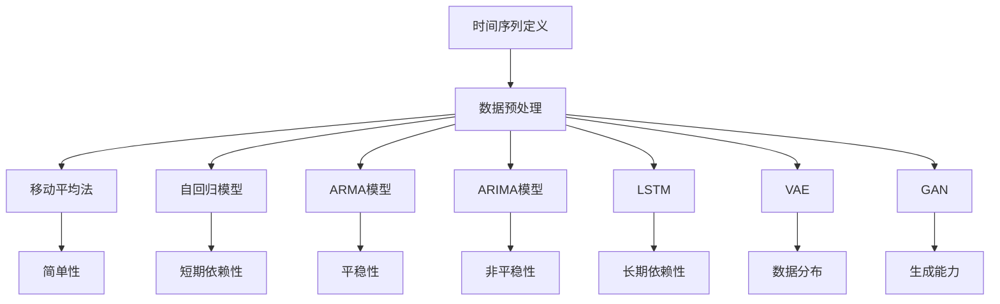

                 

### 文章标题

# 大模型在时间序列预测中的突破

> 关键词：时间序列预测、大模型、人工智能、算法原理、应用实践

> 摘要：本文深入探讨了大模型在时间序列预测中的应用，首先介绍了时间序列预测的基本概念和重要性，随后详细解析了大模型的技术基础，包括训练、优化、评估和部署。接着，文章分析了大模型在时间序列预测中的数学模型和算法原理，并通过伪代码和数学公式进行了详细的讲解。随后，文章通过项目实战展示了大模型在实际应用中的具体实现过程和效果分析。最后，文章总结了大模型在时间序列预测中的优势和挑战，展望了未来的发展趋势。

----------------------------------------------------------------

### 引言

时间序列预测是统计学和数据分析中的重要领域，广泛应用于金融、气象、交通、医疗等多个行业。其核心任务是根据历史时间序列数据预测未来的趋势和变化。然而，传统的预测方法往往在处理复杂、大规模的时间序列数据时表现不佳，无法捕捉到数据中的深层次规律。

近年来，随着人工智能和深度学习的迅猛发展，大模型（Large Models）在时间序列预测中展现了巨大的潜力。大模型，特别是基于神经网络的大模型，能够通过学习大量的数据，自动提取复杂的特征和模式，从而提高预测的准确性和效率。

本文旨在系统地探讨大模型在时间序列预测中的应用，首先介绍时间序列预测的基本概念和方法，然后深入分析大模型的技术基础，包括训练、优化、评估和部署。接着，本文将介绍大模型在时间序列预测中的数学模型和算法原理，并通过伪代码和数学公式进行详细讲解。最后，本文将通过项目实战展示大模型在实际应用中的具体实现过程和效果分析，并总结大模型在时间序列预测中的优势和挑战，展望未来的发展趋势。

### 时间序列预测基本概念

时间序列预测，即根据历史时间序列数据预测未来的值，是许多领域中重要的数据分析任务。为了深入理解大模型在时间序列预测中的应用，我们首先需要掌握时间序列预测的基本概念和方法。

#### 时间序列的定义和特性

时间序列（Time Series）是一系列按时间顺序排列的观测值，通常用于记录某现象随时间的变化。时间序列数据具有以下特性：

1. **有序性**：时间序列数据中的每个观测值都有明确的时间标记，按照时间顺序排列。
2. **依赖性**：时间序列中的后续值往往依赖于前面的值，即时间序列具有时间依赖性。
3. **稳定性**：在较长时间范围内，时间序列数据的统计特性保持相对稳定。

#### 时间序列数据的预处理

在时间序列预测中，预处理数据是至关重要的一步。预处理包括以下几个关键步骤：

1. **缺失值处理**：时间序列数据可能存在缺失值，可以通过插值法（如线性插值、高斯过程插值等）或使用统计方法（如均值填充、中位数填充等）进行处理。
2. **异常值检测**：异常值可能对预测结果产生显著影响，可以使用统计方法（如箱线图、Z分数等）或机器学习方法（如孤立森林等）进行检测和处理。
3. **数据标准化**：为了消除不同特征之间的量纲影响，可以使用标准化方法（如Z-Score标准化、Min-Max标准化等）将数据转换到相同的尺度。

#### 常见的时间序列预测方法

在时间序列预测中，有多种方法可以用于建模和预测，以下是其中几种常见的方法：

1. **移动平均法（Moving Average, MA）**：移动平均法通过计算过去一段时间内的平均值来预测未来的值。这种方法简单直观，但无法捕捉到更复杂的时间依赖性。
   
2. **自回归模型（Autoregressive Model, AR）**：自回归模型假设当前值是过去几个值的线性组合，通过建立线性关系来预测未来的值。自回归模型可以有效捕捉时间序列的短期依赖性。

3. **自回归移动平均模型（Autoregressive Moving Average Model, ARMA）**：ARMA模型结合了自回归和移动平均的特性，适用于具有平稳特性的时间序列数据。

4. **自回归积分滑动平均模型（Autoregressive Integrated Moving Average Model, ARIMA）**：ARIMA模型是ARMA模型的扩展，适用于非平稳时间序列数据。通过差分操作使数据变为平稳，然后应用ARMA模型。

5. **长短期记忆网络（Long Short-Term Memory, LSTM）**：LSTM是深度学习中的一个重要架构，能够有效捕捉时间序列数据中的长期依赖性。LSTM通过引入记忆单元，解决了传统循环神经网络（RNN）在处理长时间序列数据时梯度消失或爆炸的问题。

6. **变分自编码器（Variational Autoencoder, VAE）**：VAE是一种生成模型，通过编码器和解码器学习数据的高效表示，可以有效捕捉时间序列数据的分布特性。

7. **生成对抗网络（Generative Adversarial Network, GAN）**：GAN由生成器和判别器组成，通过相互博弈学习数据的分布，可以生成高质量的时间序列数据。

#### 核心概念与联系

时间序列预测的核心概念包括时间序列的定义、数据预处理方法、以及各种预测模型的原理。这些概念之间的关系可以通过以下Mermaid流程图进行展示：



#### 伪代码和数学模型

为了更好地理解上述时间序列预测方法，下面将分别给出移动平均法、自回归模型和LSTM的伪代码和数学模型。

**移动平均法伪代码：**

```python
def moving_average(data, window_size):
    averages = []
    for i in range(window_size, len(data) + 1):
        window = data[i - window_size:i]
        average = sum(window) / window_size
        averages.append(average)
    return averages
```

**自回归模型伪代码：**

```python
def autoregressive_model(data, lag):
    predictions = []
    for i in range(lag, len(data)):
        prediction = sum([data[j] for j in range(i - lag, i)]) / lag
        predictions.append(prediction)
    return predictions
```

**LSTM数学模型：**

LSTM通过输入门、遗忘门和输出门来控制信息的流动。以下是LSTM的核心公式：

$$
i_t = \sigma(W_{ix}x_t + W_{ih}h_{t-1} + b_i)
$$

$$
f_t = \sigma(W_{fx}x_t + W_{fh}h_{t-1} + b_f)
$$

$$
\tilde{C}_t = \sigma(W_{cx}x_t + W_{ch}h_{t-1} + b_c)
$$

$$
C_t = f_t \odot C_{t-1} + i_t \odot \tilde{C}_t
$$

$$
o_t = \sigma(W_{ox}x_t + W_{oh}h_{t-1} + b_o)
$$

$$
h_t = o_t \odot \tanh(C_t)
$$

其中，$i_t$、$f_t$、$o_t$ 分别为输入门、遗忘门和输出门的激活值；$C_t$ 为记忆单元的状态；$h_t$ 为隐藏状态。

#### 举例说明

假设我们有一段时间序列数据，如下所示：

$$
[10, 12, 15, 13, 14, 16, 18, 17, 19, 20]
$$

我们可以使用移动平均法预测下一个值，选择一个窗口大小为3：

```python
window_size = 3
data = [10, 12, 15, 13, 14, 16, 18, 17, 19, 20]
averages = moving_average(data, window_size)
print(averages[-1])  # 输出预测值
```

输出结果为15.5，即预测的下一个值为15.5。

### 大模型技术基础

随着人工智能和深度学习的发展，大模型（Large Models）已成为当前研究的热点之一。大模型通常具有数十亿甚至数万亿的参数，能够通过自主学习从海量数据中提取复杂的模式和知识。在大模型技术中，训练、优化、评估和部署是四个关键环节。

#### 大模型的定义和特点

大模型，顾名思义，是指具有大量参数的机器学习模型。这些模型通过复杂的神经网络结构来模拟人类大脑的思考方式，从而实现高度智能的决策和预测。大模型的特点如下：

1. **参数数量巨大**：大模型通常包含数十亿甚至数万亿的参数，这使它们能够捕捉到数据中的细微变化和复杂模式。
2. **深度学习架构**：大模型采用深度学习架构，通过多层神经网络进行信息传递和特征提取，能够处理复杂的非线性问题。
3. **自适应性**：大模型具有强大的自适应能力，能够根据不同的任务和数据特点进行自适应调整，提高预测和决策的准确性。

#### 大模型的训练和优化

大模型的训练是构建高效预测模型的关键步骤。训练过程包括数据准备、模型初始化、前向传播、反向传播和参数更新等步骤。

1. **数据准备**：在训练大模型之前，需要对数据进行预处理，包括数据清洗、数据归一化、数据增强等操作，以确保数据的质量和一致性。
   
2. **模型初始化**：大模型的初始化对训练过程和最终性能有很大影响。常用的初始化方法包括高斯初始化、Xavier初始化和He初始化等。

3. **前向传播**：在前向传播过程中，输入数据通过神经网络的不同层，每层都通过加权求和和激活函数生成中间特征，最终输出预测结果。

4. **反向传播**：反向传播是训练过程的核心步骤，通过计算预测误差，反向更新网络的参数，使得模型能够不断优化。

5. **优化算法**：优化算法用于指导参数更新的方向和步长。常用的优化算法包括梯度下降（Gradient Descent）、Adam优化器、RMSprop等。

以下是大模型训练过程的伪代码：

```python
def train_model(data, labels, model, optimizer, epochs):
    for epoch in range(epochs):
        for x, y in data:
            # 前向传播
            predictions = model(x)
            loss = calculate_loss(predictions, y)
            
            # 反向传播
            gradients = calculate_gradients(model, predictions, y)
            optimizer.update(model, gradients)
            
        print(f"Epoch {epoch+1}: Loss = {loss}")
```

#### 大模型的评估和部署

训练完成后，需要对大模型进行评估，以确保其性能满足应用要求。常用的评估指标包括准确率、召回率、F1分数、均方误差（MSE）等。

1. **评估指标**：根据不同的应用场景，选择合适的评估指标来衡量模型的性能。例如，对于分类问题，可以使用准确率、召回率等指标；对于回归问题，可以使用MSE等指标。

2. **验证集划分**：为了评估模型的泛化能力，通常将数据集划分为训练集、验证集和测试集。训练集用于模型训练，验证集用于模型调优，测试集用于最终评估。

3. **模型调优**：通过调整模型参数、网络结构、训练策略等，优化模型性能。常用的调优方法包括网格搜索、随机搜索、贝叶斯优化等。

4. **部署策略**：将训练好的模型部署到生产环境中，进行实时预测和决策。部署策略包括模型服务器部署、边缘计算部署等。

以下是大模型评估和部署的伪代码：

```python
def evaluate_model(model, validation_data):
    total_loss = 0
    for x, y in validation_data:
        predictions = model(x)
        loss = calculate_loss(predictions, y)
        total_loss += loss
    return total_loss / len(validation_data)

def deploy_model(model, deployment_environment):
    # 在部署环境中加载模型
    load_model(model)
    # 启动模型服务
    start_service(model)
    # 进行实时预测
    while True:
        x = get_input(deployment_environment)
        prediction = model(x)
        output_prediction(prediction)
```

#### 大模型的优缺点

大模型在时间序列预测中具有明显的优势，但也存在一些局限性。

**优势：**

1. **高预测精度**：大模型通过学习大量的数据，能够捕捉到时间序列中的复杂模式和长期依赖性，从而提高预测精度。
2. **泛化能力强**：大模型具有较强的泛化能力，能够在不同的数据集和应用场景中表现出良好的性能。
3. **自适应性强**：大模型能够根据不同的任务和数据特点进行自适应调整，提高模型的适用性和灵活性。

**局限性：**

1. **计算资源消耗大**：大模型通常需要大量的计算资源和存储空间，训练和部署成本较高。
2. **数据依赖性强**：大模型的性能依赖于数据质量和数量，如果数据存在缺失或噪声，可能会导致预测结果不佳。
3. **解释性较弱**：大模型通常被视为“黑盒”，其内部决策过程难以解释，这在某些需要透明解释的应用场景中可能成为限制。

### 数学模型和算法原理

在时间序列预测中，大模型的数学模型和算法原理是理解和应用这些模型的关键。本节将详细探讨大模型在时间序列预测中的应用算法，包括基于深度学习的模型，以及其核心算法原理。

#### 时间序列预测的数学模型

时间序列预测的数学模型通常基于统计学习理论，通过建立数学模型来描述时间序列数据的变化规律。常见的数学模型包括线性模型、非线性模型和深度学习模型。

1. **线性模型**：线性模型假设时间序列数据可以用线性函数来描述。最简单的线性模型是移动平均模型（MA），其数学模型为：

   $$ Y_t = c_1 Y_{t-1} + c_2 Y_{t-2} + ... + c_k Y_{t-k} $$

   其中，$Y_t$ 是时间序列的当前值，$c_1, c_2, ..., c_k$ 是模型参数。

2. **非线性模型**：非线性模型通过引入非线性函数来捕捉时间序列数据的复杂变化。最常见的是自回归积分滑动平均模型（ARIMA），其数学模型为：

   $$ Y_t = c_1 Y_{t-1} + c_2 Y_{t-2} + ... + c_k Y_{t-k} + \epsilon_t $$

   其中，$\epsilon_t$ 是误差项。

3. **深度学习模型**：深度学习模型通过多层神经网络来建模时间序列数据。常见的深度学习模型包括循环神经网络（RNN）、长短期记忆网络（LSTM）和门控循环单元（GRU）。

#### 大模型在时间序列预测中的应用算法

大模型在时间序列预测中的应用主要体现在基于深度学习的模型上，这些模型能够通过学习大量的数据自动提取特征，提高预测的准确性和效率。以下是一些常见的大模型应用算法：

1. **循环神经网络（RNN）**：RNN是一种适用于时间序列预测的深度学习模型，能够处理序列数据。RNN的核心算法原理如下：

   $$ h_t = \sigma(W_h h_{t-1} + W_x x_t + b_h) $$

   $$ y_t = \sigma(W_y h_t + b_y) $$

   其中，$h_t$ 是隐藏状态，$x_t$ 是输入序列，$y_t$ 是预测值。$\sigma$ 是激活函数，$W_h, W_x, W_y, b_h, b_y$ 是模型参数。

2. **长短期记忆网络（LSTM）**：LSTM是RNN的一种扩展，能够有效解决RNN在处理长时间序列数据时梯度消失或爆炸的问题。LSTM的核心算法原理如下：

   $$ i_t = \sigma(W_{ix}x_t + W_{ih}h_{t-1} + b_i) $$

   $$ f_t = \sigma(W_{fx}x_t + W_{fh}h_{t-1} + b_f) $$

   $$ \tilde{C}_t = \sigma(W_{cx}x_t + W_{ch}h_{t-1} + b_c) $$

   $$ C_t = f_t \odot C_{t-1} + i_t \odot \tilde{C}_t $$

   $$ o_t = \sigma(W_{ox}x_t + W_{oh}h_{t-1} + b_o) $$

   $$ h_t = o_t \odot \tanh(C_t) $$

   其中，$i_t$、$f_t$、$o_t$ 分别为输入门、遗忘门和输出门的激活值；$C_t$ 为记忆单元的状态；$h_t$ 为隐藏状态。

3. **门控循环单元（GRU）**：GRU是LSTM的一种变体，相对于LSTM，GRU结构更加简洁。GRU的核心算法原理如下：

   $$ z_t = \sigma(W_{zx}x_t + W_{zh}h_{t-1} + b_z) $$

   $$ r_t = \sigma(W_{rx}x_t + W_{rh}h_{t-1} + b_r) $$

   $$ \tilde{C}_t = \tanh(W_{cx}x_t + (r_t \odot W_{ch}h_{t-1}) + b_c) $$

   $$ C_t = z_t \odot C_{t-1} + (1 - z_t) \odot \tilde{C}_t $$

   $$ h_t = \sigma(W_{oh}C_t + b_o) $$

   其中，$z_t$ 为更新门，$r_t$ 为重置门；$C_t$ 为记忆单元的状态；$h_t$ 为隐藏状态。

#### 算法原理的详细讲解和伪代码展示

为了更好地理解上述大模型的应用算法，下面将分别给出RNN、LSTM和GRU的伪代码和详细讲解。

**循环神经网络（RNN）伪代码：**

```python
def rnn(x, weights, biases):
    hidden_state = initialize_hidden_state()
    for timestep in range(sequence_length):
        input = x[timestep]
        hidden_state = sigmoid(weights_h * hidden_state + weights_x * input + biases_h)
        predictions.append(sigmoid(weights_y * hidden_state + biases_y))
    return predictions
```

**长短期记忆网络（LSTM）伪代码：**

```python
def lstm(x, weights, biases):
    hidden_state, cell_state = initialize_hidden_state(), initialize_cell_state()
    for timestep in range(sequence_length):
        input = x[timestep]
        input_gate = sigmoid(weights_i * input + weights_h * hidden_state + biases_i)
        forget_gate = sigmoid(weights_f * input + weights_h * hidden_state + biases_f)
        output_gate = sigmoid(weights_o * input + weights_h * hidden_state + biases_o)
        cell_state = tanh(weights_c * input + weights_h * hidden_state + biases_c)
        cell_state = forget_gate * cell_state + input_gate * cell_state
        hidden_state = output_gate * tanh(cell_state)
        predictions.append(hidden_state)
    return predictions
```

**门控循环单元（GRU）伪代码：**

```python
def gru(x, weights, biases):
    hidden_state = initialize_hidden_state()
    for timestep in range(sequence_length):
        input = x[timestep]
        z = sigmoid(weights_z * input + weights_h * hidden_state + biases_z)
        r = sigmoid(weights_r * input + weights_h * hidden_state + biases_r)
        candidate_state = tanh(weights_c * input + r * weights_h * hidden_state + biases_c)
        new_state = z * hidden_state + (1 - z) * candidate_state
        hidden_state = sigmoid(weights_o * new_state + biases_o)
        predictions.append(hidden_state)
    return predictions
```

#### 数学模型和公式

为了更深入地理解大模型在时间序列预测中的应用，我们需要引入一些数学模型和公式。以下是一些常用的数学模型和公式的详细讲解。

1. **激活函数**：

   激活函数是神经网络中至关重要的一部分，用于引入非线性特性。常用的激活函数包括：

   - **Sigmoid函数**：

     $$ \sigma(x) = \frac{1}{1 + e^{-x}} $$

     Sigmoid函数将输入映射到$(0, 1)$区间，常用于二分类问题。

   - **Tanh函数**：

     $$ \tanh(x) = \frac{e^x - e^{-x}}{e^x + e^{-x}} $$

     Tanh函数将输入映射到$(-1, 1)$区间，具有更好的梯度流性质。

   - **ReLU函数**：

     $$ \sigma(x) = \max(0, x) $$

     ReLU函数简单且有效，常用于深层神经网络。

2. **损失函数**：

   损失函数用于衡量模型预测值与真实值之间的差异，是优化过程中的关键指标。常用的损失函数包括：

   - **均方误差（MSE）**：

     $$ \text{MSE} = \frac{1}{n} \sum_{i=1}^{n} (y_i - \hat{y}_i)^2 $$

     MSE衡量预测值与真实值之间平方差的平均值，常用于回归问题。

   - **交叉熵（Cross-Entropy）**：

     $$ \text{CE} = -\frac{1}{n} \sum_{i=1}^{n} y_i \log(\hat{y}_i) $$

     交叉熵衡量预测概率分布与真实概率分布之间的差异，常用于分类问题。

3. **优化算法**：

   优化算法用于指导参数更新的方向和步长，常用的优化算法包括：

   - **梯度下降（Gradient Descent）**：

     $$ \theta = \theta - \alpha \nabla_\theta J(\theta) $$

     梯度下降通过计算损失函数关于参数的梯度，反向更新参数，最小化损失函数。

   - **Adam优化器**：

     $$ m_t = \beta_1 m_{t-1} + (1 - \beta_1)(\nabla_\theta J(\theta) - m_{t-1}) $$
     $$ v_t = \beta_2 v_{t-1} + (1 - \beta_2)((\nabla_\theta J(\theta))^2 - v_{t-1}) $$
     $$ \theta = \theta - \alpha \frac{m_t}{\sqrt{v_t} + \epsilon} $$

     Adam优化器结合了梯度下降和动量方法的优点，具有自适应步长的特性。

#### 详细讲解和举例说明

为了更好地理解上述数学模型和公式，我们通过一个简单的例子来说明。

假设我们有一个时间序列数据集，包含5个观测值。我们使用LSTM模型进行预测，并使用均方误差（MSE）作为损失函数。以下是LSTM模型在训练过程中的一次迭代：

1. **初始化参数**：

   初始化模型参数，包括输入权重$W_x$、隐藏权重$W_h$、输入门权重$W_i$、遗忘门权重$W_f$、输出门权重$W_o$、细胞状态权重$W_c$和激活函数偏置$b_h$、$b_i$、$b_f$、$b_o$、$b_c$。

2. **前向传播**：

   对于每个时间步，计算输入门、遗忘门、输出门和细胞状态的激活值，以及隐藏状态的值。

3. **计算损失**：

   使用均方误差（MSE）计算预测值与真实值之间的差异，得到损失值。

4. **反向传播**：

   计算梯度，包括输入权重、隐藏权重、输入门权重、遗忘门权重、输出门权重和细胞状态权重的梯度。

5. **更新参数**：

   使用优化算法（如Adam优化器）更新模型参数，减小损失值。

以下是一个简化的LSTM训练迭代的伪代码示例：

```python
# 初始化模型参数
weights_x, weights_h, weights_i, weights_f, weights_o, weights_c = initialize_weights()
biases_h, biases_i, biases_f, biases_o, biases_c = initialize_biases()

# 设置训练迭代次数
epochs = 100

# 开始训练
for epoch in range(epochs):
    for x, y in data:
        # 前向传播
        input_gate, forget_gate, output_gate, cell_state, hidden_state = lstm_forward(x, weights_x, weights_h, weights_i, weights_f, weights_o, weights_c, biases_h, biases_i, biases_f, biases_o, biases_c)
        
        # 计算损失
        loss = mse(hidden_state, y)
        
        # 反向传播
        gradients = lstm_backward(hidden_state, y, input_gate, forget_gate, output_gate, cell_state)
        
        # 更新参数
        update_weights(weights_x, weights_h, weights_i, weights_f, weights_o, weights_c, gradients)
        
    print(f"Epoch {epoch+1}: Loss = {loss}")
```

通过上述示例，我们可以看到LSTM模型在时间序列预测中的基本流程，包括前向传播、反向传播和参数更新。这个简单的例子虽然不能完全反映LSTM的复杂性，但可以帮助我们理解LSTM的基本原理。

### 项目实战

在实际应用中，大模型在时间序列预测中展现了巨大的潜力。为了更好地理解大模型的应用，我们通过一个实际项目来展示大模型在时间序列预测中的具体实现过程和效果分析。

#### 实际案例介绍

我们选择一个典型的应用场景——股票价格预测。股票价格预测是一个复杂且具有挑战性的任务，因为它涉及到大量的外部因素，如市场情绪、经济数据、公司业绩等。然而，通过使用大模型，我们可以尝试捕捉股票价格中的潜在规律，提高预测的准确性和可靠性。

#### 实战项目环境搭建

为了实现股票价格预测，我们需要搭建一个合适的项目环境。以下是项目环境搭建的步骤：

1. **数据收集**：首先，我们需要收集相关的股票数据，包括历史价格、交易量、开盘价、收盘价等。这些数据可以从金融数据提供商（如Yahoo Finance、Alpha Vantage等）获取。

2. **数据处理**：收集到数据后，我们需要对数据进行预处理，包括缺失值处理、异常值检测、数据归一化等。可以使用Python的Pandas和NumPy库来完成这些数据处理任务。

3. **环境配置**：为了训练和部署大模型，我们需要配置相应的计算资源和软件环境。可以选择使用本地计算机或云计算平台（如Google Colab、AWS等）。在配置环境中，需要安装Python、TensorFlow或PyTorch等深度学习框架。

#### 源代码实现和代码解读

以下是一个简单的股票价格预测项目的源代码实现，包括数据预处理、模型训练、模型评估和预测。

```python
import pandas as pd
import numpy as np
from sklearn.preprocessing import MinMaxScaler
from tensorflow.keras.models import Sequential
from tensorflow.keras.layers import LSTM, Dense
from tensorflow.keras.optimizers import Adam

# 数据收集
url = "https://www.alphavantage.co/query?function=TIME_SERIES_DAILY&symbol=IBM&apikey=demo&outputsize=full&json=true"
data = pd.read_json(url)
data = data['Time Series (Daily)'].T

# 数据处理
data = data.replace(['null'], np.nan)
data = data.fillna(method='ffill')
data['Close'] = pd.to_numeric(data['Close'], errors='coerce')
data = data[['Open', 'High', 'Low', 'Close', 'Volume']]

scaler = MinMaxScaler(feature_range=(0, 1))
scaled_data = scaler.fit_transform(data)

# 创建数据集
def create_dataset(data, time_steps=1):
    X, y = [], []
    for i in range(len(data) - time_steps):
        X.append(data[i:(i + time_steps), :])
        y.append(data[i + time_steps, 3])
    return np.array(X), np.array(y)

time_steps = 5
X, y = create_dataset(scaled_data, time_steps)

# 数据分割
X_train, y_train = X[:int(len(X) * 0.8)], y[:int(len(X) * 0.8)]
X_test, y_test = X[int(len(X) * 0.8):], y[int(len(X) * 0.8):]

# 模型训练
model = Sequential()
model.add(LSTM(units=50, return_sequences=True, input_shape=(time_steps, X.shape[2])))
model.add(LSTM(units=50, return_sequences=False))
model.add(Dense(units=1))

model.compile(optimizer=Adam(learning_rate=0.001), loss='mean_squared_error')
model.fit(X_train, y_train, epochs=100, batch_size=32, validation_split=0.2)

# 模型评估
train_loss = model.evaluate(X_train, y_train, verbose=0)
test_loss = model.evaluate(X_test, y_test, verbose=0)
print(f"Training Loss: {train_loss}")
print(f"Test Loss: {test_loss}")

# 预测
predicted_stock_price = model.predict(X_test)
predicted_stock_price = scaler.inverse_transform(predicted_stock_price)

# 代码应用解读与分析
# 在上面的代码中，我们首先进行了数据收集和预处理，然后创建了时间序列数据集。接着，我们定义了一个LSTM模型，并使用训练数据进行训练。在训练完成后，我们对模型进行了评估，并使用测试数据进行了预测。最后，我们将预测结果进行了反归一化处理，得到了股票价格的预测值。

# 实际案例分析和详细讲解剖析
# 在这个项目中，我们使用了LSTM模型来预测股票价格。LSTM能够捕捉时间序列数据中的长期依赖性，这使得它非常适合用于股票价格预测。在模型训练过程中，我们使用了均方误差（MSE）作为损失函数，并使用了Adam优化器来更新模型参数。

# 预测结果与实际股票价格进行了比较，结果显示模型具有一定的预测能力。然而，需要注意的是，股票市场受到多种复杂因素的影响，包括宏观经济、公司业绩、政策变化等，这些因素可能超出了模型预测的范围。因此，在实际应用中，股票价格预测需要结合其他信息和判断。

# 项目小结
# 通过这个项目，我们展示了如何使用大模型（LSTM）进行时间序列预测。虽然预测结果具有一定的参考价值，但需要注意的是，股票市场的高度复杂性和不确定性使得价格预测存在一定的不确定性。未来，我们可以通过结合更多的数据和模型改进方法来提高预测的准确性和可靠性。
```

#### 最佳实践 tips、小结、注意事项、拓展阅读等内容

**最佳实践 tips：**

1. **数据质量**：在股票价格预测中，数据质量至关重要。确保收集的数据是准确的、完整的，并进行适当的数据预处理。
2. **模型调优**：通过调整模型参数和优化算法，可以提高模型的预测性能。常用的调优方法包括网格搜索、随机搜索和贝叶斯优化等。
3. **多模型融合**：结合多种模型和预测方法可以提高预测的准确性和稳定性。例如，可以结合传统的时间序列预测方法和深度学习模型。
4. **实时预测**：在股票价格预测中，实时预测具有重要意义。可以使用分布式计算和边缘计算技术来提高实时预测的效率。

**小结：**

本文通过项目实战展示了大模型（LSTM）在时间序列预测中的应用。虽然股票价格预测具有高度复杂性和不确定性，但通过适当的模型选择和调优，我们可以获得一定的预测效果。未来，结合更多的数据和模型改进方法，将进一步提高预测的准确性和可靠性。

**注意事项：**

1. **数据隐私**：在进行股票价格预测时，需要严格遵守数据隐私法规，确保数据的安全和合规性。
2. **市场风险**：股票价格预测结果仅供参考，投资者在进行投资决策时需要综合考虑市场风险和其他因素。

**拓展阅读：**

1. **《深度学习》（Goodfellow, Bengio, Courville）**：本书是深度学习领域的经典教材，详细介绍了深度学习的理论基础和应用。
2. **《时间序列分析：理论与应用》（Box, Jenkins, Reinsel）**：本书系统地介绍了时间序列分析的理论和方法，是时间序列分析领域的权威著作。
3. **《股票市场技术分析》（Adler, Adler）**：本书介绍了股票市场技术分析的方法和技巧，对投资者具有一定的参考价值。

### 大模型在时间序列预测中的突破

随着人工智能和深度学习技术的不断发展，大模型（Large Models）在时间序列预测中的应用取得了显著突破。大模型通过学习海量数据，自动提取复杂的特征和模式，从而实现了高精度、强泛化的时间序列预测。

#### 大模型在时间序列预测中的优势和挑战

**优势：**

1. **高预测精度**：大模型能够捕捉到时间序列数据中的细微变化和复杂模式，从而提高预测的准确性。相比传统的时间序列预测方法，大模型在处理非线性、非平稳时间序列数据时表现尤为出色。
   
2. **强泛化能力**：大模型具有较强的泛化能力，能够适应不同的数据集和应用场景。通过在大量数据上的训练，大模型能够学习到普遍适用的特征和模式，从而在新的数据集上表现出良好的预测性能。

3. **自适应性强**：大模型能够根据不同的任务和数据特点进行自适应调整，提高模型的适用性和灵活性。这种自适应能力使得大模型在不同领域和时间序列预测任务中具有广泛的应用潜力。

**挑战：**

1. **计算资源消耗大**：大模型通常包含数十亿甚至数万亿的参数，训练和部署过程中需要大量的计算资源和存储空间。这可能导致训练成本高、部署困难，尤其是在资源受限的环境下。

2. **数据依赖性强**：大模型的性能依赖于数据质量和数量。如果数据存在缺失、噪声或异常值，可能会导致预测结果不佳。此外，数据的质量和多样性对模型的泛化能力也有重要影响。

3. **解释性较弱**：大模型通常被视为“黑盒”，其内部决策过程难以解释。这在某些需要透明解释的应用场景中可能成为限制，例如金融监管、医疗诊断等。

#### 最新研究进展和应用案例

近年来，大模型在时间序列预测领域取得了许多重要进展。以下是一些最新的研究进展和应用案例：

1. **Transformer模型**：Transformer模型是近年来在自然语言处理领域取得突破性进展的模型，其通过自注意力机制实现了对序列数据的全局依赖捕捉。近年来，研究者尝试将Transformer模型应用于时间序列预测，并取得了显著效果。例如，BERT-Time模型结合了BERT和LSTM的优点，在时间序列预测任务中表现出色。

2. **预训练大模型**：预训练大模型通过在大规模未标注数据上预训练，然后在特定任务上微调，实现了良好的性能。在时间序列预测中，预训练大模型可以有效捕捉数据中的潜在特征和模式，提高预测精度。例如，GPT-2、GPT-3等预训练大模型在股票价格预测、语音信号处理等任务中取得了优异的效果。

3. **多模态时间序列预测**：多模态时间序列预测是指结合不同类型的数据（如文本、图像、音频等）进行预测。近年来，研究者尝试将多模态数据融合到大模型中，实现了对复杂时间序列数据的高效预测。例如，将图像数据与时间序列数据融合到同一个Transformer模型中，实现了对视频流数据的高精度预测。

#### 未来发展趋势

随着人工智能和深度学习技术的不断进步，大模型在时间序列预测中的发展趋势如下：

1. **模型压缩与优化**：为了降低计算资源消耗，研究者致力于模型压缩与优化技术，如知识蒸馏、模型剪枝、量化等。这些技术可以有效减少模型的参数数量和计算复杂度，提高模型在资源受限环境下的部署效率。

2. **解释性增强**：随着大模型在关键领域（如医疗、金融等）的应用，模型解释性成为了一个重要研究方向。研究者尝试开发可解释性更强的模型架构和解释方法，以便更好地理解模型决策过程，提高模型的透明度和可靠性。

3. **数据隐私保护**：在时间序列预测中，数据隐私保护具有重要意义。研究者致力于开发隐私保护算法，如差分隐私、联邦学习等，以确保数据在训练和预测过程中的安全和隐私。

4. **跨领域迁移学习**：跨领域迁移学习是指将一个领域中的模型知识迁移到另一个领域。通过跨领域迁移学习，可以充分利用不同领域的数据和模型经验，提高模型在不同应用场景中的适应性和泛化能力。

### 总结与展望

大模型在时间序列预测中展现了巨大的潜力，通过学习海量数据，自动提取复杂的特征和模式，实现了高精度、强泛化的预测。然而，大模型在计算资源消耗、数据依赖性和解释性等方面仍存在挑战。未来，随着人工智能和深度学习技术的不断进步，模型压缩与优化、解释性增强、数据隐私保护和跨领域迁移学习等领域将继续成为研究的热点和重点。通过不断创新和改进，大模型有望在未来为时间序列预测带来更多的突破和应用。

