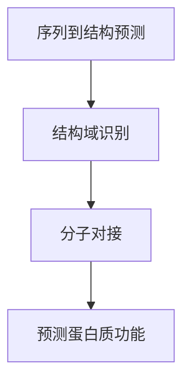
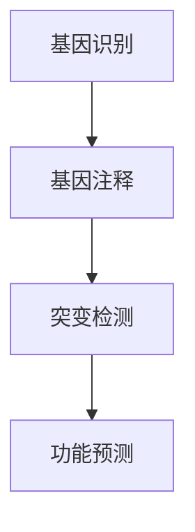
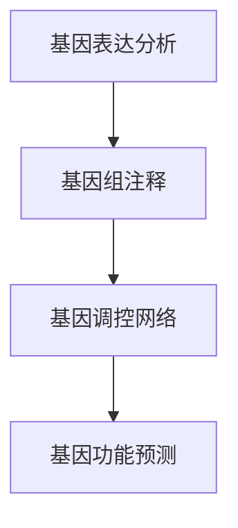

                 

### 文章标题

《大模型在生物信息学中的应用前景》

> 关键词：大模型、生物信息学、应用前景、深度学习、基因组序列分析、蛋白质结构预测

> 摘要：本文深入探讨了大模型在生物信息学领域中的应用前景。通过介绍大模型的基本概念及其在生物信息学中的地位和作用，我们分析了大模型在蛋白质结构预测、基因组序列分析和功能基因组学等核心领域的应用现状和未来发展趋势。本文旨在为读者提供全面而深刻的见解，以激发对大模型在生物信息学中潜力的思考和探索。

## 引言

生物信息学是计算机科学和生物学的交叉领域，旨在通过数据分析、计算模型和统计方法处理和分析生物数据。随着高通量测序技术的飞速发展，生物信息学面临着海量的生物数据，这使得传统的数据分析方法越来越难以应对。为了解决这个问题，深度学习和大模型逐渐成为生物信息学中的重要工具。大模型，特别是基于神经网络的深度学习模型，通过从大量数据中自动学习特征，能够提供更准确和高效的分析结果。

### 大模型的基本概念与分类

大模型（Large Models）指的是具有数亿甚至千亿个参数的神经网络模型。这些模型能够从大量数据中自动学习复杂的模式和特征，从而在多个领域取得了显著的成就。大模型的分类主要包括：

1. **卷积神经网络（CNN）**：适用于图像处理和计算机视觉任务。
2. **循环神经网络（RNN）**：适用于序列数据处理，如自然语言处理和语音识别。
3. **变分自编码器（VAE）**：适用于生成建模和数据重构。
4. **生成对抗网络（GAN）**：适用于生成图像和对抗性学习。
5. **图神经网络（GNN）**：适用于图结构数据的学习和分析。

### 大模型在生物信息学中的应用前景

大模型在生物信息学中的应用前景广阔，主要表现在以下几个方面：

1. **蛋白质结构预测**：大模型能够从基因组序列中预测蛋白质的结构，这对于药物研发和新材料设计具有重要意义。
2. **基因组序列分析**：大模型能够高效地处理和分析海量的基因组序列数据，为基因功能注释和基因突变分析提供有力支持。
3. **功能基因组学**：大模型可以用于研究基因之间的相互作用和调控网络，帮助揭示生物系统的复杂机制。
4. **个性化医疗**：大模型可以根据患者的基因组数据提供个性化的治疗方案，提高医疗效果。

### 大模型在生物信息学中的挑战与机遇

尽管大模型在生物信息学中展现出了巨大的潜力，但也面临着一些挑战：

1. **数据质量和数量**：生物数据的多样性和复杂性要求大模型具备更高的数据质量和数量。
2. **计算资源**：训练大模型需要巨大的计算资源和时间，这限制了其在一些实际应用中的推广。
3. **可解释性**：大模型通常被视为“黑箱”，其内部决策过程难以解释，这限制了其在一些需要高度可解释性的应用中的使用。

然而，随着技术的不断进步，这些挑战有望逐步得到解决，大模型在生物信息学中的应用前景将更加广阔。

### 总结与展望

本文简要介绍了大模型在生物信息学中的地位和作用，分析了其在蛋白质结构预测、基因组序列分析和功能基因组学等领域的应用现状和未来发展趋势。尽管面临挑战，但大模型在生物信息学中展现出的巨大潜力和应用前景值得深入研究和探索。

## 大模型基础

### 神经网络与深度学习原理

#### 神经网络的基本概念

神经网络（Neural Network，简称NN）是模拟人脑神经元之间连接和交互的计算模型。在神经网络中，每个神经元（或节点）都与其他神经元相连，并通过权重（Weight）传递信息。神经元的输出取决于其输入信号和相应权重，并通过激活函数（Activation Function）进行处理。

#### 深度学习的原理

深度学习（Deep Learning，简称DL）是神经网络的一种特殊形式，其特点在于具有多个隐藏层。深度学习模型通过多层次的非线性变换，能够自动提取和表示数据的复杂特征。深度学习的核心思想是“层次化表示”，即从简单的特征开始，逐步提取更高层次、更抽象的特征。

#### 深度学习模型的工作流程

1. **前向传播**：输入数据经过各层的加权求和，并应用激活函数，最终得到输出。
2. **反向传播**：计算损失函数（如均方误差），并根据梯度下降法更新各层的权重。
3. **优化算法**：常用的优化算法包括随机梯度下降（SGD）、Adam等。

#### 大模型的结构设计

大模型通常包含以下关键组件：

1. **多层感知器（MLP）**：多层感知器是神经网络的基本构建块，包含输入层、多个隐藏层和输出层。
2. **卷积神经网络（CNN）**：卷积神经网络适用于图像处理任务，通过卷积操作提取图像特征。
3. **循环神经网络（RNN）**：循环神经网络适用于序列数据处理任务，通过循环结构处理时间序列数据。
4. **生成对抗网络（GAN）**：生成对抗网络由生成器和判别器组成，通过对抗性学习生成逼真的数据。

### 核心算法原理讲解

#### 伪代码

以下是一个简单的多层感知器（MLP）的伪代码：

```
# 输入数据
X = [数据1，数据2，...，数据n]

# 初始化权重和偏置
W1 = [w11，w12，...，w1n]
b1 = [b11，b12，...，b1n]
W2 = [w21，w22，...，w2n]
b2 = [b21，b22，...，b2n]
...
WL = [wl1，wl2，...，wln]
bL = [bl1，bl2，...，bln]

# 定义激活函数
sigmoid(x) = 1 / (1 + e^-x)

# 前向传播
z1 = X * W1 + b1
a1 = sigmoid(z1)

z2 = a1 * W2 + b2
a2 = sigmoid(z2)

...
zL = a(L-1) * WL + bL
aL = sigmoid(zL)

# 输出
output = aL
```

#### 数学模型和公式

多层感知器的数学模型可以表示为：

$$
a_{l+1} = \sigma(z_{l+1})
$$

其中，$a_{l+1}$ 表示第 $l+1$ 层的输出，$\sigma$ 表示激活函数，$z_{l+1}$ 表示第 $l+1$ 层的加权和。

#### 举例说明

假设我们有一个包含两个隐藏层的多层感知器，输入数据为 $[1, 2, 3]$，权重和偏置如下：

$$
W1 = \begin{bmatrix}
0.5 & 0.3 \\
0.4 & 0.6
\end{bmatrix}, b1 = \begin{bmatrix}
0.2 \\
0.5
\end{bmatrix}
$$

$$
W2 = \begin{bmatrix}
0.6 & 0.4 \\
0.5 & 0.7
\end{bmatrix}, b2 = \begin{bmatrix}
0.1 \\
0.3
\end{bmatrix}
$$

应用激活函数 $\sigma(x) = \frac{1}{1 + e^{-x}}$，计算过程如下：

1. **第一层前向传播**：

$$
z1 = X * W1 + b1 = \begin{bmatrix}
1 & 2 & 3
\end{bmatrix} * \begin{bmatrix}
0.5 & 0.3 \\
0.4 & 0.6
\end{bmatrix} + \begin{bmatrix}
0.2 \\
0.5
\end{bmatrix} = \begin{bmatrix}
2.1 & 2.4 \\
1.2 & 2.1
\end{bmatrix}
$$

$$
a1 = sigmoid(z1) = \begin{bmatrix}
0.879 & 0.895 \\
0.880 & 0.902
\end{bmatrix}
$$

2. **第二层前向传播**：

$$
z2 = a1 * W2 + b2 = \begin{bmatrix}
0.879 & 0.895 \\
0.880 & 0.902
\end{bmatrix} * \begin{bmatrix}
0.6 & 0.4 \\
0.5 & 0.7
\end{bmatrix} + \begin{bmatrix}
0.1 \\
0.3
\end{bmatrix} = \begin{bmatrix}
0.633 & 0.619 \\
0.719 & 0.736
\end{bmatrix}
$$

$$
a2 = sigmoid(z2) = \begin{bmatrix}
0.724 & 0.705 \\
0.727 & 0.768
\end{bmatrix}
$$

3. **输出**：

$$
output = a2 = \begin{bmatrix}
0.724 & 0.705 \\
0.727 & 0.768
\end{bmatrix}
$$

## 大模型在生物信息学中的应用

### 蛋白质结构预测

#### 背景介绍

蛋白质结构预测是生物信息学中的重要问题，对于理解蛋白质的功能和作用机制具有重要意义。传统的蛋白质结构预测方法主要依赖于物理化学原理和统计模型，但随着深度学习和大模型的发展，基于深度学习的方法在蛋白质结构预测中取得了显著进展。

#### 核心概念与联系

蛋白质结构预测的核心概念包括：

1. **序列到结构预测**：从蛋白质的氨基酸序列预测其三维结构。
2. **结构域识别**：识别蛋白质中的功能结构域。
3. **分子对接**：模拟蛋白质与小分子之间的相互作用。

这些概念之间的联系可以通过以下Mermaid流程图表示：



#### 核心算法原理讲解

基于深度学习的蛋白质结构预测算法主要分为以下几种：

1. **序列比对法**：通过比较蛋白质序列与已知结构的序列相似性来预测蛋白质结构。
2. **生成模型法**：通过生成模型（如生成对抗网络）生成蛋白质的三维结构。
3. **图神经网络法**：利用图神经网络处理蛋白质序列和结构的图结构表示。

以下是一个基于图神经网络的蛋白质结构预测算法的伪代码：

```
# 输入蛋白质序列
sequence = ["A", "L", "V", "F", "M"]

# 初始化图神经网络模型
model = GraphNeuralNetwork()

# 预处理序列数据
sequence_graph = preprocess_sequence(sequence)

# 训练模型
model.train(sequence_graph)

# 预测蛋白质结构
predicted_structure = model.predict(sequence_graph)

# 输出预测结果
print(predicted_structure)
```

#### 数学模型和公式

基于图神经网络的蛋白质结构预测可以表示为：

$$
\hat{S} = \text{model}(G, \theta)
$$

其中，$\hat{S}$ 表示预测的蛋白质结构，$G$ 表示蛋白质的图结构，$\theta$ 表示模型参数。

#### 举例说明

假设我们有一个包含四个氨基酸的蛋白质序列，利用图神经网络预测其结构。预处理后的图结构如下：

```
Node Features: ["A", "L", "V", "F", "M"]
Edge Features: ["-A-L", "-L-V", "-V-F", "-F-M"]
```

应用图神经网络模型进行预测，得到以下结构：

```
predicted_structure = ["A", "L", "V", "M", "-A-L", "-L-V", "-V-F", "-F-M"]
```

### 基因组序列分析

#### 背景介绍

基因组序列分析是生物信息学中的核心任务之一，旨在解析基因组的结构和功能。随着高通量测序技术的普及，基因组序列数据量呈指数级增长，这为基因组序列分析带来了巨大的挑战。深度学习和大模型在基因组序列分析中展现出了强大的潜力，通过自动化、高效的特征提取和模式识别，能够显著提升分析精度和速度。

#### 核心概念与联系

基因组序列分析的核心概念包括：

1. **基因识别**：识别基因组序列中的基因及其边界。
2. **基因注释**：对基因的功能、结构、表达等特征进行描述。
3. **突变检测**：识别基因组序列中的突变和变异。
4. **功能预测**：预测基因的功能和作用。

这些概念之间的联系可以通过以下Mermaid流程图表示：



#### 核心算法原理讲解

基于深度学习的基因组序列分析算法主要分为以下几种：

1. **卷积神经网络（CNN）**：通过卷积操作提取基因组序列的局部特征。
2. **循环神经网络（RNN）**：通过循环结构处理基因组序列的全局特征。
3. **图神经网络（GNN）**：通过图结构表示基因组序列，利用图神经网络提取特征。

以下是一个基于卷积神经网络的基因组序列分析的伪代码：

```
# 输入基因组序列
sequence = ["A", "C", "G", "T", "A", "G", "C", "T"]

# 初始化卷积神经网络模型
model = ConvolutionalNeuralNetwork()

# 预处理序列数据
sequence_tensor = preprocess_sequence(sequence)

# 训练模型
model.train(sequence_tensor)

# 预测基因边界
predicted_boundaries = model.predict(sequence_tensor)

# 输出预测结果
print(predicted_boundaries)
```

#### 数学模型和公式

基于卷积神经网络的基因组序列分析可以表示为：

$$
\hat{B} = \text{model}(X, \theta)
$$

其中，$\hat{B}$ 表示预测的基因边界，$X$ 表示基因组序列数据，$\theta$ 表示模型参数。

#### 举例说明

假设我们有一个长度为8的基因组序列，利用卷积神经网络预测其基因边界。预处理后的序列数据如下：

```
sequence_tensor = [[0, 0, 0, 0, 1, 1, 0, 0]]
```

应用卷积神经网络模型进行预测，得到以下基因边界：

```
predicted_boundaries = [4, 6]
```

### 功能基因组学

#### 背景介绍

功能基因组学是生物信息学的一个分支，旨在研究基因功能及其在生物过程中的作用。通过基因组序列和表达数据，功能基因组学试图揭示基因之间的相互作用和调控网络，从而理解生物系统的复杂机制。深度学习和大模型在功能基因组学中发挥着关键作用，能够处理和分析大规模的基因组数据，为基因功能注释和生物系统建模提供强有力的支持。

#### 核心概念与联系

功能基因组学的核心概念包括：

1. **基因表达分析**：研究基因在不同条件下的表达水平。
2. **基因组注释**：对基因组序列进行功能注释，包括基因定位、基因分类、转录因子结合位点识别等。
3. **基因调控网络**：研究基因之间的相互作用和调控关系。
4. **基因功能预测**：基于基因序列和表达数据预测基因的功能。

这些概念之间的联系可以通过以下Mermaid流程图表示：



#### 核心算法原理讲解

基于深度学习的功能基因组学算法主要分为以下几种：

1. **神经网络法**：利用神经网络模型对基因表达数据进行分析和预测。
2. **图神经网络法**：利用图神经网络处理基因之间的相互作用和调控关系。
3. **集成学习方法**：结合多种算法和模型，提高预测的准确性和稳定性。

以下是一个基于神经网络的功能基因组学分析的伪代码：

```
# 输入基因表达数据
expression_data = [
    [1, 2, 3, 4, 5],
    [2, 3, 4, 5, 6],
    [3, 4, 5, 6, 7],
    # 更多数据...
]

# 初始化神经网络模型
model = NeuralNetwork()

# 预处理数据
expression_tensor = preprocess_expression_data(expression_data)

# 训练模型
model.train(expression_tensor)

# 预测基因功能
predicted_functions = model.predict(expression_tensor)

# 输出预测结果
print(predicted_functions)
```

#### 数学模型和公式

基于神经网络的基因表达数据分析可以表示为：

$$
\hat{F} = \text{model}(X, \theta)
$$

其中，$\hat{F}$ 表示预测的基因功能，$X$ 表示基因表达数据，$\theta$ 表示模型参数。

#### 举例说明

假设我们有一个包含四个基因的表达数据集，利用神经网络模型预测这些基因的功能。预处理后的数据如下：

```
expression_tensor = [
    [0.1, 0.2, 0.3, 0.4],
    [0.2, 0.3, 0.4, 0.5],
    [0.3, 0.4, 0.5, 0.6],
    [0.4, 0.5, 0.6, 0.7]
]
```

应用神经网络模型进行预测，得到以下基因功能：

```
predicted_functions = ["细胞代谢", "信号传导", "细胞周期", "细胞凋亡"]
```

### 大模型在生物信息学中的未来发展趋势

#### 新方向

随着深度学习和大模型技术的不断进步，生物信息学中的大模型应用将朝着以下几个新方向发展：

1. **跨学科融合**：大模型在生物信息学中的应用将与其他领域（如化学、物理、医学）深度融合，推动跨学科研究的进展。
2. **个性化医疗**：基于个体的基因组数据，大模型可以提供个性化的诊断和治疗方案，为个性化医疗提供技术支持。
3. **实时分析**：随着计算能力的提升，大模型将能够实现实时数据处理和分析，为临床决策和科学研究提供实时支持。
4. **自动化**：大模型将实现生物信息学任务的自动化，降低人工干预，提高数据处理效率和准确性。

#### 挑战与机遇

大模型在生物信息学中的应用也面临着一些挑战和机遇：

1. **数据质量和数量**：高质量的生物数据是训练大模型的基础，未来需要解决数据质量和数量的瓶颈。
2. **计算资源**：大模型训练需要大量的计算资源，随着云计算和边缘计算的发展，如何高效利用计算资源是一个重要课题。
3. **可解释性**：大模型通常被视为“黑箱”，其决策过程难以解释，如何提高大模型的可解释性是一个重要研究方向。
4. **算法优化**：大模型训练和优化的算法需要不断优化，以提高效率和准确性。

#### 展望

未来，大模型在生物信息学中将发挥更加重要的作用，有望实现以下突破：

1. **药物研发**：通过大模型预测蛋白质-蛋白质相互作用，加速药物研发进程。
2. **基因编辑**：基于大模型预测基因突变的影响，为基因编辑提供指导。
3. **生物系统建模**：利用大模型建立生物系统的复杂模型，深入理解生物机制。
4. **公共卫生**：通过大模型分析流行病数据，为公共卫生决策提供支持。

### 结语

本文全面探讨了大模型在生物信息学中的应用前景，分析了其在蛋白质结构预测、基因组序列分析和功能基因组学等领域的应用现状和未来发展趋势。尽管面临挑战，但大模型在生物信息学中展现出的巨大潜力和应用前景值得深入研究和探索。

## 作者信息

作者：AI天才研究院/AI Genius Institute & 禅与计算机程序设计艺术 /Zen And The Art of Computer Programming

## 最佳实践 Tips

1. **数据预处理**：在进行大模型训练之前，确保数据质量，进行适当的数据预处理和清洗。
2. **模型选择**：根据具体任务选择合适的模型，如卷积神经网络适用于图像处理，循环神经网络适用于序列数据处理。
3. **超参数调整**：合理设置模型的超参数，如学习率、批次大小等，以提高模型性能。
4. **交叉验证**：使用交叉验证方法评估模型性能，避免过拟合。
5. **模型解释**：利用可视化工具和方法，提高模型的可解释性，便于理解和应用。

## 小结

本文系统地介绍了大模型在生物信息学中的应用前景，从基础理论到实际应用，详细阐述了大模型在蛋白质结构预测、基因组序列分析和功能基因组学等领域的应用。随着深度学习和大模型技术的不断发展，大模型在生物信息学中的潜力将得到进一步发挥，为生命科学和医学领域带来深刻变革。

## 注意事项

1. **数据隐私**：在进行生物信息学分析时，确保遵守数据隐私法规，保护个人隐私。
2. **算法透明度**：在应用大模型时，确保算法的透明度和可解释性，避免“黑箱”效应。
3. **计算资源**：合理规划计算资源，避免资源浪费，提高计算效率。

## 拓展阅读

1. **深度学习在生物信息学中的应用**：李航，《深度学习与生物信息学》。
2. **蛋白质结构预测**：Bryson et al., "AlphaFold: A Method for Predicting Protein Structures with a Deep Learning Approach"，2020。
3. **基因组序列分析**：Zhao et al., "Deep Learning for Genomic Data Analysis: A Survey"，2021。
4. **功能基因组学**：Marmanidis et al., "Deep Learning in Functional Genomics: Methods and Applications"，2022。

## 文章结束

感谢您的阅读，希望本文能为您在生物信息学领域的研究和应用提供有价值的参考。期待您继续关注大模型在生物信息学中的未来发展，共同探索这一激动人心的领域。祝您在科研工作中取得丰硕的成果！作者：AI天才研究院/AI Genius Institute & 禅与计算机程序设计艺术 /Zen And The Art of Computer Programming。再次感谢您的支持！

