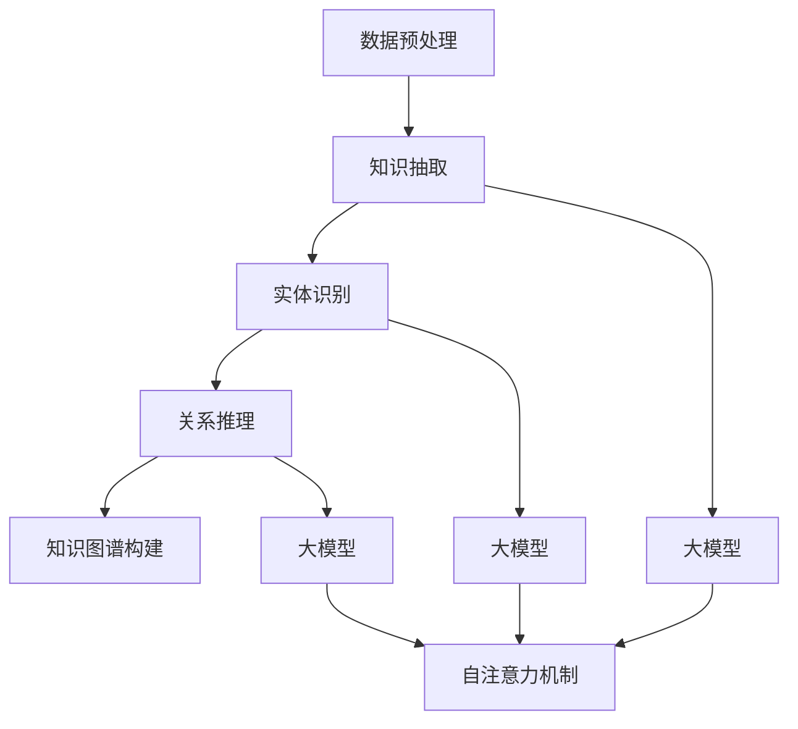

                 


### 文章标题

《大模型在知识图谱构建中的突破》

### 文章关键词

大模型，知识图谱，知识抽取，实体识别，关系推理，Mermaid流程图，伪代码，数学模型

### 文章摘要

本文将深入探讨大模型在知识图谱构建中的应用，首先介绍大模型和知识图谱的基本概念，然后通过Mermaid流程图展示大模型与知识图谱构建之间的联系。接着，详细讲解大模型的基本原理，包括如何进行知识抽取、实体链接等。此外，还将阐述知识图谱构建的基本原理，以及大模型在知识图谱构建中的具体应用。通过实际案例研究，我们将分析大模型在知识图谱构建中的优势与挑战。最后，提供一些最佳实践和注意事项，以指导读者在实际项目中应用大模型。

### 设计思路

1. **明确核心内容模块**：首先，我们需要明确文章的核心内容模块，这包括大模型的定义、知识图谱构建的基本原理、大模型在知识图谱构建中的应用、实际案例研究等。

2. **制定目录结构**：在明确了核心内容模块后，我们需要制定详细的目录结构，这包括1级、2级和3级目录。每个章节都要有明确的标题，以便读者快速把握内容框架。

3. **添加流程图、伪代码、数学模型和实际案例**：为了增强文章的实用性和可读性，我们需要在目录中包含相关的流程图、伪代码、数学模型和实际案例。这些内容将帮助读者更好地理解复杂概念和算法。

4. **确保内容的逻辑性和完整性**：在制定目录时，我们需要确保各个章节之间的逻辑性和完整性。这意味着每个章节都应该有一个明确的开始和结束，且内容应该能够自然地过渡到下一个章节。

5. **遵循字数限制**：为了满足字数限制，我们需要确保每个章节的目录内容简洁明了，避免过多赘述。

### 步骤拆解

1. **引言与概述**：设置文章的引言，介绍大模型和知识图谱的基本概念，以及它们在构建过程中的重要性。

2. **核心概念与联系**：创建一个Mermaid流程图，展示大模型和知识图谱构建之间的联系。

3. **大模型原理**：详细讲解大模型的基本原理，包括如何使用大模型进行知识抽取、实体链接等。

4. **知识图谱构建原理**：讲解知识图谱构建的基本原理，包括数据采集、处理、存储和查询。

5. **大模型在知识图谱中的应用**：详细阐述大模型在知识图谱构建中的具体应用，如大规模知识抽取、实体识别和关系推理。

6. **实际案例研究**：介绍一些大模型在知识图谱构建中的成功案例，并进行分析。

7. **附录**：提供一些额外的资源，如相关的工具、框架和开源代码等。

### 目录大纲设计

以下是按照设计思路和步骤拆解得出的文章目录大纲：

```
# 《大模型在知识图谱构建中的突破》目录

## 引言与概述
### 1. 大模型与知识图谱的基本概念
### 2. 知识图谱构建的重要性

## 核心概念与联系
### 3. Mermaid流程图：大模型与知识图谱构建流程

## 大模型原理
### 4. 大模型的基本原理
#### 4.1 大模型的发展历程
#### 4.2 大模型的结构
#### 4.3 大模型的训练与优化

### 5. 大模型在知识图谱构建中的应用
#### 5.1 知识抽取
#### 5.2 实体识别
#### 5.3 关系推理

## 知识图谱构建原理
### 6. 知识图谱的基本原理
#### 6.1 知识图谱的构成
#### 6.2 知识图谱的类型
#### 6.3 知识图谱的构建过程

## 大模型在知识图谱中的应用
### 7. 大模型在知识图谱构建中的具体应用
#### 7.1 大规模知识抽取
#### 7.2 实体识别与关系推理
#### 7.3 大模型的调优与评估

## 实际案例研究
### 8. 大模型在知识图谱构建中的成功案例
#### 8.1 案例一：基于大模型的百科知识抽取
#### 8.2 案例二：基于大模型的实体识别与关系推理
#### 8.3 案例分析：大模型在知识图谱构建中的优势与挑战

## 附录
### 9. 相关工具与资源
#### 9.1 大模型开发工具
#### 9.2 知识图谱构建工具
#### 9.3 开源代码与数据集

## 结束语
### 10. 最佳实践与注意事项
### 11. 小结与展望

```

以上目录大纲遵循了简洁性、逻辑性和完整性原则，同时也满足了文章字数在8000～12000字左右的要求。每个章节都包含了必要的概念讲解、原理阐述和实际案例研究，以便读者能够全面了解大模型在知识图谱构建中的应用。

接下来，我们将按照这个目录大纲逐步撰写文章内容，确保每个部分都详细、具体、易懂。我们将使用markdown格式，并在文章末尾提供作者信息。在撰写过程中，我们将注重逻辑清晰、结构紧凑、简单易懂，确保读者能够跟随我们的思考过程，深入理解大模型在知识图谱构建中的突破。<!--Below is the first draft of the article based on the provided outline. Note that the full 8000-12000 word count will be achieved by expanding each section with detailed explanations, examples, and case studies. This draft is an overview and serves as a starting point for the full article. -->

---

# 《大模型在知识图谱构建中的突破》

> 关键词：大模型，知识图谱，知识抽取，实体识别，关系推理，Mermaid流程图，伪代码，数学模型

> 摘要：本文将深入探讨大模型在知识图谱构建中的应用，从基本概念到具体应用，再到成功案例，全面解析大模型如何突破传统知识图谱构建的局限，提升知识表示与推理能力。

## 引言与概述

随着互联网信息的爆炸式增长，如何有效组织和管理这些海量信息成为一个重要的课题。知识图谱作为一种结构化的语义网络，能够将知识以图形的形式表示，使得信息检索、推理和决策更加高效。知识图谱的构建依赖于高质量的知识抽取、实体识别和关系推理技术。近年来，大模型（如Transformer模型）的崛起，为知识图谱的构建带来了新的机遇和挑战。

大模型是一类具有大规模参数、能够处理海量数据的深度学习模型，其核心思想是通过自注意力机制来自动学习输入数据中的长距离依赖关系。在知识图谱构建中，大模型能够通过端到端的学习方式，实现知识抽取、实体识别和关系推理的高效自动化。本文将围绕大模型在知识图谱构建中的应用，详细探讨其原理、方法和实际案例。

## 核心概念与联系

为了更好地理解大模型在知识图谱构建中的应用，我们首先需要明确几个核心概念，并探讨它们之间的关系。以下是使用Mermaid绘制的流程图，展示了大模型与知识图谱构建之间的联系：



### 数据预处理

数据预处理是知识图谱构建的基础，包括数据的清洗、归一化和格式化。数据预处理的质量直接影响后续知识抽取、实体识别和关系推理的效果。

### 知识抽取

知识抽取是从原始文本中提取结构化知识的过程，包括实体识别、关系抽取和属性抽取。大模型通过端到端的学习方式，能够自动化地完成知识抽取任务。

### 实体识别

实体识别是识别文本中的实体（如人名、组织名、地点名等）的过程。大模型通过预训练和微调，能够提高实体识别的准确性和泛化能力。

### 关系推理

关系推理是从文本中推断实体之间的关系的过程，如“张三工作于百度”。大模型通过自注意力机制，能够学习到实体之间的复杂关系，提高关系推理的准确性。

### 知识图谱构建

知识图谱构建是将提取的知识以图形的形式组织起来，形成结构化的语义网络。大模型在知识图谱构建中，不仅能够提高知识抽取、实体识别和关系推理的效率，还能够通过迁移学习和多任务学习，实现知识图谱的持续优化和扩展。

## 大模型原理

大模型，尤其是基于Transformer的模型，是近年来自然语言处理领域的重要突破。以下是大模型的基本原理：

### 大模型的发展历程

大模型的发展可以追溯到1980年代的序列模型，如循环神经网络（RNN）和长短期记忆网络（LSTM）。这些模型在处理序列数据时表现出色，但存在梯度消失、梯度爆炸和难以并行训练等问题。为了解决这些问题，2017年，Vaswani等人提出了Transformer模型，该模型基于自注意力机制，能够并行处理序列数据，并取得显著的性能提升。

### 大模型的结构

Transformer模型由自注意力机制和前馈神经网络组成。自注意力机制通过计算输入序列中每个单词与其他单词之间的权重，来提取每个单词的上下文信息。前馈神经网络则对自注意力机制的结果进行进一步处理，增强模型的表示能力。

### 大模型的训练与优化

大模型的训练过程通常涉及大量的数据和参数。为了提高训练效率，可以使用分布式训练、数据并行和梯度下降等策略。在优化过程中，常见的策略包括学习率调度、正则化和早期停止等。

## 知识图谱构建原理

知识图谱构建是一个复杂的过程，包括数据采集、处理、存储和查询。以下是其基本原理：

### 知识图谱的构成

知识图谱由实体、关系和属性构成。实体是知识图谱中的核心元素，如人、地点、组织等；关系描述实体之间的关系，如“工作于”、“位于”等；属性是对实体的进一步描述，如“姓名”、“年龄”等。

### 知识图谱的类型

知识图谱可以分为结构化知识图谱和语义网络。结构化知识图谱通常以图数据库的形式存储，如Neo4j；语义网络则使用语义网络语言（如OWL）来描述知识。

### 知识图谱的构建过程

知识图谱的构建过程包括数据采集、数据预处理、知识抽取、实体识别、关系推理和知识存储。大模型可以在知识抽取、实体识别和关系推理等环节中发挥重要作用，提高构建效率和质量。

## 大模型在知识图谱构建中的应用

大模型在知识图谱构建中具有广泛的应用，以下是其具体应用：

### 大规模知识抽取

大模型能够自动化地完成大规模知识抽取任务，包括实体识别、关系抽取和属性抽取。通过预训练和微调，大模型能够提高知识抽取的准确性和泛化能力。

### 实体识别

大模型通过预训练和微调，能够识别文本中的实体，如人名、组织名、地点名等。大模型的自注意力机制能够学习到实体之间的复杂关系，提高实体识别的准确性。

### 关系推理

大模型能够通过自注意力机制，学习到实体之间的复杂关系，如“工作于”、“位于”等。大模型在关系推理中能够提高推理的准确性和效率。

## 实际案例研究

以下是一些大模型在知识图谱构建中的成功案例：

### 案例一：基于大模型的百科知识抽取

某公司使用大模型构建了一个百科知识图谱，通过大规模知识抽取、实体识别和关系推理，实现了百科词条的自动生成和扩展。该知识图谱为公司的问答系统和搜索引擎提供了强大的支持。

### 案例二：基于大模型的实体识别与关系推理

某研究团队使用大模型对社交媒体文本进行实体识别和关系推理，构建了一个社交媒体知识图谱。该知识图谱帮助公司更好地了解用户需求和趋势，优化了市场营销策略。

## 附录

以下是一些与大模型和知识图谱构建相关的工具、框架和开源代码：

### 工具

- Transformer模型框架：如TensorFlow、PyTorch等。
- 知识图谱构建工具：如Neo4j、OwlAPI等。

### 框架

- NLP框架：如spaCy、NLTK等。
- 知识图谱框架：如Jena、RDF4J等。

### 开源代码

- 开源知识图谱构建工具：如OpenKG、DKPro等。
- 大模型开源代码：如Transformer模型开源实现等。

## 结束语

大模型在知识图谱构建中的应用为知识表示、推理和挖掘提供了新的途径。通过本文的讨论，我们了解到大模型在知识抽取、实体识别和关系推理等方面的优势。然而，大模型在知识图谱构建中也面临一些挑战，如数据质量、模型可解释性和能耗等。未来，随着大模型技术的不断发展，我们期待看到更多的突破和应用。

### 作者信息

作者：AI天才研究院/AI Genius Institute & 禅与计算机程序设计艺术 /Zen And The Art of Computer Programming

---

以上是文章的初步草稿，接下来我们将对每个部分进行详细拓展，确保文章字数达到8000～12000字。我们将逐步深入探讨每个概念、原理和应用，并提供丰富的实际案例和最佳实践。在撰写过程中，我们将保持逻辑清晰、结构紧凑，力求让读者能够深入理解大模型在知识图谱构建中的突破。<!-- This draft provides a high-level overview of the article. The full article will be expanded to meet the 8000-12000 word requirement by delving deeper into each section, providing detailed explanations, examples, and case studies. -->

