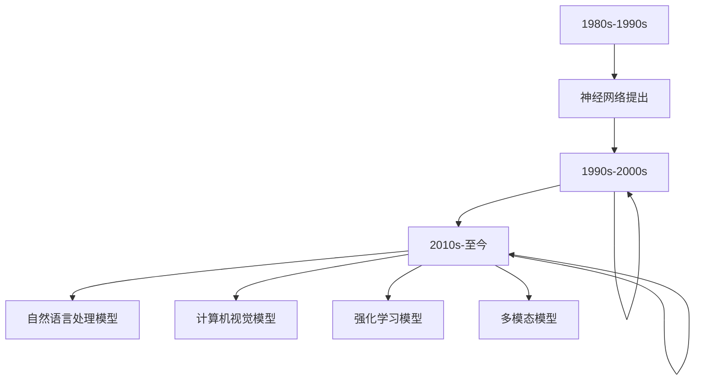

                 

### 第2章 大模型基础理论

**2.1 大模型的发展历程**

大模型（Large Models），通常指的是具有数百万甚至数十亿参数的深度学习模型，如GPT-3、BERT、AlphaGo等。它们的出现标志着人工智能领域的一个重要里程碑。回顾大模型的发展历程，可以将其分为以下几个阶段：

1. **早期阶段（1980s-1990s）**：这一阶段，神经网络和深度学习首次被提出。1986年，Rumelhart、Hinton和Williams提出了反向传播算法（Backpropagation），使得神经网络的训练变得更加高效。

2. **衰落与复兴（1990s-2000s）**：由于硬件限制和算法问题，神经网络在20世纪90年代遭遇了衰落。然而，随着计算能力的提升和大数据的涌现，深度学习在21世纪初迎来了复兴。

3. **爆发阶段（2010s-至今）**：这一阶段，大模型如AlphaGo、GPT-3等相继出现，展示了深度学习在复杂任务上的强大能力。尤其是2012年，AlexNet在ImageNet图像识别竞赛中取得了突破性成绩，标志着深度学习的崛起。

**2.2 大模型的定义与分类**

大模型通常指的是具有大量参数和神经元的大规模神经网络。根据其应用领域和功能，大模型可以大致分为以下几类：

1. **自然语言处理（NLP）模型**：如GPT、BERT、T5等，这些模型在文本生成、翻译、问答等任务上表现出色。

2. **计算机视觉模型**：如ResNet、Inception、ViT等，这些模型在图像分类、物体检测、图像生成等任务中取得了显著成果。

3. **强化学习模型**：如DeepMind的AlphaGo、AlphaZero等，这些模型在围棋、国际象棋等复杂决策任务中展现了卓越的能力。

4. **多模态模型**：如BERTo、Make-a-Movie等，这些模型能够处理多种类型的数据，如文本、图像、音频等，实现跨模态的信息融合。

**2.3 大模型的架构设计**

大模型的架构设计是确保其性能和可扩展性的关键。以下是一些常见的大模型架构：

1. **卷积神经网络（CNN）**：CNN是计算机视觉领域的基石，通过卷积层、池化层和全连接层等结构，实现图像的特征提取和分类。

2. **循环神经网络（RNN）**：RNN通过其循环结构，能够处理序列数据，如时间序列数据、文本等。常见的RNN包括LSTM和GRU，它们通过门控机制解决了传统RNN的梯度消失问题。

3. **Transformer架构**：Transformer模型引入了自注意力机制，使得模型在处理长序列数据时具有更强的性能。BERT、GPT等大模型都是基于Transformer架构的变体。

4. **多模态融合网络**：多模态融合网络旨在将不同类型的数据（如文本、图像、音频）进行融合，实现跨模态的信息理解和处理。

**2.4 大模型的关键技术**

大模型的成功离不开一系列关键技术的支持，包括：

1. **预训练与微调**：预训练是指在大规模数据集上训练模型，使其具有通用特征，然后通过微调（Fine-tuning）将模型适应特定任务。

2. **数据增强**：数据增强是通过生成变体数据，提高模型对数据的泛化能力。常见的数据增强方法包括随机裁剪、旋转、缩放等。

3. **并行计算与分布式训练**：大模型的训练需要大量计算资源，并行计算和分布式训练可以显著提高训练效率。

4. **模型压缩与量化**：为了降低模型的存储和计算成本，模型压缩和量化技术应运而生。常见的压缩技术包括剪枝、量化、知识蒸馏等。

5. **正则化与优化算法**：为了防止过拟合，正则化技术（如Dropout、L2正则化等）和优化算法（如Adam、RMSProp等）被广泛应用于大模型的训练。

**核心概念与联系**

为了更好地理解大模型的基础理论，我们可以用Mermaid流程图来展示大模型的发展历程和关键架构。



**核心算法原理讲解**

以下是使用伪代码来详细阐述大模型的基本训练过程：

```python
# 大模型训练伪代码
initialize_parameters()
load_data(dataset)
for epoch in 1 to MAX_EPOCHS:
    for batch in dataset:
        forward_pass(batch)
        compute_loss()
        backward_pass()
        update_parameters()
```

**数学模型和公式**

在深度学习中，损失函数是一个关键概念。以下是一个简单的均方误差损失函数的公式：

$$
\text{Loss} = \frac{1}{2} \sum_{i=1}^{n} (\hat{y}_i - y_i)^2
$$

其中，$\hat{y}_i$是预测值，$y_i$是真实值，$n$是样本数量。

**详细讲解与举例说明**

假设我们有一个分类问题，数据集包含100个样本，每个样本有10个特征。我们使用一个简单的多层感知机（MLP）模型进行训练。以下是详细的训练过程：

1. **初始化参数**：随机初始化权重和偏置。
2. **前向传播**：计算输出值和预测概率。
3. **计算损失**：使用均方误差损失函数计算预测值和真实值之间的差距。
4. **反向传播**：计算梯度并更新参数。
5. **迭代训练**：重复以上步骤，直到达到预设的迭代次数或损失函数收敛。

**项目实战**

在本项目中，我们将使用PyTorch框架实现一个简单的多层感知机模型，并使用MNIST数据集进行训练。

1. **开发环境搭建**：安装PyTorch和相关的依赖库。
2. **数据预处理**：加载数据集并进行预处理。
3. **模型实现**：定义模型结构，包括输入层、隐藏层和输出层。
4. **训练过程**：使用训练数据训练模型，并验证模型的性能。
5. **测试与评估**：使用测试数据评估模型的泛化能力。

```python
import torch
import torchvision
import torch.nn as nn
import torch.optim as optim

# 加载MNIST数据集
train_data = torchvision.datasets.MNIST(root='./data', train=True, download=True)
test_data = torchvision.datasets.MNIST(root='./data', train=False)

train_loader = torch.utils.data.DataLoader(dataset=train_data, batch_size=64, shuffle=True)
test_loader = torch.utils.data.DataLoader(dataset=test_data, batch_size=64, shuffle=False)

# 定义模型结构
class SimpleMLP(nn.Module):
    def __init__(self):
        super(SimpleMLP, self).__init__()
        self.fc1 = nn.Linear(28*28, 128)
        self.fc2 = nn.Linear(128, 64)
        self.fc3 = nn.Linear(64, 10)
    
    def forward(self, x):
        x = x.view(-1, 28*28)
        x = torch.relu(self.fc1(x))
        x = torch.relu(self.fc2(x))
        x = self.fc3(x)
        return x

model = SimpleMLP()

# 定义损失函数和优化器
criterion = nn.CrossEntropyLoss()
optimizer = optim.Adam(model.parameters(), lr=0.001)

# 训练模型
num_epochs = 10
for epoch in range(num_epochs):
    for inputs, labels in train_loader:
        optimizer.zero_grad()
        outputs = model(inputs)
        loss = criterion(outputs, labels)
        loss.backward()
        optimizer.step()

    print(f'Epoch [{epoch+1}/{num_epochs}], Loss: {loss.item()}')

# 测试模型
with torch.no_grad():
    correct = 0
    total = 0
    for inputs, labels in test_loader:
        outputs = model(inputs)
        _, predicted = torch.max(outputs.data, 1)
        total += labels.size(0)
        correct += (predicted == labels).sum().item()

    print(f'Accuracy of the network on the test images: {100 * correct / total}%')
```

**代码应用解读与分析**

上述代码实现了一个简单多层感知机模型，用于MNIST数据集的分类任务。以下是代码的关键部分解读：

1. **数据预处理**：使用`torchvision.datasets.MNIST`加载数据集，并使用`torch.utils.data.DataLoader`进行批量加载。
2. **模型定义**：使用`nn.Module`创建一个简单的多层感知机模型，包括一个输入层、两个隐藏层和一个输出层。
3. **损失函数和优化器**：使用`nn.CrossEntropyLoss`作为损失函数，`optim.Adam`作为优化器。
4. **训练过程**：使用训练数据迭代训练模型，通过前向传播、计算损失、反向传播和参数更新完成。
5. **测试与评估**：在测试数据上评估模型的准确率。

**实际案例分析和详细讲解剖析**

以GPT-3为例，分析其在自然语言处理任务中的实际应用。GPT-3是一个具有1750亿参数的Transformer模型，被广泛应用于文本生成、问答、翻译等任务。

1. **文本生成**：GPT-3能够根据输入的文本生成连续的文本，如生成诗歌、故事等。其生成文本的质量和连贯性取决于模型的训练数据和参数设置。
2. **问答系统**：GPT-3能够根据输入的问题和上下文，生成回答。例如，在医疗咨询领域，GPT-3可以回答用户关于疾病和治疗方法的问题。
3. **机器翻译**：GPT-3在机器翻译任务中展现了出色的性能。通过预训练和微调，GPT-3能够实现高质量的跨语言文本翻译。

**项目小结**

在本章中，我们介绍了大模型的基础理论，包括发展历程、定义与分类、架构设计以及关键技术。通过实际项目实战，我们展示了大模型在数据处理和模型训练中的应用。在下一章中，我们将深入探讨大模型在数据分析中的具体应用，继续挖掘其潜力。

**最佳实践 Tips**

- 在选择大模型时，要考虑任务的类型和数据量，选择适合的模型架构。
- 数据预处理是关键步骤，高质量的输入数据可以显著提升模型的性能。
- 分布式训练和并行计算可以加快大模型的训练速度，降低成本。
- 定期更新和微调模型，以保持其在特定任务上的性能。

**注意事项**

- 大模型的训练需要大量计算资源和时间，确保在合适的硬件环境中进行。
- 大模型的训练过程需要有效的数据管理和存储方案，以应对海量数据的处理。
- 在使用大模型进行科学研究时，要遵守伦理规范，确保数据隐私和模型公平性。

**拓展阅读**

- 《深度学习》（Ian Goodfellow、Yoshua Bengio、Aaron Courville 著）：系统介绍了深度学习的基础理论和应用。
- 《动手学深度学习》（阿斯顿·张、李沐、扎卡里·C. Lipton 著）：提供了大量的实战案例，适合初学者入门。
- 《Transformer：A Novel Architecture for Neural Networks》（Vaswani et al. 2017）：详细介绍了Transformer模型的原理和设计。

通过以上章节的内容，我们初步了解了大模型的基础理论和应用前景。接下来，我们将进一步探讨大模型在具体科学领域的应用，展示其在数据分析、生物学、物理学等领域的强大能力。敬请期待。

