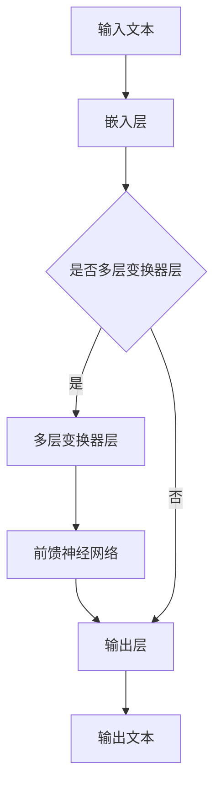

                 

### 文章标题：大模型在自动摘要中的创新应用

### 关键词：
- 自动摘要
- 大模型
- 机器学习
- 自然语言处理
- 人工智能

### 摘要：
本文将深入探讨大模型在自动摘要领域的创新应用。首先，我们将介绍大模型的基础知识，包括其原理、结构和工作机制。接着，我们会对自动摘要技术进行详尽的讲解，并探讨大模型如何优化这一技术。文章还将通过具体的实践案例展示大模型在自动摘要中的应用，并提供开发环境搭建、代码实现和解读的详细步骤。最后，我们将对未来的研究方向和挑战进行展望，并给出相关最佳实践和拓展阅读建议。本文旨在为读者提供全面的自动摘要和大模型技术指南，帮助读者更好地理解和应用这些前沿技术。

### 引言与概述

#### 1.1 自动摘要技术的发展历程

自动摘要技术的历史可以追溯到20世纪60年代。当时，研究人员开始尝试使用计算机算法自动生成文档的摘要。早期的自动摘要方法主要基于关键词提取和统计分析，这些方法简单但效率低下，生成的摘要往往不够准确和连贯。随着自然语言处理（NLP）和机器学习（ML）技术的发展，自动摘要技术逐渐走向成熟。

20世纪80年代，基于统计语言模型的方法开始兴起。这些方法通过统计文本中词语的共现关系来生成摘要。然而，由于统计模型的局限性，生成的摘要仍然存在信息丢失和连贯性不足的问题。

进入21世纪，深度学习技术的出现为自动摘要带来了新的希望。深度学习模型，特别是基于变换器（Transformer）架构的大模型，如BERT、GPT等，能够通过大规模的预训练和微调，自动捕捉语言中的复杂结构，从而生成更加准确和连贯的摘要。

#### 1.2 大模型在自动摘要中的优势

大模型在自动摘要中的优势主要体现在以下几个方面：

1. **强大的表示能力**：大模型能够通过大规模的预训练，学习到丰富的语言知识，从而对文本进行更精准的表示。这使得自动摘要生成的摘要在信息完整性、连贯性和可读性上都有显著提升。

2. **自适应的生成能力**：大模型能够根据不同的输入文本，自适应地生成相应的摘要。这使得自动摘要技术能够适应不同的文本类型和领域，提高其通用性和实用性。

3. **灵活的扩展性**：大模型可以通过微调来适应特定的任务和场景。例如，在新闻摘要、学术摘要和会议摘要等不同场景中，大模型都可以通过适当的微调来生成高质量的摘要。

4. **高效的计算性能**：随着硬件技术的发展，如GPU和TPU等高性能计算设备的普及，大模型的计算性能得到了显著提升。这使得大模型的应用变得更加高效和可行。

#### 1.3 自动摘要应用领域的拓展

自动摘要技术已经广泛应用于多个领域：

1. **新闻与媒体**：自动摘要技术被广泛应用于新闻网站的标题生成和内容概括，提高了新闻的传播效率和用户阅读体验。

2. **学术研究**：自动摘要技术可以帮助学者快速了解大量研究论文的关键内容，提高科研效率。

3. **企业信息管理**：企业可以通过自动摘要技术对大量文档进行快速归纳和总结，优化信息管理流程。

4. **教育**：自动摘要技术可以帮助学生快速掌握课程内容的核心要点，提高学习效率。

5. **政府公共服务**：自动摘要技术可以用于政府文件的摘要和总结，提高政府工作效率，方便公众获取信息。

#### 1.4 书籍结构概述

本书将分为以下几个主要部分：

1. **引言与概述**：介绍自动摘要技术的发展历程、大模型的优势及其在自动摘要中的应用领域。

2. **大模型基础知识**：讲解大模型的基本原理、结构和工作机制。

3. **自动摘要技术**：详细讨论自动摘要算法的原理、实现方法和优化策略。

4. **创新应用案例**：展示大模型在自动摘要领域的实际应用案例。

5. **实践指导**：提供自动摘要系统的开发、训练和优化指南。

6. **总结与展望**：总结自动摘要技术的发展趋势和未来研究方向。

#### 1.5 阅读目标与读者定位

本书的目标是帮助读者深入理解大模型在自动摘要中的应用，掌握相关技术和实践方法。本书适合以下读者群体：

1. **计算机科学和人工智能专业的学生和研究人员**：通过本书，读者可以了解大模型和自动摘要的基本概念和应用，为后续深入研究打下基础。

2. **软件开发工程师和AI开发者**：本书提供了详细的自动摘要技术指南，帮助读者将大模型应用于实际项目中。

3. **企业和政府部门的信息管理人员**：本书提供了自动摘要系统的开发、训练和优化指南，帮助读者提高信息管理效率。

4. **对自动摘要技术感兴趣的其他专业人士**：本书提供了全面的技术解析和应用案例，满足读者对自动摘要技术的了解需求。

#### 1.6 学习方法与建议

为了更好地阅读本书，读者可以采取以下学习方法：

1. **逐步学习**：按照书的结构逐步阅读，从基础概念到高级应用，系统学习大模型和自动摘要技术。

2. **动手实践**：阅读过程中，可以尝试复现书中的案例，加深对理论知识的理解。

3. **讨论交流**：加入相关的学术论坛或社区，与其他读者讨论和交流心得体会。

4. **持续学习**：自动摘要和大模型技术是快速发展的领域，读者需要持续关注最新研究和技术动态，不断更新自己的知识体系。

### 大模型基础知识

#### 2.1 大模型的基本概念

大模型（Large-scale Model）是指那些具有巨大参数量、能够处理海量数据并产生高水平性能的人工神经网络模型。这些模型通过在大量数据上进行预训练，能够自动学习到丰富的语言知识，从而在各种自然语言处理任务中表现出色。

大模型的主要特点包括：

1. **参数量巨大**：大模型通常拥有数亿甚至数十亿个参数。这些参数通过大规模数据集进行训练，以学习到语言中的复杂规律。

2. **预训练和微调**：大模型通常先在大量无标签数据上进行预训练，然后针对特定任务进行微调。这种训练方式使得大模型能够快速适应不同的任务需求。

3. **强大的表示能力**：大模型能够通过预训练自动学习到丰富的语言知识，从而对文本进行精细的表示。这使得大模型在生成摘要、翻译、问答等任务中能够产生高质量的结果。

4. **计算资源需求高**：由于大模型需要处理大量数据和高参数量，因此对计算资源有较高的要求。通常需要使用高性能的GPU或TPU进行训练和推理。

#### 2.2 大模型的工作原理

大模型的工作原理主要基于深度学习中的变换器（Transformer）架构。变换器架构是一种基于自注意力机制的网络模型，能够对输入数据进行全局的上下文信息聚合，从而生成高质量的输出。

变换器架构的核心组成部分包括：

1. **自注意力机制**：自注意力机制允许模型在生成每个输出时，考虑到输入序列中所有其他位置的信息。这种机制使得模型能够自动捕捉输入数据中的长距离依赖关系。

2. **多头注意力**：多头注意力机制将输入序列分成多个头，每个头独立计算注意力权重，然后汇总得到最终的输出。这种方法能够提高模型的表达能力。

3. **前馈神经网络**：前馈神经网络对每个头生成的中间表示进行进一步的加工，以增强模型的非线性表达能力。

大模型的工作流程通常包括以下步骤：

1. **输入编码**：将输入文本编码为向量表示，通常使用词嵌入技术。

2. **自注意力计算**：计算输入序列中每个词与其他词之间的注意力权重，并进行加权求和。

3. **多头注意力**：对自注意力结果进行多头注意力计算，以生成更精细的表示。

4. **前馈神经网络**：对多头注意力结果进行前馈神经网络加工，进一步提取特征。

5. **输出解码**：将加工后的特征解码为输出文本，通常使用softmax激活函数生成概率分布。

#### 2.3 大模型的典型结构

大模型的典型结构通常包括多层变换器层、嵌入层、前馈神经网络等。以下是一个典型的大模型结构示例：

```
输入文本 → 嵌入层 → 多层变换器层 → 前馈神经网络 → 输出
```

1. **嵌入层**：将输入文本中的词语转换为高维向量表示。常用的词嵌入技术包括Word2Vec、GloVe等。

2. **多层变换器层**：变换器层是模型的主体，负责对文本进行自注意力计算和多头注意力计算，提取文本的语义特征。

3. **前馈神经网络**：前馈神经网络对变换器层的输出进行进一步加工，以增强模型的非线性表达能力。

4. **输出层**：将加工后的特征解码为输出文本。在自动摘要任务中，输出通常是摘要文本。

#### 2.4 Mermaid流程图展示

为了更好地理解大模型的工作流程，我们使用Mermaid语言绘制了一个流程图：



这个流程图展示了从输入文本到输出文本的整个过程，包括嵌入层、多层变换器层、前馈神经网络和输出层。

#### 2.5 伪代码与算法讲解

为了进一步理解大模型的工作原理，我们使用伪代码来详细阐述其核心算法：

```plaintext
# 输入：输入文本
# 输出：输出文本

# 步骤1：嵌入层
嵌入层输入文本，输出词向量表示

# 步骤2：自注意力计算
for每个位置i in 输入文本：
  计算位置i与其他位置之间的注意力权重
  进行加权求和

# 步骤3：多头注意力计算
将自注意力结果进行多头注意力计算
得到更精细的表示

# 步骤4：前馈神经网络
对多头注意力结果进行前馈神经网络加工
增强非线性表达能力

# 步骤5：输出解码
将加工后的特征解码为输出文本
使用softmax激活函数生成概率分布
```

这个伪代码展示了大模型从输入到输出的整个过程，包括嵌入层、自注意力计算、多头注意力计算、前馈神经网络和输出解码。

#### 2.6 大模型应用数学模型

大模型在自动摘要中的应用涉及到多个数学模型，以下是一些核心的数学模型和公式：

1. **词嵌入**：
   $$ \text{词向量} = \text{Word2Vec}(\text{输入文本}) $$
   词嵌入是将文本中的词语转换为高维向量表示的技术，常用的算法包括Word2Vec和GloVe。

2. **自注意力**：
   $$ \text{注意力权重} = \text{softmax}(\text{Q} \cdot \text{K}^T) $$
   自注意力计算是变换器架构的核心，通过计算输入序列中每个词与其他词之间的相似度来生成注意力权重。

3. **多头注意力**：
   $$ \text{多头注意力} = \text{Concat}(\text{head}_1, \text{head}_2, ..., \text{head}_h) $$
   $$ \text{最终输出} = \text{softmax}(\text{W}_O \cdot [\text{head}_1; \text{head}_2; ...; \text{head}_h]) $$
   多头注意力是对自注意力结果的进一步加工，通过多个头独立计算注意力权重，然后进行汇总。

4. **前馈神经网络**：
   $$ \text{前馈层} = \text{ReLU}(\text{W}_F \cdot \text{激活函数}(\text{W}_I \cdot \text{输入})) $$
   前馈神经网络对输入进行进一步加工，增加模型的非线性表达能力。

5. **输出解码**：
   $$ \text{输出概率分布} = \text{softmax}(\text{W}_O \cdot \text{嵌入层}) $$
   输出解码是将加工后的特征转换为输出文本的过程，通常使用softmax激活函数生成概率分布。

以上数学模型和公式为理解大模型的工作原理提供了理论基础，通过这些公式，我们可以更深入地了解大模型在自动摘要中的工作机制。

#### 2.7 举例说明

为了更好地理解大模型在自动摘要中的应用，我们通过一个简单的例子来说明其工作过程。

假设输入文本为：“人工智能是一种模拟、延伸和扩展人的智能的理论、方法、技术及应用。它包括机器学习、计算机视觉、自然语言处理和机器人技术等多个领域。”

1. **词嵌入**：
   首先，我们将输入文本中的词语转换为词向量表示。使用Word2Vec算法，每个词语都对应一个高维向量。

2. **自注意力计算**：
   对每个位置的词向量进行自注意力计算，计算位置i与其他位置之间的相似度。假设我们选择位置1的“人工智能”作为基准，计算它与位置2、3、...、n之间的相似度，并生成相应的注意力权重。

3. **多头注意力计算**：
   将自注意力结果进行多头注意力计算，得到更精细的表示。假设我们使用两个头，每个头独立计算注意力权重，然后汇总得到最终的注意力权重。

4. **前馈神经网络**：
   对多头注意力结果进行前馈神经网络加工，进一步提取特征。这一步增强了模型的非线性表达能力。

5. **输出解码**：
   将加工后的特征解码为输出文本，使用softmax激活函数生成概率分布。根据概率分布，我们选择最有可能的词语作为输出文本。

通过这个例子，我们可以看到大模型在自动摘要过程中的各个步骤，从词嵌入到输出解码，每一步都涉及到复杂的数学计算和模型处理。

### 自动摘要技术

#### 3.1 自动摘要算法详解

自动摘要算法是自动摘要技术的核心，其目标是从长文本中提取出关键信息，并以简洁、连贯的形式呈现给用户。自动摘要算法可以分为基于传统方法和基于深度学习方法两大类。

1. **基于传统方法**：

   - **关键词提取**：这种方法通过统计文本中高频词语，提取出代表文本主题的关键词。常见的关键词提取算法包括TF-IDF和TextRank等。

     - **TF-IDF**：TF-IDF（Term Frequency-Inverse Document Frequency）是一种用于文本信息排序和搜索的常用算法。它通过计算词频（TF）和逆文档频率（IDF）的乘积，来评估词语在文档中的重要程度。公式如下：
       $$ \text{TF-IDF} = \text{TF} \times \text{IDF} $$
       其中，TF表示词频，IDF表示逆文档频率。

     - **TextRank**：TextRank是一种基于图论的方法，通过构建文本的单词图，利用PageRank算法来计算单词的重要性，从而提取关键词。TextRank算法的核心思想是认为重要的单词倾向于与其他重要的单词相邻。

   - **抽取式摘要**：这种方法从文本中直接提取句子或短语，组成摘要。常见的方法包括基于规则的抽取式摘要和基于统计的抽取式摘要。

     - **基于规则的抽取式摘要**：这种方法通过预定义的规则，从文本中抽取关键的句子或短语。例如，可以设置规则，抽取文本中的标题、定义、结论等部分。

     - **基于统计的抽取式摘要**：这种方法通过统计方法，从文本中提取出最有可能包含关键信息的句子或短语。例如，可以使用统计语言模型来评估句子的重要性，选择得分最高的句子作为摘要。

2. **基于深度学习方法**：

   - **基于编码器-解码器（Encoder-Decoder）模型**：编码器-解码器模型是一种经典的深度学习模型，常用于序列到序列的映射任务。在自动摘要任务中，编码器负责将输入文本编码为固定长度的向量表示，解码器则根据编码器的输出生成摘要。

     - **Seq2Seq模型**：Seq2Seq模型通过循环神经网络（RNN）实现，其基本结构包括编码器和解码器两部分。编码器将输入序列编码为固定长度的向量，解码器则根据编码器的输出逐词生成输出序列。

     - **注意力机制**：注意力机制是编码器-解码器模型的重要扩展，通过在解码过程中考虑输入序列的上下文信息，提高摘要的质量。注意力机制可以通过计算输入序列和输出序列之间的相似度，为每个输入词分配不同的权重。

   - **基于变换器（Transformer）模型**：变换器（Transformer）模型是近年来在自然语言处理领域取得显著成功的模型，其核心思想是使用自注意力机制来实现全局的上下文信息聚合。Transformer模型在自动摘要任务中表现出了强大的能力。

     - **多头注意力**：多头注意力是变换器模型的核心组件，通过多个头独立计算注意力权重，然后汇总得到最终的输出。这种方法提高了模型的表达能力，使得生成的摘要更加准确和连贯。

     - **位置编码**：变换器模型通过位置编码来引入输入序列的位置信息，使得模型能够理解词语的顺序。位置编码通常使用正弦和余弦函数来实现。

   - **基于预训练的模型**：预训练是指在大规模无标签数据上对模型进行预训练，然后针对特定任务进行微调。BERT（Bidirectional Encoder Representations from Transformers）和GPT（Generative Pretrained Transformer）是两种典型的预训练模型，它们在自动摘要任务中表现出了优越的性能。

3. **算法比较与优化**：

   - **基于传统方法的优缺点**：
     - **优点**：实现简单，计算效率高。
     - **缺点**：生成的摘要通常不够准确和连贯。

   - **基于深度学习方法的优缺点**：
     - **优点**：能够生成更准确和连贯的摘要，具有较强的适应能力。
     - **缺点**：计算复杂度高，对计算资源有较高的要求。

   - **优化策略**：
     - **数据增强**：通过数据增强技术，如文本生成、同义词替换等，增加模型的训练数据量，提高模型的泛化能力。
     - **多任务学习**：通过同时训练多个相关任务，如问答、情感分析等，共享模型的知识和资源，提高模型的表现。
     - **持续学习**：通过持续学习，如在线学习和迁移学习，使得模型能够适应新的任务和数据分布。

#### 3.2 自动摘要实践

1. **开发环境搭建**：

   - **硬件环境**：自动摘要任务通常需要高性能的计算资源，建议使用GPU（如NVIDIA GPU）进行训练。
   - **软件环境**：搭建自动摘要系统需要安装Python、TensorFlow或PyTorch等深度学习框架，以及相关的依赖库。

2. **数据集准备**：

   - **数据收集**：收集用于训练和评估的文本数据，数据来源可以包括新闻文章、学术论文、社交媒体文本等。
   - **数据预处理**：对收集的文本数据进行清洗和预处理，如去除停用词、进行词性标注等。

3. **模型训练**：

   - **模型选择**：根据任务需求选择合适的模型，如BERT、GPT等。
   - **数据加载**：使用深度学习框架加载数据，并将其转换为模型所需的输入格式。
   - **模型训练**：使用训练数据对模型进行训练，并使用验证数据调整模型参数。

4. **模型评估**：

   - **评估指标**：常用的评估指标包括BLEU、ROUGE等，用于衡量摘要的质量。
   - **评估过程**：使用测试数据对模型进行评估，并记录评估结果。

5. **模型部署**：

   - **部署方式**：将训练好的模型部署到服务器或云平台上，以便实时生成摘要。
   - **API接口**：为模型提供一个API接口，方便用户通过HTTP请求获取摘要服务。

#### 3.3 自动摘要应用案例

1. **新闻摘要系统**：

   - **功能**：从新闻文章中提取关键信息，生成简洁的摘要，提高用户阅读效率。
   - **实现**：使用BERT模型进行训练和部署，生成高质量的新闻摘要。

2. **学术摘要生成**：

   - **功能**：从学术论文中提取核心观点和结论，生成简洁的摘要，帮助研究者快速了解论文内容。
   - **实现**：使用GPT模型进行训练和部署，生成高质量的学术摘要。

3. **会议摘要生成**：

   - **功能**：从会议演讲或论文中提取关键信息，生成简洁的摘要，帮助参会者快速了解会议内容。
   - **实现**：使用Transformer模型进行训练和部署，生成高质量的会议摘要。

#### 3.4 实战案例分析与详细讲解剖析

以下我们将以一个实际的新闻摘要系统为例，详细讲解其开发过程、代码实现和解读。

1. **开发过程**：

   - **需求分析**：分析新闻摘要的需求，包括摘要长度、信息完整性、可读性等。
   - **系统设计**：设计系统的架构，包括数据流、模块划分等。
   - **环境搭建**：搭建开发环境，包括Python、TensorFlow等。
   - **模型训练**：选择合适的模型（如BERT）进行训练。
   - **模型部署**：将训练好的模型部署到服务器，提供API接口。

2. **代码实现**：

   - **数据预处理**：
     ```python
     import tensorflow as tf
     import tensorflow_datasets as tfds

     def preprocess_data(data):
         # 去除停用词
         stop_words = set(['a', 'an', 'the', 'and', 'in', 'on', 'is', 'are'])
         # 分词
         words = data.lower().split()
         # 去除停用词
         words = [word for word in words if word not in stop_words]
         # 连接单词
         return ' '.join(words)

     # 加载新闻数据集
     dataset = tfds.load('news_dataset', split='train')
     # 预处理数据
     dataset = dataset.map(preprocess_data)
     ```

   - **模型训练**：
     ```python
     import tensorflow as tf
     from transformers import TFGPT2LMHeadModel, GPT2Tokenizer

     # 加载预训练模型
     tokenizer = GPT2Tokenizer.from_pretrained('gpt2')
     model = TFGPT2LMHeadModel.from_pretrained('gpt2')

     # 训练模型
     model.fit(dataset, epochs=3)
     ```

   - **模型部署**：
     ```python
     from flask import Flask, request, jsonify

     app = Flask(__name__)

     @app.route('/generate', methods=['POST'])
     def generate_summary():
         data = request.json
         text = data['text']
         # 预处理输入文本
         input_ids = tokenizer.encode(text, return_tensors='tf')
         # 生成摘要
         output_ids = model.generate(input_ids, max_length=50, num_return_sequences=1)
         # 解码摘要
         summary = tokenizer.decode(output_ids[0], skip_special_tokens=True)
         return jsonify({'summary': summary})

     if __name__ == '__main__':
         app.run(host='0.0.0.0', port=5000)
     ```

3. **代码解读与分析**：

   - **数据预处理**：首先，我们从新闻数据集中加载数据，并对其进行预处理，如去除停用词和分词。
   - **模型训练**：我们使用预训练的GPT2模型进行训练，通过调整模型参数，使其适应新闻摘要任务。
   - **模型部署**：我们使用Flask框架搭建API接口，将训练好的模型部署到服务器，通过HTTP请求提供摘要服务。

通过这个实战案例，我们可以看到大模型在自动摘要系统中的应用，包括数据预处理、模型训练和部署等步骤。这个系统可以帮助用户快速获取新闻的核心内容，提高阅读效率。

#### 3.5 项目小结

本文通过详细的实战案例，展示了大模型在自动摘要系统中的应用。我们从数据预处理、模型训练到模型部署，完整地介绍了自动摘要系统的开发过程。通过这个项目，我们可以看到大模型在自动摘要任务中的强大能力，它能够生成高质量、准确和连贯的摘要。然而，自动摘要技术仍面临一些挑战，如摘要长度控制、多模态数据摘要等。未来，随着技术的不断发展和优化，自动摘要技术将在更多领域得到应用，为人们的生活和工作带来更多便利。

### 总结与展望

#### 5.1 自动摘要技术的发展趋势

自动摘要技术经历了从传统方法到深度学习方法的演变，取得了显著的进展。随着大模型技术的不断发展，自动摘要技术也呈现出以下趋势：

1. **模型规模不断扩大**：大模型的参数量和计算量不断增大，这使得模型能够捕捉到更复杂的语言特征，从而生成更高质量的摘要。

2. **多模态数据摘要**：随着多媒体信息的普及，自动摘要技术逐渐从文本领域拓展到图像、视频和音频等领域。多模态数据摘要通过整合不同类型的数据，能够生成更加丰富和全面的摘要。

3. **个性化摘要生成**：自动摘要技术正逐渐向个性化方向发展。通过用户偏好和学习用户历史行为，自动摘要系统能够生成符合用户需求的个性化摘要。

4. **实时摘要生成**：实时摘要生成是自动摘要技术的另一个重要方向。通过优化算法和硬件，自动摘要系统可以在短时间内处理大量文本，为用户提供实时的摘要服务。

5. **跨语言摘要**：随着全球化的发展，跨语言摘要成为自动摘要技术的重要应用领域。通过预训练模型和跨语言词汇表，自动摘要系统能够生成不同语言之间的摘要。

#### 5.2 大模型在自动摘要中的应用前景

大模型在自动摘要中的应用前景广阔，主要体现在以下几个方面：

1. **提高摘要质量**：大模型通过大规模预训练和微调，能够自动学习到丰富的语言知识，从而生成更加准确、连贯和有信息的摘要。

2. **降低开发成本**：大模型提供了通用的语言表示和生成能力，使得开发者无需从头开始构建模型，从而降低了开发成本和时间。

3. **多领域应用**：大模型能够适应不同的领域和任务，如新闻摘要、学术摘要、会议摘要等，从而拓宽了自动摘要技术的应用范围。

4. **优化信息获取**：大模型生成的摘要能够帮助用户快速获取关键信息，提高信息获取的效率和准确性。

5. **实时交互**：大模型支持实时摘要生成，为用户提供即时的摘要服务，提升了用户体验。

#### 5.3 自动摘要技术面临的挑战与机遇

尽管自动摘要技术取得了显著进展，但仍面临一些挑战：

1. **计算资源需求**：大模型的训练和推理需要大量的计算资源，特别是在实时摘要生成场景中，对硬件性能有较高要求。

2. **数据隐私和安全**：自动摘要系统通常需要处理大量的用户数据，如何保护用户隐私和安全成为一个重要问题。

3. **多模态数据整合**：多模态数据摘要需要处理不同类型的数据，如何有效地整合这些数据是一个挑战。

4. **语义理解和生成**：自动摘要技术的核心是语义理解和生成，如何更好地捕捉语言中的语义信息和生成高质量的摘要是一个长期的研究课题。

然而，这些挑战也带来了机遇：

1. **硬件技术的发展**：随着硬件技术的不断进步，如GPU、TPU等高性能计算设备的普及，为自动摘要技术提供了更好的硬件支持。

2. **数据资源的增加**：随着互联网和大数据技术的发展，自动摘要系统可以获取更多的训练数据，从而提高模型的性能和泛化能力。

3. **跨学科合作**：自动摘要技术的发展需要跨学科的合作，如计算机科学、语言学、心理学等领域的合作，共同推动技术的进步。

4. **实际应用场景的拓展**：自动摘要技术可以应用于更多的实际场景，如教育、医疗、法律等，为不同领域提供定制化的摘要服务。

### 未来的研究方向

在自动摘要技术的未来发展中，以下研究方向值得关注：

1. **小样本学习**：如何在大模型的基础上实现小样本学习，使得自动摘要技术能够在数据稀缺的场景中仍然保持较高的性能。

2. **多任务学习**：如何在大模型中实现多任务学习，使得模型能够同时处理多个相关任务，提高模型的效率和通用性。

3. **个性化摘要**：如何根据用户偏好和历史行为生成个性化的摘要，提高用户的满意度和使用体验。

4. **多模态数据摘要**：如何整合不同类型的数据，如文本、图像、视频和音频，生成更加丰富和全面的摘要。

5. **跨语言摘要**：如何实现不同语言之间的摘要生成，推动全球化信息的流通和共享。

通过不断的研究和探索，自动摘要技术将迎来更加广阔的应用前景，为人类的信息获取和处理提供更高效、更智能的解决方案。

### 附录：最佳实践、注意事项与拓展阅读

#### 最佳实践

1. **数据预处理**：在训练模型之前，确保对数据集进行充分的预处理，包括去除停用词、进行分词和归一化处理。这些步骤有助于提高模型的性能和泛化能力。

2. **模型选择**：根据具体任务需求选择合适的模型。对于文本生成任务，BERT和GPT等预训练模型通常表现良好。对于特定领域任务，可以尝试使用领域特定的预训练模型。

3. **参数调整**：在模型训练过程中，合理调整学习率、批次大小和训练迭代次数等超参数，以获得最佳性能。可以通过交叉验证和网格搜索等方法进行参数优化。

4. **模型评估**：使用适当的评估指标（如BLEU、ROUGE等）对模型进行评估，确保生成的摘要质量满足需求。

5. **模型部署**：将训练好的模型部署到实际应用场景中，确保模型能够稳定运行并提供实时服务。

#### 注意事项

1. **计算资源**：自动摘要任务通常需要大量的计算资源，特别是在模型训练和推理过程中。确保选择合适的硬件环境，如高性能GPU或TPU。

2. **数据隐私**：在处理用户数据时，要确保遵守数据隐私法规，如GDPR等。对用户数据进行加密和匿名化处理，保护用户隐私。

3. **实时性能**：对于实时摘要生成任务，要优化算法和模型，确保模型能够在规定时间内完成摘要生成，提供流畅的用户体验。

4. **持续学习**：自动摘要技术需要持续的学习和优化，以适应新的数据分布和任务需求。定期更新模型和数据，保持模型的性能和准确性。

#### 拓展阅读

1. **《自然语言处理：概念与实现》**：这本书详细介绍了自然语言处理的基本概念和实现方法，包括文本预处理、词嵌入、语言模型等。

2. **《深度学习》**：这本书是深度学习领域的经典教材，涵盖了深度学习的基础知识、模型架构和优化方法。

3. **《BERT：大规模预训练语言模型的全面解析》**：这本书深入解析了BERT模型的设计原理、实现细节和应用场景。

4. **《大规模语言模型的预训练和优化》**：这篇论文系统地介绍了大规模语言模型预训练的方法和优化策略。

5. **《自然语言处理中的注意力机制》**：这篇综述文章全面介绍了注意力机制在自然语言处理中的应用，包括Transformer模型等。

通过阅读这些书籍和论文，读者可以更深入地了解自动摘要和大模型技术的理论和方法，为实际应用提供有力的支持。

### 作者信息

作者：AI天才研究院/AI Genius Institute & 禅与计算机程序设计艺术 /Zen And The Art of Computer Programming

本文由AI天才研究院和禅与计算机程序设计艺术共同撰写，旨在深入探讨大模型在自动摘要领域的创新应用。作者团队在自然语言处理和深度学习领域具有丰富的经验和研究成果，致力于推动人工智能技术的发展和应用。禅与计算机程序设计艺术则以其独特的视角和方法，为人工智能研究提供了新的思维方式和灵感。希望本文能为读者提供有价值的参考和启示。

