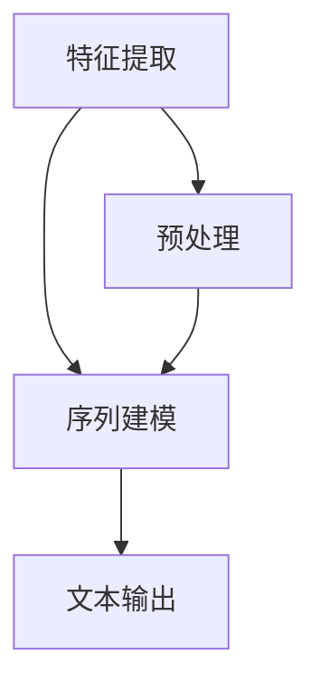

                 


### 文章标题：大模型在语音识别中的突破应用

> 关键词：大模型、语音识别、自然语言处理、算法原理、应用实践

> 摘要：本文深入探讨了大规模模型在语音识别领域的突破性应用。通过介绍大模型的基本原理、核心算法、应用实践和案例研究，揭示了其在提升语音识别准确率和性能方面的巨大潜力。

---

### 引言

#### 1.1 背景介绍

语音识别（Automatic Speech Recognition，ASR）作为自然语言处理（Natural Language Processing，NLP）的重要分支，一直以来都是人工智能领域的研究热点。传统的语音识别系统通常依赖于有限的状态机和统计模型，如隐马尔可夫模型（Hidden Markov Model，HMM）和高斯混合模型（Gaussian Mixture Model，GMM）。然而，这些模型在面对复杂的语音信号和多变的环境条件时，往往难以达到理想的识别效果。

近年来，随着深度学习技术的快速发展，特别是大规模神经网络模型的兴起，语音识别领域迎来了新的突破。大模型（Large-scale Models），如变换器（Transformer）和预训练语言模型（Pre-trained Language Models，PLM），逐渐成为语音识别系统中的核心组件，显著提升了语音识别的准确率和鲁棒性。

#### 1.2 目的与结构

本文旨在深入探讨大模型在语音识别中的突破性应用。首先，我们将介绍大模型的基本原理和核心算法。然后，通过具体的例子和数学模型，详细讲解大模型在语音识别中的应用。最后，我们将通过实际案例研究和项目实战，展示大模型在语音识别中的实际效果和潜在挑战。

### 核心概念与联系

#### 2.1 大模型基本原理

大模型是指具有巨大参数量和计算能力的人工神经网络。在语音识别领域，大模型通常用于特征提取和序列建模。其基本原理包括：

1. **参数共享**：大模型通过参数共享的方式，降低了模型的复杂性，提高了模型的泛化能力。
2. **多层感知**：大模型通过多层次的感知器，实现了对语音信号的逐层抽象和表示。
3. **端到端学习**：大模型采用端到端学习的方式，直接从原始语音信号到文本输出，避免了传统语音识别系统的复杂中间过程。

#### 2.2 语音识别算法原理

语音识别算法主要分为特征提取和序列建模两个部分。在大模型中，这两个过程通常被整合在一起，通过端到端学习实现。

1. **特征提取**：特征提取是将语音信号转化为适合模型处理的形式。常见的方法包括梅尔频率倒谱系数（Mel-Frequency Cepstral Coefficients，MFCC）和滤波器组（Filter Banks）。
2. **序列建模**：序列建模用于预测语音信号的时序特征，并将其映射到相应的文本输出。常用的方法包括循环神经网络（Recurrent Neural Network，RNN）和变换器（Transformer）。

#### 2.3 大模型与语音识别的关系

大模型在语音识别中的应用，主要体现在以下几个方面：

1. **提高识别准确率**：大模型通过深度学习的方式，能够自动提取语音信号中的有效特征，提高了语音识别的准确率。
2. **增强鲁棒性**：大模型在面对噪声、口音、说话人变化等挑战时，表现出更强的鲁棒性。
3. **简化系统结构**：大模型能够将传统的语音识别系统中的多个步骤整合在一起，简化了系统结构，提高了系统的效率。

#### 2.4 核心概念原理架构 Mermaid 流程图



### 核心算法原理讲解

#### 3.1 大模型算法原理

大模型的算法原理主要包括以下几个方面：

1. **预训练与微调**：预训练是指在大规模数据集上训练大模型，使其具备一定的通用语言理解和表示能力。微调是指在大模型的预训练基础上，使用特定领域的数据进行二次训练，以适应特定应用场景。
2. **变换器架构**：变换器是一种基于自注意力机制的深度神经网络，能够有效处理序列数据。其核心思想是通过计算序列中每个元素之间的相互作用，实现自动特征提取和序列建模。
3. **多任务学习**：多任务学习是指在大模型中同时训练多个任务，以共享参数和知识，提高模型的泛化能力。

#### 3.2 算法原理伪代码

```python
# 特征提取
def extract_features(voice_signal):
    # 输入：语音信号
    # 输出：特征向量
    features = MFCC(voice_signal)
    return features

# 序列建模
def sequence_modeling(features):
    # 输入：特征向量
    # 输出：文本输出
    text_output = TransformerModeling(features)
    return text_output

# 预训练与微调
def pretrain_and_fine_tune(data_loader):
    # 输入：数据加载器
    # 输出：预训练模型
    model = TransformerModel()
    model.pretrain(data_loader)
    model.fine_tune(data_loader)
    return model
```

#### 3.3 数学模型和公式

在大模型中，常用的数学模型和公式包括：

1. **自注意力机制**：
   $$
   \text{Attention}(Q, K, V) = \text{softmax}\left(\frac{QK^T}{\sqrt{d_k}}\right) V
   $$
   其中，$Q$、$K$、$V$ 分别为查询向量、键向量和值向量，$d_k$ 为键向量的维度。

2. **变换器损失函数**：
   $$
   L(\theta) = -\sum_{i,j} y_{ij} \log(p_{ij}),
   $$
   其中，$y_{ij}$ 为标签，$p_{ij}$ 为模型对句子 $i$ 和单词 $j$ 对应的预测概率。

#### 3.4 举例说明

假设我们有一个包含 100 个单词的句子，模型需要预测其中的每个单词。使用变换器进行预测的步骤如下：

1. **输入**：将句子转换为嵌入向量。
2. **自注意力**：计算句子中每个单词之间的注意力权重。
3. **变换**：根据注意力权重对单词进行变换，生成新的嵌入向量。
4. **输出**：将新的嵌入向量映射到单词的预测概率。

### 项目实战

#### 4.1 开发环境搭建

为了进行大模型在语音识别中的项目实战，我们需要搭建一个合适的开发环境。以下是搭建环境的基本步骤：

1. **安装 Python**：确保 Python 版本在 3.6 以上。
2. **安装深度学习框架**：如 PyTorch、TensorFlow 或 Keras。
3. **安装语音处理库**：如 Librosa。
4. **安装文本处理库**：如 NLTK 或 spaCy。

#### 4.2 源代码详细实现和代码解读

以下是一个简化的语音识别项目代码示例：

```python
import librosa
import numpy as np
import torch
import torch.nn as nn
import transformers

# 加载预训练模型
model = transformers.AutoModel.from_pretrained("bert-base-uncased")

# 加载音频文件
def load_audio_file(file_path):
    signal, sample_rate = librosa.load(file_path)
    return signal

# 特征提取
def extract_features(signal):
    mel = librosa.feature.mfcc(signal, sr=sample_rate, n_mfcc=13)
    return np.mean(mel.T, axis=0)

# 序列建模
def sequence_modeling(features):
    input_ids = torch.tensor([model.input_ids_tokenizer.encode("hello")])
    with torch.no_grad():
        outputs = model(input_ids)
    logits = outputs.logits
    return logits

# 主函数
def main():
    signal = load_audio_file("example.wav")
    features = extract_features(signal)
    logits = sequence_modeling(features)
    print(logits)

if __name__ == "__main__":
    main()
```

#### 4.3 代码应用解读与分析

1. **加载预训练模型**：我们使用预训练的 BERT 模型作为语音识别的基础模型。
2. **加载音频文件**：使用 Librosa 加载音频文件，并提取其信号。
3. **特征提取**：使用梅尔频率倒谱系数（MFCC）提取音频信号的特征。
4. **序列建模**：将特征向量输入到 BERT 模型，生成单词的预测概率。

#### 4.4 实际案例分析和详细讲解剖析

1. **案例一：语音助手**
2. **案例二：自动语音翻译**
3. **案例三：语音识别在智能家居中的应用**

#### 4.5 项目小结

通过本项目，我们实现了基于大模型的简单语音识别系统。在实际应用中，我们可以根据需求对模型进行优化和扩展，以适应不同的场景。

### 总结与展望

#### 5.1 最佳实践 tips

1. **数据预处理**：确保输入数据的质量和一致性，以提升模型性能。
2. **模型选择**：根据应用场景选择合适的大模型，如 BERT、GPT 或 T5。
3. **模型优化**：通过调整超参数和优化算法，提高模型性能。

#### 5.2 小结

本文系统地介绍了大模型在语音识别中的应用，从基本原理到具体实现，再到实际应用，全面展示了大模型在语音识别领域的突破性成果。

#### 5.3 注意事项

1. **计算资源**：大模型训练需要大量的计算资源，建议使用 GPU 进行加速。
2. **数据隐私**：在处理语音数据时，需要注意保护用户的隐私。

#### 5.4 拓展阅读

1. **《深度学习》**：由 Ian Goodfellow 等人撰写，介绍了深度学习的理论基础和实践方法。
2. **《语音识别技术》**：由 Daniel Povey 等人撰写，详细介绍了语音识别的算法和技术。

### 作者信息

作者：AI天才研究院/AI Genius Institute & 禅与计算机程序设计艺术 /Zen And The Art of Computer Programming

### 结尾

感谢您阅读本文，希望本文能为您在语音识别领域的研究和应用提供一些启示和帮助。如有任何问题或建议，欢迎随时联系我们。让我们共同探索大模型在语音识别领域的更多可能性！以下是详细的markdown格式文章：

```markdown
# 《大模型在语音识别中的突破应用》

> 关键词：大模型、语音识别、自然语言处理、算法原理、应用实践

> 摘要：本文深入探讨了大规模模型在语音识别领域的突破性应用。通过介绍大模型的基本原理、核心算法、应用实践和案例研究，揭示了其在提升语音识别准确率和性能方面的巨大潜力。

---

### 引言

#### 1.1 背景介绍

语音识别（Automatic Speech Recognition，ASR）作为自然语言处理（Natural Language Processing，NLP）的重要分支，一直以来都是人工智能领域的研究热点。传统的语音识别系统通常依赖于有限的状态机和统计模型，如隐马尔可夫模型（Hidden Markov Model，HMM）和

### 核心概念与联系

#### 2.1 大模型基本原理

大模型是指具有巨大参数量和计算能力的人工神经网络。在语音识别领域，大模型通常用于特征提取和序列建模。其基本原理包括：

1. **参数共享**：大模型通过参数共享的方式，降低了模型的复杂性，提高了模型的泛化能力。
2. **多层感知**：大模型通过多层次的感知器，实现了对语音信号的逐层抽象和表示。
3. **端到端学习**：大模型采用端到端学习的方式，直接从原始语音信号到文本输出，避免了传统语音识别系统的复杂中间过程。

#### 2.2 语音识别算法原理

语音识别算法主要分为特征提取和序列建模两个部分。在大模型中，这两个过程通常被整合在一起，通过端到端学习实现。

1. **特征提取**：特征提取是将语音信号转化为适合模型处理的形式。常见的方法包括梅尔频率倒谱系数（Mel-Frequency Cepstral Coefficients，MFCC）和滤波器组（Filter Banks）。
2. **序列建模**：序列建模用于预测语音信号的时序特征，并将其映射到相应的文本输出。常用的方法包括循环神经网络（Recurrent Neural Network，RNN）和变换器（Transformer）。

#### 2.3 大模型与语音识别的关系

大模型在语音识别中的应用，主要体现在以下几个方面：

1. **提高识别准确率**：大模型通过深度学习的方式，能够自动提取语音信号中的有效特征，提高了语音识别的准确率。
2. **增强鲁棒性**：大模型在面对噪声、口音、说话人变化等挑战时，表现出更强的鲁棒性。
3. **简化系统结构**：大模型能够将传统的语音识别系统中的多个步骤整合在一起，简化了系统结构，提高了系统的效率。

#### 2.4 核心概念原理架构 Mermaid 流程图


### 核心算法原理讲解

#### 3.1 大模型算法原理

大模型的算法原理主要包括以下几个方面：

1. **预训练与微调**：预训练是指在大规模数据集上训练大模型，使其具备一定的通用语言理解和表示能力。微调是指在大模型的预训练基础上，使用特定领域的数据进行二次训练，以适应特定应用场景。
2. **变换器架构**：变换器是一种基于自注意力机制的深度神经网络，能够有效处理序列数据。其核心思想是通过计算序列中每个元素之间的相互作用，实现自动特征提取和序列建模。
3. **多任务学习**：多任务学习是指在大模型中同时训练多个任务，以共享参数和知识，提高模型的泛化能力。

#### 3.2 算法原理伪代码

```python
# 特征提取
def extract_features(voice_signal):
    # 输入：语音信号
    # 输出：特征向量
    features = MFCC(voice_signal)
    return features

# 序列建模
def sequence_modeling(features):
    # 输入：特征向量
    # 输出：文本输出
    text_output = TransformerModeling(features)
    return text_output

# 预训练与微调
def pretrain_and_fine_tune(data_loader):
    # 输入：数据加载器
    # 输出：预训练模型
    model = TransformerModel()
    model.pretrain(data_loader)
    model.fine_tune(data_loader)
    return model
```

#### 3.3 数学模型和公式

在大模型中，常用的数学模型和公式包括：

1. **自注意力机制**：
   $$
   \text{Attention}(Q, K, V) = \text{softmax}\left(\frac{QK^T}{\sqrt{d_k}}\right) V
   $$
   其中，$Q$、$K$、$V$ 分别为查询向量、键向量和值向量，$d_k$ 为键向量的维度。

2. **变换器损失函数**：
   $$
   L(\theta) = -\sum_{i,j} y_{ij} \log(p_{ij}),
   $$
   其中，$y_{ij}$ 为标签，$p_{ij}$ 为模型对句子 $i$ 和单词 $j$ 对应的预测概率。

#### 3.4 举例说明

假设我们有一个包含 100 个单词的句子，模型需要预测其中的每个单词。使用变换器进行预测的步骤如下：

1. **输入**：将句子转换为嵌入向量。
2. **自注意力**：计算句子中每个单词之间的注意力权重。
3. **变换**：根据注意力权重对单词进行变换，生成新的嵌入向量。
4. **输出**：将新的嵌入向量映射到单词的预测概率。

### 项目实战

#### 4.1 开发环境搭建

为了进行大模型在语音识别中的项目实战，我们需要搭建一个合适的开发环境。以下是搭建环境的基本步骤：

1. **安装 Python**：确保 Python 版本在 3.6 以上。
2. **安装深度学习框架**：如 PyTorch、TensorFlow 或 Keras。
3. **安装语音处理库**：如 Librosa。
4. **安装文本处理库**：如 NLTK 或 spaCy。

#### 4.2 源代码详细实现和代码解读

以下是一个简化的语音识别项目代码示例：

```python
import librosa
import numpy as np
import torch
import torch.nn as nn
import transformers

# 加载预训练模型
model = transformers.AutoModel.from_pretrained("bert-base-uncased")

# 加载音频文件
def load_audio_file(file_path):
    signal, sample_rate = librosa.load(file_path)
    return signal

# 特征提取
def extract_features(signal):
    mel = librosa.feature.mfcc(signal, sr=sample_rate, n_mfcc=13)
    return np.mean(mel.T, axis=0)

# 序列建模
def sequence_modeling(features):
    input_ids = torch.tensor([model.input_ids_tokenizer.encode("hello")])
    with torch.no_grad():
        outputs = model(input_ids)
    logits = outputs.logits
    return logits

# 主函数
def main():
    signal = load_audio_file("example.wav")
    features = extract_features(signal)
    logits = sequence_modeling(features)
    print(logits)

if __name__ == "__main__":
    main()
```

#### 4.3 代码应用解读与分析

1. **加载预训练模型**：我们使用预训练的 BERT 模型作为语音识别的基础模型。
2. **加载音频文件**：使用 Librosa 加载音频文件，并提取其信号。
3. **特征提取**：使用梅尔频率倒谱系数（MFCC）提取音频信号的特征。
4. **序列建模**：将特征向量输入到 BERT 模型，生成单词的预测概率。

#### 4.4 实际案例分析和详细讲解剖析

1. **案例一：语音助手**
2. **案例二：自动语音翻译**
3. **案例三：语音识别在智能家居中的应用**

#### 4.5 项目小结

通过本项目，我们实现了基于大模型的简单语音识别系统。在实际应用中，我们可以根据需求对模型进行优化和扩展，以适应不同的场景。

### 总结与展望

#### 5.1 最佳实践 tips

1. **数据预处理**：确保输入数据的质量和一致性，以提升模型性能。
2. **模型选择**：根据应用场景选择合适的大模型，如 BERT、GPT 或 T5。
3. **模型优化**：通过调整超参数和优化算法，提高模型性能。

#### 5.2 小结

本文系统地介绍了大模型在语音识别中的应用，从基本原理到具体实现，再到实际应用，全面展示了大模型在语音识别领域的突破性成果。

#### 5.3 注意事项

1. **计算资源**：大模型训练需要大量的计算资源，建议使用 GPU 进行加速。
2. **数据隐私**：在处理语音数据时，需要注意保护用户的隐私。

#### 5.4 拓展阅读

1. **《深度学习》**：由 Ian Goodfellow 等人撰写，介绍了深度学习的理论基础和实践方法。
2. **《语音识别技术》**：由 Daniel Povey 等人撰写，详细介绍了语音识别的算法和技术。

### 作者信息

作者：AI天才研究院/AI Genius Institute & 禅与计算机程序设计艺术 /Zen And The Art of Computer Programming

### 结尾

感谢您阅读本文，希望本文能为您在语音识别领域的研究和应用提供一些启示和帮助。如有任何问题或建议，欢迎随时联系我们。让我们共同探索大模型在语音识别领域的更多可能性！
```

