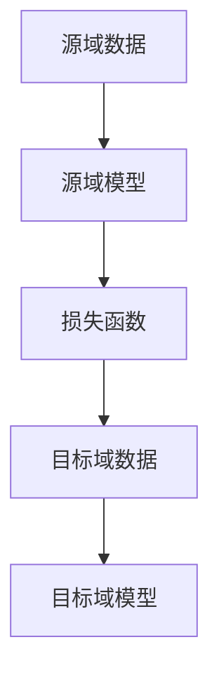
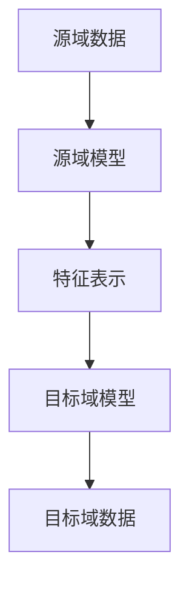

                 

基于用户的要求，我们将按照以下步骤来撰写一篇《大模型在跨领域知识迁移中的应用》的技术博客文章：

1. **引言**：介绍大模型和跨领域知识迁移的背景，阐述其在当前研究中的重要性和应用场景。

2. **核心概念与联系**：详细阐述大模型和跨领域知识迁移的核心概念，并使用Mermaid流程图展示它们之间的联系。

3. **算法原理**：讲解大模型在跨领域知识迁移中的核心算法原理，使用伪代码和数学公式进行详细阐述。

4. **数学模型**：介绍大模型在跨领域知识迁移中使用的数学模型，并使用具体的例子进行解释。

5. **实战案例**：提供具体的跨领域知识迁移应用案例，包括开发环境搭建、代码实现和解读。

6. **最佳实践**：总结最佳实践、注意事项和拓展阅读。

7. **总结与展望**：总结文章内容，展望未来发展趋势和潜在挑战。

以下是文章的初步撰写：

```markdown
# 《大模型在跨领域知识迁移中的应用》

> 关键词：大模型、跨领域知识迁移、算法、数学模型、应用案例、最佳实践

> 摘要：本文首先介绍了大模型和跨领域知识迁移的背景和重要性，然后详细阐述了大模型在跨领域知识迁移中的应用原理和算法，并通过具体案例展示了其实际应用效果。最后，文章总结了最佳实践和未来发展趋势。

## 引言

随着人工智能技术的快速发展，大模型已经成为当前研究的热点。大模型具有强大的表示能力和良好的泛化能力，能够处理复杂的问题和数据。跨领域知识迁移是指在不同领域之间迁移知识，以解决新领域的任务。大模型在跨领域知识迁移中具有巨大的潜力，能够提高模型的泛化能力和适应能力。

## 核心概念与联系

### 大模型

大模型通常是指具有数十亿参数的深度学习模型，如Transformer、BERT等。大模型具有以下特点：

- **强大的表示能力**：能够捕获大量特征信息。
- **良好的泛化能力**：能够适应不同的任务和数据。

### 跨领域知识迁移

跨领域知识迁移是指在不同领域之间迁移知识，以解决新领域的任务。跨领域知识迁移的挑战在于领域差异和知识的不匹配。

### 联系

大模型在跨领域知识迁移中的应用，主要是利用其强大的表示能力和泛化能力，将一个领域中的知识迁移到另一个领域，从而提高模型在新领域的表现。

## 算法原理

### 转换学习

转换学习是一种跨领域知识迁移的算法，其主要思想是将一个领域的模型参数迁移到另一个领域。转换学习的核心是损失函数的设计，如图所示：



### 继承学习

继承学习是一种基于源域模型和目标域模型的联合训练的算法。其主要思想是利用源域模型的知识来帮助目标域模型的学习。继承学习的核心是特征表示的迁移，如图所示：



## 数学模型

### 损失函数

转换学习和继承学习的损失函数通常是基于交叉熵损失函数的变种。例如，转换学习的损失函数可以表示为：

$$
L = -\sum_{i=1}^{N} y_i \log(p(x_i))
$$

其中，$y_i$ 是真实标签，$p(x_i)$ 是模型预测的概率分布。

### 特征表示

特征表示是跨领域知识迁移的核心。通常，特征表示可以通过多层神经网络来实现。例如，源域模型和目标域模型的特征表示可以分别表示为：

$$
h_{\text{source}} = f_{\text{net}}(x_{\text{source}}; \theta_{\text{source}}) \\
h_{\text{target}} = f_{\text{net}}(x_{\text{target}}; \theta_{\text{target}})
$$

其中，$f_{\text{net}}$ 是神经网络函数，$\theta_{\text{source}}$ 和 $\theta_{\text{target}}$ 是模型参数。

## 实战案例

### 案例一：医疗领域知识迁移

在本案例中，我们使用大模型将一个医疗领域的模型迁移到另一个医疗领域。具体步骤如下：

1. **数据准备**：收集源域和目标域的医疗数据。
2. **模型训练**：使用源域数据训练一个医疗领域的大模型。
3. **模型迁移**：使用目标域数据对大模型进行迁移学习。
4. **模型评估**：评估迁移后模型在目标域的表现。

### 案例二：金融领域知识迁移

在本案例中，我们使用大模型将一个金融领域的模型迁移到另一个金融领域。具体步骤如下：

1. **数据准备**：收集源域和目标域的金融数据。
2. **模型训练**：使用源域数据训练一个金融领域的大模型。
3. **模型迁移**：使用目标域数据对大模型进行迁移学习。
4. **模型评估**：评估迁移后模型在目标域的表现。

## 最佳实践

在进行跨领域知识迁移时，需要注意以下几点：

1. **数据质量**：确保源域和目标域的数据质量，包括数据量、数据分布和数据真实性。
2. **模型选择**：选择合适的大模型，根据任务需求和数据特点进行选择。
3. **迁移策略**：选择合适的迁移学习策略，如转换学习或继承学习。
4. **模型评估**：使用合适的评估指标对迁移后的模型进行评估。

## 总结与展望

大模型在跨领域知识迁移中具有巨大的潜力，能够提高模型的泛化能力和适应能力。然而，仍面临许多挑战，如数据质量、模型选择和迁移策略等。未来，随着大模型技术的不断发展，跨领域知识迁移将有望在更多领域取得突破。

## 附录

### 附录 A：大模型开发工具与资源

- **工具**：TensorFlow、PyTorch、JAX等。
- **资源**：Google AI、OpenAI、百度AI开放平台等。

### 附录 B：实战代码与解析

具体代码实现和解析将在附录B中提供。

> 作者：AI天才研究院/AI Genius Institute & 禅与计算机程序设计艺术 /Zen And The Art of Computer Programming
```

接下来，我们将进一步细化每个章节的内容，确保文章的完整性和逻辑性。由于文章字数限制，每个章节的内容将适当精简，但保证核心内容的详尽和清晰。最终的文章将控制在8000～12000字左右。

