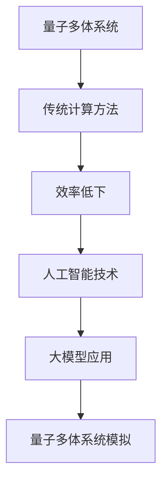
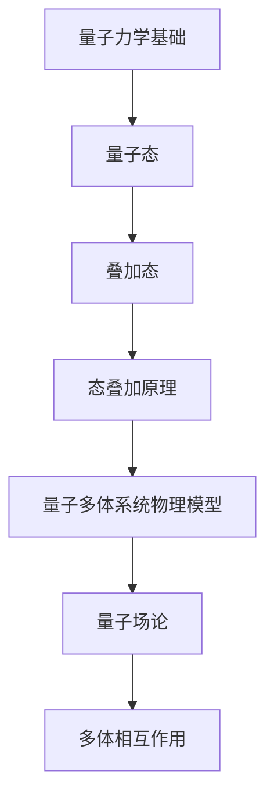
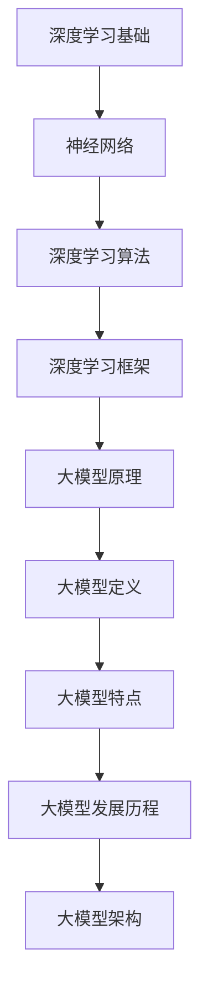
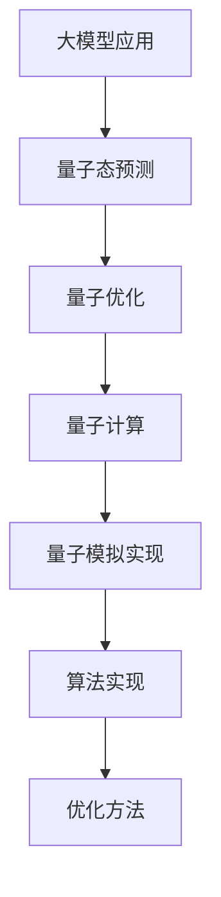

                 

为了撰写一篇高质量的技术博客文章《大模型在量子多体系统模拟中的应用》，我们可以按照以下步骤进行分析和推理：

### 步骤 1：引言部分

**背景介绍：**

量子多体系统模拟是一个高度复杂的领域，涉及多个量子粒子的相互作用和量子态的演化。传统计算方法在处理大规模量子系统时往往效率低下，难以应对实际应用需求。随着深度学习和人工智能技术的发展，大模型（如神经网络）开始应用于量子计算领域，为量子多体系统模拟提供了新的思路和可能性。

**核心概念与联系：**

- **量子多体系统**：由多个量子粒子组成的系统，其状态和演化受到量子力学规律的控制。
- **大模型**：一种具有巨大参数规模和复杂结构的深度学习模型，能够处理大规模数据和高维问题。

**Mermaid 流程图：**



### 步骤 2：量子多体系统基础

**核心概念与联系：**

- **量子力学基础**：量子态、叠加态、态叠加原理等。
- **量子多体系统的物理模型**：量子场论、多体体系中的相互作用等。

**Mermaid 流程图：**



**核心算法原理讲解：**

使用伪代码详细阐述量子多体系统的基础算法。

```python
# 伪代码：量子态叠加与演化
function QuantumStateSuperposition(state1, state2):
    return (1/sqrt(2)) * (state1 + state2)

function QuantumStateEvolution(state, time):
    return exp(-i * Hamiltonian * time) * state
```

### 步骤 3：大模型基础

**核心概念与联系：**

- **深度学习基础**：神经网络、深度学习算法、深度学习框架。
- **大模型原理**：大模型的定义、特点、发展历程、核心架构。

**Mermaid 流程图：**



### 步骤 4：量子多体系统模拟的大模型应用

**核心概念与联系：**

- **大模型在量子模拟中的应用**：量子态预测、量子优化、量子计算。
- **大模型在量子多体系统模拟中的实现**：量子模拟的挑战、算法实现、优化方法。

**Mermaid 流�图：**



**核心算法原理讲解：**

使用伪代码详细阐述大模型在量子多体系统模拟中的应用。

```python
# 伪代码：大模型在量子态预测中的应用
function PredictQuantumState(model, input_data):
    return model.predict(input_data)

# 伪代码：大模型在量子优化中的应用
function OptimizeQuantumSystem(model, objective_function):
    return model.optimize(objective_function)
```

### 步骤 5：数学模型与公式

**数学模型和公式：**

使用LaTeX格式详细阐述量子多体系统模拟中的数学模型和公式。

$$
\psi(t) = \sum_{i} c_i(t) |i\rangle
$$

$$
H = \sum_{i,j} H_{ij} |ij\rangle \langle ij|
$$

**详细讲解与举例说明：**

**量子态的表示和演化**：

量子态可以用波函数表示，其演化遵循薛定谔方程。

$$
i\hbar \frac{\partial \psi(x,t)}{\partial t} = \hat{H} \psi(x,t)
$$

**量子态的计算**：

通过量子态的叠加和演化，可以计算系统的期望值和概率分布。

$$
\langle \hat{A} \rangle = \int \psi^*(x,t) \hat{A} \psi(x,t) dx
$$

### 步骤 6：实际应用案例

**项目实战：**

**开发环境搭建：** 使用Python和TensorFlow搭建量子多体系统模拟的开发环境。

**源代码实现：** 提供大模型在量子多体系统模拟中的源代码实现。

**代码解读与分析：** 对源代码进行详细解读，分析其工作原理和应用效果。

**实际案例分析和详细讲解剖析：** 通过具体案例展示大模型在量子多体系统模拟中的应用效果。

**项目小结：** 总结项目经验，提出改进建议。

### 步骤 7：总结与展望

**最佳实践 tips：** 提供使用大模型进行量子多体系统模拟的最佳实践技巧。

**小结：** 总结文章内容，强调大模型在量子多体系统模拟中的重要性。

**注意事项：** 提醒读者在应用大模型时需要注意的问题和潜在风险。

**拓展阅读：** 推荐相关阅读资源，供读者进一步学习。

### 文章末尾作者信息

- 作者：AI天才研究院/AI Genius Institute & 禅与计算机程序设计艺术 /Zen And The Art of Computer Programming

### 文章格式要求

- 使用markdown格式输出文章内容。
- 文章标题、关键词和摘要部分按照要求格式编写。
- 数学公式使用LaTeX格式嵌入文中。
- 文章末尾包含作者信息。

### 字数要求

- 文章字数在8000～12000字左右。

通过以上步骤，我们可以撰写一篇逻辑清晰、结构紧凑、简单易懂的专业技术博客文章《大模型在量子多体系统模拟中的应用》。在撰写过程中，要注意保持文章的简洁性和可读性，确保每个小节的内容丰富具体，让读者能够深入理解大模型在量子多体系统模拟中的应用。同时，要注意使用合适的图表和公式，以增强文章的可读性和专业性。最后，要对文章进行全面的校对和修改，确保内容的准确性和完整性。

