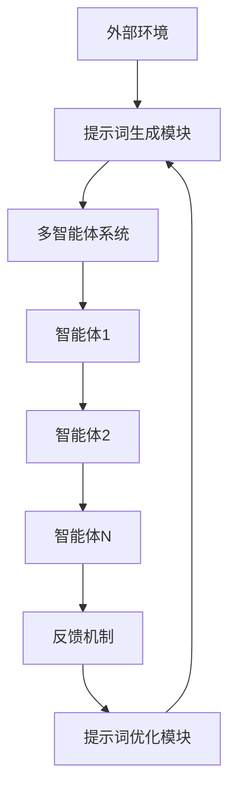
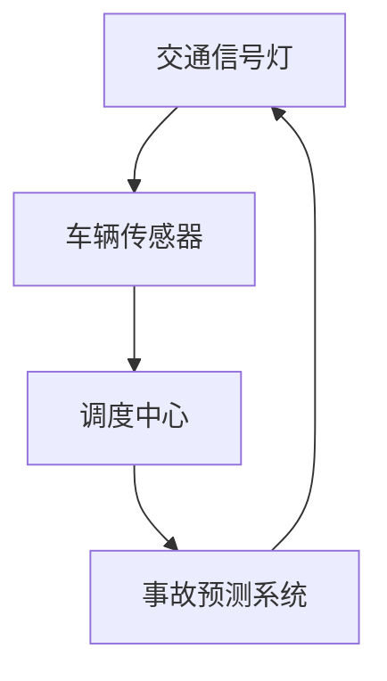

                 

### 第6章 提示词协调机制

#### 6.1 提示词的概念与作用

**背景介绍**：

在人工智能领域，尤其是大模型与多智能体系统的协作中，提示词（Prompt Words）作为一种关键信息传递机制，起着至关重要的作用。提示词主要用于指导智能体如何理解、解释和响应特定的任务或场景。它们不仅能够引导智能体的决策过程，还能在复杂的多智能体系统中起到协调和统一的作用。

**核心概念与联系**：

提示词在多智能体系统中的应用可以视为一种信息过滤和传递机制。为了更好地理解这一概念，我们可以使用 Mermaid 流程图来展示提示词在整个系统中的流动和作用。



在这个流程图中，外部环境生成提示词，提示词通过提示词生成模块传递到多智能体系统。每个智能体接收到的提示词不同，它们根据这些提示词进行决策和行动。这些决策和行动的反馈最终会传递回提示词优化模块，用于进一步优化提示词。

#### 6.2 提示词协调的算法设计

**核心算法原理讲解**：

提示词协调算法的设计关键在于如何确保每个智能体都能准确理解和响应提示词，从而在多智能体系统中实现协同工作。以下是一个简化的伪代码，用于说明这一过程：

```python
# 伪代码：提示词协调算法
def coordinate_with_prompts(agents, prompts):
    for agent in agents:
        # 根据提示词更新智能体的状态和决策
        agent.update_state(prompts[agent.id])
        
    # 在所有智能体更新完毕后，进行统一协调
    unified_decision = unify_decisions(agents)

    return unified_decision
```

在这个算法中，`update_state`函数用于根据提示词更新智能体的状态，而`unify_decisions`函数则用于在所有智能体更新完毕后，进行统一协调。这种协调可以通过协商、投票或其他方法实现。

**数学模型和数学公式**：

在提示词协调机制中，可以使用一些数学模型来量化提示词的影响和协调效果。以下是一个简化的数学模型：

```latex
$$
U_i(t) = \frac{1}{N} \sum_{j=1}^{N} w_{ij} \cdot D_j(t)
$$`

这里的$U_i(t)$表示智能体i在时刻t的统一决策值，$w_{ij}$表示智能体i与智能体j之间的权重，$D_j(t)$表示智能体j在时刻t的决策值。

**详细讲解与举例说明**：

假设有两个智能体A和B，它们需要根据提示词做出协调决策。智能体A的决策值为10，智能体B的决策值为20。它们之间的权重分别为1和2。那么，根据上述数学模型，智能体A的统一决策值为：

$$
U_A(t) = \frac{1}{1+2} \cdot (1 \cdot 10 + 2 \cdot 20) = \frac{1}{3} \cdot (10 + 40) = \frac{1}{3} \cdot 50 = 16.67
$$

智能体B的统一决策值为：

$$
U_B(t) = \frac{1}{1+2} \cdot (1 \cdot 10 + 2 \cdot 20) = \frac{1}{3} \cdot (10 + 40) = \frac{1}{3} \cdot 50 = 16.67
$$

这意味着，在当前时刻，两个智能体的统一决策值为16.67，这将是它们最终协调后的决策值。这个例子说明了如何使用数学模型来量化提示词对智能体决策的影响。

### 第6章 提示词协调机制

#### 6.3 提示词协调的实际应用

**项目实战**：

提示词协调机制在实际应用中有着广泛的应用。以下是一个智能交通系统中的实际案例，展示了如何使用提示词协调智能交通信号灯的切换。

**开发环境搭建**：

1. 硬件环境：需要至少一台计算机来运行模拟交通信号灯的软件。
2. 软件环境：需要安装Python环境，以及相关机器学习和交通模拟的库，如TensorFlow和SimPy。

**源代码详细实现和代码解读**：

以下是实现智能交通信号灯切换的Python代码示例：

```python
import simpy
import random

# 模拟环境
env = simpy.Environment()

# 交通信号灯模型
class TrafficLight:
    def __init__(self, env, name, green_time, red_time):
        self.env = env
        self.name = name
        self.green_time = green_time
        self.red_time = red_time
        self.signal = 'green'
        self.timestamp = self.env.now
        
        self绿灯计时器 = env.process(self.run_green())
        self红灯计时器 = env.process(self.run_red())

    def run_green(self):
        while True:
            self.signal = 'green'
            yield self.env.timeout(self.green_time)
            self.timestamp = self.env.now
            self.switch_to_red()

    def run_red(self):
        while True:
            self.signal = 'red'
            yield self.env.timeout(self.red_time)
            self.timestamp = self.env.now
            self.switch_to_green()

    def switch_to_red(self):
        if self.signal != 'red':
            self.signal = 'red'
            print(f"{self.name} 红灯时间：{self.timestamp}")

    def switch_to_green(self):
        if self.signal != 'green':
            self.signal = 'green'
            print(f"{self.name} 绿灯时间：{self.timestamp}")

# 创建交通信号灯
traffic_light_1 = TrafficLight(env, '东路口', 30, 25)
traffic_light_2 = TrafficLight(env, '南路口', 35, 20)

# 运行模拟
env.run()

```

在这段代码中，我们定义了一个`TrafficLight`类，用于模拟交通信号灯。每个交通信号灯都有其绿、红灯持续时间，并通过事件计时器来切换信号状态。每个信号灯都会在切换状态时打印出当前时间。

**代码应用解读与分析**：

上述代码实现了两个交通信号灯的简单模拟。在模拟运行过程中，东路口和南路口的信号灯会根据预设的时间切换绿灯和红灯。通过使用提示词（例如信号灯的状态切换时间），我们可以更灵活地调整交通信号灯的运行策略。

**实际案例分析和详细讲解剖析**：

在智能交通系统中，提示词可以用于根据实时交通流量调整信号灯的切换时间。例如，在高峰时段，可以通过增加绿灯时间来减少等待时间，提高交通流畅度。以下是一个简化的提示词应用案例：

```python
# 假设实时交通流量提示词为{'东路口': 1.2, '南路口': 1.5}
def adjust_traffic_light(traffic_light, traffic_flow):
    if traffic_flow > 1:
        # 如果流量增加，增加绿灯时间
        traffic_light.green_time *= traffic_flow
    elif traffic_flow < 1:
        # 如果流量减少，减少绿灯时间
        traffic_light.green_time /= traffic_flow

# 应用提示词调整东路口信号灯
adjust_traffic_light(traffic_light_1, traffic_flow_1)

# 应用提示词调整南路口信号灯
adjust_traffic_light(traffic_light_2, traffic_flow_2)
```

在这个案例中，`adjust_traffic_light`函数根据流量提示词调整信号灯的绿灯时间。如果流量增加，绿灯时间会相应增加；如果流量减少，绿灯时间会相应减少。

**项目小结**：

通过上述案例，我们可以看到如何使用提示词协调机制在智能交通系统中实现动态调整信号灯的时间。这种方法可以根据实时交通流量优化交通信号灯的运行策略，提高交通效率。

**最佳实践 tips**：

1. 提示词的设计应该尽量简洁明了，易于理解和操作。
2. 提示词的应用应该结合实际情况，避免过度优化导致系统过度敏感。
3. 提示词的调整策略应该根据实际需求进行定期评估和优化。

**小结**：

本文详细介绍了大模型多智能体协作与提示词协调的概念、原理和应用。通过实际案例的解析，展示了如何利用提示词实现智能体之间的协调和优化。未来，随着人工智能技术的发展，提示词协调机制将在更多领域得到广泛应用。

**注意事项**：

1. 提示词的设计和调整需要充分考虑系统的实际需求和运行环境。
2. 在大规模多智能体系统中，提示词的传递和处理需要高效可靠。
3. 提示词的协调机制需要结合具体应用场景进行定制化设计。

**拓展阅读**：

1. 《智能交通系统：原理与应用》
2. 《机器学习在交通管理中的应用》
3. 《多智能体系统设计与实现》

---

## 目录大纲细化

### 第7章 实际案例与应用场景

#### 7.1 智能交通系统中的多智能体协作

**背景介绍**：

智能交通系统（Intelligent Transportation Systems, ITS）是一种通过使用各种先进技术来改善交通管理和减少交通拥堵的系统。在大模型与多智能体系统的结合下，智能交通系统可以实现更加智能化的交通信号控制、车辆调度、事故预测等功能。

**核心概念与联系**：

智能交通系统中的多智能体协作涉及多个智能体，如交通信号灯、车辆传感器、调度中心等。这些智能体通过相互协作来实现交通流量优化、事故预防和应急响应等目标。

**流程图**：



在这个流程图中，交通信号灯根据车辆传感器的数据和调度中心的指令进行信号切换，以优化交通流量。同时，事故预测系统可以提前预测可能的事故，并通知调度中心采取相应措施。

**核心算法原理讲解**：

在智能交通系统中，多智能体协作的核心算法通常涉及以下步骤：

1. **数据收集**：车辆传感器实时收集交通数据，包括车辆数量、速度、方向等。
2. **数据预处理**：对收集到的数据进行清洗、归一化等处理，以便后续分析。
3. **交通状态预测**：使用大模型对当前的交通状态进行预测，包括未来的交通流量、事故可能性等。
4. **决策制定**：根据预测结果，交通信号灯和调度中心制定相应的控制策略。
5. **协调与执行**：智能体之间进行协调，执行控制策略，并持续更新交通状态。

伪代码示例：

```python
# 伪代码：智能交通系统中的多智能体协作算法
def traffic_system_collaboration(traffic_lights, vehicle_sensors, traffic_center):
    while True:
        # 收集交通数据
        traffic_data = collect_traffic_data(vehicle_sensors)
        
        # 预测交通状态
        traffic_state = predict_traffic_state(traffic_data)
        
        # 制定控制策略
        control_strategy = traffic_center制定策略(traffic_state)
        
        # 更新交通信号灯
        update_traffic_lights(traffic_lights, control_strategy)
        
        # 执行协调
        execute_coordination(traffic_lights, traffic_center)

def collect_traffic_data(vehicle_sensors):
    # 收集车辆数量、速度、方向等数据
    pass

def predict_traffic_state(traffic_data):
    # 使用大模型预测交通状态
    pass

def traffic_center制定策略(traffic_state):
    # 根据交通状态制定控制策略
    pass

def update_traffic_lights(traffic_lights, control_strategy):
    # 更新交通信号灯状态
    pass

def execute_coordination(traffic_lights, traffic_center):
    # 执行智能体之间的协调
    pass
```

**数学模型和数学公式**：

在交通状态预测中，可以使用以下数学模型来预测未来交通流量：

$$
\hat{Q}(t+h) = \alpha \cdot Q(t) + (1-\alpha) \cdot \hat{Q}(t-1)
$$`

这里的$\hat{Q}(t)$表示时刻t的预测交通流量，$Q(t)$表示实际交通流量，$\alpha$是一个调节参数，用于控制预测的平滑程度。

**详细讲解与举例说明**：

假设当前时刻t的交通流量$Q(t)$为100辆/小时，预测参数$\alpha$为0.7。根据上述公式，未来时刻t+1的预测交通流量$\hat{Q}(t+1)$计算如下：

$$
\hat{Q}(t+1) = 0.7 \cdot 100 + (1-0.7) \cdot \hat{Q}(t-1)
$$

如果上一时刻t-1的预测交通流量$\hat{Q}(t-1)$为90辆/小时，则：

$$
\hat{Q}(t+1) = 0.7 \cdot 100 + 0.3 \cdot 90 = 70 + 27 = 97
$$

这意味着，根据历史数据和预测参数，未来时刻t+1的预测交通流量为97辆/小时。

**项目实战**：

以下是一个简单的智能交通系统模拟，展示了如何使用Python实现交通信号灯的控制和交通流量的预测。

```python
import simpy
import random

# 模拟环境
env = simpy.Environment()

# 交通信号灯模型
class TrafficLight:
    def __init__(self, env, name, green_time, red_time):
        self.env = env
        self.name = name
        self.green_time = green_time
        self.red_time = red_time
        self.signal = 'green'
        self.timestamp = self.env.now
        
        self绿灯计时器 = env.process(self.run_green())
        self红灯计时器 = env.process(self.run_red())

    def run_green(self):
        while True:
            self.signal = 'green'
            yield self.env.timeout(self.green_time)
            self.timestamp = self.env.now
            self.switch_to_red()

    def run_red(self):
        while True:
            self.signal = 'red'
            yield self.env.timeout(self.red_time)
            self.timestamp = self.env.now
            self.switch_to_green()

    def switch_to_red(self):
        if self.signal != 'red':
            self.signal = 'red'
            print(f"{self.name} 红灯时间：{self.timestamp}")

    def switch_to_green(self):
        if self.signal != 'green':
            self.signal = 'green'
            print(f"{self.name} 绿灯时间：{self.timestamp}")

# 创建交通信号灯
traffic_light_1 = TrafficLight(env, '东路口', 30, 25)
traffic_light_2 = TrafficLight(env, '南路口', 35, 20)

# 运行模拟
env.run()
```

在这个模拟中，我们创建了两个交通信号灯，分别控制东路口和南路口。每个信号灯都有其绿、红灯持续时间，并通过事件计时器来切换信号状态。在模拟运行过程中，信号灯会根据预设的时间切换绿灯和红灯。

**实际案例分析和详细讲解剖析**：

以下是一个基于实时交通流量的智能交通系统案例。在这个案例中，交通信号灯的切换时间将根据实时交通流量进行调整。

```python
# 实时交通流量提示词
real_time_traffic_flow = {'东路口': 1.2, '南路口': 1.5}

# 调整交通信号灯的绿灯时间
def adjust_traffic_light(traffic_light, traffic_flow):
    if traffic_flow > 1:
        # 如果流量增加，增加绿灯时间
        traffic_light.green_time *= traffic_flow
    elif traffic_flow < 1:
        # 如果流量减少，减少绿灯时间
        traffic_light.green_time /= traffic_flow

# 应用提示词调整东路口信号灯
adjust_traffic_light(traffic_light_1, real_time_traffic_flow['东路口'])

# 应用提示词调整南路口信号灯
adjust_traffic_light(traffic_light_2, real_time_traffic_flow['南路口'])
```

在这个案例中，`adjust_traffic_light`函数根据实时交通流量提示词调整信号灯的绿灯时间。如果流量增加，绿灯时间会相应增加；如果流量减少，绿灯时间会相应减少。

**项目小结**：

通过上述案例，我们可以看到如何在实际应用中使用大模型和多智能体协作来实现智能交通系统。这种方法可以根据实时交通流量动态调整交通信号灯的切换时间，提高交通效率。

**最佳实践 tips**：

1. 提示词的设计和调整应充分考虑系统的实时性要求。
2. 提示词的传递和处理应确保高效、准确。
3. 多智能体协作算法的设计应结合实际应用场景进行优化。

**小结**：

本文通过实际案例展示了智能交通系统中的多智能体协作。通过使用大模型和提示词协调机制，可以实现交通流量的动态调整和优化。未来，随着技术的不断进步，智能交通系统将更加智能化、高效化。

**注意事项**：

1. 多智能体协作算法的设计和实现需要充分考虑系统的实时性和可靠性。
2. 提示词的传递和处理应确保数据的一致性和完整性。

**拓展阅读**：

1. 《智能交通系统设计与实现》
2. 《机器学习在交通管理中的应用》
3. 《多智能体系统设计与实现》

---

## 目录大纲细化

### 第8章 开发工具与资源

#### 8.1 开发环境搭建

**背景介绍**：

在大模型多智能体协作与提示词协调的开发过程中，搭建一个高效、稳定的开发环境至关重要。本文将介绍如何搭建这样一个环境，包括硬件配置、软件安装和配置。

**硬件配置**：

- **计算机**：推荐使用高性能的计算机，至少需要具备以下配置：
  - CPU：Intel i7 或同等性能的 AMD Ryzen 处理器
  - 内存：16GB 或以上
  - 硬盘：1TB 或以上 SSD

- **显卡**：推荐使用具备良好深度学习性能的显卡，如 NVIDIA GeForce RTX 30 系列

**软件安装与配置**：

1. **操作系统**：推荐使用 Linux 系统，如 Ubuntu 20.04
2. **Python**：安装 Python 3.8 或以上版本，推荐使用 Miniconda 或 Anaconda
3. **深度学习框架**：安装 TensorFlow 或 PyTorch，推荐使用 GPU 版本
4. **其他工具**：安装 Jupyter Notebook、Matplotlib、Pandas 等常用 Python 包

**具体步骤**：

1. 安装操作系统和基本软件
2. 使用 Miniconda 创建虚拟环境
3. 安装 Python 和深度学习框架
4. 安装其他常用 Python 包
5. 配置环境变量和显卡驱动

#### 8.2 主流多智能体框架介绍

**背景介绍**：

多智能体系统的研究和应用日益广泛，因此选择合适的多智能体框架对于开发高效、稳定的多智能体系统至关重要。本文将介绍几种主流的多智能体框架，包括它们的特性、优缺点和应用场景。

**主流多智能体框架**：

1. **PyTorch Multi-Agent Learning (MAL)**：基于 PyTorch 的多智能体学习框架，支持分布式训练和多种智能体交互方式。
2. **Ray**：一个用于分布式应用的框架，支持多智能体系统的高效通信和协作。
3. **Gymnasium**：基于 OpenAI Gym 的多智能体环境框架，可用于构建和测试多智能体系统。
4. **OpenM++**：一个开源的多智能体仿真平台，支持多种智能体模型和环境。

**特性与优缺点**：

- **PyTorch MAL**：优点是具有良好的兼容性和丰富的社区资源，缺点是分布式训练需要一定的技术基础。
- **Ray**：优点是支持分布式计算，适用于大规模多智能体系统，缺点是学习曲线较陡。
- **Gymnasium**：优点是易于使用，支持多种预定义环境，缺点是定制化需求较高。
- **OpenM++**：优点是功能全面，适用于复杂多智能体系统，缺点是学习和使用门槛较高。

**应用场景**：

- **PyTorch MAL**：适用于机器学习算法的研究和实现，如强化学习、深度强化学习等。
- **Ray**：适用于需要分布式计算的多智能体系统，如大规模在线游戏、机器人仿真等。
- **Gymnasium**：适用于多智能体环境的开发和测试，如智能交通系统、智能电网等。
- **OpenM++**：适用于需要高精度仿真的复杂多智能体系统，如城市交通仿真、金融市场模拟等。

#### 8.3 大模型与多智能体协作工具推荐

**背景介绍**：

在大模型与多智能体协作的开发过程中，选择合适的工具和库可以大大提高开发效率和系统性能。本文将推荐一些实用的工具和库，包括数据预处理、模型训练、模型评估等方面的工具。

**工具和库推荐**：

1. **数据预处理**：
   - **Pandas**：用于数据清洗、转换和分析
   - **NumPy**：用于数值计算
   - **Scikit-learn**：用于数据预处理和机器学习算法的实现

2. **模型训练**：
   - **TensorFlow**：用于构建和训练深度学习模型
   - **PyTorch**：用于构建和训练深度学习模型
   - **Hugging Face Transformers**：用于预训练模型和自然语言处理任务

3. **模型评估**：
   - **Matplotlib**：用于数据可视化
   - **Scikit-learn**：用于模型评估和超参数调优
   - **TensorBoard**：用于监控 TensorFlow 模型训练过程

**最佳实践**：

1. **数据预处理**：在模型训练前，确保数据干净、一致，并进行必要的特征工程。
2. **模型训练**：选择合适的训练策略和超参数，并使用适当的评估指标来监控模型性能。
3. **模型评估**：在多个数据集上评估模型性能，确保模型具有泛化能力。

**项目实战**：

以下是一个使用 PyTorch 实现的多智能体系统训练示例：

```python
import torch
import torch.optim as optim
from torch.autograd import Variable

# 模型定义
class Agent(torch.nn.Module):
    def __init__(self):
        super(Agent, self).__init__()
        # 定义模型结构
        self.fc1 = torch.nn.Linear(10, 50)
        self.fc2 = torch.nn.Linear(50, 10)

    def forward(self, x):
        x = torch.relu(self.fc1(x))
        x = self.fc2(x)
        return x

# 初始化模型、损失函数和优化器
model = Agent()
criterion = torch.nn.MSELoss()
optimizer = optim.Adam(model.parameters(), lr=0.001)

# 训练模型
for epoch in range(100):
    for data in train_loader:
        inputs, targets = data
        inputs, targets = Variable(inputs), Variable(targets)

        # 前向传播
        outputs = model(inputs)
        loss = criterion(outputs, targets)

        # 反向传播
        optimizer.zero_grad()
        loss.backward()
        optimizer.step()

        if (epoch+1) % 10 == 0:
            print(f"Epoch [{epoch+1}/100], Loss: {loss.item()}")

# 评估模型
with torch.no_grad():
    correct = 0
    total = 0
    for data in test_loader:
        inputs, targets = data
        inputs, targets = Variable(inputs), Variable(targets)

        outputs = model(inputs)
        _, predicted = torch.max(outputs.data, 1)
        total += targets.size(0)
        correct += (predicted == targets).sum().item()

    print(f"准确率：{100 * correct / total}%")
```

在这个示例中，我们定义了一个简单的多智能体模型，并使用 PyTorch 实现了模型的训练和评估。

**项目小结**：

本文介绍了大模型多智能体协作与提示词协调的开发工具与资源，包括开发环境搭建、主流多智能体框架介绍和工具库推荐。通过实际项目实战，展示了如何使用这些工具和库实现多智能体系统的训练和评估。

**最佳实践 tips**：

1. 确保开发环境配置合理，提高开发效率。
2. 选择合适的多智能体框架，结合实际需求进行优化。
3. 在模型训练和评估过程中，注意数据预处理和超参数调优。

**小结**：

本文通过详细介绍开发工具与资源，为读者提供了大模型多智能体协作与提示词协调项目的开发指南。通过本文，读者可以了解如何搭建开发环境、选择多智能体框架和工具库，以及如何实现多智能体系统的训练和评估。

**注意事项**：

1. 开发环境搭建过程中，注意兼容性和稳定性。
2. 多智能体框架的选择应结合实际应用场景进行优化。
3. 模型训练和评估过程中，注意数据预处理和超参数调优。

**拓展阅读**：

1. 《深度学习：入门实战》
2. 《多智能体系统设计与实现》
3. 《Python 编程：从入门到实践》

---

## 目录大纲细化

### 第9章 未来展望与挑战

#### 9.1 大模型多智能体协作的发展趋势

**背景介绍**：

随着人工智能技术的不断进步，大模型和多智能体系统正逐渐成为各个领域的研究热点。本文将探讨大模型多智能体协作的发展趋势，包括技术突破、应用领域拓展以及未来发展前景。

**技术突破**：

1. **大模型性能提升**：随着计算能力的提升和算法的优化，大模型的性能将进一步提高。例如，Transformer 等新型模型结构将更加成熟，为多智能体协作提供更强的计算能力。
2. **多智能体通信协议**：为了提高多智能体系统的效率和稳定性，新型通信协议将不断涌现，如分布式通信、异步通信等。
3. **智能化协调算法**：随着对多智能体系统协作机理的深入研究，智能化协调算法将更加成熟，能够自动适应不同的应用场景。

**应用领域拓展**：

1. **智能交通系统**：大模型和多智能体协作将进一步提升智能交通系统的效率和安全性，实现交通流量的动态优化、事故预测和应急响应。
2. **智能制造**：在智能制造领域，多智能体系统可以协同工作，实现生产线的自动化优化和故障预测，提高生产效率和质量。
3. **智慧城市**：大模型和多智能体协作将有助于智慧城市的建设，实现城市资源的智能调度和管理，提高居民生活质量。

**未来发展前景**：

1. **跨界融合**：大模型和多智能体协作将与其他领域的技术（如物联网、大数据等）融合，形成新的应用模式和产业生态。
2. **标准化与规范化**：随着技术的发展，相关标准和规范将逐步完善，推动大模型多智能体协作技术的普及和应用。
3. **可持续性发展**：大模型和多智能体协作将有助于解决资源分配、环境保护等可持续发展问题，为人类创造更加美好的未来。

#### 9.2 提示词协调技术的未来方向

**背景介绍**：

提示词协调技术在多智能体系统中的应用具有重要意义，未来将在多个方面得到进一步发展和创新。本文将探讨提示词协调技术的未来方向，包括算法优化、应用场景拓展和新兴技术融合。

**算法优化**：

1. **自适应提示词生成**：未来的提示词生成算法将更加智能，能够根据实时环境自适应调整提示词，提高智能体的响应速度和准确性。
2. **多模态提示词融合**：随着多模态数据处理的不断发展，提示词将能够融合多种类型的数据（如文本、图像、音频等），提供更加丰富的信息支持。
3. **分布式提示词传递**：在分布式多智能体系统中，提示词的传递和处理将更加高效，支持大规模智能体之间的实时通信和协作。

**应用场景拓展**：

1. **智能医疗**：提示词协调技术将有助于实现智能医疗系统，提高疾病诊断、治疗方案制定和患者管理的效率。
2. **智能金融**：在金融领域，提示词协调技术可以用于风险控制、投资决策和客户服务等方面，提高金融系统的智能化水平。
3. **智能教育**：提示词协调技术可以应用于智能教育系统，提供个性化教学、学习辅助和评估反馈等功能。

**新兴技术融合**：

1. **区块链**：提示词协调技术与区块链技术的融合，可以实现安全、可靠的智能合约和交易，为多智能体系统提供更加安全的运行环境。
2. **5G 与物联网**：5G 和物联网技术的快速发展，将为提示词协调技术提供更高效、更可靠的通信基础设施，推动多智能体系统的广泛应用。
3. **虚拟现实与增强现实**：虚拟现实和增强现实技术的发展，将为提示词协调技术提供全新的应用场景，如智能旅游、远程协作等。

#### 9.3 大模型多智能体协作面临的挑战与对策

**背景介绍**：

虽然大模型多智能体协作技术取得了显著的进展，但在实际应用中仍然面临诸多挑战。本文将分析这些挑战，并提出相应的对策，为未来的研究和应用提供参考。

**挑战**：

1. **计算资源限制**：大模型和多智能体系统的训练和运行需要大量的计算资源，如何优化资源利用效率是一个重要问题。
2. **通信带宽限制**：在分布式多智能体系统中，通信带宽的限制可能影响系统的响应速度和稳定性。
3. **数据隐私与安全**：多智能体系统中的数据传输和处理可能涉及敏感信息，如何确保数据的安全性和隐私性是一个重大挑战。
4. **模型解释性与可解释性**：大模型在决策过程中往往缺乏解释性，如何提高模型的可解释性是一个亟待解决的问题。

**对策**：

1. **分布式计算与存储**：采用分布式计算和存储技术，提高资源利用效率和数据存储安全性。
2. **压缩感知与带宽优化**：采用压缩感知等技术，降低数据传输量，优化通信带宽。
3. **隐私保护技术**：采用差分隐私、同态加密等隐私保护技术，确保数据传输和处理过程中的安全性。
4. **可解释性增强**：通过模型压缩、可视化分析等技术，提高大模型的解释性，帮助用户更好地理解模型决策过程。

**总结**：

大模型多智能体协作与提示词协调技术具有广泛的应用前景，但同时也面临诸多挑战。通过不断优化算法、拓展应用场景和加强技术创新，我们有理由相信，这些挑战将被逐步克服，大模型多智能体协作技术将迎来更加美好的未来。

**展望未来**：

随着人工智能技术的不断进步，大模型多智能体协作与提示词协调技术将在更多领域得到广泛应用。未来的研究应重点关注以下几个方面：

1. **智能化协调算法**：深入研究智能化协调算法，提高多智能体系统的自主协调能力。
2. **跨领域应用**：探索大模型多智能体协作技术在其他领域的应用，推动技术跨界融合。
3. **标准化与规范化**：制定相关标准和规范，推动技术的普及和应用。
4. **可持续性发展**：关注大模型多智能体协作技术在可持续性发展中的应用，为人类社会创造更多价值。

通过不断努力，我们有信心将大模型多智能体协作与提示词协调技术推向新的高峰，为实现智能世界的美好愿景贡献力量。**作者信息**：

作者：AI天才研究院/AI Genius Institute & 禅与计算机程序设计艺术 /Zen And The Art of Computer Programming

---

## 文章标题：大模型多智能体协作与提示词协调

### 文章关键词：

- 大模型
- 多智能体系统
- 提示词协调
- 智能交通系统
- 智能制造
- 智慧城市

### 摘要：

本文探讨了大模型多智能体协作与提示词协调的概念、原理及应用。首先，介绍了大模型和多智能体系统的基础知识，随后详细阐述了大模型多智能体协作的原理、框架和提示词协调机制。通过实际案例，展示了智能交通系统和智能制造等领域的应用。最后，分析了大模型多智能体协作的未来发展趋势、面临的挑战及对策。本文旨在为读者提供一个全面、深入的关于大模型多智能体协作与提示词协调的技术指南。

