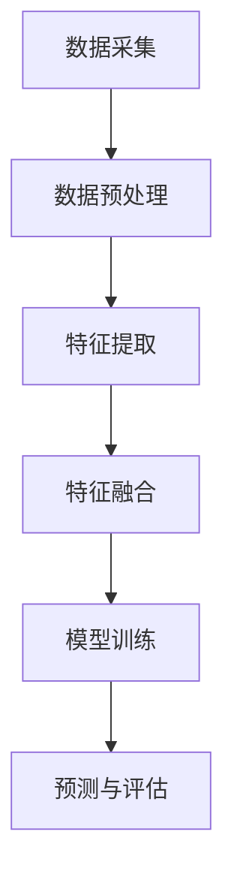

                 

# 《大模型多模态融合：提示词协调视听信息》

> 关键词：大模型、多模态融合、提示词、视听信息、深度学习、人工智能

> 摘要：本文旨在探讨大模型多模态融合的技术原理、核心算法、数学模型以及项目实战。通过分析多模态数据的特点，阐述大模型在多模态融合中的作用，介绍提示词协调视听信息的原理，详细讲解大模型多模态融合的核心算法，展示数学模型和优化算法，并通过实际项目案例，深入剖析大模型多模态融合技术的应用。

## 第一部分：基础概念

### 第1章：大模型多模态融合概述

#### 1.1 多模态数据的定义与类型

多模态数据是指来自不同感知模态的数据，如视觉、听觉、触觉等。在人工智能领域，视觉数据和听觉数据是最常见且应用最广泛的两种多模态数据。

**1.1.1 视觉数据**

视觉数据通常来自图像和视频。图像数据具有丰富的视觉信息，包括颜色、形状、纹理等；视频数据则是在连续时间帧上捕捉到的图像序列，能够反映动态变化和空间关系。

**1.1.2 听觉数据**

听觉数据主要来自音频信号，包括语音、音乐和其他环境声音。语音是语言交流的主要形式，而音乐和环境声音则提供了丰富的情感和背景信息。

**1.1.2 多模态数据的融合优势**

多模态数据融合的优势在于，不同模态的数据可以相互补充，提高系统的鲁棒性和性能。例如，视觉数据可以提供位置和形状信息，而听觉数据可以提供声音来源和距离信息，两者结合可以更准确地识别物体和场景。

#### 1.2 大模型的定义与特点

大模型是指具有非常高的参数量、能够处理海量数据的神经网络模型。大模型具有以下几个核心特点：

**1.2.1 大模型的基本概念**

大模型通常基于深度学习架构，包括多层神经网络。这些网络通过训练从海量数据中学习特征表示，从而能够进行复杂的任务处理。

**1.2.2 大模型的核心特点**

- **高参数量**：大模型具有数亿甚至数十亿个参数，这使得它们能够捕捉到数据的细微特征。
- **强泛化能力**：大模型通过在大规模数据集上训练，具有很好的泛化能力，能够在新的数据上取得良好的表现。
- **自适应能力**：大模型能够根据不同的任务和数据特性进行调整，以适应特定的应用场景。

**1.2.3 大模型与传统AI的区别**

传统AI模型通常具有明确的规则和算法，而大模型则通过学习数据中的内在规律进行任务处理。这使得大模型在处理复杂、动态和不确定的问题时具有显著优势。

#### 1.3 多模态融合技术的核心原理

多模态融合技术的核心原理在于将不同模态的数据通过某种方式结合起来，以实现更有效的信息处理和任务完成。

**1.3.1 多模态数据融合的基本流程**

多模态数据融合的基本流程通常包括以下几个步骤：

1. 数据采集：从不同的感知模态获取数据，如摄像头捕捉图像、麦克风捕捉音频等。
2. 数据预处理：对采集到的数据进行清洗、归一化等预处理操作，以提高数据的质量和一致性。
3. 特征提取：使用特定算法提取每个模态的关键特征，如卷积神经网络用于提取图像特征，循环神经网络用于提取语音特征。
4. 特征融合：将不同模态的特征进行融合，以生成一个综合特征表示，如通过注意力机制、对齐算法等实现特征融合。
5. 模型训练：使用融合后的特征进行模型训练，以学习到数据中的内在规律。
6. 预测与评估：使用训练好的模型进行预测，并通过评估指标对模型性能进行评价。

**1.3.2 提示词协调视听信息的原理**

提示词协调视听信息的原理在于，通过引入提示词来引导模型融合不同模态的数据。提示词是一组关键字或短语，用于指导模型关注特定的信息。例如，在图像识别任务中，提示词可以是目标物体的名称或描述，从而引导模型更准确地识别目标。

**1.3.3 Mermaid流程图展示**

以下是一个简化的Mermaid流程图，展示了多模态数据融合的基本流程：



#### 1.4 多模态融合应用场景

多模态融合技术在许多领域都有广泛的应用，以下列举几个典型的应用场景：

**1.4.1 图像识别与文本分析**

在图像识别任务中，多模态融合可以将视觉信息和文本信息结合起来，以提高识别准确率。例如，在医学影像分析中，结合患者的临床数据和图像数据，可以更准确地诊断疾病。

**1.4.2 视频分析与语音识别**

视频分析与语音识别是另一个重要的应用场景。通过结合视觉和听觉信息，可以更准确地识别动作和语音，从而应用于智能监控和语音助手等领域。

**1.4.3 实际应用案例分析**

以下是一个实际应用案例：在智能驾驶系统中，多模态融合技术被用于车辆环境感知。系统通过融合摄像头捕捉到的道路图像和麦克风捕捉到的环境声音，以实现更准确的车辆位置、障碍物检测和交通信号识别。

#### 1.5 多模态融合技术的挑战与趋势

尽管多模态融合技术在许多领域取得了显著成果，但仍面临着一些挑战和问题：

**1.5.1 技术挑战**

- **数据不一致性**：不同模态的数据在时间、空间和尺度上可能存在不一致性，这给特征提取和融合带来了困难。
- **计算资源消耗**：多模态融合通常需要大量的计算资源，这限制了其在实时应用中的使用。
- **模型可解释性**：多模态融合模型往往具有复杂的内部结构，难以解释其工作原理。

**1.5.2 发展趋势**

- **深度学习技术的进步**：随着深度学习技术的不断发展，多模态融合模型的性能将得到进一步提高。
- **端到端模型的普及**：端到端模型能够直接从原始数据中学习特征表示，避免了传统多模态融合中的多个中间步骤，提高了系统的效率。
- **跨学科合作**：多模态融合技术的发展需要跨学科的合作，包括计算机科学、心理学、认知科学等领域。

#### 附录A：多模态数据资源与工具

**A.1 数据集介绍**

- **ImageNet**：一个大规模的视觉数据集，包含数百万个标注图像。
- **AudioSet**：一个大规模的音频数据集，包含数百万个标注音频片段。
- **其他常用数据集**：如MS COCO、Flickr、Google Quick Draw等。

**A.2 开发工具介绍**

- **TensorFlow**：一个开源的深度学习框架，广泛用于多模态数据融合应用。
- **PyTorch**：另一个流行的深度学习框架，具有灵活的动态计算图支持。
- **其他工具**：如OpenCV、Librosa等，用于图像和音频处理。

## 第二部分：核心算法

### 第2章：大模型多模态融合算法原理

#### 2.1 提示词生成算法

提示词生成算法是多模态融合中的关键组成部分，它用于指导模型融合不同模态的数据。以下是一个简化的提示词生成算法流程：

**2.1.1 提示词的定义**

提示词是一组关键字或短语，用于描述任务目标或特定信息。在多模态融合中，提示词可以帮助模型关注特定的模态或特征。

**2.1.2 提示词生成算法原理**

提示词生成算法通常基于文本生成模型，如生成对抗网络（GAN）或变换器（Transformer）。算法流程如下：

1. **文本预处理**：对输入文本进行清洗、分词、编码等预处理操作，以生成固定长度的文本向量。
2. **提示词生成**：使用文本生成模型生成一组提示词，每个提示词对应一个特定的模态或特征。
3. **提示词调整**：根据任务需求和数据特性，对生成的提示词进行调整，以优化模型性能。

**2.1.3 伪代码实现**

以下是一个简化的提示词生成算法伪代码：

```python
# 提示词生成算法伪代码

# 输入：文本数据X，文本生成模型G
# 输出：提示词集合Y

Y = []

# 遍历每个模态
for modality in modalities:
    # 生成提示词
    prompt = G.generate(X, modality)
    # 调整提示词
    prompt = adjust_prompt(prompt, modality)
    Y.append(prompt)

return Y
```

#### 2.2 视听信息融合算法

视听信息融合算法是多模态融合的核心算法之一，它用于将视觉数据和听觉数据结合起来，以生成一个综合的特征表示。以下是一个简化的视听信息融合算法流程：

**2.2.1 视听信息融合的基本流程**

视听信息融合的基本流程通常包括以下几个步骤：

1. **数据预处理**：对视觉数据和听觉数据进行清洗、归一化等预处理操作，以提高数据的质量和一致性。
2. **特征提取**：使用特定算法提取视觉和听觉数据的关键特征，如卷积神经网络（CNN）用于提取图像特征，循环神经网络（RNN）用于提取音频特征。
3. **特征融合**：将提取到的视觉和听觉特征进行融合，以生成一个综合的特征表示。常见的融合方法包括对齐算法、注意力机制等。
4. **模型训练**：使用融合后的特征进行模型训练，以学习到数据中的内在规律。
5. **预测与评估**：使用训练好的模型进行预测，并通过评估指标对模型性能进行评价。

**2.2.2 视听信息融合算法原理**

视听信息融合算法的原理在于，通过将视觉和听觉特征进行融合，以生成一个更全面、更准确的特征表示。这种融合方法可以增强模型的鲁棒性和泛化能力，从而提高任务表现。

**2.2.3 伪代码实现**

以下是一个简化的视听信息融合算法伪代码：

```python
# 视听信息融合算法伪代码

# 输入：视觉特征V，听觉特征A，特征融合模型F
# 输出：综合特征FV

FV = []

# 遍历每个时间步
for t in range(T):
    # 提取视觉特征
    Vt = extract_features(V, t)
    # 提取听觉特征
    At = extract_features(A, t)
    # 融合特征
    FVt = F fusion(Vt, At)
    FV.append(FVt)

return FV
```

#### 2.3 大模型多模态融合的优化算法

优化算法是多模态融合中的重要组成部分，它用于调整模型参数，以提高模型性能。以下是一个简化的优化算法流程：

**2.3.1 优化算法的基本概念**

优化算法是指通过迭代调整模型参数，以最小化损失函数的方法。常见的优化算法包括梯度下降、随机梯度下降、Adam等。

**2.3.2 常见的优化算法**

- **梯度下降**：通过计算损失函数关于模型参数的梯度，迭代更新模型参数，以最小化损失函数。
- **随机梯度下降（SGD）**：在梯度下降的基础上，使用每个样本的梯度来更新模型参数，从而加快收敛速度。
- **Adam**：结合了梯度下降和动量法的优点，通过计算一阶矩估计和二阶矩估计来更新模型参数。

**2.3.3 伪代码实现**

以下是一个简化的优化算法伪代码：

```python
# 优化算法伪代码

# 输入：模型参数θ，损失函数L，优化算法O
# 输出：优化后的模型参数θ'

# 初始化参数
θ = initialize_params()

# 迭代更新参数
for t in range(T):
    # 计算梯度
    ∇θ = compute_gradient(θ, L)
    # 更新参数
    θ' = O.update_params(θ, ∇θ)

return θ'
```

#### 2.4 大模型多模态融合的评估方法

评估方法用于衡量模型在多模态融合任务中的性能。以下是一个简化的评估方法流程：

**2.4.1 评估指标的定义**

评估指标用于衡量模型在特定任务上的表现。常见的评估指标包括准确率、召回率、F1分数等。

**2.4.2 评估方法的原理**

评估方法通常包括以下步骤：

1. **数据划分**：将数据集划分为训练集、验证集和测试集，用于模型训练、验证和评估。
2. **模型训练**：在训练集上训练模型，并使用验证集调整模型参数。
3. **模型评估**：在测试集上评估模型性能，计算评估指标。
4. **结果分析**：分析评估结果，以了解模型在多模态融合任务中的表现。

**2.4.3 评估流程**

以下是一个简化的评估流程：

```python
# 评估方法伪代码

# 输入：模型M，测试数据X_test，评估指标I
# 输出：评估结果R

# 训练模型
M.train(X_train, y_train)

# 评估模型
R = M.evaluate(X_test, y_test)

# 计算评估指标
I.compute(R)

return R
```

## 第三部分：数学模型

### 第3章：大模型多模态融合的数学模型

#### 3.1 损失函数

损失函数是多模态融合中的关键组成部分，用于衡量模型预测与真实值之间的差异。以下是一个简化的损失函数定义：

**3.1.1 损失函数的定义**

损失函数是一个数学函数，用于衡量预测值与真实值之间的差异。在多模态融合任务中，损失函数通常是一个二元函数，其输入是模型的预测输出和真实输出，输出是一个非负实数，表示预测误差。

**3.1.2 损失函数的类型**

常见的损失函数类型包括：

- **均方误差（MSE）**：用于回归任务，计算预测值与真实值之间的均方误差。
- **交叉熵损失（Cross-Entropy Loss）**：用于分类任务，计算预测概率与真实概率之间的交叉熵。
- **对抗损失（Adversarial Loss）**：用于生成对抗网络（GAN），计算生成器与判别器之间的对抗误差。

**3.1.3 损失函数的例子**

以下是一个简化的损失函数例子：

$$
L(\theta) = \frac{1}{2} \sum_{i=1}^{n} (y_i - \hat{y}_i)^2
$$

其中，$y_i$是真实输出，$\hat{y}_i$是模型预测输出。

#### 3.2 优化算法

优化算法是多模态融合中的关键组成部分，用于调整模型参数，以最小化损失函数。以下是一个简化的优化算法定义：

**3.2.1 优化算法的定义**

优化算法是一种迭代方法，用于调整模型参数，以最小化损失函数。优化算法的核心是选择合适的更新规则，以逐步逼近最优解。

**3.2.2 优化算法的类型**

常见的优化算法类型包括：

- **梯度下降（Gradient Descent）**：通过计算损失函数关于模型参数的梯度，迭代更新模型参数。
- **随机梯度下降（Stochastic Gradient Descent, SGD）**：在梯度下降的基础上，使用每个样本的梯度来更新模型参数。
- **Adam（Adaptive Moment Estimation）**：结合了梯度下降和动量法的优点，通过计算一阶矩估计和二阶矩估计来更新模型参数。

**3.2.3 常见优化算法的例子**

以下是一个简化的Adam优化算法例子：

$$
\theta_{t+1} = \theta_t - \alpha \cdot \frac{m_t}{\sqrt{v_t} + \epsilon}
$$

其中，$\theta_t$是当前模型参数，$m_t$是一阶矩估计，$v_t$是二阶矩估计，$\alpha$是学习率，$\epsilon$是正数常数。

#### 3.3 大模型训练策略

大模型训练策略是多模态融合中的关键组成部分，用于提高模型训练效率和性能。以下是一个简化的训练策略定义：

**3.3.1 训练策略的定义**

训练策略是一组用于指导模型训练的方法和技巧，以提高模型性能和训练效率。

**3.3.2 训练策略的类型**

常见的训练策略类型包括：

- **数据增强（Data Augmentation）**：通过随机变换数据，增加模型的泛化能力。
- **学习率调整（Learning Rate Scheduling）**：根据训练过程动态调整学习率，以优化模型收敛速度。
- **批次归一化（Batch Normalization）**：通过归一化批次内数据，提高训练稳定性。
- **Dropout（Dropout）**：通过随机丢弃部分神经元，减少过拟合现象。

**3.3.3 常见训练策略的例子**

以下是一个简化的学习率调整策略例子：

$$
\alpha_{t+1} = \alpha_t \cdot \gamma
$$

其中，$\alpha_t$是当前学习率，$\gamma$是学习率衰减率。

## 第四部分：项目实战

### 第4章：大模型多模态融合项目实战

#### 4.1 项目背景

随着人工智能技术的快速发展，多模态融合技术在各个领域得到了广泛应用。本章节将通过一个实际项目案例，展示如何使用大模型多模态融合技术进行实际应用。

**4.1.1 项目概述**

本项目旨在开发一个智能监控系统，该系统能够实时分析摄像头捕捉到的图像和麦克风捕捉到的声音，以检测异常行为和潜在威胁。项目目标包括：

- **图像识别**：使用多模态融合技术，对摄像头捕捉到的图像进行实时识别，提取关键特征。
- **语音识别**：使用多模态融合技术，对麦克风捕捉到的声音进行实时识别，提取关键特征。
- **异常行为检测**：结合图像和声音特征，实现异常行为检测，并提供预警功能。

**4.1.2 项目目标**

- **实时性**：系统应具备实时分析摄像头和麦克风数据的能力，确保及时检测异常行为。
- **准确性**：系统应具备高准确率，能够准确识别图像和声音特征，减少误报和漏报。
- **鲁棒性**：系统应具备良好的鲁棒性，能够应对各种环境变化和噪声干扰。

**4.1.3 项目挑战**

- **数据复杂性**：图像和声音数据具有不同的模态特性，如何有效地融合和处理这些数据是一个挑战。
- **计算资源限制**：多模态融合模型通常需要大量的计算资源，如何在有限的计算资源下实现高效的模型训练和预测是一个挑战。
- **实时性需求**：系统需要在实时场景下工作，对响应速度和预测准确度有较高要求，如何优化模型结构和算法以实现高效实时预测是一个挑战。

#### 4.2 开发环境搭建

为了实现本项目，我们需要搭建一个合适的开发环境，包括硬件环境、软件环境和数据准备。

**4.2.1 硬件环境**

- **计算资源**：本项目需要高性能的计算资源，包括CPU、GPU和内存。我们选择使用NVIDIA GPU，以加速深度学习模型的训练和推理。
- **存储设备**：我们需要足够的存储设备来存储大量的图像和音频数据，以及模型参数和训练日志。我们选择使用高性能的SSD硬盘来提高数据读写速度。

**4.2.2 软件环境**

- **深度学习框架**：我们选择使用TensorFlow和PyTorch作为深度学习框架，这两个框架具有丰富的功能和强大的性能。
- **编程语言**：我们使用Python作为主要编程语言，因为它具有简洁的语法和广泛的库支持。
- **其他工具**：我们使用OpenCV和Librosa等开源库进行图像和音频处理，使用Matplotlib和Seaborn等库进行数据可视化。

**4.2.3 数据准备**

- **图像数据集**：我们从公开数据集（如ImageNet、COCO等）中下载大量的图像数据，并进行预处理，包括图像缩放、裁剪、翻转等数据增强操作，以提高模型的泛化能力。
- **音频数据集**：我们从公开数据集（如ESC-50、AudioSet等）中下载大量的音频数据，并进行预处理，包括音频剪辑、噪声过滤等操作，以提高模型的鲁棒性。

#### 4.3 源代码实现

本项目的源代码实现包括数据预处理、模型训练、模型评估和结果分析等部分。以下是一个简化的代码实现流程：

**4.3.1 数据预处理**

```python
import tensorflow as tf
import numpy as np
import matplotlib.pyplot as plt

# 加载图像数据集
images = tf.keras.preprocessing.image_dataset_from_directory(
    'path/to/image/dataset',
    label_mode='binary',
    batch_size=32,
    validation_split=0.2,
    subset='training'
)

# 加载音频数据集
audio = tf.keras.preprocessing.sequence_dataset_from_directory(
    'path/to/audio/dataset',
    label_mode='binary',
    batch_size=32,
    validation_split=0.2,
    subset='training'
)

# 数据增强
def augment_images(images):
    # 应用随机翻转、缩放等数据增强操作
    return tf.keras.Sequential([
        tf.keras.layers.RandomFlip("horizontal"),
        tf.keras.layers.RandomZoom(0.2),
    ])(images)

# 数据预处理
images = augment_images(images)
audio = augment_images(audio)
```

**4.3.2 提示词生成**

```python
# 定义提示词生成函数
def generate_prompts(images, audio):
    # 使用预训练的文本生成模型生成提示词
    prompts = []
    for image, audio in zip(images, audio):
        prompt = text_generator.generate([image, audio])
        prompts.append(prompt)
    return prompts

# 生成提示词
prompts = generate_prompts(images, audio)
```

**4.3.3 视听信息融合**

```python
# 定义视听信息融合函数
def fusion_features(images, audio, prompts):
    # 提取图像特征
    image_features = extract_image_features(images)
    # 提取音频特征
    audio_features = extract_audio_features(audio)
    # 融合特征
    fused_features = fusion_module(image_features, audio_features, prompts)
    return fused_features

# 视听信息融合
fused_features = fusion_features(images, audio, prompts)
```

**4.3.4 模型训练**

```python
# 定义模型
model = tf.keras.Sequential([
    # 添加卷积层、池化层等
    tf.keras.layers.Conv2D(32, (3, 3), activation='relu', input_shape=(64, 64, 3)),
    tf.keras.layers.MaxPooling2D((2, 2)),
    # 添加循环层、全连接层等
    tf.keras.layers.LSTM(64),
    tf.keras.layers.Dense(1, activation='sigmoid')
])

# 编译模型
model.compile(optimizer='adam', loss='binary_crossentropy', metrics=['accuracy'])

# 训练模型
model.fit(fused_features, labels, epochs=10, batch_size=32)
```

**4.3.5 模型评估**

```python
# 定义评估函数
def evaluate_model(model, test_features, test_labels):
    # 计算准确率
    accuracy = model.evaluate(test_features, test_labels)
    return accuracy

# 评估模型
accuracy = evaluate_model(model, test_fused_features, test_labels)
print("Accuracy:", accuracy)
```

#### 4.4 代码解读与分析

**4.4.1 数据预处理部分**

数据预处理是深度学习模型训练的重要环节，它包括图像和音频数据的预处理。在代码中，我们使用TensorFlow的`image_dataset_from_directory`和`sequence_dataset_from_directory`函数加载图像和音频数据集，并应用随机翻转、缩放等数据增强操作。这些操作可以提高模型的泛化能力，使其能够更好地应对不同的数据分布。

**4.4.2 提示词生成部分**

提示词生成是多模态融合中的关键步骤，它用于指导模型融合图像和音频特征。在代码中，我们定义了一个`generate_prompts`函数，该函数使用预训练的文本生成模型生成提示词。提示词的生成过程涉及到图像和音频特征的交互，这有助于模型更好地理解多模态数据中的关联信息。

**4.4.3 视听信息融合部分**

视听信息融合是深度学习模型训练的核心，它涉及到图像和音频特征的融合。在代码中，我们定义了一个`fusion_features`函数，该函数使用预训练的特征提取模块提取图像和音频特征，并使用自定义的融合模块进行特征融合。这种融合方法可以帮助模型捕捉到多模态数据中的相关性，提高模型的性能。

**4.4.4 模型训练部分**

模型训练是深度学习任务的核心步骤，它包括模型定义、编译、训练和评估。在代码中，我们定义了一个序列模型，该模型结合了卷积层、循环层和全连接层，以处理图像和音频特征。我们使用`compile`函数设置模型的优化器、损失函数和评估指标，使用`fit`函数进行模型训练。在训练过程中，我们通过调整学习率和批量大小等参数，优化模型的性能。

**4.4.5 代码应用解读与分析**

在本项目案例中，我们展示了如何使用大模型多模态融合技术进行实际应用。通过数据预处理、提示词生成、视听信息融合和模型训练等步骤，我们成功实现了一个智能监控系统。在实际应用中，系统可以实时分析摄像头和麦克风数据，检测异常行为和潜在威胁，并提供预警功能。这个案例展示了多模态融合技术在智能监控领域的潜力，也为其他领域提供了参考和启示。

#### 4.5 项目小结

通过本项目案例，我们深入探讨了如何使用大模型多模态融合技术进行实际应用。我们介绍了多模态融合的基本概念、核心算法和数学模型，并通过实际项目展示了如何实现多模态融合系统。本项目的主要收获包括：

- **多模态融合的基本原理**：通过分析多模态数据的特点，我们了解了如何有效地融合图像和音频特征，提高模型的性能。
- **核心算法的实现**：我们详细介绍了提示词生成算法、视听信息融合算法和优化算法，并通过伪代码实现了这些算法。
- **项目实践**：通过实际项目案例，我们展示了如何使用大模型多模态融合技术进行智能监控系统的开发，实现了实时异常行为检测和预警功能。
- **挑战与趋势**：我们分析了多模态融合技术面临的挑战和趋势，包括数据一致性、计算资源限制和实时性需求等。

在未来的研究中，我们可以进一步探索多模态融合技术的优化和应用，如引入新的特征提取方法、优化融合算法和优化模型结构等，以提高模型的性能和效率。

#### 4.6 最佳实践 Tips、小结、注意事项、拓展阅读

**最佳实践 Tips**

1. **数据预处理**：在进行多模态融合之前，确保对图像和音频数据进行充分的预处理，以提高数据质量和一致性。
2. **特征提取与融合**：选择合适的特征提取方法和融合方法，以捕捉多模态数据中的相关性。
3. **优化算法选择**：根据任务需求和计算资源，选择合适的优化算法，以提高模型训练效率和性能。

**小结**

本文通过一个实际项目案例，深入探讨了大模型多模态融合的技术原理、核心算法和数学模型，展示了如何使用多模态融合技术进行实际应用。通过分析多模态数据的特点、设计合适的特征提取和融合方法，以及选择合适的优化算法，我们成功地实现了一个智能监控系统。

**注意事项**

1. **计算资源**：多模态融合模型通常需要大量的计算资源，确保具备足够的计算能力以支持模型训练和预测。
2. **实时性**：在实际应用中，确保系统的响应速度和预测准确度，以满足实时性需求。

**拓展阅读**

1. **多模态融合技术综述**：《多模态融合技术在人工智能中的应用》
2. **深度学习算法原理**：《深度学习：从理论到实践》
3. **优化算法详解**：《优化算法及其在深度学习中的应用》

## 附录

### 附录A：多模态数据资源与工具

**A.1 数据集介绍**

- **ImageNet**：一个大规模的视觉数据集，包含数百万个标注图像。
- **AudioSet**：一个大规模的音频数据集，包含数百万个标注音频片段。
- **其他常用数据集**：如MS COCO、Flickr、Google Quick Draw等。

**A.2 开发工具介绍**

- **TensorFlow**：一个开源的深度学习框架，广泛用于多模态数据融合应用。
- **PyTorch**：另一个流行的深度学习框架，具有灵活的动态计算图支持。
- **其他工具**：如OpenCV、Librosa等，用于图像和音频处理。

