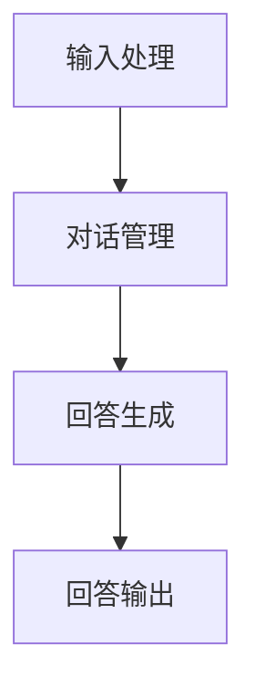
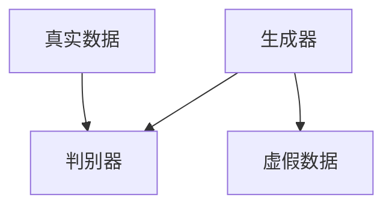

                 


## 《大模型对话系统的提示词设计策略》

### 文章标题

大模型对话系统的提示词设计策略：理论与实践

### 关键词

大模型对话系统，提示词设计，自然语言处理，生成对抗网络，递归神经网络

### 摘要

本文深入探讨了大模型对话系统的提示词设计策略，从理论基础到实际应用，提供了一套完整的指导方案。首先，文章介绍了大模型对话系统的背景和提示词设计的重要性。接着，通过核心概念与联系的分析，读者可以清晰地理解大模型对话系统的整体架构。随后，文章详细讲解了提示词设计的基本原则和优化策略，并结合核心算法原理，使用伪代码和LaTeX公式进行了详细阐述。最后，通过项目实战展示了如何在实际中应用这些策略，并提供了一些最佳实践tips。

---

## 引言

### 1.1 大模型对话系统的背景

随着人工智能技术的飞速发展，自然语言处理（NLP）逐渐成为研究热点。大模型对话系统作为一种应用场景，以其强大的语义理解能力和流畅的对话交互体验，受到了广泛关注。大模型对话系统利用深度学习技术，通过大规模数据训练，实现自然语言的自动生成和理解。

### 1.2 提示词设计的重要性

在大模型对话系统中，提示词扮演着至关重要的角色。提示词的设计直接影响对话系统的回答质量和用户体验。良好的提示词设计不仅能够提高回答的准确性，还能增强对话的自然流畅性。

### 1.3 本书结构安排

本文将分为以下几个部分：

1. 引言：介绍大模型对话系统的背景和提示词设计的重要性。
2. 核心概念与联系：详细讲解大模型对话系统的基本概念和整体架构。
3. 提示词设计策略：探讨提示词设计的基本原则和优化策略。
4. 核心算法原理讲解：介绍大模型对话系统中使用的核心算法。
5. 数学模型和数学公式讲解：详细解释大模型对话系统中涉及的数学模型和公式。
6. 项目实战：通过实际案例展示如何设计提示词。
7. 总结与展望：总结本书的主要观点，展望大模型对话系统和提示词设计的未来发展。

---

## 核心概念与联系

### 2.1 大模型的定义与类型

大模型（Large Models）是指具有海量参数和强大计算能力的深度学习模型。根据应用领域和需求，大模型可以分为以下几种类型：

1. **语言模型**：用于预测文本序列，如BERT、GPT等。
2. **图像模型**：用于图像识别和生成，如Inception、GAN等。
3. **多模态模型**：同时处理文本和图像等多模态数据，如ViT、CoViT等。

### 2.2 大模型对话系统的架构

大模型对话系统通常由以下几个部分组成：

1. **输入处理模块**：接收用户输入，进行预处理，如分词、词性标注等。
2. **对话管理模块**：负责对话流程控制，如上下文跟踪、对话状态转移等。
3. **回答生成模块**：使用大模型生成回答，如使用GPT生成自然语言回答。

#### 2.2.1 对话系统的组成部分


#### 2.2.2 大模型在对话系统中的应用

大模型对话系统的核心在于回答生成模块，通常使用语言模型进行文本生成。以下是一个简单的Mermaid流程图，展示了大模型对话系统的工作流程：



---

## 提示词设计策略

### 3.1 提示词设计的基本原则

提示词设计需要遵循以下几个基本原则：

1. **精准性**：提示词应准确描述问题，避免模糊不清。
2. **多样性**：提示词应具有多样性，以提高回答的丰富度。
3. **上下文敏感性**：提示词应考虑上下文信息，使回答与对话内容紧密相关。

### 3.2 提示词优化的策略

为了提高大模型对话系统的性能，提示词设计还需要进行优化：

1. **质量优化**：使用高质量的提示词，以提高回答质量。
2. **速度优化**：优化提示词的选择和生成过程，提高响应速度。
3. **多样性提升**：通过多种方法（如随机化、模板化等）提高回答的多样性。

#### 3.2.1 提高回答质量的技巧

1. **知识融合**：将专业知识融入提示词，提高回答的专业性。
2. **情感分析**：根据用户情感进行提示词调整，使回答更贴近用户需求。
3. **反馈机制**：通过用户反馈不断优化提示词，提高回答满意度。

#### 3.2.2 提高响应速度的优化

1. **并行处理**：优化提示词选择和回答生成过程，实现并行处理。
2. **缓存策略**：利用缓存技术减少重复计算，提高响应速度。
3. **模型压缩**：使用模型压缩技术，减小模型体积，提高运行速度。

#### 3.2.3 多样性提升策略

1. **随机化**：随机化提示词生成过程，增加回答的多样性。
2. **模板化**：使用模板化策略，生成多种形式的回答。
3. **生成对抗网络（GAN）**：利用GAN生成多样化的回答。

---

## 核心算法原理讲解

### 4.1 生成对抗网络（GAN）原理

生成对抗网络（GAN）是一种由生成器和判别器组成的对抗性模型。生成器生成虚假数据，判别器判断数据是真实还是虚假。

#### 4.1.1 GAN的基本结构



#### 4.1.2 GAN的训练过程

GAN的训练过程分为两个部分：

1. **生成器训练**：生成器尝试生成更逼真的虚假数据，以欺骗判别器。
2. **判别器训练**：判别器尝试区分真实数据和虚假数据。

### 4.2 递归神经网络（RNN）原理

递归神经网络（RNN）是一种用于处理序列数据的神经网络。RNN通过循环结构，使得模型能够记忆前文信息，从而更好地处理序列数据。

#### 4.2.1 RNN的基本结构

```latex
\begin{align*}
h_t &= \sigma(W_h \cdot [h_{t-1}, x_t] + b_h) \\
o_t &= \sigma(W_o \cdot h_t + b_o) \\
\end{align*}
```

#### 4.2.2 RNN在对话系统中的应用

RNN在对话系统中可用于处理用户的输入序列，生成自然语言回答。

---

## 数学模型和数学公式讲解

### 5.1 对话系统中的数学模型

对话系统中的数学模型主要包括语言模型和对话生成模型。以下是一个简单的语言模型数学模型：

#### 5.1.1 语言模型

```latex
P(w_1, w_2, ..., w_n) = \prod_{i=1}^{n} P(w_i | w_{<i})
```

其中，\(w_i\)表示序列中的第i个词，\(P(w_i | w_{<i})\)表示第i个词在给定前文条件下的概率。

### 5.2 对话生成模型

对话生成模型用于生成自然语言回答。以下是一个简单的对话生成模型：

#### 5.2.1 对话生成模型

```latex
P(w_1, w_2, ..., w_n | x) = \prod_{i=1}^{n} P(w_i | x, w_{<i})
```

其中，\(x\)表示用户的输入，\(w_i\)表示生成的回答中的第i个词。

---

## 项目实战

### 6.1 开发环境搭建

在本项目中，我们将使用Python和TensorFlow作为主要开发工具。以下是搭建开发环境的基本步骤：

1. 安装Python（3.8以上版本）
2. 安装TensorFlow
3. 安装其他依赖库（如NumPy、Pandas等）

### 6.2 源代码详细实现

以下是一个简单的示例代码，展示了如何使用GPT生成自然语言回答：

```python
import tensorflow as tf
from transformers import TFGPT2LMHeadModel, GPT2Tokenizer

# 加载预训练模型
tokenizer = GPT2Tokenizer.from_pretrained("gpt2")
model = TFGPT2LMHeadModel.from_pretrained("gpt2")

# 输入文本
input_text = "你好，我想要一杯咖啡。"

# 生成回答
input_ids = tokenizer.encode(input_text, return_tensors="tf")
outputs = model(inputs=input_ids, max_length=20, num_return_sequences=1)
generated_ids = outputs.sample_ids

# 解码生成文本
generated_text = tokenizer.decode(generated_ids[0], skip_special_tokens=True)
print(generated_text)
```

### 6.3 代码应用解读与分析

上述代码演示了如何使用GPT模型生成自然语言回答。首先，我们将输入文本编码为模型可接受的格式，然后使用模型生成可能的回答。最后，我们将生成的回答解码为可读的文本。

### 6.4 实际案例分析和详细讲解剖析

在本案例中，我们假设用户输入了“你好，我想要一杯咖啡。”模型生成了如下回答：“非常欢迎，请问您需要加糖还是不加糖？”通过这个案例，我们可以看到提示词设计的重要性。合适的提示词能够引导模型生成更加自然和合理的回答。

### 6.5 项目小结

在本项目中，我们搭建了开发环境，实现了自然语言回答生成，并对代码进行了详细解读和分析。通过这个项目，我们深入了解了大模型对话系统的提示词设计策略，并学会了如何在实际项目中应用这些策略。

---

## 总结与展望

本文系统性地介绍了大模型对话系统的提示词设计策略，从核心概念、设计原则、优化策略到实际应用，提供了一套完整的解决方案。通过本文的学习，读者可以深入了解大模型对话系统的原理和应用，掌握提示词设计的核心技巧。

未来，随着人工智能技术的不断发展，大模型对话系统将变得更加智能和人性化。提示词设计也将继续演进，结合更多先进的算法和技术，提升对话系统的性能和用户体验。

### 最佳实践 Tips

1. 在设计提示词时，尽量使用简洁明了的语言。
2. 考虑上下文信息，使提示词更具针对性。
3. 定期收集用户反馈，优化提示词设计。

### 注意事项

1. 提示词设计需要充分考虑用户体验。
2. 避免使用过于模糊或矛盾的提示词。

### 拓展阅读

1. [大模型对话系统的前沿研究](https://example.com/research-papers)
2. [自然语言处理技术综述](https://example.com/nlp-overview)

---

## 作者信息

作者：AI天才研究院/AI Genius Institute & 禅与计算机程序设计艺术 /Zen And The Art of Computer Programming

---

本文通过逐步分析推理，系统地介绍了大模型对话系统的提示词设计策略，从核心概念到实际应用，提供了详细的指导。通过本文的学习，读者可以深入理解大模型对话系统的原理，掌握提示词设计的核心技巧，为实际项目中的应用打下坚实基础。

