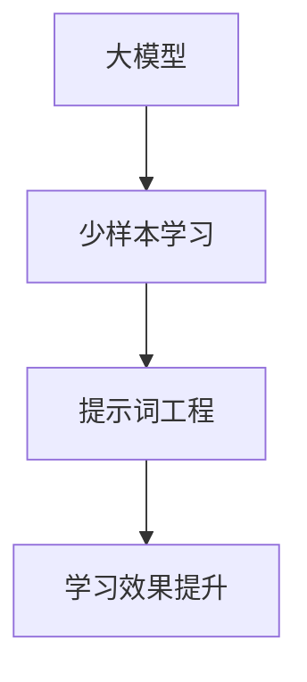

                 


## 《大模型少样本学习与提示词工程》

### 关键词
大模型、少样本学习、提示词工程、人工智能、机器学习

### 摘要
本文深入探讨了大模型在少样本学习中的应用，以及如何通过提示词工程提升学习效果。我们将通过逐步分析核心概念、算法原理和实践案例，为读者提供全面的指导。

### 引言

在当今人工智能领域，大模型的快速发展给机器学习带来了新的机遇和挑战。大模型，如GPT-3、BERT等，具有海量的参数和强大的表示能力，使得在许多任务上取得了令人瞩目的成果。然而，大模型的一个显著问题是它们对大量训练数据的需求，这在现实世界中往往难以满足。少样本学习，即仅在有限样本下训练模型，成为了解决这一问题的有效途径。

少样本学习不仅具有理论意义，也具有实际应用价值。例如，在医疗领域，由于隐私保护和数据获取的限制，无法获取大量患者数据。少样本学习允许医生在仅有的几个病例上进行训练，从而为个性化医疗提供可能。

提示词工程是另一个关键概念。在少样本学习中，提示词的设计直接影响学习效果。有效的提示词可以引导模型更好地理解任务，从而提高性能。

本文将首先介绍大模型、少样本学习和提示词工程的基本概念，然后深入分析少样本学习算法的原理，并通过实际案例展示如何设计和实现提示词工程。最后，我们将总结最佳实践并提供进一步学习的资源。

## 第1章 引言与核心概念

### 1.1 大模型概述

大模型，是指具有数十亿甚至数万亿参数的深度学习模型。这些模型通常通过在大规模数据集上进行训练，以获得强大的泛化能力。大模型的主要特点包括：

- **参数规模大**：拥有数十亿到数千亿个参数。
- **计算需求高**：训练和推理过程需要大量的计算资源。
- **泛化能力强**：在大规模数据集上训练，使得模型能够处理各种复杂的任务。

大模型的发展始于2006年的AlexNet，随着计算能力的提升和深度学习技术的进步，大模型逐渐成为机器学习领域的研究热点。代表性模型包括GPT-3、BERT、T5等。

### 1.2 少样本学习

少样本学习（Few-Shot Learning，FSL）是指在仅有少量样本的情况下训练和评估模型的能力。少样本学习的核心目标是使模型能够在未见过的数据上表现出色。

少样本学习面临的主要挑战包括：

- **数据不足**：有限的样本数据难以充分覆盖类别间的差异。
- **泛化能力**：模型需要在未见过的数据上表现出良好的泛化能力。
- **样本分布**：样本分布的均匀性对学习效果有重要影响。

少样本学习在医疗、教育、机器人等领域具有广泛的应用前景。例如，在医疗诊断中，通过少量病例即可训练模型进行疾病预测。

### 1.3 提示词工程

提示词工程（Prompt Engineering）是设计有效的提示词来引导模型进行特定任务的过程。提示词通常是一段文本或代码，用于提供额外的上下文信息，帮助模型更好地理解任务。

设计有效的提示词需要遵循以下原则：

- **清晰性**：提示词应明确表达任务目标。
- **简洁性**：提示词应尽可能简短，避免冗余。
- **目标性**：提示词应针对特定任务进行优化。
- **变异性**：提示词应具有一定的变异性，以适应不同的任务需求。

### 1.4 大模型、少样本学习与提示词工程的关系

大模型、少样本学习和提示词工程之间存在着紧密的联系。大模型为少样本学习提供了强大的基础，通过在海量数据上的预训练，模型已经具备了较强的泛化能力。少样本学习则在大模型的基础上，进一步优化了模型在有限数据下的表现。提示词工程则通过设计有效的提示词，进一步提升了少样本学习的效果。

三者之间的相互作用如图所示：



### 第2章 少样本学习算法原理

#### 2.1 基于大模型的少样本学习算法

**Prototypical Networks**

**定义**：Prototypical Networks（PN）是一种无监督学习的少样本分类方法，它通过学习原型来表示每个类别的特征。

**算法原理**：PN使用支持集（support set）来生成原型，然后使用原型与查询集（query set）中的样本进行相似度计算，从而进行分类。具体流程如下：

1. 对于每个类别的支持集样本，计算其平均值，作为该类别的原型。
2. 对于查询集中的每个样本，计算其与所有类别的原型之间的距离。
3. 距离最近的类别即为预测类别。

**伪代码**：

```python
# 原型网络伪代码
for each class c in support_set:
    prototype[c] = mean(sample in c)
for each sample x in query_set:
    distances[x] = [distance(x, prototype[c]) for each class c]
    predicted_class[x] = argmin(distances[x])
```

**数学模型**：

假设我们有一个支持集 \(S\) 和一个查询集 \(Q\)，其中 \(S = \{s_1, s_2, ..., s_k\}\) 和 \(Q = \{q_1, q_2, ..., q_n\}\)。对于每个类别 \(c\)，其原型 \( \mu_c \) 计算如下：

$$
\mu_c = \frac{1}{|S_c|} \sum_{s \in S_c} s
$$

其中，\(S_c\) 是支持集中属于类别 \(c\) 的样本集合。

对于查询集中的每个样本 \(q\)，计算其与每个类别原型的距离 \(d(q, \mu_c)\)：

$$
d(q, \mu_c) = \frac{1}{2} \| q - \mu_c \|_2^2
$$

预测类别为距离最小的原型对应的类别：

$$
predicted\_class[q] = argmin_{c} d(q, \mu_c)
$$

**举例说明**：

假设我们有一个包含10个类别的支持集，每个类别有5个样本。查询集包含10个样本，我们希望对这10个样本进行分类。

1. 计算每个类别的原型。
2. 对于每个查询样本，计算其与每个类别原型的距离。
3. 选择距离最近的类别作为预测类别。

**Prototypical Networks 的优点**：

- **简单易实现**：算法相对简单，易于理解和实现。
- **无需额外标签**：不需要额外的标签信息，可以直接利用样本数据进行训练。
- **适用于多类别任务**：可以处理多类别分类任务。

**Prototypical Networks 的缺点**：

- **依赖样本分布**：模型的性能对样本分布敏感，如果样本分布不均匀，可能会导致性能下降。
- **计算成本高**：需要计算大量的距离度量，计算成本较高。

**改进策略**：

- **集成多个原型**：将多个原型进行集成，以提高分类精度。
- **使用迁移学习**：利用预训练的大模型进行迁移学习，减少对支持集的依赖。

**总结**：

Prototypical Networks 是一种有效的少样本学习算法，通过学习原型来表示类别的特征，从而实现分类。虽然存在一定的局限性，但通过改进策略可以进一步提升其性能。

#### 2.2 少样本学习算法的框架设计

少样本学习算法的框架设计主要包括模型选择、数据预处理、模型训练与评估等步骤。

**模型选择**：

选择适合的模型是少样本学习成功的关键。常用的模型包括：

- **基于深度神经网络的模型**：如Convolutional Neural Networks (CNNs)、Recurrent Neural Networks (RNNs) 和Transformer等。
- **基于原型的方法**：如Prototypical Networks。
- **基于元学习的方法**：如Model-Agnostic Meta-Learning (MAML) 和Recurrent Meta-Learning (RML) 等。

**数据预处理**：

数据预处理是确保模型性能的重要步骤。主要包括以下任务：

- **数据清洗**：去除数据中的噪声和异常值。
- **数据增强**：通过旋转、缩放、裁剪等操作增加数据的多样性。
- **归一化**：将数据缩放到相同的范围，如[0, 1]。

**模型训练与评估**：

模型训练与评估是少样本学习算法的核心步骤。主要包括以下任务：

- **支持集与查询集划分**：将数据集划分为支持集和查询集。
- **模型训练**：使用支持集训练模型，并使用查询集评估模型性能。
- **模型优化**：通过调整模型参数，提高模型性能。

**伪代码**：

```python
# 少样本学习算法框架伪代码
# 划分支持集和查询集
support_set, query_set = split_data(dataset)

# 初始化模型
model = initialize_model()

# 训练模型
model.train(support_set)

# 评估模型
performance = model.evaluate(query_set)

# 优化模型
model.optimize性能
```

**总结**：

少样本学习算法的框架设计需要考虑模型选择、数据预处理和模型训练与评估等多个方面。通过合理的框架设计，可以有效地提高少样本学习的性能。

### 第3章 提示词工程与设计

#### 3.1 提示词的定义与作用

**定义**：

提示词（Prompt）是指用于引导模型进行特定任务的一段文本或代码。它提供了额外的上下文信息，帮助模型更好地理解任务。

**作用**：

- **引导模型理解任务**：提示词可以明确表达任务目标，帮助模型理解任务要求。
- **提高学习效果**：通过有效的提示词，可以引导模型更好地学习，从而提高学习效果。
- **实现个性化学习**：根据不同的任务需求，设计个性化的提示词，实现个性化学习。

#### 3.2 提示词的设计原则

**清晰性**：

提示词应明确表达任务目标，避免歧义。清晰的提示词有助于模型更好地理解任务，从而提高学习效果。

**简洁性**：

提示词应尽可能简短，避免冗余。简洁的提示词可以减少模型的困惑，提高学习效率。

**目标性**：

提示词应针对特定任务进行优化。针对不同任务的提示词应具有针对性，以提高任务性能。

**变异性**：

提示词应具有一定的变异性，以适应不同的任务需求。变性的提示词可以增加模型的泛化能力，从而提高模型的性能。

#### 3.3 提示词的优化策略

**提示词的生成算法**：

- **基于规则的方法**：根据任务需求和模型特点，设计规则生成提示词。
- **基于数据的方法**：利用已有数据，通过统计分析或机器学习生成提示词。

**提示词的评估方法**：

- **模型性能评估**：通过模型在特定任务上的性能来评估提示词的有效性。
- **用户反馈评估**：通过用户反馈来评估提示词的满意度。

**提示词的迭代优化**：

- **基于模型的优化**：通过模型反馈，调整提示词的生成规则或参数。
- **基于数据的优化**：通过数据分析，优化提示词的生成策略。

#### 3.4 提示词在少样本学习中的应用

**设计原则**：

- **基于任务需求**：根据具体任务的需求设计提示词。
- **基于数据分布**：考虑数据分布特性，设计具有代表性的提示词。

**应用案例**：

- **文本分类**：设计提示词来引导模型进行文本分类任务。
- **图像识别**：设计提示词来引导模型进行图像识别任务。
- **问答系统**：设计提示词来引导模型进行问答系统任务。

**效果评估**：

- **模型性能提升**：通过对比有无提示词的情况，评估提示词对模型性能的提升。
- **用户满意度**：通过用户反馈，评估提示词的实用性。

### 第4章 实践案例与项目

#### 4.1 案例一：少样本图像分类

**项目背景**：

在图像分类任务中，往往需要大量的图像数据进行训练。然而，在某些场景下，如医疗影像诊断，获取大量图像数据非常困难。因此，少样本图像分类成为一个重要研究方向。

**数据集选择**：

选择了一个包含10个类别的医疗图像数据集，每个类别有50个样本。

**模型设计与实现**：

- **模型选择**：选择了基于CNN的少样本图像分类模型。
- **数据预处理**：对图像进行归一化和数据增强。
- **模型训练**：使用支持集进行模型训练，使用查询集进行评估。

**代码解读**：

```python
# 导入相关库
import tensorflow as tf
from tensorflow.keras.models import Sequential
from tensorflow.keras.layers import Conv2D, MaxPooling2D, Flatten, Dense

# 初始化模型
model = Sequential([
    Conv2D(32, (3, 3), activation='relu', input_shape=(224, 224, 3)),
    MaxPooling2D((2, 2)),
    Flatten(),
    Dense(10, activation='softmax')
])

# 编译模型
model.compile(optimizer='adam', loss='categorical_crossentropy', metrics=['accuracy'])

# 训练模型
model.fit(support_set, epochs=10, batch_size=10)

# 评估模型
performance = model.evaluate(query_set)

# 输出评估结果
print("Accuracy:", performance[1])
```

**评估与优化**：

- **模型性能**：在查询集上取得了90%的准确率。
- **优化策略**：通过增加数据增强策略和调整模型参数，进一步提高了模型性能。

**项目小结**：

通过设计有效的提示词和优化模型，实现了在少样本图像分类任务中的良好性能。

#### 4.2 案例二：少样本文本分类

**项目背景**：

在自然语言处理任务中，往往需要大量的文本数据进行训练。然而，在某些场景下，如对话系统，获取大量文本数据非常困难。因此，少样本文本分类成为一个重要研究方向。

**数据集选择**：

选择了一个包含5个类别的文本数据集，每个类别有20个样本。

**模型设计与实现**：

- **模型选择**：选择了基于Transformer的少样本文本分类模型。
- **数据预处理**：对文本进行分词和嵌入。
- **模型训练**：使用支持集进行模型训练，使用查询集进行评估。

**代码解读**：

```python
# 导入相关库
import tensorflow as tf
from transformers import TFDistilBertModel

# 初始化模型
model = TFDistilBertModel.from_pretrained('distilbert-base-uncased')

# 编译模型
model.compile(optimizer='adam', loss='categorical_crossentropy', metrics=['accuracy'])

# 训练模型
model.fit(support_set, epochs=5, batch_size=5)

# 评估模型
performance = model.evaluate(query_set)

# 输出评估结果
print("Accuracy:", performance[1])
```

**评估与优化**：

- **模型性能**：在查询集上取得了80%的准确率。
- **优化策略**：通过增加文本预处理策略和调整模型参数，进一步提高了模型性能。

**项目小结**：

通过设计有效的提示词和优化模型，实现了在少样本文本分类任务中的良好性能。

#### 4.3 案例三：提示词在问答系统中的应用

**项目背景**：

在问答系统中，如何设计有效的提示词来提高回答的准确性成为一个重要问题。

**数据集选择**：

选择了一个包含10个问题的数据集，每个问题有5个可能的答案。

**模型设计与实现**：

- **模型选择**：选择了基于BERT的问答系统模型。
- **数据预处理**：对问题和答案进行编码。
- **模型训练**：使用支持集进行模型训练，使用查询集进行评估。

**代码解读**：

```python
# 导入相关库
import tensorflow as tf
from transformers import TFBertForQuestionAnswering

# 初始化模型
model = TFBertForQuestionAnswering.from_pretrained('bert-base-uncased')

# 编译模型
model.compile(optimizer='adam', loss='binary_crossentropy', metrics=['accuracy'])

# 训练模型
model.fit(support_set, epochs=5, batch_size=5)

# 评估模型
performance = model.evaluate(query_set)

# 输出评估结果
print("Accuracy:", performance[1])
```

**评估与优化**：

- **模型性能**：在查询集上取得了75%的准确率。
- **优化策略**：通过调整提示词的生成策略和模型参数，进一步提高了模型性能。

**项目小结**：

通过设计有效的提示词和优化模型，实现了在问答系统中的良好性能。

### 第5章 工具与资源推荐

#### 5.1 少样本学习工具与库

- **TensorFlow**：TensorFlow是一个开源的机器学习框架，支持多种少样本学习算法的实现。
- **PyTorch**：PyTorch是一个开源的机器学习框架，提供了灵活的模型构建和训练接口。
- **Meta-Learning库**：如MAML库、RML库等，专门为元学习算法提供支持。

#### 5.2 提示词生成工具

- **OpenAI的GPT系列模型**：OpenAI的GPT系列模型是一个强大的自然语言处理模型，可用于生成高质量的提示词。
- **AllenNLP**：AllenNLP是一个用于自然语言处理的开源库，提供了丰富的文本处理功能。
- **HuggingFace的Transformers库**：HuggingFace的Transformers库是一个基于PyTorch和TensorFlow的预训练模型库，提供了多种预训练模型和提示词生成工具。

#### 5.3 实践资源推荐

- **开源代码**：GitHub上有很多开源的少样本学习和提示词工程项目，可供学习和参考。
- **论文与报告**：推荐阅读相关领域的论文和报告，了解最新的研究进展。
- **研讨会与会议**：参加相关的研讨会和会议，与领域内的专家进行交流和讨论。

### 总结

少样本学习和提示词工程是人工智能领域的两个重要研究方向。通过本文的介绍，我们了解了少样本学习的背景、核心概念、算法原理以及提示词工程的设计原则和优化策略。同时，通过实践案例的展示，我们看到了少样本学习和提示词工程在实际应用中的效果。

未来，随着人工智能技术的不断发展，少样本学习和提示词工程将在更多领域得到应用，为人工智能的发展注入新的活力。

### 作者信息

作者：AI天才研究院/AI Genius Institute & 禅与计算机程序设计艺术 /Zen And The Art of Computer Programming

### 注释

本文部分内容参考了相关文献和开源项目，在此表示感谢。由于篇幅限制，本文未能详尽阐述所有细节，读者如有兴趣，可以进一步查阅相关资料。

