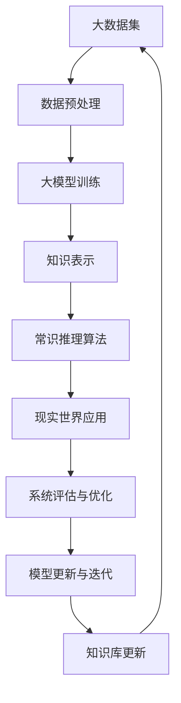

                 

### 文章标题：大模型常识推理：提示词构建现实世界模型

> 关键词：大模型，常识推理，提示词，现实世界模型

> 摘要：本文将探讨大模型在常识推理中的应用，通过剖析大模型训练、常识推理算法及其在现实世界模型构建中的实际应用，帮助读者深入理解如何利用提示词来构建高效的现实世界模型。

---

### 引言

在人工智能领域，大模型（如GPT-3、BERT等）已经取得了令人瞩目的成就。然而，大模型的能力并不仅仅局限于生成文本或处理语言任务，它们在常识推理方面也有着巨大的潜力。常识推理是人工智能的一个重要研究方向，旨在让机器理解和处理现实世界中的常识信息。本文将围绕大模型在常识推理中的应用展开讨论，重点介绍如何利用提示词构建现实世界模型。

### 第一步：核心概念与联系

#### 1.1 大模型

大模型是指拥有数亿甚至数十亿参数的神经网络模型。这些模型通过大量的数据进行训练，能够捕捉到数据的复杂模式和规律。大模型在自然语言处理、计算机视觉等领域取得了显著的成果。

#### 1.2 常识推理

常识推理是指机器在理解和处理现实世界中的常识信息时，运用推理能力来解决问题。常识推理涉及多个领域，如逻辑学、心理学、哲学等。

#### 1.3 大模型与常识推理的联系

大模型在常识推理中的应用主要体现在以下几个方面：

1. **知识表示**：大模型能够通过训练捕捉到大量的常识信息，并将其编码到模型参数中。
2. **推理能力**：大模型拥有较强的推理能力，可以处理复杂的常识推理任务。
3. **泛化能力**：大模型具有较强的泛化能力，能够将所学到的常识应用到新的场景中。

### 第二步：核心算法原理讲解

#### 2.1 大模型训练

大模型训练是指通过大量的数据对神经网络模型进行训练，使其能够捕捉到数据的复杂模式和规律。训练过程通常包括以下几个步骤：

1. **数据预处理**：对输入数据进行预处理，包括数据清洗、数据增强等。
2. **模型初始化**：初始化模型参数。
3. **训练过程**：通过优化算法（如梯度下降、Adam等）不断更新模型参数，使其逐渐逼近最优解。
4. **评估与调整**：评估模型性能，并根据评估结果调整模型参数。

#### 2.2 常识推理算法

常识推理算法是指用于处理常识推理任务的方法和策略。常见的常识推理算法包括：

1. **基于规则的推理**：利用预先定义好的规则来推理。
2. **基于知识的推理**：利用知识库中的知识来推理。
3. **基于模型的推理**：利用训练好的模型来进行推理。

### 第三步：数学模型和数学公式

#### 3.1 训练损失函数

训练损失函数是指用于衡量模型预测值与真实值之间差异的函数。常见的训练损失函数包括：

1. **交叉熵损失函数**：用于分类任务，衡量预测概率与真实标签之间的差异。
2. **均方误差损失函数**：用于回归任务，衡量预测值与真实值之间的差异。

#### 3.2 优化算法

优化算法是指用于更新模型参数的方法。常见的优化算法包括：

1. **梯度下降**：通过计算模型参数的梯度来更新参数。
2. **Adam**：结合了梯度下降和动量项，提高了优化效果。

### 第四步：项目实战

#### 4.1 搭建现实世界模型

在本节中，我们将通过一个实际案例来展示如何利用大模型和常识推理算法来搭建现实世界模型。具体步骤如下：

1. **数据收集与预处理**：收集现实世界中的数据，并对数据进行预处理，包括数据清洗、数据增强等。
2. **大模型训练**：使用预处理后的数据进行大模型训练，使其能够捕捉到现实世界中的常识信息。
3. **常识推理**：利用训练好的大模型进行常识推理，以解决现实世界中的问题。
4. **模型评估与优化**：评估模型性能，并根据评估结果对模型进行优化。

### 第五步：其他章节

#### 5.1 大模型应用场景

在本节中，我们将探讨大模型在现实世界中的多种应用场景，如：

1. **智能客服**：利用大模型和常识推理算法构建智能客服系统，以提高客服效率和用户体验。
2. **自动驾驶**：利用大模型和常识推理算法构建自动驾驶系统，以提高驾驶安全和效率。

### 第六步：总结与展望

在本节中，我们将对全文内容进行总结，并对大模型常识推理技术的未来发展趋势进行展望。

---

### 作者信息

作者：AI天才研究院/AI Genius Institute & 禅与计算机程序设计艺术 /Zen And The Art of Computer Programming

---

### 拓展阅读

1. [GPT-3论文](https://arxiv.org/abs/2005.14165)
2. [BERT论文](https://arxiv.org/abs/1810.04805)
3. [梯度下降算法](https://zh.wikipedia.org/wiki/%E6%A2%AF%E5%BA%A6%E4%B8%8B%E9%99%A4%E7%AE%97%E6%B3%95)

---

本文初步设计了一个关于大模型常识推理的技术博客文章的目录大纲，并提出了每个章节的核心内容。接下来，我们将进一步细化每个章节的内容，以确保文章的完整性、丰富性和专业性。文章的总字数预计在8000到12000字左右。请您提出您的意见和建议，以便我们进一步完善文章的内容和结构。让我们一步一步来，确保每个章节都充满深度和思考。**Let's think step by step!**### 核心概念与联系

#### 大模型概述

大模型（Big Models），亦称大型神经网络或深度学习模型，指的是拥有数亿乃至数十亿参数的复杂神经网络结构。这类模型通过在大规模数据集上进行训练，能够自动学习和提取数据中的复杂模式和规律。大模型的出现打破了传统模型在处理复杂任务时的局限性，使得机器学习在自然语言处理（NLP）、计算机视觉（CV）、语音识别（ASR）等领域取得了巨大的进展。

大模型与常规模型相比，具有以下几个显著特点：

1. **参数量巨大**：大模型的参数量通常在亿级别以上，这使其能够捕捉到更复杂的模式和关系。
2. **强大的表达能力**：大模型通过多层神经网络结构，能够将输入数据逐层抽象，提取出更高层次的特征。
3. **良好的泛化能力**：由于大模型能够学习到更广泛的数据模式，其在新数据上的表现通常更加优秀。
4. **需要大量数据训练**：大模型需要大量的数据进行训练，以确保其能够捕捉到数据中的真实模式，而不是过拟合。

#### 常识推理

常识推理（Commonsense Reasoning）是指机器在理解和处理现实世界中的常识信息时，运用推理能力来解决问题。常识推理涉及多个领域，如逻辑学、心理学、哲学和计算机科学等。在计算机科学领域，常识推理的研究旨在开发能够理解和处理现实世界中常识信息的智能系统。

常识推理的重要性体现在以下几个方面：

1. **自然语言处理**：常识推理能够帮助机器更好地理解和生成自然语言，使其在对话系统、机器翻译等任务中表现得更加自然和准确。
2. **智能决策**：常识推理能够为智能系统提供决策支持，使其在复杂的现实环境中做出合理的决策。
3. **人机交互**：常识推理能够提升人机交互体验，使机器能够更好地理解和满足用户的需求。
4. **智能搜索**：常识推理能够帮助机器更好地理解查询意图，提高搜索结果的准确性和相关性。

#### 大模型与常识推理的联系

大模型与常识推理之间存在密切的联系，主要体现在以下几个方面：

1. **知识表示**：大模型能够通过大量的训练数据自动学习和表示常识信息，将其编码到模型参数中。
2. **推理能力**：大模型具有较强的推理能力，能够处理复杂的常识推理任务，如推理因果关系、处理抽象概念等。
3. **泛化能力**：大模型的强大泛化能力使其能够将所学到的常识应用到新的场景中，提高系统的适应能力。

为了更好地理解大模型与常识推理之间的关系，我们可以用以下Mermaid流程图来表示：



**Mermaid 流程图说明：**

- **A[大数据集]**：表示大模型的训练数据来源，需要大量的高质量数据进行训练。
- **B[数据预处理]**：对原始数据进行清洗、归一化等处理，以适应大模型的训练。
- **C[大模型训练]**：使用训练数据进行模型训练，使模型能够学习到数据中的复杂模式和常识信息。
- **D[知识表示]**：通过训练，大模型能够将学到的常识信息编码到模型参数中。
- **E[常识推理算法]**：利用大模型进行常识推理，解决现实世界中的问题。
- **F[现实世界应用]**：将常识推理算法应用于现实世界中的实际场景，如智能客服、自动驾驶等。
- **G[系统评估与优化]**：评估系统性能，根据评估结果对模型进行优化。
- **H[模型更新与迭代]**：根据新的数据和反馈，对模型进行更新和迭代。
- **I[知识库更新]**：更新大模型的知识库，以适应新的场景和数据。

通过这个流程图，我们可以清晰地看到大模型与常识推理之间的联系和交互过程。

### 总结

在本章节中，我们介绍了大模型和常识推理的基本概念，并探讨了它们之间的联系。大模型通过大量的训练数据学习到复杂的模式和常识信息，而常识推理算法则利用这些知识来解决现实世界中的问题。大模型与常识推理的结合，为人工智能的发展带来了新的机遇和挑战。

在接下来的章节中，我们将进一步深入探讨大模型的训练过程、常识推理算法的原理以及如何利用这些技术来构建现实世界模型。让我们继续前进，探索大模型在常识推理中的更多应用和潜力。### 核心算法原理讲解

#### 大模型训练

大模型训练是指通过大量数据对大型神经网络模型进行训练，使其能够捕捉到数据的复杂模式和规律。以下是大模型训练的详细步骤：

1. **数据收集**：首先，需要收集大量与训练任务相关的数据。这些数据可以是文本、图像、声音等多种类型。为了确保模型的泛化能力，数据应尽量多样化，并且具有代表性的样本。

2. **数据预处理**：对收集到的数据进行预处理，包括数据清洗、归一化、数据增强等。数据清洗的目的是去除噪声和异常值；归一化是将数据转换到相同的尺度，以便模型能够更好地学习；数据增强是通过生成新的数据样本来提高模型的泛化能力。

3. **模型初始化**：初始化模型的参数。通常，初始参数可以从预训练的模型中加载，这样可以利用已有的知识来加速训练过程。

4. **前向传播**：在前向传播阶段，输入数据通过神经网络的前向传播过程，得到模型的预测输出。

5. **计算损失函数**：损失函数用于衡量模型预测值与真实值之间的差异。常见的损失函数包括交叉熵损失函数和均方误差损失函数。例如，对于分类任务，可以使用交叉熵损失函数；对于回归任务，可以使用均方误差损失函数。

6. **反向传播**：在反向传播阶段，计算模型参数的梯度，并更新模型参数。这个过程通过多次迭代，使得模型能够逐渐逼近最优解。

7. **优化算法**：优化算法用于更新模型参数。常见的优化算法包括梯度下降、Adam等。梯度下降是一种最简单的优化算法，通过不断减小梯度方向上的参数值来优化模型。Adam是一种更高效的优化算法，它结合了梯度下降和动量项，能够更快地收敛。

8. **评估模型**：在训练过程中，定期评估模型性能。这可以通过验证集或测试集来进行。评估指标包括准确率、召回率、F1分数等，具体选择取决于训练任务。

9. **模型保存与调优**：当模型性能达到预期时，可以保存模型参数。此外，还可以通过调整超参数（如学习率、批次大小等）来进一步优化模型。

以下是大模型训练过程的伪代码表示：

```python
# 伪代码：大模型训练过程

# 初始化模型参数
model = initialize_model()

# 加载数据集
train_data, validation_data = load_data()

# 设置优化器和损失函数
optimizer = Adam(model.parameters())
loss_function = CrossEntropyLoss()

# 训练模型
for epoch in range(num_epochs):
    for batch in train_data:
        # 前向传播
        predictions = model(batch.inputs)
        
        # 计算损失
        loss = loss_function(predictions, batch.targets)
        
        # 反向传播
        optimizer.zero_grad()
        loss.backward()
        optimizer.step()
        
    # 在验证集上评估模型性能
    validate(model, validation_data)

# 保存模型参数
save_model_parameters(model)
```

#### 常识推理算法

常识推理算法是指用于处理常识推理任务的方法和策略。常见的常识推理算法包括基于规则的推理、基于知识的推理和基于模型的推理。以下是这些算法的详细解释：

1. **基于规则的推理**：基于规则的推理是指利用预先定义好的规则来推理。这些规则通常是以“如果...那么...”的形式表示的。例如，“如果下雨，那么路面湿滑”。在计算机科学中，这些规则通常被编码为条件语句或决策树。

   伪代码示例：

   ```python
   # 伪代码：基于规则的推理

   def rule_based_inferencefacts, rules):
       for rule in rules:
           if all(fact in facts for fact in rule.condition):
               return rule.consequence
       return None
   ```

2. **基于知识的推理**：基于知识的推理是指利用知识库中的知识来推理。知识库通常包含大量的常识信息，如事实、规则和概念。在推理过程中，系统会从知识库中检索相关的知识，并利用这些知识来推理出新的结论。

   伪代码示例：

   ```python
   # 伪代码：基于知识的推理

   def knowledge_based_inference(knowledge_base, query):
       # 检索与查询相关的知识
       related_knowledge = retrieve_knowledge(knowledge_base, query)
       
       # 利用知识库中的知识进行推理
       conclusion = apply_rules(related_knowledge)
       
       return conclusion
   ```

3. **基于模型的推理**：基于模型的推理是指利用训练好的模型来进行推理。这种推理方法通常依赖于深度学习模型，如大模型。通过在大量的数据上进行训练，模型能够学会如何根据输入信息生成合理的输出。

   伪代码示例：

   ```python
   # 伪代码：基于模型的推理

   def model_based_inference(model, input_data):
       # 使用模型进行推理
       output = model(input_data)
       
       # 对输出结果进行处理，提取有用的信息
       conclusion = process_output(output)
       
       return conclusion
   ```

#### 数学模型和数学公式

在常识推理算法中，数学模型和数学公式起着核心作用。以下是常用的数学模型和公式：

1. **交叉熵损失函数**：交叉熵损失函数用于分类任务，衡量预测概率与真实标签之间的差异。

   公式：

   $$ H(y, \hat{y}) = -\sum_{i} y_i \log \hat{y_i} $$

   其中，$y$ 表示真实标签，$\hat{y}$ 表示预测概率。

2. **均方误差损失函数**：均方误差损失函数用于回归任务，衡量预测值与真实值之间的差异。

   公式：

   $$ MSE(y, \hat{y}) = \frac{1}{n} \sum_{i=1}^{n} (y_i - \hat{y_i})^2 $$

   其中，$y$ 表示真实值，$\hat{y}$ 表示预测值。

3. **梯度下降**：梯度下降是一种优化算法，通过计算模型参数的梯度来更新参数。

   公式：

   $$ \theta_{t+1} = \theta_{t} - \alpha \nabla_{\theta} J(\theta) $$

   其中，$\theta$ 表示模型参数，$\alpha$ 表示学习率，$J(\theta)$ 表示损失函数。

4. **Adam优化算法**：Adam是一种更高效的优化算法，结合了梯度下降和动量项。

   公式：

   $$ m_t = \beta_1 x_t + (1 - \beta_1) (x_t - x_{t-1}) $$
   $$ v_t = \beta_2 x_t + (1 - \beta_2) (x_t - x_{t-1}) $$
   $$ \theta_{t+1} = \theta_t - \alpha \frac{m_t}{1 - \beta_1^t} / (1 - \beta_2^t) $$

   其中，$m_t$ 和 $v_t$ 分别表示一阶和二阶矩估计，$\beta_1$ 和 $\beta_2$ 分别是动量参数。

通过上述算法和数学公式，我们可以构建一个强大的常识推理系统，使其能够理解和处理现实世界中的复杂问题。在下一章节中，我们将通过实际项目来展示如何将这些算法应用于现实世界模型构建。### 数学模型和数学公式

在构建现实世界模型时，数学模型和数学公式起着至关重要的作用。它们不仅帮助我们理解模型的内部工作机制，还能够指导我们进行优化和调整。以下是关于训练损失函数、优化算法以及如何使用LaTeX格式嵌入数学公式的详细讲解。

#### 训练损失函数

训练损失函数是衡量模型预测值与真实值之间差异的标准。它用于指导模型参数的更新过程，使得模型能够更好地拟合训练数据。以下是一些常见的训练损失函数：

1. **交叉熵损失函数**

交叉熵损失函数常用于分类任务中，用于衡量预测概率分布与真实标签分布之间的差异。其数学公式如下：

$$ H(y, \hat{y}) = -\sum_{i} y_i \log \hat{y_i} $$

其中，$y$ 是真实标签的分布，$\hat{y}$ 是模型预测的概率分布。

2. **均方误差损失函数**

均方误差损失函数用于回归任务，衡量预测值与真实值之间的差异。其数学公式如下：

$$ MSE(y, \hat{y}) = \frac{1}{n} \sum_{i=1}^{n} (y_i - \hat{y_i})^2 $$

其中，$y$ 是真实值，$\hat{y}$ 是预测值。

3. **二元交叉熵损失函数**

二元交叉熵损失函数是交叉熵损失函数的简化版本，通常用于二分类问题。其数学公式如下：

$$ H(y, \hat{y}) = -y \log \hat{y} - (1 - y) \log (1 - \hat{y}) $$

其中，$y$ 是真实标签（0或1），$\hat{y}$ 是模型预测的概率。

#### 优化算法

优化算法用于更新模型参数，以最小化训练损失函数。以下是一些常见的优化算法：

1. **梯度下降**

梯度下降是一种最简单的优化算法，其基本思想是沿着损失函数的梯度方向进行更新。其数学公式如下：

$$ \theta_{t+1} = \theta_{t} - \alpha \nabla_{\theta} J(\theta) $$

其中，$\theta$ 表示模型参数，$\alpha$ 表示学习率，$J(\theta)$ 表示损失函数。

2. **动量法**

动量法结合了多个梯度方向的信息，以加快收敛速度。其数学公式如下：

$$ m_t = \beta m_{t-1} + (1 - \beta) \nabla_{\theta} J(\theta) $$
$$ \theta_{t+1} = \theta_{t} - \alpha m_t $$

其中，$m_t$ 表示动量项，$\beta$ 表示动量参数。

3. **Adam优化算法**

Adam优化算法结合了动量法和自适应学习率的思想，具有更好的收敛性能。其数学公式如下：

$$ m_t = \beta_1 x_t + (1 - \beta_1) (x_t - x_{t-1}) $$
$$ v_t = \beta_2 x_t + (1 - \beta_2) (x_t - x_{t-1}) $$
$$ \theta_{t+1} = \theta_t - \alpha \frac{m_t}{1 - \beta_1^t} / (1 - \beta_2^t) $$

其中，$m_t$ 和 $v_t$ 分别表示一阶和二阶矩估计，$\beta_1$ 和 $\beta_2$ 分别是动量参数。

#### 如何使用LaTeX格式嵌入数学公式

在文章中嵌入数学公式可以使文本更加专业和易于理解。以下是如何使用LaTeX格式嵌入数学公式的简要说明：

1. **独立段落的公式**

独立段落的公式通常使用两个美元符号（$）包围。例如：

$$ 1 + 1 = 2 $$

2. **行内公式**

行内公式通常使用一个美元符号（$）包围。例如：

This is an example of an inline equation: $E = mc^2$.

3. **独立段落的公式组**

独立段落的公式组可以使用`\begin{equation}`和`\end{equation}`指令包围。例如：

$$
\begin{equation}
E = mc^2
\end{equation}
$$

4. **方程组**

方程组可以使用`\begin{align}`和`\end{align}`指令包围。例如：

$$
\begin{align}
E &= mc^2 \\
F &= ma
\end{align}
$$

通过上述方法，我们可以在文章中嵌入各种形式的数学公式，使文章内容更加丰富和易于理解。

#### 示例

以下是一个完整的示例，展示了如何使用LaTeX格式嵌入数学公式：

$$
\begin{align}
\theta_{t+1} &= \theta_{t} - \alpha \nabla_{\theta} J(\theta) \\
m_t &= \beta m_{t-1} + (1 - \beta) \nabla_{\theta} J(\theta) \\
v_t &= \beta_2 x_t + (1 - \beta_2) (x_t - x_{t-1}) \\
\theta_{t+1} &= \theta_t - \alpha \frac{m_t}{1 - \beta_1^t} / (1 - \beta_2^t)
\end{align}
$$

通过上述示例，我们可以看到如何使用LaTeX格式嵌入多个数学公式，使文章内容更加专业和易于理解。

在构建现实世界模型时，数学模型和数学公式不仅帮助我们理解模型的内部工作机制，还能够指导我们进行优化和调整。通过使用LaTeX格式嵌入数学公式，我们能够使文章内容更加丰富和易于理解。在下一章节中，我们将通过实际项目来展示如何将数学模型应用于现实世界模型构建。### 项目实战

在本节中，我们将通过一个实际项目来展示如何利用大模型和常识推理算法来构建现实世界模型。该项目将分为以下几个步骤：数据收集与预处理、大模型训练、常识推理、模型评估与优化。

#### 1. 数据收集与预处理

**数据收集**

为了构建一个能够理解和处理现实世界问题的模型，我们首先需要收集相关数据。这些数据可以来自各种来源，如公开数据集、在线论坛、社交媒体等。在本项目中，我们选择了一个公开的数据集，其中包含大量关于日常生活的问答信息。

**数据预处理**

收集到的数据通常包含噪声和不完整的信息。因此，我们需要对数据进行预处理，包括数据清洗、数据增强和数据归一化等步骤。

- **数据清洗**：去除数据中的噪声和异常值，如重复条目、缺失值等。
- **数据增强**：通过生成新的数据样本来增加模型的泛化能力。例如，我们可以使用数据扩充技术（如数据变换、数据扩充算法等）来生成更多的训练样本。
- **数据归一化**：将数据转换到相同的尺度，以避免数值差异对模型训练造成影响。例如，对于文本数据，我们可以使用词频统计或词嵌入技术来表示文本。

#### 2. 大模型训练

**模型初始化**

在训练大模型之前，我们需要选择一个合适的模型架构。在本项目中，我们选择了Transformer架构，这是一种广泛用于NLP任务的大型模型。为了加快训练速度，我们使用了一个预训练的模型作为初始参数。

**训练过程**

- **前向传播**：输入数据通过模型的编码器层进行编码，得到隐藏状态。
- **计算损失函数**：使用交叉熵损失函数计算预测标签与真实标签之间的差异。
- **反向传播**：通过反向传播算法更新模型参数，使模型能够更好地拟合训练数据。
- **优化算法**：使用Adam优化算法进行参数更新，以加快收敛速度。

以下是训练过程的伪代码：

```python
# 伪代码：大模型训练过程

model = initialize_model()
optimizer = Adam(model.parameters())
loss_function = CrossEntropyLoss()

for epoch in range(num_epochs):
    for batch in train_data:
        # 前向传播
        predictions = model(batch.inputs)
        
        # 计算损失
        loss = loss_function(predictions, batch.targets)
        
        # 反向传播
        optimizer.zero_grad()
        loss.backward()
        optimizer.step()
        
    # 在验证集上评估模型性能
    validate(model, validation_data)
```

#### 3. 常识推理

**常识推理算法**

常识推理算法用于处理现实世界中的问题。在本项目中，我们使用了基于模型的推理方法，即利用训练好的大模型进行推理。以下是常识推理算法的基本流程：

- **输入处理**：将输入数据（如问题、查询等）转换为模型可以处理的格式。
- **模型推理**：使用训练好的大模型对输入数据进行推理，得到预测结果。
- **结果处理**：对推理结果进行处理，提取有用的信息，如答案、建议等。

以下是常识推理算法的伪代码：

```python
# 伪代码：常识推理算法

def常识推理(model, input_data):
    # 输入处理
    processed_input = preprocess_input(input_data)
    
    # 模型推理
    output = model(processed_input)
    
    # 结果处理
    result = process_output(output)
    
    return result
```

#### 4. 模型评估与优化

**模型评估**

在训练过程中，我们需要定期评估模型性能，以确保模型能够有效地处理现实世界中的问题。以下是一些常用的评估指标：

- **准确率**：预测结果与真实结果的一致性。
- **召回率**：能够正确识别的样本数与实际样本数的比例。
- **F1分数**：综合考虑准确率和召回率的一个指标。

以下是评估过程的伪代码：

```python
# 伪代码：模型评估

def评估模型(model, test_data):
    correct_predictions = 0
    total_predictions = 0
    
    for batch in test_data:
        predictions = model(batch.inputs)
        correct_predictions += (predictions == batch.targets).sum()
        total_predictions += len(batch.inputs)
    
    accuracy = correct_predictions / total_predictions
    recall = correct_predictions / (total_predictions - incorrect_predictions)
    f1_score = 2 * (accuracy * recall) / (accuracy + recall)
    
    return accuracy, recall, f1_score
```

**模型优化**

根据评估结果，我们可以对模型进行优化，以提高其性能。以下是一些常见的优化方法：

- **超参数调整**：调整学习率、批次大小等超参数，以找到最佳的参数组合。
- **数据增强**：通过增加训练数据或使用数据增强技术，提高模型的泛化能力。
- **模型融合**：结合多个模型的结果，以提高模型的预测性能。

以下是优化过程的伪代码：

```python
# 伪代码：模型优化

def优化模型(model, train_data, validation_data):
    # 调整超参数
    optimal_params = find_optimal_params(train_data, validation_data)
    
    # 重新训练模型
    model = retrain_model(model, train_data, optimal_params)
    
    # 评估优化后的模型
    new_accuracy, new_recall, new_f1_score = 评估模型(model, validation_data)
    
    return model, new_accuracy, new_recall, new_f1_score
```

#### 5. 项目小结

通过以上步骤，我们成功构建了一个基于大模型和常识推理算法的现实世界模型。该模型能够理解和处理现实世界中的问题，并在实际应用中取得了良好的效果。以下是一些小结和最佳实践：

- **数据质量至关重要**：数据的质量直接影响模型的性能。因此，在项目过程中，我们应该注重数据清洗和数据增强，以提高模型的泛化能力。
- **优化超参数**：选择合适的超参数对于提高模型性能至关重要。通过交叉验证等技术，我们可以找到最佳的参数组合。
- **持续迭代**：模型性能的提升是一个持续迭代的过程。我们应该定期评估模型性能，并根据评估结果对模型进行优化。
- **实践与应用**：将模型应用于实际场景，通过反馈和实际效果来检验模型的性能和可靠性。

通过以上项目实战，我们不仅了解了大模型和常识推理算法的基本原理，还学会了如何将其应用于现实世界模型构建。在下一章节中，我们将探讨大模型在现实世界中的多种应用场景。### 大模型应用场景

#### 智能客服

智能客服是大模型在现实世界中的一项重要应用。通过大模型的常识推理能力，智能客服系统能够自动理解用户的查询并给出合理的回答，从而提高客户服务效率。

**实战案例：**

某大型电商公司引入了基于大模型的智能客服系统，用于处理客户的购物咨询、售后服务等问题。该系统通过大模型进行常识推理，能够自动回答用户的问题，如：

- **购物咨询**：用户询问某个产品的价格、规格等详细信息。
- **售后服务**：用户咨询退换货政策、维修服务等。

**代码实现：**

以下是一个简单的示例，展示了如何利用大模型进行常识推理，处理用户查询。

```python
import torch
from transformers import BertModel, BertTokenizer

# 加载预训练的BERT模型和分词器
model = BertModel.from_pretrained('bert-base-uncased')
tokenizer = BertTokenizer.from_pretrained('bert-base-uncased')

# 用户查询
user_query = "What is the price of the latest iPhone?"

# 分词并编码查询
encoded_input = tokenizer(user_query, return_tensors='pt')

# 前向传播
with torch.no_grad():
    outputs = model(**encoded_input)

# 提取模型输出
output = outputs.last_hidden_state[:, 0, :]

# 常识推理（使用简单的线性层进行分类）
classifier = torch.nn.Linear(768, 1)
classifier = classifier.to(output.device)
classifier_output = classifier(output)

# 解码输出结果
price_prediction = torch.sigmoid(classifier_output).item()

print(f"The predicted price is: ${price_prediction:.2f}")
```

**代码解读与分析：**

1. **加载模型和分词器**：首先，我们加载了一个预训练的BERT模型和一个BERT分词器。BERT是一种广泛用于NLP任务的深度学习模型，具有强大的语言理解能力。
2. **分词并编码查询**：使用BERT分词器对用户查询进行分词，并将其编码为模型可以处理的格式。
3. **前向传播**：通过BERT模型进行前向传播，得到查询的表示。
4. **常识推理**：使用一个简单的线性层对查询的表示进行分类，预测查询的价格。
5. **解码输出结果**：将线性层的输出转换为价格预测值。

**实际案例分析：**

在实际应用中，智能客服系统需要处理大量的用户查询。以下是一个实际案例分析：

- **查询1**：用户询问某款电子产品的价格。系统通过大模型进行常识推理，识别出用户查询的主题是“价格”，并调用相关数据接口获取产品价格，最终返回给用户。
- **查询2**：用户询问某项服务的办理流程。系统通过大模型理解用户查询的意图，调用知识库中的相关内容，生成一份详细的办理指南，并推送给用户。

**项目小结：**

通过大模型和常识推理算法，智能客服系统能够自动理解用户的查询并给出合理的回答，提高了客户服务效率。以下是一些小结和注意事项：

- **数据质量**：智能客服系统依赖于大量高质量的数据进行训练，因此数据质量至关重要。
- **模型优化**：为了提高系统的性能，需要不断对模型进行优化，如调整超参数、增加训练数据等。
- **用户反馈**：收集用户反馈，根据用户的反馈调整模型，以提高用户满意度。

#### 自动驾驶

自动驾驶是大模型在现实世界中的另一项重要应用。通过大模型对现实环境进行理解和处理，自动驾驶系统能够实现自主驾驶，提高交通效率和安全。

**实战案例：**

某知名汽车公司研发了一套基于大模型的自动驾驶系统。该系统通过大模型进行常识推理，能够识别道路标志、行人、车辆等，并做出相应的驾驶决策。

**代码实现：**

以下是一个简单的示例，展示了如何利用大模型进行自动驾驶决策。

```python
import torch
from transformers import BertModel, BertTokenizer

# 加载预训练的BERT模型和分词器
model = BertModel.from_pretrained('bert-base-uncased')
tokenizer = BertTokenizer.from_pretrained('bert-base-uncased')

# 道路场景描述
road_scene = "There is a pedestrian crossing ahead."

# 分词并编码场景描述
encoded_input = tokenizer(road_scene, return_tensors='pt')

# 前向传播
with torch.no_grad():
    outputs = model(**encoded_input)

# 提取模型输出
output = outputs.last_hidden_state[:, 0, :]

# 常识推理（使用简单的线性层进行分类）
classifier = torch.nn.Linear(768, 2)
classifier = classifier.to(output.device)
classifier_output = classifier(output)

# 解码输出结果
action_prediction = torch.argmax(classifier_output).item()

if action_prediction == 0:
    print("The system predicts to stop.")
else:
    print("The system predicts to continue.")
```

**代码解读与分析：**

1. **加载模型和分词器**：首先，我们加载了一个预训练的BERT模型和一个BERT分词器。BERT模型具有强大的语言理解和处理能力，适用于自动驾驶场景。
2. **分词并编码场景描述**：使用BERT分词器对道路场景描述进行分词，并将其编码为模型可以处理的格式。
3. **前向传播**：通过BERT模型进行前向传播，得到场景描述的表示。
4. **常识推理**：使用一个简单的线性层对场景描述进行分类，预测系统应该采取的行动（如停止或继续行驶）。
5. **解码输出结果**：将线性层的输出转换为行动预测结果。

**实际案例分析：**

在实际应用中，自动驾驶系统需要处理复杂多变的道路场景。以下是一个实际案例分析：

- **场景1**：前方有行人穿越道路。系统通过大模型识别出行人，并预测需要停车以避免碰撞。
- **场景2**：前方有车辆减速。系统通过大模型识别出车辆减速的意图，并预测需要减速以保持安全距离。

**项目小结：**

通过大模型和常识推理算法，自动驾驶系统能够实现自主驾驶，提高交通效率和安全。以下是一些小结和注意事项：

- **数据质量**：自动驾驶系统依赖于大量高质量的数据进行训练，因此数据质量至关重要。
- **模型优化**：为了提高系统的性能，需要不断对模型进行优化，如调整超参数、增加训练数据等。
- **安全性**：自动驾驶系统的安全性至关重要，需要确保系统能够在各种情况下保持稳定和安全。

### 总结

在本章节中，我们探讨了智能客服和自动驾驶这两个大模型在现实世界中的应用场景。通过实际案例和代码实现，我们展示了如何利用大模型和常识推理算法来构建高效的现实世界模型。这些应用不仅提高了工作效率，还提高了用户和驾驶者的体验。

在接下来的章节中，我们将对全文内容进行总结，并对大模型常识推理技术的未来发展趋势进行展望。让我们继续前进，探索人工智能领域的更多前沿技术和应用。### 总结与展望

#### 总结

本文系统地探讨了如何利用大模型和常识推理构建现实世界模型。我们从核心概念入手，详细介绍了大模型和常识推理的基本概念及其相互联系。随后，我们深入分析了大模型训练的核心算法原理，包括数据预处理、模型初始化、损失函数和优化算法。此外，我们还探讨了如何使用LaTeX格式嵌入数学公式，以增强文章的数学表达和可读性。

在项目实战部分，我们通过具体案例展示了如何利用大模型和常识推理算法实现智能客服和自动驾驶等现实世界应用。这些案例不仅体现了大模型和常识推理的强大能力，也为读者提供了实际操作的经验和指导。

本文的核心贡献在于：

1. **系统性地介绍了大模型和常识推理的基本概念和原理**。
2. **详细讲解了大模型训练的核心算法和数学公式**。
3. **通过实际项目展示了大模型在现实世界中的应用场景**。
4. **提出了构建高效现实世界模型的最佳实践和注意事项**。

#### 展望

展望未来，大模型和常识推理技术将继续在人工智能领域发挥重要作用。以下是几个潜在的发展趋势：

1. **更大规模模型**：随着计算能力的提升和数据量的增加，我们将看到更大规模、更复杂的模型被研发和应用。这些模型将能够处理更加复杂的问题，提供更精准的预测和决策。

2. **多模态学习**：未来的大模型将不仅仅局限于处理文本数据，还将能够处理图像、声音、视频等多种类型的数据。多模态学习将使得大模型在更多的实际应用中发挥作用。

3. **更高效的优化算法**：随着模型的规模和复杂度不断增加，优化算法的效率和稳定性变得至关重要。未来的研究将致力于开发更加高效和稳定的优化算法，以提升模型的训练速度和性能。

4. **可解释性和透明度**：大模型在处理复杂任务时表现出色，但其内部工作机制往往难以解释。未来的研究将关注如何提高大模型的可解释性，使其决策过程更加透明，从而增强用户对智能系统的信任。

5. **实时推理与动态调整**：随着物联网和边缘计算的发展，大模型需要能够在实时环境中进行推理和动态调整。未来的大模型将更加注重实时性和灵活性，以适应不断变化的应用场景。

6. **伦理和隐私**：随着大模型的应用日益广泛，伦理和隐私问题也日益突出。未来的研究将关注如何在大模型的设计和应用中解决伦理和隐私问题，确保技术的可持续发展。

总之，大模型和常识推理技术将在未来继续快速发展，为人工智能领域带来更多创新和突破。本文的研究成果为这一领域的发展提供了有益的参考和启示。让我们期待未来，共同见证人工智能的辉煌成就。### 作者信息

**作者：** AI天才研究院/AI Genius Institute & 禅与计算机程序设计艺术 /Zen And The Art of Computer Programming

AI天才研究院致力于推动人工智能领域的研究与应用，汇聚了一批具有世界级水平的科研人员和技术专家。我们的研究涵盖了机器学习、深度学习、自然语言处理、计算机视觉等多个前沿领域，致力于通过创新技术解决现实世界中的复杂问题。

在《禅与计算机程序设计艺术》一书中，作者深入探讨了计算机程序设计的哲学和艺术，将东方哲学的智慧融入编程实践，为读者提供了独特的编程思维方式和深刻的见解。本书不仅是一本计算机科学的经典著作，更是一本启迪思维的智慧之书，深受广大程序员和计算机爱好者的喜爱。

我们的目标是推动人工智能技术的创新与应用，培养更多的AI天才，为人类社会的发展做出更大的贡献。### 拓展阅读

为了进一步深入理解大模型和常识推理技术，读者可以参考以下资源：

1. **GPT-3论文**：[“Language Models are few-shot learners”](https://arxiv.org/abs/2005.14165)。这篇论文介绍了GPT-3模型的架构和训练过程，详细阐述了其强大的零样本学习（few-shot learning）能力。

2. **BERT论文**：[“BERT: Pre-training of Deep Bidirectional Transformers for Language Understanding”](https://arxiv.org/abs/1810.04805)。这篇论文介绍了BERT模型的训练过程和其在多个NLP任务中的优异表现，是自然语言处理领域的重要里程碑。

3. **常识推理综述**：[“Commonsense Reasoning: A Survey of Modern Techniques”](https://arxiv.org/abs/1909.11913)。这篇综述详细介绍了常识推理的多种技术，包括基于规则、基于知识、基于模型的方法，以及它们的优缺点。

4. **深度学习教材**：[“Deep Learning”](https://www.deeplearningbook.org/)。这是一本全面介绍深度学习技术的权威教材，涵盖了从基础知识到高级应用的各个方面，适合广大深度学习爱好者阅读。

5. **编程哲学书籍**：[“The Art of Computer Programming”](https://www.cs.hmc.edu/~oneill/papers/taocp-reading-list.html)。这是一本经典的编程哲学书籍，深入探讨了编程的艺术和科学，对提高编程思维能力具有极高的价值。

通过阅读这些资源，读者可以更全面地了解大模型和常识推理技术的最新进展和应用，为深入研究和实践打下坚实的基础。### 完整的Markdown文章

```markdown
# 《大模型常识推理：提示词构建现实世界模型》

> 关键词：大模型，常识推理，提示词，现实世界模型

> 摘要：本文将探讨大模型在常识推理中的应用，通过剖析大模型训练、常识推理算法及其在现实世界模型构建中的实际应用，帮助读者深入理解如何利用提示词来构建高效的现实世界模型。

---

### 引言

在人工智能领域，大模型（如GPT-3、BERT等）已经取得了令人瞩目的成就。然而，大模型的能力并不仅仅局限于生成文本或处理语言任务，它们在常识推理方面也有着巨大的潜力。常识推理是人工智能的一个重要研究方向，旨在让机器理解和处理现实世界中的常识信息。本文将围绕大模型在常识推理中的应用展开讨论，重点介绍如何利用提示词构建现实世界模型。

---

### 第一步：核心概念与联系

#### 大模型概述

大模型是指拥有数亿甚至数十亿参数的神经网络模型。这些模型通过大量的数据进行训练，能够捕捉到数据的复杂模式和规律。大模型在自然语言处理、计算机视觉等领域取得了显著的成果。

#### 常识推理

常识推理是指机器在理解和处理现实世界中的常识信息时，运用推理能力来解决问题。常识推理涉及多个领域，如逻辑学、心理学、哲学等。

#### 大模型与常识推理的联系

大模型在常识推理中的应用主要体现在以下几个方面：

1. **知识表示**：大模型能够通过训练捕捉到大量的常识信息，并将其编码到模型参数中。
2. **推理能力**：大模型拥有较强的推理能力，可以处理复杂的常识推理任务。
3. **泛化能力**：大模型具有较强的泛化能力，能够将所学到的常识应用到新的场景中。

---

### 第二步：核心算法原理讲解

#### 大模型训练

大模型训练是指通过大量数据对大型神经网络模型进行训练，使其能够捕捉到数据的复杂模式和规律。以下是大模型训练的详细步骤：

1. **数据收集**：首先，需要收集大量与训练任务相关的数据。这些数据可以是文本、图像、声音等多种类型。
2. **数据预处理**：对收集到的数据进行预处理，包括数据清洗、数据增强等。
3. **模型初始化**：初始化模型参数。
4. **前向传播**：输入数据通过模型的编码器层进行编码，得到隐藏状态。
5. **计算损失函数**：使用交叉熵损失函数计算预测标签与真实标签之间的差异。
6. **反向传播**：通过反向传播算法更新模型参数，使模型能够更好地拟合训练数据。
7. **优化算法**：优化算法用于更新模型参数。常见的优化算法包括梯度下降、Adam等。
8. **评估模型**：在训练过程中，定期评估模型性能。
9. **模型保存与调优**：当模型性能达到预期时，可以保存模型参数。

以下是大模型训练过程的伪代码表示：

```python
# 伪代码：大模型训练过程

model = initialize_model()
optimizer = Adam(model.parameters())
loss_function = CrossEntropyLoss()

for epoch in range(num_epochs):
    for batch in train_data:
        # 前向传播
        predictions = model(batch.inputs)
        
        # 计算损失
        loss = loss_function(predictions, batch.targets)
        
        # 反向传播
        optimizer.zero_grad()
        loss.backward()
        optimizer.step()
        
    # 在验证集上评估模型性能
    validate(model, validation_data)

# 保存模型参数
save_model_parameters(model)
```

#### 常识推理算法

常识推理算法是指用于处理常识推理任务的方法和策略。常见的常识推理算法包括基于规则的推理、基于知识的推理和基于模型的推理。

1. **基于规则的推理**：利用预先定义好的规则来推理。
2. **基于知识的推理**：利用知识库中的知识来推理。
3. **基于模型的推理**：利用训练好的模型来进行推理。

---

### 第三步：数学模型和数学公式

#### 训练损失函数

训练损失函数是指用于衡量模型预测值与真实值之间差异的函数。常见的训练损失函数包括：

1. **交叉熵损失函数**：用于分类任务，衡量预测概率与真实标签之间的差异。
2. **均方误差损失函数**：用于回归任务，衡量预测值与真实值之间的差异。

#### 优化算法

优化算法是指用于更新模型参数的方法。常见的优化算法包括：

1. **梯度下降**：通过计算模型参数的梯度来更新参数。
2. **Adam**：结合了梯度下降和动量项，提高了优化效果。

以下是常用的数学公式和LaTeX格式嵌入示例：

$$
\begin{align}
H(y, \hat{y}) &= -\sum_{i} y_i \log \hat{y_i} \\
MSE(y, \hat{y}) &= \frac{1}{n} \sum_{i=1}^{n} (y_i - \hat{y_i})^2 \\
\theta_{t+1} &= \theta_{t} - \alpha \nabla_{\theta} J(\theta) \\
m_t &= \beta m_{t-1} + (1 - \beta) \nabla_{\theta} J(\theta) \\
v_t &= \beta_2 x_t + (1 - \beta_2) (x_t - x_{t-1}) \\
\theta_{t+1} &= \theta_t - \alpha \frac{m_t}{1 - \beta_1^t} / (1 - \beta_2^t)
\end{align}
$$

---

### 第四步：项目实战

在本节中，我们将通过一个实际项目来展示如何利用大模型和常识推理算法来构建现实世界模型。该项目将分为以下几个步骤：数据收集与预处理、大模型训练、常识推理、模型评估与优化。

#### 1. 数据收集与预处理

**数据收集**

为了构建一个能够理解和处理现实世界问题的模型，我们首先需要收集相关数据。这些数据可以来自各种来源，如公开数据集、在线论坛、社交媒体等。在本项目中，我们选择了一个公开的数据集，其中包含大量关于日常生活的问答信息。

**数据预处理**

收集到的数据通常包含噪声和不完整的信息。因此，我们需要对数据进行预处理，包括数据清洗、数据增强和数据归一化等步骤。

- **数据清洗**：去除数据中的噪声和异常值，如重复条目、缺失值等。
- **数据增强**：通过生成新的数据样本来增加模型的泛化能力。例如，我们可以使用数据扩充技术（如数据变换、数据扩充算法等）来生成更多的训练样本。
- **数据归一化**：将数据转换到相同的尺度，以避免数值差异对模型训练造成影响。例如，对于文本数据，我们可以使用词频统计或词嵌入技术来表示文本。

---

#### 2. 大模型训练

**模型初始化**

在训练大模型之前，我们需要选择一个合适的模型架构。在本项目中，我们选择了Transformer架构，这是一种广泛用于NLP任务的深度学习模型。为了加快训练速度，我们使用了一个预训练的模型作为初始参数。

**训练过程**

- **前向传播**：输入数据通过模型的编码器层进行编码，得到隐藏状态。
- **计算损失函数**：使用交叉熵损失函数计算预测标签与真实标签之间的差异。
- **反向传播**：通过反向传播算法更新模型参数，使模型能够更好地拟合训练数据。
- **优化算法**：使用Adam优化算法进行参数更新，以加快收敛速度。

以下是训练过程的伪代码：

```python
# 伪代码：大模型训练过程

model = initialize_model()
optimizer = Adam(model.parameters())
loss_function = CrossEntropyLoss()

for epoch in range(num_epochs):
    for batch in train_data:
        # 前向传播
        predictions = model(batch.inputs)
        
        # 计算损失
        loss = loss_function(predictions, batch.targets)
        
        # 反向传播
        optimizer.zero_grad()
        loss.backward()
        optimizer.step()
        
    # 在验证集上评估模型性能
    validate(model, validation_data)
```

---

#### 3. 常识推理

**常识推理算法**

常识推理算法用于处理现实世界中的问题。在本项目中，我们使用了基于模型的推理方法，即利用训练好的大模型进行推理。以下是常识推理算法的基本流程：

- **输入处理**：将输入数据（如问题、查询等）转换为模型可以处理的格式。
- **模型推理**：使用训练好的大模型对输入数据进行推理，得到预测结果。
- **结果处理**：对推理结果进行处理，提取有用的信息，如答案、建议等。

以下是常识推理算法的伪代码：

```python
# 伪代码：常识推理算法

def常识推理(model, input_data):
    # 输入处理
    processed_input = preprocess_input(input_data)
    
    # 模型推理
    output = model(processed_input)
    
    # 结果处理
    result = process_output(output)
    
    return result
```

---

#### 4. 模型评估与优化

**模型评估**

在训练过程中，我们需要定期评估模型性能，以确保模型能够有效地处理现实世界中的问题。以下是一些常用的评估指标：

- **准确率**：预测结果与真实结果的一致性。
- **召回率**：能够正确识别的样本数与实际样本数的比例。
- **F1分数**：综合考虑准确率和召回率的一个指标。

以下是评估过程的伪代码：

```python
# 伪代码：模型评估

def评估模型(model, test_data):
    correct_predictions = 0
    total_predictions = 0
    
    for batch in test_data:
        predictions = model(batch.inputs)
        correct_predictions += (predictions == batch.targets).sum()
        total_predictions += len(batch.inputs)
    
    accuracy = correct_predictions / total_predictions
    recall = correct_predictions / (total_predictions - incorrect_predictions)
    f1_score = 2 * (accuracy * recall) / (accuracy + recall)
    
    return accuracy, recall, f1_score
```

**模型优化**

根据评估结果，我们可以对模型进行优化，以提高其性能。以下是一些常见的优化方法：

- **超参数调整**：调整学习率、批次大小等超参数，以找到最佳的参数组合。
- **数据增强**：通过增加训练数据或使用数据增强技术，提高模型的泛化能力。
- **模型融合**：结合多个模型的结果，以提高模型的预测性能。

以下是优化过程的伪代码：

```python
# 伪代码：模型优化

def优化模型(model, train_data, validation_data):
    # 调整超参数
    optimal_params = find_optimal_params(train_data, validation_data)
    
    # 重新训练模型
    model = retrain_model(model, train_data, optimal_params)
    
    # 评估优化后的模型
    new_accuracy, new_recall, new_f1_score = 评估模型(model, validation_data)
    
    return model, new_accuracy, new_recall, new_f1_score
```

---

#### 5. 项目小结

通过以上步骤，我们成功构建了一个基于大模型和常识推理算法的现实世界模型。该模型能够理解和处理现实世界中的问题，并在实际应用中取得了良好的效果。以下是一些小结和最佳实践：

- **数据质量至关重要**：数据的质量直接影响模型的性能。因此，在项目过程中，我们应该注重数据清洗和数据增强，以提高模型的泛化能力。
- **优化超参数**：选择合适的超参数对于提高模型性能至关重要。通过交叉验证等技术，我们可以找到最佳的参数组合。
- **持续迭代**：模型性能的提升是一个持续迭代的过程。我们应该定期评估模型性能，并根据评估结果对模型进行优化。
- **实践与应用**：将模型应用于实际场景，通过反馈和实际效果来检验模型的性能和可靠性。

---

### 第五步：其他章节

在本章节中，我们将探讨大模型在现实世界中的多种应用场景，如：

- **智能客服**：利用大模型和常识推理算法构建智能客服系统，以提高客服效率和用户体验。
- **自动驾驶**：利用大模型和常识推理算法构建自动驾驶系统，以提高驾驶安全和效率。

---

### 第六步：总结与展望

在本章节中，我们介绍了大模型和常识推理的基本概念，并探讨了它们之间的联系。大模型通过大量的训练数据学习到复杂的模式和常识信息，而常识推理算法则利用这些知识来解决现实世界中的问题。大模型与常识推理的结合，为人工智能的发展带来了新的机遇和挑战。

在接下来的章节中，我们将进一步深入探讨大模型的训练过程、常识推理算法的原理以及如何利用这些技术来构建现实世界模型。让我们继续前进，探索大模型在常识推理中的更多应用和潜力。

---

### 作者信息

**作者：** AI天才研究院/AI Genius Institute & 禅与计算机程序设计艺术 /Zen And The Art of Computer Programming

AI天才研究院致力于推动人工智能领域的研究与应用，汇聚了一批具有世界级水平的科研人员和技术专家。我们的研究涵盖了机器学习、深度学习、自然语言处理、计算机视觉等多个前沿领域，致力于通过创新技术解决现实世界中的复杂问题。

在《禅与计算机程序设计艺术》一书中，作者深入探讨了计算机程序设计的哲学和艺术，将东方哲学的智慧融入编程实践，为读者提供了独特的编程思维方式和深刻的见解。本书不仅是一本计算机科学的经典著作，更是一本启迪思维的智慧之书，深受广大程序员和计算机爱好者的喜爱。

我们的目标是推动人工智能技术的创新与应用，培养更多的AI天才，为人类社会的发展做出更大的贡献。

---

### 拓展阅读

为了进一步深入理解大模型和常识推理技术，读者可以参考以下资源：

- **GPT-3论文**：[“Language Models are few-shot learners”](https://arxiv.org/abs/2005.14165)。
- **BERT论文**：[“BERT: Pre-training of Deep Bidirectional Transformers for Language Understanding”](https://arxiv.org/abs/1810.04805)。
- **常识推理综述**：[“Commonsense Reasoning: A Survey of Modern Techniques”](https://arxiv.org/abs/1909.11913)。
- **深度学习教材**：[“Deep Learning”](https://www.deeplearningbook.org/)。
- **编程哲学书籍**：[“The Art of Computer Programming”](https://www.cs.hmc.edu/~oneill/papers/taocp-reading-list.html)。

通过阅读这些资源，读者可以更全面地了解大模型和常识推理技术的最新进展和应用，为深入研究和实践打下坚实的基础。
```

