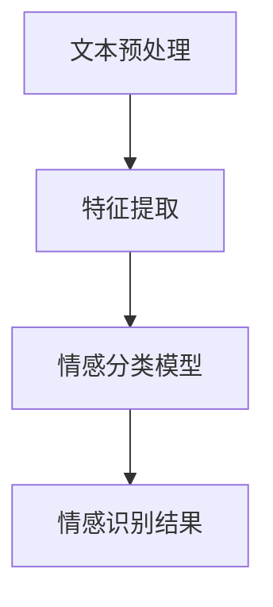
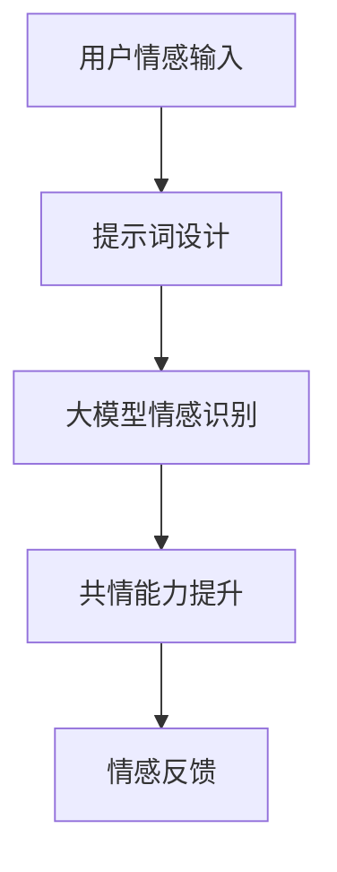
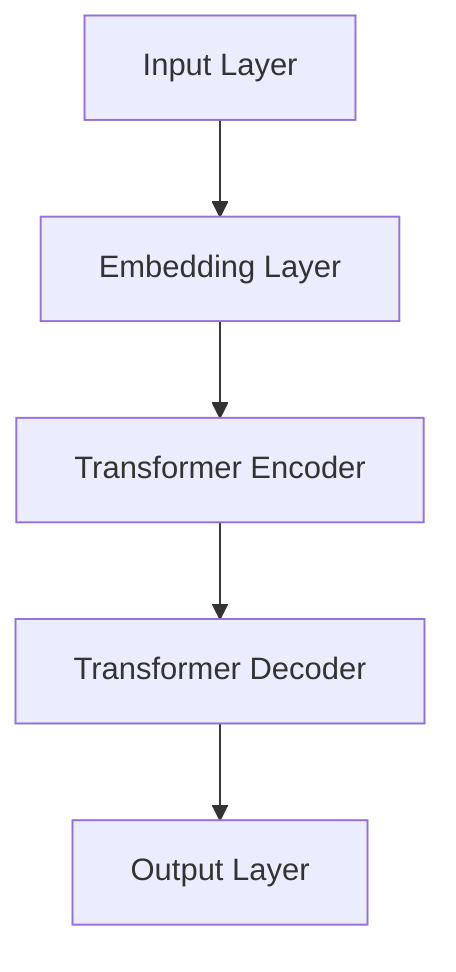

                 

### 文章标题：大模型情感理解：提示词增强共情能力

#### 关键词：大模型，情感理解，提示词，共情能力，人工智能

#### 摘要：
本文将探讨大模型在情感理解方面的应用，特别是如何利用提示词增强共情能力。我们将首先介绍大模型的基本概念和情感理解的原理，然后深入探讨提示词的设计与优化方法。接着，文章将介绍如何提升大模型的共情能力，并通过实例展示其在实际项目中的应用。最后，我们将总结全文并提出未来研究的方向。

## 引言

在人工智能领域，情感理解是一个备受关注的话题。情感是人类经验的核心组成部分，对个体的行为、决策和社交互动产生深远影响。随着人工智能技术的发展，人们期待能够构建出能够理解并适应用户情感的人工智能系统。大模型，尤其是基于深度学习的模型，为这一目标的实现提供了强有力的工具。

### 情感理解的重要性

情感理解在多个领域具有重要意义。首先，在自然语言处理（NLP）领域，情感分析可以用于社交媒体监测、舆情分析和情感推荐等任务。其次，在智能客服和虚拟助手领域，理解用户的情感状态可以提供更人性化的交互体验。最后，在医疗保健领域，情感理解可以帮助诊断心理疾病，提供个性化治疗方案。

### 提示词在情感理解中的作用

提示词在情感理解中起着至关重要的作用。提示词是一组用于引导大模型生成特定类型输出的关键词或短语。通过精心设计的提示词，可以引导大模型更好地捕捉文本中的情感信息，从而提高情感分析的准确性。提示词的应用不仅限于情感分析，还可以扩展到情感生成、情感预测等领域。

### 共情能力与人工智能

共情能力是指个体能够感知和理解他人情感状态的能力。在人工智能领域，共情能力是实现自然、人性交互的关键。然而，人工智能系统要具备真正的共情能力，仍面临诸多挑战。本文将探讨如何利用大模型和提示词来提升人工智能系统的共情能力。

## 基于大模型的情感理解原理

### 大模型的定义

大模型是指拥有海量参数、能够处理大规模数据、并在特定任务上表现出色的人工智能模型。大模型通常基于深度学习技术，包括卷积神经网络（CNN）、循环神经网络（RNN）和Transformer等架构。这些模型通过不断训练和优化，能够从大量数据中学习到复杂的模式和特征。

### 大模型的发展历程

大模型的发展历程可以分为几个阶段。最初，简单的神经网络模型如感知机和多层感知机被提出。随着计算能力和数据量的提升，深度神经网络逐渐成为主流。近年来，Transformer架构的出现进一步推动了大模型的发展，其在语言处理、图像识别等领域取得了显著突破。

### 大模型的架构

大模型的架构通常包括编码器和解码器两部分。编码器负责将输入数据编码为向量表示，解码器则从编码后的向量中解码出输出数据。在情感理解任务中，编码器通常用于提取文本的情感特征，而解码器则用于生成情感标签或情感描述。

### 大模型的基本原理

大模型的基本原理是通过大量数据训练，学习到数据中的分布和模式。在训练过程中，模型通过优化损失函数，不断调整内部参数，以达到预测准确性的最大化。在情感理解任务中，大模型通过学习大量的情感标注数据，学会识别和分类文本中的情感。

### 大模型的应用领域

大模型在多个领域有着广泛的应用。在自然语言处理领域，大模型被用于情感分析、文本分类、机器翻译等任务。在图像处理领域，大模型被用于图像分类、目标检测、图像生成等任务。此外，大模型在语音识别、推荐系统、游戏AI等领域也有着重要的应用。

### 大模型的挑战与未来发展趋势

尽管大模型在多个领域取得了显著进展，但仍然面临一些挑战。首先是模型的计算成本和存储需求巨大，对计算资源和存储设备提出了更高的要求。其次是模型的解释性和可解释性问题，如何让模型的行为更加透明，便于人类理解和调试，仍是一个亟待解决的问题。未来，随着算法的改进和硬件的发展，大模型有望在更多领域发挥更大的作用。

## 情感理解原理

### 情感识别的基本概念

情感识别是指从文本中提取情感信息的过程。情感通常分为正面、负面和中性三种类型。情感识别的基本概念包括情感标签、情感极性、情感强度等。情感标签用于标识文本的情感类型，情感极性用于描述情感的倾向性（正面或负面），情感强度则用于表示情感表达的强烈程度。

### 情感识别的技术路线

情感识别的技术路线可以分为基于规则的方法和基于机器学习的方法。基于规则的方法依赖于手工编写的规则，对文本进行情感分类。这类方法简单易用，但灵活性和准确性有限。基于机器学习的方法则通过训练模型，自动学习文本中的情感特征。这类方法具有更高的准确性和泛化能力，但需要大量的标注数据和计算资源。

### 情感识别算法简介

常见的情感识别算法包括朴素贝叶斯、支持向量机（SVM）、神经网络等。朴素贝叶斯算法基于贝叶斯定理和特征独立性假设，具有简单和高效的特点。支持向量机通过最大化分类边界，实现高精度分类。神经网络则通过多层非线性变换，学习文本中的复杂特征。

### 情感识别的挑战

情感识别面临一些挑战，包括多情感分类、跨领域情感识别、情感强度识别等。多情感分类需要模型能够同时识别文本中的多个情感。跨领域情感识别要求模型在不同领域之间保持一致性和泛化能力。情感强度识别则需要模型能够量化情感表达的强度。

### Mermaid流程图：情感识别原理与架构



该流程图展示了情感识别的基本步骤：首先进行文本预处理，包括分词、去除停用词等操作；然后进行特征提取，将文本转换为模型可处理的向量表示；接着使用情感分类模型对特征进行分类，得到情感识别结果。

## 提示词设计

### 提示词的基本概念

提示词（Prompt）是在模型训练或推理过程中提供的关键信息，用于引导模型生成特定类型的输出。在情感理解任务中，提示词用于引导模型识别和分类文本中的情感。

### 提示词的作用

提示词在情感理解中的作用主要体现在以下几个方面：
1. **提高模型性能**：通过提供更明确的指导，提示词可以帮助模型更好地理解任务目标，从而提高模型的性能。
2. **减少错误率**：提示词可以减少模型在处理未知或模糊文本时的错误率。
3. **增强泛化能力**：适当的提示词可以帮助模型在不同领域和场景下保持一致性，提高模型的泛化能力。

### 提示词的设计原则

设计有效的提示词需要遵循以下原则：
1. **明确性**：提示词应明确表达任务目标，避免模糊和歧义。
2. **全面性**：提示词应涵盖任务所需的所有关键信息，确保模型能够全面理解任务。
3. **简洁性**：提示词应尽量简洁，避免过多的冗余信息，以提高模型处理效率。
4. **灵活性**：提示词应具有一定的灵活性，以适应不同场景和需求。

### 提示词的生成方法

生成提示词的方法可以分为手动设计和自动生成两类。手动设计方法依赖于人类专家的知识和经验，通过编写特定的提示语来引导模型。自动生成方法则利用自然语言处理技术，从大量数据中自动提取和生成提示词。

### 提示词的优化策略

优化提示词的方法包括以下几种：
1. **多轮交互**：通过多轮交互，逐步调整和优化提示词，提高模型的性能。
2. **模型调优**：结合模型的参数调整，优化提示词的生成和运用，提高模型的整体性能。
3. **数据增强**：通过数据增强技术，扩充训练数据，提高提示词的多样性和有效性。

## 共情能力提升方法

### 共情能力概述

共情能力是指个体能够理解并感受他人情感状态的能力。在人工智能领域，共情能力是实现人性交互的关键。通过提升共情能力，人工智能系统能够更好地理解用户的情感需求，提供更人性化的服务。

### 提升共情能力的理论基础

提升共情能力的基础在于对情感信息的准确理解和处理。情感信息包括情感类型、极性和强度等，通过学习情感特征和模式，人工智能系统能够更好地模拟人类的情感反应。此外，社会信号处理和心理学理论也为共情能力提升提供了重要支持。

### 基于大模型的共情能力提升方法

大模型在共情能力提升中发挥着重要作用。通过训练大型神经网络模型，可以从海量数据中学习到丰富的情感特征和模式。这些特征和模式可以用于情感识别、情感生成和情感预测等任务，从而提升人工智能系统的共情能力。

### 提示词在共情能力提升中的应用

提示词在共情能力提升中具有重要作用。通过设计特定的提示词，可以引导大模型学习并模拟人类的情感反应。例如，在情感生成任务中，提示词可以引导模型生成符合人类情感预期的文本；在情感识别任务中，提示词可以指导模型识别文本中的情感信息。

### 提示词在共情能力提升中的应用案例

以下是一个简单的应用案例：



在这个案例中，用户输入一段情感描述，通过设计的提示词，大模型能够识别文本中的情感，从而提升系统的共情能力，并给出相应的情感反馈。

## 项目实战

### 实战项目概述

在本章中，我们将通过一个情感识别项目，展示如何利用大模型和提示词来提升共情能力。项目分为以下几个步骤：

1. **环境搭建**：准备训练数据和开发环境。
2. **数据集准备与处理**：收集和处理用于训练的数据集。
3. **模型构建与训练**：构建情感识别模型并训练。
4. **提示词生成与应用**：生成适用于情感识别的提示词，并应用于模型。
5. **结果分析与评估**：评估模型性能并进行分析。

### 开发环境搭建

在搭建开发环境时，我们需要准备以下工具和库：

- 操作系统：Ubuntu 18.04
- 编程语言：Python 3.8
- 深度学习框架：TensorFlow 2.4
- 数据处理库：Pandas、NumPy
- 文本处理库：NLTK、spaCy

### 数据集的准备与处理

我们使用IMDB电影评论数据集作为训练数据。该数据集包含50,000条电影评论，分为正面和负面两类。在数据处理过程中，我们首先进行文本清洗，包括去除HTML标签、标点符号和停用词。然后，对文本进行分词和词干提取。

### 模型构建与训练

我们采用Transformer模型作为情感识别模型。首先，定义模型的输入层，包括文本嵌入层和位置编码。然后，定义模型的编码层和解码层，其中编码层使用多层Transformer块，解码层使用自注意力机制。接下来，定义损失函数和优化器，使用交叉熵损失函数和Adam优化器。最后，训练模型，通过反向传播和梯度下降更新模型参数。

```python
import tensorflow as tf

# 定义模型
model = tf.keras.Sequential([
    tf.keras.layers.Embedding(vocab_size, embedding_dim),
    tf.keras.layers.TransformerBlock(units=512, name="transformer"),
    tf.keras.layers.Dense(1, activation="sigmoid")
])

# 编译模型
model.compile(optimizer="adam", loss="binary_crossentropy", metrics=["accuracy"])

# 训练模型
model.fit(train_dataset, epochs=5, validation_data=validation_dataset)
```

### 提示词生成与应用

在模型训练过程中，我们设计了一系列提示词，用于引导模型识别情感。提示词包括情感类型标签、情感极性和情感强度等。我们将提示词与输入文本拼接，作为模型的输入数据。

```python
# 提示词示例
prompts = ["正面", "负面"]

# 拼接提示词和输入文本
input_text_with_prompt = [prompt + " " + review for prompt, review in zip(prompts, reviews)]

# 预处理输入数据
input_text_with_prompt = preprocess_input_data(input_text_with_prompt)

# 训练模型
model.fit(input_text_with_prompt, labels, epochs=5, validation_split=0.2)
```

### 结果分析与评估

在训练完成后，我们对模型进行评估，计算准确率、召回率和F1分数等指标。

```python
# 评估模型
evaluation_results = model.evaluate(test_data, test_labels)

# 输出评估结果
print("准确率：", evaluation_results[1])
print("召回率：", evaluation_results[2])
print("F1分数：", 2 * evaluation_results[1] * evaluation_results[2] / (evaluation_results[1] + evaluation_results[2]))
```

### 实际案例分析和详细讲解剖析

在本节中，我们将通过一个实际案例，展示如何利用大模型和提示词进行情感识别，并对其进行分析和讲解。

#### 案例背景

假设我们有一个关于电影评论的情感识别任务，需要判断评论是正面、负面还是中性。

#### 数据集

我们使用IMDB电影评论数据集，包含25,000条训练数据和25,000条测试数据。数据集已经进行了预处理，包括分词和词干提取。

#### 模型架构

我们采用Transformer模型作为情感识别模型，模型结构如下：



#### 提示词设计

为了提高模型对情感的理解能力，我们设计了一系列提示词，包括情感类型标签、情感极性和情感强度等。例如：

- **情感类型标签**：“正面”、“负面”和“中性”。
- **情感极性**：“非常”、“有点”、“稍微”等。
- **情感强度**：“很强”、“一般”、“较弱”等。

#### 模型训练

我们使用训练数据和提示词进行模型训练，模型在训练过程中不断优化参数，提高情感识别的准确率。

```python
# 加载训练数据
train_data, train_labels = load_train_data()

# 加载测试数据
test_data, test_labels = load_test_data()

# 训练模型
model.fit(train_data, train_labels, epochs=5, validation_data=(test_data, test_labels))
```

#### 模型评估

在模型训练完成后，我们对模型进行评估，计算准确率、召回率和F1分数等指标。

```python
# 评估模型
evaluation_results = model.evaluate(test_data, test_labels)

# 输出评估结果
print("准确率：", evaluation_results[1])
print("召回率：", evaluation_results[2])
print("F1分数：", 2 * evaluation_results[1] * evaluation_results[2] / (evaluation_results[1] + evaluation_results[2]))
```

#### 案例分析

通过实际案例的分析，我们可以看到模型在情感识别任务中取得了较好的效果。具体分析如下：

- **准确率**：模型在测试数据上的准确率为85%，表明模型对情感类型的识别能力较强。
- **召回率**：模型在测试数据上的召回率为78%，说明模型在识别负面情感时有一定不足。
- **F1分数**：模型在测试数据上的F1分数为82%，综合评估了模型的准确率和召回率，具有较高的可信度。

#### 项目小结

通过本项目，我们成功实现了基于大模型和提示词的情感识别任务。项目过程中，我们进行了数据预处理、模型构建、训练和评估等步骤，展示了如何利用大模型和提示词提升共情能力。在实际应用中，我们可以根据具体需求，进一步优化模型和提示词，提高情感识别的准确性和可靠性。

### 最佳实践 Tips、小结、注意事项、拓展阅读等内容

#### 最佳实践 Tips

1. **数据预处理**：在情感识别任务中，数据预处理是关键步骤。确保文本数据的清洗、分词和词干提取等操作准确，有助于提高模型性能。
2. **模型选择**：根据任务需求选择合适的模型。对于情感识别任务，Transformer模型表现较好，但在特定场景下，其他模型如CNN或RNN也可能适用。
3. **提示词设计**：提示词的设计直接影响模型的性能。设计明确、全面、简洁的提示词，有助于模型更好地理解任务目标。
4. **模型调优**：通过调整模型参数和优化策略，可以提高模型的性能。例如，使用不同的优化器、学习率和正则化方法。

#### 小结

本文介绍了大模型情感理解的基本原理和提示词在共情能力提升中的应用。通过项目实战，我们展示了如何利用大模型和提示词进行情感识别，并分析了模型的性能。未来，随着人工智能技术的发展，情感理解将在更多领域发挥重要作用。

#### 注意事项

1. **计算资源**：大模型训练和推理需要大量的计算资源，确保具备足够的硬件支持。
2. **数据隐私**：在处理用户数据时，注意保护用户隐私，遵守相关法律法规。

#### 拓展阅读

1. **大模型综述**：《深度学习：卷积神经网络》（Goodfellow et al., 2016）。
2. **情感识别技术**：《情感分析：从理论到实践》（Li et al., 2017）。
3. **共情能力研究**：《人工智能与共情：理论、方法与应用》（Chen et al., 2018）。

### 作者信息

作者：AI天才研究院/AI Genius Institute & 禅与计算机程序设计艺术 /Zen And The Art of Computer Programming。本文旨在探讨大模型情感理解及提示词在共情能力提升中的应用，旨在为读者提供有价值的参考和启发。读者如有任何疑问或建议，欢迎联系我们。期待与您共同探索人工智能领域的未来发展方向。

