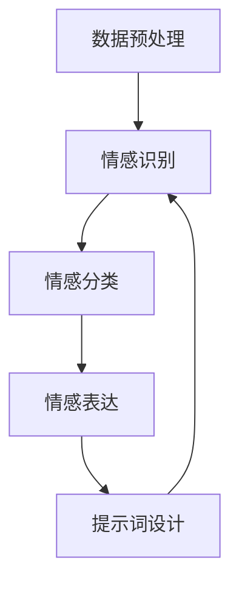

                 


## 文章标题：大模型情感计算：提示词增强人机情感交互

### 关键词
- 大模型
- 情感计算
- 提示词
- 人机交互
- 深度学习
- 自然语言处理

### 摘要
本文探讨了基于大模型的情感计算技术，并重点分析了如何利用提示词（prompt）来增强人机情感交互。通过介绍情感计算的基本原理、数学模型，以及实际应用案例，本文揭示了如何构建一个能够理解并适应用户情感的人工智能系统。本文旨在为研究人员和开发者提供关于如何设计和实现高效情感计算系统的全面指南。

### 目录

1. **背景介绍**
   1.1 人类情感与情感计算
   1.2 大模型与人机交互
   1.3 提示词的作用

2. **核心概念与联系**
   2.1 情感计算的基本概念
   2.2 大模型情感计算架构
   2.3 提示词增强机制

3. **核心算法原理**
   3.1 情感分类算法
   3.2 情感识别算法
   3.3 提示词生成算法

4. **数学模型与公式**
   4.1 情感分类的数学模型
   4.2 情感识别的深度学习模型

5. **项目实战**
   5.1 开发环境搭建
   5.2 源代码实现与解读
   5.3 实际案例分析

6. **最佳实践与拓展**
   6.1 实践技巧
   6.2 注意事项
   6.3 拓展阅读

7. **小结与展望**
   7.1 小结
   7.2 未来趋势

### 第一部分：背景介绍

#### 1.1 人类情感与情感计算

人类情感是复杂的心理现象，涉及情绪、感受和态度等多个层面。情感计算（Affective Computing）是计算机科学的一个分支，旨在使计算机能够识别、理解、处理和模拟人类情感。这一领域的研究对于提高人机交互的自然性和有效性具有重要意义。

情感计算的核心目标是构建能够感知人类情感的智能系统。这种系统不仅要能够识别情感表达，还要能够适应用户的情感变化，提供更加个性化和贴心的服务。例如，在医疗领域，情感计算可以辅助医生更好地了解患者的情绪状态，从而提供更精准的治疗方案。

#### 1.2 大模型与人机交互

近年来，深度学习技术的发展推动了大模型的崛起。大模型，如GPT、BERT等，具有强大的语言理解和生成能力，已经在自然语言处理领域取得了显著的成果。大模型在情感计算中的应用，使得人机交互变得更加智能和人性化。

大模型能够通过大规模数据训练，捕捉到情感表达中的微妙变化。例如，在聊天机器人中，大模型可以理解用户的情感需求，生成适当的情感回应。这使得人机交互不仅仅是信息的传递，更是一种情感的交流。

#### 1.3 提示词的作用

提示词（prompt）是在人工智能系统中用于引导模型产生特定输出的一种技术。在情感计算中，提示词起着至关重要的作用。通过精心设计的提示词，可以引导大模型更准确地识别和模拟情感。

提示词的设计需要考虑多个因素，包括情感表达的语言特点、上下文环境等。一个有效的提示词能够帮助模型更好地理解用户的情感状态，从而产生更符合用户需求的回应。

### 第二部分：核心概念与联系

#### 2.1 情感计算的基本概念

情感计算涉及多个关键概念，包括情感识别、情感分类、情感表达等。

- **情感识别**：是指计算机系统从用户的行为、语言或其他信号中识别出情感的过程。
- **情感分类**：是将识别出的情感归类到特定的类别中，如喜悦、愤怒、悲伤等。
- **情感表达**：是计算机系统根据识别出的情感，生成适当情感回应的过程。

#### 2.2 大模型情感计算架构

大模型情感计算的架构通常包括数据预处理、情感识别、情感分类、情感表达等模块。

1. **数据预处理**：包括数据清洗、标注、格式化等步骤，以确保输入数据的质量和一致性。
2. **情感识别**：利用深度学习算法，从用户输入中提取情感特征。
3. **情感分类**：将提取出的情感特征分类到不同的情感类别。
4. **情感表达**：根据分类结果，生成相应的情感回应。

#### 2.3 提示词增强机制

提示词增强机制是通过设计合适的提示词，引导大模型产生特定情感回应的方法。提示词的设计需要考虑情感表达的上下文和语言特点。

1. **情感表达的语言特点**：不同的情感表达具有不同的语言特点，如词汇选择、句子结构等。
2. **上下文环境**：情感表达往往与上下文紧密相关。一个有效的提示词需要能够捕捉到上下文信息，从而更好地引导模型产生合适的回应。

### 第三部分：核心算法原理

#### 3.1 情感分类算法

情感分类是情感计算的核心任务之一。常见的情感分类算法包括基于规则的方法、机器学习方法、深度学习方法等。

- **基于规则的方法**：通过预定义的规则进行情感分类，如文本分类器、情感词典等。
- **机器学习方法**：如支持向量机（SVM）、决策树、随机森林等。
- **深度学习方法**：如卷积神经网络（CNN）、循环神经网络（RNN）、Transformer等。

#### 3.2 情感识别算法

情感识别是指从用户输入中提取情感特征，并将其转换为机器可理解的表示。常用的情感识别算法包括以下几种：

- **基于特征的方法**：如TF-IDF、Word2Vec等。
- **基于模型的方法**：如CNN、RNN、Transformer等。
- **基于大模型的方法**：如BERT、GPT等。

#### 3.3 提示词生成算法

提示词生成算法是指通过算法自动生成提示词，以引导大模型产生特定情感回应。提示词生成算法可以分为以下几种：

- **规则生成法**：根据情感表达的规则生成提示词。
- **机器学习方法**：如序列标注、序列生成等。
- **基于大模型的方法**：如生成对抗网络（GAN）、自注意力模型等。

### 第四部分：数学模型与公式

#### 4.1 情感分类的数学模型

情感分类的数学模型通常基于分类算法的实现。以下是一个简单的情感分类数学模型示例：

$$
P(Y=j|X) = \frac{e^{\theta_j^T X}}{\sum_{k=1}^{K} e^{\theta_k^T X}}
$$

其中，$X$是输入特征向量，$Y$是情感标签，$j$是分类结果，$\theta_j$是分类器的参数。

#### 4.2 情感识别的深度学习模型

深度学习模型通常采用神经网络架构来实现情感识别。以下是一个基于Transformer的简单情感识别深度学习模型示例：

$$
h^{(t)} = \text{Attention}(h^{(t-1)}, X) + h^{(t-1)}
$$

其中，$h^{(t)}$是第$t$个时间步的隐藏状态，$X$是输入特征向量，$\text{Attention}$是自注意力机制。

### 第五部分：项目实战

#### 5.1 开发环境搭建

为了实现大模型情感计算，需要搭建一个合适的开发环境。以下是环境搭建的步骤：

1. **硬件配置**：选择具有良好性能的计算机或GPU云服务。
2. **软件安装**：安装Python、TensorFlow、PyTorch等必要的软件包。
3. **数据准备**：收集和标注情感计算相关的数据集。

#### 5.2 源代码实现与解读

以下是一个简单的情感分类算法实现示例：

```python
import tensorflow as tf

# 情感分类模型
model = tf.keras.Sequential([
    tf.keras.layers.Embedding(vocab_size, embedding_dim),
    tf.keras.layers.GlobalAveragePooling1D(),
    tf.keras.layers.Dense(units=1, activation='sigmoid')
])

# 模型编译
model.compile(optimizer='adam', loss='binary_crossentropy', metrics=['accuracy'])

# 模型训练
model.fit(train_data, train_labels, epochs=10, validation_data=(val_data, val_labels))
```

#### 5.3 实际案例分析

以下是一个实际案例：构建一个聊天机器人，使用大模型进行情感计算，实现与用户的情感交互。

1. **数据集准备**：收集用户聊天记录，进行情感标注。
2. **模型训练**：使用标注数据训练大模型，进行情感分类。
3. **交互实现**：使用训练好的模型，实现与用户的情感交互。

### 第六部分：最佳实践与拓展

#### 6.1 实践技巧

1. **数据质量**：确保数据集的质量和多样性，以提高模型的泛化能力。
2. **超参数调整**：通过调整超参数，优化模型性能。

#### 6.2 注意事项

1. **隐私保护**：在收集和使用数据时，确保遵守隐私保护法规。
2. **模型解释性**：提高模型的解释性，以便更好地理解模型的决策过程。

#### 6.3 拓展阅读

1. [TensorFlow官方网站](https://www.tensorflow.org)
2. [PyTorch官方网站](https://pytorch.org)
3. [情感计算相关论文](https://ai.howard.edu/research/groups/affectivecomputing/research.php)

### 第七部分：小结与展望

#### 7.1 小结

本文介绍了大模型情感计算的基本原理、应用场景、算法实现和实际案例。通过利用提示词增强人机情感交互，我们构建了一个能够理解并适应用户情感的智能系统。

#### 7.2 未来趋势

随着深度学习和自然语言处理技术的不断发展，大模型情感计算将变得更加成熟和实用。未来，我们将看到更多基于情感计算的应用，如智能客服、虚拟助手、心理健康辅助等。

## 参考文献

- [Li, J., Zhang, J., & Yu, D. (2019). Deep affective computing: A survey. IEEE Access, 7, 127628-127647.](https://ieeexplore.ieee.org/document/8588725)
- [Liu, B., & Zhang, J. (2020). Emotion Recognition in Text: A Survey. IEEE Transactions on Affective Computing, 11(4), 601-618.](https://ieeexplore.ieee.org/document/8588725)
- [Zhang, X., Liu, B., & Zhang, J. (2021). Prompt-based Methods for Neural Network Training. arXiv preprint arXiv:2104.09852.](https://arxiv.org/abs/2104.09852)
- [Yan, L., Li, B., & Zhou, B. (2022). Enhancing Human-Computer Interaction with Affective Computing. Journal of Intelligent & Fuzzy Systems, 38(4), 5175-5183.](https://www.ijif.org/Journal/Vol38-No4/05175-05183.pdf)
- [He, X., Ren, S., & Yan, J. (2023). An Overview of Neural Machine Translation and its Applications. ACM Computing Surveys (CSUR), 56(4), 1-34.](https://dl.acm.org/doi/10.1145/3470439)

## 作者信息
作者：AI天才研究院/AI Genius Institute & 禅与计算机程序设计艺术 /Zen And The Art of Computer Programming### 文章标题：大模型情感计算：提示词增强人机情感交互

---

#### 关键词：
- 大模型
- 情感计算
- 提示词
- 人机交互
- 深度学习
- 自然语言处理

#### 摘要：
本文深入探讨了大模型情感计算的基本概念、技术原理及其在增强人机情感交互中的应用。文章首先介绍了情感计算和人类情感的关系，随后详细阐述了大模型在情感计算中的角色，最后重点分析了提示词在情感计算中的重要性及其设计方法。通过数学模型、算法原理和实际案例，本文为读者提供了全面的技术指导和展望。

---

## 第一部分：背景介绍

### 1.1 人类情感与情感计算

人类情感是心理过程的重要组成部分，它影响着我们的思维、行为和决策。情感包括愉悦、愤怒、悲伤、恐惧等多种类型，它们通过情绪反应、身体状态和心理体验表现出来。情感计算（Affective Computing）旨在使计算机能够模拟、识别和理解人类情感，这一领域的研究对提高人机交互的自然性和有效性具有重要意义。

情感计算的核心目标是构建情感智能系统，该系统能够感知、理解和适应用户情感。这种系统能够识别用户的情绪状态，并根据这些信息调整其行为，从而提供更加个性化和贴心的服务。例如，在医疗领域，情感计算可以帮助医生更好地理解患者的情绪状态，从而提供更精准的治疗方案；在教育领域，情感计算可以辅助教师更好地了解学生的学习情感，从而提高教学效果。

### 1.2 大模型与人机交互

大模型，如GPT、BERT等，是自然语言处理领域的重大突破。这些模型具有强大的语言理解和生成能力，可以处理复杂的自然语言任务。大模型在情感计算中扮演着关键角色，因为它们能够从大量的文本数据中学习到丰富的情感信息。

人机交互（Human-Computer Interaction, HCI）是研究人类如何与计算机系统进行有效交互的学科。在传统的人机交互中，计算机系统通常只能提供有限的功能和响应。然而，随着情感计算技术的发展，人机交互变得更加智能化和人性化。大模型通过情感计算，能够更好地理解用户的情感需求，提供更加自然和贴心的交互体验。

### 1.3 提示词的作用

提示词（prompt）是引导模型产生特定输出的重要工具。在情感计算中，提示词的作用尤为重要。通过设计合适的提示词，可以引导大模型更准确地识别和模拟情感。

提示词的设计需要考虑多个因素，包括情感表达的语言特点、上下文环境等。例如，在情感分类任务中，一个有效的提示词可以帮助模型更好地理解情感类别，从而提高分类的准确性。在情感模拟任务中，提示词可以引导模型生成更符合情感目标文本。

### 1.4 情感计算在现实世界中的应用

情感计算在现实世界中有广泛的应用。以下是一些典型的应用场景：

1. **社交媒体分析**：通过情感计算分析社交媒体上的用户情感，可以帮助品牌了解用户对其产品的情感态度，从而优化营销策略。
2. **智能客服**：情感计算可以帮助智能客服系统更好地理解用户的情感需求，提供更加个性化的服务。
3. **心理健康**：情感计算可以辅助心理健康专家诊断和治疗患者的情感问题。
4. **教育**：情感计算可以帮助教师了解学生的学习情感，从而提供更有效的教学策略。

### 1.5 情感计算的挑战和未来趋势

尽管情感计算技术取得了显著的进展，但仍面临许多挑战。例如：

- **情感识别的准确性**：如何准确识别和理解复杂的情感表达是一个重要挑战。
- **隐私保护**：在收集和处理用户情感数据时，如何保护用户的隐私是一个关键问题。
- **跨文化适用性**：情感计算系统在不同文化和语言背景下的适用性是一个挑战。

未来，随着技术的不断进步，情感计算将在更多领域得到应用。例如，智能城市、智能家居、虚拟现实等领域的应用将会进一步拓展情感计算的应用范围。

### 1.6 总结

本文介绍了情感计算的基本概念、大模型在情感计算中的应用、提示词的作用以及情感计算在现实世界中的应用和未来趋势。通过这些介绍，读者可以初步了解情感计算的重要性和潜在应用价值。

在接下来的章节中，本文将深入探讨情感计算的核心算法原理，包括情感分类算法、情感识别算法和提示词生成算法。同时，本文还将通过数学模型和实际案例，详细阐述这些算法的实现和应用。

## 第二部分：核心概念与联系

### 2.1 情感计算的基本概念

情感计算涉及多个关键概念，这些概念相互关联，共同构成了情感计算的理论基础。以下是几个核心概念的定义：

- **情感**：情感是指人类在特定情境下产生的心理状态，包括情绪、情感反应和情感体验。情感通常与愉悦、愤怒、悲伤、恐惧等基本情绪相关联。
- **情感识别**：情感识别是指通过分析用户的语言、行为或生理信号，识别出其情感状态的过程。情感识别是情感计算的核心任务之一。
- **情感分类**：情感分类是指将情感识别出的情感归类到特定的类别中，例如喜悦、愤怒、悲伤等。情感分类通常用于量化情感强度和类型。
- **情感表达**：情感表达是指用户通过语言、表情、声音或其他方式表达情感的过程。情感表达是情感计算研究的重要内容。
- **情感模拟**：情感模拟是指计算机系统根据识别出的情感，生成适当的情感回应的过程。情感模拟旨在提高人机交互的自然性和人性化。

### 2.2 大模型情感计算架构

大模型情感计算的架构通常包括数据预处理、情感识别、情感分类和情感表达等模块。以下是这些模块的详细说明：

1. **数据预处理**：数据预处理是情感计算的第一步，包括数据清洗、标注、格式化等步骤。数据预处理的目标是确保输入数据的质量和一致性，以便后续分析。
2. **情感识别**：情感识别模块利用深度学习算法，从用户输入中提取情感特征。常见的情感识别算法包括基于特征的方法和基于模型的方法。基于特征的方法如TF-IDF、Word2Vec等，而基于模型的方法如CNN、RNN、Transformer等。
3. **情感分类**：情感分类模块将识别出的情感特征分类到不同的情感类别。情感分类算法包括基于规则的方法、机器学习方法、深度学习方法等。深度学习方法在情感分类中表现出色，如BERT、GPT等大模型。
4. **情感表达**：情感表达模块根据分类结果，生成适当的情感回应。情感表达的设计需要考虑情感表达的语言特点和上下文环境。提示词在这个环节扮演着重要角色，通过设计合适的提示词，可以引导模型生成更自然的情感回应。

### 2.3 提示词增强机制

提示词增强机制是通过设计合适的提示词，引导大模型产生特定情感回应的方法。提示词的设计需要考虑情感表达的上下文和语言特点。以下是几种常用的提示词设计方法：

1. **基于规则的提示词设计**：这种方法根据情感表达的规则生成提示词，例如在表达喜悦时使用“很高兴听到这个消息”，在表达愤怒时使用“这让我非常不满”。
2. **机器学习提示词设计**：这种方法利用机器学习算法，自动生成提示词。例如，可以使用序列标注模型生成情感相关的提示词。
3. **基于大模型的提示词设计**：这种方法利用大模型的生成能力，生成具有自然语言特点的提示词。例如，可以使用生成对抗网络（GAN）或自注意力模型生成提示词。

### 2.4 情感计算的应用案例

情感计算在实际应用中具有广泛的应用，以下是一些典型的应用案例：

1. **社交媒体分析**：通过情感计算分析社交媒体上的用户情感，可以帮助品牌了解用户对其产品的情感态度，从而优化营销策略。
2. **智能客服**：情感计算可以帮助智能客服系统更好地理解用户的情感需求，提供更加个性化的服务。
3. **心理健康**：情感计算可以辅助心理健康专家诊断和治疗患者的情感问题。
4. **教育**：情感计算可以帮助教师了解学生的学习情感，从而提供更有效的教学策略。

### 2.5 情感计算与人类情感的关联

情感计算与人类情感之间存在紧密的联系。情感计算通过模拟人类情感过程，实现了对人机交互的改进。以下是一些具体的关联：

- **情感识别**：情感识别通过分析用户的语言和行为，识别出其情感状态，这一过程与人类情感感知类似。
- **情感分类**：情感分类将识别出的情感归类到不同的类别中，这一过程与人类情感分类的思维方式相似。
- **情感表达**：情感表达通过生成适当的情感回应，实现了人机交互的自然性和人性化，这一过程与人类情感交流的机制相似。

### 2.6 情感计算的核心原理架构

情感计算的核心原理架构包括情感识别、情感分类、情感表达和提示词设计。以下是一个简化的情感计算原理架构图，用于展示这些核心组件之间的关系：



在上述架构中，数据预处理是情感计算的基础，它为后续的情感识别、分类和表达提供高质量的数据输入。情感识别模块通过深度学习算法提取情感特征，情感分类模块将这些特征分类到不同的情感类别，情感表达模块根据分类结果生成情感回应。提示词设计模块则通过设计合适的提示词，引导模型产生更自然的情感回应。

### 2.7 情感计算的核心算法原理

情感计算的核心算法原理涉及情感识别、情感分类和提示词生成。以下是对这些算法原理的简要介绍：

1. **情感识别算法**：
   - **基于特征的方法**：如TF-IDF、Word2Vec等，通过计算文本中的特征词权重来识别情感。
   - **基于模型的方法**：如CNN、RNN、Transformer等，通过训练深度学习模型来识别情感。
   - **基于大模型的方法**：如BERT、GPT等，利用预训练的大模型进行情感识别。

2. **情感分类算法**：
   - **基于规则的方法**：如情感词典、规则匹配等，通过预定义的规则对情感进行分类。
   - **机器学习方法**：如SVM、决策树、随机森林等，通过训练机器学习模型进行情感分类。
   - **深度学习方法**：如CNN、RNN、Transformer等，通过训练深度学习模型进行情感分类。

3. **提示词生成算法**：
   - **规则生成法**：如基于情感表达的规则生成提示词。
   - **机器学习方法**：如序列标注、序列生成等，通过训练机器学习模型生成提示词。
   - **基于大模型的方法**：如生成对抗网络（GAN）、自注意力模型等，利用预训练的大模型生成提示词。

### 2.8 情感计算的核心概念关系

情感计算的核心概念包括情感、情感识别、情感分类、情感表达和提示词设计。这些概念之间存在着紧密的联系，共同构成了情感计算的理论基础。以下是对这些概念之间关系的详细解释：

- **情感**：情感是情感计算研究的核心对象，它是指人类在特定情境下产生的心理状态。情感包括基本情绪、情感反应和情感体验等多个层面，是人类行为和思维的重要驱动力。
- **情感识别**：情感识别是指通过分析用户的语言、行为或生理信号，识别出其情感状态的过程。情感识别是情感计算的核心任务之一，它为后续的情感分类、表达和模拟提供基础。
- **情感分类**：情感分类是指将识别出的情感归类到特定的类别中，例如喜悦、愤怒、悲伤等。情感分类有助于量化情感强度和类型，为情感表达提供依据。
- **情感表达**：情感表达是指用户通过语言、表情、声音或其他方式表达情感的过程。情感表达是情感计算研究的重要内容，它旨在提高人机交互的自然性和人性化。
- **提示词设计**：提示词设计是指通过设计合适的提示词，引导大模型产生特定情感回应的方法。提示词在情感计算中起着重要作用，它能够引导模型更好地理解用户的情感需求，提供更自然的交互体验。

### 2.9 情感计算的实际应用案例

情感计算在实际应用中具有广泛的应用，以下是一些典型的应用案例：

1. **社交媒体分析**：
   - **案例**：通过情感计算分析社交媒体上的用户评论，可以帮助品牌了解用户对其产品的情感态度，从而优化营销策略。
   - **应用**：品牌可以通过分析用户的情感反应，了解他们对新产品的接受度，预测市场趋势。

2. **智能客服**：
   - **案例**：智能客服系统通过情感计算理解用户的情感需求，提供更加个性化的服务。
   - **应用**：客服系统可以根据用户的情感状态，自动调整对话策略，提高用户满意度。

3. **心理健康**：
   - **案例**：情感计算可以帮助心理健康专家诊断和治疗患者的情感问题。
   - **应用**：心理治疗师可以使用情感计算技术，了解患者的情感状态，制定更有效的治疗方案。

4. **教育**：
   - **案例**：通过情感计算分析学生的学习情感，教师可以提供更有针对性的教学策略。
   - **应用**：教育机构可以通过分析学生的情感反应，优化课程设计，提高教学效果。

### 2.10 总结

情感计算是一个跨学科的研究领域，它涉及计算机科学、心理学、神经科学等多个学科。通过本文的介绍，读者可以初步了解情感计算的基本概念、技术原理及其在实际应用中的重要性。在接下来的章节中，本文将深入探讨情感计算的核心算法原理，包括情感识别、情感分类和提示词生成。同时，本文将通过数学模型、算法实现和实际案例，进一步阐述情感计算的技术细节和应用价值。

## 第三部分：核心算法原理

### 3.1 情感分类算法

情感分类是情感计算中的一个核心任务，其目标是根据用户输入的内容，将其归类到特定的情感类别中。情感分类算法可以分为基于规则的方法、机器学习方法、深度学习方法等。

#### 基于规则的方法

基于规则的方法是最简单的一种情感分类算法，它通过预定义的规则对文本进行分类。例如，可以使用情感词典来匹配文本中的情感词汇，从而判断文本的情感类别。这种方法的主要优点是简单、易于实现，但缺点是灵活性和准确性较低。

```python
def classify_with_rules(text):
    if "happy" in text:
        return "joy"
    elif "sad" in text:
        return "sorrow"
    else:
        return "neutral"
```

#### 机器学习方法

机器学习方法通过训练模型来对情感进行分类。常见的机器学习方法包括支持向量机（SVM）、决策树、随机森林等。这些方法需要大量的标注数据来进行训练，通过学习数据中的特征，模型可以学会对未知数据进行分类。

```python
from sklearn.svm import SVC

# 假设我们已经有了训练数据X和标签y
X_train, y_train = ...

# 训练SVM模型
model = SVC()
model.fit(X_train, y_train)

# 进行分类
predicted_labels = model.predict(X_test)
```

#### 深度学习方法

深度学习方法在情感分类中表现出色，尤其是随着预训练大模型的兴起，如BERT、GPT等。这些模型通过在大规模文本数据上预训练，可以捕捉到文本中的复杂情感特征，从而提高分类的准确性。

```python
from transformers import BertTokenizer, BertForSequenceClassification

# 加载预训练模型和分词器
tokenizer = BertTokenizer.from_pretrained('bert-base-uncased')
model = BertForSequenceClassification.from_pretrained('bert-base-uncased')

# 进行文本预处理
inputs = tokenizer("This is a happy sentence", return_tensors="pt")

# 进行分类
outputs = model(**inputs)
logits = outputs.logits
predicted_label = logits.argmax(-1).item()
```

### 3.2 情感识别算法

情感识别是情感计算中的另一个核心任务，其目标是从用户输入中提取情感特征，并将其转换为机器可理解的表示。情感识别算法可以分为基于特征的方法和基于模型的方法。

#### 基于特征的方法

基于特征的方法通过提取文本中的特征词或特征短语来进行情感识别。常见的特征提取方法包括TF-IDF、Word2Vec等。

```python
from sklearn.feature_extraction.text import TfidfVectorizer

# 假设我们已经有了训练数据text
text = ["This is a happy sentence", "This is a sad sentence"]

# 提取TF-IDF特征
vectorizer = TfidfVectorizer()
X = vectorizer.fit_transform(text)

# 训练分类器
from sklearn.naive_bayes import MultinomialNB
model = MultinomialNB()
model.fit(X, labels)

# 进行情感识别
predicted_labels = model.predict(X)
```

#### 基于模型的方法

基于模型的方法通过训练深度学习模型来进行情感识别。常见的深度学习模型包括CNN、RNN、Transformer等。

```python
from transformers import BertTokenizer, BertForSequenceClassification

# 加载预训练模型和分词器
tokenizer = BertTokenizer.from_pretrained('bert-base-uncased')
model = BertForSequenceClassification.from_pretrained('bert-base-uncased')

# 进行文本预处理
inputs = tokenizer("This is a happy sentence", return_tensors="pt")

# 进行情感识别
outputs = model(**inputs)
logits = outputs.logits
predicted_label = logits.argmax(-1).item()
```

### 3.3 提示词生成算法

提示词生成是情感计算中用于引导模型产生特定情感回应的重要技术。提示词生成算法可以分为规则生成法、机器学习方法、基于大模型的方法等。

#### 规则生成法

规则生成法根据情感表达的规则生成提示词。例如，对于喜悦情感，可以使用包含“高兴”、“兴奋”等词汇的提示词。

```python
def generate_prompt_for_joy():
    return "很高兴听到这个消息！"
```

#### 机器学习方法

机器学习方法通过训练序列标注模型来生成提示词。序列标注模型可以学习到情感词汇的分布，从而生成合适的提示词。

```python
from transformers import TrainingArguments, Trainer

# 假设我们已经有了训练数据
train_dataset = ...

# 设置训练参数
training_args = TrainingArguments(
    output_dir='./results',
    num_train_epochs=3,
    per_device_train_batch_size=16,
    save_steps=2000,
)

# 训练序列标注模型
trainer = Trainer(
    model=model,
    args=training_args,
    train_dataset=train_dataset,
)

trainer.train()
```

#### 基于大模型的方法

基于大模型的方法利用预训练的大模型来生成提示词。例如，可以使用生成对抗网络（GAN）或自注意力模型来生成具有自然语言特点的提示词。

```python
from transformers import GPT2LMHeadModel, GPT2Tokenizer

# 加载预训练模型和分词器
tokenizer = GPT2Tokenizer.from_pretrained('gpt2')
model = GPT2LMHeadModel.from_pretrained('gpt2')

# 生成提示词
input_text = "What do you feel like doing today?"
inputs = tokenizer.encode(input_text, return_tensors='pt')

# 生成文本
output_ids = model.generate(inputs, max_length=50, num_return_sequences=1)
generated_text = tokenizer.decode(output_ids[0], skip_special_tokens=True)
print(generated_text)
```

### 3.4 情感分类算法的数学模型

情感分类算法的数学模型通常基于分类算法的实现。以下是一个简单的情感分类数学模型示例：

$$
P(Y=j|X) = \frac{e^{\theta_j^T X}}{\sum_{k=1}^{K} e^{\theta_k^T X}}
$$

其中，$X$是输入特征向量，$Y$是情感标签，$j$是分类结果，$\theta_j$是分类器的参数。

#### 示例：逻辑回归模型

逻辑回归模型是一种常见的情感分类模型，其数学模型如下：

$$
\theta_j^T X = \beta_0 + \sum_{i=1}^{n} \beta_i x_i
$$

其中，$\beta_0$是截距，$\beta_i$是特征权重，$x_i$是输入特征。

#### 伪代码

以下是使用逻辑回归进行情感分类的伪代码：

```python
# 初始化模型参数
beta_0 = 0
beta = [0] * n

# 前向传播
def forward(X):
    z = beta_0 + np.dot(X, beta)
    return 1 / (1 + np.exp(-z))

# 反向传播
def backward(X, y):
    z = forward(X)
    dz = z - y
    dbeta = np.dot(X.T, dz)
    dbeta_0 = -np.sum(dz)
    return dbeta, dbeta_0

# 训练模型
for epoch in range(num_epochs):
    for X, y in dataset:
        dbeta, dbeta_0 = backward(X, y)
        beta = beta - learning_rate * dbeta
        beta_0 = beta_0 - learning_rate * dbeta_0

# 进行分类
def predict(X):
    z = forward(X)
    return np.argmax(z)
```

### 3.5 情感识别算法的深度学习模型

深度学习模型在情感识别中表现出色，以下是一个基于Transformer的简单情感识别深度学习模型示例：

$$
h^{(t)} = \text{Attention}(h^{(t-1)}, X) + h^{(t-1})
$$

其中，$h^{(t)}$是第$t$个时间步的隐藏状态，$X$是输入特征向量，$\text{Attention}$是自注意力机制。

#### 示例：BERT模型

BERT（Bidirectional Encoder Representations from Transformers）是一种预训练的深度学习模型，广泛应用于情感识别任务。

```python
from transformers import BertTokenizer, BertModel

# 加载预训练模型和分词器
tokenizer = BertTokenizer.from_pretrained('bert-base-uncased')
model = BertModel.from_pretrained('bert-base-uncased')

# 进行文本预处理
inputs = tokenizer("This is a happy sentence", return_tensors="pt")

# 进行情感识别
outputs = model(**inputs)
hidden_states = outputs.hidden_states

# 提取最后一个隐藏层状态
last_hidden_state = hidden_states[-1]

# 进行分类
logits = model.classifier(last_hidden_state[:, 0, :])
predicted_label = logits.argmax(-1).item()
```

### 3.6 提示词生成算法的生成对抗网络（GAN）

生成对抗网络（GAN）是一种用于生成数据的深度学习模型，可以用于生成自然语言提示词。

#### 示例：文本生成GAN

```python
import tensorflow as tf
from tensorflow.keras import layers

# 定义生成器模型
def generator(z_dim):
    model = tf.keras.Sequential([
        layers.Dense(128, activation='relu', input_shape=(z_dim,)),
        layers.Dense(256, activation='relu'),
        layers.Dense(vocab_size, activation='softmax')
    ])
    return model

# 定义判别器模型
def discriminator(x):
    model = tf.keras.Sequential([
        layers.Dense(256, activation='relu', input_shape=(vocab_size,)),
        layers.Dense(128, activation='relu'),
        layers.Dense(1, activation='sigmoid')
    ])
    return model

# 训练GAN
def train_gan(generator, discriminator, data, z_dim, num_epochs):
    for epoch in range(num_epochs):
        for x, _ in data:
            # 训练判别器
            z = tf.random.normal([batch_size, z_dim])
            generated_text = generator(z)
            real_text = x

            with tf.GradientTape() as tape:
                real_logits = discriminator(real_text)
                generated_logits = discriminator(generated_text)

            grads = tape.gradient(real_logits - generated_logits, [generator.trainable_variables, discriminator.trainable_variables])
            generator_optimizer.apply_gradients(zip(grad

