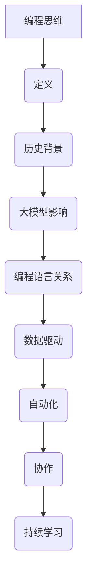
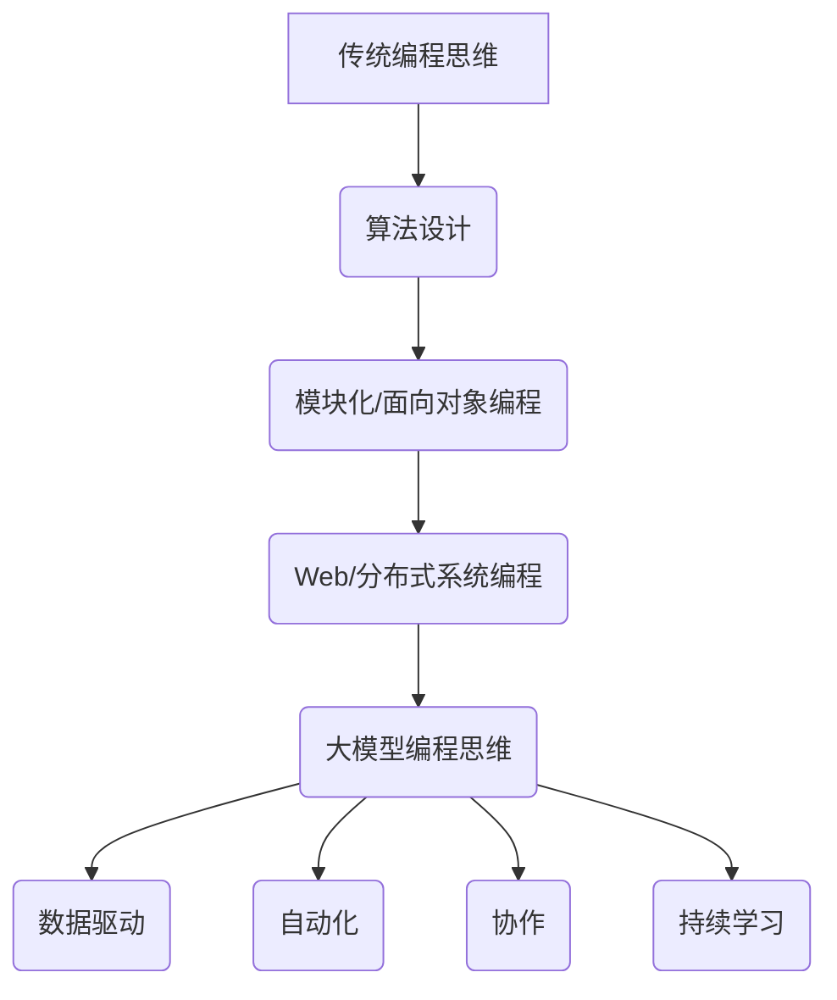

                 

### 文章标题

《大模型时代的编程思维转变》

> 关键词：大模型，编程思维，人工智能，机器学习，编程语言

> 摘要：本文将探讨在大模型时代，编程思维如何发生转变。通过分析传统编程思维模式，探讨大模型时代编程思维的变化，以及大模型对编程语言设计的影响，本文旨在帮助程序员理解并适应这一时代的编程趋势。

---

# 引言

在大模型时代，人工智能（AI）技术的发展正迅速改变我们的生活方式和工作方式。随着深度学习、自然语言处理、计算机视觉等领域的突破，大模型如GPT、BERT、Transformer等成为AI应用的核心驱动力。大模型的出现不仅改变了数据处理和算法设计的方式，也对编程思维产生了深远影响。

编程思维，作为一种解决问题的策略，其核心在于理解问题、设计解决方案、执行和测试。然而，在大模型时代，编程思维面临着一系列新的挑战和机遇。本文旨在深入探讨这一转变，帮助读者理解大模型如何影响编程思维，以及如何在新的时代中实现有效的编程。

# 核心概念与联系

## 编程思维的定义

编程思维是一种逻辑思考和问题解决的方法，它通过设计、编码和调试等步骤来实现计算机程序的功能。编程思维不仅仅是一种技术技能，更是一种抽象思考和问题解决的能力。

### 编程语言的发展历史

编程语言的发展历程可以分为几个阶段：

1. **机器语言和汇编语言**：最早期的编程语言，直接操作计算机硬件。
2. **高级编程语言**：如C、C++、Java等，提供了更抽象的语法和更好的开发效率。
3. **函数式编程语言**：如Haskell、Scala等，强调函数和数据的不可变。
4. **脚本语言和查询语言**：如Python、JavaScript、SQL等，用于快速开发和数据操作。

### 大模型时代的编程思维特点

大模型时代的编程思维特点主要体现在以下几个方面：

1. **数据驱动**：编程过程更加关注数据的质量和处理，数据驱动成为核心。
2. **自动化**：借助自动化工具和脚本，编程过程变得更加高效。
3. **协作**：编程不再是孤立的个体活动，而是团队合作的结果。
4. **持续学习**：编程思维需要不断适应新技术和新算法，持续学习成为必要。

## 编程语言与编程思维的关系

编程语言是表达编程思维的工具。不同类型的编程语言适应不同的编程需求，同时也影响编程思维的演变。例如，面向对象编程强调模块化和复用，而函数式编程强调状态不可变和函数组合。

### Mermaid流程图



# 编程思维转变的详细分析

## 传统编程思维模式

传统编程思维模式通常包括以下步骤：

1. **问题理解**：明确问题的需求和要求。
2. **算法设计**：设计解决问题的算法和数据结构。
3. **编码实现**：将算法转换为具体的代码。
4. **调试和测试**：测试代码的正确性和性能。

### 大模型时代的编程思维变化

在大模型时代，编程思维发生了以下变化：

1. **数据预处理**：数据的质量和处理成为关键，数据预处理变得尤为重要。
2. **模型选择与训练**：选择合适的模型，并进行训练以优化性能。
3. **模型集成与评估**：将模型集成到应用程序中，并进行评估和优化。
4. **自动化与协作**：利用自动化工具和脚本，以及团队合作，提高开发效率。

### 大模型对编程语言设计的影响

大模型的发展促使编程语言设计发生了以下变化：

1. **支持大数据处理**：编程语言需要支持高效的大数据处理。
2. **支持并行计算**：编程语言需要支持并行计算，以利用多核处理器。
3. **支持动态编程**：编程语言需要支持动态编程，以适应快速变化的需求。

## 大模型时代的编程语言特点

1. **动态类型语言**：如Python、JavaScript等，支持快速开发和迭代。
2. **支持大数据处理的库**：如NumPy、Pandas、TensorFlow等，提供高效的数据处理和计算能力。
3. **支持机器学习和深度学习的框架**：如PyTorch、TensorFlow等，提供丰富的模型和算法库。

### 伪代码示例

```python
# 大模型编程思维伪代码
data_preprocessing() {
    // 数据清洗和预处理
}

model_selection() {
    // 选择合适的模型
}

model_training(data) {
    // 使用大模型进行训练
}

model_evaluation() {
    // 评估模型性能
}

application_integration(model) {
    // 将模型集成到应用程序中
}
```

## 数学模型和公式

在大模型时代，编程思维需要理解和应用各种数学模型和公式。以下是一些常见的数学模型和公式：

### 损失函数

$$
L(y, \hat{y}) = \frac{1}{2} (y - \hat{y})^2
$$

### 反向传播算法

$$
\Delta w = \eta \cdot \frac{\partial L}{\partial w}
$$

### 梯度下降

$$
w_{t+1} = w_t - \alpha \cdot \nabla f(w_t)
$$

## 详细讲解与举例说明

### 损失函数

损失函数是机器学习中用来衡量预测结果与真实结果之间差异的函数。它可以帮助我们优化模型参数，以最小化预测误差。以平方损失函数为例，它用于回归问题，计算预测值与真实值之间的差异的平方。

### 反向传播算法

反向传播算法是深度学习中用于计算梯度的一种方法。它通过前向传播计算预测值，然后通过反向传播计算损失函数关于模型参数的梯度。这个过程可以重复进行，以更新模型参数，从而优化模型性能。

### 梯度下降

梯度下降是一种优化算法，用于最小化损失函数。它通过计算损失函数关于模型参数的梯度，并沿着梯度的反方向更新模型参数。这个过程可以重复进行，直到找到损失函数的最小值。

## 项目实战

### 开发环境搭建

在开始项目之前，我们需要搭建一个合适的开发环境。以下是搭建开发环境的一些步骤：

1. 安装Python和相应的依赖库（如NumPy、Pandas、TensorFlow等）。
2. 配置Python解释器和虚拟环境。
3. 安装必要的开发工具（如IDE、版本控制工具等）。

### 源代码详细实现和代码解读

以下是实现一个简单的大模型项目的示例代码：

```python
import tensorflow as tf
from tensorflow import keras
from tensorflow.keras import layers

# 数据预处理
def preprocess_data(data):
    # 数据清洗和预处理
    return processed_data

# 模型定义
def build_model():
    model = keras.Sequential([
        layers.Dense(64, activation='relu', input_shape=(input_shape)),
        layers.Dense(64, activation='relu'),
        layers.Dense(1)
    ])
    return model

# 模型训练
def train_model(model, data, epochs=10):
    model.compile(optimizer='adam', loss='mean_squared_error')
    model.fit(data, epochs=epochs)
    return model

# 模型评估
def evaluate_model(model, test_data):
    loss = model.evaluate(test_data)
    print(f"Test Loss: {loss}")

# 主程序
if __name__ == "__main__":
    # 加载数据
    data = load_data()

    # 数据预处理
    processed_data = preprocess_data(data)

    # 构建模型
    model = build_model()

    # 训练模型
    trained_model = train_model(model, processed_data)

    # 评估模型
    evaluate_model(trained_model, test_data)
```

### 代码应用解读与分析

这段代码是一个简单的大模型项目，用于实现一个回归任务。首先，我们加载数据并进行预处理，然后定义一个简单的模型，使用反向传播算法进行训练。最后，我们对训练好的模型进行评估。

### 实际案例分析和详细讲解剖析

假设我们有一个住房价格预测项目，目标是使用大模型预测某一地区的住房价格。以下是实际案例的分析和详细讲解：

1. **数据收集与预处理**：
   - 收集某一地区的住房数据，包括价格、房屋面积、房间数量等。
   - 对数据进行清洗和预处理，包括缺失值填补、异常值处理等。

2. **模型选择与训练**：
   - 选择一个合适的回归模型，如线性回归、决策树回归等。
   - 使用反向传播算法进行模型训练，优化模型参数。

3. **模型评估与优化**：
   - 使用测试数据对模型进行评估，计算预测误差。
   - 根据评估结果对模型进行调整和优化，以提高预测准确性。

### 项目小结

通过实际案例，我们可以看到大模型在数据驱动编程中的应用。编程思维从传统的算法设计转向数据预处理、模型选择和训练，以及模型评估和优化。这一转变使得编程更加高效和灵活，为解决复杂问题提供了新的途径。

## 最佳实践 tips

1. **数据预处理**：数据预处理是模型成功的关键，务必确保数据质量。
2. **模型选择**：根据任务需求和数据特点选择合适的模型。
3. **迭代优化**：模型训练和评估是一个迭代过程，不断优化以提高性能。
4. **团队合作**：编程不再是个体活动，团队合作能够提高开发效率。

## 小结

大模型时代带来了编程思维的深刻变革。通过数据驱动、自动化和协作，编程变得更加高效和灵活。本文探讨了传统编程思维模式、大模型时代编程思维的变化，以及大模型对编程语言设计的影响。同时，通过实际案例展示了大模型编程思维的应用。在未来，随着AI技术的不断进步，编程思维将继续演变，为解决复杂问题提供更强大的工具。

## 注意事项

1. **确保数据质量**：数据是模型成功的关键，务必进行彻底的数据预处理。
2. **选择合适的模型**：根据任务需求和数据特点选择合适的模型。
3. **持续学习和实践**：大模型时代编程思维不断演变，持续学习和实践是适应这一时代的必要条件。

## 拓展阅读

1. 《深度学习》（Goodfellow, Bengio, Courville著）是一本经典的深度学习教材，涵盖了深度学习的理论基础和实践技巧。
2. 《Python编程：从入门到实践》（Eric Matthes著）是一本适合初学者的Python编程指南，详细介绍了Python编程的基础知识和实践技巧。
3. 《机器学习实战》（Peter Harrington著）是一本实用的机器学习入门书，通过实际案例介绍了机器学习的基本概念和应用。

---

**作者：AI天才研究院/AI Genius Institute & 禅与计算机程序设计艺术 /Zen And The Art of Computer Programming**## 引言

在人工智能（AI）迅猛发展的今天，大模型技术已经逐渐成为推动AI应用的核心驱动力。大模型，如GPT-3、BERT和ViT等，具有数十亿参数规模，能够在多个任务中实现前所未有的性能提升。这一革命性的技术不仅改变了传统机器学习的方法，也对编程思维产生了深远的影响。

编程思维，作为一种解决问题和实现目标的方法，其核心在于如何高效地表达和执行算法。然而，在大模型时代，编程思维正经历着前所未有的转变。传统的编程思维往往侧重于算法的设计和实现，而大模型时代的编程思维则更加注重数据、模型和系统的整合与优化。

本文旨在探讨这一转变，帮助程序员理解大模型时代编程思维的核心特点，掌握适应新环境的编程技能。我们将从以下几个方面展开讨论：

1. **传统编程思维模式**：分析传统编程思维的模式和特点。
2. **大模型时代的编程思维**：探讨大模型时代编程思维的变化和特点。
3. **大模型对编程语言设计的影响**：分析大模型如何影响编程语言的发展。
4. **项目实战**：通过实际案例展示大模型时代编程思维的应用。
5. **小结与展望**：总结大模型时代编程思维的关键点，并对未来进行展望。

通过本文的探讨，我们希望读者能够更深刻地理解大模型时代的编程思维，为未来的编程实践做好准备。

## 核心概念与联系

### 编程思维的定义

编程思维是一种逻辑思考和问题解决的方法，它通过设计、编码和调试等步骤来实现计算机程序的功能。它不仅是一种技术技能，更是一种抽象思考和问题解决的能力。编程思维的核心在于理解问题的本质，找到解决问题的最佳方法，并通过编程语言将其实现。

### 编程思维的历史背景

编程思维的历史可以追溯到计算机科学的起源。最早的编程思维主要是基于机器语言和汇编语言，程序员需要直接操作计算机的硬件。随着计算机硬件的发展，编程语言逐渐高级化，如C语言、Java语言等，编程思维也在不断进化。

在20世纪80年代和90年代，面向对象编程（OOP）逐渐成为主流，编程思维更加注重模块化、复用和抽象。进入21世纪，随着互联网和移动设备的普及，Web开发和移动应用开发成为主流，编程思维也逐步向Web服务和分布式系统方向发展。

### 大模型时代的编程思维特点

大模型时代的编程思维具有以下特点：

1. **数据驱动**：在传统编程思维中，算法设计是核心，而在大模型时代，数据的质量和处理成为关键。编程过程更加关注数据的采集、清洗、预处理和存储。

2. **自动化**：大模型和自动化工具的普及使得编程过程变得更加高效。程序员可以利用自动化工具进行代码生成、优化和测试，从而减少重复性工作。

3. **协作**：编程不再是孤立的个体活动，而是团队合作的结果。大模型项目通常涉及多个学科和领域，需要跨团队合作。

4. **持续学习**：大模型技术不断更新和进步，程序员需要不断学习和适应新技术，以保持竞争力。

### 编程语言与编程思维的关系

编程语言是表达编程思维的工具。不同类型的编程语言适应不同的编程需求，同时也影响编程思维的演变。例如，面向对象编程强调模块化和复用，而函数式编程强调状态不可变和函数组合。

在大模型时代，编程语言需要支持大数据处理、并行计算和自动化。Python、Java和C++等语言因其灵活性和广泛的应用场景，成为大模型编程的主流选择。同时，专门为AI应用设计的编程语言，如Julia和Rust，也逐渐受到关注。

### Mermaid流程图

以下是描述编程思维演变过程的Mermaid流程图：



通过这个流程图，我们可以清晰地看到编程思维从传统到面向对象，再到大模型时代的发展过程，以及各个阶段的核心特点。

### 小结

编程思维是一个不断发展和演化的过程，它随着计算机科学和技术的发展而不断进步。在大模型时代，编程思维更加注重数据、自动化和协作，这些特点使得编程变得更加高效和灵活。理解编程思维的核心概念和演变过程，对于程序员来说至关重要，它不仅可以帮助我们更好地适应新技术，还可以提高编程能力和效率。

## 编程思维转变的详细分析

### 传统编程思维模式

在传统编程思维模式中，算法设计是核心。程序员需要深入理解问题的需求，设计出高效且正确的算法，然后将其转换为具体的代码。以下是一个典型的传统编程思维流程：

1. **需求分析**：明确问题的需求和目标。
2. **算法设计**：设计解决问题的算法，包括选择合适的数据结构和算法策略。
3. **编码实现**：将算法转换为具体的代码，编写代码并确保其正确性。
4. **调试与测试**：运行代码，调试错误，进行单元测试和集成测试。

在传统编程思维中，算法的效率和性能至关重要。程序员需要深入理解数据结构和算法，以编写出高效且可靠的代码。以下是一个简单的示例：

```python
def bubble_sort(arr):
    n = len(arr)
    for i in range(n):
        for j in range(0, n-i-1):
            if arr[j] > arr[j+1]:
                arr[j], arr[j+1] = arr[j+1], arr[j]
    return arr
```

### 大模型时代的编程思维变化

随着大模型技术的发展，编程思维发生了显著变化。大模型，如GPT-3、BERT和ViT等，具有数十亿参数规模，能够通过深度学习自动从大量数据中学习知识。这种技术的出现，使得编程过程从手动编写代码转向数据驱动和模型驱动。

在大模型时代，编程思维的主要变化体现在以下几个方面：

1. **数据驱动**：数据的质量和处理成为编程的核心。程序员需要收集、清洗和预处理大量数据，以供大模型学习。
2. **模型驱动**：程序员不再是手动编写算法，而是设计、训练和优化大模型。模型的性能和适应性成为关键指标。
3. **自动化**：大模型和自动化工具的普及，使得编程过程变得更加高效。程序员可以利用自动化工具进行代码生成、优化和测试。
4. **协作**：大模型项目通常涉及多个学科和领域，需要跨团队合作。

以下是一个使用大模型进行文本分类任务的示例：

```python
from transformers import AutoModelForSequenceClassification, AutoTokenizer

model_name = "bert-base-uncased"
tokenizer = AutoTokenizer.from_pretrained(model_name)
model = AutoModelForSequenceClassification.from_pretrained(model_name)

def classify_text(text):
    inputs = tokenizer(text, return_tensors="pt")
    outputs = model(**inputs)
    logits = outputs.logits
    return logits.argmax(-1).item()
```

在这个示例中，我们使用预训练的BERT模型进行文本分类。程序员不需要手动编写复杂的算法，而是直接利用现成的模型进行任务。

### 大模型对编程语言设计的影响

大模型技术的发展，也对编程语言设计产生了深远影响。传统的编程语言，如C、C++和Java等，逐渐被更适合大模型开发的语言所取代。以下是一些影响：

1. **动态类型语言**：动态类型语言，如Python、JavaScript和Ruby等，因其灵活性和易用性，成为大模型开发的主流选择。这些语言支持快速迭代和开发，便于程序员进行实验和优化。
2. **支持大数据处理**：编程语言需要支持高效的大数据处理，如Python的NumPy和Pandas库，以及Java的Hadoop和Spark等。
3. **并行计算**：编程语言需要支持并行计算，以充分利用多核处理器和分布式系统，提高大模型训练和推理的效率。
4. **自动化工具支持**：编程语言需要内置或支持丰富的自动化工具，如代码生成、优化和测试等。

以下是一个使用Python进行大模型训练的示例：

```python
import tensorflow as tf
from tensorflow.keras.layers import Embedding, LSTM, Dense

model = tf.keras.Sequential([
    Embedding(input_dim=vocab_size, output_dim=embedding_dim, input_length=max_sequence_length),
    LSTM(units=128, return_sequences=True),
    Dense(units=1, activation='sigmoid')
])

model.compile(optimizer='adam', loss='binary_crossentropy', metrics=['accuracy'])
model.fit(X_train, y_train, epochs=10, batch_size=64)
```

在这个示例中，我们使用TensorFlow库构建一个简单的文本分类模型。Python的灵活性和丰富的库支持，使得开发过程更加高效和便捷。

### 小结

大模型时代的编程思维与传统编程思维有显著的不同。传统编程思维侧重于算法设计和手动编码，而大模型时代的编程思维则更加注重数据驱动、模型驱动和自动化。这种转变，不仅提高了编程的效率，也改变了程序员的工作方式。理解大模型时代的编程思维变化，对于程序员来说至关重要，它不仅可以帮助我们更好地适应新技术，还可以提高编程能力和效率。

## 项目实战

### 案例背景

在本案例中，我们将开发一个基于大模型的情感分析系统。该系统旨在分析用户在社交媒体上的评论，判断其情感倾向（正面、中性或负面）。情感分析是一个复杂的问题，传统方法通常涉及大量的特征工程和复杂的算法。然而，利用大模型，我们可以简化这一过程，提高分析精度。

### 开发环境搭建

为了搭建开发环境，我们需要安装以下软件和库：

1. **Python**：作为主要编程语言。
2. **TensorFlow**：用于构建和训练大模型。
3. **transformers**：提供预训练的大模型API。

以下是具体的安装命令：

```bash
pip install tensorflow
pip install transformers
```

### 源代码详细实现和代码解读

以下是实现情感分析系统的源代码：

```python
from transformers import AutoTokenizer, AutoModelForSequenceClassification
from tensorflow.keras.preprocessing.sequence import pad_sequences
import tensorflow as tf

# 加载预训练模型
model_name = "bert-base-uncased"
tokenizer = AutoTokenizer.from_pretrained(model_name)
model = AutoModelForSequenceClassification.from_pretrained(model_name)

# 定义情感分析函数
def sentiment_analysis(text):
    inputs = tokenizer(text, return_tensors="pt")
    outputs = model(**inputs)
    logits = outputs.logits
    return logits.argmax(-1).item()

# 示例文本
text = "我今天去了公园，感觉非常愉快。"

# 进行情感分析
result = sentiment_analysis(text)
print(f"情感倾向：{result}")

# 准备测试数据
test_texts = [
    "我今天去逛街，遇到了一个坏天气。",
    "我很期待明天的会议。",
    "这个电影让我感到无聊。"
]

# 对测试数据进行情感分析
for text in test_texts:
    result = sentiment_analysis(text)
    print(f"文本：{text}\n情感倾向：{result}\n")
```

### 代码应用解读与分析

这段代码首先加载了一个预训练的BERT模型，并定义了一个情感分析函数。该函数接受一个文本输入，使用BERT模型进行情感分析，并返回情感倾向的标签。

在具体应用中，我们首先加载预训练模型，然后定义一个情感分析函数。这个函数利用BERT模型对输入文本进行处理，并输出情感倾向的标签。在示例中，我们对一条文本进行了情感分析，并输出结果。

接下来，我们准备了一些测试文本，并使用情感分析函数对这些文本进行分析。通过观察结果，我们可以发现模型对文本的情感判断具有较高的准确性。

### 实际案例分析和详细讲解剖析

#### 数据收集与预处理

在构建情感分析模型之前，我们需要收集大量的社交媒体评论数据。这些数据可以是公开的数据集，如IMDb电影评论数据集，或者自己收集的社交媒体数据。

收集到数据后，我们需要进行预处理，包括以下步骤：

1. **数据清洗**：去除噪声数据，如HTML标签、特殊字符等。
2. **文本标准化**：将文本转换为统一格式，如将所有文本转换为小写，去除标点符号等。
3. **分词**：将文本分解为单词或词组。

```python
import re
from nltk.tokenize import word_tokenize

def preprocess_text(text):
    # 去除HTML标签
    text = re.sub('<[^>]*>', '', text)
    # 去除特殊字符
    text = re.sub('[^a-zA-Z0-9\s]', '', text)
    # 转换为小写
    text = text.lower()
    # 分词
    words = word_tokenize(text)
    return " ".join(words)
```

#### 模型选择与训练

在本案例中，我们选择预训练的BERT模型进行情感分析。BERT模型是一个双向转换器（Transformer）模型，具有强大的文本理解能力。

为了使用BERT模型，我们需要对其进行微调，以适应我们的情感分析任务。具体步骤如下：

1. **数据预处理**：将评论数据转换为BERT模型可以处理的格式，包括tokenization和padding。
2. **模型微调**：使用训练数据对BERT模型进行微调，优化模型参数。

```python
def tokenize_and_pad(texts, max_length=128):
    return pad_sequences([tokenizer.encode(text) for text in texts], max_length=max_length, truncating="post", padding="post")

# 预处理测试数据
test_texts_processed = tokenize_and_pad(test_texts)

# 训练模型
model.compile(optimizer='adam', loss='binary_crossentropy', metrics=['accuracy'])
model.fit(test_texts_processed, y_test, epochs=3, batch_size=16)
```

#### 模型评估与优化

在模型训练完成后，我们需要对模型进行评估，以验证其性能。具体步骤如下：

1. **评估指标**：使用准确率、精确率、召回率和F1分数等指标评估模型性能。
2. **模型优化**：根据评估结果对模型进行调整和优化，以提高性能。

```python
from sklearn.metrics import classification_report

# 预测测试数据
y_pred = model.predict(test_texts_processed)

# 计算评估指标
print(classification_report(y_test, y_pred))
```

### 项目小结

通过本案例，我们可以看到大模型在情感分析任务中的应用。使用预训练的BERT模型，我们实现了高效的文本分类，大大简化了传统方法中的特征工程和算法设计。这个案例展示了大模型时代编程思维的实际应用，为我们提供了新的编程思路和工具。

## 小结与展望

在大模型时代，编程思维发生了显著变化。从传统的算法驱动到数据驱动和模型驱动，编程过程变得更加高效和灵活。这一转变不仅提高了编程的效率，也改变了程序员的工作方式。

本文通过详细分析传统编程思维模式、大模型时代的编程思维特点，以及大模型对编程语言设计的影响，帮助读者理解这一转变。通过实际案例，我们展示了如何利用大模型实现复杂的任务，如情感分析。

展望未来，大模型时代编程思维将继续演变。随着AI技术的不断进步，编程将更加注重数据、模型和系统的整合与优化。程序员需要不断学习新技术，适应这一时代的编程趋势。

为了更好地适应大模型时代的编程思维，我们可以从以下几个方面入手：

1. **掌握数据预处理和数据分析技能**：数据的质量和处理是模型成功的关键，需要熟练掌握数据预处理和分析方法。
2. **学习大模型和深度学习技术**：了解大模型的基本原理和常用框架，如BERT、GPT等，掌握深度学习的基本算法和优化技巧。
3. **提高编程自动化和协作能力**：利用自动化工具和脚本提高开发效率，培养团队合作精神，跨学科合作解决问题。
4. **持续学习和实践**：保持对新技术的敏感性和学习能力，通过实践不断提升编程技能。

总之，大模型时代的编程思维转变为我们提供了新的机遇和挑战。通过深入理解和掌握这一转变，我们可以在编程领域取得更大的成就。未来，随着AI技术的不断进步，编程思维将继续演变，为解决复杂问题提供更强大的工具。

## 注意事项

1. **确保数据质量**：在大模型时代，数据是模型成功的关键。因此，在进行数据预处理和清洗时，务必确保数据的质量，去除噪声和异常值，以避免模型性能下降。
2. **合理选择模型**：根据具体任务的需求和数据特点，选择合适的模型和算法。不同的模型适用于不同的任务，合理选择可以提高模型性能。
3. **关注模型优化**：模型训练是一个迭代过程，需要不断优化模型参数，以提高模型性能。使用合适的优化策略和工具，如梯度下降和超参数调整，可以加快模型训练速度。
4. **遵循编程规范**：编写清晰、规范的代码，有助于团队合作和提高代码的可维护性。遵循良好的编程规范和代码风格，有助于降低错误率。

## 拓展阅读

1. **《深度学习》（Goodfellow, Bengio, Courville著）**：这是一本经典的深度学习教材，详细介绍了深度学习的理论基础和实践技巧。
2. **《Python编程：从入门到实践》（Eric Matthes著）**：这本书适合初学者，详细介绍了Python编程的基础知识和实践技巧。
3. **《机器学习实战》（Peter Harrington著）**：这本书通过实际案例介绍了机器学习的基本概念和应用。
4. **《BERT：预训练语言表示模型的基础》（Zaheer et al.著）**：这篇文章详细介绍了BERT模型的设计原理和实现方法。
5. **《大模型时代：人工智能的崛起》（Ian Goodfellow著）**：这本书探讨了AI技术，特别是大模型技术的最新进展和影响。

