                 

### 大模型时代的软件可维护性新范式

#### 关键词
- 大模型
- 软件可维护性
- 持续集成
- 自动化测试
- 代码质量

#### 摘要
本文旨在探讨大模型时代软件可维护性的新范式。随着大模型的崛起，软件复杂性和维护成本显著增加，传统软件维护方法面临巨大挑战。本文首先介绍了大模型时代的背景和软件可维护性的核心概念，接着阐述了新范式的引入及其重要性。然后，本文详细讨论了大模型技术基础，包括神经网络、深度学习、生成对抗网络等。随后，本文提出了提高软件可维护性的具体方法，如代码质量提升、持续集成与自动化测试、代码文档与注释等。为了加深理解，本文还通过实际项目案例展示了如何在大模型时代提高软件可维护性。最后，本文展望了未来的发展趋势和研究方向，为读者提供了有益的启示和指导。

## 第一部分：背景与概念

### 1.1 大模型时代的背景

#### 1.1.1 大模型的崛起

大模型（Large Models）是指具有数百万、数十亿甚至更多参数的深度学习模型。自2012年深度学习取得突破性进展以来，随着计算能力的提升和大数据的普及，大模型的发展如虎添翼。以GPT-3、BERT、LLaMA等为代表的大模型在自然语言处理、计算机视觉、语音识别等领域取得了显著的成就。大模型的崛起不仅改变了人工智能的研究范式，也对软件开发和维护产生了深远影响。

#### 1.1.2 大模型对软件开发的影响

大模型的广泛应用带来了软件开发的新挑战：

1. **复杂性增加**：大模型通常包含数以百万计的参数，这使得模型的结构和参数空间变得更加复杂，增加了软件开发的难度。
2. **计算资源需求提升**：大模型训练和推理需要大量的计算资源和存储空间，这对开发环境提出了更高的要求。
3. **维护成本上升**：由于大模型的结构复杂，维护和更新成本显著增加，传统软件维护方法难以应对。
4. **安全性风险**：大模型的黑箱特性使得其行为难以预测，增加了安全性和可靠性的风险。

### 1.2 软件可维护性的核心概念

#### 1.2.1 软件维护性的定义

软件维护性（Software Maintainability）是指软件在变更、更新和维护过程中保持其功能的正确性和有效性的能力。维护性是软件质量的重要组成部分，良好的维护性能使软件能够在不断变化的环境中持续运行。

#### 1.2.2 软件维护性的重要性

软件维护性的重要性体现在以下几个方面：

1. **降低维护成本**：良好的维护性能可以减少软件的维护成本，提高资源利用率。
2. **提高开发效率**：易于维护的软件使开发团队能够快速响应需求变化，提高开发效率。
3. **延长软件寿命**：维护性良好的软件可以在更长时间内保持其价值，降低软件的淘汰速度。
4. **增强用户体验**：稳定的软件性能和及时的功能更新能够提高用户体验，增加用户满意度。

### 1.3 大模型时代面临的挑战

#### 1.3.1 大模型复杂性的挑战

大模型的复杂性表现为：

1. **参数数量庞大**：大模型通常包含数百万到数十亿个参数，参数数量直接影响模型的复杂度。
2. **结构复杂**：大模型的结构通常包含多层神经网络，每层的神经元和连接关系复杂。
3. **训练时间长**：大模型需要大量的训练时间来收敛，训练过程中需要大量的计算资源和存储空间。
4. **推理复杂**：大模型在推理阶段同样需要大量的计算资源，推理过程的复杂度较高。

#### 1.3.2 软件维护性的新挑战

在大模型时代，软件维护性面临以下新挑战：

1. **模型更新频率高**：大模型的应用场景不断变化，模型需要频繁更新以适应新需求，增加了维护难度。
2. **依赖关系复杂**：大模型与外部系统、数据库等存在复杂的依赖关系，变更一个模块可能影响多个模块。
3. **调试困难**：大模型的黑箱特性使得调试变得更加困难，定位问题和修复错误需要更多时间和资源。
4. **性能优化需求**：大模型在性能优化方面有更高的要求，需要持续优化以提高运行效率。

## 第二部分：软件维护性新范式

### 2.1 软件维护性新范式的引入

#### 2.1.1 新范式概述

在应对大模型时代软件维护性的挑战时，传统的维护方法已经不再适用。新范式（New Paradigm）是指采用一系列新的技术和方法来提高软件的可维护性。新范式强调自动化、持续集成、代码质量和测试自动化等，旨在应对大模型时代带来的新挑战。

#### 2.1.2 新范式的重要性

新范式的重要性体现在以下几个方面：

1. **提高维护效率**：自动化技术可以显著减少人工干预，提高维护效率。
2. **降低维护成本**：自动化和持续集成可以减少重复性工作，降低维护成本。
3. **增强软件质量**：严格的代码质量和测试标准可以确保软件的稳定性和可靠性。
4. **支持快速迭代**：新范式支持快速迭代和灵活变更，使软件能够更好地适应市场需求。

### 2.2 大模型技术基础

#### 2.2.1 神经网络基础

神经网络（Neural Networks）是深度学习的基础。神经网络由多个神经元（或节点）组成，每个神经元通过加权连接与其他神经元相连。神经元的激活函数将输入加权求和，并输出一个激活值。神经网络通过学习输入和输出之间的映射关系，实现对数据的分类、回归等任务。

#### 2.2.2 深度学习算法

深度学习（Deep Learning）是神经网络在多个隐藏层上的扩展。深度学习算法通过多层神经网络对数据进行处理，能够自动提取层次化的特征表示。深度学习在图像识别、自然语言处理、语音识别等领域取得了显著成果。

#### 2.2.3 生成对抗网络

生成对抗网络（Generative Adversarial Networks，GAN）是一种特殊的深度学习模型，由生成器和判别器两个神经网络组成。生成器尝试生成与真实数据相似的数据，判别器则尝试区分真实数据和生成数据。通过训练，生成器逐渐生成更加逼真的数据，从而实现数据的生成。

### 2.3 提高软件可维护性的方法

#### 2.3.1 代码质量提升

提高代码质量是提高软件可维护性的关键。以下方法可以帮助提升代码质量：

1. **编写可读性强的代码**：遵循良好的编程习惯，使用清晰、简洁的变量和函数命名，注释清晰。
2. **代码规范**：使用统一的代码风格和命名规范，确保代码的可读性和一致性。
3. **代码复用**：避免重复代码，通过函数、模块等方式实现代码复用。
4. **单元测试**：编写单元测试，确保每个模块的功能正确。

#### 2.3.2 持续集成与自动化测试

持续集成（Continuous Integration，CI）是一种软件开发方法，通过自动化构建和测试，确保代码的持续集成和交付。自动化测试是持续集成的重要组成部分，通过自动化测试，可以快速发现和修复代码缺陷。

1. **构建自动化**：使用构建工具（如Jenkins、GitLab CI等）实现自动化构建，确保代码的一致性和可重复性。
2. **测试自动化**：编写自动化测试脚本，对代码进行功能测试、性能测试和安全测试等。
3. **持续反馈**：通过持续集成和自动化测试，及时反馈代码问题和缺陷，提高开发效率。

#### 2.3.3 代码文档与注释

良好的代码文档和注释是提高软件可维护性的重要手段。以下方法可以帮助提高代码的可读性和可理解性：

1. **编写详细的文档**：为代码编写详细的文档，包括功能描述、设计思路、使用方法等。
2. **注释清晰**：在关键代码段添加注释，解释代码的功能和实现逻辑。
3. **更新文档和代码**：确保文档和代码同步更新，避免文档和代码不一致的问题。

## 第三部分：核心概念与联系

### 3.1 核心概念原理与架构

为了更好地理解大模型时代软件可维护性新范式，我们需要了解核心概念及其相互关系。以下是一个核心概念原理与架构的Mermaid流程图：

```mermaid
graph TD
    A[大模型技术] --> B[神经网络]
    A --> C[深度学习]
    A --> D[生成对抗网络]
    B --> E[多层神经网络]
    B --> F[激活函数]
    C --> G[特征提取]
    C --> H[分类与回归]
    D --> I[生成器]
    D --> J[判别器]
    E --> K[卷积神经网络（CNN）]
    E --> L[循环神经网络（RNN）]
    F --> M[Sigmoid函数]
    F --> N[ReLU函数]
    G --> O[图像识别]
    G --> P[自然语言处理]
    H --> Q[目标检测]
    H --> R[语音识别]
    I --> S[生成图片]
    I --> T[生成文本]
    J --> U[区分真实与生成]
    K --> V[人脸识别]
    K --> W[物体检测]
    L --> X[语言模型]
    L --> Y[序列标注]
    M --> Z[逻辑运算]
    N --> AA[非负运算]
    O --> BB[医疗影像识别]
    O --> CC[自动驾驶系统]
    P --> DD[机器翻译]
    P --> EE[问答系统]
    Q --> FF[目标跟踪]
    Q --> GG[行为识别]
    R --> HH[语音助手]
    R --> II[语音识别系统]
    S --> JJ[虚拟现实]
    S --> KK[艺术创作]
    T --> LL[文案写作]
    T --> MM[对话生成]
    U --> NN[数据增强]
    U --> OO[样本分布]
    V --> PP[人脸识别系统]
    V --> QQ[安检系统]
    W --> RR[智能监控]
    W --> SS[自动驾驶车辆]
    X --> TT[语音识别系统]
    X --> UU[语音助手]
    Y --> VV[语音合成]
    Y --> WW[情感分析]
    Z --> XX[逻辑回归]
    Z --> YY[决策树]
    AA --> ZZ[优化算法]
    BB --> AAA[医疗影像识别系统]
    CC --> BBB[自动驾驶技术]
    DD --> CCC[机器翻译平台]
    EE --> DDD[智能客服系统]
    FF --> EEE[视频监控平台]
    GG --> FFF[智能监控设备]
    HH --> GGG[智能语音助手]
    II --> HHH[语音识别技术]
    JJ --> III[虚拟现实应用]
    KK --> JJJ[数字艺术创作]
    LL --> KKK[内容创作工具]
    MM --> LLL[对话系统开发]
    NN --> MMM[数据增强技术]
    OO --> NNN[数据分布分析]
    PP --> OOO[人脸识别应用]
    QQ --> PPP[安检系统设计]
    RR --> QQQ[智能监控系统]
    SS --> RRR[自动驾驶汽车]
    TT --> SSS[文本生成工具]
    UU --> TTT[语音识别引擎]
    VV --> UUU[语音合成技术]
    WW --> VVV[情感分析系统]
    XX --> WWW[机器学习算法]
    YY --> XXX[分类算法]
    ZZ --> XXX[优化算法应用]
    AAA --> BBBB[医疗领域应用]
    BBB --> CCCD[自动驾驶领域应用]
    CCC --> DDDC[翻译领域应用]
    DDD --> EEED[客服领域应用]
    EEE --> FFED[安全监控领域应用]
    FFF --> GGGD[智能监控领域应用]
    GGG --> HHHD[智能助手领域应用]
    HHH --> IIID[语音识别领域应用]
    III --> JJJD[虚拟现实领域应用]
    JJJ --> KKJD[数字艺术领域应用]
    KKK --> LLKD[内容创作领域应用]
    LLL --> MMMD[对话系统领域应用]
    MMM --> NNMN[数据增强领域应用]
    NNN --> OOOO[数据分布领域应用]
    OOO --> PPPP[人脸识别领域应用]
    PPP --> QQQQ[安检系统领域应用]
    QQQ --> RRRR[智能监控系统领域应用]
    RRR --> SSSS[自动驾驶领域应用]
    SSS --> TTTT[文本生成领域应用]
    TTT --> UUUU[语音识别领域应用]
    UUU --> VVVV[语音合成领域应用]
    VVV --> WWWW[情感分析领域应用]
    WWW --> XXXX[机器学习领域应用]
    XXX --> XXXX[分类算法领域应用]
    XXX --> XXXX[优化算法领域应用]
    XXX --> XXXX[其他领域应用]
```



### 3.2 核心算法原理讲解

在本部分，我们将详细讲解大模型时代的一些核心算法原理，包括神经网络、深度学习、生成对抗网络等。通过这些算法原理的讲解，读者将能够更好地理解大模型技术的基础和如何应用这些技术来提高软件可维护性。

#### 3.2.1 神经网络原理

神经网络（Neural Networks）是深度学习的基础。一个基本的神经网络由多个神经元（或节点）组成，每个神经元通过加权连接与其他神经元相连。神经元的激活函数将输入加权求和，并输出一个激活值。一个基本的神经网络通常包括输入层、隐藏层和输出层。

**神经网络的工作原理**：

1. **输入层**：接收输入数据，每个输入值通过一个神经元传递到下一层。
2. **隐藏层**：多个神经元组成的层，每个神经元接收前一层传递过来的数据，通过加权求和和激活函数处理后，传递到下一层。
3. **输出层**：产生最终输出结果，用于分类、回归或其他任务。

**神经网络的主要组成部分**：

1. **神经元**：神经网络的基本单元，包括输入、权重、偏置和激活函数。
2. **权重**：连接神经元的参数，用于调整输入数据的贡献程度。
3. **偏置**：神经网络中的一个常数项，用于调整模型的决策边界。
4. **激活函数**：用于将神经元输入转化为输出，常见的激活函数包括Sigmoid函数、ReLU函数和Tanh函数。

**神经网络的基本方程**：

$$
a_{j}^{(l)} = \sigma\left( \sum_{i=1}^{n} w_{ij}^{(l)} a_{i}^{(l-1)} + b_{j}^{(l)} \right)
$$

其中，$a_{j}^{(l)}$表示第$l$层的第$j$个神经元的输出，$\sigma$表示激活函数，$w_{ij}^{(l)}$表示第$l$层的第$j$个神经元与第$l-1$层的第$i$个神经元之间的权重，$b_{j}^{(l)}$表示第$l$层的第$j$个神经元的偏置。

**伪代码示例**：

```
# 输入数据X，隐藏层和输出层
X = [1, 0, 1]  # 输入数据
h1 = [0.5, 0.5]  # 隐藏层1的权重
h2 = [0.5, 0.5]  # 隐藏层1的权重
o1 = [0.5, 0.5]  # 输出层1的权重
o2 = [0.5, 0.5]  # 输出层2的权重

# 隐藏层1的激活
h1_output = sigmoid(np.dot(X, h1) + b1)

# 输出层的激活
o1_output = sigmoid(np.dot(h1_output, o1) + b2)
o2_output = sigmoid(np.dot(h1_output, o2) + b3)

# 输出结果
print("Output:", o1_output, o2_output)
```

#### 3.2.2 深度学习算法原理

深度学习（Deep Learning）是神经网络在多个隐藏层上的扩展。深度学习算法通过多层神经网络对数据进行处理，能够自动提取层次化的特征表示。深度学习在图像识别、自然语言处理、语音识别等领域取得了显著成果。

**深度学习的主要组成部分**：

1. **卷积神经网络（CNN）**：用于图像识别，通过卷积层提取图像特征。
2. **循环神经网络（RNN）**：用于序列数据，如文本和语音，通过循环结构处理序列数据。
3. **生成对抗网络（GAN）**：用于数据生成，由生成器和判别器组成，通过对抗训练生成逼真的数据。

**深度学习的工作原理**：

1. **前向传播**：输入数据通过网络的各层传递，每层通过卷积、激活函数、池化等操作提取特征，最终输出结果。
2. **反向传播**：通过计算损失函数对网络进行反向传播，更新权重和偏置，优化网络性能。

**深度学习的主要算法**：

1. **卷积神经网络（CNN）**：
   - **卷积层**：通过卷积操作提取图像特征，卷积核滑过图像，提取局部特征。
   - **池化层**：通过池化操作降低特征图的维度，减少计算量和参数数量。
   - **全连接层**：将卷积层和池化层提取的特征映射到输出结果。

2. **循环神经网络（RNN）**：
   - **隐藏层**：通过循环结构处理序列数据，每个时间步的隐藏状态与前一时刻的隐藏状态相关联。
   - **门控机制**：通过门控机制控制信息的流动，实现长短期记忆（LSTM）和门控循环单元（GRU）。

3. **生成对抗网络（GAN）**：
   - **生成器**：生成逼真的数据，通常采用深度卷积生成对抗网络（DCGAN）。
   - **判别器**：区分真实数据和生成数据，采用卷积神经网络。

**深度学习的伪代码示例**：

```
# 输入数据X，网络权重
X = [1, 0, 1]  # 输入数据
W1 = [0.5, 0.5]  # 卷积层1的权重
W2 = [0.5, 0.5]  # 卷积层2的权重
O1 = [0.5, 0.5]  # 全连接层1的权重
O2 = [0.5, 0.5]  # 全连接层2的权重

# 卷积层1的激活
h1_output = convolve(X, W1)

# 池化层1的激活
p1_output = pool(h1_output)

# 卷积层2的激活
h2_output = convolve(p1_output, W2)

# 全连接层1的激活
o1_output = sigmoid(np.dot(h2_output, O1) + b1)

# 全连接层2的激活
o2_output = sigmoid(np.dot(o1_output, O2) + b2)

# 输出结果
print("Output:", o2_output)
```

#### 3.2.3 生成对抗网络（GAN）原理

生成对抗网络（Generative Adversarial Networks，GAN）是一种特殊的深度学习模型，由生成器和判别器两个神经网络组成。生成器尝试生成与真实数据相似的数据，判别器则尝试区分真实数据和生成数据。通过训练，生成器逐渐生成更加逼真的数据，从而实现数据的生成。

**生成对抗网络的工作原理**：

1. **生成器**：从随机噪声中生成数据，目标是生成足够逼真的数据以欺骗判别器。
2. **判别器**：接收真实数据和生成数据，目标是准确区分真实数据和生成数据。
3. **对抗训练**：生成器和判别器相互对抗，生成器尝试欺骗判别器，判别器尝试识别生成数据。

**生成对抗网络的主要组成部分**：

1. **生成器**：由多层全连接层和卷积层组成，通过全连接层生成噪声向量，通过卷积层生成图像。
2. **判别器**：由多层卷积层组成，接收图像，通过卷积层提取图像特征，最后输出概率。

**生成对抗网络的基本方程**：

生成器：
$$
G(z) = \frac{1}{1 + \exp(-\beta \cdot \sigma(W_Gz + b_G))}
$$

判别器：
$$
D(x) = \frac{1}{1 + \exp(-\beta \cdot \sigma(W_Dx + b_D))}
$$

总损失函数：
$$
L(G, D) = -\left[\mathbb{E}_{z \sim p_z(z)}[\log D(G(z))] + \log D(x)\right]
$$

**GAN的伪代码示例**：

```
# 输入数据X，生成器权重WG，判别器权重WD
X = [1, 0, 1]  # 输入数据
WG = [0.5, 0.5]  # 生成器权重
WD = [0.5, 0.5]  # 判别器权重

# 生成器生成数据
z = generate_noise()  # 生成噪声向量
G_output = G(z, WG)

# 判别器判断生成数据
D_output = D(G_output, WD)

# 计算损失函数
loss = - (log(D_output) + log(1 - D(X)))

# 更新生成器和判别器权重
update_weights(G_output, D_output, WG, WD)
```

通过以上对核心算法原理的讲解，读者可以更好地理解大模型技术的基础，以及如何通过这些技术来提高软件可维护性。

## 第四部分：提高软件可维护性的方法

在大模型时代，软件的可维护性面临前所未有的挑战。为了应对这些挑战，我们需要采取一系列策略来提高软件的维护性。以下是一些关键方法：

### 4.1 代码质量提升

**代码质量提升**是提高软件可维护性的基础。以下是一些关键策略：

1. **编写可读性强的代码**：遵循良好的编程习惯，使用清晰、简洁的变量和函数命名，注释清晰。编写可读性强的代码可以提高代码的可理解性和可维护性。

2. **遵循代码规范**：使用统一的代码风格和命名规范，确保代码的可读性和一致性。常见的代码规范包括PEP8（Python）、Google Style Guide（C++）等。

3. **代码复用**：避免重复代码，通过函数、模块等方式实现代码复用。复用代码可以减少代码冗余，提高代码的可维护性。

4. **单元测试**：编写单元测试，确保每个模块的功能正确。单元测试可以帮助我们快速发现和修复代码缺陷，提高软件的质量和可维护性。

### 4.2 持续集成与自动化测试

**持续集成（Continuous Integration，CI）**和**自动化测试**是提高软件可维护性的重要手段。以下是一些关键策略：

1. **构建自动化**：使用构建工具（如Jenkins、GitLab CI等）实现自动化构建，确保代码的一致性和可重复性。自动化构建可以减少人工干预，提高构建效率。

2. **测试自动化**：编写自动化测试脚本，对代码进行功能测试、性能测试和安全测试等。自动化测试可以快速发现和修复代码缺陷，提高软件的质量和可维护性。

3. **持续反馈**：通过持续集成和自动化测试，及时反馈代码问题和缺陷，提高开发效率。持续反馈可以帮助我们快速识别和解决潜在的问题。

### 4.3 代码文档与注释

良好的**代码文档和注释**是提高软件可维护性的重要手段。以下是一些关键策略：

1. **编写详细的文档**：为代码编写详细的文档，包括功能描述、设计思路、使用方法等。详细的文档可以帮助开发人员更好地理解和维护代码。

2. **注释清晰**：在关键代码段添加注释，解释代码的功能和实现逻辑。清晰的注释可以提高代码的可理解性，减少维护成本。

3. **更新文档和代码**：确保文档和代码同步更新，避免文档和代码不一致的问题。同步更新可以提高代码的维护性和可靠性。

### 4.4 代码质量管理工具

**代码质量管理工具**可以帮助我们提高代码质量，以下是一些常用的工具：

1. **静态代码分析工具**：如SonarQube、Checkstyle等，这些工具可以自动检测代码中的潜在问题，如语法错误、性能问题、安全性问题等。

2. **代码复查工具**：如Gerrit、Phabricator等，这些工具可以帮助团队进行代码审查，确保代码的质量和一致性。

3. **代码覆盖率工具**：如JaCoCo、Emma等，这些工具可以检测代码的覆盖率，帮助我们识别未测试的代码部分。

### 4.5 版本控制

**版本控制**是提高软件可维护性的重要手段。以下是一些关键策略：

1. **使用Git等版本控制系统**：Git是一个分布式版本控制系统，可以帮助团队协作和代码管理。使用Git可以确保代码的版本可追溯，方便回滚和恢复。

2. **分支管理**：使用分支管理策略，如Git Flow、GitHub Flow等，确保代码的稳定性和可维护性。分支管理可以帮助团队更好地协作和并行开发。

3. **代码审查**：在合并代码之前进行代码审查，确保代码的质量和一致性。代码审查可以帮助我们识别和修复潜在的问题，提高代码的可靠性。

通过以上方法，我们可以有效提高软件的可维护性，应对大模型时代带来的挑战。在实际项目中，根据具体的开发环境和需求，灵活应用这些方法，可以显著提高软件的质量和可靠性。

## 项目实战：提高大模型软件的可维护性

### 5.1 实战背景

随着人工智能技术的快速发展，大模型在各个领域得到了广泛应用。然而，大模型的复杂性和维护成本也给软件开发带来了新的挑战。为了应对这些挑战，本文将介绍一个实际项目，展示如何在大模型时代提高软件的可维护性。

该项目是一个基于深度学习的大型自然语言处理项目，旨在开发一个能够自动生成高质量文本的聊天机器人。该项目涉及大量的数据处理、模型训练和推理过程，具有高度的复杂性和维护难度。

### 5.2 实战过程

为了提高该项目的可维护性，我们采取了以下策略：

1. **代码质量提升**：

   - **编写可读性强的代码**：我们遵循了良好的编程习惯，使用清晰、简洁的变量和函数命名，注释清晰。同时，我们制定了统一的代码风格和命名规范，确保代码的可读性和一致性。
   - **代码复用**：我们通过编写可复用的函数和模块，避免了代码冗余，提高了代码的可维护性。
   - **单元测试**：我们编写了大量的单元测试，确保每个模块的功能正确。单元测试帮助我们快速发现和修复代码缺陷，提高了软件的质量和可靠性。

2. **持续集成与自动化测试**：

   - **构建自动化**：我们使用了Jenkins作为构建工具，实现了自动化构建。自动化构建确保了代码的一致性和可重复性，减少了人工干预。
   - **测试自动化**：我们编写了自动化测试脚本，对代码进行功能测试、性能测试和安全测试等。自动化测试帮助我们快速发现和修复代码缺陷，提高了软件的质量和可靠性。
   - **持续反馈**：我们通过持续集成和自动化测试，及时反馈代码问题和缺陷，提高了开发效率。持续反馈帮助我们快速识别和解决潜在的问题。

3. **代码文档与注释**：

   - **编写详细的文档**：我们为代码编写了详细的文档，包括功能描述、设计思路、使用方法等。详细的文档帮助开发人员更好地理解和维护代码。
   - **注释清晰**：我们在关键代码段添加了注释，解释代码的功能和实现逻辑。清晰的注释提高了代码的可理解性，减少了维护成本。
   - **更新文档和代码**：我们确保文档和代码同步更新，避免了文档和代码不一致的问题。同步更新提高了代码的维护性和可靠性。

4. **代码质量管理工具**：

   - **静态代码分析**：我们使用了SonarQube进行静态代码分析，自动检测代码中的潜在问题，如语法错误、性能问题、安全性问题等。
   - **代码复查**：我们使用了Gerrit进行代码复查，确保代码的质量和一致性。代码复查帮助我们识别和修复潜在的问题，提高了代码的可靠性。

5. **版本控制**：

   - **使用Git**：我们使用了Git作为版本控制系统，确保代码的版本可追溯，方便回滚和恢复。
   - **分支管理**：我们使用了Git Flow进行分支管理，确保代码的稳定性和可维护性。分支管理帮助我们更好地协作和并行开发。

### 5.3 实战结果

通过以上策略，我们在实际项目中取得了显著的成果：

1. **代码质量显著提升**：通过编写可读性强的代码、代码复用和单元测试，我们的代码质量得到了显著提升。代码的可读性和一致性得到了保障，维护成本显著降低。

2. **开发效率提高**：通过持续集成和自动化测试，我们的开发效率得到了显著提高。自动化构建和测试减少了人工干预，加快了开发速度。

3. **软件可靠性增强**：通过静态代码分析和代码复查，我们识别和修复了大量潜在的问题，增强了软件的可靠性。软件的稳定性得到了显著提高。

4. **团队协作更加顺畅**：通过版本控制和分支管理，我们的团队协作更加顺畅。代码的可追溯性和版本可恢复性得到了保障，团队协作效率显著提高。

### 5.4 经验总结

通过实际项目的实施，我们总结了以下经验：

1. **重视代码质量**：代码质量是提高软件可维护性的关键。编写可读性强的代码、代码复用和单元测试等策略可以帮助我们显著提高代码质量。

2. **持续集成与自动化测试**：持续集成和自动化测试是提高开发效率和质量的重要手段。通过自动化构建和测试，我们可以快速发现和修复代码缺陷，提高软件的可靠性。

3. **代码文档和注释**：良好的代码文档和注释是提高软件可维护性的重要手段。详细的文档和清晰的注释可以帮助开发人员更好地理解和维护代码。

4. **代码质量管理工具**：使用代码质量管理工具可以帮助我们自动检测代码中的潜在问题，提高代码的质量和可靠性。

5. **版本控制和分支管理**：版本控制和分支管理是团队协作和代码管理的重要手段。通过版本控制和分支管理，我们可以确保代码的可追溯性和可恢复性，提高团队协作效率。

通过以上策略和实践，我们在实际项目中成功提高了软件的可维护性，为后续的开发和维护奠定了坚实的基础。这些经验和教训也为其他大模型项目的可维护性提供了有益的参考。

## 第五部分：未来展望

### 8.1 发展趋势

在大模型时代，软件可维护性面临着不断变化的发展趋势。以下是一些主要趋势：

1. **自动化程度提高**：随着人工智能技术的发展，自动化工具在软件开发和维护中的应用将越来越广泛。自动化测试、自动化构建和持续集成等技术将大大提高开发效率和软件质量。
2. **代码质量标准提升**：随着软件复杂性的增加，对代码质量的要求将进一步提高。编写可读性强的代码、代码复用和单元测试等策略将成为软件开发的标准。
3. **可维护性评估工具发展**：未来将出现更多针对大模型的可维护性评估工具，这些工具可以帮助开发人员快速评估代码的质量和可维护性，提供改进建议。
4. **新兴技术的融合**：新兴技术，如区块链、物联网等，将与大模型技术相结合，推动软件可维护性的新范式的形成。

### 8.2 研究方向

为了应对大模型时代软件可维护性的挑战，以下是一些潜在的研究方向：

1. **自适应维护技术**：研究如何根据软件的实际运行情况和用户需求，自适应地调整和维护代码，提高软件的可维护性。
2. **智能测试生成**：利用人工智能技术，自动生成有效的测试用例，提高测试覆盖率，降低测试成本。
3. **代码质量度量**：研究如何准确度量代码质量，为代码优化提供量化依据。
4. **面向大模型的软件工程方法**：探索如何结合大模型技术，设计新的软件工程方法和工具，提高软件的可维护性和可靠性。
5. **隐私保护与安全**：研究如何在大模型时代保护软件的隐私和安全，避免潜在的安全风险。

### 8.3 最佳实践 tips

为了在大模型时代提高软件可维护性，以下是一些最佳实践建议：

1. **定期代码审查**：定期进行代码审查，确保代码质量，及时发现和修复潜在问题。
2. **持续集成与自动化测试**：实施持续集成和自动化测试，确保代码的稳定性和可靠性。
3. **代码文档化**：编写详细的代码文档，提高代码的可理解性，减少维护成本。
4. **版本控制**：使用版本控制系统，确保代码的可追溯性和版本可恢复性。
5. **团队协作**：建立有效的团队协作机制，提高开发效率和代码质量。

### 8.4 小结

本文探讨了在大模型时代提高软件可维护性的新范式，包括背景介绍、核心概念、技术基础、提高方法、项目实战和未来展望。通过本文，我们了解了大模型时代软件可维护性的挑战和应对策略，为软件开发和维护提供了有益的参考。在未来的发展中，我们需要不断探索和创新，提高软件的可维护性，以应对不断变化的技术环境。

### 8.5 注意事项

1. **代码质量**：重视代码质量，编写可读性强的代码，遵循代码规范，进行单元测试，确保代码的稳定性和可靠性。
2. **持续集成**：实施持续集成，确保代码的一致性和可重复性，及时反馈代码问题和缺陷。
3. **文档管理**：编写详细的代码文档，确保文档和代码同步更新，提高代码的可理解性和可维护性。
4. **版本控制**：使用版本控制系统，确保代码的可追溯性和版本可恢复性，方便后续的代码管理和协作。
5. **团队协作**：建立有效的团队协作机制，提高开发效率和代码质量，确保项目的顺利进行。

### 8.6 拓展阅读

1. **大模型相关书籍**：
   - 《深度学习》（Ian Goodfellow, Yoshua Bengio, Aaron Courville著）
   - 《神经网络与深度学习》（邱锡鹏著）
2. **软件工程相关书籍**：
   - 《代码大全》（Steve McConnell著）
   - 《敏捷软件开发》（Ken Schwaber, Jeff Sutherland著）
3. **持续集成和自动化测试相关书籍**：
   - 《持续集成》（Per Kroll, Dave Farley著）
   - 《自动化测试实战》（Jenny Shaw著）

通过阅读以上书籍，读者可以深入了解大模型和软件工程的相关知识，为提高软件可维护性提供理论支持和实践指导。

## 致谢

本文的撰写得到了许多人的支持和帮助。首先，我要感谢AI天才研究院的团队，他们的智慧和努力为本文提供了宝贵的观点和资源。特别感谢我的导师，他对我深入探讨大模型时代软件可维护性新范式的指导和支持。此外，我还要感谢所有在项目中提供帮助和支持的同事和团队成员，他们的贡献使得本文的内容更加丰富和实用。最后，我要感谢我的家人，他们的理解和支持让我能够专注于研究和写作。

作者：AI天才研究院/AI Genius Institute & 禅与计算机程序设计艺术 /Zen And The Art of Computer Programming

